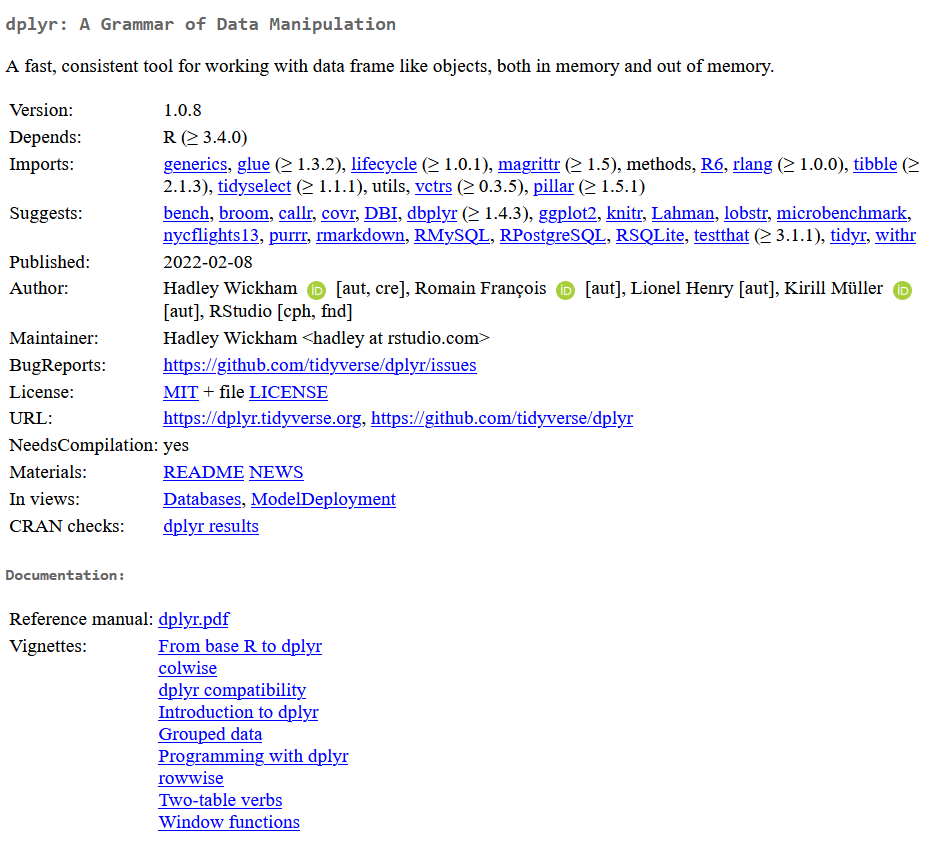
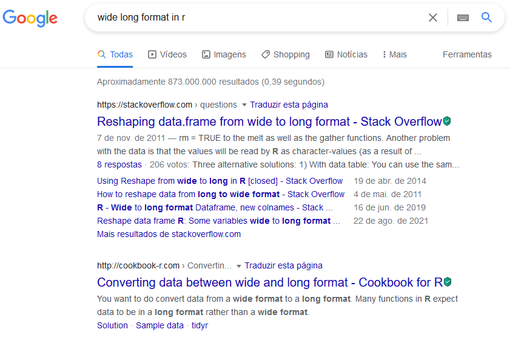
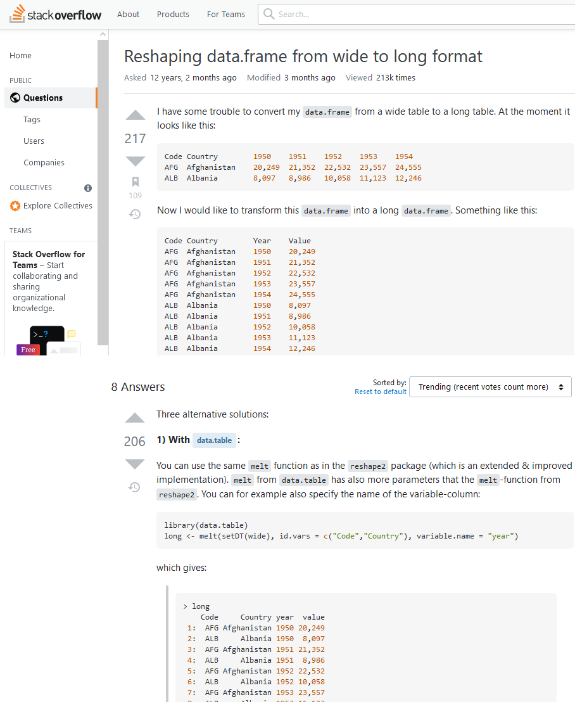

- Based primarily on the courses from [_Especialização em Data Science_](https://www.coursera.org/specializations/jhu-data-science) from Johns Hopkins University (available on Coursera).
- The specialization is not fully free, but you can still audit the courses, which gives access to most of the material even though you cannot complete the graded assignments or receive a certificate. 
- For each topic, I cite the relevant sources and include videos from the courses mentioned above so that you can explore the material further.


## Installing R
- [Installing R (John Hopkins/Coursera)](https://www.coursera.org/learn/data-scientists-tools/lecture/y6mU2/installing-r)

1. Install the base R distribution ([CRAN](https://cran.r-project.org))
    - Download R for Windows > base > Download R X.X.X for Windows
    - If your computer is 64-bit, choose the 64-bit version.

2. Install Rtools ([CRAN](https://cran.r-project.org))
    - Download R for Windows > Rtools > Installing Rtools > rtools40-x86_XX.exe
    - Rtools is a collection of compilation tools for several languages, including C, C++, and Fortran, which some R packages require.

3. Install RStudio ([RStudio Dowload](https://www.rstudio.com/products/rstudio/download/#download))
    - Download RStudio Desktop
    - RStudio is a user interface that makes it easier to work with R.


## Using RStudio
- [RStudio Tour (John Hopkins/Coursera)](https://www.coursera.org/learn/data-scientists-tools/lecture/0fUNC/rstudio-tour)

RStudio is divided into four panes:

- upper-left: source pane, where scripts and notes are edited and saved
- upper-right: environment pane, where you can inspect variables
- lower-left: console pane, where commands run and results appear
- lower-right: files, plots, packages, and help

> **Tip**: Change the RStudio theme if you prefer a darker editor for longer work sessions.<br/>  
Tools > Global Options... > Appearance > Editor theme > Cobalt (meu preferido)


### Working directory
Setting a working directory makes it easier to access the files in your folder, including datasets and scripts.

> Session > Set Working Directory > Choose Directory...

```r
setwd("C:/Users/Fabio/OneDrive/FEA-RP")
```

> **Tip**: The command used to set the working directory will appear in the console. Copy it into your script so you do not need to redefine it every time you open RStudio.

- Note que usa o "slash" (/) ao invés do "backslash" (\\), então não dá para copiar diretamente o endereço de uma pasta e colar no R sem fazer ajustes:
```r
setwd("C:\Users\Fabio\OneDrive\FEA-RP") # ERRADO!
```

```r
setwd("C:/Users/Fabio/OneDrive/FEA-RP") # CORRETO!
setwd("C:\\Users\\Fabio\\OneDrive\\FEA-RP") # CORRETO!
```

You can replace _backslashes_ with _slashes_, or escape them by writing double backslashes.


### Executando comandos
- Direct execution in the console: escreva `1 + 1` no console e dê \<Enter\>

```r
1 + 1
```

```
## [1] 2
```
- Execution from a script: escreva o seguinte código abaixo, e dê `Ctrl + Enter` na linha ou no código destacado. Note que o código do script é "jogado" no console.

```r
rnorm(n=10, mean=0, sd=1)  # Gerar 10 números ~ N(0, 1)
```

```
##  [1] -2.4753553 -1.7254668 -0.6607834 -0.6169755 -1.2807018 -0.7161177
##  [7] -1.2834356 -0.6774113  0.9275769 -0.3290734
```

```r
hist(rnorm(n=1000, mean=0, sd=1))  # Histograma dos números gerados
```


### Help for commands
```r
?rnorm
```

```yaml
rnorm(n, mean = 0, sd = 1)

n: number of observations. If length(n) > 1, the length is taken to be the number required.
mean: vector of means.
sd: vector of standard deviations.
```

- Note acima em "Usage" que já há valores pré-definidos para `mean = 0` e `sd = 1`. Portanto, se você só informar o `n`, a função irá funcionar, considerando os valores pré-definidos para os demais argumentos.
- É possível escrever o código sem os nomes dos argumentos, mas devem ser inseridos na mesma ordem do descrito na Ajuda.
```r
rnorm(10, 0, 1)
```
- Também podemos trocar a ordem explicitando o nome do argumento (NÃO RECOMENDADO)
```r
rnorm(mean=0, n=10, sd=1)
```


## R Packages
- Pacotes são coleções de funções, dados e códigos escritos por outras pessoas
- Por ser um software _open source_, o R possui muitos pacotes disponibilizados pela internet e muitos economistas (principalmente econometristas) já desenvolvem e disponibilizam pacotes com as implementações de seus novos métodos.
- A instalação de um pacote só precisa ser feita uma única vez.
- No entanto, caso você atualize uma nova versão do R, é necessário instalar novamente todos os pacotes.
- Os pacotes podem ser obtidos em bibliotecas (_libraries_), como CRAN, e de individuals (normalmente disponibilizados no GitHub)
- O CRAN é administrado e, como existe uma curadoria para inserção e manutenção de pacotes, garante qualidade dos pacotes disponibilizados
- Tome cuidado com pacotes disponibilizados por individuos! É possível executar, dentro do R, códigos para criar e apagar arquivos, por exemplo.


### Installation via CRAN
> quadrante inferior/direito > Packages > Install > (Nomes dos pacotes)

```r
install.packages("ggplot2") # Pacote para criar graficos
```

### Installation via GitHub
- Primeiro, é necessário instalar o pacote `devtools`
```r
install.packages("devtools")
```
- Depois, é preciso obter o nome do author (do GitHub) e nome do pacote. Como exemplo, iremos baixar o pacote `dplyr` do autor `hadley` (este pacote, na realidade, pode ser baixado direto do CRAN).
- Para executar uma função de um pacote, podemos usar `<pacote>::<funcao>`
```r
devtools::install_github("hadley/dplyr")
```

- Ou é possível carregar o pacote no ambiente e, depois, chamar a função do pacote carregado
```r
library(devtools)
install_github("hadley/dplyr")
```

- CUIDADO! Ao carregar varios pacotes, talvez tenha 2 funções com mesmo nome
    - R prioriza a função do pacote carregado por último

```r
library(dplyr) # Pacote para manipulacao de base de dados
```

```
## Warning: package 'dplyr' was built under R version 4.2.2
```

```
## 
## Attaching package: 'dplyr'
```

```
## The following objects are masked from 'package:stats':
## 
##     filter, lag
```

```
## The following objects are masked from 'package:base':
## 
##     intersect, setdiff, setequal, union
```

```r
library(MASS) # Normalmente nao eh carregado diretamente (via outro pacote)
```

```
## Warning: package 'MASS' was built under R version 4.2.2
```

```
## 
## Attaching package: 'MASS'
```

```
## The following object is masked from 'package:dplyr':
## 
##     select
```

- Uma forma de contornar o problema é usar `<pacote>::<funcao>`
```r
select(obj) # do pacote MASS
dplyr::select(.data, ...) # do pacote dplyr
```

### Updating packages
> quadrante inferior/direito > Packages > Update > Select All > Install Updates


## Ajuda
- Caso saiba o nome da função, é possível olhar sua documentação escrevendo `?<nome_da_funcao>` (como visto anteriormente)
- Caso saiba o nome do pacote, em alguns casos funciona `?<nome_do_pacote>`, mas o ideal é buscar sua documentação no CRAN (diretamente no site ou via Google)
- Por exemplo, podemos acessar a página do [pacote `dplyr` no CRAN](https://cran.r-project.org/web/packages/dplyr/index.html):
- Nela é possível ver a partir de qual versão do R funciona, os pacotes necessários para o seu funcionamento (Imports), os autores e sites.
- Em Documentação, é possível ver o seu 'Reference manual' onde são expostos o objetivo do pacotes e as funções, incluindo explicações de seu funcionamento.

<center></center>


- Além disso, pode ser interessante ver aplicações do pacote e suas funções nas 'vignettes'. Normalmente são expostas de maneira que podem ser replicadas no seu computador, o que acaba auxiliando na sua aplicação (verificar estrutura de base de dados necessária, sintaxes, etc.). Também pode ser acessada diretamente do R usando a função `browseVignettes()`:

    
```r
browseVignettes("dplyr") # Abrirá uma página com vignettes no seu navegador
```

- Caso não saiba quais funções/pacotes são utilizados para resolver um problema, muitas vezes é possível encontrar a solução no Google utilizando palavras-chave (preferencialmente em inglês) junto de "R".

<center></center>

- Além de sites especializados em R e vídeos com exemplos de aplicações, é comum aparecer questões no site Stack Overflow (ou em Cross Validated, pertencente ao mesmo grupo) que é o site mais utilizado por programadores em diversas linguagens para esclarecer dúvidas.

- Por R ser uma linguagem open source, há muitos usuários e, portanto, é comum achar perguntas/respostas que já solucionam o seu problema. Eventualmente, você pode fazer a sua pergunta, caso não encontre uma satisfatória.

<center></center>


## Sincornização no GitHub
Não será detalhado aqui, mas é algo interessante para olhar.

- [Criação de projetos](https://www.coursera.org/learn/data-scientists-tools/lecture/2o9zr/projects-in-r)
- [Controle de versão](https://www.coursera.org/learn/data-scientists-tools/lecture/PjlHw/version-control)
- [GitHub e Git](https://www.coursera.org/learn/data-scientists-tools/lecture/VOh24/github-and-git)
- [Projetos sob controle de versões](https://www.coursera.org/learn/data-scientists-tools/lecture/wbfrX/projects-under-version-control)




