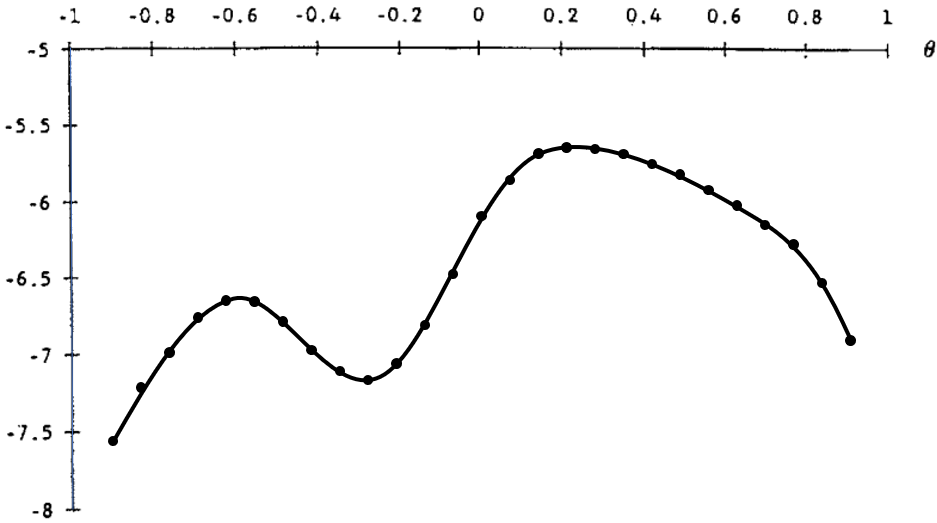
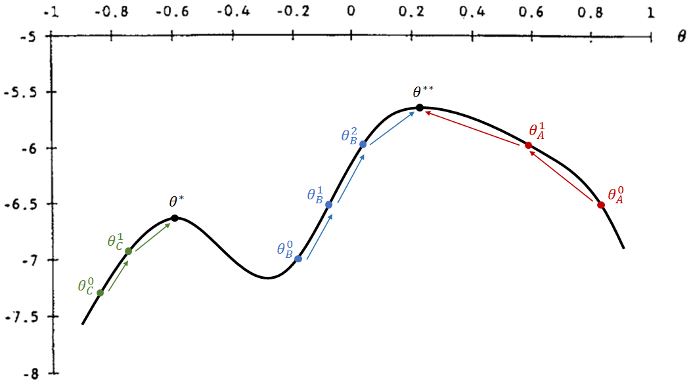

```{r setup, include=FALSE}
knitr::opts_chunk$set(echo = TRUE)
wd = "~/../OneDrive/FEA-RP/Disciplinas/REC5004_Econometria-I/Monitoria-FHN/PNADc" # Aspire
# wd = "~/../FEA-RP/Disciplinas/REC5004_Econometria-I/Monitoria-FHN/PNADc" # Nitro
```


## Otimização numérica
- Essa seção tem o objetivo para dar uma intuição sobre métodos de otimização.
- Veremos os métodos de _grid search_ e _steepest ascent_ que representam famílias de métodos de otimização.


### _Grid Search_

- O método mais simples de otimização numérica é o _grid search_ (discretização).
- Como o R não lida com problemas com infinitos valores, uma forma lidar com isso é discretizando diversos possíveis valores dos parâmetros de escolha dentro de intervalos.
- Para cada possível combinação de parâmetros, calculam-se diversos valores a partir da função objetivo. De todos os valores calculados, escolhe-se a combinação de parâmetros que maximizam (ou minimizam) a função objetivo.
- O exemplo abaixo considera apenas um parâmetro de escolha $\theta$ e, para cada ponto escolhido dentro do intervalo $[-1, 1]$, calcula-se a função objetivo:

<center></center>


- Este é um método robusto a funções com descontinuidades e quinas (não diferenciáveis), e menos sensível a chutes de valores iniciais. (ver método abaixo)
- Porém, este método fica preciso apenas com maiores quantidades de pontos e, como é necessário fazer o cálculo da função objetivo para cada ponto, o _grid search_ tende a ser menos eficiente computacionalmente (demora mais tempo para calcular).


### _Steepest Ascent_


- Conforme o número de parâmetros do modelo cresce, aumenta o número de possíveis combinações entre parâmetros e torna o processo computacional cada vez mais lento.
- Uma forma mais eficiente de encontrar o conjunto de parâmetros que otimizam a função objetivo é por meio do método _steepest ascent_.
- Queremos encontrar o $\theta^{**}$ que é o parâmetro que maximiza globalmente a função objetivo
- Passos para encontrar um máximo:
  1. Comece com algum valor inicial de parâmetro, $\theta^0$
  2. Calcula-se a derivada e avalia-se a possibilidade de "andar para cima" a um valor mais alto
  3. Caso possa, ande na direção correta a $\theta^1$
  4. Repita os passos (2) e (3), andando para um novo $\theta^2, \theta^3, ...$ até atingir um ponto máximo cuja derivada é igual a zero.

<center></center>


- Note que esse método de otimização é sensível ao parâmetro inicial e às descontinuidades da função objetivo.
    - No exemplo, se os chutes iniciais forem $\theta^0_A$ ou $\theta^0_B$, então consegue atingir o máximo global.
    - Já se o chute inicial for $\theta^0_C$, então ele acaba atingindo um máximo local com $\theta^*$ (menor do que o máximo global em $\theta^{**}$).


<video width="500px" height="500px" controls="controls"/>
    <source src="../local-maxima.mp4" type="video/mp4">
</video>

- Por outro lado, é um método mais eficiente, pois calcula-se a função objetivo uma vez a cada passo, além de ser mais preciso nas estimações.


</br>

## Encontrando MQO por diferentes estratégias
- Nesta seção, encontraremos as estimativas de MQO usando as estratégias da (a) teoria da decisão, do (b) método dos momentos e da (c) máxima verossimilhança.
- Em todas elas, usaremos um método de otimização, mas, diferente da seção anterior, queremos achar uma _dupla_ de parâmetros ($ \beta_0 \text{ e } \beta_1$) que otimizam uma função objetivo.


### Base `mtcars`
É necessário carregar o pacote `dplyr` para manipulação da base de dados abaixo.
```{r message=FALSE, warning=FALSE}
library(dplyr)
```

Usaremos dados extraídos da _Motor Trend_ US magazine de 1974, que analisa o
consumo de combustível e 10 aspectos técnicos de 32 automóveis.

No _R_, a base de dados já está incorporada ao programa e pode ser acessada pelo código `mtcars`, contendo a seguinte estrutura:

> - _mpg_: milhas por galão
> - _hp_: cavalos-vapor bruto

Queremos estimar o seguinte modelo:
$$ \text{mpg} = \beta_0 + \beta_1 \text{hp} + u $$

```{r}
## Regressao MQO
lm(formula = mpg ~ hp, data = mtcars)
```


### (a) Teoria da Decisão
- A função objetivo adotada pela Teoria da Decisão é a **função de soma dos quadrados dos resíduos**
- Por essa estratégia da teoria da decisão, queremos encontrar as estimativas, $\hat{\beta}_0\ \text{e}\ \hat{\beta}_1 $, que **minimizam** essa função.


#### 1. Criar função perda que calcula a soma dos desvios quadráticos
- A função para calcular a soma dos desvios quadráticos recebe como inputs:
  - um **vetor** de possíveis valores para $\hat{\beta}_0$, $\hat{\beta}_1$
  - um **texto** com o nome da variável dependente
  - um **vetor de texto** com os nomes dos regressores
  - uma base de dados
```{r}
resid_quad = function(params, yname, Xnames, data) {
  # Extraindo os parâmetros para objetos
  bhat = matrix(params, ncol=1)
  y = as.matrix(data[,yname])
  X = as.matrix( cbind(const=1, data[,Xnames]) )
  
  yhat = X %*% bhat # valores ajustados
  uhat = y - yhat # desvios = observados - ajustados
  sum(uhat^2)
}
```


#### 2. Otimização
- Agora encontraremos os parâmetros que minimizam a função perda

$$ \underset{\hat{\beta}_0, \hat{\beta}_1}{\text{argmin}} \sum_{i=1}^{N}\hat{u}^2 \quad = \quad \underset{\hat{\beta}_0, \hat{\beta}_1}{\text{argmin}} \sum_{i=1}^{N}\left( \text{mpg}_i - \widehat{\text{mpg}}_i \right)^2 $$

- Para isto usaremos a função `optim()` que retorna os parâmetros que minimizam uma função (equivalente ao _argmin_):
```yaml
optim(par, fn, gr = NULL, ...,
      method = c("Nelder-Mead", "BFGS", "CG", "L-BFGS-B", "SANN", "Brent"),
      lower = -Inf, upper = Inf,
      control = list(), hessian = FALSE)

par: Initial values for the parameters to be optimized over.
fn: A function to be minimized (or maximized), with first argument the vector of parameters over which minimization is to take place. It should return a scalar result.
method: The method to be used. See ‘Details’. Can be abbreviated.
hessian: Logical. Should a numerically differentiated Hessian matrix be returned?
```
- Colocaremos como input:
  - a função perda criada `resid_quad()`
  - um chute inicial dos parâmetros
    - Note que a estimação pode ser mais ou menos sensível ao valores iniciais, dependendo do método de otimização utilizado
    - O mais comum é encontrar como chute inicial um vetor de zeros `c(0, 0, 0)`, por ser mais neutro em relação ao sinal das estimativas
    - Em Econometria III, prof. Laurini recomendou usar método "Nelder-Mead" (padrão) com um chute inicial de zeros e, depois, usar suas estimativas como chute inicial para o método "BFGS".
  - Por padrão, temos o argumento `hessian = FALSE`, coloque `TRUE` para calcularmos o erro padrão, estatística t e p-valor das estimativas

```{r}
# Estimação por BFGS
theta_ini = c(0, 0) # Chute inicial de beta_0, beta_1 e beta_2

fit_ols2 = optim(par=theta_ini, fn=resid_quad, 
                 yname="mpg", Xnames="hp", data=mtcars,
                 method="BFGS", hessian=TRUE)
fit_ols2
```


### (b) Máxima verossimilhança
- [ResEcon 703](https://github.com/woerman/ResEcon703) - Week 6 (University of Massachusetts Amherst)
- A função objetivo é a função de verossimilhança e, ao contrário da função de soma de quadrado dos resíduos, queremos maximizá-la
- Em nosso exemplo, temos que estimar 3 parâmetros
$$ \theta = \left( \beta_0, \beta_1, \sigma^2 \right). $$


#### Otimização Numérica para MLE
A função `optim()` do R será usada novamente para desempenhar a otimização numérica. Precisamos usar como input:

- Alguns valores inicias dos parâmetros, $\theta^0 = \{ \beta_0, \beta_1, \sigma^2 \}$
- Uma função que tome esses parâmetros como um argumento e calcule a 
log-verossimilhança, $\ln{L(\theta)}$.

> Como `optim()` irá encontrar os parâmetros que minimizem a função objetivo, precisamos adaptar o output da função de log-verossimilhança (minimizaremos o negativo da log-lik).

A função log-verossimilhança é dada por
$$ \ln{L(\beta, \sigma^2 | y, X)} = \sum^n_{i=1}{\ln{f(y_i | x_i, \beta, \sigma^2)}}, $$
em que a distribuição condicional de cada $y_i$ é
$$ y_i | x_i \sim \mathcal{N}(x_i \beta, \sigma^2) $$

1. Construir matriz $X$ e vetor $y$
2. Calcular os valores ajustados, $\hat{y}$
3. Calcular a densidade para cada $y_i$, $f(y_i | x_i, \beta, \sigma^2)$
4. Calcular a log-verossimilhança, $\ln{L(\beta, \sigma^2 | y, X)} = \sum^n_{i=1}{\ln{f(y_i | x_i, \beta, \sigma^2)}}$


##### 1. Chute de valores iniciais para $\beta_0, \beta_1$ e $\sigma^2$
- Note que, diferente da estimação por MQO, um dos parâmetros a ser estimado via MLE é a variância ($\sigma^2$).
```{r}
params = c(30, -0.06, 1)
# (beta_0, beta_1 , sigma2)
```

##### 2. Seleção da base de dados e variáveis
```{r}
## Adicionando colunas de 1's para o termo constante
yname = "mpg"
Xnames = "hp"
data = mtcars

bhat = matrix(params[1:(length(params)-1)], ncol=1)
sigma2 = params[length(params)]
y = as.matrix(data[,yname])
X = as.matrix( cbind(const=1, data[,Xnames]) )
```

##### 3. Cálculo dos valores ajustados e das densidades
```{r}
## Calculando valores ajustados de y
yhat = X %*% bhat
```

##### 4. Cálculo das densidades
$$ f(y_i | x_i, \beta, \sigma^2) $$
```{r}
## Calculando os pdf's de cada outcome
ypdf = dnorm(y, mean = yhat, sd = sqrt(sigma2))

head(ypdf) # Primeiros valores da densidade
prod(ypdf) # Verossimilhança
```

- Para entender melhor o que estamos fazendo aqui, relembre que, na estimação por máxima verossimilhança, assume-se que
$$u | X \sim N(0, \sigma^2)$$

- No exemplo abaixo, podemos ver que, para cada $x$, temos um valor ajustado $\hat{y} = \beta_0 + \beta_1 x$ e seus desvios $u$ são normalmente distribuídos com a mesma variância $\sigma^2$

<center></center>

- Agora, vamos juntar o data frame `mtcars` com os valores ajustados `mpg_hat` e as densidades `y_pdf`:
```{r}
# Juntando as bases e visualizando os primeiros valores
head( data.frame(y, X, yhat, ypdf) )
```
- Como pode ser visto na base de dados juntada e nos gráficos abaixo, quanto mais próximo o valor ajustado for do valor observado de cada observação, maior será a densidade/probabilidade.
```{r}
# Criando gráfico para os 2 primeiros carros (Mazda RX4 e Mazda RX 4 Wag)
qt_norm = seq(20, 27, by=0.1) # valores de mpg ("escores Z")

# Mazda RX4
pdf_norm1 = dnorm(qt_norm, mean=yhat[1], sd=sqrt(sigma2)) # pdf
plot(qt_norm, pdf_norm1, type="l", xlab="mpg", ylab="densidade", main="Mazda RX4")
abline(v=c(yhat[1], y[1]), col="red")
text(c(yhat[1], y[1]), 0.2, 
     c(expression(widehat(mpg)[1]), expression(mpg[1])), 
     pos=2, srt=90, col="red")

# Mazda RX4 Wag 
pdf_norm2 = dnorm(qt_norm, mean=yhat[2], sd=sqrt(sigma2)) # pdf
plot(qt_norm, pdf_norm2, type="l", xlab="mpg", ylab="densidade", main="Mazda RX4 Wag")
abline(v=c(yhat[2], y[2]), col="blue")
text(c(yhat[2], y[2]), 0.2, 
     c(expression(widehat(mpg)[2]), expression(mpg[2])), 
     pos=2, srt=90, col="blue")
```
- Logo, a verossimilhança (produto de todas probabilidades) será maior quanto mais próximos forem os valores ajustados dos seus respectivos valores observados.


##### 5. Calculando a Log-Verossimilhança
$$ \mathcal{l}(\beta, \sigma^2) = \sum^{N}_{i=1}{\ln\left[ f(y_i | x_i, \beta, \sigma^2) \right]} $$
```{r}
## Calculando a log-verossimilhanca
loglik = sum(log(ypdf))
loglik
```


##### 6. Criando a Função de Log-Verossimilhança
```{r}
## Criando funcao para calcular log-verossimilhanca MQO 
loglik_lm = function(params, yname, Xnames, data) {
  # Pegando os parâmetros
  bhat = matrix(params[1:(length(params)-1)], ncol=1)
  sigma2 = params[length(params)]
  y = as.matrix(data[,yname])
  X = as.matrix( cbind(const=1, data[,Xnames]) )
  
  ## Calculando valores ajustados de y
  yhat = X %*% bhat
  
  ## Calculando os pdf's de cada outcome
  ypdf = dnorm(y, mean = yhat, sd = sqrt(sigma2))
  
  ## Calculando a log-verossimilhanca
  loglik = sum(log(ypdf))
  
  ## Retornando o negativo da log-verossimilanca
  -loglik # Negativo, pois optim() minimiza e queremos maximizar
}
```


##### 7. Otimização

Tendo a função objetivo, usaremos `optim()` para *minimizar*
$$ -\ln{L(\beta, \sigma^2 | y, X)} = -\sum^n_{i=1}{\ln{f(y_i | x_i, \beta, \sigma^2)}}. $$
Aqui, **minimizamos o negativo** da log-Verossimilhança para **maximizarmos** (função`optim()` apenas minimiza).

```{r warning=FALSE}
## Maximizando a função log-verossimilhança MQO
mle = optim(par = c(0, 0, 1), fn = loglik_lm,
            yname = "mpg", Xnames = "hp", data = mtcars,
              method = "BFGS", hessian = TRUE)

## Mostrando os resultados da otimização
mle

## Calculando os erros padrão
# hessiano > inversa p/ V_bhat > diagnonal > raiz quadrada
mle_se = sqrt( diag( solve(mle$hessian) ) )

# Visualizando as estimativas e os erros padrão
cbind(mle$par, mle_se)
```


### (c) Estimação por GMM
- [Computing Generalized Method of Moments and Generalized Empirical Likelihood with R (Pierre Chaussé)](https://cran.r-project.org/web/packages/gmm/vignettes/gmm_with_R.pdf)
- [Generalized Method of Moments (GMM) in R - Part 1 (Alfred F. SAM)](https://medium.com/codex/generalized-method-of-moments-gmm-in-r-part-1-of-3-c65f41b6199)


- Para estimar via GMM precisamos construir vetores relacionados aos seguintes momentos:
$$ E(u) = 0 \qquad \text{ e } \qquad E(u'X) = 0 $$
em que $X$ é a matriz de covariadas e $u$ é o desvio. Note que estes são os momentos relacionados ao MQO, dado que este é um caso particular do GMM.


- Relembre que estamos usando a base de dados `mtcars` para estimar o modelo linear:
$$ \text{mpg} = \beta_0 + \beta_1 \text{hp} + u $$
que relaciona o consumo de combustível (em milhas por galão - _mpg_) com a potência (_hp_) do carro.


#### Otimização Numérica para GMM

##### 1. Chute de valores iniciais para $\beta_0$, $\beta_1$ e $\beta_2$
- Vamos criar um vetor com possíveis valores de $\beta_0, \beta_1, \beta_2$:
```{r}
library(dplyr)

params = c(30, -0.06)
yname = "mpg"
Xnames = "hp"
data = mtcars
```

##### 2. Seleção da base de dados e variáveis
```{r}
## Selecionando os parâmetros e variáveis
bhat = matrix(params, ncol=1)
y = as.matrix(data[,yname])
X = as.matrix( cbind(const=1, data[,Xnames]) )
```

##### 3. Cálculo dos valores ajustados e dos desvios
```{r}
## Valores ajustados e desvios
yhat = X %*% bhat
# equivalente a: y_hat = beta_0 + beta_1 * X[,"hp"]

uhat = y - yhat
```

##### 4. Criação da matriz de momentos
- Note que $E(u' X)$ é uma multiplicação matricial, mas a função `gmm()` exige que como input os vetores com multiplicação elemento a elemento do resíduo $u$ com as covariadas $X$ (neste caso: constante, hp, wt)
```{r}
m = X * as.vector(uhat) # matriz de momentos (sem tomar esperança)
head(m)
```
- Note que, como multiplicamos a constante igual a 1 com os desvios $u$, a 1ª coluna corresponde ao momento $E(u)=0$ (mas sem tomar a esperança).
- Já as colunas 2 e 3 correspodem ao momento $E(u'X)=0$ para as variáveis _hp_ e _wt_ (também sem tomar a esperança).
- Logicamente, para estimar por GMM, precisamos escolher os parâmetros $\theta = \{ \beta_0, \beta_1, \beta_2 \}$ que, ao tomar a esperança em cada um destas colunas, se aproximem ao máximo de zero. Isso será feito via função `gmm()` (semelhante à função `optim()`)


##### 5. Criação de função com os momentos
- Vamos criar uma função que tem como input um vetor de parâmetros (`params`) e uma base de dados (`data`), e que retorna uma matriz em que cada coluna representa um momento.
- Essa função incluirá todos os comandos descritos nos itens 1 a 4 (que, na verdade, apenas foram feitos por didática).
```{r}
mom_ols = function(params, list) {
  # No GMM, só pode ter 1 input que não sejam os parâmetros
  # Por isso, foi incluído uma lista com 3 argumentos
  yname = list[[1]]
  Xnames = list[[2]]
  data = list[[3]]
  
  ## Selecionando os parâmetros e variáveis
  bhat = matrix(params, ncol=1)
  y = as.matrix(data[,yname])
  X = as.matrix( cbind(const=1, data[,Xnames]) )
  
  ## Valores ajustados e desvios
  yhat = X %*% bhat
  uhat = y - yhat
  
  m = X * as.vector(uhat) # matriz de momentos (vetor - multiplicação por elemento)
  m
}
```


##### 6. Otimização via função `gmm()`
- A função `gmm()`, assim como a `optim()`, recebe uma função como argumento.
- No entanto, ao invés de retornar um valor, a função que entra no `gmm()` retorna uma matriz, cujas médias das colunas queremos aproximar de zero. 
```{r}
library(gmm)

gmm_lm = gmm(g=mom_ols, x=list(yname="mpg", Xnames="hp", data=mtcars), t0=c(0,0),
             wmatrix = "optimal", # matriz de ponderação
             optfct = "nlminb" # função de otimização
             )

summary(gmm_lm)$coefficients
```


