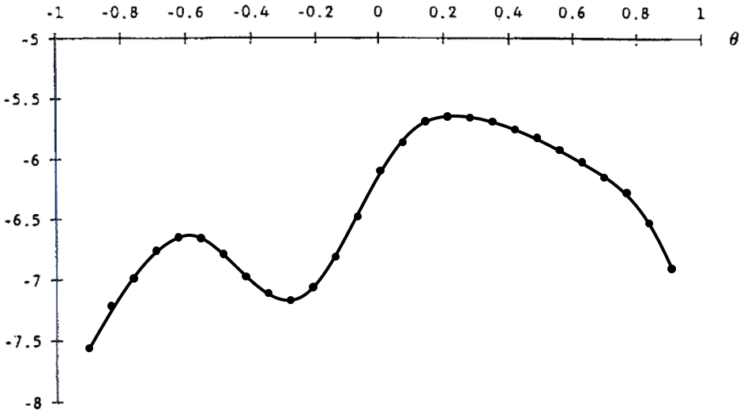
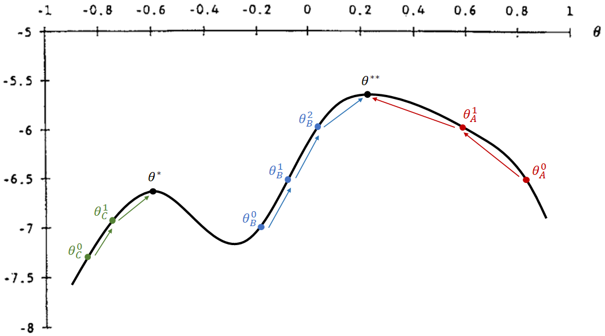

## Otimização numérica
- Essa seção tem o objetivo para dar uma intuição sobre métodos de otimização.
- Veremos os métodos de _grid search_ e _gradient ascent_ (_descent_) que representam famílias de métodos de otimização.


### _Grid Search_

- O método mais simples de otimização numérica é o _grid search_ (discretização).
- Como o R não lida com problemas com infinitos valores, uma forma lidar com isso é discretizando diversos possíveis valores dos parâmetros de escolha dentro de intervalos.
- Para cada possível combinação de parâmetros, calculam-se diversos valores a partir da função objetivo. De todos os valores calculados, escolhe-se a combinação de parâmetros que maximizam (ou minimizam) a função objetivo.
- O exemplo abaixo considera apenas um parâmetro de escolha $\theta$ e, para cada ponto escolhido dentro do intervalo $[-1, 1]$, calcula-se a função objetivo:

<center></center>


- Este é um método robusto a funções com descontinuidades e quinas (não diferenciáveis), e menos sensível a chutes de valores iniciais. (ver método abaixo)
- Porém, este método fica preciso apenas com maiores quantidades de pontos e, como é necessário fazer o cálculo da função objetivo para cada ponto, o _grid search_ tende a ser menos eficiente computacionalmente (demora mais tempo para calcular).


### _Gradient Ascent (Descent)_


- Conforme o número de parâmetros do modelo cresce, aumenta o número de possíveis combinações entre parâmetros e torna o processo computacional cada vez mais lento.
- Uma forma mais eficiente de encontrar o conjunto de parâmetros que otimizam a função objetivo é por meio do método _gradient ascent_ (_descent_).
- Queremos encontrar o ${\theta}^{**}$ que é o parâmetro que maximiza globalmente a função objetivo
- Passos para encontrar um máximo:
  1. Comece com algum valor inicial de parâmetro, ${\theta}^0$
  2. Calcula-se a derivada e avalia-se a possibilidade de "andar para cima" a um valor mais alto
  3. Caso possa, ande na direção correta a ${\theta}^1$
  4. Repita os passos (2) e (3), andando para um novo ${\theta}^2, {\theta}^3, ...$ até atingir um ponto máximo cuja derivada é igual a zero.

<center></center>


- Note que esse método de otimização é sensível ao parâmetro inicial e às descontinuidades da função objetivo.
    - No exemplo, se os chutes iniciais forem ${\theta}^0_A$ ou ${\theta}^0_B$, então consegue atingir o máximo global.
    - Já se o chute inicial for ${\theta}^0_C$, então ele acaba atingindo um máximo local com ${\theta}^*$ (menor do que o máximo global em ${\theta}^{**}$).


<video width="500px" height="500px" controls="controls"/>
    <source src="../local-maxima.mp4" type="video/mp4">
</video>

- Por outro lado, é um método mais eficiente, pois calcula-se a função objetivo uma vez a cada passo, além de ser mais preciso nas estimações.


</br>

## Encontrando MQO por diferentes estratégias
- Nesta seção, encontraremos as estimativas de MQO usando as estratégias da (a) minimização da função perda, de (b) máxima verossimilhança e de (c) método dos momentos.
- Em cada uma delas, usaremos uma função objetivo distinta para encontrar o vetor com dois parâmetros, $ \boldsymbol{\theta} = \{ \beta_0, \beta_1 \} $, que a otimiza. No R, vamos chamar esse vetor de `params`.


### Base `mtcars`
É necessário carregar o pacote `dplyr` para manipulação da base de dados abaixo.

```r
library(dplyr)
```

Usaremos dados extraídos da _Motor Trend_ US magazine de 1974, que analisa o
consumo de combustível e 10 aspectos técnicos de 32 automóveis.

No _R_, a base de dados já está incorporada ao programa e pode ser acessada pelo código `mtcars`, contendo a seguinte estrutura:

> - _mpg_: milhas por galão
> - _hp_: cavalos-vapor bruto

Queremos estimar o seguinte modelo:
 $$ \text{mpg} = \beta_0 + \beta_1 \text{hp} + \varepsilon $$ 


```r
## Regressao MQO
reg = lm(formula = mpg ~ hp, data = mtcars)
summary(reg)$coef
```

```
##                Estimate Std. Error   t value     Pr(>|t|)
## (Intercept) 30.09886054  1.6339210 18.421246 6.642736e-18
## hp          -0.06822828  0.0101193 -6.742389 1.787835e-07
```


### (a) Minimização da função perda
- A função perda adotada pela Teoria da Decisão é a **função de soma dos quadrados dos resíduos**
- Por essa estratégia, queremos encontrar as estimativas, $\boldsymbol{\theta} = \{ \hat{\beta}_0,\ \hat{\beta}_1 \}$, que **minimizam** essa função.


#### 1. Criar função perda que calcula a soma dos resíduos quadráticos
- A função para calcular a soma dos resíduos quadráticos recebe como inputs:
  - um **vetor** de possíveis valores $\boldsymbol{\theta} = \{ \hat{\beta}_0,\ \hat{\beta}_1 \}$
  - um **texto** com o nome da variável dependente
  - um **vetor de texto** com os nomes dos regressores
  - uma base de dados

```r
resid_quad = function(params, yname, xname, data) {
  # Extraindo as variáveis da base em vetores
  y = as.matrix(data[yname])
  x = as.matrix(data[xname])
  
  # Extraindo os parâmetros de params
  b0 = params[1]
  b1 = params[2]
  sig2 = params[3]
  
  yhat = b0 + b1 * x # valores ajustados
  e_hat = y - yhat # desvios = observados - ajustados
  sum(e_hat^2)
}
```


#### 2. Otimização
- Agora encontraremos os parâmetros que minimizam a função perda

$$ \underset{\hat{\beta}_0, \hat{\beta}_1}{\text{argmin}} \sum_{i=1}^{N}\hat{u}^2 \quad = \quad \underset{\hat{\beta}_0, \hat{\beta}_1}{\text{argmin}} \sum_{i=1}^{N}\left( \text{mpg}_i - \widehat{\text{mpg}}_i \right)^2 $$

- Para isto usaremos a função `optim()` que retorna os parâmetros que minimizam uma função (equivalente ao _argmin_):
```yaml
optim(par, fn, gr = NULL, ...,
      method = c("Nelder-Mead", "BFGS", "CG", "L-BFGS-B", "SANN", "Brent"),
      lower = -Inf, upper = Inf,
      control = list(), hessian = FALSE)

par: Initial values for the parameters to be optimized over.
fn: A function to be minimized (or maximized), with first argument the vector of parameters over which minimization is to take place. It should return a scalar result.
method: The method to be used. See ‘Details’. Can be abbreviated.
hessian: Logical. Should a numerically differentiated Hessian matrix be returned?
```
- Colocaremos como input:
  - a função perda criada `resid_quad()`
  - um chute inicial dos parâmetros
    - Note que a estimação pode ser mais ou menos sensível ao valores iniciais, dependendo do método de otimização utilizado
    - O mais comum é encontrar como chute inicial um vetor de zeros `c(0, 0, 0)`, por ser mais neutro em relação ao sinal das estimativas
    - Em Econometria III, prof. Laurini recomendou usar método "Nelder-Mead" (padrão) com um chute inicial de zeros e, depois, usar suas estimativas como chute inicial para o método "BFGS".
  - Por padrão, temos o argumento `hessian = FALSE`, coloque `TRUE` para calcularmos o erro padrão, estatística t e p-valor das estimativas


```r
# Estimação por BFGS
theta_ini = c(0, 0) # Chute inicial de b0, b1

fit_ols2 = optim(par=theta_ini, fn=resid_quad, 
                 yname="mpg", xname="hp", data=mtcars,
                 method="BFGS", hessian=TRUE)
fit_ols2
```

```
## $par
## [1] 30.09886054 -0.06822828
## 
## $value
## [1] 447.6743
## 
## $counts
## function gradient 
##       31        5 
## 
## $convergence
## [1] 0
## 
## $message
## NULL
## 
## $hessian
##      [,1]    [,2]
## [1,]   64    9388
## [2,] 9388 1668556
```


### (b) Máxima Verossimilhança
- [ResEcon 703](https://github.com/woerman/ResEcon703) - Week 6 (University of Massachusetts Amherst)
- A função objetivo é a função de verossimilhança e, ao contrário da função de soma de quadrado dos resíduos, queremos maximizá-la
- Em nosso exemplo, temos que estimar 3 parâmetros

$$ \boldsymbol{\theta} = \left\{ \beta_0, \beta_1, \sigma^2 \right\}. $$


#### Otimização Numérica para Máxima Verossimilhança
A função `optim()` do R será usada novamente para desempenhar a otimização numérica. Precisamos usar como input:

- Alguns valores inicias dos parâmetros, $\boldsymbol{\theta}^0 = \{ \beta_0, \beta_1, \sigma^2 \}$
- Uma função que tome esses parâmetros como um argumento e calcule a 
log-verossimilhança, $\ln{L(\boldsymbol{\theta})}$.

> Como `optim()` irá encontrar os parâmetros que minimizem a função objetivo, precisamos adaptar o output da função de log-verossimilhança (minimizaremos o negativo da log-lik).

A função log-verossimilhança é dada por
$$ \ln{L(\beta_0, \beta_1, \sigma^2 | y, x)} = \sum^n_{i=1}{\ln{f(y_i | x_i, \beta_0, \beta_1, \sigma^2)}}, $$

em que a distribuição condicional de cada $y_i$ é

$$ y_i | x_i \sim \mathcal{N}(\beta_0 + \beta_1 x_i, \sigma^2) $$

o que implica que 

$$\varepsilon_i | x_i \sim N(0, \sigma^2)$$

<center></center>

- Acima, podemos ver que, para cada $x$, temos um valor ajustado $\hat{y} = \beta_0 + \beta_1 x$ e seus desvios $\varepsilon$ são normalmente distribuídos com a mesma variância $\sigma^2$


Passos para estimar uma regressão por máxima verossimilhança:

1. Chutar valores iniciais de 
2. Calcular os valores ajustados, $\hat{y}$
3. Calcular a densidade para cada $y_i$, $f(y_i | x_i, \beta_0, \beta_1, \sigma^2)$
4. Calcular a log-verossimilhança, $\ln{L(\beta_0, \beta_1, \sigma^2 | y, x)} = \sum^n_{i=1}{\ln{f(y_i | x_i, \beta_0, \beta_1, \sigma^2)}}$


##### 1. Chute de valores iniciais para $\beta_0, \beta_1$ e $\sigma^2$
- Note que, diferente da estimação por MQO, um dos parâmetros a ser estimado via MLE é a variância ($\sigma^2$).

```r
params = c(30, -0.06, 1)
# (b0, b1 , sig2)
```

##### 2. Seleção da base de dados e variáveis

```r
## Inicializando
yname = "mpg"
xname = "hp"
data = mtcars

# Extraindo as variáveis da base em vetores
y = as.matrix(data[yname])
x = as.matrix(data[xname])

# Extraindo os parâmetros de params
b0 = params[1]
b1 = params[2]
sig2 = params[3]
```

##### 3. Cálculo dos valores ajustados e das densidades

```r
## Calculando valores ajustados de y
yhat = b0 + b1 * x
head(yhat)
```

```
##                      hp
## Mazda RX4         23.40
## Mazda RX4 Wag     23.40
## Datsun 710        24.42
## Hornet 4 Drive    23.40
## Hornet Sportabout 19.50
## Valiant           23.70
```

##### 4. Cálculo das densidades
$$ f(y_i | x_i, \beta_0, \beta_1, \sigma^2) $$

```r
## Calculando os pdf's de cada linha
ypdf = dnorm(y, mean = yhat, sd = sqrt(sig2))

head(round(ypdf, 4)) # Primeiros valores da densidade
```

```
##                      mpg
## Mazda RX4         0.0224
## Mazda RX4 Wag     0.0224
## Datsun 710        0.1074
## Hornet 4 Drive    0.0540
## Hornet Sportabout 0.2897
## Valiant           0.0000
```

```r
sum(ypdf) # Verossimilhança
```

```
## [1] 2.447628
```

```r
prod(ypdf) # Log-Verossimilhança
```

```
## [1] 2.201994e-121
```
- Agora, vamos juntar visualizar os 6 primeiros elementos dos objetos trabalhados:

```r
# Juntando as bases e visualizando os primeiros valores
tab = cbind(y, x, yhat, round(ypdf, 4)) # arredondando ypdf (4 dígitos)
colnames(tab) = c("y", "x", "yhat", "ypdf") # renomeando colunas
head(tab)
```

```
##                      y   x  yhat   ypdf
## Mazda RX4         21.0 110 23.40 0.0224
## Mazda RX4 Wag     21.0 110 23.40 0.0224
## Datsun 710        22.8  93 24.42 0.1074
## Hornet 4 Drive    21.4 110 23.40 0.0540
## Hornet Sportabout 18.7 175 19.50 0.2897
## Valiant           18.1 105 23.70 0.0000
```
- Como pode ser visto na base de dados juntada e nos gráficos abaixo, quanto mais próximo o valor ajustado for do valor observado de cada observação, maior será a densidade/probabilidade.

- Logo, a verossimilhança (produto de todas probabilidades) será maior quanto mais próximos forem os valores ajustados dos seus respectivos valores observados.


##### 5. Calculando a Log-Verossimilhança

A log-verossimilhança é a soma do log de todas probabilidades:

$$ \mathcal{l}(\beta_0, \beta_1, \sigma^2) = \sum^{N}_{i=1}{\ln\left[ f(y_i | x_i, \beta_0, \beta_1, \sigma^2) \right]} $$

```r
## Calculando a log-verossimilhanca
loglik = sum(log(ypdf))
loglik
```

```
## [1] -277.8234
```


##### 6. Criando a Função de Log-Verossimilhança

Juntando tudo que fizemos anteriormente, podemos criar uma função no R que calcular a função de log-verossimilhança.


```r
## Criando funcao para calcular log-verossimilhanca MQO 
loglik_lm = function(params, yname, xname, data) {
  # Extraindo as variáveis da base em vetores
  y = as.matrix(data[yname])
  x = as.matrix(data[xname])
  
  # Extraindo os parâmetros de params
  b0 = params[1]
  b1 = params[2]
  sig2 = params[3]
  
  ## Calculando valores ajustados de y
  yhat = b0 + b1 * x
  
  ## Calculando os pdf's de cada linha
  ypdf = dnorm(y, mean = yhat, sd = sqrt(sig2))
  
  ## Calculando a log-verossimilhanca
  loglik = sum(log(ypdf))
  
  ## Retornando o negativo da log-verossimilanca
  -loglik # Negativo, pois optim() minimiza e queremos maximizar
}
```


##### 7. Otimização

Tendo a função objetivo, usaremos `optim()` para *minimizar*

$$ -\ln{L(\beta_0, \beta_1, \sigma^2 | y, X)} = -\sum^n_{i=1}{\ln{f(y_i | x_i, \beta_0, \beta_1, \sigma^2)}}. $$

Aqui, **minimizamos o negativo** da log-Verossimilhança para **maximizarmos** (função`optim()` apenas minimiza).


```r
## Maximizando a função log-verossimilhança MQO
mle = optim(par = c(0, 0, 1), fn = loglik_lm,
            yname = "mpg", xname = "hp", data = mtcars,
              method = "BFGS", hessian = TRUE)

## Mostrando os resultados da otimização
mle
```

```
## $par
## [1] 30.09908613 -0.06822967 13.99015277
## 
## $value
## [1] 87.61931
## 
## $counts
## function gradient 
##       84       28 
## 
## $convergence
## [1] 0
## 
## $message
## NULL
## 
## $hessian
##               [,1]         [,2]          [,3]
## [1,]  2.287323e+00 3.355217e+02 -3.520739e-06
## [2,]  3.355217e+02 5.963323e+04  5.199112e-04
## [3,] -3.520739e-06 5.199112e-04  8.174375e-02
```

```r
## Calculando os erros padrão
# hessiano > inversa p/ V_bhat > diagnonal > raiz quadrada
mle_se = sqrt( diag( solve(mle$hessian) ) )

# Visualizando as estimativas e os erros padrão
cbind(mle$par, mle_se)
```

```
##                      mle_se
## [1,] 30.09908613 1.58205585
## [2,] -0.06822967 0.00979809
## [3,] 13.99015277 3.49762080
```


### (c) Método dos Momentos
- [Computing Generalized Method of Moments and Generalized Empirical Likelihood with R (Pierre Chaussé)](https://cran.r-project.org/web/packages/gmm/vignettes/gmm_with_R.pdf)
- [Generalized Method of Moments (GMM) in R - Part 1 (Alfred F. SAM)](https://medium.com/codex/generalized-method-of-moments-gmm-in-r-part-1-of-3-c65f41b6199)


- Para estimar via GMM precisamos construir vetores relacionados aos seguintes momentos:

$$ E(\boldsymbol{\varepsilon}) = 0 \qquad \text{ e } \qquad E(\boldsymbol{\varepsilon}' \boldsymbol{x}) = 0 $$

Note que estes são os momentos relacionados ao MQO, dado que este é um caso particular do GMM. Os análogos amostrais são

$$ \frac{1}{N} \sum^N_{i=1}{\hat{\varepsilon}_i} = 0 \qquad \text{ e } \qquad \frac{1}{N} \sum^N_{i=1}{\hat{\varepsilon}_i.x_i} = 0 $$

Podemos calcular os dois momentos amostrais em uma única multiplicação matricial. Considere:

$$ \hat{\boldsymbol{\varepsilon}} = \begin{bmatrix} \varepsilon_1 \\ \varepsilon_2 \\ \vdots \\ \varepsilon_N \end{bmatrix} \qquad \text{e} \qquad \boldsymbol{x} = \begin{bmatrix} x_1 \\ x_2 \\ \vdots \\ x_N \end{bmatrix} $$

Vamos juntar uma coluna de 1's com $\boldsymbol{x}$ e definir a matriz:
$$ \boldsymbol{X} = \begin{bmatrix} 1 & \varepsilon_1 \\ 1 & \varepsilon_2 \\ \vdots & \vdots \\ 1 & \varepsilon_N \end{bmatrix} $$

Fazendo a multiplicação matricia entre $\hat{\boldsymbol{\varepsilon}}$ e $\boldsymbol{X}$, temos:

$$ \hat{\boldsymbol{\varepsilon}}' \boldsymbol{X}\ =\ \begin{bmatrix} \varepsilon_1 & \varepsilon_2 & \cdots & \varepsilon_N \end{bmatrix} \begin{bmatrix} 1 & x_1 \\ 1 & x_2 \\ \vdots & \vdots \\ 1 & x_N \end{bmatrix}\ =\ \begin{bmatrix}  \frac{1}{N} \sum^N_{i=1}{\hat{\varepsilon}} & \frac{1}{N} \sum^N_{i=1}{\hat{\varepsilon}.x_i} \end{bmatrix} $$

Note que o vetor resultante são exatamente os momentos amostrais.


#### Otimização Numérica para GMM

##### 1. Chute de valores iniciais para $\beta_0$ e $\beta_1$
- Vamos criar um vetor com possíveis valores de $\beta_0, \beta_1$:

```r
params = c(30, -0.06)
yname = "mpg"
xname = "hp"
data = mtcars
```

##### 2. Seleção da base de dados e variáveis

```r
# Extraindo as variáveis da base em vetores
y = as.matrix(data[yname])
x = as.matrix(data[xname])
X = cbind(1, x)

# Extraindo os parâmetros de params
b0 = params[1]
b1 = params[2]
sig2 = params[3]
```

##### 3. Cálculo dos valores ajustados e dos resíduos

```r
## Valores ajustados de y
yhat = b0 + b1 * x

## Resíduos
e_hat = y - yhat
```


##### 4. Criação da matriz de momentos
- Note que $\hat{\boldsymbol{\varepsilon}}' X$ um vetor dos momentos amostrais, mas a função `gmm()` exige uma matriz com **multiplicação elemento a elemento** do resíduo $\hat{\boldsymbol{\varepsilon}}$ com as covariadas $\boldsymbol{X}$ (neste caso: constante e hp), na forma:

$$ \hat{\boldsymbol{\varepsilon}} \times \boldsymbol{X}\ =\ \begin{bmatrix} \varepsilon_1 \\ \varepsilon_2 \\ \vdots \\ \varepsilon_N \end{bmatrix} \times \begin{bmatrix} 1 & x_1 \\ 1 & x_2 \\ \vdots & \vdots \\ 1 & x_N \end{bmatrix}\ =\ \begin{bmatrix} \varepsilon_1 & \varepsilon_1.x_1  \\ \varepsilon_2 & \varepsilon_2.x_2 \\ \vdots & \vdots \\ \varepsilon_N & \varepsilon_N.x_N \end{bmatrix} $$
Note que, para fazer o GMM no R, não devemos tirar a média de cada coluna (a própria função `gmm()` fará isso).


```r
# Matriz de momentos
m = as.numeric(e_hat) * X 
head(m) # 6 primeiras linhas
```

```
##                              hp
## Mazda RX4         -2.40 -264.00
## Mazda RX4 Wag     -2.40 -264.00
## Datsun 710        -1.62 -150.66
## Hornet 4 Drive    -2.00 -220.00
## Hornet Sportabout -0.80 -140.00
## Valiant           -5.60 -588.00
```

```r
apply(m, 2, sum) # média de cada coluna
```

```
##                hp 
##   -35.46 -6400.62
```
- Note que, como multiplicamos a constante igual a 1 com os desvios $\varepsilon$, a 1ª coluna corresponde ao momento $E(\varepsilon)=0$ (mas sem tomar a esperança).
- Já as colunas 2 e 3 correspodem ao momento $E(\varepsilon'X)=0$ para as variáveis _hp_ e _wt_ (também sem tomar a esperança).
- Logicamente, para estimar por GMM, precisamos escolher os parâmetros $\theta = \{ \beta_0, \beta_1 \}$ que, ao tomar a esperança em cada um destas colunas, se aproximem ao máximo de zero. Isso será feito via função `gmm()` (semelhante à função `optim()`)


##### 5. Criação de função com os momentos
- Vamos criar uma função que tem como input um vetor de parâmetros (`params`) e uma base de dados (`data`), e que retorna uma matriz em que cada coluna representa um momento.
- Essa função incluirá todos os comandos descritos nos itens 1 a 4 (que, na verdade, apenas foram feitos por didática).

```r
mom_ols = function(params, list) {
  # No GMM, só pode ter 1 input que não sejam os parâmetros
  # Por isso, foi incluído uma lista com 3 argumentos
  yname = list[[1]]
  xname = list[[2]]
  data = list[[3]]
  
  # Extraindo as variáveis da base em vetores
  y = as.matrix(data[yname])
  x = as.matrix(data[xname])
  X = cbind(1, x)
  
  # Extraindo os parâmetros de params
  b0 = params[1]
  b1 = params[2]
  sig2 = params[3]
  
  ## Valores ajustados de y
  yhat = b0 + b1 * x
  
  ## Resíduos
  e_hat = y - yhat
  
  ## Matriz de momentos
  m = as.numeric(e_hat) * X
  m # output da função
}
```


##### 6. Otimização via função `gmm()`
- A função `gmm()`, assim como a `optim()`, recebe uma função como argumento.
- No entanto, ao invés de retornar um valor, a função que entra no `gmm()` retorna uma matriz, cujas médias das colunas queremos aproximar de zero. 

```r
library(gmm)
```

```
## Carregando pacotes exigidos: sandwich
```

```r
gmm_lm = gmm(g=mom_ols, 
             x=list(yname="mpg", xname="hp", data=mtcars), # argumentos função
             t0=c(0,0), # chute inicial de params
             wmatrix = "optimal", # matriz de ponderação
             optfct = "nlminb" # função de otimização
             )

summary(gmm_lm)$coefficients
```

```
##             Estimate Std. Error   t value     Pr(>|t|)
## Theta[1] 30.09886038 2.53115147 11.891371 1.312350e-32
## Theta[2] -0.06822828 0.01540378 -4.429319 9.453096e-06
```


