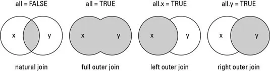

## Summarizing data

### Basic functions
- [Summarizing data (John Hopkins/Coursera)](https://www.coursera.org/learn/data-cleaning/lecture/e5qVi/summarizing-data)
- In this section, we use the `airquality` dataset, which is already available in R.
- We check the dataset **dimensions** with `dim()` and inspect the first and last six rows with `head()` and `tail()`, respectively.

```r
# data() # list of datasets available in R

dim(airquality) # Check dataset size (rows x columns)
```

```
## [1] 153   6
```

```r
head(airquality) # view the first 6 rows
```

```
##   Ozone Solar.R Wind Temp Month Day
## 1    41     190  7.4   67     5   1
## 2    36     118  8.0   72     5   2
## 3    12     149 12.6   74     5   3
## 4    18     313 11.5   62     5   4
## 5    NA      NA 14.3   56     5   5
## 6    28      NA 14.9   66     5   6
```

```r
tail(airquality) # View the last six rows
```

```
##     Ozone Solar.R Wind Temp Month Day
## 148    14      20 16.6   63     9  25
## 149    30     193  6.9   70     9  26
## 150    NA     145 13.2   77     9  27
## 151    14     191 14.3   75     9  28
## 152    18     131  8.0   76     9  29
## 153    20     223 11.5   68     9  30
```
- Using `str()`, we can inspect the **structure** of the dataset:
    - all variables (columns),
    - the class of each variable, and
    - a sample of their observations.

```r
str(airquality)
```

```
## 'data.frame':	153 obs. of  6 variables:
##  $ Ozone  : int  41 36 12 18 NA 28 23 19 8 NA ...
##  $ Solar.R: int  190 118 149 313 NA NA 299 99 19 194 ...
##  $ Wind   : num  7.4 8 12.6 11.5 14.3 14.9 8.6 13.8 20.1 8.6 ...
##  $ Temp   : int  67 72 74 62 56 66 65 59 61 69 ...
##  $ Month  : int  5 5 5 5 5 5 5 5 5 5 ...
##  $ Day    : int  1 2 3 4 5 6 7 8 9 10 ...
```


- To generate a **summary** for all variables in the dataset, we can use `summary()`. For numeric variables, it reports the mean, quartiles, and the number of `NA`s.

```r
summary(airquality)
```

```
##      Ozone           Solar.R           Wind             Temp      
##  Min.   :  1.00   Min.   :  7.0   Min.   : 1.700   Min.   :56.00  
##  1st Qu.: 18.00   1st Qu.:115.8   1st Qu.: 7.400   1st Qu.:72.00  
##  Median : 31.50   Median :205.0   Median : 9.700   Median :79.00  
##  Mean   : 42.13   Mean   :185.9   Mean   : 9.958   Mean   :77.88  
##  3rd Qu.: 63.25   3rd Qu.:258.8   3rd Qu.:11.500   3rd Qu.:85.00  
##  Max.   :168.00   Max.   :334.0   Max.   :20.700   Max.   :97.00  
##  NA's   :37       NA's   :7                                       
##      Month            Day      
##  Min.   :5.000   Min.   : 1.0  
##  1st Qu.:6.000   1st Qu.: 8.0  
##  Median :7.000   Median :16.0  
##  Mean   :6.993   Mean   :15.8  
##  3rd Qu.:8.000   3rd Qu.:23.0  
##  Max.   :9.000   Max.   :31.0  
## 
```
- We can also compute **quantiles** with `quantile()`.

```r
quantile(airquality$Ozone, probs=c(0, .25, .5 , .75, 1), na.rm=TRUE)
```

```
##     0%    25%    50%    75%   100% 
##   1.00  18.00  31.50  63.25 168.00
```

- For logical, text, or categorical variables (`factor`), the output shows the frequency of each category or possible value:

```r
summary(CO2) # dataset 'Carbon Dioxide Uptake in Grass Plants'
```

```
##      Plant             Type         Treatment       conc          uptake     
##  Qn1    : 7   Quebec     :42   nonchilled:42   Min.   :  95   Min.   : 7.70  
##  Qn2    : 7   Mississippi:42   chilled   :42   1st Qu.: 175   1st Qu.:17.90  
##  Qn3    : 7                                    Median : 350   Median :28.30  
##  Qc1    : 7                                    Mean   : 435   Mean   :27.21  
##  Qc3    : 7                                    3rd Qu.: 675   3rd Qu.:37.12  
##  Qc2    : 7                                    Max.   :1000   Max.   :45.50  
##  (Other):42
```
- For text or categorical variables, it is often useful to build a **frequency table** for each possible category. We can do this with `table()`, and we can use `prop.table(table())` to express the same information in **percentages**.

```r
table(CO2$Type) # contagem
```

```
## 
##      Quebec Mississippi 
##          42          42
```

```r
prop.table(table(CO2$Type)) # percentual
```

```
## 
##      Quebec Mississippi 
##         0.5         0.5
```
- We can also include a second variable in `table()` to display counts jointly for two variables:

```r
table(CO2$Type, CO2$Treatment)
```

```
##              
##               nonchilled chilled
##   Quebec              21      21
##   Mississippi         21      21
```


### The _apply_ family of functions
We now look at the _apply_ family, which provides compact ways to run operations in loop form:
- `apply`: applies a function over the margins (rows or columns) of a matrix/array
- `lapply`: loops over a list and evaluates a function on each element
    - the helper function `split` is useful when combined with `lapply`
- `sapply`: similar to `lapply`, but tries to simplify the result


#### The `apply()` function
- [Loop functions - apply (John Hopkins/Coursera)](https://www.coursera.org/learn/r-programming/lecture/IUUhK/loop-functions-apply)
- Used to evaluate array margins through a function
- Frequently used to apply a function to the rows or columns of a matrix
- It is not necessarily faster than writing an explicit loop, but it is concise and readable
```yaml
apply(X, MARGIN, FUN, ...)

X: an array, including a matrix.MARGIN: a vector giving the subscripts which the function will be applied over. E.g., for a matrix 1 indicates rows, 2 indicates columns, c(1, 2) indicates rows and columns. Where X has named dimnames, it can be a character vector selecting dimension names.
FUN: the function to be applied: see ‘Details’. In the case of functions like +, %*%, etc., the function name must be backquoted or quoted.
... : optional arguments to FUN.
```

```r
x = matrix(1:20, 5, 4)
x
```

```
##      [,1] [,2] [,3] [,4]
## [1,]    1    6   11   16
## [2,]    2    7   12   17
## [3,]    3    8   13   18
## [4,]    4    9   14   19
## [5,]    5   10   15   20
```

```r
apply(x, 1, mean) # row means
```

```
## [1]  8.5  9.5 10.5 11.5 12.5
```

```r
apply(x, 2, mean) # column means
```

```
## [1]  3  8 13 18
```
- There are built-in functions that reproduce `apply()` with sums and means:
    - `rowSums = apply(x, 1, sum)`
    - `rowMeans = apply(x, 1, mean)`
    - `colSums = apply(x, 2, sum)`
    - `colMeans = apply(x, 2, mean)`
- For example, we can also compute the quantiles of each matrix column using `quantile()`.

```r
x = matrix(1:50, 10, 5) # 10x5 matrix
x
```

```
##       [,1] [,2] [,3] [,4] [,5]
##  [1,]    1   11   21   31   41
##  [2,]    2   12   22   32   42
##  [3,]    3   13   23   33   43
##  [4,]    4   14   24   34   44
##  [5,]    5   15   25   35   45
##  [6,]    6   16   26   36   46
##  [7,]    7   17   27   37   47
##  [8,]    8   18   28   38   48
##  [9,]    9   19   29   39   49
## [10,]   10   20   30   40   50
```

```r
apply(x, 2, quantile) # compute quantiles for each column
```

```
##       [,1]  [,2]  [,3]  [,4]  [,5]
## 0%    1.00 11.00 21.00 31.00 41.00
## 25%   3.25 13.25 23.25 33.25 43.25
## 50%   5.50 15.50 25.50 35.50 45.50
## 75%   7.75 17.75 27.75 37.75 47.75
## 100% 10.00 20.00 30.00 40.00 50.00
```
- We can also inspect the unique values of each variable in a data frame by combining `apply()` and `unique()`.

```r
apply(mtcars, 2, unique)
```

```
## $mpg
##  [1] 21.0 22.8 21.4 18.7 18.1 14.3 24.4 19.2 17.8 16.4 17.3 15.2 10.4 14.7 32.4
## [16] 30.4 33.9 21.5 15.5 13.3 27.3 26.0 15.8 19.7 15.0
## 
## $cyl
## [1] 6 4 8
## 
## $disp
##  [1] 160.0 108.0 258.0 360.0 225.0 146.7 140.8 167.6 275.8 472.0 460.0 440.0
## [13]  78.7  75.7  71.1 120.1 318.0 304.0 350.0 400.0  79.0 120.3  95.1 351.0
## [25] 145.0 301.0 121.0
## 
## $hp
##  [1] 110  93 175 105 245  62  95 123 180 205 215 230  66  52  65  97 150  91 113
## [20] 264 335 109
## 
## $drat
##  [1] 3.90 3.85 3.08 3.15 2.76 3.21 3.69 3.92 3.07 2.93 3.00 3.23 4.08 4.93 4.22
## [16] 3.70 3.73 4.43 3.77 3.62 3.54 4.11
## 
## $wt
##  [1] 2.620 2.875 2.320 3.215 3.440 3.460 3.570 3.190 3.150 4.070 3.730 3.780
## [13] 5.250 5.424 5.345 2.200 1.615 1.835 2.465 3.520 3.435 3.840 3.845 1.935
## [25] 2.140 1.513 3.170 2.770 2.780
## 
## $qsec
##  [1] 16.46 17.02 18.61 19.44 20.22 15.84 20.00 22.90 18.30 18.90 17.40 17.60
## [13] 18.00 17.98 17.82 17.42 19.47 18.52 19.90 20.01 16.87 17.30 15.41 17.05
## [25] 16.70 16.90 14.50 15.50 14.60 18.60
## 
## $vs
## [1] 0 1
## 
## $am
## [1] 1 0
## 
## $gear
## [1] 4 3 5
## 
## $carb
## [1] 4 1 2 3 6 8
```


- We can compute the **number of `NA`s** in each column by applying `sum` over `is.na(airquality)` with `apply()` or `colSums()`.

```r
head( is.na(airquality) ) # first 6 rows after applying is.na()
```

```
##      Ozone Solar.R  Wind  Temp Month   Day
## [1,] FALSE   FALSE FALSE FALSE FALSE FALSE
## [2,] FALSE   FALSE FALSE FALSE FALSE FALSE
## [3,] FALSE   FALSE FALSE FALSE FALSE FALSE
## [4,] FALSE   FALSE FALSE FALSE FALSE FALSE
## [5,]  TRUE    TRUE FALSE FALSE FALSE FALSE
## [6,] FALSE    TRUE FALSE FALSE FALSE FALSE
```

```r
apply(is.na(airquality), 2, sum) # sum each TRUE/FALSE column
```

```
##   Ozone Solar.R    Wind    Temp   Month     Day 
##      37       7       0       0       0       0
```


#### The `lapply()` function
- [Loop functions - lapply (John Hopkins/Coursera)](https://www.coursera.org/learn/r-programming/lecture/t5iuo/loop-functions-lapply)
- `lapply` uses three arguments: a **list**, a function name, and additional arguments, including those passed to the function itself
```yaml
lapply(X, FUN, ...)

X: a vector (atomic or list) or an expression object. Other objects (including classed objects) will be coerced by base::as.list.
FUN: the function to be applied to each element of X: see ‘Details’. In the case of functions like +, %*%, the function name must be backquoted or quoted.
... : optional arguments to FUN.
```

```r
# Create a list with vectors of different lengths
x = list(a=1:5, b=rnorm(10), c=c(1, 4, 65, 6))
x
```

```
## $a
## [1] 1 2 3 4 5
## 
## $b
##  [1]  0.18993857  0.35887312  0.05119241  0.64612554 -1.37369836 -0.41862369
##  [7]  0.41233772 -0.44974287  0.37252688 -2.41036847
## 
## $c
## [1]  1  4 65  6
```

```r
lapply(x, mean) # return the mean of each vector in the list
```

```
## $a
## [1] 3
## 
## $b
## [1] -0.2621439
## 
## $c
## [1] 19
```

```r
lapply(x, summary) # return six descriptive statistics for each vector in the list
```

```
## $a
##    Min. 1st Qu.  Median    Mean 3rd Qu.    Max. 
##       1       2       3       3       4       5 
## 
## $b
##    Min. 1st Qu.  Median    Mean 3rd Qu.    Max. 
## -2.4104 -0.4420  0.1206 -0.2621  0.3691  0.6461 
## 
## $c
##    Min. 1st Qu.  Median    Mean 3rd Qu.    Max. 
##    1.00    3.25    5.00   19.00   20.75   65.00
```

```r
class(lapply(x, mean)) # class of the object returned by lapply
```

```
## [1] "list"
```


#### The `sapply()` function
`sapply` is similar to `lapply`, but it tries to simplify the output:

- If the result is a list where every element has length 1, it returns a vector

```r
sapply(x, mean) # returns a vector
```

```
##          a          b          c 
##  3.0000000 -0.2621439 19.0000000
```
- If the result is a list where every element has the same length, it returns a matrix

```r
sapply(x, summary) # returns a matrix
```

```
##         a          b     c
## Min.    1 -2.4103685  1.00
## 1st Qu. 2 -0.4419631  3.25
## Median  3  0.1205655  5.00
## Mean    3 -0.2621439 19.00
## 3rd Qu. 4  0.3691134 20.75
## Max.    5  0.6461255 65.00
```


## Manipulating data

> “Between 30% to 80% of the data analysis task is spent on cleaning and understanding the data.” (Dasu \& Johnson, 2003)

### Subsetting
- [Subsetting and sorting (John Hopkins/Coursera)](https://www.coursera.org/learn/data-cleaning/lecture/aqd2Y/subsetting-and-sorting)
- As an example, we create a _data frame_ with three variables. To shuffle the order of the numbers, we use `sample()` on numeric vectors and also include a few missing values (`NA`).

```r
set.seed(2022)
x = data.frame("var1"=sample(1:5), "var2"=sample(6:10), "var3"=sample(11:15))
x
```

```
##   var1 var2 var3
## 1    4    9   13
## 2    3    7   11
## 3    2    8   12
## 4    1   10   15
## 5    5    6   14
```

```r
x$var2[c(1, 3)] = NA
x
```

```
##   var1 var2 var3
## 1    4   NA   13
## 2    3    7   11
## 3    2   NA   12
## 4    1   10   15
## 5    5    6   14
```
- Recall that, to extract a subset from a data frame, we use `[]` together with row and column vectors or column names.

```r
x[, 1] # all rows and first column
```

```
## [1] 4 3 2 1 5
```

```r
x[, "var1"] # all rows and first column (using its name)
```

```
## [1] 4 3 2 1 5
```

```r
x[1:2, "var2"] # rows 1 and 2, second column (using its name)
```

```
## [1] NA  7
```
- We can also use logical expressions, that is, vectors of `TRUE` and `FALSE`, to extract part of a data frame. For example, suppose we want only the observations where variable 1 is less than or equal to 3 **and** (`&`) variable 3 is strictly greater than 11:

```r
x$var1 <= 3 & x$var3 > 11
```

```
## [1] FALSE FALSE  TRUE  TRUE FALSE
```

```r
# Extract the rows of x
x[x$var1 <= 3 & x$var3 > 11, ]
```

```
##   var1 var2 var3
## 3    2   NA   12
## 4    1   10   15
```
- We could also keep the observations where variable 1 is less than or equal to 3 **or** (`|`) variable 3 is strictly greater than 11:

```r
x[x$var1 <= 3 | x$var3 > 11, ]
```

```
##   var1 var2 var3
## 1    4   NA   13
## 2    3    7   11
## 3    2   NA   12
## 4    1   10   15
## 5    5    6   14
```
- We can also check whether certain values belong to a given vector, which is the analogue of `==` with more than one value.

```r
x$var1 %in% c(1, 5) # observations where var1 equals 1 or 5
```

```
## [1] FALSE FALSE FALSE  TRUE  TRUE
```

```r
x[x$var1 %in% c(1, 5), ]
```

```
##   var1 var2 var3
## 4    1   10   15
## 5    5    6   14
```

- Notice that when we evaluate a logical expression on a vector containing missing values, the result may contain `TRUE`, `FALSE`, and `NA`.

```r
x$var2 > 8
```

```
## [1]    NA FALSE    NA  TRUE FALSE
```

```r
x[x$var2 > 8, ]
```

```
##      var1 var2 var3
## NA     NA   NA   NA
## NA.1   NA   NA   NA
## 4       1   10   15
```
- To avoid this issue, we can use `which()`. Instead of generating a `TRUE`/`FALSE` vector, it returns the positions of the elements for which the logical expression is true.

```r
which(x$var2 > 8)
```

```
## [1] 4
```

```r
x[which(x$var2 > 8), ]
```

```
##   var1 var2 var3
## 4    1   10   15
```
- Another way to handle missing values is to include the condition
that excludes missing observations via `!is.na()`:

```r
x$var2 > 8 & !is.na(x$var2)
```

```
## [1] FALSE FALSE FALSE  TRUE FALSE
```

```r
x[x$var2 > 8 & !is.na(x$var2), ]
```

```
##   var1 var2 var3
## 4    1   10   15
```


### Sorting
- We can use `sort()` to arrange a vector in ascending order by default or in descending order:

```r
sort(x$var1) # ascending order
```

```
## [1] 1 2 3 4 5
```

```r
sort(x$var1, decreasing=TRUE) # descending order
```

```
## [1] 5 4 3 2 1
```
- By default, `sort()` removes missing values. To keep them and place them at the end, use the argument `na.last = TRUE`.

```r
sort(x$var2) # sort and drop NAs
```

```
## [1]  6  7 10
```

```r
sort(x$var2, na.last=TRUE) # sort and keep NAs at the end
```

```
## [1]  6  7 10 NA NA
```
- Notice that we cannot use `sort()` to order an entire data frame, because the function returns values rather than row positions.

```r
sort(x$var3)
```

```
## [1] 11 12 13 14 15
```

```r
x[sort(x$var3), ] # Incorrect: values are not valid row indices here
```

```
##      var1 var2 var3
## NA     NA   NA   NA
## NA.1   NA   NA   NA
## NA.2   NA   NA   NA
## NA.3   NA   NA   NA
## NA.4   NA   NA   NA
```
- To order data frames, we use `order()`, which returns positions instead of sorted values.

```r
order(x$var3)
```

```
## [1] 2 3 1 5 4
```

```r
x[order(x$var3), ] # Correct row ordering based on var3
```

```
##   var1 var2 var3
## 2    3    7   11
## 3    2   NA   12
## 1    4   NA   13
## 5    5    6   14
## 4    1   10   15
```

### Adding new columns/variables
- To include new variables, we can use `$<new_variable_name>` and assign a vector with the same length, that is, the same number of rows:

```r
set.seed(1234)
x$var4 = rnorm(5)
x
```

```
##   var1 var2 var3       var4
## 1    4   NA   13 -1.2070657
## 2    3    7   11  0.2774292
## 3    2   NA   12  1.0844412
## 4    1   10   15 -2.3456977
## 5    5    6   14  0.4291247
```

- [Common transformations for variables (John Hopkins/Coursera)](https://www.coursera.org/learn/data-cleaning/lecture/r6VHJ/creating-new-variables)

```r
abs(x$var4) # absolute value
```

```
## [1] 1.2070657 0.2774292 1.0844412 2.3456977 0.4291247
```

```r
sqrt(x$var4) # raiz quadrada
```

```
## Warning in sqrt(x$var4): NaNs produced
```

```
## [1]       NaN 0.5267155 1.0413651       NaN 0.6550761
```

```r
ceiling(x$var4) # smallest integer above each value
```

```
## [1] -1  1  2 -2  1
```

```r
floor(x$var4) # largest integer below each value
```

```
## [1] -2  0  1 -3  0
```

```r
round(x$var4, digits=1) # rounding to 1 decimal place
```

```
## [1] -1.2  0.3  1.1 -2.3  0.4
```

```r
cos(x$var4) # cosine
```

```
## [1]  0.3557632  0.9617627  0.4674068 -0.6996456  0.9093303
```

```r
sin(x$var4) # sine
```

```
## [1] -0.9345761  0.2738841  0.8840424 -0.7144900  0.4160750
```

```r
log(x$var4) # natural logarithm
```

```
## Warning in log(x$var4): NaNs produced
```

```
## [1]         NaN -1.28218936  0.08106481         NaN -0.84600775
```

```r
log10(x$var4) # base-10 logarithm
```

```
## Warning: NaNs produced
```

```
## [1]        NaN -0.5568478  0.0352060        NaN -0.3674165
```

```r
exp(x$var4) # exponential
```

```
## [1] 0.29907355 1.31973273 2.95778648 0.09578035 1.53591253
```


### Combining datasets

#### Appending columns and rows with `cbind()` and `rbind()`

- One way to combine a data frame with a vector of the same length is to use `cbind()`.

```r
y = rnorm(5)
x = cbind(x, y)
x
```

```
##   var1 var2 var3       var4          y
## 1    4   NA   13 -1.2070657  0.5060559
## 2    3    7   11  0.2774292 -0.5747400
## 3    2   NA   12  1.0844412 -0.5466319
## 4    1   10   15 -2.3456977 -0.5644520
## 5    5    6   14  0.4291247 -0.8900378
```
- We can also append rows using `rbind()`, provided the vector has the same number of elements as the number of columns, or the appended data frame has the same number of columns.

```r
z = rnorm(5)
x = rbind(x, z)
x
```

```
##         var1       var2       var3        var4          y
## 1  4.0000000         NA 13.0000000 -1.20706575  0.5060559
## 2  3.0000000  7.0000000 11.0000000  0.27742924 -0.5747400
## 3  2.0000000         NA 12.0000000  1.08444118 -0.5466319
## 4  1.0000000 10.0000000 15.0000000 -2.34569770 -0.5644520
## 5  5.0000000  6.0000000 14.0000000  0.42912469 -0.8900378
## 6 -0.4771927 -0.9983864 -0.7762539  0.06445882  0.9594941
```

#### Merging datasets with `merge()`
- [Merging data (John Hopkins/Coursera)](https://www.coursera.org/learn/data-cleaning/lecture/pVV6K/merging-data)
- We can merge datasets using a key variable that appears in both sources.
- As an example, we use two datasets: one with answers to questions ([`solutions.csv`](https://fhnishida-rec5004.netlify.app/docs/solutions.csv)) and another with peer reviews of those answers ([`reviews.csv`](https://fhnishida-rec5004.netlify.app/docs/reviews.csv)).

```r
solutions = read.csv("https://fhnishida-rec5004.netlify.app/docs/solutions.csv")
head(solutions)
```

```
##   id problem_id subject_id      start       stop time_left answer
## 1  1        156         29 1304095119 1304095169      2343      B
## 2  2        269         25 1304095119 1304095183      2329      C
## 3  3         34         22 1304095127 1304095146      2366      C
## 4  4         19         23 1304095127 1304095150      2362      D
## 5  5        605         26 1304095127 1304095167      2345      A
## 6  6        384         27 1304095131 1304095270      2242      C
```

```r
reviews = read.csv("https://fhnishida-rec5004.netlify.app/docs/reviews.csv")
head(reviews)
```

```
##   id solution_id reviewer_id      start       stop time_left accept
## 1  1           3          27 1304095698 1304095758      1754      1
## 2  2           4          22 1304095188 1304095206      2306      1
## 3  3           5          28 1304095276 1304095320      2192      1
## 4  4           1          26 1304095267 1304095423      2089      1
## 5  5          10          29 1304095456 1304095469      2043      1
## 6  6           2          29 1304095471 1304095513      1999      1
```
- Notice that:
    - the first columns of `solutions` and `reviews` are the unique identifiers for solutions and reviews, respectively
    - in the `reviews` dataset, the column _problem_id_ links this dataset to the _id_ column in `solutions`
- We use the `merge()` function to combine both datasets into a single one using the solution id.

```yaml
merge(x, y, by = intersect(names(x), names(y)),
      by.x = by, by.y = by, all = FALSE, all.x = all, all.y = all,
      sort = TRUE, suffixes = c(".x",".y"), ...)

x, y: data frames, or objects to be coerced to one.
by, by.x, by.y: specifications of the columns used for merging. See ‘Details’.
all: logical; all = L is shorthand for all.x = L and all.y = L, where L is either TRUE or FALSE.
all.x: logical; if TRUE, then extra rows will be added to the output, one for each row in x that has no matching row in y. These rows will have NAs in those columns that are usually filled with values from y. The default is FALSE, so that only rows with data from both x and y are included in the output.
all.y: logical; analogous to all.x.
sort: logical. Should the result be sorted on the by columns?
suffixes: a character vector of length 2 specifying the suffixes to be used for making unique the names of columns in the result which are not used for merging (appearing in by etc).
```

<center></center>


```r
mergedData = merge(reviews, solutions,
                   by.x="solution_id",
                   by.y="id",
                   all=TRUE)
head(mergedData)
```

```
##   solution_id id reviewer_id    start.x     stop.x time_left.x accept
## 1           1  4          26 1304095267 1304095423        2089      1
## 2           2  6          29 1304095471 1304095513        1999      1
## 3           3  1          27 1304095698 1304095758        1754      1
## 4           4  2          22 1304095188 1304095206        2306      1
## 5           5  3          28 1304095276 1304095320        2192      1
## 6           6 16          22 1304095303 1304095471        2041      1
##   problem_id subject_id    start.y     stop.y time_left.y answer
## 1        156         29 1304095119 1304095169        2343      B
## 2        269         25 1304095119 1304095183        2329      C
## 3         34         22 1304095127 1304095146        2366      C
## 4         19         23 1304095127 1304095150        2362      D
## 5        605         26 1304095127 1304095167        2345      A
## 6        384         27 1304095131 1304095270        2242      C
```

- Since some columns share the same names, and we specified that the merge key was only the solution id, identical column names were renamed with suffixes `.x` and `.y`, corresponding to the first and second datasets passed to `merge()`.
- To check which columns have the same names in two datasets, we can combine `intersect()` with `names()`:

```r
intersect( names(solutions), names(reviews) )
```

```
## [1] "id"        "start"     "stop"      "time_left"
```
- If we did not specify any key variable, `merge()` would use all columns with identical names in both datasets as merge keys.

```r
wrong = merge(reviews, solutions,
                   all=TRUE)
head(wrong)
```

```
##   id      start       stop time_left solution_id reviewer_id accept problem_id
## 1  1 1304095119 1304095169      2343          NA          NA     NA        156
## 2  1 1304095698 1304095758      1754           3          27      1         NA
## 3  2 1304095119 1304095183      2329          NA          NA     NA        269
## 4  2 1304095188 1304095206      2306           4          22      1         NA
## 5  3 1304095127 1304095146      2366          NA          NA     NA         34
## 6  3 1304095276 1304095320      2192           5          28      1         NA
##   subject_id answer
## 1         29      B
## 2         NA   <NA>
## 3         25      C
## 4         NA   <NA>
## 5         22      C
## 6         NA   <NA>
```



