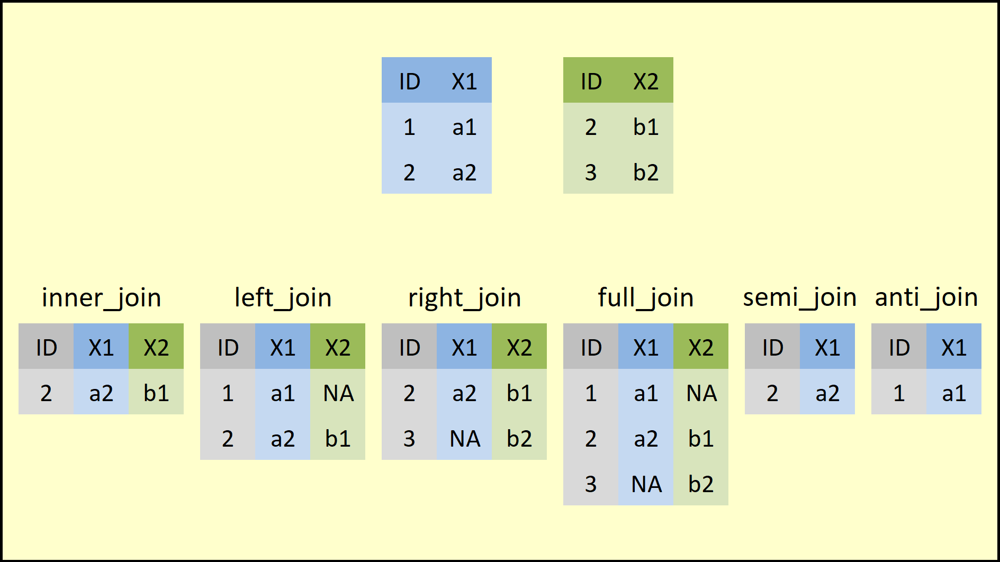

## The `dplyr` package
- [Vignette - Introduction to _dplyr_](https://cran.r-project.org/web/packages/dplyr/vignettes/dplyr.html)
- The `dplyr` package makes data manipulation easier through simple and computationally efficient functions.
- These functions can be grouped into three categories:
    - Columns:
        - `select()`: selects or drops data-frame columns
        - `rename()`: changes column names
        - `mutate()`: creates or modifies column values
    - Rows:
        - `filter()`: selects rows according to column values
        - `arrange()`: reorders the rows
    - Groups of rows:
        - `summarise()`: collapses each group into a single row
- In this subsection, we continue using the Star Wars dataset (`starwars`) introduced in the previous subsection.
- You will notice that, when these functions are applied, the data frame is turned into a _tibble_, which is a more efficient format for tabular data but works very similarly to a standard data frame.


```r
library("dplyr") # Load package
```

```
## 
## Attaching package: 'dplyr'
```

```
## The following objects are masked from 'package:stats':
## 
##     filter, lag
```

```
## The following objects are masked from 'package:base':
## 
##     intersect, setdiff, setequal, union
```

```r
head(starwars) # inspect the first rows of the dataset included in the package
```

```
## # A tibble: 6 × 14
##   name      height  mass hair_color skin_color eye_color birth_year sex   gender
##   <chr>      <int> <dbl> <chr>      <chr>      <chr>          <dbl> <chr> <chr> 
## 1 Luke Sky…    172    77 blond      fair       blue            19   male  mascu…
## 2 C-3PO        167    75 <NA>       gold       yellow         112   none  mascu…
## 3 R2-D2         96    32 <NA>       white, bl… red             33   none  mascu…
## 4 Darth Va…    202   136 none       white      yellow          41.9 male  mascu…
## 5 Leia Org…    150    49 brown      light      brown           19   fema… femin…
## 6 Owen Lars    178   120 brown, gr… light      blue            52   male  mascu…
## # ℹ 5 more variables: homeworld <chr>, species <chr>, films <list>,
## #   vehicles <list>, starships <list>
```


## Filter rows with `filter()`
- Selects a subset of rows from a data frame.
```yaml
filter(.data, ...)

.data: A data frame, data frame extension (e.g. a tibble), or a lazy data frame (e.g. from dbplyr or dtplyr).
...	: <data-masking> Expressions that return a logical value, and are defined in terms of the variables in .data. If multiple expressions are included, they are combined with the & operator. Only rows for which all conditions evaluate to TRUE are kept.
```
- 

```r
starwars1 = filter(starwars, species == "Human", height >= 100)
starwars1
```

```
## # A tibble: 31 × 14
##    name     height  mass hair_color skin_color eye_color birth_year sex   gender
##    <chr>     <int> <dbl> <chr>      <chr>      <chr>          <dbl> <chr> <chr> 
##  1 Luke Sk…    172    77 blond      fair       blue            19   male  mascu…
##  2 Darth V…    202   136 none       white      yellow          41.9 male  mascu…
##  3 Leia Or…    150    49 brown      light      brown           19   fema… femin…
##  4 Owen La…    178   120 brown, gr… light      blue            52   male  mascu…
##  5 Beru Wh…    165    75 brown      light      blue            47   fema… femin…
##  6 Biggs D…    183    84 black      light      brown           24   male  mascu…
##  7 Obi-Wan…    182    77 auburn, w… fair       blue-gray       57   male  mascu…
##  8 Anakin …    188    84 blond      fair       blue            41.9 male  mascu…
##  9 Wilhuff…    180    NA auburn, g… fair       blue            64   male  mascu…
## 10 Han Solo    180    80 brown      fair       brown           29   male  mascu…
## # ℹ 21 more rows
## # ℹ 5 more variables: homeworld <chr>, species <chr>, films <list>,
## #   vehicles <list>, starships <list>
```

```r
# Equivalente a:
starwars[starwars$species == "Human" & starwars$height >= 100, ]
```

```
## # A tibble: 39 × 14
##    name     height  mass hair_color skin_color eye_color birth_year sex   gender
##    <chr>     <int> <dbl> <chr>      <chr>      <chr>          <dbl> <chr> <chr> 
##  1 Luke Sk…    172    77 blond      fair       blue            19   male  mascu…
##  2 Darth V…    202   136 none       white      yellow          41.9 male  mascu…
##  3 Leia Or…    150    49 brown      light      brown           19   fema… femin…
##  4 Owen La…    178   120 brown, gr… light      blue            52   male  mascu…
##  5 Beru Wh…    165    75 brown      light      blue            47   fema… femin…
##  6 Biggs D…    183    84 black      light      brown           24   male  mascu…
##  7 Obi-Wan…    182    77 auburn, w… fair       blue-gray       57   male  mascu…
##  8 Anakin …    188    84 blond      fair       blue            41.9 male  mascu…
##  9 Wilhuff…    180    NA auburn, g… fair       blue            64   male  mascu…
## 10 Han Solo    180    80 brown      fair       brown           29   male  mascu…
## # ℹ 29 more rows
## # ℹ 5 more variables: homeworld <chr>, species <chr>, films <list>,
## #   vehicles <list>, starships <list>
```

## Reorder rows with `arrange()`
- Reorders the rows according to one or more column names.
```yaml
arrange(.data, ..., .by_group = FALSE)

.data: A data frame, data frame extension (e.g. a tibble), or a lazy data frame (e.g. from dbplyr or dtplyr).
... : <data-masking> Variables, or functions of variables. Use desc() to sort a variable in descending order.
```
- If more than one variable is provided, the rows are first sorted by the first variable and ties are broken using the second variable.
- To sort in descending order, use the `desc()` function.

```r
starwars2 = arrange(starwars1, height, desc(mass))
starwars2
```

```
## # A tibble: 31 × 14
##    name     height  mass hair_color skin_color eye_color birth_year sex   gender
##    <chr>     <int> <dbl> <chr>      <chr>      <chr>          <dbl> <chr> <chr> 
##  1 Leia Or…    150    49 brown      light      brown             19 fema… femin…
##  2 Mon Mot…    150    NA auburn     fair       blue              48 fema… femin…
##  3 Cordé       157    NA brown      light      brown             NA fema… femin…
##  4 Shmi Sk…    163    NA black      fair       brown             72 fema… femin…
##  5 Beru Wh…    165    75 brown      light      blue              47 fema… femin…
##  6 Padmé A…    165    45 brown      light      brown             46 fema… femin…
##  7 Dormé       165    NA brown      light      brown             NA fema… femin…
##  8 Jocasta…    167    NA white      fair       blue              NA fema… femin…
##  9 Wedge A…    170    77 brown      fair       hazel             21 male  mascu…
## 10 Palpati…    170    75 grey       pale       yellow            82 male  mascu…
## # ℹ 21 more rows
## # ℹ 5 more variables: homeworld <chr>, species <chr>, films <list>,
## #   vehicles <list>, starships <list>
```


## Select columns with `select()`
- Selects the columns of interest.
```yaml
select(.data, ...)

... : variables in a data frame
: for selecting a range of consecutive variables.
! for taking the complement of a set of variables.
c() for combining selections.
```
- To select columns, simply list the desired column names.
- We can also select a range of variables with `var1:var2`.
- If we want to drop only a few columns, we can list their names preceded by a minus sign (`-var`).

```r
starwars3 = select(starwars2, name:eye_color, sex:species)
# equivalente: select(starwars2, -birth_year, -c(films:starships))
starwars3
```

```
## # A tibble: 31 × 10
##    name      height  mass hair_color skin_color eye_color sex   gender homeworld
##    <chr>      <int> <dbl> <chr>      <chr>      <chr>     <chr> <chr>  <chr>    
##  1 Leia Org…    150    49 brown      light      brown     fema… femin… Alderaan 
##  2 Mon Moth…    150    NA auburn     fair       blue      fema… femin… Chandrila
##  3 Cordé        157    NA brown      light      brown     fema… femin… Naboo    
##  4 Shmi Sky…    163    NA black      fair       brown     fema… femin… Tatooine 
##  5 Beru Whi…    165    75 brown      light      blue      fema… femin… Tatooine 
##  6 Padmé Am…    165    45 brown      light      brown     fema… femin… Naboo    
##  7 Dormé        165    NA brown      light      brown     fema… femin… Naboo    
##  8 Jocasta …    167    NA white      fair       blue      fema… femin… Coruscant
##  9 Wedge An…    170    77 brown      fair       hazel     male  mascu… Corellia 
## 10 Palpatine    170    75 grey       pale       yellow    male  mascu… Naboo    
## # ℹ 21 more rows
## # ℹ 1 more variable: species <chr>
```
- Notice that `select()` may not work properly if the `MASS` package is attached. If that happens, detach `MASS` in the lower-right Packages pane or run `detach("package:MASS", unload = TRUE)`.
- Another way to select columns is to combine `select()` with helpers such as `starts_with()` and `ends_with()`, which select columns that begin or end with a given text pattern.

```r
head( select(starwars, ends_with("color")) ) # colunas que terminam com color
```

```
## # A tibble: 6 × 3
##   hair_color  skin_color  eye_color
##   <chr>       <chr>       <chr>    
## 1 blond       fair        blue     
## 2 <NA>        gold        yellow   
## 3 <NA>        white, blue red      
## 4 none        white       yellow   
## 5 brown       light       brown    
## 6 brown, grey light       blue
```

```r
head( select(starwars, starts_with("s")) ) # colunas que iniciam com a letra "s"
```

```
## # A tibble: 6 × 4
##   skin_color  sex    species starships
##   <chr>       <chr>  <chr>   <list>   
## 1 fair        male   Human   <chr [2]>
## 2 gold        none   Droid   <chr [0]>
## 3 white, blue none   Droid   <chr [0]>
## 4 white       male   Human   <chr [1]>
## 5 light       female Human   <chr [0]>
## 6 light       male   Human   <chr [0]>
```

## Rename columns with `rename()`
- Renames columns using `new_name = old_name`.
```yaml
rename(.data, ...)

.data: A data frame, data frame extension (e.g. a tibble), or a lazy data frame (e.g. from dbplyr or dtplyr).
...	: For rename(): <tidy-select> Use new_name = old_name to rename selected variables.
```


```r
starwars4 = rename(starwars3,
                haircolor = hair_color,
                skincolor = skin_color, 
                eyecolor = eye_color)
starwars4
```

```
## # A tibble: 31 × 10
##    name         height  mass haircolor skincolor eyecolor sex   gender homeworld
##    <chr>         <int> <dbl> <chr>     <chr>     <chr>    <chr> <chr>  <chr>    
##  1 Leia Organa     150    49 brown     light     brown    fema… femin… Alderaan 
##  2 Mon Mothma      150    NA auburn    fair      blue     fema… femin… Chandrila
##  3 Cordé           157    NA brown     light     brown    fema… femin… Naboo    
##  4 Shmi Skywal…    163    NA black     fair      brown    fema… femin… Tatooine 
##  5 Beru Whites…    165    75 brown     light     blue     fema… femin… Tatooine 
##  6 Padmé Amida…    165    45 brown     light     brown    fema… femin… Naboo    
##  7 Dormé           165    NA brown     light     brown    fema… femin… Naboo    
##  8 Jocasta Nu      167    NA white     fair      blue     fema… femin… Coruscant
##  9 Wedge Antil…    170    77 brown     fair      hazel    male  mascu… Corellia 
## 10 Palpatine       170    75 grey      pale      yellow   male  mascu… Naboo    
## # ℹ 21 more rows
## # ℹ 1 more variable: species <chr>
```


## Modify/Add columns with `mutate()`
- Modifies an existing column
- Creates a new column if it does not exist
```yaml
mutate(.data, ...)

.data: A data frame, data frame extension (e.g. a tibble), or a lazy data frame (e.g. from dbplyr or dtplyr).
...	: <data-masking> Name-value pairs. The name gives the name of the column in the output. The value can be:
 - A vector of length 1, which will be recycled to the correct length.
 - A vector the same length as the current group (or the whole data frame if ungrouped).
 - NULL, to remove the column.
```

```r
starwars5 = mutate(starwars4,
                height = height/100, # convert cm to meters
                BMI = mass / height^2,
                dummy = 1 # if it is not a vector, the same value is recycled
                )
starwars5 = select(starwars5, BMI, dummy, everything()) # make reading easier
starwars5
```

```
## # A tibble: 31 × 12
##      BMI dummy name       height  mass haircolor skincolor eyecolor sex   gender
##    <dbl> <dbl> <chr>       <dbl> <dbl> <chr>     <chr>     <chr>    <chr> <chr> 
##  1  21.8     1 Leia Orga…   1.5     49 brown     light     brown    fema… femin…
##  2  NA       1 Mon Mothma   1.5     NA auburn    fair      blue     fema… femin…
##  3  NA       1 Cordé        1.57    NA brown     light     brown    fema… femin…
##  4  NA       1 Shmi Skyw…   1.63    NA black     fair      brown    fema… femin…
##  5  27.5     1 Beru Whit…   1.65    75 brown     light     blue     fema… femin…
##  6  16.5     1 Padmé Ami…   1.65    45 brown     light     brown    fema… femin…
##  7  NA       1 Dormé        1.65    NA brown     light     brown    fema… femin…
##  8  NA       1 Jocasta Nu   1.67    NA white     fair      blue     fema… femin…
##  9  26.6     1 Wedge Ant…   1.7     77 brown     fair      hazel    male  mascu…
## 10  26.0     1 Palpatine    1.7     75 grey      pale      yellow   male  mascu…
## # ℹ 21 more rows
## # ℹ 2 more variables: homeworld <chr>, species <chr>
```

## The pipe operator `%>%`
- Notice that all previous `dplyr` functions take the dataset (`.data`) as their first argument, and that is not accidental.
- The pipe operator `%>%` passes the data frame written on the left-hand side into the first argument of the next function on the right-hand side.

```r
filter(starwars, species=="Droid") # without the pipe operator
```

```
## # A tibble: 6 × 14
##   name   height  mass hair_color skin_color  eye_color birth_year sex   gender  
##   <chr>   <int> <dbl> <chr>      <chr>       <chr>          <dbl> <chr> <chr>   
## 1 C-3PO     167    75 <NA>       gold        yellow           112 none  masculi…
## 2 R2-D2      96    32 <NA>       white, blue red               33 none  masculi…
## 3 R5-D4      97    32 <NA>       white, red  red               NA none  masculi…
## 4 IG-88     200   140 none       metal       red               15 none  masculi…
## 5 R4-P17     96    NA none       silver, red red, blue         NA none  feminine
## 6 BB8        NA    NA none       none        black             NA none  masculi…
## # ℹ 5 more variables: homeworld <chr>, species <chr>, films <list>,
## #   vehicles <list>, starships <list>
```

```r
starwars %>% filter(species=="Droid") # with the pipe operator
```

```
## # A tibble: 6 × 14
##   name   height  mass hair_color skin_color  eye_color birth_year sex   gender  
##   <chr>   <int> <dbl> <chr>      <chr>       <chr>          <dbl> <chr> <chr>   
## 1 C-3PO     167    75 <NA>       gold        yellow           112 none  masculi…
## 2 R2-D2      96    32 <NA>       white, blue red               33 none  masculi…
## 3 R5-D4      97    32 <NA>       white, red  red               NA none  masculi…
## 4 IG-88     200   140 none       metal       red               15 none  masculi…
## 5 R4-P17     96    NA none       silver, red red, blue         NA none  feminine
## 6 BB8        NA    NA none       none        black             NA none  masculi…
## # ℹ 5 more variables: homeworld <chr>, species <chr>, films <list>,
## #   vehicles <list>, starships <list>
```
- Notice that, when we use the pipe operator, the first argument containing the dataset should not be filled in, because it is already passed automatically by `%>%`.
- Also note that, from the subsection on `filter()` through `mutate()`, we have been accumulating the transformations in new data frames. In other words, the last object, `starwars5`, is the original `starwars` dataset after the sequence of changes produced by `filter()`, `arrange()`, `select()`, `rename()`, and `mutate()`.

```r
starwars1 = filter(starwars, species == "Human", height >= 100)
starwars2 = arrange(starwars1, height, desc(mass))
starwars3 = select(starwars2, name:eye_color, sex:species)
starwars4 = rename(starwars3,
                haircolor = hair_color,
                skincolor = skin_color, 
                eyecolor = eye_color)
starwars5 = mutate(starwars4,
                height = height/100,
                BMI = mass / height^2,
                dummy = 1
                )
starwars5 = select(starwars5, BMI, dummy, everything())
starwars5
```

```
## # A tibble: 31 × 12
##      BMI dummy name       height  mass haircolor skincolor eyecolor sex   gender
##    <dbl> <dbl> <chr>       <dbl> <dbl> <chr>     <chr>     <chr>    <chr> <chr> 
##  1  21.8     1 Leia Orga…   1.5     49 brown     light     brown    fema… femin…
##  2  NA       1 Mon Mothma   1.5     NA auburn    fair      blue     fema… femin…
##  3  NA       1 Cordé        1.57    NA brown     light     brown    fema… femin…
##  4  NA       1 Shmi Skyw…   1.63    NA black     fair      brown    fema… femin…
##  5  27.5     1 Beru Whit…   1.65    75 brown     light     blue     fema… femin…
##  6  16.5     1 Padmé Ami…   1.65    45 brown     light     brown    fema… femin…
##  7  NA       1 Dormé        1.65    NA brown     light     brown    fema… femin…
##  8  NA       1 Jocasta Nu   1.67    NA white     fair      blue     fema… femin…
##  9  26.6     1 Wedge Ant…   1.7     77 brown     fair      hazel    male  mascu…
## 10  26.0     1 Palpatine    1.7     75 grey      pale      yellow   male  mascu…
## # ℹ 21 more rows
## # ℹ 2 more variables: homeworld <chr>, species <chr>
```
- By using the pipe operator `%>%` repeatedly, we can take the output from one function and feed it directly into the next one. We can therefore rewrite the code above as a single pipeline and obtain the same data frame as `starwars5`.

```r
starwars_pipe = starwars %>% 
    filter(species == "Human", height >= 100) %>%
    arrange(height, desc(mass)) %>%
    select(name:eye_color, sex:species) %>%
    rename(haircolor = hair_color,
           skincolor = skin_color, 
           eyecolor = eye_color) %>%
    mutate(height = height/100,
           BMI = mass / height^2,
           dummy = 1
           ) %>%
    select(BMI, dummy, everything())
starwars_pipe
```

```
## # A tibble: 31 × 12
##      BMI dummy name       height  mass haircolor skincolor eyecolor sex   gender
##    <dbl> <dbl> <chr>       <dbl> <dbl> <chr>     <chr>     <chr>    <chr> <chr> 
##  1  21.8     1 Leia Orga…   1.5     49 brown     light     brown    fema… femin…
##  2  NA       1 Mon Mothma   1.5     NA auburn    fair      blue     fema… femin…
##  3  NA       1 Cordé        1.57    NA brown     light     brown    fema… femin…
##  4  NA       1 Shmi Skyw…   1.63    NA black     fair      brown    fema… femin…
##  5  27.5     1 Beru Whit…   1.65    75 brown     light     blue     fema… femin…
##  6  16.5     1 Padmé Ami…   1.65    45 brown     light     brown    fema… femin…
##  7  NA       1 Dormé        1.65    NA brown     light     brown    fema… femin…
##  8  NA       1 Jocasta Nu   1.67    NA white     fair      blue     fema… femin…
##  9  26.6     1 Wedge Ant…   1.7     77 brown     fair      hazel    male  mascu…
## 10  26.0     1 Palpatine    1.7     75 grey      pale      yellow   male  mascu…
## # ℹ 21 more rows
## # ℹ 2 more variables: homeworld <chr>, species <chr>
```

```r
all(starwars_pipe == starwars5, na.rm=TRUE) # check whether all elements are equal
```

```
## [1] TRUE
```

## Resuma com `summarise()`

- We can use `summarise()` to compute statistics for one or more variables:

```r
starwars %>% summarise(
    n_obs = n(),
    mean_height = mean(height, na.rm=TRUE),
    mean_mass = mean(mass, na.rm=TRUE)
    )
```

```
## # A tibble: 1 × 3
##   n_obs mean_height mean_mass
##   <int>       <dbl>     <dbl>
## 1    87        174.      97.3
```
- In the example above, we simply obtained the sample size and the mean height and mass for the full `starwars` sample, which is not especially informative.


## Agrupe com `group_by()`
- Unlike the other `dplyr` functions shown so far, the output of `group_by()` does not change the content of the data frame. It only **turns the data into a grouped dataset** according to the categories of a given variable.

```r
grouped_sw = starwars %>% group_by(sex)
class(grouped_sw)
```

```
## [1] "grouped_df" "tbl_df"     "tbl"        "data.frame"
```

```r
head(starwars)
```

```
## # A tibble: 6 × 14
##   name      height  mass hair_color skin_color eye_color birth_year sex   gender
##   <chr>      <int> <dbl> <chr>      <chr>      <chr>          <dbl> <chr> <chr> 
## 1 Luke Sky…    172    77 blond      fair       blue            19   male  mascu…
## 2 C-3PO        167    75 <NA>       gold       yellow         112   none  mascu…
## 3 R2-D2         96    32 <NA>       white, bl… red             33   none  mascu…
## 4 Darth Va…    202   136 none       white      yellow          41.9 male  mascu…
## 5 Leia Org…    150    49 brown      light      brown           19   fema… femin…
## 6 Owen Lars    178   120 brown, gr… light      blue            52   male  mascu…
## # ℹ 5 more variables: homeworld <chr>, species <chr>, films <list>,
## #   vehicles <list>, starships <list>
```

```r
head(grouped_sw) # grouped by sex
```

```
## # A tibble: 6 × 14
## # Groups:   sex [3]
##   name      height  mass hair_color skin_color eye_color birth_year sex   gender
##   <chr>      <int> <dbl> <chr>      <chr>      <chr>          <dbl> <chr> <chr> 
## 1 Luke Sky…    172    77 blond      fair       blue            19   male  mascu…
## 2 C-3PO        167    75 <NA>       gold       yellow         112   none  mascu…
## 3 R2-D2         96    32 <NA>       white, bl… red             33   none  mascu…
## 4 Darth Va…    202   136 none       white      yellow          41.9 male  mascu…
## 5 Leia Org…    150    49 brown      light      brown           19   fema… femin…
## 6 Owen Lars    178   120 brown, gr… light      blue            52   male  mascu…
## # ℹ 5 more variables: homeworld <chr>, species <chr>, films <list>,
## #   vehicles <list>, starships <list>
```
- `group_by()` prepares the data frame for operations that depend on multiple rows. As an example, let us create a column containing the mean of `mass` across all observations.

```r
starwars %>%
    mutate(mean_mass = mean(mass, na.rm=TRUE)) %>% 
    select(mean_mass, sex, everything()) %>%
    head(10)
```

```
## # A tibble: 10 × 15
##    mean_mass sex   name  height  mass hair_color skin_color eye_color birth_year
##        <dbl> <chr> <chr>  <int> <dbl> <chr>      <chr>      <chr>          <dbl>
##  1      97.3 male  Luke…    172    77 blond      fair       blue            19  
##  2      97.3 none  C-3PO    167    75 <NA>       gold       yellow         112  
##  3      97.3 none  R2-D2     96    32 <NA>       white, bl… red             33  
##  4      97.3 male  Dart…    202   136 none       white      yellow          41.9
##  5      97.3 fema… Leia…    150    49 brown      light      brown           19  
##  6      97.3 male  Owen…    178   120 brown, gr… light      blue            52  
##  7      97.3 fema… Beru…    165    75 brown      light      blue            47  
##  8      97.3 none  R5-D4     97    32 <NA>       white, red red             NA  
##  9      97.3 male  Bigg…    183    84 black      light      brown           24  
## 10      97.3 male  Obi-…    182    77 auburn, w… fair       blue-gray       57  
## # ℹ 6 more variables: gender <chr>, homeworld <chr>, species <chr>,
## #   films <list>, vehicles <list>, starships <list>
```
- Notice that all values of `mean_mass` are identical. We now group by `sex` before computing the mean:

```r
starwars %>%
    group_by(sex) %>%
    mutate(mean_mass = mean(mass, na.rm=TRUE)) %>% 
    ungroup() %>% # always remember to ungroup afterward
    select(mean_mass, sex, everything()) %>%
    head(10)
```

```
## # A tibble: 10 × 15
##    mean_mass sex   name  height  mass hair_color skin_color eye_color birth_year
##        <dbl> <chr> <chr>  <int> <dbl> <chr>      <chr>      <chr>          <dbl>
##  1      81.0 male  Luke…    172    77 blond      fair       blue            19  
##  2      69.8 none  C-3PO    167    75 <NA>       gold       yellow         112  
##  3      69.8 none  R2-D2     96    32 <NA>       white, bl… red             33  
##  4      81.0 male  Dart…    202   136 none       white      yellow          41.9
##  5      54.7 fema… Leia…    150    49 brown      light      brown           19  
##  6      81.0 male  Owen…    178   120 brown, gr… light      blue            52  
##  7      54.7 fema… Beru…    165    75 brown      light      blue            47  
##  8      69.8 none  R5-D4     97    32 <NA>       white, red red             NA  
##  9      81.0 male  Bigg…    183    84 black      light      brown           24  
## 10      81.0 male  Obi-…    182    77 auburn, w… fair       blue-gray       57  
## # ℹ 6 more variables: gender <chr>, homeworld <chr>, species <chr>,
## #   films <list>, vehicles <list>, starships <list>
```
- Notice that the `mean_mass` column now takes different values depending on the sex of the observation.
- This is useful in many economic applications where we work with group-level variables, for example at the household level, attached to individual observations such as household members.

> **Avoid potential mistakes**: Whenever you use `group_by()`, remember to ungroup the data frame with `ungroup()` after carrying out the desired operations.

## Resuma em grupos com `group_by()` e `summarise()`
- `summarise()` is especially useful when combined with `group_by()`, because it allows us to compute group-level statistics:

```r
summary_sw = starwars %>% group_by(sex) %>%
    summarise(
        n_obs = n(),
        mean_height = mean(height, na.rm = TRUE),
        mean_mass = mean(mass, na.rm = TRUE)
    )
summary_sw
```

```
## # A tibble: 5 × 4
##   sex            n_obs mean_height mean_mass
##   <chr>          <int>       <dbl>     <dbl>
## 1 female            16        169.      54.7
## 2 hermaphroditic     1        175     1358  
## 3 male              60        179.      81.0
## 4 none               6        131.      69.8
## 5 <NA>               4        181.      48
```

```r
class(summary_sw) # once we summarise, the result is no longer grouped
```

```
## [1] "tbl_df"     "tbl"        "data.frame"
```
- Notice that, after using `summarise()`, the resulting data frame is no longer grouped, so `ungroup()` is not necessary in this case.
- We can also group by more than one variable:

```r
starwars %>% group_by(sex, hair_color) %>%
    summarise(
        n_obs = n(),
        mean_height = mean(height, na.rm = TRUE),
        mean_mass = mean(mass, na.rm = TRUE)
    )
```

```
## `summarise()` has grouped output by 'sex'. You can override using the `.groups`
## argument.
```

```
## # A tibble: 23 × 5
## # Groups:   sex [5]
##    sex            hair_color    n_obs mean_height mean_mass
##    <chr>          <chr>         <int>       <dbl>     <dbl>
##  1 female         auburn            1        150      NaN  
##  2 female         black             3        166.      53.1
##  3 female         blonde            1        168       55  
##  4 female         brown             6        160.      56.3
##  5 female         none              4        188.      54  
##  6 female         white             1        167      NaN  
##  7 hermaphroditic <NA>              1        175     1358  
##  8 male           auburn, grey      1        180      NaN  
##  9 male           auburn, white     1        182       77  
## 10 male           black             9        176.      81.0
## # ℹ 13 more rows
```
- To group **continuous** variables, we need to define intervals with the `cut()` function.
```yaml
cut(x, ...)

x: a numeric vector which is to be converted to a factor by cutting.

breaks: either a numeric vector of two or more unique cut points or a single number (greater than or equal to 2) giving the number of intervals into which x is to be cut.
```

```r
# breaks supplied as an integer = desired number of groups
starwars %>% group_by(cut(birth_year, breaks=5)) %>%
    summarise(
        n_obs = n(),
        mean_height = mean(height, na.rm = TRUE)
    )
```

```
## # A tibble: 5 × 3
##   `cut(birth_year, breaks = 5)` n_obs mean_height
##   <fct>                         <int>       <dbl>
## 1 (7.11,186]                       40        175.
## 2 (186,363]                         1        228 
## 3 (541,718]                         1        175 
## 4 (718,897]                         1         66 
## 5 <NA>                             44        176.
```

```r
# breaks supplied as a vector = group cut points
starwars %>% group_by(birth_year=cut(birth_year, 
                          breaks=c(0, 40, 90, 200, 900))) %>%
    summarise(
        n_obs = n(),
        mean_height = mean(height, na.rm = TRUE)
    )
```

```
## # A tibble: 5 × 3
##   birth_year n_obs mean_height
##   <fct>      <int>       <dbl>
## 1 (0,40]        13        164.
## 2 (40,90]       22        179.
## 3 (90,200]       6        192.
## 4 (200,900]      2        120.
## 5 <NA>          44        176.
```
- Notice that we wrote `birth_year = cut(birth_year, ...)` so the column keeps the name `birth_year`; otherwise it would be named `cut(birth_year, ...)`.


## Join datasets with _join_ functions
- We saw earlier that `cbind()` can be used to combine one data frame with another data frame, or a vector, as long as they have the same number of rows.
- To append rows, provided the columns share compatible classes, we can use `rbind()`.
- To combine datasets using key variables, we use `merge()`.
- The `dplyr` package provides a family of _join_ functions that accomplish the same task as `merge()`. Instead of changing an argument value, however, we choose the specific _join_ function that matches the merge we want, as summarized in the figure below:

<center></center>

- All these functions share the same basic syntax:
    - `x`: dataset 1
    - `y`: dataset 2
    - `by`: vector of key variables
    - `suffix`: vector with two suffixes used for columns that share the same name
- As an example, we use subsets of the `starwars` dataset:

```r
bd1 = starwars[1:6, c(1, 3, 11)]
bd2 = starwars[c(2, 4, 7:10), c(1:2, 6)]
bd1
```

```
## # A tibble: 6 × 3
##   name            mass species
##   <chr>          <dbl> <chr>  
## 1 Luke Skywalker    77 Human  
## 2 C-3PO             75 Droid  
## 3 R2-D2             32 Droid  
## 4 Darth Vader      136 Human  
## 5 Leia Organa       49 Human  
## 6 Owen Lars        120 Human
```

```r
bd2
```

```
## # A tibble: 6 × 3
##   name               height eye_color
##   <chr>               <int> <chr>    
## 1 C-3PO                 167 yellow   
## 2 Darth Vader           202 yellow   
## 3 Beru Whitesun lars    165 blue     
## 4 R5-D4                  97 red      
## 5 Biggs Darklighter     183 brown    
## 6 Obi-Wan Kenobi        182 blue-gray
```
- Notice that there are 12 unique characters across the two datasets, but only `"C-3PO"` and `"Darth Vader"` appear in both datasets.
- `inner_join()`: keeps only IDs present in both datasets

```r
inner_join(bd1, bd2, by="name")
```

```
## # A tibble: 2 × 5
##   name         mass species height eye_color
##   <chr>       <dbl> <chr>    <int> <chr>    
## 1 C-3PO          75 Droid      167 yellow   
## 2 Darth Vader   136 Human      202 yellow
```

- `full_join()`: keeps all IDs, even if they appear in only one of the two datasets

```r
full_join(bd1, bd2, by="name")
```

```
## # A tibble: 10 × 5
##    name                mass species height eye_color
##    <chr>              <dbl> <chr>    <int> <chr>    
##  1 Luke Skywalker        77 Human       NA <NA>     
##  2 C-3PO                 75 Droid      167 yellow   
##  3 R2-D2                 32 Droid       NA <NA>     
##  4 Darth Vader          136 Human      202 yellow   
##  5 Leia Organa           49 Human       NA <NA>     
##  6 Owen Lars            120 Human       NA <NA>     
##  7 Beru Whitesun lars    NA <NA>       165 blue     
##  8 R5-D4                 NA <NA>        97 red      
##  9 Biggs Darklighter     NA <NA>       183 brown    
## 10 Obi-Wan Kenobi        NA <NA>       182 blue-gray
```
- `left_join()`: keeps the IDs present in dataset 1 (supplied as `x`)

```r
left_join(bd1, bd2, by="name")
```

```
## # A tibble: 6 × 5
##   name            mass species height eye_color
##   <chr>          <dbl> <chr>    <int> <chr>    
## 1 Luke Skywalker    77 Human       NA <NA>     
## 2 C-3PO             75 Droid      167 yellow   
## 3 R2-D2             32 Droid       NA <NA>     
## 4 Darth Vader      136 Human      202 yellow   
## 5 Leia Organa       49 Human       NA <NA>     
## 6 Owen Lars        120 Human       NA <NA>
```
- `right_join()`: keeps the IDs present in dataset 2 (supplied as `y`)

```r
right_join(bd1, bd2, by="name")
```

```
## # A tibble: 6 × 5
##   name                mass species height eye_color
##   <chr>              <dbl> <chr>    <int> <chr>    
## 1 C-3PO                 75 Droid      167 yellow   
## 2 Darth Vader          136 Human      202 yellow   
## 3 Beru Whitesun lars    NA <NA>       165 blue     
## 4 R5-D4                 NA <NA>        97 red      
## 5 Biggs Darklighter     NA <NA>       183 brown    
## 6 Obi-Wan Kenobi        NA <NA>       182 blue-gray
```

- We can also use more than one key variable to match IDs across datasets. First, let us build the two datasets as panels.

```r
bd1 = starwars[1:5, c(1, 3)]
bd1 = rbind(bd1, bd1) %>%
    mutate(year = c(rep(2021, 5), rep(2022, 5)),
           # if the year is not 2021, multiply by a random draw from N(1, 0.025)
           mass = ifelse(year == 2021, mass, mass*rnorm(10, 1, 0.025))) %>%
    select(name, year, mass) %>%
    arrange(name, year)
bd1
```

```
## # A tibble: 10 × 3
##    name            year  mass
##    <chr>          <dbl> <dbl>
##  1 C-3PO           2021  75  
##  2 C-3PO           2022  75.5
##  3 Darth Vader     2021 136  
##  4 Darth Vader     2022 135. 
##  5 Leia Organa     2021  49  
##  6 Leia Organa     2022  51.3
##  7 Luke Skywalker  2021  77  
##  8 Luke Skywalker  2022  75.4
##  9 R2-D2           2021  32  
## 10 R2-D2           2022  33.8
```

```r
bd2 = starwars[c(2, 4, 7:9), 1:2]
bd2 = rbind(bd2, bd2) %>%
    mutate(year = c(rep(2021, 5), rep(2022, 5)),
           # if the year is not 2021, height grows by 2%
           height = ifelse(year == 2021, height, height*1.02)) %>%
    select(name, year, height) %>%
    arrange(name, year)
bd2
```

```
## # A tibble: 10 × 3
##    name                year height
##    <chr>              <dbl>  <dbl>
##  1 Beru Whitesun lars  2021  165  
##  2 Beru Whitesun lars  2022  168. 
##  3 Biggs Darklighter   2021  183  
##  4 Biggs Darklighter   2022  187. 
##  5 C-3PO               2021  167  
##  6 C-3PO               2022  170. 
##  7 Darth Vader         2021  202  
##  8 Darth Vader         2022  206. 
##  9 R5-D4               2021   97  
## 10 R5-D4               2022   98.9
```
- Notice that each character now has two rows, corresponding to the two years, 2021 and 2022. We can therefore run a `full_join()` using both `name` and `year` as key variables.

```r
# Merge the datasets
full_join(bd1, bd2, by=c("name", "year"))
```

```
## # A tibble: 16 × 4
##    name                year  mass height
##    <chr>              <dbl> <dbl>  <dbl>
##  1 C-3PO               2021  75    167  
##  2 C-3PO               2022  75.5  170. 
##  3 Darth Vader         2021 136    202  
##  4 Darth Vader         2022 135.   206. 
##  5 Leia Organa         2021  49     NA  
##  6 Leia Organa         2022  51.3   NA  
##  7 Luke Skywalker      2021  77     NA  
##  8 Luke Skywalker      2022  75.4   NA  
##  9 R2-D2               2021  32     NA  
## 10 R2-D2               2022  33.8   NA  
## 11 Beru Whitesun lars  2021  NA    165  
## 12 Beru Whitesun lars  2022  NA    168. 
## 13 Biggs Darklighter   2021  NA    183  
## 14 Biggs Darklighter   2022  NA    187. 
## 15 R5-D4               2021  NA     97  
## 16 R5-D4               2022  NA     98.9
```
- Also pay attention to the variable names. When we join datasets that share variables with the same names, but those variables are not used as keys, the function keeps both versions and renames them by default with suffixes `.x` and `.y`. These suffixes can be changed with the `suffix` argument.

```r
bd2 = bd2 %>% mutate(mass = rnorm(10)) # create a variable named mass

full_join(bd1, bd2, by=c("name", "year"))
```

```
## # A tibble: 16 × 5
##    name                year mass.x height mass.y
##    <chr>              <dbl>  <dbl>  <dbl>  <dbl>
##  1 C-3PO               2021   75    167    1.04 
##  2 C-3PO               2022   75.5  170.  -1.36 
##  3 Darth Vader         2021  136    202   -0.329
##  4 Darth Vader         2022  135.   206.   1.07 
##  5 Leia Organa         2021   49     NA   NA    
##  6 Leia Organa         2022   51.3   NA   NA    
##  7 Luke Skywalker      2021   77     NA   NA    
##  8 Luke Skywalker      2022   75.4   NA   NA    
##  9 R2-D2               2021   32     NA   NA    
## 10 R2-D2               2022   33.8   NA   NA    
## 11 Beru Whitesun lars  2021   NA    165    0.248
## 12 Beru Whitesun lars  2022   NA    168.  -0.581
## 13 Biggs Darklighter   2021   NA    183   -0.613
## 14 Biggs Darklighter   2022   NA    187.   0.286
## 15 R5-D4               2021   NA     97   -0.138
## 16 R5-D4               2022   NA     98.9  0.723
```



