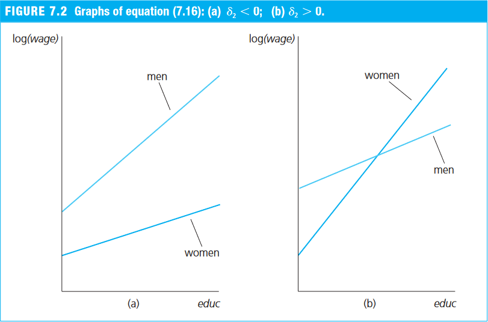

## Revisão de R

### Operações básicas

```r
# Soma
1 + 1
```

```
## [1] 2
```

```r
# Subtração
2 - 3
```

```
## [1] -1
```

```r
# Multiplicação
2 * 3
```

```
## [1] 6
```

```r
# Divisão
6 / 4
```

```
## [1] 1.5
```


### Objetos básicos
 - [Data types, R objects and attributes (John Hopkins/Coursera)](https://www.coursera.org/learn/r-programming/lecture/OS8hs/data-types-r-objects-and-attributes)
 
Para criar um objeto, atribuímos algo (neste caso, um valor) a um nome por meio do operador de atribuição `<-` ou `=`:

```r
obj1 <- 5
obj2 = 5 + 2
```

Note que ambos objetos foram criados e aparecem no quadrante superior/direito (_Environment_). Agora, podemos imprimir os seus valores executando o nome do objeto

```r
obj1
```

```
## [1] 5
```
ou imprimindo explicitamente por meio da função `print()`:

```r
print(obj2)
```

```
## [1] 7
```

Note que, podemos alterar um objeto atribuindo algo novo a ele:

```r
obj1 = 3
obj1
```

```
## [1] 3
```

É possível visualizar o tipo de objeto usando a função `class()`:

```r
class(obj1)
```

```
## [1] "numeric"
```

Logo, `obj1` é um número real. Há 5 tipos de classes de objetos "atômicos" (que contêm apenas 1 valor):

 - `character`: texto
 - `numeric`: número real
 - `integer`: número inteiro
 - `complex`: número complexo
 - `logical`: verdadeiro/falso (1 ou 0)
 

```r
num_inteiro = 3L # para número inteiro, usar sufixo L
num_inteiro
```

```
## [1] 3
```

```r
class(num_inteiro)
```

```
## [1] "integer"
```

```r
texto = "Oi"
texto
```

```
## [1] "Oi"
```

```r
class(texto)
```

```
## [1] "character"
```

```r
boolean1 = TRUE # poderia escrever T
boolean1
```

```
## [1] TRUE
```

```r
class(boolean1)
```

```
## [1] "logical"
```

```r
boolean2 = FALSE # poderia escrever F
boolean2
```

```
## [1] FALSE
```

```r
class(boolean2)
```

```
## [1] "logical"
```

#### Expressões lógicas/booleanas
São expressões que retornam o valor Verdadeiro ou Falso:

```r
2 < 20 # TRUE
```

```
## [1] TRUE
```

```r
15 >= 19 # FALSE
```

```
## [1] FALSE
```

```r
100 == 10^2 # TRUE
```

```
## [1] TRUE
```

```r
100 != 20*5 # FALSE
```

```
## [1] FALSE
```

É possível escrever expressões compostas utilizando `|` (ou) e `&` (e):

```r
x = 20 # atribuindo 20 a x

# Expressões lógicas compostas
x < 0 | x^2 > 100 # TRUE se UMA das expressões for TRUE
```

```
## [1] TRUE
```

```r
x < 0 & x^2 > 100 # TRUE se TODAS expressões for TRUE
```

```
## [1] FALSE
```


> **Tabela de Precedência de Operadores**
> 
> - Nível 6 - potenciação: `^`
> - Nível 5 - multiplicação: `*`, `/`
> - Nível 4 - adição: `+`, `-`
> - Nível 3 - relacional: `==`, `!=`, `<=`, `>=`, `>`, `<`
> - Nível 2 - lógico: `&` (e)
> - Nível 1 - lógico: `|` (ou)

- **Níveis 4 a 6**: são utilizados para CALCULAR valores
- **Nível 3**: é usado para relacionar 2 valores para CRIAR UMA expressão lógica
- **Níveis 1 e 2**: são usados para JUNTAR expressões lógicas


### Vetores e Matrizes

- Depois das 5 classes de objetos apresentadas acima, as mais básicas são vetores e matrizes, que possuem mais de um elemento dentro do objeto.
- Ambos necessariamente exigem que os seus elementos sejam da mesma classe. 


#### Vetores
- [Data types - Vectors and lists (John Hopkins/Coursera)](https://www.coursera.org/learn/r-programming/lecture/wkAHm/data-types-vectors-and-lists)
- Podemos criar um vetor usando a função `c()` e incluindo os valores separados por `,`:

```r
x = c(0.5, 0.6) # numeric
x = c(TRUE, FALSE) # logical
x = c("a", "b", "c") # character
x = 9:12 # integer (é igual a c(9, 10, 11, 12))
```


#### Matrizes
Matrizes são vetores (e, portanto, possuem elementos de mesma classe) com atributo de _dimensão_ (nº linhas por nº colunas). Uma matriz pode ser criada usando a função `matrix()`:

```yaml
matrix(data = NA, nrow = 1, ncol = 1, byrow = FALSE, ...)

data: an optional data vector (including a list or expression vector).
nrow: the desired number of rows.
ncol: the desired number of columns.
byrow: logical. If FALSE (the default) the matrix is filled by columns, otherwise the matrix is filled by rows.
```


```r
m = matrix(nrow=2, ncol=3) # matriz vazia
m
```

```
##      [,1] [,2] [,3]
## [1,]   NA   NA   NA
## [2,]   NA   NA   NA
```

É possível construir uma matriz "preenchida" incluindo um vetor com (nº linhas $\times$ nº colunas) elementos. 

```r
m = matrix(1:6, nrow=2, ncol=3)
m
```

```
##      [,1] [,2] [,3]
## [1,]    1    3    5
## [2,]    2    4    6
```


Os elementos do vetor `1:6` preenchem primeiro todas linhas de uma coluna para, depois, preencher a próxima coluna (_column-wise_). Para preencher por linha, usamos o argumento `byrow=TRUE`:

```r
m = matrix(1:6, nrow=2, ncol=3, byrow=TRUE)
m
```

```
##      [,1] [,2] [,3]
## [1,]    1    2    3
## [2,]    4    5    6
```


Note que muitas vezes é redundante informar ambos números de linhas e de colunas:

```r
m = matrix(1:6, nrow=2, byrow=TRUE)
m
```

```
##      [,1] [,2] [,3]
## [1,]    1    2    3
## [2,]    4    5    6
```

Podemos criar vetores-linha ou vetores-coluna inserindo, respectivamente, `nrow=1` e `ncol=1`:Ç

```r
# vetor-linha
m = matrix(1:3, nrow=1)
m
```

```
##      [,1] [,2] [,3]
## [1,]    1    2    3
```

```r
# vetor-coluna
m = matrix(1:3, ncol=1)
m
```

```
##      [,1]
## [1,]    1
## [2,]    2
## [3,]    3
```


</br>

Outra maneira de criar matrizes é juntando vetores em colunas (_column-binding_) ou em linhas (_row-binding_), usando as funções `cbind()` e `rbind()`, respectivamente:


```r
# Criando 2 vetores
x = 1:3
y = 10:12

# Criando/Visualizando matrizes
A = cbind(x, y) # juntando vetores por coluna
A
```

```
##      x  y
## [1,] 1 10
## [2,] 2 11
## [3,] 3 12
```

```r
B = rbind(x, y) # juntando vetores por linha
B
```

```
##   [,1] [,2] [,3]
## x    1    2    3
## y   10   11   12
```


#### Operações matriciais
- [Vectorized operations (John Hopkins/Coursera)](https://www.coursera.org/learn/r-programming/lecture/nobfZ/vectorized-operations)
- Ao utilizar as operações matemáticas convencionais em vetores, cada elemento é operacionalizado com o elemento na mesma posição do outro vetor

```r
x = matrix(1:4, ncol=1)
y = matrix(6:9, ncol=1)

x + y # soma de cada elemento na mesma posição
```

```
##      [,1]
## [1,]    7
## [2,]    9
## [3,]   11
## [4,]   13
```

```r
x + 2 # soma de de cada elemento com um mesmo escalar
```

```
##      [,1]
## [1,]    3
## [2,]    4
## [3,]    5
## [4,]    6
```

```r
x * y # multiplicação de cada elemento na mesma posição
```

```
##      [,1]
## [1,]    6
## [2,]   14
## [3,]   24
## [4,]   36
```

```r
x / y # divisão de cada elemento na mesma posição
```

```
##           [,1]
## [1,] 0.1666667
## [2,] 0.2857143
## [3,] 0.3750000
## [4,] 0.4444444
```
- Para fazer o produto vetorial usa-se `%*%`. Por padrão, o R considera que o 1º vetor é um vetor-linha e o 2º é um vetor-coluna.

```r
t(x) %*% y # Produto interno: x vetor-linha / y vetor-coluna
```

```
##      [,1]
## [1,]   80
```

```r
x %*% t(y) # Produto externo: x vetor-coluna / y vetor-linha
```

```
##      [,1] [,2] [,3] [,4]
## [1,]    6    7    8    9
## [2,]   12   14   16   18
## [3,]   18   21   24   27
## [4,]   24   28   32   36
```

- O mesmo é válido para matrizes:

```r
x = matrix(1:4, nrow=2, ncol=2)
x
```

```
##      [,1] [,2]
## [1,]    1    3
## [2,]    2    4
```

```r
y = matrix(10, nrow=2, ncol=2)
y
```

```
##      [,1] [,2]
## [1,]   10   10
## [2,]   10   10
```

```r
x + y # Soma de elementos na mesma posição
```

```
##      [,1] [,2]
## [1,]   11   13
## [2,]   12   14
```

```r
x + 2 # Soma de cada elemento da matriz com um mesmo escalar
```

```
##      [,1] [,2]
## [1,]    3    5
## [2,]    4    6
```

```r
x * y # Multiplicação de elementos na mesma posição
```

```
##      [,1] [,2]
## [1,]   10   30
## [2,]   20   40
```

```r
x %*% y # Multplicação matricial
```

```
##      [,1] [,2]
## [1,]   40   40
## [2,]   60   60
```


### Data frames
- [Data types - Data frames (John Hopkins/Coursera)](https://www.coursera.org/learn/r-programming/lecture/kz1Lh/data-types-data-frames)

- Diferente de matrizes, cada elemento de um _data frame_ pode ser de uma classe diferente 
- Normalmente um data frame é "criado" a partir da leitura de uma base de dados em .txt ou .csv via `read.table()` ou `read.csv()`


#### Importando de arquivos
- [Reading tabular data (John Hopkins/Coursera)](https://www.coursera.org/learn/r-programming/lecture/bQ5B9/reading-tabular-data)
- Para leitura de base de dados, as funções mais utilizadas são `read.table()` e `read.csv()`
- O `read.table()` tem o seguinte argumentos (que também podem ser visto nas demais funções de leitura de base de dados):
    - `file`: caminho/endereço do arquivo, incluindo a sua extensão
    - `header`: `TRUE` ou `FALSE` indicando se a 1ª linha da base de dados é um cabeçalho
    - `sep`: indica como as colunas são separadas
    - `stringAsFactors`: `TRUE` ou `FALSE` se as variáveis de texto devem ser transformadas em _factors_.
```r
data_txt = read.table("mtcars.txt") # também lê .csv
data_csv = read.csv("mtcars.csv")
```
- Caso queira testar, faça download das bases: [mtcars.txt](../mtcars.txt) e [mtcars.csv](../mtcars.csv)
- Note que, caso você não tenha definido o diretório de trabalho, é necessário informar o caminho/endereço inteiro do arquivo que você quer importar:

```r
data = read.csv("C:/Users/Fabio/OneDrive/FEA-RP/mtcars.csv")
data = read.csv("https://fhnishida.netlify.app/project/rec2312/mtcars.csv")
```

#### Importando de pacotes
(...) <<<<<<<<<<<<<<<<<<<<<<<<<<<<<<<<<<<<<<<<<<<<<<<<<<<<<<<<<<<

(...) <<<<<<<<<<<<<<<<<<<<<<<<<<<<<<<<<<<<<<<<<<<<<<<<<<<<<<<<<<<


## Extraindo Subconjuntos
- [Subsetting - Basics (John Hopkins/Coursera)](https://www.coursera.org/learn/r-programming/lecture/JDoLX/subsetting-basics)
- Há 3 operadores básicos para extrair subconjuntos de objetos no R:
    - `[]`: retorna um "sub-objeto" da mesma classe do objeto original
    - `[[]]`: usado para extrair elementos de uma lista ou data frame, em que o "sub-objeto" não é necessariamente da mesma classe do objeto original
    - `$`: usado para extrair elemento de uma lista ou data frame pelo nome


### Extraindo subconjuntos

```r
x = c(1, 2, 3, 3, 4, 1)
x[1] # extraindo o 1º elemento de x
```

```
## [1] 1
```

```r
x[1:4] # extraindo do 1º ao 4º elemento de x
```

```
## [1] 1 2 3 3
```

- Note que, ao fazer uma expressão lógica com um vetor, obtemos um _vetor lógico_

```r
x > 1
```

```
## [1] FALSE  TRUE  TRUE  TRUE  TRUE FALSE
```
- Usando o operador `[]`, podemos extrair um subconjunto do vetor `x` usando uma condição. Por exemplo, vamos extrair apenas valores maiores do que 1:

```r
x[x > 1]
```

```
## [1] 2 3 3 4
```

```r
x[c(F, T, T, T, T, F)] # Equivalente ao x[x > 1] - Extrair apenas TRUE's
```

```
## [1] 2 3 3 4
```


#### Subconjunto de matrizes e de data frames
- [Subsetting - Matrices (John Hopkins/Coursera)](https://www.coursera.org/learn/r-programming/lecture/4gSc1/subsetting-matrices)
- Para extrair um pedaço de uma matriz ou de um data frame, indicamos as linhas e as colunas dentro do operador `[]`

```r
x = matrix(1:6, 2, 3)
x
```

```
##      [,1] [,2] [,3]
## [1,]    1    3    5
## [2,]    2    4    6
```

```r
x[1, 2] # linha 1 e coluna 2 da matriz x
```

```
## [1] 3
```

```r
x[1:2, 2:3] # linha 1 e colunas 2 e 3 da matriz x
```

```
##      [,1] [,2]
## [1,]    3    5
## [2,]    4    6
```
- É possível selecionar linhas/colunas usando um vetor lógico (`TRUE`'s e `FALSE`'s) de mesmo comprimento da dimensão:

```r
x[, c(F, T, T)] # vet. lógico selecionando as 2 últimas colunas
```

```
##      [,1] [,2]
## [1,]    3    5
## [2,]    4    6
```
- Podemos selecionar linhas ou colunas inteiras ao não informar os índices:

```r
x[1, ] # linha 1 e todas colunas
```

```
## [1] 1 3 5
```

```r
x[, 2] # todas linhas e coluna 2
```

```
## [1] 3 4
```
- Note que, quando o subconjunto é um valor único ou um vetor, o objeto retornado deixa de ser uma matriz. Podemos forçar a se manter como matriz usando o argumento `drop= FALSE`

```r
x[1, 2, drop = FALSE]
```

```
##      [,1]
## [1,]    3
```


#### Extraindo subconjunto de data frames
(...) <<<<<<<<<<<<<<<<<<<<<<<<<<<<<<<<<<<<<<<<<<<<<<<<<<<<<<<<<<<

(...) <<<<<<<<<<<<<<<<<<<<<<<<<<<<<<<<<<<<<<<<<<<<<<<<<<<<<<<<<<<


</br>

## Estimação MQO multivariado

### Regressão Múltipla na Prática (via `lm()`)

- [Seção 3.1 de Heiss (2020)](http://www.urfie.net/read/index.html#page/115)

- Para estimar um modelo multivariado no R, podemos usar a função `lm()`:
  - O til (`~`) separa a a variável dependente das variáveis independentes
  - As variáveis independentes precisam ser separadas por um `+`
  - A constante ($\beta_0$) é incluída automaticamente pela função `lm()` -- para retirá-la, precisa incluir a "variável independente" `0` na fórmula.


#### Exemplo 3.1: Determinantes da Nota Média em Curso Superior nos EUA (Wooldridge, 2006)
- Sejam as variáveis
    - `colGPA` (_college GPA_): a nota média em um curso superior,
    - `hsGPA` (_high school GPA_): a nota médio do ensino médio, e
    - `ACT` (_achievement test score_): a nota de avaliação de conhecimentos para ingresso no ensino superior.
- Usando a base `gpa1` do pacote `wooldridge`, vamos estimar o seguinte modelo:

$$ \text{colGPA} = \beta_0 + \beta_1 \text{hsGPA} + \beta_2 \text{ACT} + u $$


```r
# Acessando a base de dados gpa1
data(gpa1, package = "wooldridge")

# Estimando o modelo
GPAres = lm(colGPA ~ hsGPA + ACT, data = gpa1)
GPAres
```

```
## 
## Call:
## lm(formula = colGPA ~ hsGPA + ACT, data = gpa1)
## 
## Coefficients:
## (Intercept)        hsGPA          ACT  
##    1.286328     0.453456     0.009426
```

- Note que podemos ver mais detalhes da estimação usando a função `summary()` no objeto resultante da função `lm()`

```r
summary(GPAres)
```

```
## 
## Call:
## lm(formula = colGPA ~ hsGPA + ACT, data = gpa1)
## 
## Residuals:
##      Min       1Q   Median       3Q      Max 
## -0.85442 -0.24666 -0.02614  0.28127  0.85357 
## 
## Coefficients:
##             Estimate Std. Error t value Pr(>|t|)    
## (Intercept) 1.286328   0.340822   3.774 0.000238 ***
## hsGPA       0.453456   0.095813   4.733 5.42e-06 ***
## ACT         0.009426   0.010777   0.875 0.383297    
## ---
## Signif. codes:  0 '***' 0.001 '**' 0.01 '*' 0.05 '.' 0.1 ' ' 1
## 
## Residual standard error: 0.3403 on 138 degrees of freedom
## Multiple R-squared:  0.1764,	Adjusted R-squared:  0.1645 
## F-statistic: 14.78 on 2 and 138 DF,  p-value: 1.526e-06
```


### MQO na forma matricial

- [Seção 3.2 de Heiss (2020)](http://www.urfie.net/read/index.html#page/119)


#### Notações

- Para mais detalhes sobre a forma matricial do MQO, ver Apêndice E de Wooldridge (2006)
- Considere o modelo multivariado com $K$ regressores para a observação $i$:
$$ y_i = \beta_0 + \beta_1 x_{i1} + \beta_2 x_{i2} + ... + \beta_K x_{iK} + u_i, \qquad i=1, 2, ..., N \tag{E.1} $$
em que $N$ é o número de observações.

- Defina o vetor-coluna de parâmetros, $\boldsymbol{\beta}$, e o vetor-linha de variáveis independentes da observação $i$, $\boldsymbol{x}_i$ (minúsculo):
$$ \underset{1 \times K}{\boldsymbol{x}_i} = \left[ \begin{matrix} 1 & x_{i1} & x_{i2} & \cdots & x_{iK}  \end{matrix} \right]  \qquad \text{e} \qquad  \underset{(K+1) \times 1}{\boldsymbol{\beta}} = \left[ \begin{matrix} \beta_0 \\ \beta_1 \\ \beta_2 \\ \vdots \\ \beta_K \end{matrix} \right],$$

- Note que o produto interno $\boldsymbol{x}_i \boldsymbol{\beta}$ é:

\begin{align} \underset{1 \times 1}{\boldsymbol{x}_i \boldsymbol{\beta}} &= \left[ \begin{matrix} 1 & x_{i1} & x_{i2} & \cdots & x_{iK}  \end{matrix} \right]  \left[ \begin{matrix} \beta_0 \\ \beta_1 \\ \beta_2 \\ \vdots \\ \beta_K \end{matrix} \right]\\
&= 1.\beta_0 + x_{i1} \beta_1  + x_{i2} \beta_2 + \cdots + x_{iK} \beta_K, \end{align}

- Logo, a equação (3.1) pode ser reescrita, para $i=1, 2, ..., N$, como

$$ y_i = \underbrace{\beta_0 + \beta_1 x_{i1} + \beta_2 x_{i2} + ... + \beta_K x_{iK}}_{\boldsymbol{x}_i \boldsymbol{\beta}} + u_i = \boldsymbol{x}_i \boldsymbol{\beta} + u_i, \tag{E.2} $$

- Considere $\boldsymbol{X}$ a matriz de todas $N$ observações para as $K+1$ variáveis explicativas:

$$ \underset{N \times (K+1)}{\boldsymbol{X}} = \left[ \begin{matrix} \boldsymbol{x}_1 \\ \boldsymbol{x}_2 \\ \vdots \\ \boldsymbol{x}_N \end{matrix} \right] = \left[ \begin{matrix} 1 & x_{11} & x_{12} & \cdots & x_{1K}   \\ 1 & x_{21} & x_{22} & \cdots & x_{2K} \\ \vdots & \vdots & \vdots & \ddots & \vdots \\ 1 & x_{N1} & x_{N2} & \cdots & x_{NK} \end{matrix} \right] , $$

- Agora, podemos "empilhar" as equações (3.2) para todo $i=1, 2, ..., N$ e obtemos:

\begin{align} \boldsymbol{y} &= \boldsymbol{X} \boldsymbol{\beta} + \boldsymbol{u} \tag{E.3} \\
&= \left[ \begin{matrix} 1 & x_{11} & x_{12} & \cdots & x_{1K}   \\ 1 & x_{21} & x_{22} & \cdots & x_{2K} \\ \vdots & \vdots & \vdots & \ddots & \vdots \\ 1 & x_{N1} & x_{N2} & \cdots & x_{NK} \end{matrix} \right] \left[ \begin{matrix} \beta_0 \\ \beta_1 \\ \beta_2 \\ \vdots \\ \beta_K \end{matrix} \right] + \left[ \begin{matrix}u_1 \\ u_2 \\ \vdots \\ u_N \end{matrix} \right]   \\
&= \left[ \begin{matrix} \beta_0. 1 + \beta_1 x_{11} + \beta_2 x_{12} + ... + \beta_K x_{1K} \\ \beta_0 .1 + \beta_1 x_{21} + \beta_2 x_{22} + ... + \beta_K x_{2K} \\ \vdots \\ \beta_0. 1 + \beta_1 x_{N1} + \beta_2 x_{N2} + ... + \beta_K x_{NK} \end{matrix} \right] + \left[ \begin{matrix}u_1 \\ u_2 \\ \vdots \\ u_N \end{matrix} \right]\\
&= \left[ \begin{matrix} \beta_0. 1 + \beta_1 x_{11} + \beta_2 x_{12} + ... + \beta_K x_{1K} + u_1 \\ \beta_0 .1 + \beta_1 x_{21} + \beta_2 x_{22} + ... + \beta_K x_{2K} + u_2 \\ \vdots \\ \beta_0. 1 + \beta_1 x_{N1} + \beta_2 x_{N2} + ... + \beta_K x_{NK} + u_N \end{matrix} \right]\\
&= \left[ \begin{matrix}y_1 \\ y_2 \\ \vdots \\ y_N \end{matrix} \right] = \boldsymbol{y} \end{align}


#### Estimação Analítica no R

##### Operações matriciais/vetoriais no R
- Primeiro, vamos ver como realizar operações matriciais/vetoriais no R:
  - **Transposta de uma matriz ou vetor**: função `t()`
  - **Multiplicação matricial ou vetorial (produto interno)**: operador `%*%`
  - **Inversa de uma matriz (quadrada)**: função `solve()`


```r
# Como exemplo, criaremos matriz A de dimensão 4x2
A = matrix(1:8, nrow=4, ncol=2)
A
```

```
##      [,1] [,2]
## [1,]    1    5
## [2,]    2    6
## [3,]    3    7
## [4,]    4    8
```

```r
# Transposta de A (2x4)
t(A)
```

```
##      [,1] [,2] [,3] [,4]
## [1,]    1    2    3    4
## [2,]    5    6    7    8
```

```r
# Produto matricial A'A (2x2)
t(A) %*% A
```

```
##      [,1] [,2]
## [1,]   30   70
## [2,]   70  174
```

```r
# Inversa de A'A (2x2)
solve( t(A) %*% A )
```

```
##          [,1]     [,2]
## [1,]  0.54375 -0.21875
## [2,] -0.21875  0.09375
```

#### Exemplo - Determinantes da Nota Média em Curso Superior nos EUA (Wooldridge, 2006)
- Queremos estimar o modelo:
$$ \text{colGPA} = \beta_0 + \beta_1 \text{hsGPA} + \beta_2 \text{ACT} + u $$

- A partir da base de dados `gpa1`, vamos criar o vetor da variável dependente `y` e a matrix das variáveis independentes `X`:


```r
# Acessando a base de dados gpa1
data(gpa1, package = "wooldridge")

# Criando o vetor y
y = as.matrix(gpa1[,"colGPA"]) # transformando coluna de data frame em matriz
head(y)
```

```
##      [,1]
## [1,]  3.0
## [2,]  3.4
## [3,]  3.0
## [4,]  3.5
## [5,]  3.6
## [6,]  3.0
```

```r
# Criando a matriz de covariadas X com primeira coluna de 1's
X = cbind( const=1, gpa1[, c("hsGPA", "ACT")] ) # juntando 1's com as covariadas
X = as.matrix(X) # transformando em matriz
head(X)
```

```
##   const hsGPA ACT
## 1     1   3.0  21
## 2     1   3.2  24
## 3     1   3.6  26
## 4     1   3.5  27
## 5     1   3.9  28
## 6     1   3.4  25
```

```r
# Pegando valores N e K
N = nrow(gpa1)
N
```

```
## [1] 141
```

```r
K = ncol(X) - 1
K
```

```
## [1] 2
```

##### 1. Estimativas de MQO $\hat{\boldsymbol{\beta}}$

$$ \hat{\boldsymbol{\beta}} = \left[ \begin{matrix} \hat{\beta}_0 \\ \hat{\beta}_1 \\ \hat{\beta}_2 \\ \vdots \\ \hat{\beta}_K \end{matrix} \right] = (\boldsymbol{X}'\boldsymbol{X})^{-1} \boldsymbol{X}' \boldsymbol{y} \tag{3.2} $$

No R:

```r
bhat = solve( t(X) %*% X ) %*% t(X) %*% y
bhat
```

```
##              [,1]
## const 1.286327767
## hsGPA 0.453455885
## ACT   0.009426012
```


##### 2. Valores ajustados/preditos $\hat{\boldsymbol{y}}$

$$ \hat{\boldsymbol{y}} = \boldsymbol{X} \hat{\boldsymbol{\beta}}  $$

No R:

```r
yhat = X %*% bhat
head(yhat)
```

```
##       [,1]
## 1 2.844642
## 2 2.963611
## 3 3.163845
## 4 3.127926
## 5 3.318734
## 6 3.063728
```


##### 3. Resíduos $\hat{\boldsymbol{u}}$

$$ \hat{\boldsymbol{u}} = \boldsymbol{y} - \hat{\boldsymbol{y}} \tag{3.3}  $$

No R:

```r
uhat = y - yhat
head(uhat)
```

```
##          [,1]
## 1  0.15535832
## 2  0.43638918
## 3 -0.16384523
## 4  0.37207430
## 5  0.28126580
## 6 -0.06372813
```


##### 4. Variância do termo de erro $\hat{\sigma}^2$

$$ \hat{\sigma}^2 = \frac{\hat{\boldsymbol{u}}'\hat{\boldsymbol{u}}}{N-K-1} \tag{3.4}  $$

No R, como $\hat{\sigma}^2$ é um escalar, é conveniente transformar a "matriz 1x1" em um número usando `as.numeric()`:

```r
sig2hat = as.numeric( t(uhat) %*% uhat / (N-K-1) )
sig2hat
```

```
## [1] 0.1158148
```


##### 5. Matriz de variância-covariância do estimador $\widehat{\text{Var}}(\hat{\boldsymbol{\beta}})$

$$ \widehat{\text{Var}}(\hat{\boldsymbol{\beta}}) = \hat{\sigma}^2 (\boldsymbol{X}'\boldsymbol{X})^{-1} \tag{3.5}  $$

No R, como $\hat{\sigma}^2$ é um escalar, é conveniente transformar a "matriz 1x1" em um número usando `as.numeric()`:

```r
V_bhat = sig2hat * solve( t(X) %*% X )
V_bhat
```

```
##              const         hsGPA           ACT
## const  0.116159717 -0.0226063687 -0.0015908486
## hsGPA -0.022606369  0.0091801149 -0.0003570767
## ACT   -0.001590849 -0.0003570767  0.0001161478
```

##### 6. Erros-padrão do estimador $\text{se}(\hat{\boldsymbol{\beta}})$
É a raiz quadrada da diagonal principal da matriz de variância-covariância do estimador

```r
se_bhat = sqrt( diag(V_bhat) )
se_bhat
```

```
##      const      hsGPA        ACT 
## 0.34082212 0.09581292 0.01077719
```


##### Comparando estimações via `lm()` e analítica
- Até agora, obtivemos as estimativas $\hat{\boldsymbol{\beta}}$ e seus erros-padrão $\text{se}(\hat{\boldsymbol{\beta}})$:

```r
cbind(bhat, se_bhat)
```

```
##                      se_bhat
## const 1.286327767 0.34082212
## hsGPA 0.453455885 0.09581292
## ACT   0.009426012 0.01077719
```

- E, portanto, ainda percisamos concluir a parte de inferência da estimação por meio do cálculo da estatística _t_ e do p-valor:

```r
summary(GPAres)$coef
```

```
##                Estimate Std. Error   t value     Pr(>|t|)
## (Intercept) 1.286327767 0.34082212 3.7741910 2.375872e-04
## hsGPA       0.453455885 0.09581292 4.7327219 5.421580e-06
## ACT         0.009426012 0.01077719 0.8746263 3.832969e-01
```


</br>

## Inferência MQO multivariado

### O teste _t_

- [Seção 4.1 de Heiss (2020)](http://www.urfie.net/read/index.html#page/127)

- Após a estimação, é importante fazer testes de hipótese na forma
$$ H_0: \ \beta_j = a_j \tag{4.1} $$
tal que $a_j$ é uma constante, e $j$ é um dos $K+1$ parâmetros estimados.

- A hipótese alternativa para teste bicaudal é dada por
$$ H_1: \ \beta_j \neq a_j \tag{4.2} $$
enquanto, para teste unicaudal, é
$$ H_1: \ \beta_j > a_j \qquad \text{ou} \qquad H_1: \ \beta_j < a_j \tag{4.3} $$

- Estas hipóteses podem ser convenientemente testas pelo test _t_:
$$ t = \frac{\hat{\beta}_j - a_j}{\text{se}(\hat{\beta}_j)} \tag{4.4} $$

- **[II]**Frequentemente, realizamos teste bicaudal com $a_j=0$ para testar se a estimativa $\hat{\beta}_j$ é estatisticamente significante, ou seja, se a variável independente tem efeito significante sobre a variável dependente (estatisticamente diferente de zero):

\begin{align} 
H_0: \ \beta_j=0, \qquad H_1: \ \beta_j\neq 0 \tag{4.5}\\
t_{\hat{\beta}_j} = \frac{\hat{\beta}_j}{\text{se}(\hat{\beta}_j)} \tag{4.6}
\end{align}

- Há três formas de avaliar essa hipótese.
- **(i)** A primeira é por meio da comparação da estatística _t_ com o valor crítico _c_, dado um nível de significância $\alpha$:
$$ \text{Rejeitamos H}_0 \text{ se:} \qquad | t_{\hat{\beta}_j} | > c. $$


- Normalmente, utiliza-se $\alpha = 5\%$ e, portanto, o valor crítico $c$ tende a ficar próximo de 2 para quantidades razoáveis de graus de liberdade, e se aproxima ao valor crítico de 1,96 da distribuição normal.

</br>

- **(ii)** Outra maneira de avaliar a hipótese nula é via p-valor, que indica o quão provável é que  $\hat{\beta}_j$ **não seja um valor extremo** (ou seja, o quão provável é que a estimativa seja igual a $a_j = 0$).

$$ p_{\hat{\beta}_j} = 2.F_{t_{(N-K-1)}}(-|t_{\hat{\beta}_j}|), \tag{4.7} $$
em que $F_{t_{(N-K-1)}}(\cdot)$ é a fda de uma distribuição _t_ com $(N-K-1)$ graus de liberdade.

- Portanto, rejeitamos $H_0$ quando o p-valor (a probabilidade da estimativa ser igual a zero) for menor do que um nível de significância $\alpha$:

$$ \text{Rejeitamos H}_0 \text{ se:} \qquad p_{\hat{\beta}_j} \le \alpha $$


</br>

- **(iii)** A terceira maneira de avaliar a hipótese nula é via cálculo do intervalo de confiança:
$$ \hat{\beta}_j\ \pm\ c . \text{se}(\hat{\beta}_j) \tag{4.8} $$
- Rejeitamos a hipótese nula, neste caso, quando $a_j$ estiver fora do intervalo de confiança.

</br>

#### (Continuação) Exemplo - Determinantes da Nota Média em Curso Superior nos EUA (Wooldridge, 2006)
- Assuma $\alpha = 5\%$ e teste bicaudal com $a_j = 0$.


##### 7. Estatística _t_

$$ t_{\hat{\beta}_j} = \frac{\hat{\beta}_j}{\text{se}(\hat{\beta}_j)} \tag{4.6}
$$ 

No R:

```r
# Cálculo da estatística t
t_bhat = bhat / se_bhat
t_bhat
```

```
##            [,1]
## const 3.7741910
## hsGPA 4.7327219
## ACT   0.8746263
```

##### 8. Avaliando as hipóteses nulas

```r
# definição do nível de significância
alpha = 0.05
c = qt(1 - alpha/2, N-K-1) # valor crítico de teste bicaudal
c
```

```
## [1] 1.977304
```

```r
# (A) Comparando estatística t com o valor crítico
abs(t_bhat) > c # avaliando H0
```

```
##        [,1]
## const  TRUE
## hsGPA  TRUE
## ACT   FALSE
```

```r
# (B) Comparando p-valor com o nível de significância de 5%
p_bhat = 2 * pt(-abs(t_bhat), N-K-1)
round(p_bhat, 5) # arredondando para facilitar visualização
```

```
##          [,1]
## const 0.00024
## hsGPA 0.00001
## ACT   0.38330
```

```r
p_bhat < 0.05 # avaliando H0
```

```
##        [,1]
## const  TRUE
## hsGPA  TRUE
## ACT   FALSE
```

```r
# (C) Verificando se zero (0) está fora do intervalo de confiança
ci = cbind(bhat - c*se_bhat, bhat + c*se_bhat) # avaliando H0
ci
```

```
##              [,1]       [,2]
## const  0.61241898 1.96023655
## hsGPA  0.26400467 0.64290710
## ACT   -0.01188376 0.03073578
```


##### Comparando estimações via `lm()` e analítica

- Resultados calculados analiticamente ("na mão")

```r
cbind(bhat, se_bhat, t_bhat, p_bhat) # coeficientes
```

```
##                      se_bhat                       
## const 1.286327767 0.34082212 3.7741910 2.375872e-04
## hsGPA 0.453455885 0.09581292 4.7327219 5.421580e-06
## ACT   0.009426012 0.01077719 0.8746263 3.832969e-01
```

```r
ci # intervalos de confiança
```

```
##              [,1]       [,2]
## const  0.61241898 1.96023655
## hsGPA  0.26400467 0.64290710
## ACT   -0.01188376 0.03073578
```

- Resultado via função `lm()`

```r
summary(GPAres)$coef
```

```
##                Estimate Std. Error   t value     Pr(>|t|)
## (Intercept) 1.286327767 0.34082212 3.7741910 2.375872e-04
## hsGPA       0.453455885 0.09581292 4.7327219 5.421580e-06
## ACT         0.009426012 0.01077719 0.8746263 3.832969e-01
```

```r
confint(GPAres)
```

```
##                   2.5 %     97.5 %
## (Intercept)  0.61241898 1.96023655
## hsGPA        0.26400467 0.64290710
## ACT         -0.01188376 0.03073578
```

</br>

## Informando os Resultados das Regressões

- [Seção 4.4 de Heiss (2020)](http://www.urfie.net/read/index.html#page/137)
- Aqui, vamos utilizar um exemplo para mostrar como informar os resultados de diversas regressões usando a função `stargazer` do pacote de mesmo nome.


#### Exemplo 4.10 - A Relação Salário-Benefícios de Professores (Wooldridge, 2006)
- Vamos usar a base de dados `meap93` do pacote `wooldridge` e queremos estimar o modelo

$$ \log{\text{salary}} = \beta_0 + \beta_1. (\text{benefits/salary}) + \text{outros_fatores} + u $$

- Primeiro, vamos carregar a base de dados e criar a variável benefits/salary (`b_s`):

```r
data(meap93, package="wooldridge") # carregando base de dados

# Definindo nova variável
meap93$b_s = meap93$benefits / meap93$salary
```

- Agora vamos estimar diversos modelos:
  - Modelo 1: apenas `b_s` como regressor
  - Modelo 2: inclui as variáveis explicativas `log(enroll)` e `log(staff)` no Modelo 1
  - Modelo 3: inclui as variáveis explicativas `droprate` e `gradrate` no Modelo 2
- Depois, vamos resumir os resultados em uma única tabela usando a função `stagazer()` pacote `stagazer`
  - `type="text"` para retornar o resultado no próprio console (se omitir esse argumento, retorna o código em LaTeX)
  - `keep.stat=c("n", "rsq")` para manter apenas os nº de observações e os R$^2$
  - `star.cutoffs=c(.05, .01, .001)` níveis de significância de 5%, 1% e 0,1%

```r
# Estimando os três modelos
model1 = lm(log(salary) ~ b_s, meap93)
model2 = lm(log(salary) ~ b_s + log(enroll) + log(staff), meap93)
model3 = lm(log(salary) ~ b_s + log(enroll) + log(staff) + droprate + gradrate, meap93)

# Resumindo em uma tabela
library(stargazer)
```

```
## 
## Please cite as:
```

```
##  Hlavac, Marek (2022). stargazer: Well-Formatted Regression and Summary Statistics Tables.
```

```
##  R package version 5.2.3. https://CRAN.R-project.org/package=stargazer
```

```r
stargazer(list(model1, model2, model3), type="text", keep.stat=c("n", "rsq"),
          star.cutoffs=c(.05, .01, .001))
```

```
## 
## ============================================
##                    Dependent variable:      
##              -------------------------------
##                        log(salary)          
##                 (1)        (2)        (3)   
## --------------------------------------------
## b_s          -0.825***  -0.605***  -0.589***
##               (0.200)    (0.165)    (0.165) 
##                                             
## log(enroll)              0.087***  0.088*** 
##                          (0.007)    (0.007) 
##                                             
## log(staff)              -0.222***  -0.218***
##                          (0.050)    (0.050) 
##                                             
## droprate                            -0.0003 
##                                     (0.002) 
##                                             
## gradrate                             0.001  
##                                     (0.001) 
##                                             
## Constant     10.523***  10.844***  10.738***
##               (0.042)    (0.252)    (0.258) 
##                                             
## --------------------------------------------
## Observations    408        408        408   
## R2             0.040      0.353      0.361  
## ============================================
## Note:          *p<0.05; **p<0.01; ***p<0.001
```

- É comum que os resultados econométricos venham acompanhados de asteriscos (`*`), pois estes indicam que as estimativas são significantes a um certo nível de significância
- Quanto maior o nível de significância, mais asteriscos são inseridos e estes facilitam a interpretação das estimativas estatisticamente diferentes de zero.


</br>

## Regressores Qualitativos

- Muitas variáveis de interesse são qualitativas, ao invés de quantitativas.
- Isso inclui variáveis como _sexo_, _raça_, _status de trabalho_, _estado civil_, _escolha de marca_, etc.


### Variáveis Dummy

- [Seção 7.1 de Heiss (2020)](http://www.urfie.net/read/index.html#page/161)
- Se um dado qualitativo está armazenado na base como uma variável qualitativa (ou seja, seus valores são 0's ou 1's), então ele pode ser inserido imediatamente numa regressão linear.
- Se uma variável dummy for usada num modelo, seu coeficiente representa a diferença do intercepto entre os grupos (Wooldridge, 2006, Seção 7.2)


##### Exemplo 7.5 - Equação do Log do Salário-Hora (Wooldridge, 2006)

- Vamos usar a base de dados `wage1` do pacote `wooldridge`
- Vamos estimar o modelo:

\begin{align}
\text{wage} = &\beta_0 + \beta_1 \text{female} + \beta_2 \text{educ} + \beta_3 \text{exper} + \beta_4 \text{exper}^2 +\\
&\beta_5 \text{tenure} + \beta_6 \text{tenure}^2 + u \tag{7.6} \end{align}
em que:

- `wage`: salário médio por hora
- `female`: dummy em que (1) mulher e (0) homem
- `educ`: anos de educação
- `exper`: anos de experiência (`expersq` = anos ao quadrado)
- `tenure`: anos de trabalho no empregador atual (`tenursq` = anos ao quadrado)


```r
# Carregando a base de dados necessária
data(wage1, package="wooldridge")

# Estimando o modelo
res_7.1 = lm(wage ~ female + educ + exper + expersq + tenure + tenursq, data=wage1)
round( summary(res_7.1)$coef, 4 )
```

```
##             Estimate Std. Error t value Pr(>|t|)
## (Intercept)  -2.1097     0.7107 -2.9687   0.0031
## female       -1.7832     0.2572 -6.9327   0.0000
## educ          0.5263     0.0485 10.8412   0.0000
## exper         0.1878     0.0357  5.2557   0.0000
## expersq      -0.0038     0.0008 -4.9267   0.0000
## tenure        0.2117     0.0492  4.3050   0.0000
## tenursq      -0.0029     0.0017 -1.7473   0.0812
```

- Nota-se que as mulheres (`female = 1`) recebem em média $1,78/hora a menos, em relação aos homens (`female = 0`).
- Essa diferença é estatisticamente significane (p-valor de `female` é menor do que 5\%)


### Variáveis com múltiplas categorias

- [Seção 7.3 de Heiss (2020)](http://www.urfie.net/read/index.html#page/164)
- Quando temos uma variável categórica com mais de 2 categorias, não é possível simplesmente usá-la na regressão como se fosse uma _dummy_.
- É necessário criar uma _dummy_ para cada categoria
- Quando for feita a estimação do modelo, é necessário deixar uma destas categorias de fora para evitar problema de multicolinearidade perfeita.
  - Conhecendo todas as _dummies_ menos uma, dá para saber o valor esta última _dummy_
  - Se todas outras dummies forem iguais a 0, a última dummy é igual a 1
  - Se houver outra dummy igual a 1, então última dummy é igual a 0
- Além disso, a categoria deixada de fora acaba sendo usada **referência** quando são estimados os parâmetros.


##### Exemplo: Efeito do aumento do salário-mínimo sobre o emprego (Card e Krueger, 1994)

- Em 1992, o estado de New Jersey (NJ) aumentou o salário mínimo
- Para avaliar se o aumento do salário mínimo teria impacto na quantidade de trabalhadores empregados, usou como comparação o estado vizinho de Pennsylvania (PA), considerado parecido com NJ.
- Vamos estimar o seguinte modelo:

$$`
\text{diff_fte} = \beta_0 + \beta_1 \text{nj} + \beta_2 \text{chain} + \beta_3 \text{hrsopen} + u $$
em que:

- `diff_emptot`: diferença de nº de empregados entre fev/1992 e nov/1992
- `nj`: dummy em que (1) New Jersey - NJ, e (0) Pennsylvania - PA
- `chain`: rede de fast food: (1) Burger King (`bk`), (2) KFC (`kfc`), (3) Roy's (`roys`), e (4) Wendy's (`wendys`)
- `hrsopen`: horas de funcionamento por dia


```r
card1994 = read.csv("https://fhnishida.netlify.app/project/rec2301/card1994.csv")
head(card1994) # olhando as 6 primeiras linhas
```

```
##   sheet nj chain hrsopen diff_fte
## 1    46  0     1    16.5   -16.50
## 2    49  0     2    13.0    -2.25
## 3    56  0     4    12.0   -14.00
## 4    61  0     4    12.0    11.50
## 5   445  0     1    18.0   -41.50
## 6   451  0     1    24.0    13.00
```

- Note que a variável categórica `chain` possui números ao invés dos nomes das redes de fast food.
- Isto é comum nas bases de dados, já que números consomem menos espaço de armazenamento.
- Caso você rode a estimação com a variável `chain` desta maneira, o modelo considerará que é uma variável contínua e prejudicando a sua análise:


```r
lm(diff_fte ~ nj + hrsopen + chain, data=card1994)
```

```
## 
## Call:
## lm(formula = diff_fte ~ nj + hrsopen + chain, data = card1994)
## 
## Coefficients:
## (Intercept)           nj      hrsopen        chain  
##     0.40284      4.61869     -0.28458     -0.06462
```

- Note que a interpretação é que a mudança de `bk` (1) para `kfc` (2) [ou  de `kfc` (2) para `roys` (3), ou de `roys` (3) para `wendys` (4)] diminuiu a variação do nº trabalhadores -- **o que não faz sentido!**
- Portanto, precisamos criar as _dummies_ das variáveis categóricas:


```r
# Criando dummies para cada variável
card1994$bk = ifelse(card1994$chain==1, 1, 0)
card1994$kfc = ifelse(card1994$chain==2, 1, 0)
card1994$roys = ifelse(card1994$chain==3, 1, 0)
card1994$wendys = ifelse(card1994$chain==4, 1, 0)

# Visualizando as primeras linhas
head(card1994)
```

```
##   sheet nj chain hrsopen diff_fte bk kfc roys wendys
## 1    46  0     1    16.5   -16.50  1   0    0      0
## 2    49  0     2    13.0    -2.25  0   1    0      0
## 3    56  0     4    12.0   -14.00  0   0    0      1
## 4    61  0     4    12.0    11.50  0   0    0      1
## 5   445  0     1    18.0   -41.50  1   0    0      0
## 6   451  0     1    24.0    13.00  1   0    0      0
```

- Também é possível criar _dummies_ mais facilmente usando o pacote `fastDummies`
- Observe que, usando apenas três colunas das redes de fast food, é possível saber o valor da 4ª coluna, pois cada observação/loja só pode ser de uma dessas 4 redes de fast food e, portanto, há apenas um `1` em cada linha.
- Portanto, caso coloquemos as 4 _dummies_ quando formos rodar a regressão, haverá um problema de multicolinearidade perfeita:


```r
lm(diff_fte ~ nj + hrsopen + bk + kfc + roys + wendys, data=card1994)
```

```
## 
## Call:
## lm(formula = diff_fte ~ nj + hrsopen + bk + kfc + roys + wendys, 
##     data = card1994)
## 
## Coefficients:
## (Intercept)           nj      hrsopen           bk          kfc         roys  
##    2.097621     4.859363    -0.388792    -0.005512    -1.997213    -1.010903  
##      wendys  
##          NA
```

- Por padrão, o R já retira uma das categorias para servir como referência.
- Aqui, a categoria `wendys` serve como referência às estimativas das demais _dummies_
  - Em relação a `wendys`, o nº de empregados de:
    - `bk` teve uma variação de empregados muito parecida (apenas 0,005 menor)
    - `roys` teve uma diminuição (menos 1 empregado)
    - `kfc` teve uma maior diminuição (menos 2 empregados)
- Note que poderíamos usar como referência outra rede de fast food, deixando sua _dummy_ de fora da regressão.
- Vamos deixar de fora a _dummy_ do `roys`:


```r
lm(diff_fte ~ nj + hrsopen + bk + kfc + wendys, data=card1994)
```

```
## 
## Call:
## lm(formula = diff_fte ~ nj + hrsopen + bk + kfc + wendys, data = card1994)
## 
## Coefficients:
## (Intercept)           nj      hrsopen           bk          kfc       wendys  
##      1.0867       4.8594      -0.3888       1.0054      -0.9863       1.0109
```

- Note agora que os parâmetros estão em relação à `roys``:
  - estimativa de `kfc` que tinha ficado -2, agora está "menos" negativo (-1)
  - estimativas de `bk` e de `wendys` possuem estimativas positivas (lembre-se que, em relação a `wendys`, a estimativa de `roys` foi negativo na regressão anterior)

</br>

- No R, na verdade, não é necessário criar _dummies_ de uma variável categórica para rodar uma regressão, caso ela esteja como _texto_ ou como _factor_

- Criando variável da classe texto:

```r
card1994$chain_txt = as.character(card1994$chain) # criando variável texto
head(card1994$chain_txt) # Visualizado os primeiros valores
```

```
## [1] "1" "2" "4" "4" "1" "1"
```

```r
# Estimando do modelo
lm(diff_fte ~ nj + hrsopen + chain_txt, data=card1994)
```

```
## 
## Call:
## lm(formula = diff_fte ~ nj + hrsopen + chain_txt, data = card1994)
## 
## Coefficients:
## (Intercept)           nj      hrsopen   chain_txt2   chain_txt3   chain_txt4  
##    2.092109     4.859363    -0.388792    -1.991701    -1.005391     0.005512
```

- Observe que a função `lm()` retira a categoria que aparece primeiro no vetor de texto (`"1"`)
- Usando como variável texto, não é possível selecionar facilmente qual categoria vai ser retirada da regressão
- Para isto, podemos usar a classe de objeto `factor`:


```r
card1994$chain_fct = factor(card1994$chain) # criando variável factor
levels(card1994$chain_fct) # verificando os níveis (categorias) da variável factor
```

```
## [1] "1" "2" "3" "4"
```

```r
# Estimando do modelo
lm(diff_fte ~ nj + hrsopen + chain_fct, data=card1994)
```

```
## 
## Call:
## lm(formula = diff_fte ~ nj + hrsopen + chain_fct, data = card1994)
## 
## Coefficients:
## (Intercept)           nj      hrsopen   chain_fct2   chain_fct3   chain_fct4  
##    2.092109     4.859363    -0.388792    -1.991701    -1.005391     0.005512
```

- Note que a função `lm()` retira o primeiro nível da regressão (não necessariamente o que aparece primeiro na base de dados)
- Podemos trocar a referência usando a função `relevel()` em uma variável _factor_

```r
card1994$chain_fct = relevel(card1994$chain_fct, ref="3") # referência roys
levels(card1994$chain_fct) # verificando os níveis da variável factor
```

```
## [1] "3" "1" "2" "4"
```

```r
# Estimando do modelo
lm(diff_fte ~ nj + hrsopen + chain_fct, data=card1994)
```

```
## 
## Call:
## lm(formula = diff_fte ~ nj + hrsopen + chain_fct, data = card1994)
## 
## Coefficients:
## (Intercept)           nj      hrsopen   chain_fct1   chain_fct2   chain_fct4  
##      1.0867       4.8594      -0.3888       1.0054      -0.9863       1.0109
```

- Observe que o primeiro nível foi alterado para `"3"` e, portanto, essa categoria foi retirada na regressão


### Transformando variáveis contínuas em categorias
- [Seção 7.4 de Heiss (2020)](http://www.urfie.net/read/index.html#page/166) 
- Usando a função `cut()`, podemos "dividir" um vetor de números em intervalos, a partir de pontos de corte


```r
# Definindo pontos de corte
cutpts = c(0, 3, 6, 10)

# Classificando o vetor 1:10 a partir dos pontos de corte
cut(1:10, cutpts)
```

```
##  [1] (0,3]  (0,3]  (0,3]  (3,6]  (3,6]  (3,6]  (6,10] (6,10] (6,10] (6,10]
## Levels: (0,3] (3,6] (6,10]
```


##### Exemplo 7.8 - Efeitos da Classificação das Faculdade de Direito sobre Salários Iniciais (Wooldridge, 2006)

- Queremos verificar o quanto as universidades top 10 (`top10`), e as ranqueadas entre 11 e 25 (`r11_25`), entre 26 e 40 (`r26_40`), entre 41 e 60 (`r41_60`), e entre 61 e 100 (`r61_100`), impactam o log do salário (`log(salary)`) em relação às demais universidades (`r101_175`).
- Utilizaremos como variáveis de controle: `LSAT`, `GPA`, `llibvol` e `lcost`


```r
data(lawsch85, package="wooldridge") # carregando base de dados necessária

# Definindo pontos de corte
cutpts = c(0, 10, 25, 40, 60, 100, 175)

# Criando variável com a classificação
lawsch85$rankcat = cut(lawsch85$rank, cutpts)

# Visualizando os 6 primeiros valores de rankcat
head(lawsch85$rankcat)
```

```
## [1] (100,175] (100,175] (25,40]   (40,60]   (60,100]  (60,100] 
## Levels: (0,10] (10,25] (25,40] (40,60] (60,100] (100,175]
```

```r
# Escolhendo a categoria de referência (acima de 100 até 175)
lawsch85$rankcat = relevel(lawsch85$rankcat, '(100,175]')

# Estimando o modelo
res = lm(log(salary) ~ rankcat + LSAT + GPA + llibvol + lcost, data=lawsch85)
round( summary(res)$coef, 5 )
```

```
##                 Estimate Std. Error  t value Pr(>|t|)
## (Intercept)      9.16530    0.41142 22.27699  0.00000
## rankcat(0,10]    0.69957    0.05349 13.07797  0.00000
## rankcat(10,25]   0.59354    0.03944 15.04926  0.00000
## rankcat(25,40]   0.37508    0.03408 11.00536  0.00000
## rankcat(40,60]   0.26282    0.02796  9.39913  0.00000
## rankcat(60,100]  0.13159    0.02104  6.25396  0.00000
## LSAT             0.00569    0.00306  1.85793  0.06551
## GPA              0.01373    0.07419  0.18500  0.85353
## llibvol          0.03636    0.02602  1.39765  0.16467
## lcost            0.00084    0.02514  0.03347  0.97336
```

- Note que, em relação às universidades em piores colocações (`(100,175]`), as melhores ranqueadas provêem salários de 13,16\% a 69,96\% superiores


### Interações Envolvendo Variáveis Dummy

#### Interações entre variáveis dummy
- [Subseção 6.1.6 de Heiss (2020)](http://www.urfie.net/read/index.html#page/154)
- Seção 7. de Wooldridge (2006)
- Adicionando um termo de interação entre duas _dummies_, é possível obter estimativas distintas de uma _dummy_ (mudança no **intercepto**) para cada um das 2 categorias da outra _dummy_ (0 e 1).


##### (Continuação) Exemplo 7.5 - Equação do Log do Salário-Hora (Wooldridge, 2006)

- Retornemos à base de dados `wage1` do pacote `wooldridge`
- Agora, vamos incluir a variável _dummy_ `married`

- O modelo a ser estimado é:

\begin{align}
\log(\text{wage}) = &\beta_0 + \beta_1 \text{female} + \beta_2 \text{married} + \beta_3 \text{educ} +\\
&\beta_4 \text{exper} + \beta_5 \text{exper}^2 + \beta_6 \text{tenure} + \beta_7 \text{tenure}^2 + u \end{align}
em que:

- `wage`: salário médio por hora
- `female`: dummy em que (1) mulher e (0) homem
- `married`: dummy em que (1) casado e (0) solteiro
- `educ`: anos de educação
- `exper`: anos de experiência (`expersq` = anos ao quadrado)
- `tenure`: anos de trabalho no empregador atual (`tenursq` = anos ao quadrado)


```r
# Carregando a base de dados necessária
data(wage1, package="wooldridge")

# Estimando o modelo
res_7.11 = lm(lwage ~ female + married + educ + exper + expersq + tenure + tenursq, data=wage1)
round( summary(res_7.11)$coef, 4 )
```

```
##             Estimate Std. Error t value Pr(>|t|)
## (Intercept)   0.4178     0.0989  4.2257   0.0000
## female       -0.2902     0.0361 -8.0356   0.0000
## married       0.0529     0.0408  1.2985   0.1947
## educ          0.0792     0.0068 11.6399   0.0000
## exper         0.0270     0.0053  5.0609   0.0000
## expersq      -0.0005     0.0001 -4.8135   0.0000
## tenure        0.0313     0.0068  4.5700   0.0000
## tenursq      -0.0006     0.0002 -2.4475   0.0147
```

- Por essa regressão, nota-se que casar-se tem efeito estatisticamente não significante e positivo de 5,29\% sobre o salário.
- O fato deste efeito não ser significante pode estar relacionado aos efeitos distintos dos casamentos sobre os homens, que têm seus salários elevados, e as mulheres, que têm seus salários diminuídos.
- Para avaliar diferentes efeitos distintos do casamento considerando o sexo do indivíduo, podemos interagir (multiplicar) as variáveis `married` e `female` usando:
  - `lwage ~ female + married + married:female` (o `:` cria apenas a interação), ou
  - `lwage ~ female * married` (a "multiplicação" cria as dummies e a interação)

- O modelo a ser estimado agora é:
\begin{align}
\log(\text{wage}) = &\beta_0 + \beta_1 \text{female} + \beta_2 \text{married} + \delta_2 \text{female*married} + \beta_3 \text{educ} + \\
&\beta_4 \text{exper} + \beta_5 \text{exper}^2 + \beta_6 \text{tenure} + \beta_7 \text{tenure}^2 + u \end{align}


```r
# Estimando o modelo - forma (a)
res_7.14a = lm(lwage ~ female + married + female:married + educ + exper + expersq + tenure + tenursq,
               data=wage1)
round( summary(res_7.14a)$coef, 4 )
```

```
##                Estimate Std. Error t value Pr(>|t|)
## (Intercept)      0.3214     0.1000  3.2135   0.0014
## female          -0.1104     0.0557 -1.9797   0.0483
## married          0.2127     0.0554  3.8419   0.0001
## educ             0.0789     0.0067 11.7873   0.0000
## exper            0.0268     0.0052  5.1118   0.0000
## expersq         -0.0005     0.0001 -4.8471   0.0000
## tenure           0.0291     0.0068  4.3016   0.0000
## tenursq         -0.0005     0.0002 -2.3056   0.0215
## female:married  -0.3006     0.0718 -4.1885   0.0000
```

```r
# Estimando o modelo - forma (b)
res_7.14b = lm(lwage ~ female * married + educ + exper + expersq + tenure + tenursq,
               data=wage1)
round( summary(res_7.14b)$coef, 4 )
```

```
##                Estimate Std. Error t value Pr(>|t|)
## (Intercept)      0.3214     0.1000  3.2135   0.0014
## female          -0.1104     0.0557 -1.9797   0.0483
## married          0.2127     0.0554  3.8419   0.0001
## educ             0.0789     0.0067 11.7873   0.0000
## exper            0.0268     0.0052  5.1118   0.0000
## expersq         -0.0005     0.0001 -4.8471   0.0000
## tenure           0.0291     0.0068  4.3016   0.0000
## tenursq         -0.0005     0.0002 -2.3056   0.0215
## female:married  -0.3006     0.0718 -4.1885   0.0000
```

- Observe que, agora, o parâmetro de casado refere-se apenas aos homens (`married`) é positivo e significante de 21,27\%.
- Já, sobre as mulheres, o casamento tem o efeito de $\beta_2 + \delta_2$, ou seja, é igual a -8,79\% (= 0,2127 - 0,3006)
- Uma hipótese importante é a H$_0:\ \delta_2 = 0$ para verificar se o retorno por mudança do estado civil (**intercepto**) é diferente entre mulheres e homens.
- No output da regressão, podemos ver que o parâmetros da interação (`female:married`) é significante (p-valor bem baixo), logo, o efeito do casamento sobre a mulher é estatisticamente diferente do efeito sobre o homem.


#### Considerando inclinações diferentes
- Seção 7.4 de Wooldridge (2006)
- [Seção 7.5 de Heiss (2020)](http://www.urfie.net/read/index.html#page/168)
- Adicionando um termo de interação entre uma variável contínua e uma _dummy_, é possível obter estimativas distintas de da variável numérica (mudança na **inclinação**) para cada um das 2 categorias da _dummy_ (0 e 1).


##### Exemplo 7.10 - Equação do Log do Salário-Hora (Wooldridge, 2006)

- Retornemos à base de dados `wage1` do pacote `wooldridge`
- Suspeita-se que as mulheres, além de terem um intercepto distinto em relação aos homens, também tem menores retornos de salário para cada ano de educação a mais.
- Então, incluiremos no modelo a interação entre a dummy `female` e os anos de educação (`educ`):

\begin{align}
\log(\text{wage}) = &\beta_0 + \beta_1 \text{female} + \beta_2 \text{educ} + \delta_2 \text{female*educ} \\
&\beta_3 \text{exper} + \beta_4 \text{exper}^2 + \beta_5 \text{tenure} + \beta_6 \text{tenure}^2 + u \end{align}
em que:

- `wage`: salário médio por hora
- `female`: dummy em que (1) mulher e (0) homem
- `educ`: anos de educação
- `female*educ`: interação entre a dummy `female` e anos de educação (`educ`)
- `exper`: anos de experiência (`expersq` = anos ao quadrado)
- `tenure`: anos de trabalho no empregador atual (`tenursq` = anos ao quadrado)


```r
# Carregando a base de dados necessária
data(wage1, package="wooldridge")

# Estimando o modelo
res_7.17 = lm(lwage ~ female + educ + female:educ + exper + expersq + tenure + tenursq,
              data=wage1)
round( summary(res_7.17)$coef, 4 )
```

```
##             Estimate Std. Error t value Pr(>|t|)
## (Intercept)   0.3888     0.1187  3.2759   0.0011
## female       -0.2268     0.1675 -1.3536   0.1764
## educ          0.0824     0.0085  9.7249   0.0000
## exper         0.0293     0.0050  5.8860   0.0000
## expersq      -0.0006     0.0001 -5.3978   0.0000
## tenure        0.0319     0.0069  4.6470   0.0000
## tenursq      -0.0006     0.0002 -2.5089   0.0124
## female:educ  -0.0056     0.0131 -0.4260   0.6703
```

- Uma hipótese importante é a H$_0:\ \delta_2 = 0$ para verificar se o retorno a cada ano de educação (**inclinação**) é diferente entre mulheres e homens.
- Pela estimação, nota-se que o incremento no salário das mulheres para cada ano a mais de educação é 0,56\% menor em relação aos homens:
  - Homens aumentam 8,24\% (`educ`) o salário para cada ano de educação
  - Mulheres aumentam 7,58\% (= 0,0824 - 0,0056) o salário para cada ano de educação
- No entanto, essa diferença é estatisticamente não-significante a 5\% de significância.




</br>



