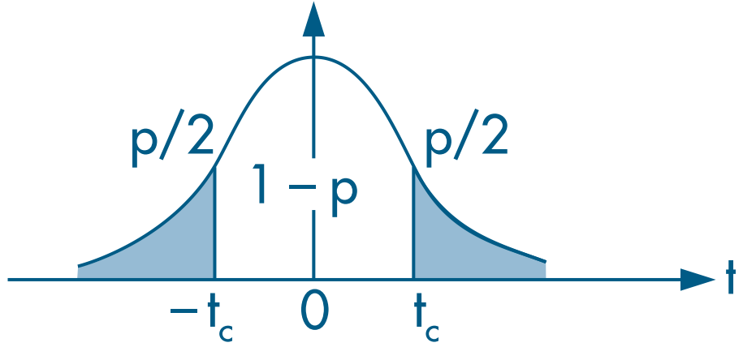
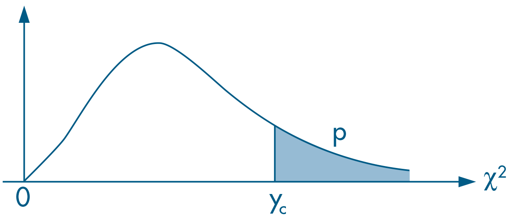

```{r setup, include=FALSE}
knitr::opts_chunk$set(echo = TRUE)
# wd = "~/../OneDrive/FEA-RP/Disciplinas/REC5004_Econometria-I/Monitoria-FHN/PNADc" # Aspire
# wd = "~/../FEA-RP/Disciplinas/REC5004_Econometria-I/Monitoria-FHN/PNADc" # Nitro
```

- Agora, veremos formas mais gerais de testes de hipótese, que não são normalmente informadas nos resultados das regressões.


## Teste de Wald
- Considere:
  - $G$ o número de restrições lineares
  - $\boldsymbol{\beta}$ é um vetor de parâmetros $(K+1) \times 1$
  - $\boldsymbol{h}$ é um vetor de constantes $Q \times 1$
  - $\boldsymbol{R}$ é uma matriz $G \times (K+1)$, contida por diversos vetores-linha $\boldsymbol{r}'_g$ de dimensões $1 \times (K+1)$, para $g=1, 2, ..., Q$
  - Modelo multivariado:
  
  $$y = \beta_0 + \beta_1 x_1 + \beta_2 x_2 + ... + \beta_K x_K + \varepsilon$$

- A partir destas matrizes e vetores, é possível construir testes de hipótese na forma:
\begin{align}
\text{H}_0: &\underset{G\times (K+1)}{\boldsymbol{R}} \underset{(K+1)\times 1}{\boldsymbol{\beta}} = \underset{G \times 1}{\boldsymbol{h}} \\
\text{H}_0: &\left[ \begin{matrix} \boldsymbol{r}'_1 \\ \boldsymbol{r}'_2 \\ \vdots \\ \boldsymbol{r}'_{G} \end{matrix} \right] \boldsymbol{\beta} = \left[ \begin{matrix} h_1 \\ h_2 \\ \vdots \\ h_G \end{matrix} \right] \\
\text{H}_0: &\left\{ \begin{matrix} \boldsymbol{r}'_1 \boldsymbol{\beta} = h_1 \\ \boldsymbol{r}'_2 \boldsymbol{\beta} = h_2 \\ \vdots \\ \boldsymbol{r}'_G \boldsymbol{\beta} = h_G \end{matrix} \right.
\end{align}


### Uma restrição linear

- Considere o modelo:
  $$y = \beta_0 + \beta_1 x_1 + \beta_2 x_2 + \varepsilon$$

- Logo, há $K=2$ variáveis explicativas (e há 3 parâmetros)
- 1 restrição linear $\Longrightarrow \ G=1$
- Logo, neste caso específico, temos
$$\boldsymbol{R} = \boldsymbol{r}'_1\ \ \ \implies\ \ \ \text{H}_0:\ \boldsymbol{r}'_1 \boldsymbol{\beta} = h_1 $$

- Então, calcula-se a estatística _t_:
$$ t = \frac{\boldsymbol{r}'_1 \hat{\boldsymbol{\beta}} - h_1}{\sqrt{\boldsymbol{r}'_1 S^2 (\boldsymbol{X}'\boldsymbol{X})^{-1} \boldsymbol{r}_1}} = \frac{\boldsymbol{r}'_1 \hat{\boldsymbol{\beta}} - h_1}{\sqrt{\boldsymbol{r}'_1 \boldsymbol{V_{\hat{\beta}}} \boldsymbol{r}_1}} $$


#### Exemplo 1: H$_0: \ \beta_1 = 4$

- Podemos fazer o teste _t_ usando:

$$ t = \frac{\hat{\beta}_1 - 4}{\sqrt{\text{var}(\hat{\beta}_1)}} = \frac{\hat{\beta}_1 - 4}{\text{se}(\hat{\beta}_1)} $$

- Na forma vetorial:
  - Note que $h_1 = 4$
  - O vetor $r'_1$ pode ser escrito como

$$ r'_1 = \left[ \begin{matrix} 0 & 1 & 0 \end{matrix} \right] $$

  - Então, a hipótese nula é
$$\text{H}_0:\ \left[ \begin{matrix} 0 & 1 & 0 \end{matrix} \right] \left[ \begin{matrix} \beta_0 \\ \beta_1 \\ \beta_2 \end{matrix} \right] = 4\ \iff\ \beta_1 = 4 $$


#### Exemplo 2: H$_0: \ \beta_1 + \beta_2 = 2$

- Podemos fazer o teste _t_ usando:

$$ t = \frac{(\hat{\beta}_1 + \hat{\beta}_2) - 2}{\sqrt{\text{var}(\hat{\beta}_1 + \hat{\beta}_2)}} = \frac{(\hat{\beta}_1 + \hat{\beta}_2) - 2}{\sqrt{\text{var}(\hat{\beta}_1) + \text{var}(\hat{\beta}_2) + 2 \text{cov}(\hat{\beta}_1, \hat{\beta}_2)}} $$


- Na forma vetorial:
  - Note que $h_1 = 2$
  - O vetor $r'_1$ pode ser escrito como
  
  $$ r'_1 = \left[ \begin{matrix} 0 & 1 & 1 \end{matrix} \right] $$
  
  - Então, a hipótese nula é
  $$\text{H}_0:\ \left[ \begin{matrix} 0 & 1 & 1 \end{matrix} \right] \left[ \begin{matrix} \beta_0 \\ \beta_1 \\ \beta_2 \end{matrix} \right] = 2\ \iff\ \beta_1 + \beta_2 = 2 $$


#### Aplicando no R

#### Avaliando a hipótese nula com restrição única
- Para o caso com uma única restrição, assumimos que 
$$ \boldsymbol{r}'_1 \hat{\boldsymbol{\beta}} \sim N(\boldsymbol{r}'_1 \hat{\boldsymbol{\beta}};\ \boldsymbol{r}'_1 \boldsymbol{V_{\hat{\beta}} r_1})$$

- Calcula-se a estatística _t_:
$$ t = \frac{\boldsymbol{r}'_1 \hat{\boldsymbol{\beta}} - h_1}{\sqrt{\boldsymbol{r}'_1 S^2 (\boldsymbol{X}'\boldsymbol{X})^{-1} \boldsymbol{r}_1}} = \frac{\boldsymbol{r}'_1 \hat{\boldsymbol{\beta}} - h_1}{\sqrt{\boldsymbol{r}'_1 \boldsymbol{V_{\hat{\beta}}} \boldsymbol{r}_1}} $$

- Note que, em pequenas amostras, precisamos assumir que $ u|x \sim N(0; \sigma^2) $
- Escolhe-se o nível de significância $\alpha$ e rejeita-se a hipótese nula se a estatística _t_ não pertencer ao intervalo de confiança.


##### (Continuação) Exemplo 7.5 - Equação do Log do Salário-Hora (Wooldridge, 2006)
- Anteriormente, estimamos o seguinte modelo:

\begin{align}
\log(\text{wage}) = &\beta_0 + \beta_1 \text{female} + \beta_2 \text{married} + \delta_2 \text{female*married} + \beta_3 \text{educ} +\\
&\beta_4 \text{exper} + \beta_5 \text{exper}^2 + \beta_6 \text{tenure} + \beta_7 \text{tenure}^2 + u \end{align}
em que:

- `wage`: salário médio por hora
- `female`: dummy em que (1) mulher e (0) homem
- `married`: dummy em que (1) casado e (0) solteiro
- `female*married`: interação (multiplicação) das _dummies_ `female` e `married`
- `educ`: anos de educação
- `exper`: anos de experiência (`expersq` = anos ao quadrado)
- `tenure`: anos de trabalho no empregador atual (`tenursq` = anos ao quadrado)


```{r}
# Carregando a base de dados necessária
data(wage1, package="wooldridge")

# Estimando o modelo
res_7.14 = lm(lwage ~ female*married + educ + exper + expersq + tenure + tenursq, data=wage1)
round( summary(res_7.14)$coef, 5 )
```

- Notamos que o efeito do casamento sobre mulheres é diferente do efeito sobre homens, pois o parâmetro de `female:married` ($\delta_2$) é significante.
- No entanto, para avaliar se o efeito do casamento sobre a mulher é significante, precisamos ver se H$_0 :\ \beta_2 + \delta_2 = 0$, sendo que:

$$ \hat{\beta}_2 = 0.21268, \qquad \hat{\delta}_2 = -0.30059 $$


- Como tem apenas uma restrição, a hipótese pode ser avaliada por teste _t_:



- Observe que a matriz de variância/covariância das estimativas ($V_{\hat{\beta}}$) é:
```{r}
round(vcov(res_7.14), 5)
```
em que as diagonais são as variâncias das estimativas e os demais elementos são as covariâncias entre as estimativas:
$$ V_{\hat{\beta}} = \left[ \begin{matrix} var(\hat{\beta}_0) & cov(\hat{\beta}_0, \hat{\beta}_1) & \cdots & cov(\hat{\beta}_0, \hat{\beta}_K) \\ cov(\hat{\beta}_0, \hat{\beta}_1) & var(\hat{\beta}_1) & \cdots & cov(\hat{\beta}_1, \hat{\beta}_K) \\ \vdots & \vdots & \ddots & \vdots \\ cov(\hat{\beta}_0, \hat{\beta}_K) & cov(\hat{\beta}_1, \hat{\beta}_K) & \cdots & var(\hat{\beta}_K) \end{matrix} \right]  $$ 

logo:

$$ var(\hat{\beta}_2) = 0.00306, \quad 
var(\hat{\delta}_2) = 0.00515, \quad 
cov(\hat{\beta}_2, \hat{\delta}_2) = -0.00274 $$ 


- Podemos calcular a estatística _t_ por:

\begin{align} t &= \frac{(\hat{\beta}_2 + \hat{\delta}_2) - 0}{\sqrt{\text{var}(\hat{\beta}_2 + \hat{\delta}_2)}} = \frac{\hat{\beta}_2 + \hat{\delta}_2}{\sqrt{\text{var}(\hat{\beta}_2) + \text{var}(\hat{\delta}_2) + 2 \text{cov}(\hat{\beta}_2, \hat{\delta}_2)}} \\
&= \frac{0.21268 - 0.30059}{\sqrt{0.00306 + 0.00515 + 2 (-0.00274)}} = \frac{-0.08791}{\sqrt{0.00273}} \\
&= -1.68251 \end{align}


- O mesmo pode ser feito vetorialmente:

```{r}
# Extraindo objetos da regressão
bhat = matrix(coef(res_7.14), ncol=1) # coeficientes como vetor-coluna
Vbhat = vcov(res_7.14) # matriz de variância-covariância do estimador
N = nrow(wage1) # número de observações
K = length(bhat) - 1 # número de covariadas
uhat = residuals(res_7.14) # resíduos da regressão

# Criando vetor-linha de restrição
r1prime = matrix(c(0, 0, 1, 0, 0, 0, 0, 0, 1), nrow=1) # vetor restrição
h1 = 0 # constante da H0
G = 1 # número de restrições

# Calculando a estatística t
t_numer = r1prime %*% bhat - h1 # numerador de t
t_numer
t_denom = sqrt( r1prime %*% Vbhat %*% t(r1prime) ) # denominador de t
t_denom
t = t_numer / t_denom # estatistica t
t

# Avaliando valor crítico em distribuição Qui-quadrado a 5% signif.
c = qt(1 - 0.05/2, df=N-K-1)
c

# Calculando o p-valor
p = pt(-abs(t), N-K-1) * 2
p
```

- O valor ficou um pouco diferente por arredondamento
- Como $|t| < 1,9646$, então não rejeitamos a hipótese nula e concluímos que o efeito do casamento sobre o salário de mulheres ($\beta_2 + \delta_2$) é estatisticamente não-significante.

- Também podemos fazer o mesmo pelo teste de Wald, mas avaliando a estatística pela distribuição $\chi^2$ com 1 grau de liberdade (pois há apenas $G=1$ restrição)

$$ w(\hat{\boldsymbol{\beta}}) = \left[ \boldsymbol{r}'_1 \hat{\boldsymbol{\beta}} - h_1 \right]' \left[ \boldsymbol{\boldsymbol{r}'_1  V_{\hat{\beta}} \boldsymbol{r}_1 }' \right]^{-1} \left[ \boldsymbol{r}'_1 \hat{\boldsymbol{\beta}} - h_1 \right]\ \sim\ \chi^2_{(1)} $$

- Lembre-se também que usa-se o teste qui-quadrado unicaudal à direita.





```{r}
# Calculando estatística de Wald
aux = r1prime %*% bhat - h1 # R \beta - h
w = t(aux) %*% solve( r1prime %*% Vbhat %*% t(r1prime)) %*% aux
w

# Avaliando valor crítico em distribuição Qui-quadrado a 5% signif.
c = qchisq(1-0.05, df=G)
c

# Calculando p-valor de w
p = 1 - pchisq(w, df=G)
p
```


</br>


### Múltiplas restrições lineares

#### Exemplo 3: H$_0: \ \beta_1 = 0\ \text{ e }\ \beta_1 + \beta_2 = 2$
- Note que $h_1 = 0 \text{ e } h_2 = 2$
- Os vetores $r'_1 \text{ e } r'_2$ podem ser escritos como

$$ r'_1 = \left[ \begin{matrix} 0 & 1 & 0 \end{matrix} \right] \quad \text{e} \quad r'_2 = \left[ \begin{matrix} 0 & 1 & 1 \end{matrix} \right] $$

- Logo, $\boldsymbol{R}$ é
$$ \boldsymbol{R} = \left[ \begin{matrix} \boldsymbol{r}'_1 \\ \boldsymbol{r}'_2 \end{matrix} \right] = \left[ \begin{matrix} 0 & 1 & 0 \\ 0 & 1 & 1 \end{matrix} \right] $$

- Então, a hipótese nula é
$$\text{H}_0:\ \boldsymbol{R} \boldsymbol{\beta} = \left[ \begin{matrix} 0 & 1 & 0 \\ 0 & 1 & 1 \end{matrix} \right] \left[ \begin{matrix} \beta_0 \\ \beta_1 \\ \beta_2 \end{matrix} \right] = \left[ \begin{matrix} h_1 \\ h_2 \end{matrix} \right]\ \iff\ \text{H}_0:\ \left\{  \begin{matrix} \beta_1 &= 0 \\ \beta_1 + \beta_2 &= 2 \end{matrix} \right. $$


#### Avaliando a hipótese nula com múltiplas restrições
- Para o caso com _G_ restrições, assumimos que 
$$ \boldsymbol{R} \hat{\boldsymbol{\beta}} \sim N(\boldsymbol{R} \hat{\boldsymbol{\beta}};\ \sigma^2 \boldsymbol{R} \boldsymbol{V_{\hat{\beta}} R'})$$

- Calcula-se a estatística de Wald
$$ w(\hat{\boldsymbol{\beta}}) = \left[ \boldsymbol{R}\hat{\boldsymbol{\beta}} - \boldsymbol{h} \right]' \left[ \boldsymbol{R V_{\hat{\beta}} R}' \right]^{-1} \left[ \boldsymbol{R}\hat{\boldsymbol{\beta}} - \boldsymbol{h} \right]\ \sim\ \chi^2_{(G)} $$

- Escolhe-se o nível de significância $\alpha$ e rejeita-se a hipótese nula se a estatística $ w(\hat{\boldsymbol{\beta}})$ não pertencer ao intervalo de confiança (do zero ao valor crítico).

</br>

### Aplicando no R

- Como exemplo, usaremos o pacote de dados `mlb1` com estatísticas de jogadores de beisebol (Wooldridge, 2006, Seção 4.5)
- Queremos estimar o modelo:
\begin{align} \log(\text{salary}) = &\beta_0 + \beta_1. \text{years} + \beta_2. \text{gameyr} + \beta_3. \text{bavg} + \\
&\beta_4 .\text{hrunsyr} + \beta_5. \text{rbisyr} + u \end{align}


em que:
  - `log(salary)`: log do salário de 1993
  - `years`: anos jogando na 1ª divisão de beisebol americano
  - `gamesyr`: média de jogos por ano
  - `bavg`: média de rebatidas na carreira
  - `hrunsyr`: média de _home runs_ por ano
  - `rbisyr`: média de corridas impulsionadas por ano

```{r}
data(mlb1, package="wooldridge")

# Estimando o modelo completo (irrestrito)
resMLB = lm(log(salary) ~ years + gamesyr + bavg + hrunsyr + rbisyr, data=mlb1)
round(summary(resMLB)$coef, 5) # coeficientes da estimação
```

- Note que, individualmente, as variáveis `bavg`, `hrunsyr` e `rbisyr` são estatisticamente não significantes.
- Queremos avaliar se eles são estatisticamente significantes de forma conjunta, ou seja,
$$ \text{H}_0:\ \left\{ \begin{matrix} \beta_3 = 0 \\ \beta_4 = 0 \\ \beta_5 = 0\end{matrix} \right.   $$

- Logo, temos que
$$ \boldsymbol{R} = \left[ \begin{matrix} \boldsymbol{r}'_1 \\ \boldsymbol{r}'_2 \\ \boldsymbol{r}'_3 \end{matrix} \right] = \left[ \begin{matrix} 0 & 0 & 0 & 1 & 0 & 0 \\ 0 & 0 & 0 & 0 & 1 & 0 \\ 0 & 0 & 0 & 0 & 0 & 1 \end{matrix} \right] $$


#### Usando função `wald.test()`

```{r}
# Extraindo matriz de variância-covariância do estimador
Vbhat = vcov(resMLB)
round(Vbhat, 5)

# Número de restrições
G = 3

# Matriz das restrições
R = matrix(c(0, 0, 0, 1, 0, 0,
             0, 0, 0, 0, 1, 0,
             0, 0, 0, 0, 0, 1),
           nrow=G, byrow=TRUE)
R

# Vetor de constantes h
h = matrix(c(0, 0, 0), ncol=1)
h
```

- Lembre-se que, por padrão, a função `matrix()` "preenche" a matrix por coluna.
- No entanto, é mais intuito preencher as restrições por linha (já que cada linha representa uma restrição). Para isto, foi usado o argumento `byrow=TRUE`.

```{r}
# Calculando a estatística de Wald
# install.packages("aod") # instalando o pacote necessário
aod::wald.test(Sigma = Vbhat, # matriz de variância-covariância
               b = coef(resMLB), # estimativas
               L = R, # matriz de restrições
               H0 = h # Hipótese nula (tudo igual a zero)
               )

```

- Observe que rejeitamos a hipótese nula e, portanto, os parâmetros $\beta_3, \beta_4 \text{ e } \beta_5$ são conjuntamente significantes.


#### Calculando "na mão"

- Estimando o modelo
```{r}
# Criando variavel log_salary
mlb1$log_salary = log(mlb1$salary)
name_y = "log_salary"
names_X = c("years", "gamesyr", "bavg", "hrunsyr", "rbisyr")

# Criando o vetor y
y = as.matrix(mlb1[,name_y]) # transformando coluna de data frame em matriz

# Criando a matriz de covariadas X com primeira coluna de 1's
X = as.matrix( cbind( const=1, mlb1[,names_X] ) ) # juntando 1's com as covariadas

# Pegando valores N e K
N = nrow(mlb1)
K = ncol(X) - 1

# Estimando o modelo
bhat = solve( t(X) %*% X ) %*% t(X) %*% y
round(bhat, 5)

# Calculando os resíduos
uhat = y - X %*% bhat

# Variância do termo de erro
S2 = as.numeric( t(uhat) %*% uhat / (N-K-1) )

# Matriz de variância-covariância do estimador
Vbhat = S2 * solve( t(X) %*% X )
round(Vbhat, 5)
```

- Calculando a estatística de Wald, dada por
$$ w(\hat{\boldsymbol{\beta}}) = \left[ \boldsymbol{R}\hat{\boldsymbol{\beta}} - \boldsymbol{h} \right]' \left[ \boldsymbol{R V_{\hat{\beta}} R}' \right]^{-1} \left[ \boldsymbol{R}\hat{\boldsymbol{\beta}} - \boldsymbol{h} \right]\ \sim\ \chi^2_{(G)} $$

```{r}
# Estatística de Wald
w = t( R %*% bhat - h ) %*% solve( R %*% Vbhat %*% t(R) ) %*% (R %*% bhat - h)
w

# Encontrando valor crítico Qui-quadrado para 5% de signif.
alpha = 0.05
c = qchisq(1-alpha, df=G)
c

# Encontrando p-valor
p = 1 - pchisq(w, df=G)
p
```

- Como Estatística de Wald (= 28,65) é maior do que o valor crítico (= 7,81), então rejeitamos a hipótese nula conjunta de que todos parâmetros testados são iguais a zero.
- Também poderíamos verificar o p-valor por meio da estatística de Wald:
```{r}
1 - pchisq(w, df=G)
```

- Como é menor do que 5%, rejeita-se a hipótese nula.


</br>


## Teste F

- [Seção 4.3 de Heiss (2020)](http://www.urfie.net/read/index.html#page/133)
- Uma forma mais adequada para avaliar restrições múltiplas em pequenas amostras é por meio do teste F.
- Nele, estimamos dois modelos:
  - Irrestrito: inclui todas as as variáveis explicativas de interesse
  - Restrito: exclui algumas variáveis da estimação
- O teste F compara as somas dos quadrados dos resíduos (SQR) ou os R$^2$ de ambos modelos.
- A ideia é: se as variáveis excluídas forem significantes conjuntamente, então haverá uma diferença de poder explicativo entre os modelos e, logo, as variáveis seriam significantes.

</br>

- A estatística _F_ pode ser calculada por:

$$ F = \frac{\text{SQR}_{r} - \text{SQR}_{ur}}{\text{SQR}_{ur}}.\frac{N-K-1}{G} = \frac{R^2_{ur} - R^2_{r}}{1 - R^2_{ur}}.\frac{N-K-1}{G} \tag{4.10} $$

em que `ur` indica o modelo irrestrito, e `r` indica o modelo restrito.

- Depois, avalia-se a estatística _F_ a partir de um teste unicaudal à direita em uma distribuição _F_:


### Aplicando no R

- Aqui, continuaremos usando a base de dados `mlb1` da Seção 4.5 de Wooldridge (2006)
- O modelo irrestrito (com todas variáveis explicativas) é:
\begin{align} \log(\text{salary}) = &\beta_0 + \beta_1. \text{years} + \beta_2. \text{gameyr} + \beta_3. \text{bavg} + \\
&\beta_4 .\text{hrunsyr} + \beta_5. \text{rbisyr} + u \end{align}

- O modelo restrito (excluindo as variáveis) é:
\begin{align} \log(\text{salary}) = &\beta_0 + \beta_1. \text{years} + \beta_2. \text{gameyr} + u \end{align}


#### Usando função `linearHypothesis()`
- É possível fazer o teste _F_ a partir da função `linearHypothesis()` do pacote `car`
- Além de incluir o objeto resultante de uma estimação, é necessário incluir um vetor de texto com as restrições:

```{r}
# Estimando o modelo irrestrito
res.ur = lm(log(salary) ~ years + gamesyr + bavg + hrunsyr + rbisyr, data=mlb1)

# Criando vetor com as restrições
myH0 = c("bavg = 0", "hrunsyr = 0", "rbisyr = 0")

# Aplicando o teste F
# install.packages("car") # instalando o pacote necessário
car::linearHypothesis(res.ur, myH0)
```

- Note que na 2ª linha (modelo irrestrito), a soma dos quadrados dos resíduos (SQR/RSS) é menor do que o do modelo restrito e, portanto, o conjunto maior de covariadas tem um maior poder explicativo (o que é esperado)
- Para avaliar a hipótese nula ($\beta_3 = \beta_4 = \beta_5 = 0$), podemos verificar se a estatística _F_ é maior do que um valor crítico (dado um nível de significância), ou avaliarmos se o p-valor é menor do que esse nível de significância.
- É possível ver acima, pelo segundo critério, que rejeitamos a hipótese nula.
- Podemos ver o valor crítico a 5% de significância via:

```{r}
qf(1-0.05, G, N-K-1)
```
- Como 9,55 > 2,63, então rejeitamos a hipótese nula.


#### Calculando "na mão"

- Aqui, vamos estimar os resultados dos modelos irrestrito e restrito, estimados por `lm()` para não ter que fazer todos passos da estimação duas vezes.

```{r}
# Estimando o modelo irrestrito
res.ur = lm(log(salary) ~ years + gamesyr + bavg + hrunsyr + rbisyr, data=mlb1)

# Estimando o modelo restrito
res.r = lm(log(salary) ~ years + gamesyr, data=mlb1)

# Extraindo os R2 dos resultados das estimações
r2.ur = summary(res.ur)$r.squared
r2.ur
r2.r = summary(res.r)$r.squared
r2.r

# Calculando a estatística F
F = ( r2.ur - r2.r ) / (1 - r2.ur) * (N-K-1) /  G
F

# p-valor do teste F
1 - pf(F, G, N-K-1)
```


</br>


