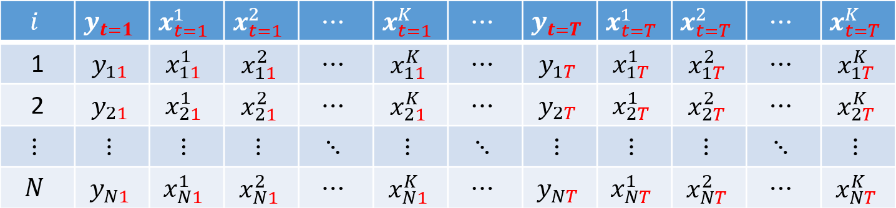

```{r setup, include=FALSE}
knitr::opts_chunk$set(echo = TRUE)
# wd = "~/../OneDrive/FEA-RP/Disciplinas/REC5004_Econometria-I/Monitoria-FHN/PNADc" # Aspire
# wd = "~/../FEA-RP/Disciplinas/REC5004_Econometria-I/Monitoria-FHN/PNADc" # Nitro
```


## Estrutura dos Dados

- Seção 2.1.1 de "Panel Data Econometrics with R" (Croissant \& Millo, 2018)
- A maioria das notações foram adaptadas de acordo com as notas de aula de Econometria I.


### Corte Transversal
Até agora, utilizamos bases de dados em corte transversal (ou _cross-section_, em inglês), ou seja, em que cada linha representava um indivíduo $i  = 1, ..., N$ e observamos as realizações da variável dependente $y$ e das variáveis explicativas $k = 1, 2, ..., K$:


#### Exemplo
Considerando $N = 4$ indivíduos e $K = 2$ covariadas, segue o exemplo:


### Painel
Também é comum utilizarmos dados em painel, isto é, uma base de dados em que observamos os indivíduos $i = 1, ..., N$ nos $t = 1, ..., T$ períodos.

Este tipo de estrutura de dado permite, além de fazer comparações inter-indivíduos (_between_), avaliar diferenças intra-indivíduos (_within_) a partir das variações ocorridas ao longo do tempo para um mesmo indivíduo.

Por simplicidade, consideramos que todos indivíduos possuem $T$ observações ao longo do tempo (**painel balanceado**). Além disso, dados em painel podem estar dispostos de duas formas: longa ou curta.


##### Painel longo (_long_, em inglês)
Aqui, cada indivíduo aparece em $T$ linhas. Cada observação é indicada pela dupla $i$ e $t$ (variáveis-chave da base de dados). Essa é a forma padrão utilizada em Econometria.


##### Painel curto (_wide_, em inglês)
Na forma curta, as informações das variáveis dependentes e independentes aparecem repetidamente por $T$ vezes, sendo que cada repetição corresponde a um dos $T$ períodos:




#### Exemplos
Como exemplo, consideramos $N = 4$ indivíduos e $K = 2$ covariadas e $T = 2$ períodos. As bases de dados em paineis longo e curto, respectivamente, teriam as seguintes estruturas:


## Modelo em Painel

Para a observação do indivíduo $i \in \{1, ..., N\}$ no período $t \in \{1, ..., T\}$, podemos escrever o modelo como:

$$ y_{it} = \boldsymbol{x}'_{it} \boldsymbol{\beta} + \varepsilon_{it} \tag{1} $$ 
em que $\boldsymbol{\beta}$ é um vetor-coluna de $K$ parâmetros

$$ \boldsymbol{\beta} = \left[ \begin{array}{c} \beta_0 \\ \beta_1 \\ \beta_2 \\ \vdots \\ \beta_K \end{array} \right], $$

$y_{it}$ é a variável dependente, $\boldsymbol{x}'_{it}$ é o vetor-linha de dimensão $K+1$:

$$ \boldsymbol{x}'_{it} = \left[ \begin{array}{c} 1 & x^1_{it} & x^2_{it} & \cdots & x^K_{it} \end{array} \right],  $$

e o erro $\varepsilon_{it}$ pode ser escrito como:

$$ \varepsilon_{it} = u_i + v_{it},  $$
sendo $u_i$ o erro individual para o indivíduo $i$ e $v_{it}$ é o erro idiossincrático (residual).

Empilhando as equações (1) para todo indivíduo $i = 1, 2, ..., N$ e todo período $t = 1, 2, ..., T $, temos

$$ \underbrace{\boldsymbol{y}}_{NT \times 1} = \left[ \begin{array}{c}
    y_{11} \\ y_{12} \\ \vdots \\ y_{1T} \\\hline y_{21} \\ y_{22} \\ \vdots \\ y_{2T} \\\hline \vdots \\\hline y_{N1} \\ y_{N2} \\ \vdots \\ y_{NT}
\end{array} \right] \quad \text{ e } \quad 
\underbrace{\boldsymbol{X}}_{NT \times K} = \left[ \begin{array}{c}
    \boldsymbol{x}'_{11} \\ \boldsymbol{x}'_{12} \\ \vdots \\ \boldsymbol{x}'_{1T} \\\hline
    \boldsymbol{x}'_{21} \\ \boldsymbol{x}'_{22} \\ \vdots \\ \boldsymbol{x}'_{2T} \\\hline
    \vdots \\\hline
    \boldsymbol{x}'_{N1} \\ \boldsymbol{x}'_{N2} \\ \vdots \\ \boldsymbol{x}'_{NT} 
    \end{array} \right]
  = \left[ \begin{array}{ccccc}
    1 & x^1_{11} & x^2_{11} & \cdots & x^K_{11} \\
    1 & x^1_{12} & x^2_{12} & \cdots & x^K_{12} \\
    \vdots & \vdots & \vdots & \ddots & \vdots \\
    1 & x^1_{1T} & x^2_{1T} & \cdots & x^K_{1T} \\\hline
    1 & x^1_{21} & x^2_{21} & \cdots & x^K_{21} \\
    1 & x^1_{22} & x^2_{22} & \cdots & x^K_{22} \\
    \vdots & \vdots & \vdots & \ddots & \vdots \\
    1 & x^1_{2T} & x^2_{2T} & \cdots & x^K_{2T} \\\hline
    \vdots & \vdots & \vdots & \ddots & \vdots \\\hline
    1 & x^1_{N1} & x^2_{N1} & \cdots & x^K_{N1} \\
    1 & x^1_{N2} & x^2_{N2} & \cdots & x^K_{N2} \\
    \vdots & \vdots & \vdots & \ddots & \vdots \\
    1 & x^1_{NT} & x^2_{NT} & \cdots & x^K_{NT}
\end{array} \right] $$ 
As linhas horizontais foram inseridas apenas para facilitar a visualização dos valores referentes a cada indivíduo $i$.


</br>

## Matriz de Variâncias-Covariâncias dos Erros
- Seção 2.2 de "Panel Data Econometrics with R" (Croissant \& Millo, 2018)

A Matriz de Variâncias-Covariâncias dos Erros relaciona um termo de erro, $\varepsilon_{it}$, com todos os demais termos de erro $\varepsilon_{js}$, para todo $j = 1, ..., N$ e todo $a = 1, ..., T$.

Na matriz de covariância de erro, cada linha representa um $\varepsilon_{it}$ e cada coluna representa um $\varepsilon_{jt}$. Seus elementos representam a covariância entre 
$\varepsilon_{it}$ e $\varepsilon_{jt}$, sendo que pode haver $\varepsilon_{it} = \varepsilon_{jt}$ (que, neste caso, torna-se variância):

$$ cov(\boldsymbol{\varepsilon}) = \underset{NT \times NT}{\boldsymbol{\Sigma}} =$$
$$ \left[ \tiny \begin{array}{cccc|ccc|c|ccc}
var(\varepsilon_{{\color{red}1}1}) & cov(\varepsilon_{{\color{red}1}1}, \varepsilon_{{\color{red}1}2}) & \cdots & cov(\varepsilon_{{\color{red}1}1}, \varepsilon_{{\color{red}1}T}) & cov(\varepsilon_{{\color{red}1}1}, \varepsilon_{{\color{red}2}1}) & \cdots & cov(\varepsilon_{{\color{red}1}1}, \varepsilon_{{\color{red}2}T}) & \cdots & cov(\varepsilon_{{\color{red}1}1}, \varepsilon_{{\color{red}N}1}) & \cdots & cov(\varepsilon_{{\color{red}1}1}, \varepsilon_{{\color{red}N}T}) \\
cov(\varepsilon_{{\color{red}1}2}, \varepsilon_{{\color{red}1}1}) & var(\varepsilon_{{\color{red}1}2}) & \cdots & cov(\varepsilon_{{\color{red}1}2}, \varepsilon_{{\color{red}1}T}) & cov(\varepsilon_{{\color{red}1}2}, \varepsilon_{{\color{red}2}1}) & \cdots & cov(\varepsilon_{{\color{red}1}2}, \varepsilon_{{\color{red}2}T}) & \cdots & cov(\varepsilon_{{\color{red}1}2}, \varepsilon_{{\color{red}N}1}) & \cdots & cov(\varepsilon_{{\color{red}1}2}, \varepsilon_{{\color{red}N}T}) \\
\vdots & \vdots & \ddots & \vdots & \vdots & \ddots & \vdots & \ddots & \vdots & \ddots & \vdots \\
cov(\varepsilon_{{\color{red}1}T}, \varepsilon_{{\color{red}1}1}) & cov(\varepsilon_{{\color{red}1}T}, \varepsilon_{{\color{red}1}2}) & \cdots & var(\varepsilon_{{\color{red}1}T}) & cov(\varepsilon_{{\color{red}1}T}, \varepsilon_{{\color{red}2}1}) & \cdots & cov(\varepsilon_{{\color{red}1}T}, \varepsilon_{{\color{red}2}T}) & \cdots & cov(\varepsilon_{{\color{red}1}T}, \varepsilon_{{\color{red}N}1}) & \cdots & cov(\varepsilon_{{\color{red}1}T}, \varepsilon_{{\color{red}N}T}) \\ \hline
cov(\varepsilon_{{\color{red}2}1}, \varepsilon_{{\color{red}1}1}) & cov(\varepsilon_{{\color{red}2}1}, \varepsilon_{{\color{red}1}2}) & \cdots & cov(\varepsilon_{{\color{red}2}1}, \varepsilon_{{\color{red}1}T}) & var(\varepsilon_{{\color{red}2}1}) & \cdots & 
cov(\varepsilon_{{\color{red}2}1}, \varepsilon_{{\color{red}2}T}) & \cdots & cov(\varepsilon_{{\color{red}2}1}, \varepsilon_{{\color{red}N}1}) & \cdots & cov(\varepsilon_{{\color{red}2}1}, \varepsilon_{{\color{red}N}T}) \\
\vdots & \vdots & \ddots & \vdots & \vdots & \ddots & \vdots & \ddots & \vdots & \ddots & \vdots \\
cov(\varepsilon_{{\color{red}2}T}, \varepsilon_{{\color{red}1}1}) & cov(\varepsilon_{{\color{red}2}T}, \varepsilon_{{\color{red}1}2}) & \cdots & cov(\varepsilon_{{\color{red}2}T}, \varepsilon_{{\color{red}1}T}) & cov(\varepsilon_{{\color{red}2}T}, \varepsilon_{{\color{red}2}1}) & \cdots & var(\varepsilon_{{\color{red}2}T}) & \cdots & 
cov(\varepsilon_{{\color{red}2}T}, \varepsilon_{{\color{red}N}1}) & \cdots & cov(\varepsilon_{{\color{red}2}T}, \varepsilon_{{\color{red}N}T}) \\ \hline
\vdots & \vdots & \ddots & \vdots & \vdots & \ddots & \vdots & \ddots & \vdots & \ddots & \vdots \\ \hline
cov(\varepsilon_{{\color{red}N}1}, \varepsilon_{{\color{red}1}1}) & cov(\varepsilon_{{\color{red}N}1}, \varepsilon_{{\color{red}1}2}) & \cdots & cov(\varepsilon_{{\color{red}N}1}, \varepsilon_{{\color{red}1}T}) & cov(\varepsilon_{{\color{red}N}1}, \varepsilon_{{\color{red}2}1}) & \cdots & 
cov(\varepsilon_{{\color{red}N}1}, \varepsilon_{{\color{red}2}T}) & \cdots & var(\varepsilon_{{\color{red}N}1}) & \cdots &
cov(\varepsilon_{{\color{red}N}1}, \varepsilon_{{\color{red}N}T}) \\
\vdots & \vdots & \ddots & \vdots & \vdots & \ddots & \vdots & \ddots & \vdots & \ddots & \vdots \\
cov(\varepsilon_{{\color{red}N}T}, \varepsilon_{{\color{red}1}1}) & cov(\varepsilon_{{\color{red}N}T}, \varepsilon_{{\color{red}1}2}) & \cdots & cov(\varepsilon_{{\color{red}N}T}, \varepsilon_{{\color{red}1}T}) & cov(\varepsilon_{{\color{red}N}T}, \varepsilon_{{\color{red}2}1}) & \cdots & cov(\varepsilon_{{\color{red}N}T}, \varepsilon_{{\color{red}2}T}) & \cdots & 
cov(\varepsilon_{{\color{red}N}T}, \varepsilon_{{\color{red}N}1}) & \cdots & var(\varepsilon_{{\color{red}N}T})
\end{array} \right]$$

Note que a Matriz de Variâncias-Covariâncias dos Erros possui matrizes menores que relacionam os erros do indivíduo $i$ (linha) e do indivíduo $j$ (coluna). Para escrever mais facilmente $\boldsymbol{\Sigma}$, podemos preenchê-la com matrizes menores de $\boldsymbol{\Sigma}_{ij}$:


$$ \underset{NT \times NT}{\boldsymbol{\Sigma}} = \left[ \begin{matrix} 
\boldsymbol{\Sigma}_1 & \boldsymbol{\Sigma}_{12} & \cdots & \boldsymbol{\Sigma}_{1N} \\
\boldsymbol{\Sigma}_{21} & \boldsymbol{\Sigma}_{2} & \cdots & \boldsymbol{\Sigma}_{2N} \\
\vdots & \vdots & \ddots & \vdots \\
\boldsymbol{\Sigma}_{N1} & \boldsymbol{\Sigma}_{N2} & \cdots & \boldsymbol{\Sigma}_{N}
\end{matrix} \right] \tag{1} $$ 

em que, quando $i = j$, temos

$$ \underset{T \times T}{\boldsymbol{\Sigma}_i} = \left[ \begin{matrix} 
var(\varepsilon_{i1}) & cov(\varepsilon_{i1}, \varepsilon_{i2}) & \cdots & cov(\varepsilon_{i1}, \varepsilon_{iT}) \\
cov(\varepsilon_{i1}, \varepsilon_{i2}) & var(\varepsilon_{i2}) & \cdots & cov(\varepsilon_{i2}, \varepsilon_{iT}) \\
\vdots & \vdots & \ddots & \vdots \\
cov(\varepsilon_{i1}, \varepsilon_{iT}) & cov(\varepsilon_{i2}, \varepsilon_{iT}) & \cdots & var(\varepsilon_{iT})
\end{matrix} \right] \tag{2} $$


e, quando $i \neq j$, temos
$$ \underset{T \times T}{\boldsymbol{\Sigma}_{ij}} = \left[ \begin{matrix} 
cov(\varepsilon_{i1}, \varepsilon_{j1}) & cov(\varepsilon_{i1}, \varepsilon_{j2}) & \cdots & cov(\varepsilon_{i1}, \varepsilon_{jT}) \\
cov(\varepsilon_{i1}, \varepsilon_{j2}) & cov(\varepsilon_{i2}, \varepsilon_{j2}) & \cdots & cov(\varepsilon_{i2}, \varepsilon_{jT}) \\
\vdots & \vdots & \ddots & \vdots \\
cov(\varepsilon_{i1}, \varepsilon_{jT}) & cov(\varepsilon_{i2}, \varepsilon_{jT}) & \cdots & cov(\varepsilon_{iT}, \varepsilon_{jT})
\end{matrix} \right]. \tag{3} $$


Como assumimos amostragem aleatória em que a covariância entre dois indivíduos distintos ($i \neq j$) é  
$$ cov(\varepsilon_{it}, \varepsilon_{jt}) = cov(\varepsilon_{it}, \varepsilon_{js}) = 0,  \qquad \text{para todo } i \neq j.$$

Logo, $\boldsymbol{\Sigma}_{ij} = \boldsymbol{0}$ (matriz de zeros):
$$ \underset{T \times T}{\boldsymbol{\Sigma}_{ij}} =  \underset{T \times T}{\boldsymbol{0}} = \left[ \begin{matrix} 
0 & 0 & \cdots & 0 \\
0 & 0 & \cdots & 0 \\
\vdots & \vdots & \ddots & \vdots \\
0 & 0 & \cdots & 0
\end{matrix} \right] $$


Logo, podemos reescrever (1) como

$$ \underset{NT \times NT}{\boldsymbol{\Sigma}} = \left[ \begin{matrix} 
\boldsymbol{\Sigma}_1 & \boldsymbol{0} & \cdots & \boldsymbol{0} \\
\boldsymbol{0} & \boldsymbol{\Sigma}_2 & \cdots & \boldsymbol{0} \\
\vdots & \vdots & \ddots & \vdots \\
\boldsymbol{0} & \boldsymbol{0} & \cdots & \boldsymbol{\Sigma}_N
\end{matrix} \right]. \tag{1'} $$

Assumimos também que a Matriz de Variâncias-Covariâncias dos Erros do indivíduo $i$ depende apenas dos parâmetros $\sigma^2_u$ e $\sigma^2_v$, já que:

- Variância de um erro: $ var(\varepsilon_{it}) = \sigma^2_u + \sigma^2_v $
- Covariância de dois erros de um mesmo indivíduo $i$ em dois períodos  $t \neq s$: $ cov(\varepsilon_{it}, \varepsilon_{is}) = \sigma^2_u $

Substituindo em (2), segue que

$$ \underset{T \times T}{\boldsymbol{\Sigma}_i} = \left[ \begin{array}{cccc} 
\sigma^2_u + \sigma^2_v & \sigma^2_u & \cdots & \sigma^2_u \\
\sigma^2_u & \sigma^2_u + \sigma^2_v & \cdots & \sigma^2_u \\
\vdots & \vdots & \ddots & \vdots \\
\sigma^2_u & \sigma^2_u & \cdots & \sigma^2_u + \sigma^2_v
\end{array} \right] \tag{2'} $$


##### Exemplo
Por simplicidade, considere que $N = 2$ e $T = 3$. Logo, a Matriz de Variâncias-Covariâncias dos Erros pode ser escrita como;

\begin{align} \underset{6 \times 6}{\boldsymbol{\Sigma}}
&= \left[ \begin{array}{cc}
\boldsymbol{\Sigma}_1 & \boldsymbol{0} \\
\boldsymbol{0} & \boldsymbol{\Sigma}_2
\end{array} \right] \\
&= \left[ \begin{array} {ccc|ccc}
\sigma^2_u + \sigma^2_v & \sigma^2_u & \sigma^2_u & 0 & 0 & 0 \\
\sigma^2_u & \sigma^2_u + \sigma^2_v & \sigma^2_u & 0 & 0 & 0 \\
\sigma^2_u & \sigma^2_u & \sigma^2_u + \sigma^2_v & 0 & 0 & 0\\ \hline
0 & 0 & 0 & \sigma^2_u + \sigma^2_v & \sigma^2_u & \sigma^2_u \\
0 & 0 & 0 & \sigma^2_u & \sigma^2_u + \sigma^2_v & \sigma^2_u \\
0 & 0 & 0 & \sigma^2_u & \sigma^2_u & \sigma^2_u + \sigma^2_v \\
\end{array} \right] \end{align} 

Note que acima foram utilizadas linhas verticais e horizontais apenas para facilitar a visualização dos elementos que substituíram cada matriz.


#### Calculando no R

Primeiro, denote $I_p$ a matriz identidade de dimensão $p \times p$:

$$ \boldsymbol{I}_p= \left[ \begin{array}{cccc}
    1 & 0 & 0 & \cdots & 0 \\
    0 & 1 & 0 & \cdots & 0 \\
    0 & 0 & 1 & \cdots & 0 \\
    \vdots & \vdots & \vdots & \ddots & \vdots \\
    0 & 0 & 0 & \cdots & 1
\end{array} \right]_{p \times p}, $$ 

e considere $\boldsymbol{\iota}_q$ um vetor-coluna de 1's de tamanho $q$:
$$ \boldsymbol{\iota}_q = \left[ \begin{array}{c} 1 \\ 1 \\ \vdots \\ 1 \end{array} \right]_{q \times 1} $$


Com dados em **corte transversal**, era fácil calcular a Matriz de Variâncias-Covariâncias dos Erros, pois só havia um termo de erro e, portanto, tínhamos $\sigma^2$ apenas na diagonal principal:

\begin{align}
\boldsymbol{\Sigma}_{\scriptscriptstyle{MQO}} &= \sigma^2 \boldsymbol{I}_N \\
  &= \sigma^2 \left[ \begin{array}{cccc} 
1 & 0 & \cdots & 0 \\
0 & 1 & \cdots & 0 \\
\vdots & \vdots & \ddots & \vdots \\
0 & 0 & \cdots & 1
\end{array} \right] \\
  &= \left[ \begin{array}{cccc} 
\sigma^2 & 0 & \cdots & 0 \\
0 & \sigma^2 & \cdots & 0 \\
\vdots & \vdots & \ddots & \vdots \\
0 & 0 & \cdots & \sigma^2
\end{array} \right]_{N \times N} \end{align}


Agora, para **dados em painel**, como visto acima, possuímos duas variâncias de termos de erro, sendo que $\sigma^2_v$ aparece na diagonal principal, cujos elementos (e seus "vizinhos") precisam ser somados por $\sigma^2_u$. Logo, a Matriz de Variâncias-Covariâncias dos Erros com dados em painel pode ser escrita na forma matricial como:

$$ \boldsymbol{\Sigma} = \sigma^2_v \boldsymbol{I}_{NT} + T \sigma^2_u [\boldsymbol{I}_N \otimes \boldsymbol{\iota}_T (\boldsymbol{\iota}'_T \boldsymbol{\iota}_T)^{-1} \boldsymbol{\iota}'_T] \tag{4} $$

Note que o primeiro termo da soma cria uma diagonal principal de $\sigma^2_v$.

\begin{align}
\sigma^2_v \boldsymbol{I}_{NT} &= \sigma^2_v \left[ \begin{array}{cccc} 
1 & 0 & \cdots & 0 \\
0 & 1 & \cdots & 0 \\
\vdots & \vdots & \ddots & \vdots \\
0 & 0 & \cdots & 1
\end{array} \right] \\
  &= \left[ \begin{array}{cccc} 
\sigma^2_v & 0 & \cdots & 0 \\
0 & \sigma^2_v & \cdots & 0 \\
\vdots & \vdots & \ddots & \vdots \\
0 & 0 & \cdots & \sigma^2_v
\end{array} \right]_{NT \times NT} \end{align}


Agora, "só" precisamos somar $\sigma^2_u$ "na proximidade" dessa diagonal.

Por enquanto, vamos ignorar $T \sigma^2_u$ e vamos chamar a parte entre colchetes de matriz de transformação **inter-indivíduos (_between_)**:

$$ \boldsymbol{B}\ \equiv\ \boldsymbol{I}_N \otimes \Big[ \boldsymbol{\iota}_T (\boldsymbol{\iota}'_T \boldsymbol{\iota}_T)^{-1} \boldsymbol{\iota}'_T \Big] $$

Note que a matriz $\boldsymbol{B}$ é chamada de  $\boldsymbol{N}$ nas notas de aula de Econometria II (2021) do prof. Daniel.

\begin{align}
    \boldsymbol{B} &\equiv \boldsymbol{I}_{N} \otimes \boldsymbol{\iota}_T (\boldsymbol{\iota}'_T \boldsymbol{\iota}_T)^{-1} \boldsymbol{\iota}'_T \\
    &= \left[ \begin{array}{cc} 1 & \cdots & 0 \\ \vdots & \ddots & \vdots \\ 0 & \cdots & 1 \end{array} \right] \otimes \left( \left[ \begin{array}{c} 1 \\ \vdots \\ 1 \end{array} \right] \left( \left[ \begin{array}{ccc} 1 & \cdots & 1 \end{array} \right] \left[ \begin{array}{c} 1 \\ \vdots \\ 1 \end{array} \right] \right)^{-1} \left[ \begin{array}{ccc} 1 & \cdots & 1 \end{array} \right] \right) \\
    &= \left[ \begin{array}{cc} 1 & \cdots & 0 \\ \vdots & \ddots & \vdots \\ 0 & \cdots & 1 \end{array} \right] \otimes \left( \left[ \begin{array}{c} 1 \\ \vdots \\ 1 \end{array} \right] \left( T \right)^{-1} \left[ \begin{array}{ccc} 1 & \cdots & 1 \end{array} \right] \right) \\
    &= \left[ \begin{array}{cc} 1 & \cdots & 0 \\ \vdots & \ddots & \vdots \\ 0 & \cdots & 1 \end{array} \right] \otimes \left( \left[ \begin{array}{c} 1 \\ \vdots \\ 1 \end{array} \right] \frac{1}{T} \left[ \begin{array}{ccc} 1 & \cdots & 1 \end{array} \right] \right) \\
    &= \left[ \begin{array}{cc} 1 & \cdots & 0 \\ \vdots & \ddots & \vdots \\ 0 & \cdots & 1 \end{array} \right] \otimes \left( \frac{1}{T}  \left[ \begin{array}{c} 1 & \cdots & 1 \\ \vdots & \ddots & \vdots \\ 1 & \cdots & 1 \end{array} \right] \right) \\
    &= \left[ \begin{array}{cc} 1 & \cdots & 0 \\ \vdots & \ddots & \vdots \\ 0 & \cdots & 1 \end{array} \right]_{N \times N}  \otimes  \left( \begin{array}{ccc} 1/T & \cdots & 1/T \\ \vdots & \ddots & \vdots\\ 1/T & \cdots & 1/T \end{array} \right)_{T \times T}  \\
    &= \left[ \begin{array}{ccc} 1 \left( \begin{array}{ccc} 1/T & \cdots & 1/T \\
    \vdots & \ddots & \vdots\\ 1/T & \cdots & 1/T \end{array} \right) & \cdots & 0 \left( \begin{array}{ccc} 1/T & \cdots & 1/T \\ \vdots & \ddots & \vdots\\ 1/T & \cdots & 1/T \end{array} \right) \\ \vdots & \ddots & \vdots \\ 0 \left( \begin{array}{ccc} 1/T & \cdots & 1/T \\ \vdots & \ddots & \vdots\\ 1/T & \cdots & 1/T \end{array} \right) & \cdots & 1 \left( \begin{array}{ccc} 1/T & \cdots & 1/T \\ \vdots & \ddots & \vdots\\ 1/T & \cdots & 1/T \end{array} \right) \end{array} \right] \\
    &= \left[ \begin{array}{rrr|r|rrr} 
        1/T & \cdots & 1/T & \cdots & 0 & \cdots & 0 \\
        \vdots & \ddots & \vdots & \cdots & \vdots & \ddots & \vdots \\
        1/T & \cdots & 1/T & \cdots & 0 & \cdots & 0 \\\hline
        \vdots & \vdots & \vdots & \ddots & \vdots & \vdots & \vdots \\\hline
        0 & \cdots & 0 & \cdots & 1/T & \cdots & 1/T \\
        \vdots & \ddots & \vdots & \cdots & \vdots & \ddots & \vdots \\
        0 & \cdots & 0 & \cdots & 1/T & \cdots & 1/T
    \end{array} \right]_{NT \times NT},
\end{align}

em que $\otimes$ é o produto de Kronecker. Agora, ao multiplicar por $T \sigma^2_u$, todos elementos $1/T$ tornam-se $\sigma^2_u$:

$$ 
    T \sigma^2_u \boldsymbol{B} = \left[ \begin{array}{rrr|r|rrr} 
        \sigma^2_u & \cdots & \sigma^2_u & \cdots & 0 & \cdots & 0 \\
        \vdots & \ddots & \vdots & \cdots & \vdots & \ddots & \vdots \\
        \sigma^2_u & \cdots & \sigma^2_u & \cdots & 0 & \cdots & 0 \\\hline
        \vdots & \vdots & \vdots & \ddots & \vdots & \vdots & \vdots \\\hline
        0 & \cdots & 0 & \cdots & \sigma^2_u & \cdots & \sigma^2_u \\
        \vdots & \ddots & \vdots & \cdots & \vdots & \ddots & \vdots \\
        0 & \cdots & 0 & \cdots & \sigma^2_u & \cdots & \sigma^2_u
    \end{array} \right]_{NT \times NT},
$$


Somando os dois termos de (4), conseguimos obter a Matriz de Variâncias-Covariâncias dos Erros:

\begin{align}
    \boldsymbol{\Sigma} &= \sigma^2_v \boldsymbol{I}_{NT} + T \sigma^2_u \boldsymbol{B} \\
    &= \left[ \begin{array}{cccc} 
\sigma^2_v & 0 & \cdots & 0 \\
0 & \sigma^2_v & \cdots & 0 \\
\vdots & \vdots & \ddots & \vdots \\
0 & 0 & \cdots & \sigma^2_v
\end{array} \right] + \left[ \begin{array}{ccc|c|ccc} 
        \sigma^2_u & \cdots & \sigma^2_u & \cdots & 0 & \cdots & 0 \\
        \vdots & \ddots & \vdots & \cdots & \vdots & \ddots & \vdots \\
        \sigma^2_u & \cdots & \sigma^2_u & \cdots & 0 & \cdots & 0 \\\hline
        \vdots & \vdots & \vdots & \ddots & \vdots & \vdots & \vdots \\\hline
        0 & \cdots & 0 & \cdots & \sigma^2_u & \cdots & \sigma^2_u \\
        \vdots & \ddots & \vdots & \cdots & \vdots & \ddots & \vdots \\
        0 & \cdots & 0 & \cdots & \sigma^2_u & \cdots & \sigma^2_u
    \end{array} \right] \\
    &= \left[ \begin{array}{ccc|c|ccc} 
        \sigma^2_u + \sigma^2_v & \cdots & \sigma^2_u & \cdots & 0 & \cdots & 0 \\
        \vdots & \ddots & \vdots & \cdots & \vdots & \ddots & \vdots \\
        \sigma^2_u & \cdots & \sigma^2_u + \sigma^2_v & \cdots & 0 & \cdots & 0 \\\hline
        \vdots & \vdots & \vdots & \ddots & \vdots & \vdots & \vdots \\\hline
        0 & \cdots & 0 & \cdots & \sigma^2_u + \sigma^2_v & \cdots & \sigma^2_u \\
        \vdots & \ddots & \vdots & \cdots & \vdots & \ddots & \vdots \\
        0 & \cdots & 0 & \cdots & \sigma^2_u & \cdots & \sigma^2_u + \sigma^2_v
    \end{array} \right]
\end{align}


##### Exemplo
Considere o caso com $N = 2$ e $T = 3$. Vamos, então, obter a seguinte Matriz de Variâncias-Covariâncias dos Erros:

$$\boldsymbol{\Sigma} = \left[ \begin{array}{ccc|ccc} 
        \sigma^2_u + \sigma^2_v & \sigma^2_u & \sigma^2_u & 0 & 0 & 0 \\
        \sigma^2_u & \sigma^2_u + \sigma^2_v & \sigma^2_u & 0 & 0 & 0 \\
        \sigma^2_u & \sigma^2_u & \sigma^2_u + \sigma^2_v & 0 & 0 & 0 \\\hline
        0 & 0 & 0 & \sigma^2_u + \sigma^2_v & \sigma^2_u & \sigma^2_u \\
        0 & 0 & 0 & \sigma^2_u & \sigma^2_u + \sigma^2_v & \sigma^2_u \\
        0 & 0 & 0 & \sigma^2_u & \sigma^2_u & \sigma^2_u + \sigma^2_v
    \end{array} \right]$$

Assumindo $\sigma^2_u = 2$ e $\sigma^2_v = 3$, segue que

$$\boldsymbol{\Sigma} = \left[ \begin{array}{ccc|ccc} 
        5 & 2 & 2 & 0 & 0 & 0 \\
        2 & 5 & 2 & 0 & 0 & 0 \\
        2 & 2 & 5 & 0 & 0 & 0 \\\hline
        0 & 0 & 0 & 5 & 2 & 2 \\
        0 & 0 & 0 & 2 & 5 & 2 \\
        0 & 0 & 0 & 2 & 2 & 5
    \end{array} \right]$$


</br>


Para calcular no R, vamos definir:
```{r}
N = 2 # número de indivíduos
T = 3 # números de períodos
sig2u = 2 # variância do termo de erro do indivíduo
sig2v = 3 # variância do termo de erro idiossincrático 
```


O primeiro termo de $\boldsymbol{\Sigma}$ é
```{r}
I_NT = diag(N*T) # matriz identidade de tamanho NT
I_NT

termo1 = sig2v * I_NT
termo1
```

Para o 2º termo de $\boldsymbol{\Sigma}$, temos que criar a matriz identidade e o vetor de 1's primeiro:
```{r}
iota_T = matrix(1, T, 1) # vetor coluna de 1's de tamanho T
iota_T

I_N = diag(N) # matriz identidade de tamanho N
I_N
```

Vamos obter $\boldsymbol{\iota}_T (\boldsymbol{\iota}'_T \boldsymbol{\iota}_T)^{-1} \boldsymbol{\iota}'_T$
```{r}
# Para obter matriz T x T preenchida por 1/T, sendo T = 3, temos que:
t(iota_T) %*% iota_T # produto interno de iotas = quantidade T
solve(t(iota_T) %*% iota_T) # tomar a inversa = 1/T
iota_T %*% solve(t(iota_T) %*% iota_T) %*% t(iota_T) # pré e pós-multiplicar por iotas
```

Agora, vamos calcular $\boldsymbol{B}\ =\ I_N \otimes \boldsymbol{\iota}_T (\boldsymbol{\iota}'_T \boldsymbol{\iota}_T)^{-1} \boldsymbol{\iota}'_T$ usando o operador de produto de Kronecker `%x%`:
```{r}
B = I_N %x% (iota_T %*% solve(t(iota_T) %*% iota_T) %*% t(iota_T))
round(B, 3)
```

Multiplicando $\boldsymbol{B}$ por $T \sigma^2_u$, obtemos o 2º termo de $\boldsymbol{\Sigma}$:
```{r}
termo2 = T * sig2u * B
termo2
```

Então, a Matriz de Variâncias-Covariâncias dos Erros é dada por:
```{r}
Sigma = termo1 + termo2
Sigma
```


### Estimação dos Componentes de Erro
- Note que não temos $\sigma^2_v$ e $\sigma^2_u$ e, logo, $\boldsymbol{\Sigma}$ é desconhecido.

- Primeiro, considere a **matriz de transformação _within_**, dada por

$$ \boldsymbol{W} = \boldsymbol{I}_{NT} - \boldsymbol{B} $$

- Note que podemos reescrever
\begin{align} \hat{\boldsymbol{\Sigma}} &= \hat{\sigma}^2_v \boldsymbol{I}_{NT} + T \hat{\sigma}^2_u \boldsymbol{B}\\ 
&= \hat{\sigma}^2_v (\boldsymbol{W} + \boldsymbol{B}) + T \hat{\sigma}^2_u \boldsymbol{B}\\ 
&= \hat{\sigma}^2_v \boldsymbol{W} + \hat{\sigma}^2_v \boldsymbol{B} + T \hat{\sigma}^2_u \boldsymbol{B}\\ 
&= \hat{\sigma}^2_v \boldsymbol{W} + (\hat{\sigma}^2_v + T \hat{\sigma}^2_u) \boldsymbol{B}
\end{align}
em que $\boldsymbol{W} = \boldsymbol{I}_{NT} - \boldsymbol{B} \iff \boldsymbol{I}_{NT} = \boldsymbol{W} + \boldsymbol{B} $

</br>

- Isso pode ser generalizado para:
$$ \hat{\boldsymbol{\Sigma}}^p = (\hat{\sigma}^2_v)^p \boldsymbol{W} + (\hat{\sigma}^2_v + T \hat{\sigma}^2_u)^p \boldsymbol{B}, \tag{2.29} $$
em que $p$ é um escalar.
- Essa fórmula será importante para calcularmos $ \hat{\boldsymbol{\Sigma}}^{-1}$ ou $ \hat{\boldsymbol{\Sigma}}^{-0,5}$ mais adiante.


</br>

- Se $\boldsymbol{\varepsilon}$ fosse conhecido, então poderíamos estimar as duas variâncias usando:

\begin{align}
    \hat{\sigma}^2_v &= \frac{\boldsymbol{\varepsilon}' \boldsymbol{W} \boldsymbol{\varepsilon}}{N(T-1)} \tag{2.35} \\
    \\
    \hat{\sigma}^2_v + T \hat{\sigma}^2_u &= \frac{\boldsymbol{\varepsilon}' \boldsymbol{B} \boldsymbol{\varepsilon}}{N} \tag{2.34} \\
    \hat{\sigma}^2_u &= \frac{1}{T} \left( \frac{\boldsymbol{\varepsilon}' \boldsymbol{B} \boldsymbol{\varepsilon}}{N} - \hat{\sigma}^2_v \right)
\end{align}

- Como $\boldsymbol{\varepsilon}$ é desconhecido, então podemos usar resíduos de estimadores consistentes em seu lugar.

- **Wallace e Hussain (1969)**: usam resíduos MQO

$$ \hat{\sigma}^2_v = \frac{\hat{\boldsymbol{\varepsilon}}'_{\scriptscriptstyle{MQO}} \boldsymbol{W} \hat{\boldsymbol{\varepsilon}}_{\scriptscriptstyle{MQO}}}{N(T-1)} 
    \quad \text{ e } \quad 
    \hat{\sigma}^2_u =\frac{1}{T} \left( \frac{\hat{\boldsymbol{\varepsilon}}'_{\scriptscriptstyle{MQO}} \boldsymbol{B} \hat{\boldsymbol{\varepsilon}}_{\scriptscriptstyle{MQO}}}{N} - \hat{\sigma}^2_v \right)$$

- **Amemiya (1971)**: usa resíduos _within_
$$\hat{\sigma}^2_v = \frac{\hat{\boldsymbol{\varepsilon}}'_{\scriptscriptstyle{W}} \boldsymbol{W} \hat{\boldsymbol{\varepsilon}}_{\scriptscriptstyle{W}}}{N(T-1)}
    \quad \text{ e } \quad
    \hat{\sigma}^2_u = \frac{1}{T} \left( \frac{\hat{\boldsymbol{\varepsilon}}'_{\scriptscriptstyle{W}} \boldsymbol{B} \hat{\boldsymbol{\varepsilon}}_{\scriptscriptstyle{W}}}{N} - \hat{\sigma}^2_v \right)$$
    
- **Hausman e Taylor (1981)**: propuseram ajuste ao método de Amemiya (1971), em que $\hat{\boldsymbol{\varepsilon}}_{\scriptscriptstyle{W}}$ são regredidos em todas variáveis invariantes no tempo no modelo e são utilizados os resíduos dessa regressão, $\hat{\boldsymbol{\varepsilon}}_{\scriptscriptstyle{HT}}$.

- **Swamy e Arora (1972)**: usam resíduos _between_ e _within_ para calcular:
$$\hat{\sigma}^2_v = \frac{\hat{\boldsymbol{\varepsilon}}'_{\scriptscriptstyle{W}} \boldsymbol{W} \hat{\boldsymbol{\varepsilon}}_{\scriptscriptstyle{W}}}{N(T-1) - K}
    \quad \text{ e } \quad
    \hat{\sigma}^2_u = \frac{1}{T} \left( \frac{\hat{\boldsymbol{\varepsilon}}'_{\scriptscriptstyle{B}} \boldsymbol{B} \hat{\boldsymbol{\varepsilon}}_{\scriptscriptstyle{B}}}{N - K - 1} - \hat{\sigma}^2_v \right)$$
    
- **Nerlove (1971)**: computa $\sigma^2_u$ empírica dos efeitos fixos do modelo _within_

\begin{align}
    \hat{u}_i &= \bar{y}_{i\cdot} - \hat{\boldsymbol{\beta}}_{\scriptscriptstyle{W}}\bar{x}_{i\cdot} \\
    \hat{\sigma}^2_u &= \sum^N_{i=1}{(\hat{u}_i - \bar{\hat{u}}) / (N-1)} \\
    \hat{\sigma}^2_v &= \frac{\hat{\boldsymbol{\varepsilon}}'_{\scriptscriptstyle{W}}\boldsymbol{W} \hat{\boldsymbol{\varepsilon}}_{\scriptscriptstyle{W}}}{NT}
\end{align}


Após obter $\hat{\sigma}^2_u$ e $\hat{\sigma}^2_v$, só precisamos calcular $\hat{\boldsymbol{\Sigma}}$:


</br>

<!-- ## Estimadores MQO em painel -->
<!-- - Supomos que ambos componentes de erros são não-correlacionados com as covariadas: -->
<!-- $$ E(u|X) = E(v|X) = 0 $$ -->
<!-- - A variabilidade em um painel tem 2 componentes: -->
<!--     - a _between_ ou inter-indivíduos, em que a variabilidade das variáveis são mensuradas em médias individuais, como $\bar{z}_i$ ou na forma matricial $BZ$ -->
<!--     - a _within_ ou intra-indivíduos, em que a variabilidade das variáveis são mensuradas em desvios das médias individuais, como $z_{it} - \bar{z}_i$ ou na forma matricial $\boldsymbol{WX} = \boldsymbol{X} - \boldsymbol{BX}$ -->
<!--     - Lembre-se que $\boldsymbol{X} \equiv (\boldsymbol{\iota}, X)$ -->
<!-- - Há três estimadores por MQO que podem ser utilizados: -->
<!--     1. *Mínimos Quadrados Empilhados (MQE)*: usando a base de dados bruta (empilhada) -->
<!--     2. *Estimador Between*: usando as médias individuais -->
<!--     3. *Estimador Within (Efeitos Fixos)*: usando os desvios das médias individuais -->


## Estimador MQE
- Seção 2.1.1 de "Panel Data Econometrics with R" (Croissant \& Millo, 2018)
- Mínimos Quadrados Empilhados (MQE) faz a estimação igual ao MQO, porém a inferência considera $\boldsymbol{\Sigma} \neq \sigma^2 \boldsymbol{I}$, considera correlação entre as observações de um mesmo indivíduo $i$.


O modelo a ser estimado é
$$ \boldsymbol{y} = \boldsymbol{X\beta} + \boldsymbol{\varepsilon} $$


- O estimador $\hat{\boldsymbol{\beta}}$ de MQE (igual ao de MQO) é dado por
$$ \hat{\boldsymbol{\beta}}_{\scriptscriptstyle{MQE}} = (\boldsymbol{X}'\boldsymbol{X})^{-1} \boldsymbol{X}' \boldsymbol{y} $$

- Note que a Matriz de Variâncias-Covariâncias do Estimador de MQO, que supõe $ \boldsymbol{\Sigma} = \sigma^2 \boldsymbol{I} $, simplifica para:

\begin{align} V(\hat{\boldsymbol{\beta}}_{\scriptscriptstyle{MQO}}) 
&= (\boldsymbol{X}'\boldsymbol{X})^{-1} \boldsymbol{X}' \boldsymbol{\Sigma} \boldsymbol{X} (\boldsymbol{X}'\boldsymbol{X})^{-1} \\ 
&= (\boldsymbol{X}'\boldsymbol{X})^{-1} \boldsymbol{X}' \left[ \sigma^2 \boldsymbol{I} \right] \boldsymbol{X} (\boldsymbol{X}'\boldsymbol{X})^{-1} \\
&= \sigma^2 (\boldsymbol{X}'\boldsymbol{X})^{-1} \boldsymbol{X}' \boldsymbol{X} (\boldsymbol{X}'\boldsymbol{X})^{-1} \\
&= \hat{\sigma}^2 (\boldsymbol{X}'\boldsymbol{X})^{-1} \end{align}


- A Matriz de Variâncias-Covariâncias do Estimador de MQE, que considera a correlação entre observações de um mesmo indivíduo, é dada por
$$ V(\hat{\boldsymbol{\beta}}_{\scriptscriptstyle{MQE}}) = (\boldsymbol{X}'\boldsymbol{X})^{-1} \boldsymbol{X}' \hat{\boldsymbol{\Sigma}} \boldsymbol{X} (\boldsymbol{X}'\boldsymbol{X})^{-1} $$


### Estimação via `plm()`
Para ilustrar as estimações MQO dos estimadores vistos anteriormente, usaremos a base de dados `TobinQ` do pacote `pder`, que conta com dados de 188 firmas por 35 anos (6580 observações).
```{r}
data("TobinQ", package = "pder")
str(TobinQ)
```
- `cusip`: Identificador da empresa
- `year`: Ano
- `ikn`: Investimento dividido pelo capital
- `qn`: Q de Tobin (razão entre valor da firma e o custo de reposição de seu capital físico). Se $Q > 1$, então o lucro do investimento é maior do que seu custo.

Queremos estimar o seguinte modelo:
$$ \text{ikn} = \beta_0 + \text{qn} \beta_1 + \varepsilon $$


Usaremos a função `plm()` (do pacote de mesmo nome) para estimar modelos lineares em dados em painel. Seus principais argumentos são:

- `formula`: equação do modelo
- `data`: base de dados em `data.frame` (precisa preencher `index`) ou `pdata.frame` (formato próprio do pacote que já indexa as colunas de indivíduos e de tempo)
- `model`: estimador a ser computado 'pooling' (MQE), 'between', 'within' (Efeitos Fixos) ou 'random' (Efeitos Aleatórios/MQGF)
- `index`: vetor de nomes das colunas dos identificadores de indivíduo e de tempo

Note que a estimação do MQE (_pooled_) via `plm()`, faz a estimação considerando $\boldsymbol{\Sigma} = \sigma^2 \boldsymbol{I}$ e, portanto, estará erroneamente desconsiderando as correlações entre erros de um mesmo indivíduo:

```{r warning=FALSE}
library(plm)

# Transformando no formato pdata frame, com indentificador de indivíduo e de tempo
pTobinQ = pdata.frame(TobinQ, index=c("cusip", "year"))

# Estimação MQO
Q.pooling = plm(ikn ~ qn, pTobinQ, model = "pooling")
Q.ols = lm(ikn ~ qn, TobinQ)

# Comparando ambos outputs
stargazer::stargazer(Q.pooling, Q.ols, type="text", omit.stat="f")
```


- Precisamos fazer a inferência considerando uma Matriz de Variâncias-Covariâncias dos Erros apropriada. Para isto, vamos usar o argumento `vcov=vcovBK` dentro da função `summary()`:
```{r}
# Estimação MQE - matriz de var-cov dos erros com correlação intra-indiv
summary(Q.pooling, vcov=vcovBK)$coef
```


### Estimação Analítica
A estimação analítica do MQE é equivalente ao MQO vista anteriormente, mas no contexto de dados em painel. As principais diferenças são: o número de graus de liberdade é $NT - K - 1$ (pois possui $NT$ observações) e a modelagem da matriz de variâncias-covariâncias dos erros, $\boldsymbol{\Sigma}$, para o contexto de painel.

a) Criando vetores/matrizes e definindo _N_, _T_ e _K_
```{r}
# Criando o vetor y
y = as.matrix(TobinQ[,"ikn"]) # transformando coluna de data frame em matriz
head(y)

# Criando a matriz de covariadas X com primeira coluna de 1's
X = cbind( 1, TobinQ[, "qn"] ) # juntando 1's com as covariadas
X = as.matrix(X) # transformando em matriz
head(X)

# Pegando valores N, T e K
N = length( unique(TobinQ$cusip) )
N # nº de indivíduos i

T = length( unique(TobinQ$year) )
T # nº de períodos t

K = ncol(X) - 1
K # nº de covariadas
```

b) Estimativas de MQE $\hat{\boldsymbol{\beta}}_{\scriptscriptstyle{MQE}}$

$$ \hat{\boldsymbol{\beta}}_{\scriptscriptstyle{MQE}} = (\boldsymbol{X}'\boldsymbol{X})^{-1} \boldsymbol{X}' \boldsymbol{y} $$
```{r}
bhat = solve( t(X) %*% X ) %*% t(X) %*% y
bhat
```

c) Valores ajustados/preditos $\hat{\boldsymbol{y}}$

$$ \hat{\boldsymbol{y}} = \boldsymbol{X} \hat{\boldsymbol{\beta}} $$

```{r}
yhat = X %*% bhat
head(yhat)
```

d) Resíduos $\hat{\boldsymbol{\varepsilon}}$

$$ \hat{\boldsymbol{\varepsilon}} = \boldsymbol{y} - \hat{\boldsymbol{y}} $$

```{r}
ehat = y - yhat
head(ehat)
```

e) Variâncias dos termos de erro

\begin{align} \hat{\sigma}^2_v &= \frac{\hat{\boldsymbol{\varepsilon}}'_{\scriptscriptstyle{MQO}} \boldsymbol{W} \hat{\boldsymbol{\varepsilon}}_{\scriptscriptstyle{MQO}}}{N(T-1)} \\
    \hat{\sigma}^2_u &=\frac{1}{T} \left( \frac{\hat{\boldsymbol{\varepsilon}}'_{\scriptscriptstyle{MQO}} \boldsymbol{B} \hat{\boldsymbol{\varepsilon}}_{\scriptscriptstyle{MQO}}}{N} - \hat{\sigma}^2_v \right) \end{align}

Como $\hat{\sigma}^2_u$ e $\hat{\sigma}^2_v$ são escalares, é conveniente transformar as "matrizes 1x1" em números usando `as.numeric()`:
```{r}
# Criando matrizes between e within
iota_T = matrix(1, T, 1) # vetor coluna de 1's de tamanho T
I_N = diag(N) # matriz identidade de tamanho N
I_NT = diag(N*T) # matriz identidade de tamanho NT

B = I_N %x% (iota_T %*% solve(t(iota_T) %*% iota_T) %*% t(iota_T))
W = I_NT - B

# Calculando variâncias dos termos de erro (Wallace & Hussain)
sig2v = as.numeric( (t(ehat) %*% W %*% ehat) / (N*(T-1)) )
sig2u = as.numeric( (1/T) * ( (t(ehat) %*% B %*% ehat)/N - sig2v ) )
```


f) Matriz de Variâncias-Covariâncias dos Erros
$$\hat{\boldsymbol{\Sigma}} = \hat{\sigma}^2_v \boldsymbol{W} + (\hat{\sigma}^2_v + T \hat{\sigma}^2_u) \boldsymbol{B}$$

```{r}
# Calculando a Matriz de Variâncias-Covariâncias dos Erros
Sigma = sig2v * W + (sig2v + T*sig2u) * B
```


g) Matriz de Variâncias-Covariâncias do Estimador

$$ \widehat{\text{Var}}(\hat{\boldsymbol{\beta}}) = (\boldsymbol{X}'\boldsymbol{X})^{-1} \boldsymbol{X}' \hat{\boldsymbol{\Sigma}} \boldsymbol{X} (\boldsymbol{X}'\boldsymbol{X})^{-1} $$

```{r}
# Calculando a Matriz de variância-covariância dos estimadores
bread = solve( t(X) %*% X )
meat = t(X) %*% Sigma %*% X
Vbhat = bread %*% meat %*% bread # sandwich
Vbhat
```


h) Erros-padrão do estimador $\text{se}(\hat{\boldsymbol{\beta}})$

É a raiz quadrada da diagonal principal da Matriz de Variâncias-Covariâncias do Estimador
```{r}
se_bhat = sqrt( diag(Vbhat) )
se_bhat
```

i) Estatística _t_

$$ t_{\hat{\beta}_k} = \frac{\hat{\beta}_k}{\text{se}(\hat{\beta}_k)} \tag{4.6}
$$ 

```{r}
# Cálculo da estatística t
t_bhat = bhat / se_bhat
t_bhat
```

j) P-valor

$$ p_{\hat{\beta}_k} = 2.F_{t_{(NT-K-1)}}(-|t_{\hat{\beta}_k}|), \tag{4.7} $$

```{r}
# p-valor
p_bhat = 2 * pt(-abs(t_bhat), N*T-K-1)
p_bhat
```

k) Tabela-resumo
```{r}
cbind(bhat, se_bhat, t_bhat, p_bhat) # resultado MQE correto
summary(Q.pooling)$coef # resultado MQO via plm() ou lm()
summary(Q.pooling, vcov=vcovBK)$coef # com matriz cov erros ajustada
```


</br>


## Estimador MQGF

- Seção 2.3 de "Panel Data Econometrics with R" (Croissant \& Millo, 2018)
- Também conhecido como **estimador de efeitos aleatórios**, pois considera que os efeitos individuais são aleatórios: $E(\boldsymbol{u}) = 0$
- Erros são relacionados pela Matriz de Variâncias-Covariâncias dos Erros $\boldsymbol{\Sigma}$.
- O estimador de MQGF é dado por
$$ {\boldsymbol{\beta}}_{\scriptscriptstyle{MQGF}} = (\boldsymbol{X}' {\boldsymbol{\Sigma}}^{-1} \boldsymbol{X})^{-1} (\boldsymbol{X}' {\boldsymbol{\Sigma}}^{-1} \boldsymbol{y}) \tag{2.27} $$

- A matriz de variâncias-covariâncias do estimador é dada por
$$ V(\hat{\boldsymbol{\beta}}_{\scriptscriptstyle{MQGF}}) = (\boldsymbol{X}' \boldsymbol{\Sigma}^{-1} \boldsymbol{X})^{-1} \tag{2.28} $$
- A matriz $\boldsymbol{\Sigma}$ depende apenas de dois parâmetros: $\sigma^2_u$ e $\sigma^2_v$, temos:
$$ \boldsymbol{\Sigma}^p = ({\sigma}^2_v)^p \boldsymbol{W} + ({\sigma}^2_v + T {\sigma}^2_u)^p \boldsymbol{B} \tag{2.29} $$

</br>

- Como desconhecemos $\boldsymbol{\Sigma}$, podemos calcular $\boldsymbol{\hat{\Sigma}}$ por meio da estimação dos componentes de erro usando, por exemplo, Wallace e Hussain (1969):

$$ \hat{\sigma}^2_v = \frac{\hat{\boldsymbol{\varepsilon}}'_{\scriptscriptstyle{MQO}} \boldsymbol{W} \hat{\boldsymbol{\varepsilon}}_{\scriptscriptstyle{MQO}}}{N(T-1)} 
    \quad \text{ e } \quad 
    \hat{\sigma}^2_u =\frac{1}{T} \left( \frac{\hat{\boldsymbol{\varepsilon}}'_{\scriptscriptstyle{MQO}} \boldsymbol{B} \hat{\boldsymbol{\varepsilon}}_{\scriptscriptstyle{MQO}}}{N} - \hat{\sigma}^2_v \right)$$


### Estimação via `plm()`
- Usaremos novamente a função `plm()`, mas definiremos `model = random` para que seja estimado via MQGF
- em `random.method` podemos escolher o método de cálculo dos parâmetros de erro:
    1. `"walhus"` para Wallace e Hussain (1969)
    2. `"amemiya"` para Amemiya (1971)
    3. `"ht"` para Hausman e Taylor (1981)
    4. `"swar"` para Swamy e Arora (1972) [padrão]
    5. `"nerlove"` para Nerlove (1971)

```{r}
library(plm)
data("TobinQ", package = "pder")
pTobinQ = pdata.frame(TobinQ, index=c("cusip", "year"))

# Estimações MQGF
Q.walhus = plm(ikn ~ qn, pTobinQ, model = "random", random.method = "walhus")
Q.amemiya = plm(ikn ~ qn, pTobinQ, model = "random", random.method = "amemiya")
Q.ht = plm(ikn ~ qn, pTobinQ, model = "random", random.method = "ht")
Q.swar = plm(ikn ~ qn, pTobinQ, model = "random", random.method = "swar")
Q.nerlove = plm(ikn ~ qn, pTobinQ, model = "random", random.method = "nerlove")

# Resumindo 5 estimações em única tabela
stargazer::stargazer(Q.walhus, Q.amemiya, Q.ht, Q.swar, Q.nerlove,
                     digits=5, type="text", omit.stat="f")
```

Neste caso específico, os resultados são praticamente idênticos.


### Estimação Analítica
- Aqui, faremos a estimação analítica do MQGF usando o método de Wallace e Hussain (1969).
- Primeiro, precisamos encontrar $\hat{\boldsymbol{\beta}}_{\scriptscriptstyle{MQO}}$ e $\hat{\boldsymbol{\varepsilon}}_{\scriptscriptstyle{MQO}}$, para estimar $\hat{\sigma}^2_{u}$, $\hat{\sigma}^2_{v}$ e $\hat{\boldsymbol{\Sigma}}$
- Depois, fazemos a estimação de $\hat{\boldsymbol{\beta}}_{\scriptscriptstyle{MQGF}}$ e de $V_{\hat{\boldsymbol{\beta}}_{\tiny{MQGF}}}$


a) Criando vetores/matrizes e definindo _N_, _T_ e _K_
```{r}
# Criando o vetor y
y = as.matrix(TobinQ[,"ikn"]) # transformando coluna de data frame em matriz

# Criando a matriz de covariadas X com primeira coluna de 1's
X = as.matrix( cbind(1, TobinQ[, "qn"]) ) # juntando 1's com as covariadas

# Pegando valores N, T e K
N = length( unique(TobinQ$cusip) )
T = length( unique(TobinQ$year) )
K = ncol(X) - 1
```

b) Estimativas de MQO $\hat{\boldsymbol{\beta}}_{\scriptscriptstyle{MQO}}$

$$ \hat{\boldsymbol{\beta}}_{\scriptscriptstyle{MQO}} = (\boldsymbol{X}'\boldsymbol{X})^{-1} \boldsymbol{X}' \boldsymbol{y} $$
```{r}
bhat_OLS = solve( t(X) %*% X ) %*% t(X) %*% y
```

c) Valores ajustados/preditos de MQO $\hat{\boldsymbol{y}}_{\scriptscriptstyle{MQO}}$

$$ \hat{\boldsymbol{y}}_{\scriptscriptstyle{MQO}} = \boldsymbol{X} \hat{\boldsymbol{\beta}}_{\scriptscriptstyle{MQO}} $$

```{r}
yhat_OLS = X %*% bhat_OLS
```

d) Resíduos de MQO $\hat{\boldsymbol{\varepsilon}}_{\scriptscriptstyle{MQO}}$

$$ \hat{\boldsymbol{\varepsilon}}_{\scriptscriptstyle{MQO}} = \boldsymbol{y} - \hat{\boldsymbol{y}}_{\scriptscriptstyle{MQO}} $$

```{r}
ehat_OLS = y - yhat_OLS
```

e) Variâncias dos termos de erro

\begin{align} \hat{\sigma}^2_v &= \frac{\hat{\boldsymbol{\varepsilon}}'_{\scriptscriptstyle{MQO}} \boldsymbol{W} \hat{\boldsymbol{\varepsilon}}_{\scriptscriptstyle{MQO}}}{N(T-1)} \\
    \hat{\sigma}^2_u &=\frac{1}{T} \left( \frac{\hat{\boldsymbol{\varepsilon}}'_{\scriptscriptstyle{MQO}} \boldsymbol{B} \hat{\boldsymbol{\varepsilon}}_{\scriptscriptstyle{MQO}}}{N} - \hat{\sigma}^2_v \right) \end{align}

Como $\hat{\sigma}^2_u$ e $\hat{\sigma}^2_v$ são escalares, é conveniente transformar as "matrizes 1x1" em números usando `as.numeric()`:
```{r}
# Criando matrizes between e within
iota_T = matrix(1, T, 1) # vetor coluna de 1's de tamanho T
I_N = diag(N) # matriz identidade de tamanho N
I_NT = diag(N*T) # matriz identidade de tamanho NT

B = I_N %x% (iota_T %*% solve(t(iota_T) %*% iota_T) %*% t(iota_T))
W = I_NT - B

# Calculando variâncias dos termos de erro (Wallace & Hussain)
sig2v = as.numeric( (t(ehat_OLS) %*% W %*% ehat_OLS) / (N*(T-1)) )
sig2u = as.numeric( (1/T) * ( (t(ehat_OLS) %*% B %*% ehat_OLS)/N - sig2v ) )
```


f) Matriz de Variâncias-Covariâncias dos Erros

$$ \hat{\boldsymbol{\Sigma}}^p = (\hat{\sigma}^2_v)^p \boldsymbol{W} + (\hat{\sigma}^2_v + T \hat{\sigma}^2_u)^p \boldsymbol{B} $$

```{r}
# Calculando a Matriz de Variâncias-Covariâncias dos Erros
Sigma = sig2v * W + (sig2v + T*sig2u) * B

# Inversa da Matriz
Sigma_1 = sig2v^(-1) * W + (sig2v + T*sig2u)^(-1) * B
```

*Note que usar `solve()` na matriz `Sigma` demora mais tempo de processamento do que usar a fórmula


g) Estimativas de MQGF $\hat{\boldsymbol{\beta}}_{\scriptscriptstyle{MQGF}}$

$$ \hat{\boldsymbol{\beta}}_{\scriptscriptstyle{MQGF}} = (\boldsymbol{X}' \boldsymbol{\Sigma}^{-1} \boldsymbol{X})^{-1} \boldsymbol{X}' \boldsymbol{\Sigma}^{-1} \boldsymbol{y} $$
```{r}
bhat_FGLS = solve( t(X) %*% Sigma_1 %*% X ) %*% t(X) %*% Sigma_1 %*% y
bhat_FGLS
``` 


h) Matriz de Variâncias-Covariâncias do Estimador

$$ \widehat{\text{Var}}(\hat{\boldsymbol{\beta}}_{\scriptscriptstyle{MQGF}}) = (\boldsymbol{X}' \boldsymbol{\Sigma}^{-1} \boldsymbol{X})^{-1} $$

```{r}
# Calculando a Matriz de variância-covariância dos estimadores
Vbhat = solve( t(X) %*% Sigma_1 %*% X )
Vbhat
```


i) Erros-padrão do estimador $\text{se}(\hat{\boldsymbol{\beta}}_{\scriptscriptstyle{MQGF}})$

É a raiz quadrada da diagonal principal da Matriz de Variâncias-Covariâncias do Estimador
```{r}
se_bhat = sqrt( diag(Vbhat) )
se_bhat
```

j) Estatística _t_

$$ t_{\hat{\beta}_k} = \frac{\hat{\beta}_k}{\text{se}(\hat{\beta}_k)} \tag{4.6}
$$ 

```{r}
# Cálculo da estatística t
t_bhat = bhat_FGLS / se_bhat
t_bhat
```

k) P-valor

$$ p_{\hat{\beta}_k} = 2.F_{t_{(NT-K-1)}}(-|t_{\hat{\beta}_k}|), \tag{4.7} $$

```{r}
# p-valor
p_bhat = 2 * pt(-abs(t_bhat), N*T-K-1)
p_bhat
```

l) Tabela-resumo
```{r}
cbind(bhat_FGLS, se_bhat, t_bhat, p_bhat) # resultado MQE correto
summary(Q.walhus)$coef # resultado MQGF via plm()
```


#### Transformando e estimando por MQO
Além da forma mostrada anteriormente, podemos também transformar as variáveis e resolver por MQO, pré-multiplicando $\boldsymbol{X}$ e $\boldsymbol{y}$ por $ \boldsymbol{\Sigma}^{-0.5}$, e definindo:

$$\tilde{\boldsymbol{X}} \equiv \boldsymbol{\Sigma}^{-0.5} \boldsymbol{X} \qquad \text{e} \qquad \tilde{\boldsymbol{y}} \equiv \boldsymbol{\Sigma}^{-0.5} \boldsymbol{y}$$

f') Matriz de Variâncias-Covariâncias dos Erros

$$ \hat{\boldsymbol{\Sigma}}^p = (\hat{\sigma}^2_v)^p \boldsymbol{W} + (\hat{\sigma}^2_v + T \hat{\sigma}^2_u)^p \boldsymbol{B} $$

```{r}
# Matriz de Variâncias-Covariâncias dos Erros ^ (-0.5)
Sigma_05 = sig2v^(-0.5) * W + (sig2v + T*sig2u)^(-0.5) * B

# Variáveis transformadas
X_til = Sigma_05 %*% X
y_til = Sigma_05 %*% y
```


g') Estimativas de MQGF via MQO

\begin{align} \hat{\boldsymbol{\beta}}_{\scriptscriptstyle{MQGF}} &= (\boldsymbol{X}' \boldsymbol{\Sigma}^{-1} \boldsymbol{X})^{-1} \boldsymbol{X}' \boldsymbol{\Sigma}^{-1} \boldsymbol{y} \\
&= (\boldsymbol{X}' \boldsymbol{\Sigma}^{-0.5} \boldsymbol{\Sigma}^{-0.5} \boldsymbol{X})^{-1} \boldsymbol{X}' \boldsymbol{\Sigma}^{-0.5} \boldsymbol{\Sigma}^{-0.5} \boldsymbol{y} \\
&= (\boldsymbol{X}' \boldsymbol{\Sigma}'^{-0.5} \boldsymbol{\Sigma}^{-0.5} \boldsymbol{X})^{-1} \boldsymbol{X}' \boldsymbol{\Sigma}'^{-0.5} \boldsymbol{\Sigma}^{-0.5} \boldsymbol{y} \\
&= ([\boldsymbol{\Sigma}^{-0.5} \boldsymbol{X}]' [\boldsymbol{\Sigma}^{-0.5} \boldsymbol{X}])^{-1} [\boldsymbol{\Sigma}^{-0.5} \boldsymbol{X}]' [\boldsymbol{\Sigma}^{-0.5} \boldsymbol{y}] \\
&\equiv (\tilde{\boldsymbol{X}}' \tilde{\boldsymbol{X}})^{-1} \tilde{\boldsymbol{X}}' \tilde{\boldsymbol{y}}= \tilde{\hat{\boldsymbol{\beta}}}_{\scriptscriptstyle{MQO}}
\end{align}

Note que $\boldsymbol{\Sigma}'^{-0.5} = \boldsymbol{\Sigma}^{-0.5}$.

```{r}
bhat_OLS = solve( t(X_til) %*% X_til ) %*% t(X_til) %*% y_til
bhat_OLS
``` 

h') Valores Ajustados e Resíduos MQO
$$\tilde{\hat{y}} = \tilde{\boldsymbol{X}} \tilde{\hat{\boldsymbol{\beta}}}_{\scriptscriptstyle{MQO}} \qquad \text{e} \qquad  \tilde{\hat{\boldsymbol{\varepsilon}}} = \boldsymbol{y} - \tilde{\hat{y}} $$

```{r}
yhat_OLS = X_til %*% bhat_OLS # Valores Ajustados
ehat_OLS = y_til - yhat_OLS # Resíduos
```


i') Variância do termo de erro MQO
$$\hat{\sigma}^2 =  \frac{\tilde{\hat{\boldsymbol{\varepsilon}}}'\tilde{\hat{\boldsymbol{\varepsilon}}}}{NT - K - 1} $$
```{r}
sig2hat = as.numeric( t(ehat_OLS) %*% ehat_OLS / (N*T - K - 1) )
```


j') Matriz de Variâncias-Covariâncias dos Erros MQO
$$ \widehat{\text{Var}}(\hat{\boldsymbol{\beta}}_{\scriptscriptstyle{MQGF}}) = \hat{\sigma}^2 (\tilde{\boldsymbol{X}}' \tilde{\boldsymbol{X}})^{-1} $$

```{r}
Vbhat_OLS = sig2hat * solve(t(X_til) %*% X_til)
Vbhat_OLS
```


k') Erro Padrão das Estimativas, Estatística t e P-valor
```{r}
se_bhat_OLS = sqrt( diag(Vbhat_OLS) )
t_bhat_OLS = bhat_OLS / se_bhat_OLS
p_bhat_OLS = 2 * pt(-abs(t_bhat_OLS), N*T-K-1)
```

l') Comparativo
```{r}
# MQGF via MQO Analítico
cbind(bhat_OLS, se_bhat_OLS, t_bhat_OLS, p_bhat_OLS)
# MQGF via plm
summary(Q.walhus)$coef
```


</br>

## Matrizes de Transformação
- Seção 2.1.2 de "Panel Data Econometrics with R" (Croissant \& Millo, 2018)


### Modelo em Painel (2)

- Agora, iremos diferenciar as variáveis explicativas invariantes no tempo das variantes no tempo.
- Considere que, das $K$ variáveis explicativas, temos $J$ variáveis invariantes no tempo e $L$ são variantes no tempo:

O modelo (1) é:
\begin{align} y_{it} &= \boldsymbol{x}'_{it} \boldsymbol{\beta} + \varepsilon_{it} \tag{1} \\
&= 1.\beta_0 + x^1_{it} \beta_1 + ... + x^J_{it} \beta_J + x^{J+1}_{it} \beta_{J+1} + ... + x^K_{it} \beta_K + \varepsilon_{it} \end{align}
e pode ser reescrito como:
\begin{align} y_{it} &= \boldsymbol{x}'_{i} \boldsymbol{\Gamma} + \boldsymbol{x}^{*\prime}_{it} \boldsymbol{\delta} + \varepsilon_{it} \tag{2} \\
&= 1.\Gamma_0 + x^1_{i} \Gamma_1 + ... + x^J_{i} \Gamma_J + x^{*1}_{it} \delta_{1} + ... + x^{*L}_{it} \delta_L + \varepsilon_{it} \end{align}
em que:

- $\boldsymbol{x}'_{it} = [\boldsymbol{x}'_{i}, \boldsymbol{x}^{*\prime}_{it}] $

- $\boldsymbol{x}'_{i}$ são as realizações das $J$ variáveis invariantes no tempo, junto de 1:
$$ \boldsymbol{x}'_{i} = \begin{bmatrix} 1 & x^1_i & x^2_i & \cdots & x^J_i \end{bmatrix}  $$

- $\boldsymbol{x}^{*\prime}_{it}$ são as realizações das $L$ variáveis variantes no tempo:
$$ \boldsymbol{x}^{*\prime}_{it} = \begin{bmatrix} x^{*1}_{it} & x^{*2}_{it} & \cdots & x^{*L}_{it} \end{bmatrix} $$

- $\varepsilon_{it} = u_i + v_{it}$.
- $\boldsymbol{\Gamma}$ e $\boldsymbol{\delta}$ são, respectivamente, os parâmetros das variáveis invariantes e variantes no tempo, tal que
\begin{align} \boldsymbol{\beta}\quad\ &\equiv \begin{bmatrix} \ \boldsymbol{\Gamma}\  \\ \ \boldsymbol{\delta}\  \end{bmatrix} \\
\begin{bmatrix} \beta_0 \\ \beta_1 \\ \beta_2 \\ \vdots \\ \beta_J \\\hline \beta_{J+1} \\ \beta_{J+2} \\ \vdots \\ \beta_{K} \end{bmatrix} &\equiv \begin{bmatrix} \Gamma_0 \\ \Gamma_1 \\ \Gamma_2 \\ \vdots \\ \Gamma_J \\\hline \delta_1 \\ \delta_2 \\ \vdots \\ \delta_L \end{bmatrix} \end{align}


Empilhando as equações (2) para todo $i$ e $t$, segue que
$$ \boldsymbol{y}\ =\ \boldsymbol{X} \boldsymbol{\beta} + \boldsymbol{\varepsilon} \ =\ \boldsymbol{X}_0 \boldsymbol{\Gamma} + \boldsymbol{X}^{*} \boldsymbol{\delta} + \boldsymbol{\varepsilon} $$
ou, usando

\begin{align} \boldsymbol{X} &= \left[ \begin{array}{ccccc|cccc}
    1 & x^1_{11} & x^2_{11} & \cdots & x^J_{11} & x^{J+1}_{11} & x^{J+2}_{11} & \cdots & x^K_{11} \\
    1 & x^1_{12} & x^2_{12} & \cdots & x^J_{12} & x^{J+1}_{12} & x^{J+2}_{12} & \cdots & x^K_{12} \\
    \vdots & \vdots & \vdots & \ddots & \vdots & \vdots & \vdots & \ddots & \vdots \\
    1 & x^1_{1T} & x^2_{1T} & \cdots & x^J_{1T} & x^{J+1}_{1T} & x^{J+2}_{1T} & \cdots & x^K_{1T} \\\hline
    1 & x^1_{21} & x^2_{21} & \cdots & x^J_{21} & x^{J+1}_{21} & x^{J+2}_{21} & \cdots & x^K_{21} \\
    1 & x^1_{22} & x^2_{22} & \cdots & x^J_{22} & x^{J+1}_{22} & x^{J+2}_{22} & \cdots & x^K_{22} \\
    \vdots & \vdots & \vdots & \ddots & \vdots & \vdots & \vdots & \ddots & \vdots \\
    1 & x^1_{2T} & x^2_{2T} & \cdots & x^J_{2T} & x^{J+1}_{2T} & x^{J+2}_{2T} & \cdots & x^K_{2T} \\\hline
    \vdots & \vdots & \vdots & \ddots & \vdots & \vdots & \vdots & \ddots & \vdots \\\hline
    1 & x^1_{N1} & x^2_{N1} & \cdots & x^J_{N1} & x^{J+1}_{N1} & x^{J+2}_{N1} & \cdots & x^K_{21} \\
    1 & x^1_{N2} & x^2_{N2} & \cdots & x^J_{N2} & x^{J+1}_{N2} & x^{J+2}_{N2} & \cdots & x^K_{N2} \\
    \vdots & \vdots & \vdots & \ddots & \vdots & \vdots & \vdots & \ddots & \vdots \\
    1 & x^1_{NT} & x^2_{NT} & \cdots & x^J_{NT} & x^{J+1}_{NT} & x^{J+2}_{NT} & \cdots & x^K_{NT}
\end{array} \right] \\\\
\equiv \begin{bmatrix} \boldsymbol{X}_0, \boldsymbol{X}^{*} \end{bmatrix} &= \left[ \begin{array}{ccccc|cccc}
    1 & x^1_{1} & x^2_{1} & \cdots & x^J_{1} & x^{*1}_{11} & x^{*2}_{11} & \cdots & x^{*L}_{11} \\
    1 & x^1_{1} & x^2_{1} & \cdots & x^J_{1} & x^{*1}_{12} & x^{*2}_{12} & \cdots & x^{*L}_{12} \\
    \vdots & \vdots & \vdots & \ddots & \vdots & \vdots & \vdots & \ddots & \vdots \\
    1 & x^1_{1} & x^2_{1} & \cdots & x^J_{1} & x^{*1}_{1T} & x^{*2}_{1T} & \cdots & x^{*L}_{1T} \\\hline
    1 & x^1_{2} & x^2_{2} & \cdots & x^J_{2} & x^{*1}_{21} & x^{*2}_{21} & \cdots & x^{*L}_{21} \\
    1 & x^1_{2} & x^2_{2} & \cdots & x^J_{2} & x^{*1}_{22} & x^{*2}_{22} & \cdots & x^{*L}_{22} \\
    \vdots & \vdots & \vdots & \ddots & \vdots & \vdots & \vdots & \ddots & \vdots \\
    1 & x^1_{2} & x^2_{2} & \cdots & x^J_{2} & x^{*1}_{2T} & x^{*2}_{2T} & \cdots & x^{*L}_{2T} \\\hline
    \vdots & \vdots & \vdots & \ddots & \vdots & \vdots & \vdots & \ddots & \vdots \\\hline
    1 & x^1_{N} & x^2_{N} & \cdots & x^J_{N} & x^{*1}_{N1} & x^{*2}_{N1} & \cdots & x^{*L}_{21} \\
    1 & x^1_{N} & x^2_{N} & \cdots & x^J_{N} & x^{*1}_{N2} & x^{*2}_{N2} & \cdots & x^{*L}_{N2} \\
    \vdots & \vdots & \vdots & \ddots & \vdots & \vdots & \vdots & \ddots & \vdots \\
    1 & x^1_{N\ \ \ } & x^2_{N\ \ \ } & \cdots & x^J_{N\ \ \ } & x^{*1}_{NT} & x^{*2}_{NT} & \cdots & x^{*L}_{NT}
\end{array} \right] \end{align}


<!-- \begin{align} \underbrace{\boldsymbol{\delta}}_{(K+1) \times 1} &\equiv \left[ \begin{array}{c} \alpha \\ \boldsymbol{\beta} \end{array} \right] =  -->
<!--  \left[ \begin{array}{c} \alpha \\ \beta_1 \\ \beta_2 \\ \vdots \\ \beta_K \end{array} \right] \quad \text{ e }\\  -->
<!-- \underbrace{\boldsymbol{X}}_{NT \times (K+1)} &\equiv \left[ \begin{array}{c} \boldsymbol{\iota} & \boldsymbol{X} \end{array} \right] -->
<!--   = \left[ \begin{array}{cccc} -->
<!--     1 & x^1_{11} & x^2_{11} & \cdots & x^K_{11} \\ -->
<!--     1 & x^1_{12} & x^2_{12} & \cdots & x^K_{12} \\ -->
<!--     \vdots & \vdots & \vdots & \ddots & \vdots \\ -->
<!--     1 & x^1_{1T} & x^2_{1T} & \cdots & x^K_{1T} \\ \hline -->
<!--     1 & x^1_{21} & x^2_{21} & \cdots & x^K_{21} \\ -->
<!--     1 & x^1_{22} & x^2_{22} & \cdots & x^K_{22} \\ -->
<!--     \vdots & \vdots & \vdots & \ddots & \vdots \\  -->
<!--     1 & x^1_{2T} & x^2_{2T} & \cdots & x^K_{2T} \\ \hline -->
<!--     \vdots & \vdots & \vdots & \ddots & \vdots \\ \hline -->
<!--     1 & x^1_{N1} & x^2_{N1} & \cdots & x^K_{N1} \\ -->
<!--     1 & x^1_{N2} & x^2_{N2} & \cdots & x^K_{N2} \\ -->
<!--     \vdots & \vdots & \vdots & \ddots & \vdots \\ -->
<!--     1 & x^1_{NT} & x^2_{NT} & \cdots & x^K_{NT} -->
<!-- \end{array} \right], \end{align}  -->

<!-- podemos reescrever como -->
<!-- $$ \boldsymbol{y} = \boldsymbol{X} \boldsymbol{\delta} + \boldsymbol{\varepsilon}. $$ -->


### _Between_
A matriz de transformação **inter-indivíduos (_between_)** é denotada por:
$$ \boldsymbol{B}\ =\ \boldsymbol{I}_N \otimes \Big[ \boldsymbol{\iota}_T (\boldsymbol{\iota}'_T \boldsymbol{\iota}_T)^{-1} \boldsymbol{\iota}'_T \Big] $$
Note que a matriz $\boldsymbol{B}$ é equivalente a $\boldsymbol{N}$ nas notas de aula de Econometria II.

Pré-multiplicando $\boldsymbol{X}$ pela matriz de transformação _between_ $\boldsymbol{B}$, temos:
$$ x^k_{it}\ \overset{\boldsymbol{B}}{\Longrightarrow}\ \bar{x}^k_{i}\ =\ \frac{1}{T} \sum^T_{i=1}{x^k_{it}}, \qquad \forall i, t, k $$

Logo,

$$ \boldsymbol{BX} = \left[ \begin{array}{ccccc|cccc}
    1 & x^1_{1} & x^2_{1} & \cdots & x^J_{1} & \bar{x}^{*1}_{1} & \bar{x}^{*2}_{1} & \cdots & \bar{x}^{*L}_{1} \\
    1 & x^1_{1} & x^2_{1} & \cdots & x^J_{1} & \bar{x}^{*1}_{1} & \bar{x}^{*2}_{1} & \cdots & \bar{x}^{*L}_{1} \\
    \vdots & \vdots & \vdots & \ddots & \vdots & \vdots & \vdots & \ddots & \vdots \\
    1 & x^1_{1} & x^2_{1} & \cdots & x^J_{1} & \bar{x}^{*1}_{1} & \bar{x}^{*2}_{1} & \cdots & \bar{x}^{*L}_{1} \\\hline
    1 & x^1_{2} & x^2_{2} & \cdots & x^J_{2} & \bar{x}^{*1}_{2} & \bar{x}^{*2}_{2} & \cdots & \bar{x}^{*L}_{2} \\
    1 & x^1_{2} & x^2_{2} & \cdots & x^J_{2} & \bar{x}^{*1}_{2} & \bar{x}^{*2}_{2} & \cdots & \bar{x}^{*L}_{2} \\
    \vdots & \vdots & \vdots & \ddots & \vdots & \vdots & \vdots & \ddots & \vdots \\
    1 & x^1_{2} & x^2_{2} & \cdots & x^J_{2} & \bar{x}^{*1}_{2} & \bar{x}^{*2}_{2} & \cdots & \bar{x}^{*L}_{2} \\\hline
    \vdots & \vdots & \vdots & \ddots & \vdots & \vdots & \vdots & \ddots & \vdots \\\hline
    1 & x^1_{N} & x^2_{N} & \cdots & x^J_{N} & \bar{x}^{*1}_{N} & \bar{x}^{*2}_{N} & \cdots & \bar{x}^{*L}_{2} \\
    1 & x^1_{N} & x^2_{N} & \cdots & x^J_{N} & \bar{x}^{*1}_{N} & \bar{x}^{*2}_{N} & \cdots & \bar{x}^{*L}_{N} \\
    \vdots & \vdots & \vdots & \ddots & \vdots & \vdots & \vdots & \ddots & \vdots \\
    1 & x^1_{N} & x^2_{N} & \cdots & x^J_{N} & \bar{x}^{*1}_{N} & \bar{x}^{*2}_{N} & \cdots & \bar{x}^{*L}_{N}
\end{array} \right]_{NT \times (K+1)} $$

</br>

Por exemplo, para $N = 2$ e $T = 3$, segue que:

$$ \boldsymbol{B} = \left[ \begin{array}{rrrrrr} 
        1/3 & 1/3 & 1/3 & 0 & 0 & 0 \\
        1/3 & 1/3 & 1/3 & 0 & 0 & 0 \\
        1/3 & 1/3 & 1/3 & 0 & 0 & 0 \\
        0 & 0 & 0 & 1/3 & 1/3 & 1/3 \\
        0 & 0 & 0 & 1/3 & 1/3 & 1/3 \\
        0 & 0 & 0 & 1/3 & 1/3 & 1/3
    \end{array} \right]_{6 \times 6}, $$


Por exemplo, suponha a matriz $\boldsymbol{X}$, com $J=1$ variável invariante no tempo, e $P=3$ variantes: 

$$ \boldsymbol{X} = \begin{bmatrix} \boldsymbol{X}_0 & \boldsymbol{X}^{*} \end{bmatrix} = \left[ \begin{array}{cc|ccc}
1 & 3 & 1 & 3 & 6 \\
1 & 3 & 9 & 5 & 4 \\
1 & 3 & 8 & 7 & 2 \\ \hline
1 & 7 & 6 & 6 & 8 \\
1 & 7 & 8 & 6 & 1 \\
1 & 7 & 1 & 9 & 9
\end{array} \right]_{6 \times 5} $$

Note que a linha horizontal na matriz acima foi colocada apenas para deixar claro que as três primeiras linhas correspondem ao mesmo indivíduo $i=1$, e as três últimas correspondem ao indivíduo $i=2$. São três linhas para cada um, pois assumimos $t=1,2,3$ períodos.

Logo, temos:

\begin{align} \boldsymbol{BX} &=  
\left[ \begin{array}{rrrrrr} 
        1/3 & 1/3 & 1/3 & 0 & 0 & 0 \\
        1/3 & 1/3 & 1/3 & 0 & 0 & 0 \\
        1/3 & 1/3 & 1/3 & 0 & 0 & 0 \\\hline
        0 & 0 & 0 & 1/3 & 1/3 & 1/3 \\
        0 & 0 & 0 & 1/3 & 1/3 & 1/3 \\
        0 & 0 & 0 & 1/3 & 1/3 & 1/3
    \end{array} \right] \left[ \begin{array}{cc|ccc}
1 & 3 & 1 & 3 & 6 \\
1 & 3 & 9 & 5 & 4 \\
1 & 3 & 8 & 7 & 2 \\ \hline
1 & 7 & 6 & 6 & 8 \\
1 & 7 & 8 & 6 & 1 \\
1 & 7 & 1 & 9 & 9
\end{array} \right] \\
&= \left[ \begin{array}{cc|ccc}
1 & 3 & 6 & 5 & 4 \\
1 & 3 & 6 & 5 & 4 \\
1 & 3 & 6 & 5 & 4 \\ \hline
1 & 7 & 5 & 7 & 6 \\
1 & 7 & 5 & 7 & 6 \\
1 & 7 & 5 & 7 & 6
\end{array} \right]_{6 \times 5} \end{align}

Note que, para cada indivíduo $i$ e coluna $k$, os elementos foram "preenchidos" com a média dos valores em $t=1,2,3$.


</br>


Agora, vamos definir uma matriz de covariadas `X` e pós-multiplicar pela matriz `B`
```{r}
N = 2 # nº indivíduos
T = 3 # nº períodos
K = 4 # nº variáveis explicativas

# Calculando matriz de transformação between
iota_T = matrix(1, nrow=T, ncol=1) # vetor de 1's de dimensão T
I_N = diag(N) # Matriz identidade de dimensão N
B = I_N %x% (iota_T %*% solve(t(iota_T) %*% iota_T) %*% t(iota_T))
B # matriz de transformação between

# Matriz de covariadas X
X = matrix(c(rep(1, 6), # 1a coluna de 1's
             rep(3, 3), rep(7, 3), # 2a coluna
             1,9,8,6,8,1, # 3a coluna
             3,5,7,6,6,9, # 4a coluna
             6,4,2,8,1,9  # 5a coluna
             ), ncol=K+1) # matriz covariadas NT x (K+1)
X

# Pré-multiplicando X por B
B %*% X # matriz de médias das covariadas dado indivíduo (NT x K)
```

Note que:
- as colunas 1 e 2 permaneceram iguais após a transformação _between_, pois são invariantes no tempo (média de algo constante é a própria constante).
- dada uma variável $k$, temos um único valor (média) dentro de um mesmo indivíduo $i$;
- por isso, a amostra com $NT$ observações distintas, agora, **passa a possuir apenas $N$ observações distintas**, o que faz com que percamos graus de liberdade (perde $N(T-1)$ graus de liberdade)


</br>

### _Within_
Já a matriz de transformação **intra-indivíduos (_within_)** é dada por:
$$ \boldsymbol{W}\ =\ \boldsymbol{I}_{NT} - \boldsymbol{B}\ =\ \boldsymbol{I}_{NT} - \Big[ \boldsymbol{I}_N \otimes \boldsymbol{\iota}_T (\boldsymbol{\iota}'_T \boldsymbol{\iota}_T)^{-1} \boldsymbol{\iota}'_T \Big]. $$

Note que a matriz $\boldsymbol{W}$ é equivalente a $\boldsymbol{M}$ nas notas de aula de Econometria II (2021).

Pré-multiplicando $\boldsymbol{X}$ pela matriz de transformação _within_ $\boldsymbol{W}$, temos:
$$ x^{k}_{it}\ \overset{\boldsymbol{W}}{\Longrightarrow}\ x^{k}_{it} - \bar{x}^{k}_i\ =\ x^{k}_{it} - \frac{1}{T} \sum^T_{i=1}{x^{k}_{it}}, \qquad \forall i, t, l=1,...,L $$

Logo,
\begin{align} \boldsymbol{WX} &= \left[ \begin{array}{ccc|cccc}
    0 & \cdots & 0 & x^{*1}_{11} - \bar{x}^{*1}_{1} & x^{*2}_{11} - \bar{x}^{*2}_{1} & \cdots & x^{*L}_{11} - \bar{x}^{*L}_{1} \\
    0 & \cdots & 0 & x^{*1}_{12} - \bar{x}^{*1}_{1} & x^{*2}_{12} - \bar{x}^{*2}_{1} & \cdots & x^{*2}_{1T} - \bar{x}^{*L}_{1} \\
    \vdots & \ddots & \vdots & \vdots & \vdots & \ddots & \vdots \\
    0 & \cdots & 0 & x^{*1}_{1T} - \bar{x}^{*1}_{1} & x^{*2}_{1T} - \bar{x}^{*2}_{1} & \cdots & x^{*L}_{1T} - \bar{x}^{*L}_{1} \\\hline
    0 & \cdots & 0 & x^{*1}_{21} - \bar{x}^{*1}_{2} & x^{*2}_{21} - \bar{x}^{*2}_{2} & \cdots & x^{*L}_{21} - \bar{x}^{*L}_{2} \\
    0 & \cdots & 0 & x^{*1}_{22} - \bar{x}^{*1}_{2} & x^{*2}_{22} - \bar{x}^{*2}_{2} & \cdots & x^{*2}_{22} - \bar{x}^{*L}_{2} \\
    \vdots & \ddots & \vdots & \vdots & \vdots & \ddots & \vdots \\
    0 & \cdots & 0 & x^{*1}_{2T} - \bar{x}^{*1}_{2} & x^{*2}_{2T} - \bar{x}^{*2}_{2} & \cdots & x^{*L}_{2T} - \bar{x}^{*L}_{2} \\\hline
    \vdots & \ddots & \vdots & \vdots & \vdots & \ddots & \vdots \\\hline
    0 & \cdots & 0 & x^{*1}_{N1} - \bar{x}^{*1}_{N} & x^{*2}_{N1} - \bar{x}^{*2}_{N} & \cdots & x^{*L}_{N1} - \bar{x}^{*L}_{N} \\
    0 & \cdots & 0 & x^{*1}_{N2} - \bar{x}^{*1}_{N} & x^{*2}_{N2} - \bar{x}^{*2}_{N} & \cdots & x^{*2}_{N2} - \bar{x}^{*L}_{N} \\
    \vdots & \ddots & \vdots & \vdots & \vdots & \ddots & \vdots \\
    0 & \cdots & 0 & x^{*1}_{NT} - \bar{x}^{*1}_{N} & x^{*2}_{NT} - \bar{x}^{*2}_{N} & \cdots & x^{*L}_{NT} - \bar{x}^{*L}_{N} 
\end{array} \right]_{NT \times L}  \\
&= \boldsymbol{WX}^* \end{align}


Por exemplo, para $N = 2$ e $T = 3$, segue que:

\begin{align}
    \boldsymbol{W} &= \boldsymbol{I}_{6} - \boldsymbol{B} \\
    &= \left[ \begin{array}{cccccc} 
        1 & 0 & 0 & 0 & 0 & 0 \\
        0 & 1 & 0 & 0 & 0 & 0 \\
        0 & 0 & 1 & 0 & 0 & 0 \\
        0 & 0 & 0 & 1 & 0 & 0 \\
        0 & 0 & 0 & 0 & 1 & 0 \\
        0 & 0 & 0 & 0 & 0 & 1
    \end{array} \right] - \left[ \begin{array}{rrrrrr} 
        1/3 & 1/3 & 1/3 & 0 & 0 & 0 \\
        1/3 & 1/3 & 1/3 & 0 & 0 & 0 \\
        1/3 & 1/3 & 1/3 & 0 & 0 & 0 \\
        0 & 0 & 0 & 1/3 & 1/3 & 1/3 \\
        0 & 0 & 0 & 1/3 & 1/3 & 1/3 \\
        0 & 0 & 0 & 1/3 & 1/3 & 1/3
    \end{array} \right] \\
    &= \left[ \begin{array}{rrrrrr} 
         2/6 & -1/3 & -1/3 &    0 &    0 &    0 \\
        -1/3 &  2/6 & -1/3 &    0 &    0 &    0 \\
        -1/3 & -1/3 &  2/6 &    0 &    0 &    0 \\
           0 &    0 &    0 &  2/6 & -1/3 & -1/3 \\
           0 &    0 &    0 & -1/3 &  2/6 & -1/3 \\
           0 &    0 &    0 & -1/3 & -1/3 &  2/6
    \end{array} \right]_{6 \times 6} , 
\end{align}


Logo, temos:

\begin{align} \boldsymbol{WX} =  
&\left[ \begin{array}{rrrrrr} 
         2/6 & -1/3 & -1/3 &    0 &    0 &    0 \\
        -1/3 &  2/6 & -1/3 &    0 &    0 &    0 \\
        -1/3 & -1/3 &  2/6 &    0 &    0 &    0 \\
           0 &    0 &    0 &  2/6 & -1/3 & -1/3 \\
           0 &    0 &    0 & -1/3 &  2/6 & -1/3 \\
           0 &    0 &    0 & -1/3 & -1/3 &  2/6
    \end{array} \right] \\ 
    &\left[ \begin{array}{cc|ccc}
1 & 3 & 1 & 3 & 6 \\
1 & 3 & 9 & 5 & 4 \\
1 & 3 & 8 & 7 & 2 \\ \hline
1 & 7 & 6 & 6 & 8 \\
1 & 7 & 8 & 6 & 1 \\
1 & 7 & 1 & 9 & 9
\end{array} \right] \\
= &\left[ \begin{array}{cc|ccc}
0 & 0 & -5 & -2 &  2 \\
0 & 0 &  3 &  0 &  0 \\
0 & 0 &  2 &  2 & -2 \\ \hline
0 & 0 &  1 & -1 &  2 \\
0 & 0 &  3 & -1 & -5 \\
0 & 0 & -4 &  2 &  3
\end{array} \right]_{6 \times 5} = \boldsymbol{WX}^* \end{align}

Note que perdemos toda variabilidade das duas primeiras colunas que eram invariantes no tempo. Portanto, "jogamos fora" toda submatriz $\boldsymbol{X}_0$, sobrando apenas $\boldsymbol{X}^{*}$ (com covariadas variantes no tempo).


```{r}
I_NT = diag(N*T) # Matriz identidade de dimensão NT
W = I_NT - B 
W # matriz de transformação within

# Pré-multiplicando X por W
round(W %*% X, 10) # arredondando
```
Observe que:

- dada uma variável $k$, temos os desvios em relação à média de um mesmo indivíduo;
- colunas 1 e 2, invariantes no tempo, viraram apenas 0 após a transformação _within_, fazendo com que as percamos em uma regressão.
- coluna de 0's, no R, ficou muito próxima de 0 ($1,11 \times 10^{-16}$), então foi necessário arredondar.


</br>

### Primeiras-diferenças
- A matriz de primeiras diferenças permite transformar as variáveis para as diferenças entre as realização entre os períodos $t+1$ e $t$, e tem a seguinte forma (não-quadrada):
$$\boldsymbol{D} = \boldsymbol{I}_N \otimes \boldsymbol{D}_i $$
em que $\boldsymbol{I}_N$ é uma matriz identidade de tamanho $N$, e

$$\boldsymbol{D}_i = \begin{bmatrix}
-1 & 1 & 0 & \cdots & 0 & 0 \\
0 & -1 & 1 & \cdots & 0 & 0 \\
\vdots & \vdots & \vdots & \ddots & \vdots & \vdots \\
0 & 0 & 0 & \cdots & -1 & 1
\end{bmatrix}_{(T-1)\times T}$$
é não é uma matriz quadrada e possui "diagonais principais" iguais a $-1$ e a $1$.


Pré-multiplicando $\boldsymbol{X}$ pela matriz de transformação de _primeiras-diferenças_ $\boldsymbol{D}$, temos:
$$ x^{k}_{it}\ \overset{\boldsymbol{D}}{\Longrightarrow}\ \Delta x^{k}_{it} \ =\ x^{k}_{i,t+1} - x^{k}_{it}, \qquad \forall i, k, t = 1, 2, ..., T-1 $$

Logo,
\begin{align} \boldsymbol{DX} &= \left[ \begin{array}{c|cccc}
    0 \cdots 0 & x^{*1}_{12} - x^{*1}_{11} & x^{*2}_{12} - x^{*2}_{11} & \cdots & x^{*L}_{12} - x^{*L}_{11} \\
    0 \cdots 0 & x^{*1}_{13} - x^{*1}_{12} & x^{*2}_{13} - x^{*2}_{12} & \cdots & x^{*2}_{13} - x^{*L}_{12} \\
    \vdots \ddots \vdots & \vdots & \vdots & \ddots & \vdots \\
    0 \cdots 0 & x^{*1}_{1T} - x^{*1}_{1,T-1} & x^{*2}_{1T} - x^{*2}_{1,T-1} & \cdots & x^{*L}_{1T} - x^{*L}_{1,T-1} \\\hline
    0 \cdots 0 & x^{*1}_{22} - x^{*1}_{21} & x^{*2}_{22} - x^{*2}_{21} & \cdots & x^{*L}_{22} - x^{*L}_{21} \\
    0 \cdots 0 & x^{*1}_{23} - x^{*1}_{2} & x^{*2}_{22} - x^{*2}_{2} & \cdots & x^{*2}_{23} - x^{*L}_{22} \\
    \vdots \ddots \vdots & \vdots & \vdots & \ddots & \vdots \\
    0 \cdots 0 & x^{*1}_{2T} - x^{*1}_{2,T-1} & x^{*2}_{2T} - x^{*2}_{2,T-1} & \cdots & x^{*L}_{2T} - x^{*L}_{2,T-1} \\\hline
    \vdots \ddots \vdots & \vdots & \vdots & \ddots & \vdots \\\hline
    0 \cdots 0 & x^{*1}_{N2} - x^{*1}_{N1} & x^{*2}_{N2} - x^{*2}_{N1} & \cdots & x^{*L}_{N2} - x^{*L}_{N1} \\
    0 \cdots 0 & x^{*1}_{N3} - x^{*1}_{N2} & x^{*2}_{N3} - x^{*2}_{N2} & \cdots & x^{*2}_{N3} - x^{*L}_{N2} \\
    \vdots \ddots \vdots & \vdots & \vdots & \ddots & \vdots \\
    0 \cdots 0 & x^{*1}_{NT} - x^{*1}_{N,T-1} & x^{*2}_{NT} - x^{*2}_{N,T-1} & \cdots & x^{*L}_{NT} - x^{*L}_{N,T-1} 
\end{array} \right]  \\
&= \underset{N(T-1) \times L}{\boldsymbol{DX}^*} \end{align}

</br>

Por exemplo, para $N = 2$ e $T = 3$, segue que:

$$ \boldsymbol{D}_i = \begin{bmatrix} 
-1 &  1 &  0 \\
 0 & -1 &  1 \end{bmatrix}_{2 \times 3},\quad i=1,2 $$

Logo, temos que

\begin{align} \boldsymbol{DX} &=  
\left[ \begin{array}{rrr|rrr} 
         -1 &  1 &  0 &  0 &  0 &  0 \\
          0 & -1 &  1 &  0 &  0 &  0 \\\hline
          0 &  0 &  0 & -1 &  1 &  0 \\
          0 &  0 &  0 &  0 & -1 &  1 
    \end{array} \right]  
    \left[ \begin{array}{cc|ccc}
1 & 3 & 1 & 3 & 6 \\
1 & 3 & 9 & 5 & 4 \\
1 & 3 & 8 & 7 & 2 \\ \hline
1 & 7 & 6 & 6 & 8 \\
1 & 7 & 8 & 6 & 1 \\
1 & 7 & 1 & 9 & 9
\end{array} \right] \\
&= \left[ \begin{array}{cc|ccc}
0 & 0 &  8 & 2 & -2 \\
0 & 0 & -1 & 2 & -2 \\\hline
0 & 0 &  2 & 0 & -7 \\
0 & 0 & -7 & 3 &  8
\end{array} \right]_{4 \times 5} = \boldsymbol{DX}^* \end{align}

Note que perdemos toda variabilidade das duas primeiras colunas que eram invariantes no tempo $(\boldsymbol{X}_0)$. Além disso, perdemos um período para cada indivíduo $i$.


Para construir $\boldsymbol{D}_i$ no R, vamos:

a) criar uma matriz identidade de tamanho $T$ e multiplicar por $-1$
$$ -\boldsymbol{I}_T = \begin{bmatrix}
-1 &  0 &  0 \\
 0 & -1 &  0 \\
 0 &  0 & -1
\end{bmatrix} $$.
```{r}
Di = -diag(T) # diagonal -1
Di
```


b) alterar o valor da superdiagonal (é a diagonal da matriz identidade de tamanho $T-1$ (submatriz que exclui a primeira coluna e última linha da matriz de tamanho $T$)
$$ \left[ \begin{array}{c|cc}
-1 &  0 &  0 \\
 0 & -1 &  0 \\\hline
 0 &  0 & -1
\end{array} \right] \Longrightarrow \left[ \begin{array}{ccc}
-1 &  1 &  0 \\
 0 & -1 &  1 \\
 0 &  0 & -1
\end{array} \right] $$
```{r}
diag(Di[-nrow(Di),-1]) = 1 # supradiagonal
Di
```

c) excluir a última linha, tornando a matriz de dimensão $(T-1)\times T$
$$ \Longrightarrow \boldsymbol{D}_i = \left[ \begin{array}{ccc}
-1 &  1 &  0 \\
 0 & -1 &  1 
\end{array} \right]_{2 \times 3} $$
```{r}
Di = Di[-nrow(Di),] # retira última linha
Di
```

Depois, basta fazer o produto de Kronecker, $\otimes$, entre a matriz identidade de tamanho $N$, $\boldsymbol{I}_N$,e a matriz $\boldsymbol{D}_i$:


\begin{align}\boldsymbol{D} &= \boldsymbol{I}_N \otimes \boldsymbol{D}_i \\
&= \begin{bmatrix}
1 & 0 \\
0 & 1 
\end{bmatrix}_{2 \times 2} \otimes \begin{pmatrix}
1 & -1 & 0 \\
0 & 1 & -1 
\end{pmatrix}_{2 \times 3} \\
&= \begin{bmatrix}
1\begin{pmatrix}
1 & -1 & 0 \\
0 & 1 & -1 
\end{pmatrix} & 0\begin{pmatrix}
1 & -1 & 0 \\
0 & 1 & -1 
\end{pmatrix} \\
0\begin{pmatrix}
1 & -1 & 0 \\
0 & 1 & -1 
\end{pmatrix} & 1\begin{pmatrix}
1 & -1 & 0 \\
0 & 1 & -1 
\end{pmatrix} 
\end{bmatrix} \\
&= \left[\begin{array}{ccc|ccc}
1 & -1 &  0 & 0 &  0 &  0 \\
0 &  1 & -1 & 0 &  0 &  0 \\\hline
0 &  0 &  0 & 1 & -1 &  0 \\
0 &  0 &  0 & 0 &  1 & -1 \\
\end{array}\right]_{4 \times 6} \end{align}


```{r}
I_N = diag(N) # matriz identidade de tamanho N
D = I_N %x% Di
D # matriz de primeiras-diferenças
# Transformação DX
D %*% X
```

Observe que:

- colunas 1 e 2, invariantes no tempo, viraram apenas 0 após a transformação de primeiras-diferenças, fazendo com que as percamos em uma regressão.
- também perdemos uma linha por indivíduo para calcular a variação entre os períodos


</br>

## Estimador _Between_

O modelo a ser estimado é o MQO pré-multiplicado por $\boldsymbol{B} = \boldsymbol{I}_N \otimes \boldsymbol{\iota} (\boldsymbol{\iota}' \boldsymbol{\iota})^{-1} \boldsymbol{\iota}'$:
$$ \boldsymbol{By}\ =\ \boldsymbol{BX\beta} + \boldsymbol{B\varepsilon} $$

- O estimador _between_ é dado por
$$ \hat{\boldsymbol{\beta}}_{\scriptscriptstyle{B}}\ =\ (\boldsymbol{X}' \boldsymbol{B} \boldsymbol{X} )^{-1} \boldsymbol{X}' \boldsymbol{B} y $$

- Defina
$$ \hat{\sigma}^2_l \equiv \hat{\sigma}^2_v + T \hat{\sigma}^2_u  $$

- A matriz de covariâncias do estimador pode ser obtida usando
\begin{align}
    V(\hat{\boldsymbol{\beta}}_{\scriptscriptstyle{B}}) &= (\boldsymbol{X}'\boldsymbol{BX})^{-1} \boldsymbol{X}' \boldsymbol{B}\boldsymbol{\Sigma} \boldsymbol{B} \boldsymbol{X} (\boldsymbol{X}'\boldsymbol{BX})^{-1} \\
    &\ \ \vdots \\
    &= \hat{\sigma}^2_l (\boldsymbol{X}' \boldsymbol{B} \boldsymbol{X})^{-1},
\end{align}


- O estimador não-viesado de $\sigma^2_l$ é
$$ \hat{\sigma}^2_l = \frac{\hat{\boldsymbol{\varepsilon}_{\scriptscriptstyle{B}}}' \boldsymbol{B} \hat{\boldsymbol{\varepsilon}_{\scriptscriptstyle{B}}}}{N-K-1} $$
em que $\boldsymbol{\varepsilon}_{\scriptscriptstyle{B}}$ são os resíduos obtidos a partir da estimação $\hat{\boldsymbol{\beta}}_{\scriptscriptstyle{B}}$.

- O estimador _between_ também pode ser estimado por MQO, transformando as variáveis por pré-multiplicação da matriz _between_ $(\boldsymbol{B})$:
$$ \tilde{\boldsymbol{X}} \equiv \boldsymbol{BX} \qquad \text{ e } \qquad \tilde{\boldsymbol{y}} \equiv \boldsymbol{By} $$ 

Então
\begin{align} \hat{\boldsymbol{\beta}}_{\scriptscriptstyle{B}} &= (\boldsymbol{X}' \boldsymbol{B} \boldsymbol{X} )^{-1} \boldsymbol{X}' \boldsymbol{B} y \\
&= (\boldsymbol{X}' \boldsymbol{B} \boldsymbol{B} \boldsymbol{X} )^{-1} \boldsymbol{X}' \boldsymbol{B} \boldsymbol{B} y \\
&= (\boldsymbol{X}' \boldsymbol{B}' \boldsymbol{B} \boldsymbol{X} )^{-1} \boldsymbol{X}' \boldsymbol{B}' \boldsymbol{B} y \\
&= ([\boldsymbol{B} \boldsymbol{X}]' \boldsymbol{B} \boldsymbol{X} )^{-1} [\boldsymbol{B} \boldsymbol{X}]' \boldsymbol{B} y \\
&\equiv ( \tilde{\boldsymbol{X}}' \tilde{\boldsymbol{X}} )^{-1} \tilde{\boldsymbol{X}}' \tilde{\boldsymbol{y}} = \tilde{\hat{\boldsymbol{\beta}}}_{\scriptscriptstyle{MQO}} \end{align}

Note que usamos:
$$ \boldsymbol{B} = \boldsymbol{B}\boldsymbol{B} \qquad \text{e} \qquad \boldsymbol{B}=\boldsymbol{B}' $$


<!-- ```{r} -->
<!-- # Exemplo N = 2 e T = 3 -->
<!-- N = 2 -->
<!-- T = 3 -->

<!-- # Calculando matriz de transformação between -->
<!-- iota_T = matrix(1, nrow=T, ncol=1) # vetor de 1's de dimensão T -->
<!-- I_N = diag(N) # Matriz identidade de dimensão N -->
<!-- B = I_N %x% (iota_T %*% solve(t(iota_T) %*% iota_T) %*% t(iota_T)) -->
<!-- B # matriz between -->
<!-- B %*% B # multiplicação matricial de matrizes between -->
<!-- t(B) # transposta da matriz between -->
<!-- ``` -->


### Estimação via `plm()`
Novamente, usaremos a base de dados `TobinQ` do pacote `pder` e queremos estimar o seguinte modelo:
$$ \text{ikn} = \beta_0 + \text{qn} \beta_1 + \varepsilon $$

```{r warning=FALSE}
# Carregando pacote e base de dados necessários
library(plm)
data(TobinQ, package="pder")

# Transformando no formato pdata frame, com indentificador de indivíduo e de tempo
pTobinQ = pdata.frame(TobinQ, index=c("cusip", "year"))

# Estimações
Q.between = plm(ikn ~ qn, pTobinQ, model = "between")
summary(Q.between)
```


<!-- ### Estimação via lm() -->

<!-- Nós podemos construir as variáveis de média diretamente no data frame e fazer a estimação _between_ via `lm()` -->

<!-- ```{r message=FALSE, warning=FALSE} -->
<!-- # Pacote para manipular base de dados -->
<!-- library(dplyr) -->

<!-- # Criando "na mão" as variáveis de médias para cada indivíduo -->
<!-- TobinQ = TobinQ %>% group_by(cusip) %>% # agrupando por cusip (indivíduo) -->
<!--     mutate( -->
<!--         ikn_bar = mean(ikn), # "transformação" between de ikn -->
<!--         qn_bar = mean(qn), # "transformação" between de qn -->
<!--     ) %>% ungroup() -->

<!-- # Estimação between via lm() -->
<!-- Q.between.ols = lm(ikn_bar ~ qn_bar, TobinQ) -->

<!-- # Comparando as estimativas -->
<!-- summary(Q.between.ols)$coef # between via MQO -->
<!-- summary(Q.between)$coef # between ajustando graus de liberdade -->
<!-- ``` -->

<!-- - Note que o erro padrão está subestimado no output gerado por `lm()`. -->
<!-- - A rotina padrão de MQO retorna $\hat{\sigma}^2_l = \frac{\hat{\boldsymbol{\varepsilon}}' \boldsymbol{B} \hat{\boldsymbol{\varepsilon}}}{NT-K-1}$ e, portanto, é necessário fazer ajuste dos graus de liberdade multiplicando a Matriz de Variâncias-Covariâncias dos Erros por $(NT-K-1) / (N-K-1)$. -->
<!--   - _Between_ perde $N(T-1)$ observações pois cada indivíduo fica apenas com 1 observação.  -->
<!-- ```{r} -->
<!-- # Pegando valores de N, T e K -->
<!-- N = 188 -->
<!-- T = 35 -->
<!-- K = 1 -->

<!-- # Ajustando a matriz de variância covariância do estimador -->
<!-- vcov.ols = vcov(Q.between.ols) -->
<!-- vcov.between = vcov.ols * (N*T - K - 1) / (N - K - 1) -->
<!-- se.between = sqrt( diag(vcov.between) ) -->
<!-- se.between -->
<!-- ``` -->


### Estimação Analítica

a) Criando vetores/matrizes e definindo _N_, _T_ e _K_
```{r}
data("TobinQ", package="pder")

# Criando o vetor y
y = as.matrix(TobinQ[,"ikn"]) # transformando coluna de data frame em matriz

# Criando a matriz de covariadas X com primeira coluna de 1's
X = as.matrix( cbind(1, TobinQ[, "qn"]) ) # juntando 1's com as covariadas

# Pegando valores N, T e K
N = length( unique(TobinQ$cusip) )
T = length( unique(TobinQ$year) )
K = ncol(X) - 1
```


b) Calculando a matriz _between_

$$ \boldsymbol{B} = \boldsymbol{I}_{N} \otimes \left[ \boldsymbol{\iota}_T \left( \boldsymbol{\iota}'_T \boldsymbol{\iota}_T  \right)^{-1} \boldsymbol{\iota}'_T \right] $$

```{r}
# Criando matrizes between
iota_T = matrix(1, T, 1) # vetor coluna de 1's de tamanho T
I_N = diag(N) # matriz identidade de tamanho N
B = I_N %x% (iota_T %*% solve(t(iota_T) %*% iota_T) %*% t(iota_T))
```


c) Estimativas _Between_ $\hat{\boldsymbol{\beta}}_{\scriptscriptstyle{B}}$

$$ \hat{\boldsymbol{\beta}}_{\scriptscriptstyle{B}} = (\boldsymbol{X}' \boldsymbol{B} \boldsymbol{X})^{-1} \boldsymbol{X}' \boldsymbol{B} \boldsymbol{y} $$
```{r}
bhat_B = solve( t(X) %*% B %*% X ) %*% t(X) %*% B %*% y
bhat_B
```

d) Valores ajustados/preditos _Between_ $\hat{\boldsymbol{y}}_{\scriptscriptstyle{B}}$

$$ \hat{\boldsymbol{y}}_{\scriptscriptstyle{B}} = \boldsymbol{X} \hat{\boldsymbol{\beta}}_{\scriptscriptstyle{B}} $$

```{r}
yhat_B = X %*% bhat_B
```

e) Resíduos _Between_ $\hat{\boldsymbol{\varepsilon}}_{\scriptscriptstyle{B}}$

$$ \hat{\boldsymbol{\varepsilon}}_{\scriptscriptstyle{B}} = \boldsymbol{y} - \hat{\boldsymbol{y}}_{\scriptscriptstyle{B}} $$

```{r}
ehat_B = y - yhat_B
```

f) Variância do termo de erro

$$ \hat{\sigma}^2_l \equiv  \frac{\hat{\boldsymbol{\varepsilon}}'_{\scriptscriptstyle{B}} \boldsymbol{B} \hat{\boldsymbol{\varepsilon}}_{\scriptscriptstyle{B}}}{N - K - 1} $$

Como $\hat{\sigma}^2_l$ é escalar, é conveniente transformar em "matriz 1x1" em número usando `as.numeric()`:
```{r}
# Calculando variâncias dos termos de erro
sig2l = as.numeric( (t(ehat_B) %*% B %*% ehat_B) / (N - K - 1) )
```
**IMPORTANTE**: Ajustar os graus de liberdade do estimador _between_ para $N - K - 1$ (ao invés de $NT - K - 1$)


g) Matriz de Variâncias-Covariâncias do Estimador _Between_

$$ \widehat{\text{Var}}(\hat{\boldsymbol{\beta}}_{\scriptscriptstyle{B}}) = \hat{\sigma}^2_l (\boldsymbol{X}' B \boldsymbol{X})^{-1} $$

```{r}
# Calculando a Matriz de variância-covariância dos estimadores
Vbhat_B = sig2l * solve( t(X) %*% B %*% X )
Vbhat_B
```


i) Erros-padrão $\text{se}(\hat{\boldsymbol{\beta}}_{\scriptscriptstyle{B}})$

É a raiz quadrada da diagonal principal da Matriz de Variâncias-Covariâncias do Estimador
```{r}
se_bhat_B = sqrt( diag(Vbhat_B) )
se_bhat_B
```

j) Estatística _t_

$$ t_{\hat{\beta}_k} = \frac{\hat{\beta}_k}{\text{se}(\hat{\beta}_k)} \tag{4.6}
$$ 

```{r}
# Cálculo da estatística t
t_bhat_B = bhat_B / se_bhat_B
t_bhat_B
```

k) P-valor

$$ p_{\hat{\beta}_k} = 2.F_{t_{(N-K-1)}}(-|t_{\hat{\beta}_k}|), \tag{4.7} $$

```{r}
# p-valor
p_bhat_B = 2 * pt(-abs(t_bhat_B), N-K-1)
p_bhat_B
```

l) Tabela-resumo
```{r}
cbind(bhat_B, se_bhat_B, t_bhat_B, p_bhat_B) # resultado Between
summary(Q.between)$coef # resultado Between via plm()
```


#### Transformando e estimando por MQO
Além da forma mostrada anteriormente, podemos também transformar as variáveis e resolver por MQO, pré-multiplicando $\boldsymbol{X}$ e $\boldsymbol{y}$ por $ \boldsymbol{B}$, e definindo:

$$\tilde{\boldsymbol{X}} \equiv \boldsymbol{B} \boldsymbol{X} \qquad \text{e} \qquad \tilde{\boldsymbol{y}} \equiv \boldsymbol{B} \boldsymbol{y}$$

c') Estimativas _between_ via MQO

$$ \tilde{\hat{\boldsymbol{\beta}}}_{\scriptscriptstyle{MQO}} = (\tilde{\boldsymbol{X}}' \tilde{\boldsymbol{X}})^{-1} \tilde{\boldsymbol{X}}' \tilde{\boldsymbol{y}} $$
```{r}
# Transformando variáveis
X_til = B %*% X
y_til = B %*% y

# Estimando
bhat_OLS = solve( t(X_til) %*% X_til ) %*% t(X_til) %*% y_til
bhat_OLS
```

d') Valores ajustados/preditos _OLS_

$$ \hat{\boldsymbol{y}}_{\scriptscriptstyle{MQO}} = \tilde{\boldsymbol{X}} \tilde{\hat{\boldsymbol{\beta}}}_{\scriptscriptstyle{MQO}} $$

```{r}
yhat_OLS = X_til %*% bhat_OLS
```

e') Resíduos MQO

$$ \hat{\boldsymbol{\varepsilon}}_{\scriptscriptstyle{MQO}} = \boldsymbol{y} - \hat{\boldsymbol{y}}_{\scriptscriptstyle{MQO}} $$

```{r}
ehat_OLS = y_til - yhat_OLS
```

f') Variância do termo de erro

$$ \hat{\sigma}^2 \equiv  \frac{\hat{\boldsymbol{\varepsilon}}'_{\scriptscriptstyle{MQO}} \hat{\boldsymbol{\varepsilon}}_{\scriptscriptstyle{MQO}}}{N - K - 1} $$

Como $\hat{\sigma}^2$ é escalar, é conveniente transformar em "matriz 1x1" em número usando `as.numeric()`:
```{r}
# Calculando variâncias dos termos de erro
sig2hat = as.numeric( (t(ehat_OLS) %*% ehat_OLS) / (N - K - 1) )
```
**IMPORTANTE**: Ajustar os graus de liberdade do estimador _between_ para $N - K - 1$ (ao invés de $NT - K - 1$)


g) Matriz de Variâncias-Covariâncias do Estimador MQO

$$ \widehat{\text{Var}}(\hat{\boldsymbol{\beta}}_{\scriptscriptstyle{MQO}}) = \hat{\sigma}^2 (\tilde{\boldsymbol{X}}' \tilde{\boldsymbol{X}})^{-1} $$

```{r}
# Calculando a Matriz de variância-covariância dos estimadores
Vbhat_OLS = sig2hat * solve( t(X_til) %*% X_til )
Vbhat_OLS
```


i) Erros-padrão $\text{se}(\hat{\boldsymbol{\beta}}_{\scriptscriptstyle{OLS}})$

É a raiz quadrada da diagonal principal da Matriz de Variâncias-Covariâncias do Estimador
```{r}
se_bhat_OLS = sqrt( diag(Vbhat_OLS) )
se_bhat_OLS
```

j) Estatística _t_

$$ t_{\hat{\beta}_k} = \frac{\hat{\beta}_k}{\text{se}(\hat{\beta}_k)} \tag{4.6}
$$ 

```{r}
# Cálculo da estatística t
t_bhat_OLS = bhat_OLS / se_bhat_OLS
t_bhat_OLS
```

k) P-valor

$$ p_{\hat{\beta}_k} = 2.F_{t_{(N-K-1)}}(-|t_{\hat{\beta}_k}|), \tag{4.7} $$

```{r}
# p-valor
p_bhat_OLS = 2 * pt(-abs(t_bhat_OLS), N-K-1)
p_bhat_OLS
```

l) Tabela-resumo
```{r}
cbind(bhat_OLS, se_bhat_OLS, t_bhat_OLS, p_bhat_OLS) # resultado Between via MQO
summary(Q.between)$coef # resultado Between via plm()
```


</br>

## Estimador _Within_ (Efeitos Fixos)
- Também conhecido como estimador de **Efeitos Fixos**
- **Não assume que $E(u | X) = 0$**
- Avalia desvios em relação às médias individuais

O modelo a ser estimado é o MQO pré-multiplicado por $\boldsymbol{W} = \boldsymbol{I}_{NT} - \boldsymbol{B}$:
$$ \boldsymbol{Wy}\ =\ \boldsymbol{WX\beta} + \boldsymbol{W\varepsilon}\ =\ \boldsymbol{WX}^* \boldsymbol{\beta} + \boldsymbol{Wv}. $$
Note que a transformação _within_ remove as variáveis invariantes no tempo, a coluna de 1's e o termo de erro individual $u$ (sobrando apenas $\varepsilon = v$).

- O estimador _within_ é dado por
$$ \hat{\boldsymbol{\delta}}_{\scriptscriptstyle{W}}\ =\ (\boldsymbol{X}^{*\prime} \boldsymbol{W} \boldsymbol{X}^{*} )^{-1} \boldsymbol{X}^{*\prime} \boldsymbol{W} \boldsymbol{y} $$


- A matriz de covariâncias do estimador pode ser obtida usando
\begin{align}
    V(\hat{\boldsymbol{\delta}}_{\scriptscriptstyle{W}}) &= (\boldsymbol{X}^{*\prime}\boldsymbol{WX}^*)^{-1} \boldsymbol{X}' \boldsymbol{W}\boldsymbol{\Sigma} \boldsymbol{W} \boldsymbol{X} (\boldsymbol{X}^{*\prime}\boldsymbol{WX}^*)^{-1} \\
    &\ \ \vdots \\
    &= \sigma^2_v (\boldsymbol{X}^{*\prime} \boldsymbol{W} \boldsymbol{X}^{*})^{-1}.
\end{align}

- O estimador não-viesado de $\sigma^2_v$ é
$$ \hat{\sigma}^2_v = \frac{\hat{\boldsymbol{\varepsilon}}' \boldsymbol{W} \hat{\boldsymbol{\varepsilon}}}{NT-K-N} $$

- O estimador _within_ também pode ser estimado por MQO, transformando as variáveis por pré-multiplicação da matriz _within_ $(\boldsymbol{W})$:
$$ \tilde{\boldsymbol{X}}^* \equiv \boldsymbol{WX}^* \qquad \text{ e } \qquad \tilde{\boldsymbol{y}} \equiv \boldsymbol{Wy} $$ 

Então

\begin{align} \hat{\boldsymbol{\delta}}_{\scriptscriptstyle{W}} &= (\boldsymbol{X}^{*\prime} \boldsymbol{W} \boldsymbol{X}^{*} )^{-1} \boldsymbol{X}^{*\prime} \boldsymbol{W} \boldsymbol{y} \\
&= (\boldsymbol{X}^{*\prime} \boldsymbol{W} \boldsymbol{W} \boldsymbol{X}^{*} )^{-1} \boldsymbol{X}^{*\prime} \boldsymbol{W} \boldsymbol{W} \boldsymbol{y} \\
&= (\boldsymbol{X}^{*\prime} \boldsymbol{W}' \boldsymbol{W} \boldsymbol{X}^{*} )^{-1} \boldsymbol{X}^{*\prime} \boldsymbol{W}' \boldsymbol{W} \boldsymbol{y} \\
&= ([\boldsymbol{W} \boldsymbol{X}^{*}]' \boldsymbol{W} \boldsymbol{X}^{*} )^{-1} [\boldsymbol{W} \boldsymbol{X}^{*}]' \boldsymbol{W} \boldsymbol{y} \\
&\equiv ( \tilde{\boldsymbol{X}^{*\prime}} \tilde{\boldsymbol{X}^{*}} )^{-1} \tilde{\boldsymbol{X}^{*\prime}} \tilde{\boldsymbol{y}} = \tilde{\hat{\boldsymbol{\delta}}}_{\scriptscriptstyle{MQO}} \end{align}

Note que usamos:
$$ \boldsymbol{W} = \boldsymbol{W}\boldsymbol{W} \qquad \text{e} \qquad \boldsymbol{W}=\boldsymbol{W}' $$


<!-- ```{r} -->
<!-- # Exemplo N = 2 e T = 3 -->
<!-- N = 2 -->
<!-- T = 3 -->
<!-- I_NT = diag(N*T) # Matriz identidade de dimensão N -->
<!-- W = I_NT - B -->

<!-- W # matriz within -->
<!-- W %*% W # multiplicação matricial de matrizes within -->
<!-- t(W) # transposta da matriz within -->
<!-- ``` -->


### Estimação via `plm()`
Novamente, usaremos a base de dados `TobinQ` do pacote `pder` e queremos estimar o seguinte modelo:
$$ \text{ikn} = \beta_0 + \text{qn} \beta + \varepsilon $$

```{r warning=FALSE}
# Carregando pacote e base de dados necessários
library(plm)
data(TobinQ, package="pder")

# Transformando no formato pdata frame, com indentificador de indivíduo e de tempo
pTobinQ = pdata.frame(TobinQ, index=c("cusip", "year"))

# Comparando as estimativas
Q.within = plm(ikn ~ qn, pTobinQ, model = "within")
summary(Q.within)
```
- Observe que:
    - as variáveis entram na estimação sem nenhuma transformação e
    - cada método possui diferentes graus de liberdade


<!-- ### Estimação via lm() -->

<!-- Nós podemos construir as variáveis de média e de desvios de média diretamente no data frame e fazer a estimação _within_ via `lm()` -->

<!-- ```{r message=FALSE, warning=FALSE} -->
<!-- # Pacote para manipular base de dados -->
<!-- library(dplyr) -->

<!-- # Criando "na mão" as variáveis de desvios da média para cada indivíduo -->
<!-- TobinQ = TobinQ %>% group_by(cusip) %>% # agrupando por cusip (indivíduo) -->
<!--     mutate( -->
<!--         ikn_bar = mean(ikn), # "transformação" between de ikn -->
<!--         qn_bar = mean(qn), # "transformação" between de qn -->
<!--         ikn_desv = ikn - ikn_bar, # "transformação" within de ikn -->
<!--         qn_desv = qn - qn_bar # "transformação" within de qn -->
<!--     ) %>% ungroup() -->

<!-- # Estimação within via lm() -->
<!-- Q.within.ols = lm(ikn_desv ~ 0 + qn_desv, TobinQ) # retira intercepto com 0 -->

<!-- # Comparando as estimativas -->
<!-- summary(Q.within.ols)$coef # within via MQO -->
<!-- summary(Q.within)$coef # within ajustando graus de liberdade -->
<!-- ``` -->

<!-- - Note que o erro padrão está subestimado no output gerado por `lm()`. -->
<!-- - A rotina padrão de MQO retorna $\hat{\sigma}^2_v = \frac{\hat{\boldsymbol{\varepsilon}}' \boldsymbol{W} \hat{\boldsymbol{\varepsilon}}}{NT-K-1}$ e, portanto, é necessário fazer ajuste dos graus de liberdade multiplicando a Matriz de Variâncias-Covariâncias dos Erros por $(NT-K-1) / (NT-K-N)$. -->
<!--   - _Within_ estima mais $N$ parâmetros (efeitos fixos dos indivíduos) e deixa de estimar o intercepto.  -->
<!-- ```{r} -->
<!-- # Pegando valores de N, T e K -->
<!-- N = 188 -->
<!-- T = 35 -->
<!-- K = 1 -->

<!-- # Ajustando a matriz de variância covariância do estimador -->
<!-- vcov.ols = vcov(Q.within.ols) -->
<!-- vcov.within = vcov.ols * (N*T - K - 1) / (N*(T-1) - K) -->
<!-- se.within = sqrt( diag(vcov.within) ) -->
<!-- se.within -->
<!-- ``` -->


### Estimação Analítica

a) Criando vetores/matrizes e definindo _N_, _T_ e _K_
```{r}
data("TobinQ", package="pder")

# Criando o vetor y
y = as.matrix(TobinQ[,"ikn"]) # transformando coluna de data frame em matriz

# Criando a matriz/vetor de covariadas variantes no tempo Xt
Xt = as.matrix( TobinQ[, "qn"] ) # não junta com coluna de 1's

# Pegando valores N, T e K
N = length( unique(TobinQ$cusip) )
T = length( unique(TobinQ$year) )
K = ncol(Xt) # não subtrai 1
```


b) Calculando as matrizes _between_ e _within_

$$ \boldsymbol{B} = \boldsymbol{I}_{N} \otimes \left[ \boldsymbol{\iota}_T \left( \boldsymbol{\iota}'_T \boldsymbol{\iota}_T  \right)^{-1} \boldsymbol{\iota}'_T \right] \qquad \text{e} \qquad \boldsymbol{W} = \boldsymbol{I}_{NT} - \boldsymbol{B} $$

```{r}
# Criando matrizes between
iota_T = matrix(1, T, 1) # vetor coluna de 1's de tamanho T
I_N = diag(N) # matriz identidade de tamanho N
I_NT = diag(N*T) # matriz identidade de tamanho NT

B = I_N %x% (iota_T %*% solve(t(iota_T) %*% iota_T) %*% t(iota_T))
W = I_NT - B
```


c) Estimativas _Within_ $\hat{\boldsymbol{\delta}}_{\scriptscriptstyle{W}}$

$$ \hat{\boldsymbol{\delta}}_{\scriptscriptstyle{W}} = (\boldsymbol{X}^{*\prime} \boldsymbol{W} \boldsymbol{X}^{*})^{-1} \boldsymbol{X}^{*\prime} \boldsymbol{W} \boldsymbol{y} $$
```{r}
ghat_W = solve( t(Xt) %*% W %*% Xt ) %*% t(Xt) %*% W %*% y
ghat_W
```

d) Valores ajustados/preditos _Within_ $\hat{\boldsymbol{y}}_{\scriptscriptstyle{W}}$

$$ \hat{\boldsymbol{y}}_{\scriptscriptstyle{W}} = \boldsymbol{X}^{*} \hat{\boldsymbol{\delta}}_{\scriptscriptstyle{W}} $$

```{r}
yhat_W = Xt %*% ghat_W
```


e) Resíduos _Within_ $\hat{\boldsymbol{\varepsilon}}_{\scriptscriptstyle{W}}$

$$ \hat{\boldsymbol{\varepsilon}}_{\scriptscriptstyle{W}} = \boldsymbol{y} - \hat{\boldsymbol{y}}_{\scriptscriptstyle{W}} $$

```{r}
ehat_W = y - yhat_W
```

f) Variância do termo de erro

$$ \hat{\sigma}^2_v =  \frac{\hat{\boldsymbol{\varepsilon}}'_{\scriptscriptstyle{W}} \boldsymbol{W} \hat{\boldsymbol{\varepsilon}}_{\scriptscriptstyle{W}}}{NT - K - N} $$

Como $\hat{\sigma}^2_v$ é escalar, é conveniente transformar em "matriz 1x1" em número usando `as.numeric()`:
```{r}
# Calculando variâncias dos termos de erro
sig2v = as.numeric( (t(ehat_W) %*% W %*% ehat_W) / (N*T - K - N) )
```
**IMPORTANTE**: Ajustar os graus de liberdade do estimador _within_ para $NT - K - N$ (ao invés de $NT - K - 1$)


g) Matriz de Variâncias-Covariâncias do Estimador _Within_

$$ \widehat{\text{Var}}(\hat{\boldsymbol{\delta}}_{\scriptscriptstyle{W}}) = \hat{\sigma}^2_v (\boldsymbol{X}^{*\prime} \boldsymbol{W} \boldsymbol{X}^{*})^{-1} $$

```{r}
# Calculando a Matriz de variância-covariância dos estimadores
Vghat_W = sig2v * solve( t(Xt) %*% W %*% Xt )
Vghat_W
```


i) Erros-padrão $\text{se}(\hat{\boldsymbol{\delta}}_{\scriptscriptstyle{W}})$

É a raiz quadrada da diagonal principal da Matriz de Variâncias-Covariâncias do Estimador
```{r}
se_ghat_W = sqrt( diag(Vghat_W) )
se_ghat_W
```

j) Estatística _t_

$$ t_{\hat{\delta}_k} = \frac{\hat{\delta}_k}{\text{se}(\hat{\delta}_k)} \tag{4.6}
$$ 

```{r}
# Cálculo da estatística t
t_ghat_W = ghat_W / se_ghat_W
t_ghat_W
```

k) P-valor

$$ p_{\hat{\delta}_k} = 2.F_{t_{(NT-K-N)}}(-|t_{\hat{\delta}_k}|), \tag{4.7} $$

```{r}
# p-valor
p_ghat_W = 2 * pt(-abs(t_ghat_W), N*T-K-N)
p_ghat_W
```

l) Tabela-resumo
```{r}
cbind(ghat_W, se_ghat_W, t_ghat_W, p_ghat_W) # resultado Within
summary(Q.within)$coef # resultado Within via plm()
```


#### Transformando e estimando por MQO
Além da forma mostrada anteriormente, podemos também transformar as variáveis e resolver por MQO, pré-multiplicando $\boldsymbol{X}^{*}$ e $\boldsymbol{y}$ por $ \boldsymbol{W}$, e definindo:

$$\tilde{\boldsymbol{X}^{*}} \equiv \boldsymbol{W} \boldsymbol{X}^{*} \qquad \text{e} \qquad \tilde{\boldsymbol{y}} \equiv \boldsymbol{W} \boldsymbol{y}$$

c') Estimativas _within_ via MQO

$$ \tilde{\hat{\boldsymbol{\delta}}}_{\scriptscriptstyle{MQO}} = (\tilde{\boldsymbol{X}^{*\prime}} \tilde{\boldsymbol{X}^{*}})^{-1} \tilde{\boldsymbol{X}^{*\prime}} \tilde{\boldsymbol{y}} $$
```{r}
# Transformando variáveis
Xt_til = W %*% Xt
y_til = W %*% y

# Estimando
ghat_OLS = solve( t(Xt_til) %*% Xt_til ) %*% t(Xt_til) %*% y_til
ghat_OLS
```

d') Valores ajustados/preditos _OLS_

$$ \hat{\boldsymbol{y}}_{\scriptscriptstyle{MQO}} = \tilde{\boldsymbol{X}^{*}} \tilde{\hat{\boldsymbol{\delta}}}_{\scriptscriptstyle{MQO}} $$

```{r}
yhat_OLS = Xt_til %*% ghat_OLS
```

e') Resíduos MQO

$$ \hat{\boldsymbol{\varepsilon}}_{\scriptscriptstyle{MQO}} = \boldsymbol{y} - \hat{\boldsymbol{y}}_{\scriptscriptstyle{MQO}} $$

```{r}
ehat_OLS = y_til - yhat_OLS
```

f') Variância do termo de erro

$$ \hat{\sigma}^2 \equiv  \frac{\hat{\boldsymbol{\varepsilon}}'_{\scriptscriptstyle{MQO}} \hat{\boldsymbol{\varepsilon}}_{\scriptscriptstyle{MQO}}}{NT - K - N} $$

Como $\hat{\sigma}^2$ é escalar, é conveniente transformar em "matriz 1x1" em número usando `as.numeric()`:
```{r}
# Calculando variâncias dos termos de erro
sig2hat = as.numeric( (t(ehat_OLS) %*% ehat_OLS) / (N*T - K - N) )
```
**IMPORTANTE**: Ajustar os graus de liberdade do estimador _within_ para $NT - K - N$ (ao invés de $NT - K - 1$)


g') Matriz de Variâncias-Covariâncias do Estimador MQO

$$ \widehat{\text{Var}}(\hat{\boldsymbol{\delta}}_{\scriptscriptstyle{MQO}}) = \hat{\sigma}^2 (\tilde{\boldsymbol{X}^{*\prime}} \tilde{\boldsymbol{X}^{*}})^{-1} $$

```{r}
# Calculando a Matriz de variância-covariância dos estimadores
Vghat_OLS = sig2hat * solve( t(Xt_til) %*% Xt_til )
Vghat_OLS
```


h') Erros-padrão $\text{se}(\hat{\boldsymbol{\delta}}_{\scriptscriptstyle{OLS}})$

É a raiz quadrada da diagonal principal da Matriz de Variâncias-Covariâncias do Estimador
```{r}
se_ghat_OLS = sqrt( diag(Vghat_OLS) )
se_ghat_OLS
```

i') Estatística _t_

$$ t_{\hat{\delta}_k} = \frac{\hat{\delta}_k}{\text{se}(\hat{\delta}_k)} \tag{4.6}
$$ 

```{r}
# Cálculo da estatística t
t_ghat_OLS = ghat_OLS / se_ghat_OLS
t_ghat_OLS
```

j') P-valor

$$ p_{\hat{\delta}_k} = 2.F_{t_{(NT-K-N)}}(-|t_{\hat{\delta}_k}|), \tag{4.7} $$

```{r}
# p-valor
p_ghat_OLS = 2 * pt(-abs(t_ghat_OLS), N*T-K-N)
p_ghat_OLS
```

k') Tabela-resumo
```{r}
cbind(ghat_OLS, se_ghat_OLS, t_ghat_OLS, p_ghat_OLS) # resultado Within via MQO
summary(Q.within)$coef # resultado Within via plm()
```


### Efeitos Fixos do _Within_
- Para o estimador _within_, podemos usar a função `fixef()` para computar os efeitos individuais. É possível visualizar os efeitos fixos de três formas por meio do argumento `type`:
    - `level`: valor padrão que retorna os interceptos individuais
    - `dfirst`: em desvios do 1º indivíduo
    - `dmean`: em desvios da média de efeitos individuais

```{r}
# 6 primeiros efeitos individuais de cada tipo
head( fixef(Q.within, type="level") ) # 6 primeiros valores em nível
head( fixef(Q.within, type="dfirst") ) # 6 primeiros valores em relação ao 1º indiv.
head( fixef(Q.within, type="dmean") ) # 6 primeiros valores em desvios da média
```
- Note que, como o `dfirst` retorna valores em relação ao 1º indivíduo e, portanto, este não aparece no output do `fixef()`.
- No caso linear, o estimador _within_ é equivalente à estimação por MQO com inclusão de dummies para cada indivíduo (efeitos fixos dos indivíduos):
```{r}
# Estimando MQO com dummies individuais - factor() tranforma cusip em var. categ.
Q.dummies1 = lm(ikn ~ 0 + qn + factor(cusip), TobinQ)

# Comparando as estimativas de qn e efeitos individuais
cbind(
  Q.dummies1$coef[1:7], # coef MQO incluindo dummies
  c(Q.within$coef, fixef(Q.within, type="level")[1:6]) # coef within + 6 efeitos fixos
)
```

- Se estimássemos o MQO com efeitos fixos usando um intercepto, o intercepto seria o valor do efeito fixo do 1º indivíduo e os valores dos efeitos fixos dos demais indivíduos seriam em relação a este.
  - A dummy do 1º indivíduo seria retirado para não haver multicolinearidade perfeita

```{r}
# Estimando MQO com dummies individuais - factor() tranforma cusip em var. categ.
Q.dummies2 = lm(ikn ~ qn + factor(cusip), TobinQ)

# Comparando as estimativas de qn e efeitos individuais
cbind(
  Q.dummies2$coef[1:7], # coef MQO incluindo dummies
  c(NA, Q.within$coef, fixef(Q.within, type="dfirst")[1:5]) # coef within + 6 efeitos fixos
)
```


</br>

## Estimador de Primeiras-Diferenças

- **Não assume que $E(u | X) = 0$**
- Avalia as variações de uma observação em relação à observação do período imediatamente seguinte

O modelo a ser estimado é o MQO pré-multiplicado por $\boldsymbol{D}$:
$$ \boldsymbol{Dy}\ =\ \boldsymbol{DX\beta} + \boldsymbol{D\varepsilon}\ =\ \boldsymbol{WX}^* \boldsymbol{\delta} + \boldsymbol{Wv}. $$
Note que a transformação de primeiras-diferenças remove as variáveis invariantes no tempo, a coluna de 1's e o termo de erro individual $\boldsymbol{u}$ (sobrando apenas $\boldsymbol{\varepsilon} = \boldsymbol{v}$).

- O estimador de primeiras-diferenças é dado por
$$ \hat{\boldsymbol{\delta}}_{\scriptscriptstyle{FD}}\ =\ (\boldsymbol{X}^{*\prime} \boldsymbol{D}' \boldsymbol{D} \boldsymbol{X}^{*} )^{-1} \boldsymbol{X}^{*\prime} \boldsymbol{D}' \boldsymbol{D} \boldsymbol{y} $$

- O estimador não-viesado de $\sigma^2_v$ é
$$ \hat{\sigma}^2_v = \frac{\hat{\boldsymbol{\varepsilon}}' \boldsymbol{D}' \boldsymbol{D} \hat{\boldsymbol{\varepsilon}}}{NT-K-N} $$


- A matriz de covariâncias do estimador pode ser obtida usando
$$
    V(\hat{\boldsymbol{\delta}}_{\scriptscriptstyle{FD}}) = \sigma^2_v \Big[  (\boldsymbol{X}^{*\prime}  \boldsymbol{D}' \boldsymbol{D} \boldsymbol{X}^*)^{-1} \boldsymbol{X}' \boldsymbol{D}' \boldsymbol{D} \boldsymbol{X} (\boldsymbol{X}^{*\prime} \boldsymbol{D}' \boldsymbol{D} \boldsymbol{X}^*)^{-1} \Big]
$$

- O estimador de primeiras-diferenças também pode ser estimado por MQO, transformando as variáveis por pré-multiplicação da matriz primeiras-diferenças $(\boldsymbol{D})$:
$$ \tilde{\boldsymbol{X}}^* \equiv \boldsymbol{DX}^* \qquad \text{ e } \qquad \tilde{\boldsymbol{y}} \equiv \boldsymbol{Dy} $$ 

Então

\begin{align} \hat{\boldsymbol{\delta}}_{\scriptscriptstyle{FD}} &= (\boldsymbol{X}^{*\prime} \boldsymbol{D}' \boldsymbol{D} \boldsymbol{X}^{*} )^{-1} \boldsymbol{X}^{*\prime} \boldsymbol{D}' \boldsymbol{D} \boldsymbol{y} \\
&= ([\boldsymbol{D} \boldsymbol{X}^{*}]' \boldsymbol{D} \boldsymbol{X}^{*} )^{-1} [\boldsymbol{D} \boldsymbol{X}^{*}]' \boldsymbol{D} \boldsymbol{y} \\
&\equiv ( \tilde{\boldsymbol{X}^{*\prime}} \tilde{\boldsymbol{X}^{*}} )^{-1} \tilde{\boldsymbol{X}^{*\prime}} \tilde{\boldsymbol{y}} = \tilde{\hat{\boldsymbol{\delta}}}_{\scriptscriptstyle{MQO}} \end{align}

Note que $\boldsymbol{D}$ não é uma matriz quadrada como as demais matrizes de transformação e, portanto:
$$ \boldsymbol{D} \neq \boldsymbol{D}\boldsymbol{D} \qquad \text{e} \qquad \boldsymbol{D} \neq \boldsymbol{D}' $$


### Estimação via `plm()`
Novamente, usaremos a base de dados `TobinQ` do pacote `pder` e queremos estimar o seguinte modelo:
$$ \text{ikn} = \beta_0 + \text{qn} \beta + \varepsilon $$

```{r warning=FALSE}
# Carregando pacote e base de dados necessários
library(plm)
data(TobinQ, package="pder")

# Transformando no formato pdata frame, com indentificador de indivíduo e de tempo
pTobinQ = pdata.frame(TobinQ, index=c("cusip", "year"))

# Estimações
Q.fd = plm(ikn ~ 0 + qn, pTobinQ, model = "fd") # estimação primeiras-diferenças
Q.within = plm(ikn ~ qn, pTobinQ, model = "within") # estimação within

# Comparando as estimativas
stargazer::stargazer(Q.fd, Q.within, type="text")
```
- Observe que:
    - as variáveis entram na estimação sem nenhuma transformação e
    - ambos métodos possuem mesmos graus de liberdade


<!-- ### Estimação via lm() -->

<!-- Nós podemos construir as variáveis de média e de desvios de média diretamente no data frame e fazer a estimação _within_ via `lm()` -->

<!-- ```{r message=FALSE, warning=FALSE} -->
<!-- # Pacote para manipular base de dados -->
<!-- library(dplyr) -->

<!-- # Criando "na mão" as variáveis de desvios da média para cada indivíduo -->
<!-- TobinQ = TobinQ %>% group_by(cusip) %>% # agrupando por cusip (indivíduo) -->
<!--     mutate( -->
<!--         ikn_bar = mean(ikn), # "transformação" between de ikn -->
<!--         qn_bar = mean(qn), # "transformação" between de qn -->
<!--         ikn_desv = ikn - ikn_bar, # "transformação" within de ikn -->
<!--         qn_desv = qn - qn_bar # "transformação" within de qn -->
<!--     ) %>% ungroup() -->

<!-- # Estimação within via lm() -->
<!-- Q.within.ols = lm(ikn_desv ~ 0 + qn_desv, TobinQ) # retira intercepto com 0 -->

<!-- # Comparando as estimativas -->
<!-- summary(Q.within.ols)$coef # within via MQO -->
<!-- summary(Q.within)$coef # within ajustando graus de liberdade -->
<!-- ``` -->

<!-- - Note que o erro padrão está subestimado no output gerado por `lm()`. -->
<!-- - A rotina padrão de MQO retorna $\hat{\sigma}^2_v = \frac{\hat{\boldsymbol{\varepsilon}}' \boldsymbol{W} \hat{\boldsymbol{\varepsilon}}}{NT-K-1}$ e, portanto, é necessário fazer ajuste dos graus de liberdade multiplicando a Matriz de Variâncias-Covariâncias dos Erros por $(NT-K-1) / (NT-K-N)$. -->
<!--   - _Within_ estima mais $N$ parâmetros (efeitos fixos dos indivíduos) e deixa de estimar o intercepto.  -->
<!-- ```{r} -->
<!-- # Pegando valores de N, T e K -->
<!-- N = 188 -->
<!-- T = 35 -->
<!-- K = 1 -->

<!-- # Ajustando a matriz de variância covariância do estimador -->
<!-- vcov.ols = vcov(Q.within.ols) -->
<!-- vcov.within = vcov.ols * (N*T - K - 1) / (N*(T-1) - K) -->
<!-- se.within = sqrt( diag(vcov.within) ) -->
<!-- se.within -->
<!-- ``` -->


### Estimação Analítica

a) Criando vetores/matrizes e definindo _N_, _T_ e _K_
```{r}
data("TobinQ", package="pder")

# Criando o vetor y
y = as.matrix(TobinQ[,"ikn"]) # transformando coluna de data frame em matriz

# Criando a matriz/vetor de covariadas variantes no tempo Xt
Xt = as.matrix( TobinQ[, "qn"] ) # não junta com coluna de 1's

# Pegando valores N, T e K
N = length( unique(TobinQ$cusip) )
T = length( unique(TobinQ$year) )
K = ncol(Xt) # não subtrai 1
```


b) Calculando a matrizes de primeiras diferenças

$$\boldsymbol{D} = \boldsymbol{I}_N \otimes \boldsymbol{D}_i $$
em que
$$\boldsymbol{D}_i = \begin{bmatrix}
-1 & 1 & 0 & \cdots & 0 & 0 \\
0 & -1 & 1 & \cdots & 0 & 0 \\
\vdots & \vdots & \vdots & \ddots & \vdots & \vdots \\
0 & 0 & 0 & \cdots & -1 & 1
\end{bmatrix}_{(T-1)\times T}$$

```{r}
Di = -diag(T) # diagonal -1
diag(Di[-nrow(Di),-1]) = 1 # supradiagonal
Di = Di[-nrow(Di),] # retira última linha

I_N = diag(N) # matriz identidade de tamanho N
D = I_N %x% Di
```


c) Estimativas  de Primeiras-Diferenças $\hat{\boldsymbol{\delta}}_{\scriptscriptstyle{FD}}$

$$ \hat{\boldsymbol{\delta}}_{\scriptscriptstyle{FD}} = (\boldsymbol{X}^{*\prime} \boldsymbol{D}' \boldsymbol{D} \boldsymbol{X}^{*})^{-1} \boldsymbol{X}^{*\prime} \boldsymbol{D}' \boldsymbol{D} \boldsymbol{y} $$
```{r}
ghat_FD = solve( t(Xt) %*% t(D) %*% D %*% Xt ) %*% t(Xt) %*% t(D) %*% D %*% y
ghat_FD
```

d) Valores ajustados/preditos de Primeiras-Diferenças $\hat{\boldsymbol{y}}_{\scriptscriptstyle{FD}}$

$$ \hat{\boldsymbol{y}}_{\scriptscriptstyle{FD}} = \boldsymbol{X}^{*} \hat{\boldsymbol{\delta}}_{\scriptscriptstyle{FD}} $$

```{r}
yhat_FD = Xt %*% ghat_FD
```


e) Resíduos de Primeiras-Diferenças $\hat{\boldsymbol{\varepsilon}}_{\scriptscriptstyle{FD}}$

$$ \hat{\boldsymbol{\varepsilon}}_{\scriptscriptstyle{FD}} = \boldsymbol{y} - \hat{\boldsymbol{y}}_{\scriptscriptstyle{FD}} $$

```{r}
ehat_FD = y - yhat_FD
```


f) Variância do termo de erro

$$ \hat{\sigma}^2_v = \frac{\hat{\boldsymbol{\varepsilon}}' \boldsymbol{D}' \boldsymbol{D} \hat{\boldsymbol{\varepsilon}}}{NT-K-N} $$

Como $\hat{\sigma}^2_v$ é escalar, é conveniente transformar em "matriz 1x1" em número usando `as.numeric()`:
```{r}
# Calculando variâncias dos termos de erro
sig2v = as.numeric( (t(ehat_FD) %*% t(D) %*% D %*% ehat_FD) / (N*T - K - N) )
sig2v
```
**IMPORTANTE**: Ajustar os graus de liberdade do estimador _within_ para $NT - K - N$ (ao invés de $NT - K - 1$)


g) Matriz de Variâncias-Covariâncias do Estimador _Within_

$$
    V(\hat{\boldsymbol{\delta}}_{\scriptscriptstyle{FD}}) = \sigma^2_v \Big[  (\boldsymbol{X}^{*\prime}  \boldsymbol{D}' \boldsymbol{D} \boldsymbol{X}^*)^{-1} \boldsymbol{X}' \boldsymbol{D}' \boldsymbol{D} \boldsymbol{X} (\boldsymbol{X}^{*\prime} \boldsymbol{D}' \boldsymbol{D} \boldsymbol{X}^*)^{-1} \Big]
$$

```{r}
# Calculando a Matriz de variância-covariância dos estimadores
bread = solve( t(Xt) %*% t(D) %*% D %*% Xt )
meat = t(Xt) %*% t(D) %*% D %*% Xt
Vghat_FD = sig2v * (bread %*% meat %*% bread) # sandwich
Vghat_FD
```


i) Erros-padrão $\text{se}(\hat{\boldsymbol{\delta}}_{\scriptscriptstyle{FD}})$

É a raiz quadrada da diagonal principal da Matriz de Variâncias-Covariâncias do Estimador
```{r}
se_ghat_FD = sqrt( diag(Vghat_FD) )
se_ghat_FD
```

j) Estatística _t_

$$ t_{\hat{\delta}_k} = \frac{\hat{\delta}_k}{\text{se}(\hat{\delta}_k)} \tag{4.6}
$$ 

```{r}
# Cálculo da estatística t
t_ghat_FD = ghat_FD / se_ghat_FD
t_ghat_FD
```

k) P-valor

$$ p_{\hat{\delta}_k} = 2.F_{t_{(NT-K-N)}}(-|t_{\hat{\delta}_k}|), \tag{4.7} $$

```{r}
# p-valor
p_ghat_FD = 2 * pt(-abs(t_ghat_FD), N*T-K-N)
p_ghat_FD
```

l) Tabela-resumo
```{r}
cbind(ghat_FD, se_ghat_FD, t_ghat_FD, p_ghat_FD) # resultado Within
summary(Q.fd)$coef # resultado Within via plm()
```


#### Transformando e estimando por MQO
Além da forma mostrada anteriormente, podemos também transformar as variáveis e resolver por MQO, pré-multiplicando $\boldsymbol{X}^{*}$ e $\boldsymbol{y}$ por $ \boldsymbol{D}$, e definindo:

$$\tilde{\boldsymbol{X}^{*}} \equiv \boldsymbol{D} \boldsymbol{X}^{*} \qquad \text{e} \qquad \tilde{\boldsymbol{y}} \equiv \boldsymbol{D} \boldsymbol{y}$$

c') Estimativas _within_ via MQO

$$ \tilde{\hat{\boldsymbol{\delta}}}_{\scriptscriptstyle{MQO}} = (\tilde{\boldsymbol{X}^{*\prime}} \tilde{\boldsymbol{X}^{*}})^{-1} \tilde{\boldsymbol{X}^{*\prime}} \tilde{\boldsymbol{y}} $$
```{r}
# Transformando variáveis
Xt_til = D %*% Xt
y_til = D %*% y

# Estimando
ghat_OLS = solve( t(Xt_til) %*% Xt_til ) %*% t(Xt_til) %*% y_til
ghat_OLS
```

d') Valores ajustados/preditos _OLS_

$$ \hat{\boldsymbol{y}}_{\scriptscriptstyle{MQO}} = \tilde{\boldsymbol{X}^{*}} \tilde{\hat{\boldsymbol{\delta}}}_{\scriptscriptstyle{MQO}} $$

```{r}
yhat_OLS = Xt_til %*% ghat_OLS
```

e') Resíduos MQO

$$ \hat{\boldsymbol{\varepsilon}}_{\scriptscriptstyle{MQO}} = \boldsymbol{y} - \hat{\boldsymbol{y}}_{\scriptscriptstyle{MQO}} $$

```{r}
ehat_OLS = y_til - yhat_OLS
```

f') Variância do termo de erro

$$ \hat{\sigma}^2 \equiv  \frac{\hat{\boldsymbol{\varepsilon}}'_{\scriptscriptstyle{MQO}} \hat{\boldsymbol{\varepsilon}}_{\scriptscriptstyle{MQO}}}{NT - K - 1} $$

Como $\hat{\sigma}^2$ é escalar, é conveniente transformar em "matriz 1x1" em número usando `as.numeric()`:
```{r}
# Calculando variâncias dos termos de erro
sig2hat = as.numeric( (t(ehat_OLS) %*% ehat_OLS) / (N*T - K - N) )
```
**IMPORTANTE**: Ajustar os graus de liberdade do estimador _within_ para $NT - K - 1$ (ao invés de $NT - K - 1$)


g') Matriz de Variâncias-Covariâncias do Estimador MQO

$$ \widehat{\text{Var}}(\hat{\boldsymbol{\delta}}_{\scriptscriptstyle{MQO}}) = \hat{\sigma}^2 (\tilde{\boldsymbol{X}^{*\prime}} \tilde{\boldsymbol{X}^{*}})^{-1} $$

```{r}
# Calculando a Matriz de variância-covariância dos estimadores
Vghat_OLS = sig2hat * solve( t(Xt_til) %*% Xt_til )
Vghat_OLS
```


h') Erros-padrão $\text{se}(\hat{\boldsymbol{\delta}}_{\scriptscriptstyle{OLS}})$

É a raiz quadrada da diagonal principal da Matriz de Variâncias-Covariâncias do Estimador
```{r}
se_ghat_OLS = sqrt( diag(Vghat_OLS) )
se_ghat_OLS
```

i') Estatística _t_

$$ t_{\hat{\delta}_k} = \frac{\hat{\delta}_k}{\text{se}(\hat{\delta}_k)} \tag{4.6}
$$ 

```{r}
# Cálculo da estatística t
t_ghat_OLS = ghat_OLS / se_ghat_OLS
t_ghat_OLS
```

j') P-valor

$$ p_{\hat{\delta}_k} = 2.F_{t_{(NT-K-N)}}(-|t_{\hat{\delta}_k}|), \tag{4.7} $$

```{r}
# p-valor
p_ghat_OLS = 2 * pt(-abs(t_ghat_OLS), N*T-K-N)
p_ghat_OLS
```

k') Tabela-resumo
```{r}
cbind(ghat_OLS, se_ghat_OLS, t_ghat_OLS, p_ghat_OLS) # resultado FD via MQO
summary(Q.fd)$coef # resultado FD via plm()
```


</br>

## Comparativo dos Estimadores

### MQGF: junção MQE e _Within_
- Combinação de MQE (Efeitos Aleatórios) e de _Within_ (Efeitos Fixos)
- Lembre-se que a Matriz de Variâncias-Covariâncias dos Erros é dada por
$$ \hat{\boldsymbol{\Sigma}}^p = (\hat{\sigma}^2_v)^p \boldsymbol{W} + (\hat{\sigma}^2_v + T \hat{\sigma}^2_u)^p \boldsymbol{B}, \tag{2.29} $$
em que $p$ é um escalar.

- Usando $p=-0.5$ em (2.29), tem-se
$$ \boldsymbol{\Sigma}^{-0.5} = \frac{1}{\sigma_v + T \sigma_u} \boldsymbol{B} + \frac{1}{\sigma_v} \boldsymbol{W} $$

- Anteriormente, transformamos MQGF usando $\tilde{\boldsymbol{y}} \equiv \boldsymbol{\Sigma}^{-0.5}y$ e $\tilde{\boldsymbol{X}} \equiv \boldsymbol{\Sigma}^{-0.5}Z$:

\begin{align}
    \hat{\boldsymbol{\beta}} &= (\boldsymbol{X}' \boldsymbol{\Sigma}^{-1} \boldsymbol{X})^{-1} (\boldsymbol{X}' \boldsymbol{\Sigma}^{-1} \boldsymbol{y}) \tag{2.27} \\
    &= (\boldsymbol{X}' \boldsymbol{\Sigma}^{-0.5\prime} \boldsymbol{\Sigma}^{-0.5} \boldsymbol{X})^{-1} (\boldsymbol{X}' \boldsymbol{\Sigma}^{-0.5}\boldsymbol{\Sigma}^{-0.5\prime} \boldsymbol{y}) \\
    &= (\tilde{\boldsymbol{X}}'\tilde{\boldsymbol{X}})^{-1} \tilde{\boldsymbol{X}} \tilde{\boldsymbol{y}}
\end{align}

Sem perda de generalidade, podemos pré-multiplicar o modelo por $\sigma_v \boldsymbol{\Sigma}^{-0.5}$ (ao invés de $\boldsymbol{\Sigma}^{-0.5})$, logo:

\begin{align} \boldsymbol{\Sigma}^{-0.5} &= \sqrt{\frac{1}{\sigma^2_v + T \sigma^2_u}} \boldsymbol{B} + \frac{1}{\sigma_v} \boldsymbol{W} \\
&= \frac{1}{\sigma_v} \left[ \sigma_v \sqrt{\frac{1}{\sigma^2_v + T \sigma^2_u}} \boldsymbol{B} + \boldsymbol{W} \right] \\
&= \frac{1}{\sigma_v} \left[ \sqrt{\frac{\sigma^2_v}{\sigma^2_v + T \sigma^2_u}} \boldsymbol{B} + \boldsymbol{W} \right] \\
&= \frac{1}{\sigma_v} \left[ \sqrt{\frac{\sigma^2_v}{\sigma^2_v + T \sigma^2_u}} \boldsymbol{B} + (\boldsymbol{I} - \boldsymbol{B}) \right] \\
&= \frac{1}{\sigma_v} \left[ \boldsymbol{I} + \sqrt{\frac{\sigma^2_v}{\sigma^2_v + T \sigma^2_u}} \boldsymbol{B} - \boldsymbol{B} \right] \\
&=\frac{1}{\sigma_v} \left[ \boldsymbol{I} - \left( 1 - \sqrt{\frac{\sigma^2_v}{\sigma^2_v + T \sigma^2_u}} \right) \boldsymbol{B} \right] \\
\end{align}


Logo, quando pré-multiplicamos as variáveis por $\boldsymbol{\Sigma}^{-0.5}$, para uma variável explicativa $k$ do indivíduo $i$ no tempo $t$, segue que:
$$ \tilde{x}^k_{it}\ =\ \frac{1}{\sigma_v} \left[ x^k_{it} + \left(1 - \sqrt{\frac{\sigma^2_v}{\sigma^2_v + T \sigma^2_u}} \right) \bar{x}^k_{i}\right]\ \equiv\ \frac{1}{\sigma_v} \left[ x_{it} - \theta \bar{x}^k_{i}\right], $$
em que $$\theta \equiv \left( 1 - \sqrt{\frac{\sigma^2_v}{\sigma^2_v + T \sigma^2_u}} \right)$$

    
Note que, quando:

- $\theta \rightarrow 1$
  - os efeitos individuais dominam $\sigma_u \rightarrow \infty$
  - variável transformada se aproxima da em desvios: $x^k_{it} - \bar{x}^k_{i}$
  - MQGF se aproxima do estimador _within_
- $\theta \rightarrow 0$
  - os efeitos individuais somem: $\sigma_u \rightarrow 0$
  - variável transformada se aproxima da não transformada: $x^k_{it}$
  - MQGF se aproxima do MQE 


### Exemplo 1

```{r}
library(plm)
data("TobinQ", package = "pder")
pTobinQ = pdata.frame(TobinQ, index=c("cusip", "year"))

# Estimações MQGF
Q.walhus = plm(ikn ~ qn, pTobinQ, model = "random", random.method = "walhus")
summary(Q.walhus) # output da estimação MQGF por Wallace e Hussain (1969)
```
Note que $\theta = 73\%$, o que indica que, neste caso, o estimativa MQGF é mais próxima de _within_ ($\theta=1$) do que de _between_ ($\theta=0$). A grande quantidade de períodos ($T = 35$) provavelmente influencia este alto valor.


### Exemplo 2
- Seção 2.4.4 de "Panel Data Econometrics with R" (Croissant \& Millo, 2018)
- Usado por Kinal e Lahiri (1993) 
- Queremos estabelecer relação entre importações (_imports_) e produto nacional (_gnp_)
```{r warning=FALSE}
data("ForeignTrade", package = "pder")
FT = pdata.frame(ForeignTrade, index=c("country", "year"))

# Estimações MQGF
FT.between = plm(imports ~ gnp, FT, model = "between")
FT.pooled = plm(imports ~ gnp, FT, model = "pooling")
FT.fgls = plm(imports ~ gnp, FT, model = "random", random.method = "walhus")
FT.within = plm(imports ~ gnp, FT, model = "within")

# Resumindo 4 estimações em única tabela
stargazer::stargazer(FT.between, FT.pooled, FT.fgls, FT.within,
                     digits=3, type="text", omit.stat="f")

# Resumo do MQGF
summary(FT.fgls)
```
- O estimador MQGF remove grande parte da variação inter-indivíduos, pois subtrai, da covariada, 94\% da média individual:
$$ \tilde{x}_{it}\ =\ x_{it} - \theta \bar{x}_{i}\ =\ x_{it} - 0,94 \bar{x}_{i} $$


<center></center>

- MQGF e _within_ são bastante parecidos
- MQE é parecido com _between_, pois maior peso fica na variabilidade entre indivíduos


</br>

## Estimador MV
- Seção 3.3 de "Panel Data Econometrics with R" (Croissant \& Millo, 2018)
- Uma alternativa aos estimadores de MQGF é o de máxima verossimilhança (MV).
- Assume-se que a distribuição dos dois componentes de erro são normais:
$$ u | X \sim N(0, \sigma^2_u) \quad \text{ e } \quad v | u, X \sim N(0, \sigma^2_v) $$

- Ao invés de estimar $\sigma^2_u$ e $\sigma^2_v$ para depois calcular $\boldsymbol{\beta}$, ambos são estimados simultaneamente.

- Denote 
$\phi \equiv \sqrt{\frac{\sigma^2_v}{\sigma^2_v + T\sigma^2_u}},$
a função de log-verossimilhança para um painel balanceado é:


<!-- $$ \ln{L} = -\frac{NT}{2} \ln{2\pi} - \frac{NT}{2}\ln{\sigma^2_v} + \frac{N}{2} \ln{\phi^2} - \frac{1}{2\sigma^2_v} \left( \varepsilon' \boldsymbol{W} \varepsilon + \phi^2 \varepsilon' \boldsymbol{B} \varepsilon \right) $$ -->


e considere a transformação de variável pela pré-multiplicação por $(\boldsymbol{I} - \phi \boldsymbol{B})$:

$$\tilde{\boldsymbol{X}}\ \equiv\ (\boldsymbol{I} - \phi \boldsymbol{B}) \boldsymbol{X}\ =\ \boldsymbol{X} - \phi \boldsymbol{B} \boldsymbol{X}$$

Logo,

\begin{align}
    \hat{\boldsymbol{\beta}} &= (\tilde{\boldsymbol{X}}'\tilde{\boldsymbol{X}})^{-1} \tilde{\boldsymbol{X}}'\tilde{\boldsymbol{y}} \tag{3.12} \\
    \hat{\sigma}^2_v &= \frac{\hat{\boldsymbol{\varepsilon}}' \boldsymbol{W} \hat{\boldsymbol{\varepsilon}} + \hat{\phi}^2 \hat{\boldsymbol{\varepsilon}}' \boldsymbol{B} \hat{\boldsymbol{\varepsilon}}}{NT} \tag{3.13} \\
    \hat{\phi}^2 &=\frac{\hat{\boldsymbol{\varepsilon}}' \boldsymbol{W} \hat{\boldsymbol{\varepsilon}}}{(T-1) \hat{\boldsymbol{\varepsilon}}'\boldsymbol{B}\hat{\boldsymbol{\varepsilon}}} \tag{3.14}
\end{align}

A estimação pode ser feita iterativamente por FIML (Full Information Maximum Likelihood):


1. Chute inicial de $\hat{\boldsymbol{\beta}}$
2. Calcular $\hat{\phi}^2$ usando (3.14)
3. Calcular $\hat{\boldsymbol{\beta}}$ usando (3.12) 
4. Verificar convergência: se não convergiu, volta para o passo 2, usando o $\hat{\boldsymbol{\beta}}$ calculado no passo 3.
5. Calcular $\sigma^2_v$ usando (3.13)


### Estimação via `pglm()`

```{r message=FALSE, warning=FALSE}
library(pglm)
library(dplyr)
data("TobinQ", package = "pder")

# Transformando no formato pdata frame, com indentificador de indivíduo e de tempo
pTobinQ = pdata.frame(TobinQ, index=c("cusip", "year"))

# Estimação MV
Q.ml = pglm(ikn ~ qn, pTobinQ, family = "gaussian") # Estimação MV
Q.fgls = plm(ikn ~ qn, pTobinQ, model="random",
             random.method="walhus") # Estimação FGLS

summary(Q.ml)$estimate # Coef. MV
summary(Q.fgls)$coef # Coef. MQGF
```
- Note que o resultado por ML foi bem próximo ao do obtido por MQGF


### Estimação Analítica

a) Chutar valores iniciais para as estimativas $\hat{\beta}_{\scriptscriptstyle{ini}}$ (pode usar tudo 0)

```{r}
data("TobinQ", package="pder")

# Criando o vetor y
y = as.matrix(TobinQ[,"ikn"]) # transformando coluna de data frame em matriz

# Criando a matriz de covariadas X com primeira coluna de 1's
X = as.matrix( cbind(1, TobinQ[, "qn"]) ) # juntando 1's com as covariadas

# Pegando valores N, T e K
N = length( unique(TobinQ$cusip) )
T = length( unique(TobinQ$year) )
K = ncol(X) - 1

# Matrizes Between e Within
iota_T = matrix(1, nrow=T, ncol=1)
I_N = diag(N)
I_NT = diag(N*T)
B = I_N %x% (iota_T %*% solve(t(iota_T) %*% iota_T) %*% t(iota_T))
W = I_NT - B

# Iremos realizar iterações até a convergência das estimativas
tol = 1e-10 # tolerância para convergência
dist = 1 # distância inicial, apenas para entrar no loop/while
it = 0 # número de iterações

# (a) Chutar valores iniciais para as estimativas
bhat_ini = matrix(0, nrow=2, ncol=1) # chute inicial de 0's
bhat_ini
```

b) Obter $\hat{\boldsymbol{\varepsilon}} = \boldsymbol{y} - \hat{\boldsymbol{y}}$ e calcular 
		$$ \hat{\phi}^2 = \frac{\hat{\varepsilon}' \boldsymbol{W} \hat{\varepsilon}}{(T-1)\hat{\varepsilon}' \boldsymbol{B} \hat{\varepsilon}} \tag{3.14} $$
		
		
c) Calcular as novas estimativas $\hat{\boldsymbol{\beta}}_{\scriptscriptstyle{fim}}$ novo usando
		$$ \hat{\boldsymbol{\beta}}_{\scriptscriptstyle{fim}} = (\tilde{\boldsymbol{X}}'\tilde{\boldsymbol{X}})^{-1} \tilde{X}'\tilde{y}, \tag{3.12} $$
		em que $\tilde{\boldsymbol{X}} = (\boldsymbol{I} - \phi \boldsymbol{B}) \boldsymbol{X}$, e $\tilde{\boldsymbol{y}} = (\boldsymbol{I} - \phi \boldsymbol{B}) \boldsymbol{y}$


d) Verificar convergência das estimativas de acordo com:
		$$ \text{distância}\ =\ \max\{\text{abs}(\hat{\boldsymbol{\beta}}_{\scriptscriptstyle{fim}} - \hat{\boldsymbol{\beta}}_{\scriptscriptstyle{ini}})\}\}\ <\ 1 \times 10^{-10}\ =\ \text{tolerância}$$
		Se não convergiu (i.e., expressão acima não foi satisfeita), volte ao passo (b), definindo $\hat{\boldsymbol{\beta}}_{\scriptscriptstyle{ini}} \equiv \hat{\boldsymbol{\beta}}_{\scriptscriptstyle{fim}}$ e iniciando uma nova iteração


```{r message=FALSE, warning=FALSE}
while (dist > tol) {
	# Mostrar a iteração atual e as estimativas atuais beta
	print(paste0("iteração ", it,
	      ": b0 = ", round(bhat_ini[1], 6),
        " | b1 = ", round(bhat_ini[2], 6)
	))
	
	# (b)  Obter valores ajustados, resíduos e estimar phi
	y_hat = X %*% bhat_ini
	e = y - y_hat
	phi2_hat = as.numeric((t(e) %*% W %*% e) / ((T-1) * (t(e) %*% B %*% e)))
	phi_hat = sqrt(phi2_hat)

	# (c) Calcular o novas estimativas
	X_til = (I_NT - phi_hat * B) %*% X
	y_til = (I_NT - phi_hat * B) %*% y
	bhat_fim = solve(t(X_til) %*% X_til) %*% t(X_til) %*% y_til
	
	# (d) Verificar convergência das estimativas
	dist = max(abs(bhat_fim - bhat_ini)) # calculando distância
	bhat_ini = bhat_fim
	it = it + 1
}
```


e) Obter $\hat{\boldsymbol{\varepsilon}} = \boldsymbol{y} - \hat{\boldsymbol{y}}$ e $ \hat{\phi}^2 $ para calcular
		$$\hat{\sigma}^2_v = \frac{\hat{\varepsilon}' \boldsymbol{W} \hat{\varepsilon} + \hat{\phi}^2 \hat{\varepsilon}' \boldsymbol{B} \hat{\varepsilon}}{NT} \tag{3.13} \qquad \text{e} \qquad \sigma^2_l = \frac{\sigma^2_v}{\hat{\phi}^2}  $$

```{r}
# (e) Calcular phi, sigma^2_v, e sigma^2_l
y_hat = X %*% bhat_fim
e = y - y_hat
phi2_hat = as.numeric((t(e) %*% W %*% e) / ((T-1)*(t(e) %*% B %*% e)))
phi_hat = sqrt(phi2_hat)

sig2v = as.numeric((t(e) %*% W %*% e + phi2_hat * t(e) %*% B %*% e) / (N*T))
sig2l = sig2v / phi2_hat
```

g) Calcular $V(\hat{\beta})$ usando:
		$$ V(\hat{\beta}) = \left( \frac{1}{\hat{\sigma}^2_v} \boldsymbol{X}' \boldsymbol{W X} + \frac{1}{\hat{\sigma}^2_l} \boldsymbol{X}' \boldsymbol{B X}\right)^{-1} $$
```{r}
# (g) Calcular V(bhat)
Vbhat = solve(c(1/sig2v) * t(X) %*% W %*% X + c(1/sig2l) * t(X) %*% B %*% X)
Vbhat
```

h) Obter erros padrão das estimativas, estatísticas t e p-valores
```{r}
# (h) Erros padrão, estatistica t e p-valores
se_bhat = sqrt(diag(Vbhat))
t_bhat = bhat_fim / se_bhat
p_bhat = pt(-abs(t_bhat), df = N*T-K-1) # NT - K - 1

cbind(bhat_fim, se_bhat, t_bhat, p_bhat) # Resultados
summary(Q.ml)$estimate # Estimação MV via pglm()
```


</br>

## Testes de Presença de Efeitos Individuais

### Breusch-Pagan

- Seção 4.1 de "Panel Data Econometrics with R" (Croissant \& Millo, 2018)
- É um teste baseado em multiplicadores de Lagrange (LM) nos resíduos de MQO, em que $H_0: \sigma^2_u = 0$ (ausência de efeitos individuais)
- A estatística teste é dada por 
$$ LM_u = \frac{NT}{2(T-1)} \left( T \frac{\hat{\boldsymbol{\varepsilon}}' B_u \hat{\boldsymbol{\varepsilon}}}{\hat{\boldsymbol{\varepsilon}}' \hat{\boldsymbol{\varepsilon}}} - 1 \right)^2  $$
que é assintoticamente distribuída como ua $\chi^2$ com 1 grau de liberdade.
- Há algumas variações deste teste:
    - Breusch and Pagan (1980),
    - Gourieroux et al. (1982),
    - Honda (1985), e
    - King and Wu (1997).


### Testes F
- Seção 4.1 de "Panel Data Econometrics with R" (Croissant \& Millo, 2018)
- Sejam a soma dos resíduos ao quadrado e os graus de liberdade do modelo _within_ $\hat{\boldsymbol{\varepsilon}}'_W\hat{\boldsymbol{\varepsilon}}_W$ e $N(T-1) - K$, respectivamente.
- Sejam a soma dos resíduos ao quadrado e os graus de liberdade do modelo pooled MQO $\hat{\boldsymbol{\varepsilon}}'_{\scriptscriptstyle{MQO}}\hat{\boldsymbol{\varepsilon}}_{\scriptscriptstyle{MQO}}$ e $NT - K - 1$, respectivamente.
- Sob hipótese nula de que não há efeitos individuais, a estatística teste é dada por
$$ \frac{\hat{\boldsymbol{\varepsilon}}'_{\scriptscriptstyle{MQO}} \boldsymbol{W} \hat{\boldsymbol{\varepsilon}}_{\scriptscriptstyle{MQO}} - \hat{\boldsymbol{\varepsilon}}'_W\hat{\boldsymbol{\varepsilon}}_W}{\hat{\boldsymbol{\varepsilon}}'_{\scriptscriptstyle{W}}\boldsymbol{W} \hat{\boldsymbol{\varepsilon}}_W} \frac{NT - K - N + 1}{N-1} $$
que segue uma distribuição F de Fisher-Snedecor com $N-1$ e $NT - K - N + 1$ graus de liberdade.


### Aplicando no R
```{r}
data("TobinQ", package = "pder")
pTobinQ = pdata.frame(TobinQ, index=c("cusip", "year"))

Q.within = plm(ikn ~ qn, pTobinQ, model = "within")
Q.gls = plm(ikn ~ qn, pTobinQ, model = "random")
Q.pooling = plm(ikn ~ qn, pTobinQ, model = "pooling")

# Teste de Breusch-Pagan/LM
plmtest(Q.pooling, effect="individual") # Honda (1985)
```
O teste LM (Breusch-Pagan) acusou efeitos individuais significativos.

```{r}
# Teste F
pFtest(Q.within, Q.pooling)
```
Assim como o teste LM, Pelo teste F, observam-se efeitos individuais significativos.


</br>

## Testes de Efeitos Correlacionados
- Seção 4.2 de "Panel Data Econometrics with R" (Croissant \& Millo, 2018)
- Continuamos assumindo que $E(v|X) = 0$, em que $v$ é o termo de erro idiossincrático.
- Nestes testes, verificamos se $E(u|X) = 0$, ou seja, se os efeitos individuais são ou não são correlacionados com as covariadas.

### Teste de Hausman
- O princípio geral do teste de Hausman consiste em comparar dois modelos $A$e $B$ tal que
    - sob $H_0$: $A$ e $B$ são ambos consistentes, mas $B$ é mais eficiente que $A$
    - sob $H_1$: apenas $A$ é consistente
- Se $H_0$ é verdadeiro, então os coeficientes dos dois modelos não devem divergir.
- O teste é baseado em $\hat{\boldsymbol{\beta}}_A - \hat{\boldsymbol{\beta}}_B$ e Hausman mostrou que, sob $H_0$, temos $cov(\hat{\boldsymbol{\beta}}_A, \hat{\boldsymbol{\beta}}_B) = 0$ e, logo, a variância dessa diferença é simplesmente $V(\hat{\boldsymbol{\beta}}_A - \hat{\boldsymbol{\beta}}_B) = V(\hat{\boldsymbol{\beta}}_A) - V(\hat{\boldsymbol{\beta}}_B)$

- No contexto de dados em painéis, compara-se o estimador _within_ (efeitos fixos) e o de MQGF (efeitos aleatórios)
- Quando $E(u|X) = 0$ ambos estimadores são consistentes, ou seja,
$$ \hat{q} \equiv \hat{\boldsymbol{\beta}}_{\scriptscriptstyle{MQGF}} - \hat{\boldsymbol{\beta}}_W\ \overset{p}{\rightarrow}\ 0 $$
então é preferível usar o mais eficiente (MQGF, pois usa ambas variações inter e intra-indivíduos).

- Se $E(u|X) \neq 0$, então $\hat{q} \equiv \hat{\boldsymbol{\beta}}_{\scriptscriptstyle{MQGF}} - \hat{\boldsymbol{\beta}}_{\scriptscriptstyle{W}}\neq 0$ e apenas o modelo robusto a $E(u|X) \neq 0$ (_within_) é consistente.
- A variância é dada por 
\begin{align}
    V(\hat{q}) &= V(\hat{\boldsymbol{\beta}}_{\scriptscriptstyle{MQGF}} - \hat{\boldsymbol{\beta}}_W) = V(\hat{\boldsymbol{\beta}}_{\scriptscriptstyle{MQGF}}) + V(\hat{\boldsymbol{\beta}}_W) - 2 cov(\hat{\boldsymbol{\beta}}_{\scriptscriptstyle{W}}, \hat{\boldsymbol{\beta}}_{\scriptscriptstyle{MQGF}}) \\
    &= \sigma^2_v (\boldsymbol{X}' \boldsymbol{W X})^{-1} - (\boldsymbol{X}'\boldsymbol{\Sigma}^{-1} \boldsymbol{X})^{-1}
\end{align}
- Logo, a estatística teste se torna
$$ \hat{q}'\ V(\hat{q})^{-1}\ \hat{q} $$
que, sob $H_0$, é distribuida como $\chi^2$ com $K$ graus de liberdade.

```{r}
# Teste de Hausman
phtest(Q.within, Q.gls)
```
Não se rejeita a hipótese nula de que ambos modelos são consistentes a 5\%.


</br>




