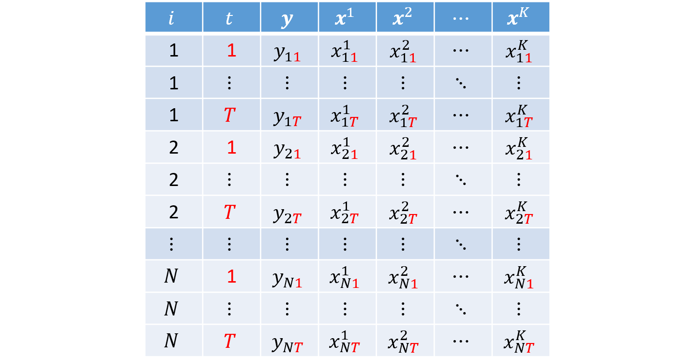
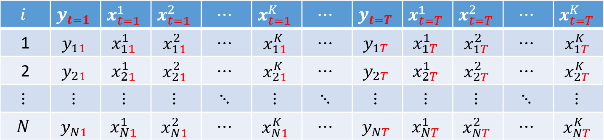
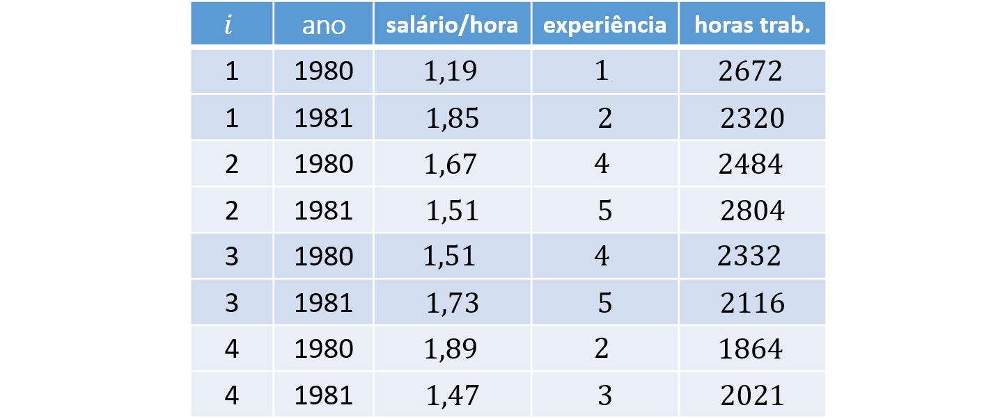
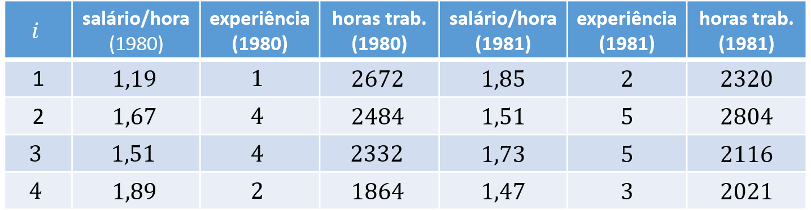

## Data Structure

- Section 2.1.1 of "Panel Data Econometrics with R" (Croissant \& Millo, 2018)
- Most notation follows the Econometrics I lecture notes.


### Cross-Section
So far, we have worked with cross-sectional datasets, that is, samples in which each row represents one individual $i = 1, ..., N$ and we observe realizations of the dependent variable $y$ and the explanatory variables $k = 1, 2, ..., K$:


#### Example
Consider $N = 4$ individuals and $K = 2$ covariates:


### Panel Data
It is also common to work with panel data, that is, datasets in which we observe the same individuals $i = 1, ..., N$ over $t = 1, ..., T$ periods.

This type of structure allows us not only to compare individuals (_between_), but also to study within-individual variation (_within_) over time.

For simplicity, we assume a **balanced panel**, so every individual is observed for the same $T$ periods. Panel data can be organized in either long or wide format.


##### Panel Data in Long Format (_long_)
In long format, each individual appears in $T$ rows. Each observation is indexed by the pair $i$ and $t$, which serve as the key identifiers in the dataset. This is the standard layout used in econometrics.




##### Panel Data in Wide Format (_wide_)
In wide format, the dependent and explanatory variables appear repeated across $T$ columns, with each repetition corresponding to one of the $T$ periods:




#### Examples
As an example, consider $N = 4$ individuals, $K = 2$ covariates, and $T = 2$ periods. The corresponding long and wide panel layouts are:






## Panel Data Model

For observation $(i,t)$, we can write the model as:

$$ y_{it} = \boldsymbol{x}'_{it} \boldsymbol{\beta} + \varepsilon_{it} \tag{1} $$ 
where $\boldsymbol{\beta}$ is the column vector of parameters

$$ \boldsymbol{\beta} = \left[ \begin{array}{c} \beta_0 \\ \beta_1 \\ \beta_2 \\ \vdots \\ \beta_K \end{array} \right], $$

$y_{it}$ is the dependent variable, and $\boldsymbol{x}'_{it}$ is the row vector of dimension $K+1$:

$$ \boldsymbol{x}'_{it} = \left[ \begin{array}{c} 1 & x^1_{it} & x^2_{it} & \cdots & x^K_{it} \end{array} \right],  $$

and the error $\varepsilon_{it}$ can be written as:

$$ \varepsilon_{it} = u_i + v_{it},  $$
where $u_i$ is the individual-specific error component for individual $i$, and $v_{it}$ is the idiosyncratic error.

Stacking equation (1) over all individuals $i = 1, 2, ..., N$ and periods $t = 1, 2, ..., T$, we obtain

$$ \underbrace{\boldsymbol{y}}_{NT \times 1} = \left[ \begin{array}{c}
    y_{11} \\ y_{12} \\ \vdots \\ y_{1T} \\\hline y_{21} \\ y_{22} \\ \vdots \\ y_{2T} \\\hline \vdots \\\hline y_{N1} \\ y_{N2} \\ \vdots \\ y_{NT}
\end{array} \right] \quad \text{and} \quad 
\underbrace{\boldsymbol{X}}_{NT \times K} = \left[ \begin{array}{c}
    \boldsymbol{x}'_{11} \\ \boldsymbol{x}'_{12} \\ \vdots \\ \boldsymbol{x}'_{1T} \\\hline
    \boldsymbol{x}'_{21} \\ \boldsymbol{x}'_{22} \\ \vdots \\ \boldsymbol{x}'_{2T} \\\hline
    \vdots \\\hline
    \boldsymbol{x}'_{N1} \\ \boldsymbol{x}'_{N2} \\ \vdots \\ \boldsymbol{x}'_{NT} 
    \end{array} \right]
  = \left[ \begin{array}{ccccc}
    1 & x^1_{11} & x^2_{11} & \cdots & x^K_{11} \\
    1 & x^1_{12} & x^2_{12} & \cdots & x^K_{12} \\
    \vdots & \vdots & \vdots & \ddots & \vdots \\
    1 & x^1_{1T} & x^2_{1T} & \cdots & x^K_{1T} \\\hline
    1 & x^1_{21} & x^2_{21} & \cdots & x^K_{21} \\
    1 & x^1_{22} & x^2_{22} & \cdots & x^K_{22} \\
    \vdots & \vdots & \vdots & \ddots & \vdots \\
    1 & x^1_{2T} & x^2_{2T} & \cdots & x^K_{2T} \\\hline
    \vdots & \vdots & \vdots & \ddots & \vdots \\\hline
    1 & x^1_{N1} & x^2_{N1} & \cdots & x^K_{N1} \\
    1 & x^1_{N2} & x^2_{N2} & \cdots & x^K_{N2} \\
    \vdots & \vdots & \vdots & \ddots & \vdots \\
    1 & x^1_{NT} & x^2_{NT} & \cdots & x^K_{NT}
\end{array} \right] $$ 
The horizontal separators are included only to make it easier to visualize the rows associated with each individual $i$.


</br>

## Error Variance-Covariance Matrix
- Section 2.2 of "Panel Data Econometrics with R" (Croissant \& Millo, 2018)

The error variance-covariance matrix links one error term, $\varepsilon_{it}$, to every other error term $\varepsilon_{js}$, for all $j = 1, ..., N$ and $s = 1, ..., T$.

In this matrix, each row represents one $\varepsilon_{it}$ and each column represents one $\varepsilon_{js}$. Each entry gives the covariance between $\varepsilon_{it}$ and $\varepsilon_{js}$; when $\varepsilon_{it} = \varepsilon_{js}$, the entry is a variance term:

$$ cov(\boldsymbol{\varepsilon}) = \underset{NT \times NT}{\boldsymbol{\Sigma}} =$$
$$ \left[ \tiny \begin{array}{cccc|ccc|c|ccc}
var(\varepsilon_{{\color{red}1}1}) & cov(\varepsilon_{{\color{red}1}1}, \varepsilon_{{\color{red}1}2}) & \cdots & cov(\varepsilon_{{\color{red}1}1}, \varepsilon_{{\color{red}1}T}) & cov(\varepsilon_{{\color{red}1}1}, \varepsilon_{{\color{red}2}1}) & \cdots & cov(\varepsilon_{{\color{red}1}1}, \varepsilon_{{\color{red}2}T}) & \cdots & cov(\varepsilon_{{\color{red}1}1}, \varepsilon_{{\color{red}N}1}) & \cdots & cov(\varepsilon_{{\color{red}1}1}, \varepsilon_{{\color{red}N}T}) \\
cov(\varepsilon_{{\color{red}1}2}, \varepsilon_{{\color{red}1}1}) & var(\varepsilon_{{\color{red}1}2}) & \cdots & cov(\varepsilon_{{\color{red}1}2}, \varepsilon_{{\color{red}1}T}) & cov(\varepsilon_{{\color{red}1}2}, \varepsilon_{{\color{red}2}1}) & \cdots & cov(\varepsilon_{{\color{red}1}2}, \varepsilon_{{\color{red}2}T}) & \cdots & cov(\varepsilon_{{\color{red}1}2}, \varepsilon_{{\color{red}N}1}) & \cdots & cov(\varepsilon_{{\color{red}1}2}, \varepsilon_{{\color{red}N}T}) \\
\vdots & \vdots & \ddots & \vdots & \vdots & \ddots & \vdots & \ddots & \vdots & \ddots & \vdots \\
cov(\varepsilon_{{\color{red}1}T}, \varepsilon_{{\color{red}1}1}) & cov(\varepsilon_{{\color{red}1}T}, \varepsilon_{{\color{red}1}2}) & \cdots & var(\varepsilon_{{\color{red}1}T}) & cov(\varepsilon_{{\color{red}1}T}, \varepsilon_{{\color{red}2}1}) & \cdots & cov(\varepsilon_{{\color{red}1}T}, \varepsilon_{{\color{red}2}T}) & \cdots & cov(\varepsilon_{{\color{red}1}T}, \varepsilon_{{\color{red}N}1}) & \cdots & cov(\varepsilon_{{\color{red}1}T}, \varepsilon_{{\color{red}N}T}) \\ \hline
cov(\varepsilon_{{\color{red}2}1}, \varepsilon_{{\color{red}1}1}) & cov(\varepsilon_{{\color{red}2}1}, \varepsilon_{{\color{red}1}2}) & \cdots & cov(\varepsilon_{{\color{red}2}1}, \varepsilon_{{\color{red}1}T}) & var(\varepsilon_{{\color{red}2}1}) & \cdots & 
cov(\varepsilon_{{\color{red}2}1}, \varepsilon_{{\color{red}2}T}) & \cdots & cov(\varepsilon_{{\color{red}2}1}, \varepsilon_{{\color{red}N}1}) & \cdots & cov(\varepsilon_{{\color{red}2}1}, \varepsilon_{{\color{red}N}T}) \\
\vdots & \vdots & \ddots & \vdots & \vdots & \ddots & \vdots & \ddots & \vdots & \ddots & \vdots \\
cov(\varepsilon_{{\color{red}2}T}, \varepsilon_{{\color{red}1}1}) & cov(\varepsilon_{{\color{red}2}T}, \varepsilon_{{\color{red}1}2}) & \cdots & cov(\varepsilon_{{\color{red}2}T}, \varepsilon_{{\color{red}1}T}) & cov(\varepsilon_{{\color{red}2}T}, \varepsilon_{{\color{red}2}1}) & \cdots & var(\varepsilon_{{\color{red}2}T}) & \cdots & 
cov(\varepsilon_{{\color{red}2}T}, \varepsilon_{{\color{red}N}1}) & \cdots & cov(\varepsilon_{{\color{red}2}T}, \varepsilon_{{\color{red}N}T}) \\ \hline
\vdots & \vdots & \ddots & \vdots & \vdots & \ddots & \vdots & \ddots & \vdots & \ddots & \vdots \\ \hline
cov(\varepsilon_{{\color{red}N}1}, \varepsilon_{{\color{red}1}1}) & cov(\varepsilon_{{\color{red}N}1}, \varepsilon_{{\color{red}1}2}) & \cdots & cov(\varepsilon_{{\color{red}N}1}, \varepsilon_{{\color{red}1}T}) & cov(\varepsilon_{{\color{red}N}1}, \varepsilon_{{\color{red}2}1}) & \cdots & 
cov(\varepsilon_{{\color{red}N}1}, \varepsilon_{{\color{red}2}T}) & \cdots & var(\varepsilon_{{\color{red}N}1}) & \cdots &
cov(\varepsilon_{{\color{red}N}1}, \varepsilon_{{\color{red}N}T}) \\
\vdots & \vdots & \ddots & \vdots & \vdots & \ddots & \vdots & \ddots & \vdots & \ddots & \vdots \\
cov(\varepsilon_{{\color{red}N}T}, \varepsilon_{{\color{red}1}1}) & cov(\varepsilon_{{\color{red}N}T}, \varepsilon_{{\color{red}1}2}) & \cdots & cov(\varepsilon_{{\color{red}N}T}, \varepsilon_{{\color{red}1}T}) & cov(\varepsilon_{{\color{red}N}T}, \varepsilon_{{\color{red}2}1}) & \cdots & cov(\varepsilon_{{\color{red}N}T}, \varepsilon_{{\color{red}2}T}) & \cdots & 
cov(\varepsilon_{{\color{red}N}T}, \varepsilon_{{\color{red}N}1}) & \cdots & var(\varepsilon_{{\color{red}N}T})
\end{array} \right]$$

Note that the error variance-covariance matrix can be partitioned into smaller blocks linking the errors of individual $i$ (row block) and individual $j$ (column block). To write $\boldsymbol{\Sigma}$ more compactly, we denote these blocks by $\boldsymbol{\Sigma}_{ij}$:


$$ \underset{NT \times NT}{\boldsymbol{\Sigma}} = \left[ \begin{matrix} 
\boldsymbol{\Sigma}_1 & \boldsymbol{\Sigma}_{12} & \cdots & \boldsymbol{\Sigma}_{1N} \\
\boldsymbol{\Sigma}_{21} & \boldsymbol{\Sigma}_{2} & \cdots & \boldsymbol{\Sigma}_{2N} \\
\vdots & \vdots & \ddots & \vdots \\
\boldsymbol{\Sigma}_{N1} & \boldsymbol{\Sigma}_{N2} & \cdots & \boldsymbol{\Sigma}_{N}
\end{matrix} \right] \tag{1} $$ 

where, when $i = j$, we have

$$ \underset{T \times T}{\boldsymbol{\Sigma}_i} = \left[ \begin{matrix} 
var(\varepsilon_{i1}) & cov(\varepsilon_{i1}, \varepsilon_{i2}) & \cdots & cov(\varepsilon_{i1}, \varepsilon_{iT}) \\
cov(\varepsilon_{i1}, \varepsilon_{i2}) & var(\varepsilon_{i2}) & \cdots & cov(\varepsilon_{i2}, \varepsilon_{iT}) \\
\vdots & \vdots & \ddots & \vdots \\
cov(\varepsilon_{i1}, \varepsilon_{iT}) & cov(\varepsilon_{i2}, \varepsilon_{iT}) & \cdots & var(\varepsilon_{iT})
\end{matrix} \right] \tag{2} $$


and, when $i \neq j$, we have
$$ \underset{T \times T}{\boldsymbol{\Sigma}_{ij}} = \left[ \begin{matrix} 
cov(\varepsilon_{i1}, \varepsilon_{j1}) & cov(\varepsilon_{i1}, \varepsilon_{j2}) & \cdots & cov(\varepsilon_{i1}, \varepsilon_{jT}) \\
cov(\varepsilon_{i1}, \varepsilon_{j2}) & cov(\varepsilon_{i2}, \varepsilon_{j2}) & \cdots & cov(\varepsilon_{i2}, \varepsilon_{jT}) \\
\vdots & \vdots & \ddots & \vdots \\
cov(\varepsilon_{i1}, \varepsilon_{jT}) & cov(\varepsilon_{i2}, \varepsilon_{jT}) & \cdots & cov(\varepsilon_{iT}, \varepsilon_{jT})
\end{matrix} \right]. \tag{3} $$


Because we assume random sampling, the covariance between two distinct individuals $(i \neq j)$ is  
$$ cov(\varepsilon_{it}, \varepsilon_{jt}) = cov(\varepsilon_{it}, \varepsilon_{js}) = 0,  \qquad \text{for all } i \neq j.$$

Therefore, $\boldsymbol{\Sigma}_{ij} = \boldsymbol{0}$ (the zero matrix):
$$ \underset{T \times T}{\boldsymbol{\Sigma}_{ij}} =  \underset{T \times T}{\boldsymbol{0}} = \left[ \begin{matrix} 
0 & 0 & \cdots & 0 \\
0 & 0 & \cdots & 0 \\
\vdots & \vdots & \ddots & \vdots \\
0 & 0 & \cdots & 0
\end{matrix} \right] $$


Therefore, we can rewrite (1) as

$$ \underset{NT \times NT}{\boldsymbol{\Sigma}} = \left[ \begin{matrix} 
\boldsymbol{\Sigma}_1 & \boldsymbol{0} & \cdots & \boldsymbol{0} \\
\boldsymbol{0} & \boldsymbol{\Sigma}_2 & \cdots & \boldsymbol{0} \\
\vdots & \vdots & \ddots & \vdots \\
\boldsymbol{0} & \boldsymbol{0} & \cdots & \boldsymbol{\Sigma}_N
\end{matrix} \right]. \tag{1'} $$

We also assume that the individual-level error variance-covariance matrix depends only on $\sigma^2_u$ and $\sigma^2_v$, because:

- Variance of a single error term: $ var(\varepsilon_{it}) = \sigma^2_u + \sigma^2_v $
- Covariance between two errors for the same individual $i$ across periods $t \neq s$: $ cov(\varepsilon_{it}, \varepsilon_{is}) = \sigma^2_u $

Substituting into (2), we obtain

$$ \underset{T \times T}{\boldsymbol{\Sigma}_i} = \left[ \begin{array}{cccc} 
\sigma^2_u + \sigma^2_v & \sigma^2_u & \cdots & \sigma^2_u \\
\sigma^2_u & \sigma^2_u + \sigma^2_v & \cdots & \sigma^2_u \\
\vdots & \vdots & \ddots & \vdots \\
\sigma^2_u & \sigma^2_u & \cdots & \sigma^2_u + \sigma^2_v
\end{array} \right] \tag{2'} $$


##### Example
For simplicity, let $N = 2$ and $T = 3$. Then the error variance-covariance matrix can be written as:

\begin{align} \underset{6 \times 6}{\boldsymbol{\Sigma}}
&= \left[ \begin{array}{cc}
\boldsymbol{\Sigma}_1 & \boldsymbol{0} \\
\boldsymbol{0} & \boldsymbol{\Sigma}_2
\end{array} \right] \\
&= \left[ \begin{array} {ccc|ccc}
\sigma^2_u + \sigma^2_v & \sigma^2_u & \sigma^2_u & 0 & 0 & 0 \\
\sigma^2_u & \sigma^2_u + \sigma^2_v & \sigma^2_u & 0 & 0 & 0 \\
\sigma^2_u & \sigma^2_u & \sigma^2_u + \sigma^2_v & 0 & 0 & 0\\ \hline
0 & 0 & 0 & \sigma^2_u + \sigma^2_v & \sigma^2_u & \sigma^2_u \\
0 & 0 & 0 & \sigma^2_u & \sigma^2_u + \sigma^2_v & \sigma^2_u \\
0 & 0 & 0 & \sigma^2_u & \sigma^2_u & \sigma^2_u + \sigma^2_v \\
\end{array} \right] \end{align} 

The vertical and horizontal separators above are included only to highlight which elements belong to each block matrix.


#### Computing It in R

First, let $I_p$ denote the identity matrix of dimension $p \times p$:

$$ \boldsymbol{I}_p= \left[ \begin{array}{cccc}
    1 & 0 & 0 & \cdots & 0 \\
    0 & 1 & 0 & \cdots & 0 \\
    0 & 0 & 1 & \cdots & 0 \\
    \vdots & \vdots & \vdots & \ddots & \vdots \\
    0 & 0 & 0 & \cdots & 1
\end{array} \right]_{p \times p}, $$ 

and let $\boldsymbol{\iota}_q$ denote a column vector of ones of length $q$:
$$ \boldsymbol{\iota}_q = \left[ \begin{array}{c} 1 \\ 1 \\ \vdots \\ 1 \end{array} \right]_{q \times 1} $$


With **cross-sectional data**, the error variance-covariance matrix is straightforward because there is only one error component, so $\sigma^2$ appears only on the main diagonal:

\begin{align}
\boldsymbol{\Sigma}_{\scriptscriptstyle{OLS}} &= \sigma^2 \boldsymbol{I}_N \\
  &= \sigma^2 \left[ \begin{array}{cccc} 
1 & 0 & \cdots & 0 \\
0 & 1 & \cdots & 0 \\
\vdots & \vdots & \ddots & \vdots \\
0 & 0 & \cdots & 1
\end{array} \right] \\
  &= \left[ \begin{array}{cccc} 
\sigma^2 & 0 & \cdots & 0 \\
0 & \sigma^2 & \cdots & 0 \\
\vdots & \vdots & \ddots & \vdots \\
0 & 0 & \cdots & \sigma^2
\end{array} \right]_{N \times N} \end{align}


For **panel data**, however, we have two error-component variances. The term $\sigma^2_v$ appears on the main diagonal, while the common individual effect adds $\sigma^2_u$ to all within-individual entries. Therefore, the panel-data error variance-covariance matrix can be written as:

$$ \boldsymbol{\Sigma} = \sigma^2_v \boldsymbol{I}_{NT} + T \sigma^2_u [\boldsymbol{I}_N \otimes \boldsymbol{\iota}_T (\boldsymbol{\iota}'_T \boldsymbol{\iota}_T)^{-1} \boldsymbol{\iota}'_T] \tag{4} $$

Note that the first term in the sum creates a main diagonal of $\sigma^2_v$.

\begin{align}
\sigma^2_v \boldsymbol{I}_{NT} &= \sigma^2_v \left[ \begin{array}{cccc} 
1 & 0 & \cdots & 0 \\
0 & 1 & \cdots & 0 \\
\vdots & \vdots & \ddots & \vdots \\
0 & 0 & \cdots & 1
\end{array} \right] \\
  &= \left[ \begin{array}{cccc} 
\sigma^2_v & 0 & \cdots & 0 \\
0 & \sigma^2_v & \cdots & 0 \\
\vdots & \vdots & \ddots & \vdots \\
0 & 0 & \cdots & \sigma^2_v
\end{array} \right]_{NT \times NT} \end{align}


Now we only need to add $\sigma^2_u$ to the entries around that diagonal.

For the moment, ignore $T \sigma^2_u$ and denote the bracketed term by the **between (inter-individual)** transformation matrix:

$$ \boldsymbol{B}\ \equiv\ \boldsymbol{I}_N \otimes \Big[ \boldsymbol{\iota}_T (\boldsymbol{\iota}'_T \boldsymbol{\iota}_T)^{-1} \boldsymbol{\iota}'_T \Big] $$

Note that the matrix $\boldsymbol{B}$ is denoted by $\boldsymbol{N}$ in Professor Daniel's 2021 Econometrics II lecture notes.

\begin{align}
    \boldsymbol{B} &\equiv \boldsymbol{I}_{N} \otimes \boldsymbol{\iota}_T (\boldsymbol{\iota}'_T \boldsymbol{\iota}_T)^{-1} \boldsymbol{\iota}'_T \\
    &= \left[ \begin{array}{cc} 1 & \cdots & 0 \\ \vdots & \ddots & \vdots \\ 0 & \cdots & 1 \end{array} \right] \otimes \left( \left[ \begin{array}{c} 1 \\ \vdots \\ 1 \end{array} \right] \left( \left[ \begin{array}{ccc} 1 & \cdots & 1 \end{array} \right] \left[ \begin{array}{c} 1 \\ \vdots \\ 1 \end{array} \right] \right)^{-1} \left[ \begin{array}{ccc} 1 & \cdots & 1 \end{array} \right] \right) \\
    &= \left[ \begin{array}{cc} 1 & \cdots & 0 \\ \vdots & \ddots & \vdots \\ 0 & \cdots & 1 \end{array} \right] \otimes \left( \left[ \begin{array}{c} 1 \\ \vdots \\ 1 \end{array} \right] \left( T \right)^{-1} \left[ \begin{array}{ccc} 1 & \cdots & 1 \end{array} \right] \right) \\
    &= \left[ \begin{array}{cc} 1 & \cdots & 0 \\ \vdots & \ddots & \vdots \\ 0 & \cdots & 1 \end{array} \right] \otimes \left( \left[ \begin{array}{c} 1 \\ \vdots \\ 1 \end{array} \right] \frac{1}{T} \left[ \begin{array}{ccc} 1 & \cdots & 1 \end{array} \right] \right) \\
    &= \left[ \begin{array}{cc} 1 & \cdots & 0 \\ \vdots & \ddots & \vdots \\ 0 & \cdots & 1 \end{array} \right] \otimes \left( \frac{1}{T}  \left[ \begin{array}{c} 1 & \cdots & 1 \\ \vdots & \ddots & \vdots \\ 1 & \cdots & 1 \end{array} \right] \right) \\
    &= \left[ \begin{array}{cc} 1 & \cdots & 0 \\ \vdots & \ddots & \vdots \\ 0 & \cdots & 1 \end{array} \right]_{N \times N}  \otimes  \left( \begin{array}{ccc} 1/T & \cdots & 1/T \\ \vdots & \ddots & \vdots\\ 1/T & \cdots & 1/T \end{array} \right)_{T \times T}  \\
    &= \left[ \begin{array}{ccc} 1 \left( \begin{array}{ccc} 1/T & \cdots & 1/T \\
    \vdots & \ddots & \vdots\\ 1/T & \cdots & 1/T \end{array} \right) & \cdots & 0 \left( \begin{array}{ccc} 1/T & \cdots & 1/T \\ \vdots & \ddots & \vdots\\ 1/T & \cdots & 1/T \end{array} \right) \\ \vdots & \ddots & \vdots \\ 0 \left( \begin{array}{ccc} 1/T & \cdots & 1/T \\ \vdots & \ddots & \vdots\\ 1/T & \cdots & 1/T \end{array} \right) & \cdots & 1 \left( \begin{array}{ccc} 1/T & \cdots & 1/T \\ \vdots & \ddots & \vdots\\ 1/T & \cdots & 1/T \end{array} \right) \end{array} \right] \\
    &= \left[ \begin{array}{rrr|r|rrr} 
        1/T & \cdots & 1/T & \cdots & 0 & \cdots & 0 \\
        \vdots & \ddots & \vdots & \cdots & \vdots & \ddots & \vdots \\
        1/T & \cdots & 1/T & \cdots & 0 & \cdots & 0 \\\hline
        \vdots & \vdots & \vdots & \ddots & \vdots & \vdots & \vdots \\\hline
        0 & \cdots & 0 & \cdots & 1/T & \cdots & 1/T \\
        \vdots & \ddots & \vdots & \cdots & \vdots & \ddots & \vdots \\
        0 & \cdots & 0 & \cdots & 1/T & \cdots & 1/T
    \end{array} \right]_{NT \times NT},
\end{align}

where $\otimes$ is the Kronecker product. After multiplying by $T \sigma^2_u$, every $1/T$ entry becomes $\sigma^2_u$:

$$ 
    T \sigma^2_u \boldsymbol{B} = \left[ \begin{array}{rrr|r|rrr} 
        \sigma^2_u & \cdots & \sigma^2_u & \cdots & 0 & \cdots & 0 \\
        \vdots & \ddots & \vdots & \cdots & \vdots & \ddots & \vdots \\
        \sigma^2_u & \cdots & \sigma^2_u & \cdots & 0 & \cdots & 0 \\\hline
        \vdots & \vdots & \vdots & \ddots & \vdots & \vdots & \vdots \\\hline
        0 & \cdots & 0 & \cdots & \sigma^2_u & \cdots & \sigma^2_u \\
        \vdots & \ddots & \vdots & \cdots & \vdots & \ddots & \vdots \\
        0 & \cdots & 0 & \cdots & \sigma^2_u & \cdots & \sigma^2_u
    \end{array} \right]_{NT \times NT},
$$


Adding the two terms in (4), we obtain the error variance-covariance matrix:

\begin{align}
    \boldsymbol{\Sigma} &= \sigma^2_v \boldsymbol{I}_{NT} + T \sigma^2_u \boldsymbol{B} \\
    &= \left[ \begin{array}{cccc} 
\sigma^2_v & 0 & \cdots & 0 \\
0 & \sigma^2_v & \cdots & 0 \\
\vdots & \vdots & \ddots & \vdots \\
0 & 0 & \cdots & \sigma^2_v
\end{array} \right] + \left[ \begin{array}{ccc|c|ccc} 
        \sigma^2_u & \cdots & \sigma^2_u & \cdots & 0 & \cdots & 0 \\
        \vdots & \ddots & \vdots & \cdots & \vdots & \ddots & \vdots \\
        \sigma^2_u & \cdots & \sigma^2_u & \cdots & 0 & \cdots & 0 \\\hline
        \vdots & \vdots & \vdots & \ddots & \vdots & \vdots & \vdots \\\hline
        0 & \cdots & 0 & \cdots & \sigma^2_u & \cdots & \sigma^2_u \\
        \vdots & \ddots & \vdots & \cdots & \vdots & \ddots & \vdots \\
        0 & \cdots & 0 & \cdots & \sigma^2_u & \cdots & \sigma^2_u
    \end{array} \right] \\
    &= \left[ \begin{array}{ccc|c|ccc} 
        \sigma^2_u + \sigma^2_v & \cdots & \sigma^2_u & \cdots & 0 & \cdots & 0 \\
        \vdots & \ddots & \vdots & \cdots & \vdots & \ddots & \vdots \\
        \sigma^2_u & \cdots & \sigma^2_u + \sigma^2_v & \cdots & 0 & \cdots & 0 \\\hline
        \vdots & \vdots & \vdots & \ddots & \vdots & \vdots & \vdots \\\hline
        0 & \cdots & 0 & \cdots & \sigma^2_u + \sigma^2_v & \cdots & \sigma^2_u \\
        \vdots & \ddots & \vdots & \cdots & \vdots & \ddots & \vdots \\
        0 & \cdots & 0 & \cdots & \sigma^2_u & \cdots & \sigma^2_u + \sigma^2_v
    \end{array} \right]
\end{align}


##### Example
Consider the case $N = 2$ and $T = 3$. Then we obtain the following error variance-covariance matrix:

$$\boldsymbol{\Sigma} = \left[ \begin{array}{ccc|ccc} 
        \sigma^2_u + \sigma^2_v & \sigma^2_u & \sigma^2_u & 0 & 0 & 0 \\
        \sigma^2_u & \sigma^2_u + \sigma^2_v & \sigma^2_u & 0 & 0 & 0 \\
        \sigma^2_u & \sigma^2_u & \sigma^2_u + \sigma^2_v & 0 & 0 & 0 \\\hline
        0 & 0 & 0 & \sigma^2_u + \sigma^2_v & \sigma^2_u & \sigma^2_u \\
        0 & 0 & 0 & \sigma^2_u & \sigma^2_u + \sigma^2_v & \sigma^2_u \\
        0 & 0 & 0 & \sigma^2_u & \sigma^2_u & \sigma^2_u + \sigma^2_v
    \end{array} \right]$$

Assuming $\sigma^2_u = 2$ and $\sigma^2_v = 3$, it follows that

$$\boldsymbol{\Sigma} = \left[ \begin{array}{ccc|ccc} 
        5 & 2 & 2 & 0 & 0 & 0 \\
        2 & 5 & 2 & 0 & 0 & 0 \\
        2 & 2 & 5 & 0 & 0 & 0 \\\hline
        0 & 0 & 0 & 5 & 2 & 2 \\
        0 & 0 & 0 & 2 & 5 & 2 \\
        0 & 0 & 0 & 2 & 2 & 5
    \end{array} \right]$$


</br>


To compute this in R, define:

```r
N = 2 # number of individuals
T = 3 # number of periods
sig2u = 2 # variance of the individual error component
sig2v = 3 # variance of the idiosyncratic error component
```


The first term of $\boldsymbol{\Sigma}$ is

```r
I_NT = diag(N*T) # identity matrix of size NT
I_NT
```

```
##      [,1] [,2] [,3] [,4] [,5] [,6]
## [1,]    1    0    0    0    0    0
## [2,]    0    1    0    0    0    0
## [3,]    0    0    1    0    0    0
## [4,]    0    0    0    1    0    0
## [5,]    0    0    0    0    1    0
## [6,]    0    0    0    0    0    1
```

```r
termo1 = sig2v * I_NT
termo1
```

```
##      [,1] [,2] [,3] [,4] [,5] [,6]
## [1,]    3    0    0    0    0    0
## [2,]    0    3    0    0    0    0
## [3,]    0    0    3    0    0    0
## [4,]    0    0    0    3    0    0
## [5,]    0    0    0    0    3    0
## [6,]    0    0    0    0    0    3
```

For the second term of $\boldsymbol{\Sigma}$, we first create the identity matrix and the vector of ones:

```r
iota_T = matrix(1, T, 1) # column vector of 1s of length T
iota_T
```

```
##      [,1]
## [1,]    1
## [2,]    1
## [3,]    1
```

```r
I_N = diag(N) # identity matrix of size N
I_N
```

```
##      [,1] [,2]
## [1,]    1    0
## [2,]    0    1
```

We now compute $\boldsymbol{\iota}_T (\boldsymbol{\iota}'_T \boldsymbol{\iota}_T)^{-1} \boldsymbol{\iota}'_T$

```r
# To obtain a T x T matrix filled with 1/T, where T = 3, we proceed as follows:
t(iota_T) %*% iota_T # inner product of iotas equals T
```

```
##      [,1]
## [1,]    3
```

```r
solve(t(iota_T) %*% iota_T) # taking the inverse gives 1/T
```

```
##           [,1]
## [1,] 0.3333333
```

```r
iota_T %*% solve(t(iota_T) %*% iota_T) %*% t(iota_T) # pre- and post-multiplying by the iota vector
```

```
##           [,1]      [,2]      [,3]
## [1,] 0.3333333 0.3333333 0.3333333
## [2,] 0.3333333 0.3333333 0.3333333
## [3,] 0.3333333 0.3333333 0.3333333
```

Now we compute $\boldsymbol{B}\ =\ I_N \otimes \boldsymbol{\iota}_T (\boldsymbol{\iota}'_T \boldsymbol{\iota}_T)^{-1} \boldsymbol{\iota}'_T$ using the Kronecker product operator `%x%`:

```r
B = I_N %x% (iota_T %*% solve(t(iota_T) %*% iota_T) %*% t(iota_T))
round(B, 3)
```

```
##       [,1]  [,2]  [,3]  [,4]  [,5]  [,6]
## [1,] 0.333 0.333 0.333 0.000 0.000 0.000
## [2,] 0.333 0.333 0.333 0.000 0.000 0.000
## [3,] 0.333 0.333 0.333 0.000 0.000 0.000
## [4,] 0.000 0.000 0.000 0.333 0.333 0.333
## [5,] 0.000 0.000 0.000 0.333 0.333 0.333
## [6,] 0.000 0.000 0.000 0.333 0.333 0.333
```

Multiplying $\boldsymbol{B}$ by $T \sigma^2_u$, we obtain the second term of $\boldsymbol{\Sigma}$:

```r
termo2 = T * sig2u * B
termo2
```

```
##      [,1] [,2] [,3] [,4] [,5] [,6]
## [1,]    2    2    2    0    0    0
## [2,]    2    2    2    0    0    0
## [3,]    2    2    2    0    0    0
## [4,]    0    0    0    2    2    2
## [5,]    0    0    0    2    2    2
## [6,]    0    0    0    2    2    2
```

Therefore, the error variance-covariance matrix is given by:

```r
Sigma = termo1 + termo2
Sigma
```

```
##      [,1] [,2] [,3] [,4] [,5] [,6]
## [1,]    5    2    2    0    0    0
## [2,]    2    5    2    0    0    0
## [3,]    2    2    5    0    0    0
## [4,]    0    0    0    5    2    2
## [5,]    0    0    0    2    5    2
## [6,]    0    0    0    2    2    5
```


### Estimating the Error Components
- Note that $\sigma^2_v$ and $\sigma^2_u$ are unknown, so $\boldsymbol{\Sigma}$ is also unknown.

- First, consider the **within transformation matrix**, given by

$$ \boldsymbol{W} = \boldsymbol{I}_{NT} - \boldsymbol{B} $$

- Note that we can rewrite
\begin{align} \hat{\boldsymbol{\Sigma}} &= \hat{\sigma}^2_v \boldsymbol{I}_{NT} + T \hat{\sigma}^2_u \boldsymbol{B}\\ 
&= \hat{\sigma}^2_v (\boldsymbol{W} + \boldsymbol{B}) + T \hat{\sigma}^2_u \boldsymbol{B}\\ 
&= \hat{\sigma}^2_v \boldsymbol{W} + \hat{\sigma}^2_v \boldsymbol{B} + T \hat{\sigma}^2_u \boldsymbol{B}\\ 
&= \hat{\sigma}^2_v \boldsymbol{W} + (\hat{\sigma}^2_v + T \hat{\sigma}^2_u) \boldsymbol{B}
\end{align}
where $\boldsymbol{W} = \boldsymbol{I}_{NT} - \boldsymbol{B} \iff \boldsymbol{I}_{NT} = \boldsymbol{W} + \boldsymbol{B} $

</br>

- This can be generalized as:
$$ \hat{\boldsymbol{\Sigma}}^p = (\hat{\sigma}^2_v)^p \boldsymbol{W} + (\hat{\sigma}^2_v + T \hat{\sigma}^2_u)^p \boldsymbol{B}, \tag{2.29} $$
where $p$ is a scalar.
- This formula will be useful later when computing $ \hat{\boldsymbol{\Sigma}}^{-1}$ and $ \hat{\boldsymbol{\Sigma}}^{-0.5}$.


</br>

- If $\boldsymbol{\varepsilon}$ were observed, we could estimate the two variances as follows:

\begin{align}
    \hat{\sigma}^2_v &= \frac{\boldsymbol{\varepsilon}' \boldsymbol{W} \boldsymbol{\varepsilon}}{N(T-1)} \tag{2.35} \\
    \\
    \hat{\sigma}^2_v + T \hat{\sigma}^2_u &= \frac{\boldsymbol{\varepsilon}' \boldsymbol{B} \boldsymbol{\varepsilon}}{N} \tag{2.34} \\
    \hat{\sigma}^2_u &= \frac{1}{T} \left( \frac{\boldsymbol{\varepsilon}' \boldsymbol{B} \boldsymbol{\varepsilon}}{N} - \hat{\sigma}^2_v \right)
\end{align}

- Because $\boldsymbol{\varepsilon}$ is unobserved, we instead use residuals from consistent estimators.

- **Wallace and Hussain (1969)**: use OLS residuals.

$$ \hat{\sigma}^2_v = \frac{\hat{\boldsymbol{\varepsilon}}'_{\scriptscriptstyle{OLS}} \boldsymbol{W} \hat{\boldsymbol{\varepsilon}}_{\scriptscriptstyle{OLS}}}{N(T-1)} 
\quad \text{and} \quad
    \hat{\sigma}^2_u =\frac{1}{T} \left( \frac{\hat{\boldsymbol{\varepsilon}}'_{\scriptscriptstyle{OLS}} \boldsymbol{B} \hat{\boldsymbol{\varepsilon}}_{\scriptscriptstyle{OLS}}}{N} - \hat{\sigma}^2_v \right)$$

- **Amemiya (1971)**: uses _within_ residuals.
$$\hat{\sigma}^2_v = \frac{\hat{\boldsymbol{\varepsilon}}'_{\scriptscriptstyle{W}} \boldsymbol{W} \hat{\boldsymbol{\varepsilon}}_{\scriptscriptstyle{W}}}{N(T-1)}
\quad \text{and} \quad
    \hat{\sigma}^2_u = \frac{1}{T} \left( \frac{\hat{\boldsymbol{\varepsilon}}'_{\scriptscriptstyle{W}} \boldsymbol{B} \hat{\boldsymbol{\varepsilon}}_{\scriptscriptstyle{W}}}{N} - \hat{\sigma}^2_v \right)$$
    
- **Hausman and Taylor (1981)**: adjust Amemiya's method by regressing $\hat{\boldsymbol{\varepsilon}}_{\scriptscriptstyle{W}}$ on all time-invariant regressors in the model and then using the resulting residuals, $\hat{\boldsymbol{\varepsilon}}_{\scriptscriptstyle{HT}}$.

- **Swamy and Arora (1972)**: use both _between_ and _within_ residuals to compute:
$$\hat{\sigma}^2_v = \frac{\hat{\boldsymbol{\varepsilon}}'_{\scriptscriptstyle{W}} \boldsymbol{W} \hat{\boldsymbol{\varepsilon}}_{\scriptscriptstyle{W}}}{N(T-1) - K}
\quad \text{and} \quad
    \hat{\sigma}^2_u = \frac{1}{T} \left( \frac{\hat{\boldsymbol{\varepsilon}}'_{\scriptscriptstyle{B}} \boldsymbol{B} \hat{\boldsymbol{\varepsilon}}_{\scriptscriptstyle{B}}}{N - K - 1} - \hat{\sigma}^2_v \right)$$
    
- **Nerlove (1971)**: computes $\sigma^2_u$ empirically from the fixed effects of the _within_ model.

\begin{align}
    \hat{u}_i &= \bar{y}_{i\cdot} - \hat{\boldsymbol{\beta}}_{\scriptscriptstyle{W}}\bar{x}_{i\cdot} \\
    \hat{\sigma}^2_u &= \sum^N_{i=1}{(\hat{u}_i - \bar{\hat{u}}) / (N-1)} \\
    \hat{\sigma}^2_v &= \frac{\hat{\boldsymbol{\varepsilon}}'_{\scriptscriptstyle{W}}\boldsymbol{W} \hat{\boldsymbol{\varepsilon}}_{\scriptscriptstyle{W}}}{NT}
\end{align}


After obtaining $\hat{\sigma}^2_u$ and $\hat{\sigma}^2_v$, we only need to compute $\hat{\boldsymbol{\Sigma}}$:


</br>

<!-- ## Estimadores OLS em painel -->
<!-- - Supomos que ambos componentes de erros são não-correlacionados com as covariates: -->
<!-- $$ E(u|X) = E(v|X) = 0 $$ -->
<!-- - A variabilidade em um painel tem 2 componentes: -->
<!--     - a _between_ ou inter-individuals, where a variabilidade das variáveis são mensuradas em médias individuais, como $\bar{z}_i$ ou na forma matricial $BZ$ -->
<!--     - a _within_ ou intra-individuals, where a variabilidade das variáveis são mensuradas em desvios das médias individuais, como $z_{it} - \bar{z}_i$ ou na forma matricial $\boldsymbol{WX} = \boldsymbol{X} - \boldsymbol{BX}$ -->
<!--     - Lembre-se que $\boldsymbol{X} \equiv (\boldsymbol{\iota}, X)$ -->
<!-- - Há três estimadores por OLS que podem ser utilizados: -->
<!--     1. *Mínimos Quadrados Empilhados (GLS)*: usando a base de dados bruta (empilhada) -->
<!--     2. *Estimador Between*: usando as médias individuais -->
<!--     3. *Estimador Within (Efeitos Fixos)*: usando os desvios das médias individuais -->


## GLS Estimator
- Section 2.1.1 of "Panel Data Econometrics with R" (Croissant \& Millo, 2018)
- Pooled GLS uses the same point estimates as OLS, but inference is based on $\boldsymbol{\Sigma} \neq \sigma^2 \boldsymbol{I}$, allowing correlation among observations from the same individual $i$.


The model to be estimated is
$$ \boldsymbol{y} = \boldsymbol{X\beta} + \boldsymbol{\varepsilon} $$


- The GLS estimator $\hat{\boldsymbol{\beta}}$ (which coincides with OLS in point estimation) is given by
$$ \hat{\boldsymbol{\beta}}_{\scriptscriptstyle{GLS}} = (\boldsymbol{X}'\boldsymbol{X})^{-1} \boldsymbol{X}' \boldsymbol{y} $$

- Note that the OLS estimator variance-covariance matrix, under $ \boldsymbol{\Sigma} = \sigma^2 \boldsymbol{I} $, simplifies to:

\begin{align} V(\hat{\boldsymbol{\beta}}_{\scriptscriptstyle{OLS}}) 
&= (\boldsymbol{X}'\boldsymbol{X})^{-1} \boldsymbol{X}' \boldsymbol{\Sigma} \boldsymbol{X} (\boldsymbol{X}'\boldsymbol{X})^{-1} \\ 
&= (\boldsymbol{X}'\boldsymbol{X})^{-1} \boldsymbol{X}' \left[ \sigma^2 \boldsymbol{I} \right] \boldsymbol{X} (\boldsymbol{X}'\boldsymbol{X})^{-1} \\
&= \sigma^2 (\boldsymbol{X}'\boldsymbol{X})^{-1} \boldsymbol{X}' \boldsymbol{X} (\boldsymbol{X}'\boldsymbol{X})^{-1} \\
&= \hat{\sigma}^2 (\boldsymbol{X}'\boldsymbol{X})^{-1} \end{align}


- The GLS estimator variance-covariance matrix, which allows correlation among observations from the same individual, is given by
$$ V(\hat{\boldsymbol{\beta}}_{\scriptscriptstyle{GLS}}) = (\boldsymbol{X}'\boldsymbol{X})^{-1} \boldsymbol{X}' \hat{\boldsymbol{\Sigma}} \boldsymbol{X} (\boldsymbol{X}'\boldsymbol{X})^{-1} $$


### Estimation via `plm()`
To illustrate the estimators discussed above, we use the `TobinQ` dataset from the `pder` package, which contains data for 188 firms over 35 years (6,580 observations).

```r
data("TobinQ", package = "pder")
str(TobinQ)
```

```
## 'data.frame':	6580 obs. of  15 variables:
##  $ cusip : int  2824 2824 2824 2824 2824 2824 2824 2824 2824 2824 ...
##  $ year  : num  1951 1952 1953 1954 1955 ...
##  $ isic  : int  2835 2835 2835 2835 2835 2835 2835 2835 2835 2835 ...
##  $ ikb   : num  0.2295 0.0403 0.0404 0.0518 0.055 ...
##  $ ikn   : num  0.2049 0.1997 0.1103 0.1258 0.0682 ...
##  $ qb    : num  5.61 6.01 4.19 4 4.47 ...
##  $ qn    : num  10.91 12.23 7.41 6.78 7.37 ...
##  $ kstock: num  27.3 30.5 31.7 32.6 32.3 ...
##  $ ikicb : num  NA 0.193156 0.002919 -0.007656 -0.000145 ...
##  $ ikicn : num  0.012 0.02448 0.09763 -0.00635 0.06144 ...
##  $ omphi : num  0.1841 0.0968 0.0745 0.0727 0.0558 ...
##  $ qicb  : num  NA 0.245 1.9 0.421 -0.166 ...
##  $ qicn  : num  NA 0.066 4.685 0.947 -0.135 ...
##  $ sb    : num  NA 1.98 1.55 1.65 1.64 ...
##  $ sn    : num  NA 4.02 3.3 3.09 2.94 ...
```
- `cusip`: Firm identifier
- `year`: Year
- `ikn`: Investment divided by capital
- `qn`: Tobin's Q (the ratio between firm value and the replacement cost of physical capital). If $Q > 1$, the return on investment exceeds its cost.

We want to estimate the following model:
$$ \text{ikn} = \beta_0 + \text{qn} \beta_1 + \varepsilon $$


We use the `plm()` function from the package of the same name to estimate linear panel-data models. Its main arguments are:

- `formula`: model equation
- `data`: the dataset, either as a `data.frame` (in which case `index` must be supplied) or as a `pdata.frame` (the package's indexed panel-data format)
- `model`: estimator to compute: `pooling` (GLS), `between`, `within` (fixed effects), or `random` (random effects / FGLS)
- `index`: vector with the names of the individual and time identifiers

Note that pooled estimation via `plm()` still uses $\boldsymbol{\Sigma} = \sigma^2 \boldsymbol{I}$, so it incorrectly ignores within-individual error correlation:


```r
library(plm)

# Converting to `pdata.frame` format with individual and time identifiers
pTobinQ = pdata.frame(TobinQ, index=c("cusip", "year"))

# OLS estimation
Q.pooling = plm(ikn ~ qn, pTobinQ, model = "pooling")
Q.ols = lm(ikn ~ qn, TobinQ)

# Comparing both outputs
stargazer::stargazer(Q.pooling, Q.ols, type="text", omit.stat="f")
```

```
## 
## ================================================
##                         Dependent variable:     
##                     ----------------------------
##                                 ikn             
##                       panel           OLS       
##                       linear                    
##                        (1)            (2)       
## ------------------------------------------------
## qn                   0.004***      0.004***     
##                      (0.0002)      (0.0002)     
##                                                 
## Constant             0.158***      0.158***     
##                      (0.001)        (0.001)     
##                                                 
## ------------------------------------------------
## Observations          6,580          6,580      
## R2                    0.111          0.111      
## Adjusted R2           0.111          0.111      
## Residual Std. Error            0.086 (df = 6578)
## ================================================
## Note:                *p<0.1; **p<0.05; ***p<0.01
```


- We need to conduct inference using an appropriate error variance-covariance matrix. For that, we use the argument `vcov=vcovBK` inside `summary()`: 

```r
# GLS estimation with an error covariance matrix allowing within-individual correlation
summary(Q.pooling, vcov=vcovBK)$coef
```

```
##               Estimate   Std. Error  t-value     Pr(>|t|)
## (Intercept) 0.15799969 0.0034686968 45.55016 0.000000e+00
## qn          0.00439197 0.0003774606 11.63557 5.458161e-31
```


### Analytical Estimation
The analytical GLS derivation is the same as OLS, but adapted to the panel-data setting. The main differences are the degrees of freedom, $NT - K - 1$, and the panel-specific structure of the error variance-covariance matrix $\boldsymbol{\Sigma}$.

a) Criando vetores/matrizes e definindo _N_, _T_ e _K_

```r
# Creating the y vector
y = as.matrix(TobinQ[,"ikn"]) # converting the data frame column into a matrix
head(y)
```

```
##            [,1]
## [1,] 0.20488372
## [2,] 0.19974634
## [3,] 0.11033265
## [4,] 0.12583384
## [5,] 0.06819211
## [6,] 0.09540332
```

```r
# Creating the covariate matrix X with a first column of ones
X = cbind( 1, TobinQ[, "qn"] ) # adding a column of ones to the covariates
X = as.matrix(X) # converting to a matrix
head(X)
```

```
##      [,1]      [,2]
## [1,]    1 10.910007
## [2,]    1 12.234629
## [3,]    1  7.410110
## [4,]    1  6.779812
## [5,]    1  7.372266
## [6,]    1  6.097779
```

```r
# Retrieving N, T, and K
N = length( unique(TobinQ$cusip) )
N # number of individuals
```

```
## [1] 188
```

```r
T = length( unique(TobinQ$year) )
T # number of periods
```

```
## [1] 35
```

```r
K = ncol(X) - 1
K # number of covariates
```

```
## [1] 1
```

b) GLS estimates $\hat{\boldsymbol{\beta}}_{\scriptscriptstyle{GLS}}$

$$ \hat{\boldsymbol{\beta}}_{\scriptscriptstyle{GLS}} = (\boldsymbol{X}'\boldsymbol{X})^{-1} \boldsymbol{X}' \boldsymbol{y} $$

```r
bhat = solve( t(X) %*% X ) %*% t(X) %*% y
bhat
```

```
##            [,1]
## [1,] 0.15799969
## [2,] 0.00439197
```

c) Fitted values $\hat{\boldsymbol{y}}$

$$ \hat{\boldsymbol{y}} = \boldsymbol{X} \hat{\boldsymbol{\beta}} $$


```r
yhat = X %*% bhat
head(yhat)
```

```
##           [,1]
## [1,] 0.2059161
## [2,] 0.2117338
## [3,] 0.1905447
## [4,] 0.1877764
## [5,] 0.1903785
## [6,] 0.1847810
```

d) Residuals $\hat{\boldsymbol{\varepsilon}}$

$$ \hat{\boldsymbol{\varepsilon}} = \boldsymbol{y} - \hat{\boldsymbol{y}} $$


```r
ehat = y - yhat
head(ehat)
```

```
##              [,1]
## [1,] -0.001032395
## [2,] -0.011987475
## [3,] -0.080212022
## [4,] -0.061942582
## [5,] -0.122186352
## [6,] -0.089377633
```

e) Error-term variances

\begin{align} \hat{\sigma}^2_v &= \frac{\hat{\boldsymbol{\varepsilon}}'_{\scriptscriptstyle{OLS}} \boldsymbol{W} \hat{\boldsymbol{\varepsilon}}_{\scriptscriptstyle{OLS}}}{N(T-1)} \\
    \hat{\sigma}^2_u &=\frac{1}{T} \left( \frac{\hat{\boldsymbol{\varepsilon}}'_{\scriptscriptstyle{OLS}} \boldsymbol{B} \hat{\boldsymbol{\varepsilon}}_{\scriptscriptstyle{OLS}}}{N} - \hat{\sigma}^2_v \right) \end{align}

Because $\hat{\sigma}^2_u$ and $\hat{\sigma}^2_v$ are scalars, it is convenient to convert the resulting "1x1 matrices" into numbers with `as.numeric()`: 

```r
# Creating the between and within matrices
iota_T = matrix(1, T, 1) # column vector of 1s of length T
I_N = diag(N) # identity matrix of size N
I_NT = diag(N*T) # identity matrix of size NT

B = I_N %x% (iota_T %*% solve(t(iota_T) %*% iota_T) %*% t(iota_T))
W = I_NT - B

# Computing the error-component variances (Wallace and Hussain)
sig2v = as.numeric( (t(ehat) %*% W %*% ehat) / (N*(T-1)) )
sig2u = as.numeric( (1/T) * ( (t(ehat) %*% B %*% ehat)/N - sig2v ) )
```


f) Error Variance-Covariance Matrix
$$\hat{\boldsymbol{\Sigma}} = \hat{\sigma}^2_v \boldsymbol{W} + (\hat{\sigma}^2_v + T \hat{\sigma}^2_u) \boldsymbol{B}$$


```r
# Computing the error variance-covariance matrix
Sigma = sig2v * W + (sig2v + T*sig2u) * B
```


g) Estimator Variance-Covariance Matrix

$$ \widehat{\text{Var}}(\hat{\boldsymbol{\beta}}) = (\boldsymbol{X}'\boldsymbol{X})^{-1} \boldsymbol{X}' \hat{\boldsymbol{\Sigma}} \boldsymbol{X} (\boldsymbol{X}'\boldsymbol{X})^{-1} $$


```r
# Computing the variance-covariance matrix of the estimators
bread = solve( t(X) %*% X )
meat = t(X) %*% Sigma %*% X
Vbhat = bread %*% meat %*% bread # sandwich
Vbhat
```

```
##               [,1]          [,2]
## [1,]  1.220549e-05 -2.839164e-07
## [2,] -2.839164e-07  1.133241e-07
```


h) Standard errors of the estimator $\text{se}(\hat{\boldsymbol{\beta}})$

It is the square root of the main diagonal of the estimator variance-covariance matrix.

```r
se_bhat = sqrt( diag(Vbhat) )
se_bhat
```

```
## [1] 0.0034936352 0.0003366365
```

i) _t_ statistic

$$ t_{\hat{\beta}_k} = \frac{\hat{\beta}_k}{\text{se}(\hat{\beta}_k)} \tag{4.6}
$$ 


```r
# Computing the t statistic
t_bhat = bhat / se_bhat
t_bhat
```

```
##          [,1]
## [1,] 45.22501
## [2,] 13.04663
```

j) p-value

$$ p_{\hat{\beta}_k} = 2.\Phi_{t_{(NT-K-1)}}(-|t_{\hat{\beta}_k}|), \tag{4.7} $$


```r
# p-value
p_bhat = 2 * pt(-abs(t_bhat), N*T-K-1)
p_bhat
```

```
##              [,1]
## [1,] 0.000000e+00
## [2,] 1.986019e-38
```

k) Summary table

```r
data.frame(bhat, se_bhat, t_bhat, p_bhat) # correct GLS result
```

```
##         bhat      se_bhat   t_bhat       p_bhat
## 1 0.15799969 0.0034936352 45.22501 0.000000e+00
## 2 0.00439197 0.0003366365 13.04663 1.986019e-38
```

```r
summary(Q.pooling)$coef # OLS result via `plm()` or `lm()`
```

```
##               Estimate  Std. Error   t-value      Pr(>|t|)
## (Intercept) 0.15799969 0.001124399 140.51928  0.000000e+00
## qn          0.00439197 0.000152940  28.71694 5.789663e-171
```

```r
summary(Q.pooling, vcov=vcovBK)$coef # with the adjusted error covariance matrix
```

```
##               Estimate   Std. Error  t-value     Pr(>|t|)
## (Intercept) 0.15799969 0.0034686968 45.55016 0.000000e+00
## qn          0.00439197 0.0003774606 11.63557 5.458161e-31
```


</br>


## FGLS Estimator

- Section 2.3 of "Panel Data Econometrics with R" (Croissant \& Millo, 2018)
- Also known as the **random-effects estimator**, because it treats individual effects as random: $E(\boldsymbol{u}) = 0$
- Errors are linked through the error variance-covariance matrix $\boldsymbol{\Sigma}$.
- The FGLS estimator is given by
$$ {\boldsymbol{\beta}}_{\scriptscriptstyle{FGLS}} = (\boldsymbol{X}' {\boldsymbol{\Sigma}}^{-1} \boldsymbol{X})^{-1} (\boldsymbol{X}' {\boldsymbol{\Sigma}}^{-1} \boldsymbol{y}) \tag{2.27} $$

- The variance-covariance matrix of the estimator is given by
$$ V(\hat{\boldsymbol{\beta}}_{\scriptscriptstyle{FGLS}}) = (\boldsymbol{X}' \boldsymbol{\Sigma}^{-1} \boldsymbol{X})^{-1} \tag{2.28} $$
- The matrix $\boldsymbol{\Sigma}$ depends on only two parameters, $\sigma^2_u$ and $\sigma^2_v$:
$$ \boldsymbol{\Sigma}^p = ({\sigma}^2_v)^p \boldsymbol{W} + ({\sigma}^2_v + T {\sigma}^2_u)^p \boldsymbol{B} \tag{2.29} $$

</br>

- Because $\boldsymbol{\Sigma}$ is unknown, we can estimate $\hat{\boldsymbol{\Sigma}}$ by estimating the error components using, for example, Wallace and Hussain (1969):

$$ \hat{\sigma}^2_v = \frac{\hat{\boldsymbol{\varepsilon}}'_{\scriptscriptstyle{OLS}} \boldsymbol{W} \hat{\boldsymbol{\varepsilon}}_{\scriptscriptstyle{OLS}}}{N(T-1)} 
\quad \text{and} \quad
    \hat{\sigma}^2_u =\frac{1}{T} \left( \frac{\hat{\boldsymbol{\varepsilon}}'_{\scriptscriptstyle{OLS}} \boldsymbol{B} \hat{\boldsymbol{\varepsilon}}_{\scriptscriptstyle{OLS}}}{N} - \hat{\sigma}^2_v \right)$$


### Estimation via `plm()`
- We use `plm()` again, this time setting `model = "random"` so the model is estimated by FGLS.
- In `random.method`, we can choose the procedure used to estimate the error-component parameters:
    1. `"walhus"` for Wallace and Hussain (1969)
    2. `"amemiya"` for Amemiya (1971)
    3. `"ht"` for Hausman and Taylor (1981)
    4. `"swar"` for Swamy and Arora (1972) [default]
    5. `"nerlove"` for Nerlove (1971)


```r
library(plm)
data("TobinQ", package = "pder")
pTobinQ = pdata.frame(TobinQ, index=c("cusip", "year"))

# FGLS estimations
Q.walhus = plm(ikn ~ qn, pTobinQ, model = "random", random.method = "walhus")
Q.amemiya = plm(ikn ~ qn, pTobinQ, model = "random", random.method = "amemiya")
Q.ht = plm(ikn ~ qn, pTobinQ, model = "random", random.method = "ht")
Q.swar = plm(ikn ~ qn, pTobinQ, model = "random", random.method = "swar")
Q.nerlove = plm(ikn ~ qn, pTobinQ, model = "random", random.method = "nerlove")

# Summarizing the five estimations in a single table
stargazer::stargazer(Q.walhus, Q.amemiya, Q.ht, Q.swar, Q.nerlove,
                     digits=5, type="text", omit.stat="f")
```

```
## 
## ===================================================================
##                               Dependent variable:                  
##              ------------------------------------------------------
##                                       ikn                          
##                 (1)        (2)        (3)        (4)        (5)    
## -------------------------------------------------------------------
## qn           0.00386*** 0.00386*** 0.00386*** 0.00386*** 0.00386***
##              (0.00017)  (0.00017)  (0.00017)  (0.00017)  (0.00017) 
##                                                                    
## Constant     0.15933*** 0.15933*** 0.15933*** 0.15933*** 0.15934***
##              (0.00341)  (0.00344)  (0.00344)  (0.00342)  (0.00361) 
##                                                                    
## -------------------------------------------------------------------
## Observations   6,580      6,580      6,580      6,580      6,580   
## R2            0.07418    0.07412    0.07412    0.07415    0.07376  
## Adjusted R2   0.07404    0.07398    0.07398    0.07401    0.07362  
## ===================================================================
## Note:                                   *p<0.1; **p<0.05; ***p<0.01
```

In this particular case, the results are virtually identical.


### Analytical Estimation
- Here, we derive the analytical FGLS estimator using the Wallace and Hussain (1969) method.
- First, we compute $\hat{\boldsymbol{\beta}}_{\scriptscriptstyle{OLS}}$ and $\hat{\boldsymbol{\varepsilon}}_{\scriptscriptstyle{OLS}}$ in order to estimate $\hat{\sigma}^2_{u}$, $\hat{\sigma}^2_{v}$, and $\hat{\boldsymbol{\Sigma}}$.
- Then we estimate $\hat{\boldsymbol{\beta}}_{\scriptscriptstyle{FGLS}}$ and its variance matrix $V_{\hat{\boldsymbol{\beta}}_{\tiny{FGLS}}}$.


a) Criando vetores/matrizes e definindo _N_, _T_ e _K_

```r
# Creating the y vector
y = as.matrix(TobinQ[,"ikn"]) # converting the data frame column into a matrix

# Creating the covariate matrix X with a first column of ones
X = as.matrix( cbind(1, TobinQ[, "qn"]) ) # adding a column of ones to the covariates

# Retrieving N, T, and K
N = length( unique(TobinQ$cusip) )
T = length( unique(TobinQ$year) )
K = ncol(X) - 1
```

b) OLS estimates $\hat{\boldsymbol{\beta}}_{\scriptscriptstyle{OLS}}$

$$ \hat{\boldsymbol{\beta}}_{\scriptscriptstyle{OLS}} = (\boldsymbol{X}'\boldsymbol{X})^{-1} \boldsymbol{X}' \boldsymbol{y} $$

```r
bhat_OLS = solve( t(X) %*% X ) %*% t(X) %*% y
```

c) OLS fitted values $\hat{\boldsymbol{y}}_{\scriptscriptstyle{OLS}}$

$$ \hat{\boldsymbol{y}}_{\scriptscriptstyle{OLS}} = \boldsymbol{X} \hat{\boldsymbol{\beta}}_{\scriptscriptstyle{OLS}} $$


```r
yhat_OLS = X %*% bhat_OLS
```

d) OLS residuals $\hat{\boldsymbol{\varepsilon}}_{\scriptscriptstyle{OLS}}$

$$ \hat{\boldsymbol{\varepsilon}}_{\scriptscriptstyle{OLS}} = \boldsymbol{y} - \hat{\boldsymbol{y}}_{\scriptscriptstyle{OLS}} $$


```r
ehat_OLS = y - yhat_OLS
```

e) Error-term variances

\begin{align} \hat{\sigma}^2_v &= \frac{\hat{\boldsymbol{\varepsilon}}'_{\scriptscriptstyle{OLS}} \boldsymbol{W} \hat{\boldsymbol{\varepsilon}}_{\scriptscriptstyle{OLS}}}{N(T-1)} \\
    \hat{\sigma}^2_u &=\frac{1}{T} \left( \frac{\hat{\boldsymbol{\varepsilon}}'_{\scriptscriptstyle{OLS}} \boldsymbol{B} \hat{\boldsymbol{\varepsilon}}_{\scriptscriptstyle{OLS}}}{N} - \hat{\sigma}^2_v \right) \end{align}

Because $\hat{\sigma}^2_u$ and $\hat{\sigma}^2_v$ are scalars, it is convenient to convert the resulting "1x1 matrices" into numbers with `as.numeric()`: 

```r
# Creating the between and within matrices
iota_T = matrix(1, T, 1) # column vector of 1s of length T
I_N = diag(N) # identity matrix of size N
I_NT = diag(N*T) # identity matrix of size NT

B = I_N %x% (iota_T %*% solve(t(iota_T) %*% iota_T) %*% t(iota_T))
W = I_NT - B

# Computing the error-component variances (Wallace and Hussain)
sig2v = as.numeric( (t(ehat_OLS) %*% W %*% ehat_OLS) / (N*(T-1)) )
sig2u = as.numeric( (1/T) * ( (t(ehat_OLS) %*% B %*% ehat_OLS)/N - sig2v ) )
```


f) Error Variance-Covariance Matrix

$$ \hat{\boldsymbol{\Sigma}}^p = (\hat{\sigma}^2_v)^p \boldsymbol{W} + (\hat{\sigma}^2_v + T \hat{\sigma}^2_u)^p \boldsymbol{B} $$


```r
# Computing the error variance-covariance matrix
Sigma = sig2v * W + (sig2v + T*sig2u) * B

# Matrix inverse
Sigma_1 = sig2v^(-1) * W + (sig2v + T*sig2u)^(-1) * B
```

*Note that using `solve()` on the `Sigma` matrix is computationally slower than using the formula


g) FGLS estimates $\hat{\boldsymbol{\beta}}_{\scriptscriptstyle{FGLS}}$

$$ \hat{\boldsymbol{\beta}}_{\scriptscriptstyle{FGLS}} = (\boldsymbol{X}' \boldsymbol{\Sigma}^{-1} \boldsymbol{X})^{-1} \boldsymbol{X}' \boldsymbol{\Sigma}^{-1} \boldsymbol{y} $$

```r
bhat_FGLS = solve( t(X) %*% Sigma_1 %*% X ) %*% t(X) %*% Sigma_1 %*% y
bhat_FGLS
```

```
##             [,1]
## [1,] 0.159325869
## [2,] 0.003862631
```


h) Estimator Variance-Covariance Matrix

$$ \widehat{\text{Var}}(\hat{\boldsymbol{\beta}}_{\scriptscriptstyle{FGLS}}) = (\boldsymbol{X}' \boldsymbol{\Sigma}^{-1} \boldsymbol{X})^{-1} $$


```r
# Computing the variance-covariance matrix of the estimators
Vbhat = solve( t(X) %*% Sigma_1 %*% X )
Vbhat
```

```
##               [,1]          [,2]
## [1,]  1.167208e-05 -7.100808e-08
## [2,] -7.100808e-08  2.834259e-08
```


i) Standard errors of the estimator $\text{se}(\hat{\boldsymbol{\beta}}_{\scriptscriptstyle{FGLS}})$

It is the square root of the main diagonal of the estimator variance-covariance matrix.

```r
se_bhat = sqrt( diag(Vbhat) )
se_bhat
```

```
## [1] 0.0034164422 0.0001683526
```

j) _t_ statistic

$$ t_{\hat{\beta}_k} = \frac{\hat{\beta}_k}{\text{se}(\hat{\beta}_k)} \tag{4.6}
$$ 


```r
# Computing the t statistic
t_bhat = bhat_FGLS / se_bhat
t_bhat
```

```
##          [,1]
## [1,] 46.63503
## [2,] 22.94370
```

k) p-value

$$ p_{\hat{\beta}_k} = 2.\Phi_{t_{(NT-K-1)}}(-|t_{\hat{\beta}_k}|), \tag{4.7} $$


```r
# p-value
p_bhat = 2 * pt(-abs(t_bhat), N*T-K-1)
p_bhat
```

```
##               [,1]
## [1,]  0.000000e+00
## [2,] 3.904386e-112
```

l) Summary table

```r
data.frame(bhat_FGLS, se_bhat, t_bhat, p_bhat) # correct GLS result
```

```
##     bhat_FGLS      se_bhat   t_bhat        p_bhat
## 1 0.159325869 0.0034164422 46.63503  0.000000e+00
## 2 0.003862631 0.0001683526 22.94370 3.904386e-112
```

```r
summary(Q.walhus)$coef # FGLS result via `plm()`
```

```
##                Estimate   Std. Error  z-value      Pr(>|z|)
## (Intercept) 0.159325869 0.0034143937 46.66300  0.000000e+00
## qn          0.003862631 0.0001682516 22.95747 1.240977e-116
```


#### Transforming and Estimating by OLS
In addition to the form shown above, we can transform the variables and solve by OLS after premultiplying $\boldsymbol{X}$ and $\boldsymbol{y}$ by $\boldsymbol{\Sigma}^{-0.5}$, defining:

$$\tilde{\boldsymbol{X}} \equiv \boldsymbol{\Sigma}^{-0.5} \boldsymbol{X} \qquad \text{and} \qquad \tilde{\boldsymbol{y}} \equiv \boldsymbol{\Sigma}^{-0.5} \boldsymbol{y}$$

f') Error Variance-Covariance Matrix

$$ \hat{\boldsymbol{\Sigma}}^p = (\hat{\sigma}^2_v)^p \boldsymbol{W} + (\hat{\sigma}^2_v + T \hat{\sigma}^2_u)^p \boldsymbol{B} $$


```r
# Error Variance-Covariance Matrix ^ (-0.5)
Sigma_05 = sig2v^(-0.5) * W + (sig2v + T*sig2u)^(-0.5) * B

# Transformed variables
X_til = Sigma_05 %*% X
y_til = Sigma_05 %*% y
```


g') FGLS estimates via OLS

\begin{align} \hat{\boldsymbol{\beta}}_{\scriptscriptstyle{FGLS}} &= (\boldsymbol{X}' \boldsymbol{\Sigma}^{-1} \boldsymbol{X})^{-1} \boldsymbol{X}' \boldsymbol{\Sigma}^{-1} \boldsymbol{y} \\
&= (\boldsymbol{X}' \boldsymbol{\Sigma}^{-0.5} \boldsymbol{\Sigma}^{-0.5} \boldsymbol{X})^{-1} \boldsymbol{X}' \boldsymbol{\Sigma}^{-0.5} \boldsymbol{\Sigma}^{-0.5} \boldsymbol{y} \\
&= (\boldsymbol{X}' \boldsymbol{\Sigma}'^{-0.5} \boldsymbol{\Sigma}^{-0.5} \boldsymbol{X})^{-1} \boldsymbol{X}' \boldsymbol{\Sigma}'^{-0.5} \boldsymbol{\Sigma}^{-0.5} \boldsymbol{y} \\
&= ([\boldsymbol{\Sigma}^{-0.5} \boldsymbol{X}]' [\boldsymbol{\Sigma}^{-0.5} \boldsymbol{X}])^{-1} [\boldsymbol{\Sigma}^{-0.5} \boldsymbol{X}]' [\boldsymbol{\Sigma}^{-0.5} \boldsymbol{y}] \\
&\equiv (\tilde{\boldsymbol{X}}' \tilde{\boldsymbol{X}})^{-1} \tilde{\boldsymbol{X}}' \tilde{\boldsymbol{y}}= \tilde{\hat{\boldsymbol{\beta}}}_{\scriptscriptstyle{OLS}}
\end{align}

Note that $\boldsymbol{\Sigma}'^{-0.5} = \boldsymbol{\Sigma}^{-0.5}$.


```r
bhat_OLS = solve( t(X_til) %*% X_til ) %*% t(X_til) %*% y_til
bhat_OLS
```

```
##             [,1]
## [1,] 0.159325869
## [2,] 0.003862631
```

h') Valores Ajustados e Residuals OLS
$$\tilde{\hat{y}} = \tilde{\boldsymbol{X}} \tilde{\hat{\boldsymbol{\beta}}}_{\scriptscriptstyle{OLS}} \qquad \text{and} \qquad  \tilde{\hat{\boldsymbol{\varepsilon}}} = \boldsymbol{y} - \tilde{\hat{y}} $$


```r
yhat_OLS = X_til %*% bhat_OLS # Fitted values
ehat_OLS = y_til - yhat_OLS # Residuals
```


i') Error-term variance OLS
$$\hat{\sigma}^2 =  \frac{\tilde{\hat{\boldsymbol{\varepsilon}}}'\tilde{\hat{\boldsymbol{\varepsilon}}}}{NT - K - 1} $$

```r
sig2hat = as.numeric( t(ehat_OLS) %*% ehat_OLS / (N*T - K - 1) )
```


j') Error Variance-Covariance Matrix OLS
$$ \widehat{\text{Var}}(\hat{\boldsymbol{\beta}}_{\scriptscriptstyle{FGLS}}) = \hat{\sigma}^2 (\tilde{\boldsymbol{X}}' \tilde{\boldsymbol{X}})^{-1} $$


```r
Vbhat_OLS = sig2hat * solve(t(X_til) %*% X_til)
Vbhat_OLS
```

```
##               [,1]          [,2]
## [1,]  1.165808e-05 -7.092295e-08
## [2,] -7.092295e-08  2.830861e-08
```


k') Standard errors, t statistics, and p-values

```r
se_bhat_OLS = sqrt( diag(Vbhat_OLS) )
t_bhat_OLS = bhat_OLS / se_bhat_OLS
p_bhat_OLS = 2 * pt(-abs(t_bhat_OLS), N*T-K-1)
```

l') Comparativo

```r
# Analytical FGLS via OLS
data.frame(bhat_OLS, se_bhat_OLS, t_bhat_OLS, p_bhat_OLS)
```

```
##      bhat_OLS  se_bhat_OLS t_bhat_OLS    p_bhat_OLS
## 1 0.159325869 0.0034143937   46.66300  0.000000e+00
## 2 0.003862631 0.0001682516   22.95747 2.912584e-112
```

```r
# FGLS via plm
summary(Q.walhus)$coef
```

```
##                Estimate   Std. Error  z-value      Pr(>|z|)
## (Intercept) 0.159325869 0.0034143937 46.66300  0.000000e+00
## qn          0.003862631 0.0001682516 22.95747 1.240977e-116
```


</br>

## Transformation Matrices
- Section 2.1.2 of "Panel Data Econometrics with R" (Croissant \& Millo, 2018)


### Panel Data Model (2)

- We now distinguish time-invariant explanatory variables from time-varying ones.
- Suppose that among the $K$ explanatory variables, $J$ are time-invariant and $L$ are time-varying:

Model (1) is:
\begin{align} y_{it} &= \boldsymbol{x}'_{it} \boldsymbol{\beta} + \varepsilon_{it} \tag{1} \\
&= 1.\beta_0 + x^1_{it} \beta_1 + ... + x^J_{it} \beta_J + x^{J+1}_{it} \beta_{J+1} + ... + x^K_{it} \beta_K + \varepsilon_{it} \end{align}
and it can be rewritten as:
\begin{align} y_{it} &= \boldsymbol{x}'_{i} \boldsymbol{\Gamma} + \boldsymbol{x}^{*\prime}_{it} \boldsymbol{\delta} + \varepsilon_{it} \tag{2} \\
&= 1.\Gamma_0 + x^1_{i} \Gamma_1 + ... + x^J_{i} \Gamma_J + x^{*1}_{it} \delta_{1} + ... + x^{*L}_{it} \delta_L + \varepsilon_{it} \end{align}
where:

- $\boldsymbol{x}'_{it} = [\boldsymbol{x}'_{i}, \boldsymbol{x}^{*\prime}_{it}] $

- $\boldsymbol{x}'_{i}$ collects the realizations of the $J$ time-invariant variables, together with the intercept:
$$ \boldsymbol{x}'_{i} = \begin{bmatrix} 1 & x^1_i & x^2_i & \cdots & x^J_i \end{bmatrix}  $$

- $\boldsymbol{x}^{*\prime}_{it}$ collects the realizations of the $L$ time-varying variables:
$$ \boldsymbol{x}^{*\prime}_{it} = \begin{bmatrix} x^{*1}_{it} & x^{*2}_{it} & \cdots & x^{*L}_{it} \end{bmatrix} $$

- $\varepsilon_{it} = u_i + v_{it}$.
- $\boldsymbol{\Gamma}$ and $\boldsymbol{\delta}$ are the parameter vectors for time-invariant and time-varying variables, respectively, so that
\begin{align} \boldsymbol{\beta}\quad\ &\equiv \begin{bmatrix} \ \boldsymbol{\Gamma}\  \\ \ \boldsymbol{\delta}\  \end{bmatrix} \\
\begin{bmatrix} \beta_0 \\ \beta_1 \\ \beta_2 \\ \vdots \\ \beta_J \\\hline \beta_{J+1} \\ \beta_{J+2} \\ \vdots \\ \beta_{K} \end{bmatrix} &\equiv \begin{bmatrix} \Gamma_0 \\ \Gamma_1 \\ \Gamma_2 \\ \vdots \\ \Gamma_J \\\hline \delta_1 \\ \delta_2 \\ \vdots \\ \delta_L \end{bmatrix} \end{align}


Stacking equation (2) over all $i$ and $t$, we obtain
$$ \boldsymbol{y}\ =\ \boldsymbol{X} \boldsymbol{\beta} + \boldsymbol{\varepsilon} \ =\ \boldsymbol{X}_0 \boldsymbol{\Gamma} + \boldsymbol{X}^{*} \boldsymbol{\delta} + \boldsymbol{\varepsilon} $$
or, using

\begin{align} \boldsymbol{X} &= \left[ \begin{array}{ccccc|cccc}
    1 & x^1_{11} & x^2_{11} & \cdots & x^J_{11} & x^{J+1}_{11} & x^{J+2}_{11} & \cdots & x^K_{11} \\
    1 & x^1_{12} & x^2_{12} & \cdots & x^J_{12} & x^{J+1}_{12} & x^{J+2}_{12} & \cdots & x^K_{12} \\
    \vdots & \vdots & \vdots & \ddots & \vdots & \vdots & \vdots & \ddots & \vdots \\
    1 & x^1_{1T} & x^2_{1T} & \cdots & x^J_{1T} & x^{J+1}_{1T} & x^{J+2}_{1T} & \cdots & x^K_{1T} \\\hline
    1 & x^1_{21} & x^2_{21} & \cdots & x^J_{21} & x^{J+1}_{21} & x^{J+2}_{21} & \cdots & x^K_{21} \\
    1 & x^1_{22} & x^2_{22} & \cdots & x^J_{22} & x^{J+1}_{22} & x^{J+2}_{22} & \cdots & x^K_{22} \\
    \vdots & \vdots & \vdots & \ddots & \vdots & \vdots & \vdots & \ddots & \vdots \\
    1 & x^1_{2T} & x^2_{2T} & \cdots & x^J_{2T} & x^{J+1}_{2T} & x^{J+2}_{2T} & \cdots & x^K_{2T} \\\hline
    \vdots & \vdots & \vdots & \ddots & \vdots & \vdots & \vdots & \ddots & \vdots \\\hline
    1 & x^1_{N1} & x^2_{N1} & \cdots & x^J_{N1} & x^{J+1}_{N1} & x^{J+2}_{N1} & \cdots & x^K_{21} \\
    1 & x^1_{N2} & x^2_{N2} & \cdots & x^J_{N2} & x^{J+1}_{N2} & x^{J+2}_{N2} & \cdots & x^K_{N2} \\
    \vdots & \vdots & \vdots & \ddots & \vdots & \vdots & \vdots & \ddots & \vdots \\
    1 & x^1_{NT} & x^2_{NT} & \cdots & x^J_{NT} & x^{J+1}_{NT} & x^{J+2}_{NT} & \cdots & x^K_{NT}
\end{array} \right] \\\\
\equiv \begin{bmatrix} \boldsymbol{X}_0, \boldsymbol{X}^{*} \end{bmatrix} &= \left[ \begin{array}{ccccc|cccc}
    1 & x^1_{1} & x^2_{1} & \cdots & x^J_{1} & x^{*1}_{11} & x^{*2}_{11} & \cdots & x^{*L}_{11} \\
    1 & x^1_{1} & x^2_{1} & \cdots & x^J_{1} & x^{*1}_{12} & x^{*2}_{12} & \cdots & x^{*L}_{12} \\
    \vdots & \vdots & \vdots & \ddots & \vdots & \vdots & \vdots & \ddots & \vdots \\
    1 & x^1_{1} & x^2_{1} & \cdots & x^J_{1} & x^{*1}_{1T} & x^{*2}_{1T} & \cdots & x^{*L}_{1T} \\\hline
    1 & x^1_{2} & x^2_{2} & \cdots & x^J_{2} & x^{*1}_{21} & x^{*2}_{21} & \cdots & x^{*L}_{21} \\
    1 & x^1_{2} & x^2_{2} & \cdots & x^J_{2} & x^{*1}_{22} & x^{*2}_{22} & \cdots & x^{*L}_{22} \\
    \vdots & \vdots & \vdots & \ddots & \vdots & \vdots & \vdots & \ddots & \vdots \\
    1 & x^1_{2} & x^2_{2} & \cdots & x^J_{2} & x^{*1}_{2T} & x^{*2}_{2T} & \cdots & x^{*L}_{2T} \\\hline
    \vdots & \vdots & \vdots & \ddots & \vdots & \vdots & \vdots & \ddots & \vdots \\\hline
    1 & x^1_{N} & x^2_{N} & \cdots & x^J_{N} & x^{*1}_{N1} & x^{*2}_{N1} & \cdots & x^{*L}_{21} \\
    1 & x^1_{N} & x^2_{N} & \cdots & x^J_{N} & x^{*1}_{N2} & x^{*2}_{N2} & \cdots & x^{*L}_{N2} \\
    \vdots & \vdots & \vdots & \ddots & \vdots & \vdots & \vdots & \ddots & \vdots \\
    1 & x^1_{N\ \ \ } & x^2_{N\ \ \ } & \cdots & x^J_{N\ \ \ } & x^{*1}_{NT} & x^{*2}_{NT} & \cdots & x^{*L}_{NT}
\end{array} \right] \end{align}


<!-- \begin{align} \underbrace{\boldsymbol{\delta}}_{(K+1) \times 1} &\equiv \left[ \begin{array}{c} \alpha \\ \boldsymbol{\beta} \end{array} \right] =  -->
<!--  \left[ \begin{array}{c} \alpha \\ \beta_1 \\ \beta_2 \\ \vdots \\ \beta_K \end{array} \right] \quad \text{ e }\\  -->
<!-- \underbrace{\boldsymbol{X}}_{NT \times (K+1)} &\equiv \left[ \begin{array}{c} \boldsymbol{\iota} & \boldsymbol{X} \end{array} \right] -->
<!--   = \left[ \begin{array}{cccc} -->
<!--     1 & x^1_{11} & x^2_{11} & \cdots & x^K_{11} \\ -->
<!--     1 & x^1_{12} & x^2_{12} & \cdots & x^K_{12} \\ -->
<!--     \vdots & \vdots & \vdots & \ddots & \vdots \\ -->
<!--     1 & x^1_{1T} & x^2_{1T} & \cdots & x^K_{1T} \\ \hline -->
<!--     1 & x^1_{21} & x^2_{21} & \cdots & x^K_{21} \\ -->
<!--     1 & x^1_{22} & x^2_{22} & \cdots & x^K_{22} \\ -->
<!--     \vdots & \vdots & \vdots & \ddots & \vdots \\  -->
<!--     1 & x^1_{2T} & x^2_{2T} & \cdots & x^K_{2T} \\ \hline -->
<!--     \vdots & \vdots & \vdots & \ddots & \vdots \\ \hline -->
<!--     1 & x^1_{N1} & x^2_{N1} & \cdots & x^K_{N1} \\ -->
<!--     1 & x^1_{N2} & x^2_{N2} & \cdots & x^K_{N2} \\ -->
<!--     \vdots & \vdots & \vdots & \ddots & \vdots \\ -->
<!--     1 & x^1_{NT} & x^2_{NT} & \cdots & x^K_{NT} -->
<!-- \end{array} \right], \end{align}  -->

<!-- podemos reescrever como -->
<!-- $$ \boldsymbol{y} = \boldsymbol{X} \boldsymbol{\delta} + \boldsymbol{\varepsilon}. $$ -->


### _Between_
The **between (inter-individual)** transformation matrix is denoted by:
$$ \boldsymbol{B}\ =\ \boldsymbol{I}_N \otimes \Big[ \boldsymbol{\iota}_T (\boldsymbol{\iota}'_T \boldsymbol{\iota}_T)^{-1} \boldsymbol{\iota}'_T \Big] $$
Note that the matrix $\boldsymbol{B}$ corresponds to $\boldsymbol{N}$ in the Econometrics II lecture notes.

Premultiplying $\boldsymbol{X}$ by the _between_ transformation matrix $\boldsymbol{B}$ yields:
$$ x^k_{it}\ \overset{\boldsymbol{B}}{\Longrightarrow}\ \bar{x}^k_{i}\ =\ \frac{1}{T} \sum^T_{i=1}{x^k_{it}}, \qquad \forall i, t, k $$

Thus,

$$ \boldsymbol{BX} = \left[ \begin{array}{ccccc|cccc}
    1 & x^1_{1} & x^2_{1} & \cdots & x^J_{1} & \bar{x}^{*1}_{1} & \bar{x}^{*2}_{1} & \cdots & \bar{x}^{*L}_{1} \\
    1 & x^1_{1} & x^2_{1} & \cdots & x^J_{1} & \bar{x}^{*1}_{1} & \bar{x}^{*2}_{1} & \cdots & \bar{x}^{*L}_{1} \\
    \vdots & \vdots & \vdots & \ddots & \vdots & \vdots & \vdots & \ddots & \vdots \\
    1 & x^1_{1} & x^2_{1} & \cdots & x^J_{1} & \bar{x}^{*1}_{1} & \bar{x}^{*2}_{1} & \cdots & \bar{x}^{*L}_{1} \\\hline
    1 & x^1_{2} & x^2_{2} & \cdots & x^J_{2} & \bar{x}^{*1}_{2} & \bar{x}^{*2}_{2} & \cdots & \bar{x}^{*L}_{2} \\
    1 & x^1_{2} & x^2_{2} & \cdots & x^J_{2} & \bar{x}^{*1}_{2} & \bar{x}^{*2}_{2} & \cdots & \bar{x}^{*L}_{2} \\
    \vdots & \vdots & \vdots & \ddots & \vdots & \vdots & \vdots & \ddots & \vdots \\
    1 & x^1_{2} & x^2_{2} & \cdots & x^J_{2} & \bar{x}^{*1}_{2} & \bar{x}^{*2}_{2} & \cdots & \bar{x}^{*L}_{2} \\\hline
    \vdots & \vdots & \vdots & \ddots & \vdots & \vdots & \vdots & \ddots & \vdots \\\hline
    1 & x^1_{N} & x^2_{N} & \cdots & x^J_{N} & \bar{x}^{*1}_{N} & \bar{x}^{*2}_{N} & \cdots & \bar{x}^{*L}_{2} \\
    1 & x^1_{N} & x^2_{N} & \cdots & x^J_{N} & \bar{x}^{*1}_{N} & \bar{x}^{*2}_{N} & \cdots & \bar{x}^{*L}_{N} \\
    \vdots & \vdots & \vdots & \ddots & \vdots & \vdots & \vdots & \ddots & \vdots \\
    1 & x^1_{N} & x^2_{N} & \cdots & x^J_{N} & \bar{x}^{*1}_{N} & \bar{x}^{*2}_{N} & \cdots & \bar{x}^{*L}_{N}
\end{array} \right]_{NT \times (K+1)} $$

</br>

For example, when $N = 2$ and $T = 3$, we have:

$$ \boldsymbol{B} = \left[ \begin{array}{rrrrrr} 
        1/3 & 1/3 & 1/3 & 0 & 0 & 0 \\
        1/3 & 1/3 & 1/3 & 0 & 0 & 0 \\
        1/3 & 1/3 & 1/3 & 0 & 0 & 0 \\
        0 & 0 & 0 & 1/3 & 1/3 & 1/3 \\
        0 & 0 & 0 & 1/3 & 1/3 & 1/3 \\
        0 & 0 & 0 & 1/3 & 1/3 & 1/3
    \end{array} \right]_{6 \times 6}, $$


For instance, suppose $\boldsymbol{X}$ has $J=1$ time-invariant variable and $P=3$ time-varying variables: 

$$ \boldsymbol{X} = \begin{bmatrix} \boldsymbol{X}_0 & \boldsymbol{X}^{*} \end{bmatrix} = \left[ \begin{array}{cc|ccc}
1 & 3 & 1 & 3 & 6 \\
1 & 3 & 9 & 5 & 4 \\
1 & 3 & 8 & 7 & 2 \\ \hline
1 & 7 & 6 & 6 & 8 \\
1 & 7 & 8 & 6 & 1 \\
1 & 7 & 1 & 9 & 9
\end{array} \right]_{6 \times 5} $$

The horizontal separator is included only to emphasize that the first three rows refer to individual $i=1$ and the last three rows to individual $i=2$. There are three rows for each because we assume $t=1,2,3$.

Thus, we have:

\begin{align} \boldsymbol{BX} &=  
\left[ \begin{array}{rrrrrr} 
        1/3 & 1/3 & 1/3 & 0 & 0 & 0 \\
        1/3 & 1/3 & 1/3 & 0 & 0 & 0 \\
        1/3 & 1/3 & 1/3 & 0 & 0 & 0 \\\hline
        0 & 0 & 0 & 1/3 & 1/3 & 1/3 \\
        0 & 0 & 0 & 1/3 & 1/3 & 1/3 \\
        0 & 0 & 0 & 1/3 & 1/3 & 1/3
    \end{array} \right] \left[ \begin{array}{cc|ccc}
1 & 3 & 1 & 3 & 6 \\
1 & 3 & 9 & 5 & 4 \\
1 & 3 & 8 & 7 & 2 \\ \hline
1 & 7 & 6 & 6 & 8 \\
1 & 7 & 8 & 6 & 1 \\
1 & 7 & 1 & 9 & 9
\end{array} \right] \\
&= \left[ \begin{array}{cc|ccc}
1 & 3 & 6 & 5 & 4 \\
1 & 3 & 6 & 5 & 4 \\
1 & 3 & 6 & 5 & 4 \\ \hline
1 & 7 & 5 & 7 & 6 \\
1 & 7 & 5 & 7 & 6 \\
1 & 7 & 5 & 7 & 6
\end{array} \right]_{6 \times 5} \end{align}

Note that, for each individual $i$ and column $k$, the entries are filled with that individual's time average over $t=1,2,3$.


</br>


Now let us define a covariate matrix `X` and premultiply it by `B`.

```r
N = 2 # nº individuals
T = 3 # nº periods
K = 4 # nº explanatory variables

# Computing the between transformation matrix
iota_T = matrix(1, nrow=T, ncol=1) # vector of ones of dimension T
I_N = diag(N) # identity matrix of dimension N
B = I_N %x% (iota_T %*% solve(t(iota_T) %*% iota_T) %*% t(iota_T))
B # between transformation matrix
```

```
##           [,1]      [,2]      [,3]      [,4]      [,5]      [,6]
## [1,] 0.3333333 0.3333333 0.3333333 0.0000000 0.0000000 0.0000000
## [2,] 0.3333333 0.3333333 0.3333333 0.0000000 0.0000000 0.0000000
## [3,] 0.3333333 0.3333333 0.3333333 0.0000000 0.0000000 0.0000000
## [4,] 0.0000000 0.0000000 0.0000000 0.3333333 0.3333333 0.3333333
## [5,] 0.0000000 0.0000000 0.0000000 0.3333333 0.3333333 0.3333333
## [6,] 0.0000000 0.0000000 0.0000000 0.3333333 0.3333333 0.3333333
```

```r
# Covariate matrix X
X = matrix(c(rep(1, 6), # 1st column of 1s
             rep(3, 3), rep(7, 3), # 2a coluna
             1,9,8,6,8,1, # 3a coluna
             3,5,7,6,6,9, # 4a coluna
             6,4,2,8,1,9  # 5a coluna
             ), ncol=K+1) # covariate matrix of dimension NT x (K+1)
X
```

```
##      [,1] [,2] [,3] [,4] [,5]
## [1,]    1    3    1    3    6
## [2,]    1    3    9    5    4
## [3,]    1    3    8    7    2
## [4,]    1    7    6    6    8
## [5,]    1    7    8    6    1
## [6,]    1    7    1    9    9
```

```r
# Premultiplying X by B
B %*% X # matrix of individual-specific covariate means (NT x K)
```

```
##      [,1] [,2] [,3] [,4] [,5]
## [1,]    1    3    6    5    4
## [2,]    1    3    6    5    4
## [3,]    1    3    6    5    4
## [4,]    1    7    5    7    6
## [5,]    1    7    5    7    6
## [6,]    1    7    5    7    6
```

Note that:
- Columns 1 and 2 remain unchanged after the _between_ transformation because they are time-invariant (the average of a constant is the constant itself).
- for a given variable $k$, each individual $i$ is represented by a single average value;
- as a result, a sample with $NT$ observations is reduced to only $N$ distinct observations, so we lose $N(T-1)$ degrees of freedom.


</br>

### _Within_
The **within (intra-individual)** transformation matrix is given by:
$$ \boldsymbol{W}\ =\ \boldsymbol{I}_{NT} - \boldsymbol{B}\ =\ \boldsymbol{I}_{NT} - \Big[ \boldsymbol{I}_N \otimes \boldsymbol{\iota}_T (\boldsymbol{\iota}'_T \boldsymbol{\iota}_T)^{-1} \boldsymbol{\iota}'_T \Big]. $$

Note that the matrix $\boldsymbol{W}$ corresponds to $\boldsymbol{M}$ in the Econometrics II lecture notes (2021).

Premultiplying $\boldsymbol{X}$ by the _within_ transformation matrix $\boldsymbol{W}$ yields:
$$ x^{k}_{it}\ \overset{\boldsymbol{W}}{\Longrightarrow}\ x^{k}_{it} - \bar{x}^{k}_i\ =\ x^{k}_{it} - \frac{1}{T} \sum^T_{i=1}{x^{k}_{it}}, \qquad \forall i, t, l=1,...,L $$

Thus,
\begin{align} \boldsymbol{WX} &= \left[ \begin{array}{ccc|cccc}
    0 & \cdots & 0 & x^{*1}_{11} - \bar{x}^{*1}_{1} & x^{*2}_{11} - \bar{x}^{*2}_{1} & \cdots & x^{*L}_{11} - \bar{x}^{*L}_{1} \\
    0 & \cdots & 0 & x^{*1}_{12} - \bar{x}^{*1}_{1} & x^{*2}_{12} - \bar{x}^{*2}_{1} & \cdots & x^{*2}_{1T} - \bar{x}^{*L}_{1} \\
    \vdots & \ddots & \vdots & \vdots & \vdots & \ddots & \vdots \\
    0 & \cdots & 0 & x^{*1}_{1T} - \bar{x}^{*1}_{1} & x^{*2}_{1T} - \bar{x}^{*2}_{1} & \cdots & x^{*L}_{1T} - \bar{x}^{*L}_{1} \\\hline
    0 & \cdots & 0 & x^{*1}_{21} - \bar{x}^{*1}_{2} & x^{*2}_{21} - \bar{x}^{*2}_{2} & \cdots & x^{*L}_{21} - \bar{x}^{*L}_{2} \\
    0 & \cdots & 0 & x^{*1}_{22} - \bar{x}^{*1}_{2} & x^{*2}_{22} - \bar{x}^{*2}_{2} & \cdots & x^{*2}_{22} - \bar{x}^{*L}_{2} \\
    \vdots & \ddots & \vdots & \vdots & \vdots & \ddots & \vdots \\
    0 & \cdots & 0 & x^{*1}_{2T} - \bar{x}^{*1}_{2} & x^{*2}_{2T} - \bar{x}^{*2}_{2} & \cdots & x^{*L}_{2T} - \bar{x}^{*L}_{2} \\\hline
    \vdots & \ddots & \vdots & \vdots & \vdots & \ddots & \vdots \\\hline
    0 & \cdots & 0 & x^{*1}_{N1} - \bar{x}^{*1}_{N} & x^{*2}_{N1} - \bar{x}^{*2}_{N} & \cdots & x^{*L}_{N1} - \bar{x}^{*L}_{N} \\
    0 & \cdots & 0 & x^{*1}_{N2} - \bar{x}^{*1}_{N} & x^{*2}_{N2} - \bar{x}^{*2}_{N} & \cdots & x^{*2}_{N2} - \bar{x}^{*L}_{N} \\
    \vdots & \ddots & \vdots & \vdots & \vdots & \ddots & \vdots \\
    0 & \cdots & 0 & x^{*1}_{NT} - \bar{x}^{*1}_{N} & x^{*2}_{NT} - \bar{x}^{*2}_{N} & \cdots & x^{*L}_{NT} - \bar{x}^{*L}_{N} 
\end{array} \right]_{NT \times L}  \\
&= \boldsymbol{WX}^* \end{align}


For example, when $N = 2$ and $T = 3$, we have:

\begin{align}
    \boldsymbol{W} &= \boldsymbol{I}_{6} - \boldsymbol{B} \\
    &= \left[ \begin{array}{cccccc} 
        1 & 0 & 0 & 0 & 0 & 0 \\
        0 & 1 & 0 & 0 & 0 & 0 \\
        0 & 0 & 1 & 0 & 0 & 0 \\
        0 & 0 & 0 & 1 & 0 & 0 \\
        0 & 0 & 0 & 0 & 1 & 0 \\
        0 & 0 & 0 & 0 & 0 & 1
    \end{array} \right] - \left[ \begin{array}{rrrrrr} 
        1/3 & 1/3 & 1/3 & 0 & 0 & 0 \\
        1/3 & 1/3 & 1/3 & 0 & 0 & 0 \\
        1/3 & 1/3 & 1/3 & 0 & 0 & 0 \\
        0 & 0 & 0 & 1/3 & 1/3 & 1/3 \\
        0 & 0 & 0 & 1/3 & 1/3 & 1/3 \\
        0 & 0 & 0 & 1/3 & 1/3 & 1/3
    \end{array} \right] \\
    &= \left[ \begin{array}{rrrrrr} 
         2/6 & -1/3 & -1/3 &    0 &    0 &    0 \\
        -1/3 &  2/6 & -1/3 &    0 &    0 &    0 \\
        -1/3 & -1/3 &  2/6 &    0 &    0 &    0 \\
           0 &    0 &    0 &  2/6 & -1/3 & -1/3 \\
           0 &    0 &    0 & -1/3 &  2/6 & -1/3 \\
           0 &    0 &    0 & -1/3 & -1/3 &  2/6
    \end{array} \right]_{6 \times 6} , 
\end{align}


Thus, we have:

\begin{align} \boldsymbol{WX} =  
&\left[ \begin{array}{rrrrrr} 
         2/6 & -1/3 & -1/3 &    0 &    0 &    0 \\
        -1/3 &  2/6 & -1/3 &    0 &    0 &    0 \\
        -1/3 & -1/3 &  2/6 &    0 &    0 &    0 \\
           0 &    0 &    0 &  2/6 & -1/3 & -1/3 \\
           0 &    0 &    0 & -1/3 &  2/6 & -1/3 \\
           0 &    0 &    0 & -1/3 & -1/3 &  2/6
    \end{array} \right] \\ 
    &\left[ \begin{array}{cc|ccc}
1 & 3 & 1 & 3 & 6 \\
1 & 3 & 9 & 5 & 4 \\
1 & 3 & 8 & 7 & 2 \\ \hline
1 & 7 & 6 & 6 & 8 \\
1 & 7 & 8 & 6 & 1 \\
1 & 7 & 1 & 9 & 9
\end{array} \right] \\
= &\left[ \begin{array}{cc|ccc}
0 & 0 & -5 & -2 &  2 \\
0 & 0 &  3 &  0 &  0 \\
0 & 0 &  2 &  2 & -2 \\ \hline
0 & 0 &  1 & -1 &  2 \\
0 & 0 &  3 & -1 & -5 \\
0 & 0 & -4 &  2 &  3
\end{array} \right]_{6 \times 5} = \boldsymbol{WX}^* \end{align}

Note that we lose all variation in the first two columns, which are time-invariant. In other words, the entire submatrix $\boldsymbol{X}_0$ drops out, leaving only $\boldsymbol{X}^{*}$ with the time-varying covariates.


```r
I_NT = diag(N*T) # identity matrix of dimension NT
W = I_NT - B 
W # within transformation matrix
```

```
##            [,1]       [,2]       [,3]       [,4]       [,5]       [,6]
## [1,]  0.6666667 -0.3333333 -0.3333333  0.0000000  0.0000000  0.0000000
## [2,] -0.3333333  0.6666667 -0.3333333  0.0000000  0.0000000  0.0000000
## [3,] -0.3333333 -0.3333333  0.6666667  0.0000000  0.0000000  0.0000000
## [4,]  0.0000000  0.0000000  0.0000000  0.6666667 -0.3333333 -0.3333333
## [5,]  0.0000000  0.0000000  0.0000000 -0.3333333  0.6666667 -0.3333333
## [6,]  0.0000000  0.0000000  0.0000000 -0.3333333 -0.3333333  0.6666667
```

```r
# Premultiplying X by W
round(W %*% X, 10) # rounding
```

```
##      [,1] [,2] [,3] [,4] [,5]
## [1,]    0    0   -5   -2    2
## [2,]    0    0    3    0    0
## [3,]    0    0    2    2   -2
## [4,]    0    0    1   -1    2
## [5,]    0    0    3   -1   -5
## [6,]    0    0   -4    2    3
```
Observe que:

- for each variable $k$, we obtain deviations from the individual-specific mean;
- columns 1 and 2, which are time-invariant, become zero after the _within_ transformation and therefore drop out of the regression.
- the zero column in R is numerically very close to zero ($1.11 \times 10^{-16}$), so rounding is useful.


</br>

### First Differences
- The first-difference matrix transforms variables into changes between periods $t+1$ and $t$, and has the following non-square form:
$$\boldsymbol{D} = \boldsymbol{I}_N \otimes \boldsymbol{D}_i $$
where $\boldsymbol{I}_N$ is the identity matrix of size $N$, and

$$\boldsymbol{D}_i = \begin{bmatrix}
-1 & 1 & 0 & \cdots & 0 & 0 \\
0 & -1 & 1 & \cdots & 0 & 0 \\
\vdots & \vdots & \vdots & \ddots & \vdots & \vdots \\
0 & 0 & 0 & \cdots & -1 & 1
\end{bmatrix}_{(T-1)\times T}$$
This is not a square matrix and has the main off-diagonals equal to $-1$ and $1$.


Premultiplying $\boldsymbol{X}$ by the first-difference transformation matrix $\boldsymbol{D}$ yields:
$$ x^{k}_{it}\ \overset{\boldsymbol{D}}{\Longrightarrow}\ \Delta x^{k}_{it} \ =\ x^{k}_{i,t+1} - x^{k}_{it}, \qquad \forall i, k, t = 1, 2, ..., T-1 $$

Thus,
\begin{align} \boldsymbol{DX} &= \left[ \begin{array}{c|cccc}
    0 \cdots 0 & x^{*1}_{12} - x^{*1}_{11} & x^{*2}_{12} - x^{*2}_{11} & \cdots & x^{*L}_{12} - x^{*L}_{11} \\
    0 \cdots 0 & x^{*1}_{13} - x^{*1}_{12} & x^{*2}_{13} - x^{*2}_{12} & \cdots & x^{*2}_{13} - x^{*L}_{12} \\
    \vdots \ddots \vdots & \vdots & \vdots & \ddots & \vdots \\
    0 \cdots 0 & x^{*1}_{1T} - x^{*1}_{1,T-1} & x^{*2}_{1T} - x^{*2}_{1,T-1} & \cdots & x^{*L}_{1T} - x^{*L}_{1,T-1} \\\hline
    0 \cdots 0 & x^{*1}_{22} - x^{*1}_{21} & x^{*2}_{22} - x^{*2}_{21} & \cdots & x^{*L}_{22} - x^{*L}_{21} \\
    0 \cdots 0 & x^{*1}_{23} - x^{*1}_{2} & x^{*2}_{22} - x^{*2}_{2} & \cdots & x^{*2}_{23} - x^{*L}_{22} \\
    \vdots \ddots \vdots & \vdots & \vdots & \ddots & \vdots \\
    0 \cdots 0 & x^{*1}_{2T} - x^{*1}_{2,T-1} & x^{*2}_{2T} - x^{*2}_{2,T-1} & \cdots & x^{*L}_{2T} - x^{*L}_{2,T-1} \\\hline
    \vdots \ddots \vdots & \vdots & \vdots & \ddots & \vdots \\\hline
    0 \cdots 0 & x^{*1}_{N2} - x^{*1}_{N1} & x^{*2}_{N2} - x^{*2}_{N1} & \cdots & x^{*L}_{N2} - x^{*L}_{N1} \\
    0 \cdots 0 & x^{*1}_{N3} - x^{*1}_{N2} & x^{*2}_{N3} - x^{*2}_{N2} & \cdots & x^{*2}_{N3} - x^{*L}_{N2} \\
    \vdots \ddots \vdots & \vdots & \vdots & \ddots & \vdots \\
    0 \cdots 0 & x^{*1}_{NT} - x^{*1}_{N,T-1} & x^{*2}_{NT} - x^{*2}_{N,T-1} & \cdots & x^{*L}_{NT} - x^{*L}_{N,T-1} 
\end{array} \right]  \\
&= \underset{N(T-1) \times L}{\boldsymbol{DX}^*} \end{align}

</br>

For example, when $N = 2$ and $T = 3$, we have:

$$ \boldsymbol{D}_i = \begin{bmatrix} 
-1 &  1 &  0 \\
 0 & -1 &  1 \end{bmatrix}_{2 \times 3},\quad i=1,2 $$

Thus, we have

\begin{align} \boldsymbol{DX} &=  
\left[ \begin{array}{rrr|rrr} 
         -1 &  1 &  0 &  0 &  0 &  0 \\
          0 & -1 &  1 &  0 &  0 &  0 \\\hline
          0 &  0 &  0 & -1 &  1 &  0 \\
          0 &  0 &  0 &  0 & -1 &  1 
    \end{array} \right]  
    \left[ \begin{array}{cc|ccc}
1 & 3 & 1 & 3 & 6 \\
1 & 3 & 9 & 5 & 4 \\
1 & 3 & 8 & 7 & 2 \\ \hline
1 & 7 & 6 & 6 & 8 \\
1 & 7 & 8 & 6 & 1 \\
1 & 7 & 1 & 9 & 9
\end{array} \right] \\
&= \left[ \begin{array}{cc|ccc}
0 & 0 &  8 & 2 & -2 \\
0 & 0 & -1 & 2 & -2 \\\hline
0 & 0 &  2 & 0 & -7 \\
0 & 0 & -7 & 3 &  8
\end{array} \right]_{4 \times 5} = \boldsymbol{DX}^* \end{align}

Note that we lose all variation in the first two columns, which are time-invariant $(\boldsymbol{X}_0)$. In addition, we lose one period for each individual $i$.


To build $\boldsymbol{D}_i$ in R, we:

a) create an identity matrix of size $T$ and multiply it by $-1$
$$ -\boldsymbol{I}_T = \begin{bmatrix}
-1 &  0 &  0 \\
 0 & -1 &  0 \\
 0 &  0 & -1
\end{bmatrix} $$.

```r
Di = -diag(T) # main diagonal set to -1
Di
```

```
##      [,1] [,2] [,3]
## [1,]   -1    0    0
## [2,]    0   -1    0
## [3,]    0    0   -1
```


b) modify the superdiagonal, which is the diagonal of the $(T-1)$ identity submatrix obtained by excluding the first column and the last row of the $T \times T$ matrix
$$ \left[ \begin{array}{c|cc}
-1 &  0 &  0 \\
 0 & -1 &  0 \\\hline
 0 &  0 & -1
\end{array} \right] \Longrightarrow \left[ \begin{array}{ccc}
-1 &  1 &  0 \\
 0 & -1 &  1 \\
 0 &  0 & -1
\end{array} \right] $$

```r
diag(Di[-nrow(Di),-1]) = 1 # superdiagonal
Di
```

```
##      [,1] [,2] [,3]
## [1,]   -1    1    0
## [2,]    0   -1    1
## [3,]    0    0   -1
```

c) drop the last row, leaving a matrix of dimension $(T-1)\times T$
$$ \Longrightarrow \boldsymbol{D}_i = \left[ \begin{array}{ccc}
-1 &  1 &  0 \\
 0 & -1 &  1 
\end{array} \right]_{2 \times 3} $$

```r
Di = Di[-nrow(Di),] # dropping the last row
Di
```

```
##      [,1] [,2] [,3]
## [1,]   -1    1    0
## [2,]    0   -1    1
```

Then we simply take the Kronecker product, $\otimes$, between the identity matrix $\boldsymbol{I}_N$ and $\boldsymbol{D}_i$:


\begin{align}\boldsymbol{D} &= \boldsymbol{I}_N \otimes \boldsymbol{D}_i \\
&= \begin{bmatrix}
1 & 0 \\
0 & 1 
\end{bmatrix}_{2 \times 2} \otimes \begin{pmatrix}
1 & -1 & 0 \\
0 & 1 & -1 
\end{pmatrix}_{2 \times 3} \\
&= \begin{bmatrix}
1\begin{pmatrix}
1 & -1 & 0 \\
0 & 1 & -1 
\end{pmatrix} & 0\begin{pmatrix}
1 & -1 & 0 \\
0 & 1 & -1 
\end{pmatrix} \\
0\begin{pmatrix}
1 & -1 & 0 \\
0 & 1 & -1 
\end{pmatrix} & 1\begin{pmatrix}
1 & -1 & 0 \\
0 & 1 & -1 
\end{pmatrix} 
\end{bmatrix} \\
&= \left[\begin{array}{ccc|ccc}
1 & -1 &  0 & 0 &  0 &  0 \\
0 &  1 & -1 & 0 &  0 &  0 \\\hline
0 &  0 &  0 & 1 & -1 &  0 \\
0 &  0 &  0 & 0 &  1 & -1 \\
\end{array}\right]_{4 \times 6} \end{align}


```r
I_N = diag(N) # identity matrix of size N
D = I_N %x% Di
D # first-difference matrix
```

```
##      [,1] [,2] [,3] [,4] [,5] [,6]
## [1,]   -1    1    0    0    0    0
## [2,]    0   -1    1    0    0    0
## [3,]    0    0    0   -1    1    0
## [4,]    0    0    0    0   -1    1
```

```r
# DX transformation
D %*% X
```

```
##      [,1] [,2] [,3] [,4] [,5]
## [1,]    0    0    8    2   -2
## [2,]    0    0   -1    2   -2
## [3,]    0    0    2    0   -7
## [4,]    0    0   -7    3    8
```

Observe que:

- columns 1 and 2, which are time-invariant, become zero after first differencing and therefore drop out of the regression.
- we also lose one row per individual in order to compute changes across periods.


</br>

## _Between_ Estimator

The model to be estimated is OLS premultiplied by $\boldsymbol{B} = \boldsymbol{I}_N \otimes \boldsymbol{\iota} (\boldsymbol{\iota}' \boldsymbol{\iota})^{-1} \boldsymbol{\iota}'$:
$$ \boldsymbol{By}\ =\ \boldsymbol{BX\beta} + \boldsymbol{B\varepsilon} $$

- The _between_ estimator is given by
$$ \hat{\boldsymbol{\beta}}_{\scriptscriptstyle{B}}\ =\ (\boldsymbol{X}' \boldsymbol{B} \boldsymbol{X} )^{-1} \boldsymbol{X}' \boldsymbol{B} y $$

- Defina
$$ \hat{\sigma}^2_l \equiv \hat{\sigma}^2_v + T \hat{\sigma}^2_u  $$

- The covariance matrix of the estimator can be written as
\begin{align}
    V(\hat{\boldsymbol{\beta}}_{\scriptscriptstyle{B}}) &= (\boldsymbol{X}'\boldsymbol{BX})^{-1} \boldsymbol{X}' \boldsymbol{B}\boldsymbol{\Sigma} \boldsymbol{B} \boldsymbol{X} (\boldsymbol{X}'\boldsymbol{BX})^{-1} \\
    &\ \ \vdots \\
    &= \hat{\sigma}^2_l (\boldsymbol{X}' \boldsymbol{B} \boldsymbol{X})^{-1},
\end{align}


- The unbiased estimator of $\sigma^2_l$ is
$$ \hat{\sigma}^2_l = \frac{\hat{\boldsymbol{\varepsilon}_{\scriptscriptstyle{B}}}' \boldsymbol{B} \hat{\boldsymbol{\varepsilon}_{\scriptscriptstyle{B}}}}{N-K-1} $$
where $\boldsymbol{\varepsilon}_{\scriptscriptstyle{B}}$ denotes the residual vector obtained from $\hat{\boldsymbol{\beta}}_{\scriptscriptstyle{B}}$.

- The _between_ estimator can also be obtained by OLS after premultiplying the variables by the _between_ matrix $(\boldsymbol{B})$:
$$ \tilde{\boldsymbol{X}} \equiv \boldsymbol{BX} \qquad \text{and} \qquad \tilde{\boldsymbol{y}} \equiv \boldsymbol{By} $$

Then
\begin{align} \hat{\boldsymbol{\beta}}_{\scriptscriptstyle{B}} &= (\boldsymbol{X}' \boldsymbol{B} \boldsymbol{X} )^{-1} \boldsymbol{X}' \boldsymbol{B} y \\
&= (\boldsymbol{X}' \boldsymbol{B} \boldsymbol{B} \boldsymbol{X} )^{-1} \boldsymbol{X}' \boldsymbol{B} \boldsymbol{B} y \\
&= (\boldsymbol{X}' \boldsymbol{B}' \boldsymbol{B} \boldsymbol{X} )^{-1} \boldsymbol{X}' \boldsymbol{B}' \boldsymbol{B} y \\
&= ([\boldsymbol{B} \boldsymbol{X}]' \boldsymbol{B} \boldsymbol{X} )^{-1} [\boldsymbol{B} \boldsymbol{X}]' \boldsymbol{B} y \\
&\equiv ( \tilde{\boldsymbol{X}}' \tilde{\boldsymbol{X}} )^{-1} \tilde{\boldsymbol{X}}' \tilde{\boldsymbol{y}} = \tilde{\hat{\boldsymbol{\beta}}}_{\scriptscriptstyle{OLS}} \end{align}

Note that we use:
$$ \boldsymbol{B} = \boldsymbol{B}\boldsymbol{B} \qquad \text{and} \qquad \boldsymbol{B}=\boldsymbol{B}' $$


<!-- ```{r} -->
<!-- # Example N = 2 e T = 3 -->
<!-- N = 2 -->
<!-- T = 3 -->

<!-- # Computing the between transformation matrix -->
<!-- iota_T = matrix(1, nrow=T, ncol=1) # vector of ones of dimension T -->
<!-- I_N = diag(N) # identity matrix of dimension N -->
<!-- B = I_N %x% (iota_T %*% solve(t(iota_T) %*% iota_T) %*% t(iota_T)) -->
<!-- B # matriz between -->
<!-- B %*% B # multiplicação matricial de matrizes between -->
<!-- t(B) # transposta da matriz between -->
<!-- ``` -->


### Estimation via `plm()`
Again, we use the `TobinQ` dataset from the `pder` package and estimate the following model:
$$ \text{ikn} = \beta_0 + \text{qn} \beta_1 + \varepsilon $$


```r
# Loading the required package and dataset
library(plm)
data(TobinQ, package="pder")

# Converting to `pdata.frame` format with individual and time identifiers
pTobinQ = pdata.frame(TobinQ, index=c("cusip", "year"))

# Estimations
Q.between = plm(ikn ~ qn, pTobinQ, model = "between")
summary(Q.between)
```

```
## Oneway (individual) effect Between Model
## 
## Call:
## plm(formula = ikn ~ qn, data = pTobinQ, model = "between")
## 
## Balanced Panel: n = 188, T = 35, N = 6580
## Observations used in estimation: 188
## 
## Residuals:
##      Min.   1st Qu.    Median   3rd Qu.      Max. 
## -0.109457 -0.027820 -0.009795  0.024550  0.193177 
## 
## Coefficients:
##               Estimate Std. Error t-value  Pr(>|t|)    
## (Intercept) 0.15601353 0.00388203 40.1886 < 2.2e-16 ***
## qn          0.00518474 0.00074907  6.9216 7.013e-11 ***
## ---
## Signif. codes:  0 '***' 0.001 '**' 0.01 '*' 0.05 '.' 0.1 ' ' 1
## 
## Total Sum of Squares:    0.50783
## Residual Sum of Squares: 0.40382
## R-Squared:      0.20482
## Adj. R-Squared: 0.20054
## F-statistic: 47.9079 on 1 and 186 DF, p-value: 7.0128e-11
```


<!-- ### Estimação via lm() -->

<!-- Nós podemos construir as variáveis de média diretamente no data frame e fazer a estimação _between_ via `lm()` -->

<!-- ```{r message=FALSE, warning=FALSE} -->
<!-- # Pacote para manipular base de dados -->
<!-- library(dplyr) -->

<!-- # Criando "by hand" as variáveis de médias para cada individual -->
<!-- TobinQ = TobinQ %>% group_by(cusip) %>% # agrupando por cusip (individual) -->
<!--     mutate( -->
<!--         ikn_bar = mean(ikn), # "transformação" between de ikn -->
<!--         qn_bar = mean(qn), # "transformação" between de qn -->
<!--     ) %>% ungroup() -->

<!-- # Estimação between via lm() -->
<!-- Q.between.ols = lm(ikn_bar ~ qn_bar, TobinQ) -->

<!-- # Comparing the estimates -->
<!-- summary(Q.between.ols)$coef # between via OLS -->
<!-- summary(Q.between)$coef # between ajustando graus de liberdade -->
<!-- ``` -->

<!-- - Note quand the error padrão está subestimado no output gerado por `lm()`. -->
<!-- - A rotina padrão de OLS retorna $\hat{\sigma}^2_l = \frac{\hat{\boldsymbol{\varepsilon}}' \boldsymbol{B} \hat{\boldsymbol{\varepsilon}}}{NT-K-1}$ e, portanto, é necessário fazer ajuste dos graus de liberdade multiplicando a Error Variance-Covariance Matrix por $(NT-K-1) / (N-K-1)$. -->
<!--   - _Between_ perde $N(T-1)$ observations pois cada individual fica apenas com 1 observation.  -->
<!-- ```{r} -->
<!-- # Pegando valores de N, T e K -->
<!-- N = 188 -->
<!-- T = 35 -->
<!-- K = 1 -->

<!-- # Ajustando a matriz de variância covariância do estimador -->
<!-- vcov.ols = vcov(Q.between.ols) -->
<!-- vcov.between = vcov.ols * (N*T - K - 1) / (N - K - 1) -->
<!-- se.between = sqrt( diag(vcov.between) ) -->
<!-- se.between -->
<!-- ``` -->


### Analytical Estimation

a) Criando vetores/matrizes e definindo _N_, _T_ e _K_

```r
data("TobinQ", package="pder")

# Creating the y vector
y = as.matrix(TobinQ[,"ikn"]) # converting the data frame column into a matrix

# Creating the covariate matrix X with a first column of ones
X = as.matrix( cbind(1, TobinQ[, "qn"]) ) # adding a column of ones to the covariates

# Retrieving N, T, and K
N = length( unique(TobinQ$cusip) )
T = length( unique(TobinQ$year) )
K = ncol(X) - 1
```


b) Calculando a matriz _between_

$$ \boldsymbol{B} = \boldsymbol{I}_{N} \otimes \left[ \boldsymbol{\iota}_T \left( \boldsymbol{\iota}'_T \boldsymbol{\iota}_T  \right)^{-1} \boldsymbol{\iota}'_T \right] $$


```r
# Creating the between matrix
iota_T = matrix(1, T, 1) # column vector of 1s of length T
I_N = diag(N) # identity matrix of size N
B = I_N %x% (iota_T %*% solve(t(iota_T) %*% iota_T) %*% t(iota_T))
```


c) _Between_ estimates $\hat{\boldsymbol{\beta}}_{\scriptscriptstyle{B}}$

$$ \hat{\boldsymbol{\beta}}_{\scriptscriptstyle{B}} = (\boldsymbol{X}' \boldsymbol{B} \boldsymbol{X})^{-1} \boldsymbol{X}' \boldsymbol{B} \boldsymbol{y} $$

```r
bhat_B = solve( t(X) %*% B %*% X ) %*% t(X) %*% B %*% y
bhat_B
```

```
##             [,1]
## [1,] 0.156013534
## [2,] 0.005184737
```

d) Fitted values _Between_ $\hat{\boldsymbol{y}}_{\scriptscriptstyle{B}}$

$$ \hat{\boldsymbol{y}}_{\scriptscriptstyle{B}} = \boldsymbol{X} \hat{\boldsymbol{\beta}}_{\scriptscriptstyle{B}} $$


```r
yhat_B = X %*% bhat_B
```

e) Residuals _Between_ $\hat{\boldsymbol{\varepsilon}}_{\scriptscriptstyle{B}}$

$$ \hat{\boldsymbol{\varepsilon}}_{\scriptscriptstyle{B}} = \boldsymbol{y} - \hat{\boldsymbol{y}}_{\scriptscriptstyle{B}} $$


```r
ehat_B = y - yhat_B
```

f) Error-term variance

$$ \hat{\sigma}^2_l \equiv  \frac{\hat{\boldsymbol{\varepsilon}}'_{\scriptscriptstyle{B}} \boldsymbol{B} \hat{\boldsymbol{\varepsilon}}_{\scriptscriptstyle{B}}}{N - K - 1} $$

Because $\hat{\sigma}^2_l$ is a scalar, it is convenient to convert the "1x1 matrix" into a number using `as.numeric()`: 

```r
# Computing the error-term variances
sig2l = as.numeric( (t(ehat_B) %*% B %*% ehat_B) / (N - K - 1) )
```
**IMPORTANT**: Adjust the degrees of freedom of the _between_ estimator to $N - K - 1$ (instead of $NT - K - 1$).


g) Estimator Variance-Covariance Matrix _Between_

$$ \widehat{\text{Var}}(\hat{\boldsymbol{\beta}}_{\scriptscriptstyle{B}}) = \hat{\sigma}^2_l (\boldsymbol{X}' B \boldsymbol{X})^{-1} $$


```r
# Computing the variance-covariance matrix of the estimators
Vbhat_B = sig2l * solve( t(X) %*% B %*% X )
Vbhat_B
```

```
##               [,1]          [,2]
## [1,]  1.507017e-05 -1.405770e-06
## [2,] -1.405770e-06  5.611075e-07
```


i) Standard errors $\text{se}(\hat{\boldsymbol{\beta}}_{\scriptscriptstyle{B}})$

It is the square root of the main diagonal of the estimator variance-covariance matrix.

```r
se_bhat_B = sqrt( diag(Vbhat_B) )
se_bhat_B
```

```
## [1] 0.0038820321 0.0007490711
```

j) _t_ statistic

$$ t_{\hat{\beta}_k} = \frac{\hat{\beta}_k}{\text{se}(\hat{\beta}_k)} \tag{4.6}
$$ 


```r
# Computing the t statistic
t_bhat_B = bhat_B / se_bhat_B
t_bhat_B
```

```
##           [,1]
## [1,] 40.188625
## [2,]  6.921555
```

k) p-value

$$ p_{\hat{\beta}_k} = 2.\Phi_{t_{(N-K-1)}}(-|t_{\hat{\beta}_k}|), \tag{4.7} $$


```r
# p-value
p_bhat_B = 2 * pt(-abs(t_bhat_B), N-K-1)
p_bhat_B
```

```
##              [,1]
## [1,] 1.227764e-93
## [2,] 7.012814e-11
```

l) Summary table

```r
data.frame(bhat_B, se_bhat_B, t_bhat_B, p_bhat_B) # _Between_ result
```

```
##        bhat_B    se_bhat_B  t_bhat_B     p_bhat_B
## 1 0.156013534 0.0038820321 40.188625 1.227764e-93
## 2 0.005184737 0.0007490711  6.921555 7.012814e-11
```

```r
summary(Q.between)$coef # _Between_ result via plm()
```

```
##                Estimate   Std. Error   t-value     Pr(>|t|)
## (Intercept) 0.156013534 0.0038820321 40.188625 1.227764e-93
## qn          0.005184737 0.0007490711  6.921555 7.012814e-11
```


#### Transforming and Estimating by OLS
In addition to the form shown above, we can transform the variables and solve by OLS after premultiplying $\boldsymbol{X}$ and $\boldsymbol{y}$ by $\boldsymbol{B}$, defining:

$$\tilde{\boldsymbol{X}} \equiv \boldsymbol{B} \boldsymbol{X} \qquad \text{and} \qquad \tilde{\boldsymbol{y}} \equiv \boldsymbol{B} \boldsymbol{y}$$

c') _Between_ estimates via OLS

$$ \tilde{\hat{\boldsymbol{\beta}}}_{\scriptscriptstyle{OLS}} = (\tilde{\boldsymbol{X}}' \tilde{\boldsymbol{X}})^{-1} \tilde{\boldsymbol{X}}' \tilde{\boldsymbol{y}} $$

```r
# Transforming the variables
X_til = B %*% X
y_til = B %*% y

# Estimating
bhat_OLS = solve( t(X_til) %*% X_til ) %*% t(X_til) %*% y_til
bhat_OLS
```

```
##             [,1]
## [1,] 0.156013534
## [2,] 0.005184737
```

d') Fitted values _OLS_

$$ \hat{\boldsymbol{y}}_{\scriptscriptstyle{OLS}} = \tilde{\boldsymbol{X}} \tilde{\hat{\boldsymbol{\beta}}}_{\scriptscriptstyle{OLS}} $$


```r
yhat_OLS = X_til %*% bhat_OLS
```

e') Residuals OLS

$$ \hat{\boldsymbol{\varepsilon}}_{\scriptscriptstyle{OLS}} = \boldsymbol{y} - \hat{\boldsymbol{y}}_{\scriptscriptstyle{OLS}} $$


```r
ehat_OLS = y_til - yhat_OLS
```

f') Error-term variance

$$ \hat{\sigma}^2 \equiv  \frac{\hat{\boldsymbol{\varepsilon}}'_{\scriptscriptstyle{OLS}} \hat{\boldsymbol{\varepsilon}}_{\scriptscriptstyle{OLS}}}{N - K - 1} $$

Because $\hat{\sigma}^2$ is a scalar, it is convenient to convert the "1x1 matrix" into a number using `as.numeric()`: 

```r
# Computing the error-term variances
sig2hat = as.numeric( (t(ehat_OLS) %*% ehat_OLS) / (N - K - 1) )
```
**IMPORTANT**: Adjust the degrees of freedom of the _between_ estimator to $N - K - 1$ (instead of $NT - K - 1$).


g) Estimator Variance-Covariance Matrix OLS

$$ \widehat{\text{Var}}(\hat{\boldsymbol{\beta}}_{\scriptscriptstyle{OLS}}) = \hat{\sigma}^2 (\tilde{\boldsymbol{X}}' \tilde{\boldsymbol{X}})^{-1} $$


```r
# Computing the variance-covariance matrix of the estimators
Vbhat_OLS = sig2hat * solve( t(X_til) %*% X_til )
Vbhat_OLS
```

```
##               [,1]          [,2]
## [1,]  1.507017e-05 -1.405770e-06
## [2,] -1.405770e-06  5.611075e-07
```


i) Standard errors $\text{se}(\hat{\boldsymbol{\beta}}_{\scriptscriptstyle{OLS}})$

It is the square root of the main diagonal of the estimator variance-covariance matrix.

```r
se_bhat_OLS = sqrt( diag(Vbhat_OLS) )
se_bhat_OLS
```

```
## [1] 0.0038820321 0.0007490711
```

j) _t_ statistic

$$ t_{\hat{\beta}_k} = \frac{\hat{\beta}_k}{\text{se}(\hat{\beta}_k)} \tag{4.6}
$$ 


```r
# Computing the t statistic
t_bhat_OLS = bhat_OLS / se_bhat_OLS
t_bhat_OLS
```

```
##           [,1]
## [1,] 40.188625
## [2,]  6.921555
```

k) p-value

$$ p_{\hat{\beta}_k} = 2.\Phi_{t_{(N-K-1)}}(-|t_{\hat{\beta}_k}|), \tag{4.7} $$


```r
# p-value
p_bhat_OLS = 2 * pt(-abs(t_bhat_OLS), N-K-1)
p_bhat_OLS
```

```
##              [,1]
## [1,] 1.227764e-93
## [2,] 7.012814e-11
```

l) Summary table

```r
data.frame(bhat_OLS, se_bhat_OLS, t_bhat_OLS, p_bhat_OLS) # _Between_ result via OLS
```

```
##      bhat_OLS  se_bhat_OLS t_bhat_OLS   p_bhat_OLS
## 1 0.156013534 0.0038820321  40.188625 1.227764e-93
## 2 0.005184737 0.0007490711   6.921555 7.012814e-11
```

```r
summary(Q.between)$coef # _Between_ result via plm()
```

```
##                Estimate   Std. Error   t-value     Pr(>|t|)
## (Intercept) 0.156013534 0.0038820321 40.188625 1.227764e-93
## qn          0.005184737 0.0007490711  6.921555 7.012814e-11
```


</br>

## _Within_ Estimator (Fixed Effects)
- Also known as the **fixed-effects estimator**
- **It does not assume that $E(u \mid X) = 0$**
- In other words, it allows the individual effect to be correlated with the regressors.
- It works with deviations from individual means.

The model to be estimated is OLS premultiplied by $\boldsymbol{W} = \boldsymbol{I}_{NT} - \boldsymbol{B}$:
$$ \boldsymbol{Wy}\ =\ \boldsymbol{WX\beta} + \boldsymbol{W\varepsilon}\ =\ \boldsymbol{WX}^* \boldsymbol{\beta} + \boldsymbol{Wv}. $$
Note that the _within_ transformation removes time-invariant variables, the intercept, and the individual effect $u$, leaving only the idiosyncratic error $\varepsilon = v$.

- The _within_ estimator is given by
$$ \hat{\boldsymbol{\delta}}_{\scriptscriptstyle{W}}\ =\ (\boldsymbol{X}^{*\prime} \boldsymbol{W} \boldsymbol{X}^{*} )^{-1} \boldsymbol{X}^{*\prime} \boldsymbol{W} \boldsymbol{y} $$


- The covariance matrix of the estimator can be written as
\begin{align}
    V(\hat{\boldsymbol{\delta}}_{\scriptscriptstyle{W}}) &= (\boldsymbol{X}^{*\prime}\boldsymbol{WX}^*)^{-1} \boldsymbol{X}' \boldsymbol{W}\boldsymbol{\Sigma} \boldsymbol{W} \boldsymbol{X} (\boldsymbol{X}^{*\prime}\boldsymbol{WX}^*)^{-1} \\
    &\ \ \vdots \\
    &= \sigma^2_v (\boldsymbol{X}^{*\prime} \boldsymbol{W} \boldsymbol{X}^{*})^{-1}.
\end{align}

- The unbiased estimator of $\sigma^2_v$ is
$$ \hat{\sigma}^2_v = \frac{\hat{\boldsymbol{\varepsilon}}' \boldsymbol{W} \hat{\boldsymbol{\varepsilon}}}{NT-K-N} $$

- The _within_ estimator can also be obtained by OLS after premultiplying the variables by the _within_ matrix $(\boldsymbol{W})$:
$$ \tilde{\boldsymbol{X}}^* \equiv \boldsymbol{WX}^* \qquad \text{and} \qquad \tilde{\boldsymbol{y}} \equiv \boldsymbol{Wy} $$

Then

\begin{align} \hat{\boldsymbol{\delta}}_{\scriptscriptstyle{W}} &= (\boldsymbol{X}^{*\prime} \boldsymbol{W} \boldsymbol{X}^{*} )^{-1} \boldsymbol{X}^{*\prime} \boldsymbol{W} \boldsymbol{y} \\
&= (\boldsymbol{X}^{*\prime} \boldsymbol{W} \boldsymbol{W} \boldsymbol{X}^{*} )^{-1} \boldsymbol{X}^{*\prime} \boldsymbol{W} \boldsymbol{W} \boldsymbol{y} \\
&= (\boldsymbol{X}^{*\prime} \boldsymbol{W}' \boldsymbol{W} \boldsymbol{X}^{*} )^{-1} \boldsymbol{X}^{*\prime} \boldsymbol{W}' \boldsymbol{W} \boldsymbol{y} \\
&= ([\boldsymbol{W} \boldsymbol{X}^{*}]' \boldsymbol{W} \boldsymbol{X}^{*} )^{-1} [\boldsymbol{W} \boldsymbol{X}^{*}]' \boldsymbol{W} \boldsymbol{y} \\
&\equiv ( \tilde{\boldsymbol{X}^{*\prime}} \tilde{\boldsymbol{X}^{*}} )^{-1} \tilde{\boldsymbol{X}^{*\prime}} \tilde{\boldsymbol{y}} = \tilde{\hat{\boldsymbol{\delta}}}_{\scriptscriptstyle{OLS}} \end{align}

Note that we use:
$$ \boldsymbol{W} = \boldsymbol{W}\boldsymbol{W} \qquad \text{and} \qquad \boldsymbol{W}=\boldsymbol{W}' $$


<!-- ```{r} -->
<!-- # Example N = 2 e T = 3 -->
<!-- N = 2 -->
<!-- T = 3 -->
<!-- I_NT = diag(N*T) # identity matrix of dimension N -->
<!-- W = I_NT - B -->

<!-- W # matriz within -->
<!-- W %*% W # multiplicação matricial de matrizes within -->
<!-- t(W) # transposta da matriz within -->
<!-- ``` -->


### Estimation via `plm()`
Again, we use the `TobinQ` dataset from the `pder` package and estimate the following model:
$$ \text{ikn} = \beta_0 + \text{qn} \beta + \varepsilon $$


```r
# Loading the required package and dataset
library(plm)
data(TobinQ, package="pder")

# Converting to `pdata.frame` format with individual and time identifiers
pTobinQ = pdata.frame(TobinQ, index=c("cusip", "year"))

# Comparing the estimates
Q.within = plm(ikn ~ qn, pTobinQ, model = "within")
summary(Q.within)
```

```
## Oneway (individual) effect Within Model
## 
## Call:
## plm(formula = ikn ~ qn, data = pTobinQ, model = "within")
## 
## Balanced Panel: n = 188, T = 35, N = 6580
## 
## Residuals:
##       Min.    1st Qu.     Median    3rd Qu.       Max. 
## -0.2163093 -0.0452458 -0.0084941  0.0336543  0.6184391 
## 
## Coefficients:
##      Estimate Std. Error t-value  Pr(>|t|)    
## qn 0.00379195 0.00017264  21.964 < 2.2e-16 ***
## ---
## Signif. codes:  0 '***' 0.001 '**' 0.01 '*' 0.05 '.' 0.1 ' ' 1
## 
## Total Sum of Squares:    36.657
## Residual Sum of Squares: 34.084
## R-Squared:      0.070185
## Adj. R-Squared: 0.042833
## F-statistic: 482.412 on 1 and 6391 DF, p-value: < 2.22e-16
```
- Note that:
    - the variables enter the estimation without any manual transformation; and
    - each method has different degrees of freedom.


<!-- ### Estimação via lm() -->

<!-- Nós podemos construir as variáveis de média e de desvios de média diretamente no data frame e fazer a estimação _within_ via `lm()` -->

<!-- ```{r message=FALSE, warning=FALSE} -->
<!-- # Pacote para manipular base de dados -->
<!-- library(dplyr) -->

<!-- # Criando "by hand" as variáveis de desvios da média para cada individual -->
<!-- TobinQ = TobinQ %>% group_by(cusip) %>% # agrupando por cusip (individual) -->
<!--     mutate( -->
<!--         ikn_bar = mean(ikn), # "transformação" between de ikn -->
<!--         qn_bar = mean(qn), # "transformação" between de qn -->
<!--         ikn_desv = ikn - ikn_bar, # "transformação" within de ikn -->
<!--         qn_desv = qn - qn_bar # "transformação" within de qn -->
<!--     ) %>% ungroup() -->

<!-- # Estimação within via lm() -->
<!-- Q.within.ols = lm(ikn_desv ~ 0 + qn_desv, TobinQ) # retira intercepto com 0 -->

<!-- # Comparing the estimates -->
<!-- summary(Q.within.ols)$coef # within via OLS -->
<!-- summary(Q.within)$coef # within ajustando graus de liberdade -->
<!-- ``` -->

<!-- - Note quand the error padrão está subestimado no output gerado por `lm()`. -->
<!-- - A rotina padrão de OLS retorna $\hat{\sigma}^2_v = \frac{\hat{\boldsymbol{\varepsilon}}' \boldsymbol{W} \hat{\boldsymbol{\varepsilon}}}{NT-K-1}$ e, portanto, é necessário fazer ajuste dos graus de liberdade multiplicando a Error Variance-Covariance Matrix por $(NT-K-1) / (NT-K-N)$. -->
<!--   - _Within_ estima mais $N$ parâmetros (efeitos fixos dos individuals) e deixa de estimar o intercepto.  -->
<!-- ```{r} -->
<!-- # Pegando valores de N, T e K -->
<!-- N = 188 -->
<!-- T = 35 -->
<!-- K = 1 -->

<!-- # Ajustando a matriz de variância covariância do estimador -->
<!-- vcov.ols = vcov(Q.within.ols) -->
<!-- vcov.within = vcov.ols * (N*T - K - 1) / (N*(T-1) - K) -->
<!-- se.within = sqrt( diag(vcov.within) ) -->
<!-- se.within -->
<!-- ``` -->


### Analytical Estimation

a) Criando vetores/matrizes e definindo _N_, _T_ e _K_

```r
data("TobinQ", package="pder")

# Creating the y vector
y = as.matrix(TobinQ[,"ikn"]) # converting the data frame column into a matrix

# Creating the matrix/vector Xt of time-varying covariates
Xt = as.matrix( TobinQ[, "qn"] ) # no intercept column is added

# Retrieving N, T, and K
N = length( unique(TobinQ$cusip) )
T = length( unique(TobinQ$year) )
K = ncol(Xt) # no intercept is subtracted
```


b) Calculando as matrizes _between_ e _within_

$$ \boldsymbol{B} = \boldsymbol{I}_{N} \otimes \left[ \boldsymbol{\iota}_T \left( \boldsymbol{\iota}'_T \boldsymbol{\iota}_T  \right)^{-1} \boldsymbol{\iota}'_T \right] \qquad \text{and} \qquad \boldsymbol{W} = \boldsymbol{I}_{NT} - \boldsymbol{B} $$


```r
# Creating the between matrix
iota_T = matrix(1, T, 1) # column vector of 1s of length T
I_N = diag(N) # identity matrix of size N
I_NT = diag(N*T) # identity matrix of size NT

B = I_N %x% (iota_T %*% solve(t(iota_T) %*% iota_T) %*% t(iota_T))
W = I_NT - B
```


c) _Within_ estimates $\hat{\boldsymbol{\delta}}_{\scriptscriptstyle{W}}$

$$ \hat{\boldsymbol{\delta}}_{\scriptscriptstyle{W}} = (\boldsymbol{X}^{*\prime} \boldsymbol{W} \boldsymbol{X}^{*})^{-1} \boldsymbol{X}^{*\prime} \boldsymbol{W} \boldsymbol{y} $$

```r
dhat_W = solve( t(Xt) %*% W %*% Xt ) %*% t(Xt) %*% W %*% y
dhat_W
```

```
##             [,1]
## [1,] 0.003791948
```

d) Fitted values _Within_ $\hat{\boldsymbol{y}}_{\scriptscriptstyle{W}}$

$$ \hat{\boldsymbol{y}}_{\scriptscriptstyle{W}} = \boldsymbol{X}^{*} \hat{\boldsymbol{\delta}}_{\scriptscriptstyle{W}} $$


```r
yhat_W = Xt %*% dhat_W
```


e) Residuals _Within_ $\hat{\boldsymbol{\varepsilon}}_{\scriptscriptstyle{W}}$

$$ \hat{\boldsymbol{\varepsilon}}_{\scriptscriptstyle{W}} = \boldsymbol{y} - \hat{\boldsymbol{y}}_{\scriptscriptstyle{W}} $$


```r
ehat_W = y - yhat_W
```

f) Error-term variance

$$ \hat{\sigma}^2_v =  \frac{\hat{\boldsymbol{\varepsilon}}'_{\scriptscriptstyle{W}} \boldsymbol{W} \hat{\boldsymbol{\varepsilon}}_{\scriptscriptstyle{W}}}{NT - K - N} $$

Because $\hat{\sigma}^2_v$ is a scalar, it is convenient to convert the "1x1 matrix" into a number using `as.numeric()`: 

```r
# Computing the error-term variances
sig2v = as.numeric( (t(ehat_W) %*% W %*% ehat_W) / (N*T - K - N) )
```
**IMPORTANT**: Adjust the degrees of freedom of the _within_ estimator to $NT - K - N$ (instead of $NT - K - 1$).


g) Estimator Variance-Covariance Matrix _Within_

$$ \widehat{\text{Var}}(\hat{\boldsymbol{\delta}}_{\scriptscriptstyle{W}}) = \hat{\sigma}^2_v (\boldsymbol{X}^{*\prime} \boldsymbol{W} \boldsymbol{X}^{*})^{-1} $$


```r
# Computing the variance-covariance matrix of the estimators
Vdhat_W = sig2v * solve( t(Xt) %*% W %*% Xt )
Vdhat_W
```

```
##             [,1]
## [1,] 2.98062e-08
```


i) Standard errors $\text{se}(\hat{\boldsymbol{\delta}}_{\scriptscriptstyle{W}})$

It is the square root of the main diagonal of the estimator variance-covariance matrix.

```r
se_dhat_W = sqrt( diag(Vdhat_W) )
se_dhat_W
```

```
## [1] 0.0001726447
```

j) _t_ statistic

$$ t_{\hat{\delta}_k} = \frac{\hat{\delta}_k}{\text{se}(\hat{\delta}_k)} \tag{4.6}
$$ 


```r
# Computing the t statistic
t_dhat_W = dhat_W / se_dhat_W
t_dhat_W
```

```
##          [,1]
## [1,] 21.96388
```

k) p-value

$$ p_{\hat{\delta}_k} = 2.\Phi_{t_{(NT-K-N)}}(-|t_{\hat{\delta}_k}|), \tag{4.7} $$


```r
# p-value
p_dhat_W = 2 * pt(-abs(t_dhat_W), N*T-K-N)
p_dhat_W
```

```
##               [,1]
## [1,] 3.854128e-103
```

l) Summary table

```r
cbind(dhat_W, se_dhat_W, t_dhat_W, p_dhat_W) # _Within_ result
```

```
##                     se_dhat_W                       
## [1,] 0.003791948 0.0001726447 21.96388 3.854128e-103
```

```r
summary(Q.within)$coef # _Within_ result via plm()
```

```
##       Estimate   Std. Error  t-value      Pr(>|t|)
## qn 0.003791948 0.0001726447 21.96388 3.854128e-103
```


#### Transforming and Estimating by OLS
In addition to the form shown above, we can transform the variables and solve by OLS after premultiplying $\boldsymbol{X}^{*}$ and $\boldsymbol{y}$ by $\boldsymbol{W}$, defining:

$$\tilde{\boldsymbol{X}^{*}} \equiv \boldsymbol{W} \boldsymbol{X}^{*} \qquad \text{and} \qquad \tilde{\boldsymbol{y}} \equiv \boldsymbol{W} \boldsymbol{y}$$

c') _Within_ estimates via OLS

$$ \tilde{\hat{\boldsymbol{\delta}}}_{\scriptscriptstyle{OLS}} = (\tilde{\boldsymbol{X}^{*\prime}} \tilde{\boldsymbol{X}^{*}})^{-1} \tilde{\boldsymbol{X}^{*\prime}} \tilde{\boldsymbol{y}} $$

```r
# Transforming the variables
Xt_til = W %*% Xt
y_til = W %*% y

# Estimating
dhat_OLS = solve( t(Xt_til) %*% Xt_til ) %*% t(Xt_til) %*% y_til
dhat_OLS
```

```
##             [,1]
## [1,] 0.003791948
```

d') Fitted values _OLS_

$$ \hat{\boldsymbol{y}}_{\scriptscriptstyle{OLS}} = \tilde{\boldsymbol{X}^{*}} \tilde{\hat{\boldsymbol{\delta}}}_{\scriptscriptstyle{OLS}} $$


```r
yhat_OLS = Xt_til %*% dhat_OLS
```

e') Residuals OLS

$$ \hat{\boldsymbol{\varepsilon}}_{\scriptscriptstyle{OLS}} = \boldsymbol{y} - \hat{\boldsymbol{y}}_{\scriptscriptstyle{OLS}} $$


```r
ehat_OLS = y_til - yhat_OLS
```

f') Error-term variance

$$ \hat{\sigma}^2 \equiv  \frac{\hat{\boldsymbol{\varepsilon}}'_{\scriptscriptstyle{OLS}} \hat{\boldsymbol{\varepsilon}}_{\scriptscriptstyle{OLS}}}{NT - K - N} $$

Because $\hat{\sigma}^2$ is a scalar, it is convenient to convert the "1x1 matrix" into a number using `as.numeric()`: 

```r
# Computing the error-term variances
sig2hat = as.numeric( (t(ehat_OLS) %*% ehat_OLS) / (N*T - K - N) )
```
**IMPORTANT**: Adjust the degrees of freedom of the _within_ estimator to $NT - K - N$ (instead of $NT - K - 1$).


g') Estimator Variance-Covariance Matrix OLS

$$ \widehat{\text{Var}}(\hat{\boldsymbol{\delta}}_{\scriptscriptstyle{OLS}}) = \hat{\sigma}^2 (\tilde{\boldsymbol{X}^{*\prime}} \tilde{\boldsymbol{X}^{*}})^{-1} $$


```r
# Computing the variance-covariance matrix of the estimators
Vdhat_OLS = sig2hat * solve( t(Xt_til) %*% Xt_til )
Vdhat_OLS
```

```
##             [,1]
## [1,] 2.98062e-08
```


h') Standard errors $\text{se}(\hat{\boldsymbol{\delta}}_{\scriptscriptstyle{OLS}})$

It is the square root of the main diagonal of the estimator variance-covariance matrix.

```r
se_dhat_OLS = sqrt( diag(Vdhat_OLS) )
se_dhat_OLS
```

```
## [1] 0.0001726447
```

i') _t_ statistic

$$ t_{\hat{\delta}_k} = \frac{\hat{\delta}_k}{\text{se}(\hat{\delta}_k)} \tag{4.6}
$$ 


```r
# Computing the t statistic
t_dhat_OLS = dhat_OLS / se_dhat_OLS
t_dhat_OLS
```

```
##          [,1]
## [1,] 21.96388
```

j') p-value

$$ p_{\hat{\delta}_k} = 2.\Phi_{t_{(NT-K-N)}}(-|t_{\hat{\delta}_k}|), \tag{4.7} $$


```r
# p-value
p_dhat_OLS = 2 * pt(-abs(t_dhat_OLS), N*T-K-N)
p_dhat_OLS
```

```
##               [,1]
## [1,] 3.854128e-103
```

k') Summary table

```r
cbind(dhat_OLS, se_dhat_OLS, t_dhat_OLS, p_dhat_OLS) # _Within_ result via OLS
```

```
##                   se_dhat_OLS                       
## [1,] 0.003791948 0.0001726447 21.96388 3.854128e-103
```

```r
summary(Q.within)$coef # _Within_ result via plm()
```

```
##       Estimate   Std. Error  t-value      Pr(>|t|)
## qn 0.003791948 0.0001726447 21.96388 3.854128e-103
```


### Fixed Effects from the _Within_ Estimator
- For the _within_ estimator, we can use `fixef()` to compute individual effects. The `type` argument lets us report these fixed effects in three ways:
    - `level`: the default option, which returns the individual intercepts
    - `dfirst`: em desvios do 1º individual
    - `dmean`: deviations from the mean individual effect


```r
# first 6 individual effects of each type
head( fixef(Q.within, type="level") ) # first 6 level values
```

```
##      2824      6284      9158     13716     17372     19411 
## 0.1452896 0.1280547 0.2580836 0.1100110 0.1267251 0.1694891
```

```r
head( fixef(Q.within, type="dfirst") ) # first 6 values relative to the first individual
```

```
##        6284        9158       13716       17372       19411       19519 
## -0.01723488  0.11279400 -0.03527859 -0.01856442  0.02419952 -0.01038237
```

```r
head( fixef(Q.within, type="dmean") ) # first 6 values as deviations from the mean
```

```
##         2824         6284         9158        13716        17372        19411 
## -0.014213401 -0.031448285  0.098580596 -0.049491991 -0.032777823  0.009986116
```
- Because `dfirst` reports effects relative to the first individual, that individual does not appear in the `fixef()` output.
- In the linear case, the _within_ estimator is equivalent to OLS with a dummy for each individual (individual fixed effects):

```r
# Estimating OLS with individual dummies - `factor()` turns `cusip` into a categorical variable
Q.dummies1 = lm(ikn ~ 0 + qn + factor(cusip), TobinQ)

# Comparing the `qn` coefficient and individual effects
cbind(
  Q.dummies1$coef[1:7], # coef OLS incluindo dummies
  c(Q.within$coef, fixef(Q.within, type="level")[1:6]) # within coefficient + 6 fixed effects
)
```

```
##                           [,1]        [,2]
## qn                 0.003791948 0.003791948
## factor(cusip)2824  0.145289553 0.145289553
## factor(cusip)6284  0.128054670 0.128054670
## factor(cusip)9158  0.258083550 0.258083550
## factor(cusip)13716 0.110010964 0.110010964
## factor(cusip)17372 0.126725132 0.126725132
## factor(cusip)19411 0.169489071 0.169489071
```

- If we estimated OLS with fixed effects and an intercept, the intercept would correspond to the fixed effect of the first individual, and all other fixed effects would be measured relative to it.
  - The dummy for the first individual would be omitted to avoid perfect multicollinearity.


```r
# Estimating OLS with individual dummies - `factor()` turns `cusip` into a categorical variable
Q.dummies2 = lm(ikn ~ qn + factor(cusip), TobinQ)

# Comparing the `qn` coefficient and individual effects
cbind(
  Q.dummies2$coef[1:7], # coef OLS incluindo dummies
  c(NA, Q.within$coef, fixef(Q.within, type="dfirst")[1:5]) # within coefficient + 6 fixed effects
)
```

```
##                            [,1]         [,2]
## (Intercept)         0.145289553           NA
## qn                  0.003791948  0.003791948
## factor(cusip)6284  -0.017234884 -0.017234884
## factor(cusip)9158   0.112793997  0.112793997
## factor(cusip)13716 -0.035278589 -0.035278589
## factor(cusip)17372 -0.018564422 -0.018564422
## factor(cusip)19411  0.024199517  0.024199517
```


</br>

## First-Difference Estimator

- **It does not assume that $E(u \mid X) = 0$**
- In other words, it allows the individual effect to be correlated with the regressors.
- It uses changes in an observation relative to the immediately preceding period.

The model to be estimated is OLS premultiplied by $\boldsymbol{D}$:
$$ \boldsymbol{Dy}\ =\ \boldsymbol{DX\beta} + \boldsymbol{D\varepsilon}\ =\ \boldsymbol{DX}^* \boldsymbol{\delta} + \boldsymbol{Dv}. $$
Note that first differencing removes time-invariant variables, the intercept, and the individual effect $\boldsymbol{u}$, leaving only $\boldsymbol{\varepsilon} = \boldsymbol{v}$.

- The first-difference estimator is given by
$$ \hat{\boldsymbol{\delta}}_{\scriptscriptstyle{FD}}\ =\ (\boldsymbol{X}^{*\prime} \boldsymbol{D}' \boldsymbol{D} \boldsymbol{X}^{*} )^{-1} \boldsymbol{X}^{*\prime} \boldsymbol{D}' \boldsymbol{D} \boldsymbol{y} $$

- The unbiased estimator of $\sigma^2_v$ is
$$ \hat{\sigma}^2_v = \frac{\hat{\boldsymbol{\varepsilon}}' \boldsymbol{D}' \boldsymbol{D} \hat{\boldsymbol{\varepsilon}}}{NT-K-N} $$


- The covariance matrix of the estimator can be written as
$$
    V(\hat{\boldsymbol{\delta}}_{\scriptscriptstyle{FD}}) = \sigma^2_v \Big[  (\boldsymbol{X}^{*\prime}  \boldsymbol{D}' \boldsymbol{D} \boldsymbol{X}^*)^{-1} \boldsymbol{X}' \boldsymbol{D}' \boldsymbol{D} \boldsymbol{X} (\boldsymbol{X}^{*\prime} \boldsymbol{D}' \boldsymbol{D} \boldsymbol{X}^*)^{-1} \Big]
$$

- The first-difference estimator can also be obtained by OLS after premultiplying the variables by the first-difference matrix $(\boldsymbol{D})$:
$$ \tilde{\boldsymbol{X}}^* \equiv \boldsymbol{DX}^* \qquad \text{and} \qquad \tilde{\boldsymbol{y}} \equiv \boldsymbol{Dy} $$

Then

\begin{align} \hat{\boldsymbol{\delta}}_{\scriptscriptstyle{FD}} &= (\boldsymbol{X}^{*\prime} \boldsymbol{D}' \boldsymbol{D} \boldsymbol{X}^{*} )^{-1} \boldsymbol{X}^{*\prime} \boldsymbol{D}' \boldsymbol{D} \boldsymbol{y} \\
&= ([\boldsymbol{D} \boldsymbol{X}^{*}]' \boldsymbol{D} \boldsymbol{X}^{*} )^{-1} [\boldsymbol{D} \boldsymbol{X}^{*}]' \boldsymbol{D} \boldsymbol{y} \\
&\equiv ( \tilde{\boldsymbol{X}^{*\prime}} \tilde{\boldsymbol{X}^{*}} )^{-1} \tilde{\boldsymbol{X}^{*\prime}} \tilde{\boldsymbol{y}} = \tilde{\hat{\boldsymbol{\delta}}}_{\scriptscriptstyle{OLS}} \end{align}

Note that $\boldsymbol{D}$ is not square, unlike the other transformation matrices, and therefore:
$$ \boldsymbol{D} \neq \boldsymbol{D}\boldsymbol{D} \qquad \text{and} \qquad \boldsymbol{D} \neq \boldsymbol{D}' $$


### Estimation via `plm()`
Again, we use the `TobinQ` dataset from the `pder` package and estimate the following model:
$$ \text{ikn} = \beta_0 + \text{qn} \beta + \varepsilon $$


```r
# Loading the required package and dataset
library(plm)
data(TobinQ, package="pder")

# Converting to `pdata.frame` format with individual and time identifiers
pTobinQ = pdata.frame(TobinQ, index=c("cusip", "year"))

# Estimations
Q.fd = plm(ikn ~ 0 + qn, pTobinQ, model = "fd") # first-difference estimation
Q.within = plm(ikn ~ qn, pTobinQ, model = "within") # within estimation

# Comparing the estimates
stargazer::stargazer(Q.fd, Q.within, type="text")
```

```
## 
## =======================================================
##                                Dependent variable:     
##                            ----------------------------
##                                        ikn             
##                                 (1)            (2)     
## -------------------------------------------------------
## qn                            0.004***      0.004***   
##                               (0.0003)      (0.0002)   
##                                                        
## -------------------------------------------------------
## Observations                   6,392          6,580    
## R2                             0.026          0.070    
## Adjusted R2                    0.026          0.043    
## F Statistic (df = 1; 6391)   171.014***    482.412***  
## =======================================================
## Note:                       *p<0.1; **p<0.05; ***p<0.01
```
- Note that:
    - the variables enter the estimation without any manual transformation; and
    - both methods have the same degrees of freedom.


<!-- ### Estimação via lm() -->

<!-- Nós podemos construir as variáveis de média e de desvios de média diretamente no data frame e fazer a estimação _within_ via `lm()` -->

<!-- ```{r message=FALSE, warning=FALSE} -->
<!-- # Pacote para manipular base de dados -->
<!-- library(dplyr) -->

<!-- # Criando "by hand" as variáveis de desvios da média para cada individual -->
<!-- TobinQ = TobinQ %>% group_by(cusip) %>% # agrupando por cusip (individual) -->
<!--     mutate( -->
<!--         ikn_bar = mean(ikn), # "transformação" between de ikn -->
<!--         qn_bar = mean(qn), # "transformação" between de qn -->
<!--         ikn_desv = ikn - ikn_bar, # "transformação" within de ikn -->
<!--         qn_desv = qn - qn_bar # "transformação" within de qn -->
<!--     ) %>% ungroup() -->

<!-- # Estimação within via lm() -->
<!-- Q.within.ols = lm(ikn_desv ~ 0 + qn_desv, TobinQ) # retira intercepto com 0 -->

<!-- # Comparing the estimates -->
<!-- summary(Q.within.ols)$coef # within via OLS -->
<!-- summary(Q.within)$coef # within ajustando graus de liberdade -->
<!-- ``` -->

<!-- - Note quand the error padrão está subestimado no output gerado por `lm()`. -->
<!-- - A rotina padrão de OLS retorna $\hat{\sigma}^2_v = \frac{\hat{\boldsymbol{\varepsilon}}' \boldsymbol{W} \hat{\boldsymbol{\varepsilon}}}{NT-K-1}$ e, portanto, é necessário fazer ajuste dos graus de liberdade multiplicando a Error Variance-Covariance Matrix por $(NT-K-1) / (NT-K-N)$. -->
<!--   - _Within_ estima mais $N$ parâmetros (efeitos fixos dos individuals) e deixa de estimar o intercepto.  -->
<!-- ```{r} -->
<!-- # Pegando valores de N, T e K -->
<!-- N = 188 -->
<!-- T = 35 -->
<!-- K = 1 -->

<!-- # Ajustando a matriz de variância covariância do estimador -->
<!-- vcov.ols = vcov(Q.within.ols) -->
<!-- vcov.within = vcov.ols * (N*T - K - 1) / (N*(T-1) - K) -->
<!-- se.within = sqrt( diag(vcov.within) ) -->
<!-- se.within -->
<!-- ``` -->


### Analytical Estimation

a) Criando vetores/matrizes e definindo _N_, _T_ e _K_

```r
data("TobinQ", package="pder")

# Creating the y vector
y = as.matrix(TobinQ[,"ikn"]) # converting the data frame column into a matrix

# Creating the matrix/vector Xt of time-varying covariates
Xt = as.matrix( TobinQ[, "qn"] ) # no intercept column is added

# Retrieving N, T, and K
N = length( unique(TobinQ$cusip) )
T = length( unique(TobinQ$year) )
K = ncol(Xt) # no intercept is subtracted
```


b) Computing the first-difference matrices

$$\boldsymbol{D} = \boldsymbol{I}_N \otimes \boldsymbol{D}_i $$
em que
$$\boldsymbol{D}_i = \begin{bmatrix}
-1 & 1 & 0 & \cdots & 0 & 0 \\
0 & -1 & 1 & \cdots & 0 & 0 \\
\vdots & \vdots & \vdots & \ddots & \vdots & \vdots \\
0 & 0 & 0 & \cdots & -1 & 1
\end{bmatrix}_{(T-1)\times T}$$


```r
Di = -diag(T) # main diagonal set to -1
diag(Di[-nrow(Di),-1]) = 1 # superdiagonal
Di = Di[-nrow(Di),] # dropping the last row

I_N = diag(N) # identity matrix of size N
D = I_N %x% Di
```


c) First-difference estimates $\hat{\boldsymbol{\delta}}_{\scriptscriptstyle{FD}}$

$$ \hat{\boldsymbol{\delta}}_{\scriptscriptstyle{FD}} = (\boldsymbol{X}^{*\prime} \boldsymbol{D}' \boldsymbol{D} \boldsymbol{X}^{*})^{-1} \boldsymbol{X}^{*\prime} \boldsymbol{D}' \boldsymbol{D} \boldsymbol{y} $$

```r
dhat_FD = solve( t(Xt) %*% t(D) %*% D %*% Xt ) %*% t(Xt) %*% t(D) %*% D %*% y
dhat_FD
```

```
##             [,1]
## [1,] 0.004012382
```

d) First-difference fitted values $\hat{\boldsymbol{y}}_{\scriptscriptstyle{FD}}$

$$ \hat{\boldsymbol{y}}_{\scriptscriptstyle{FD}} = \boldsymbol{X}^{*} \hat{\boldsymbol{\delta}}_{\scriptscriptstyle{FD}} $$


```r
yhat_FD = Xt %*% dhat_FD
```


e) First-difference residuals $\hat{\boldsymbol{\varepsilon}}_{\scriptscriptstyle{FD}}$

$$ \hat{\boldsymbol{\varepsilon}}_{\scriptscriptstyle{FD}} = \boldsymbol{y} - \hat{\boldsymbol{y}}_{\scriptscriptstyle{FD}} $$


```r
ehat_FD = y - yhat_FD
```


f) Error-term variance

$$ \hat{\sigma}^2_v = \frac{\hat{\boldsymbol{\varepsilon}}' \boldsymbol{D}' \boldsymbol{D} \hat{\boldsymbol{\varepsilon}}}{NT-K-N} $$

Because $\hat{\sigma}^2_v$ is a scalar, it is convenient to convert the "1x1 matrix" into a number using `as.numeric()`: 

```r
# Computing the error-term variances
sig2v = as.numeric( (t(ehat_FD) %*% t(D) %*% D %*% ehat_FD) / (N*T - K - N) )
sig2v
```

```
## [1] 0.006167647
```
**IMPORTANT**: Adjust the degrees of freedom of the _within_ estimator to $NT - K - N$ (instead of $NT - K - 1$).


g) Estimator Variance-Covariance Matrix _Within_

$$
    V(\hat{\boldsymbol{\delta}}_{\scriptscriptstyle{FD}}) = \sigma^2_v \Big[  (\boldsymbol{X}^{*\prime}  \boldsymbol{D}' \boldsymbol{D} \boldsymbol{X}^*)^{-1} \boldsymbol{X}' \boldsymbol{D}' \boldsymbol{D} \boldsymbol{X} (\boldsymbol{X}^{*\prime} \boldsymbol{D}' \boldsymbol{D} \boldsymbol{X}^*)^{-1} \Big]
$$


```r
# Computing the variance-covariance matrix of the estimators
bread = solve( t(Xt) %*% t(D) %*% D %*% Xt )
meat = t(Xt) %*% t(D) %*% D %*% Xt
Vdhat_FD = sig2v * (bread %*% meat %*% bread) # sandwich
Vdhat_FD
```

```
##              [,1]
## [1,] 9.413949e-08
```


i) Standard errors $\text{se}(\hat{\boldsymbol{\delta}}_{\scriptscriptstyle{FD}})$

It is the square root of the main diagonal of the estimator variance-covariance matrix.

```r
se_dhat_FD = sqrt( diag(Vdhat_FD) )
se_dhat_FD
```

```
## [1] 0.0003068216
```

j) _t_ statistic

$$ t_{\hat{\delta}_k} = \frac{\hat{\delta}_k}{\text{se}(\hat{\delta}_k)} \tag{4.6}
$$ 


```r
# Computing the t statistic
t_dhat_FD = dhat_FD / se_dhat_FD
t_dhat_FD
```

```
##          [,1]
## [1,] 13.07725
```

k) p-value

$$ p_{\hat{\delta}_k} = 2.\Phi_{t_{(NT-K-N)}}(-|t_{\hat{\delta}_k}|), \tag{4.7} $$


```r
# p-value
p_dhat_FD = 2 * pt(-abs(t_dhat_FD), N*T-K-N)
p_dhat_FD
```

```
##              [,1]
## [1,] 1.385139e-38
```

l) Summary table

```r
cbind(dhat_FD, se_dhat_FD, t_dhat_FD, p_dhat_FD) # _Within_ result
```

```
##                    se_dhat_FD                      
## [1,] 0.004012382 0.0003068216 13.07725 1.385139e-38
```

```r
summary(Q.fd)$coef # _Within_ result via plm()
```

```
##       Estimate   Std. Error  t-value     Pr(>|t|)
## qn 0.004012382 0.0003068216 13.07725 1.385139e-38
```


#### Transforming and Estimating by OLS
In addition to the form shown above, we can transform the variables and solve by OLS after premultiplying $\boldsymbol{X}^{*}$ and $\boldsymbol{y}$ by $\boldsymbol{D}$, defining:

$$\tilde{\boldsymbol{X}^{*}} \equiv \boldsymbol{D} \boldsymbol{X}^{*} \qquad \text{and} \qquad \tilde{\boldsymbol{y}} \equiv \boldsymbol{D} \boldsymbol{y}$$

c') First-difference estimates via OLS

$$ \tilde{\hat{\boldsymbol{\delta}}}_{\scriptscriptstyle{OLS}} = (\tilde{\boldsymbol{X}^{*\prime}} \tilde{\boldsymbol{X}^{*}})^{-1} \tilde{\boldsymbol{X}^{*\prime}} \tilde{\boldsymbol{y}} $$

```r
# Transforming the variables
Xt_til = D %*% Xt
y_til = D %*% y

# Estimating
dhat_OLS = solve( t(Xt_til) %*% Xt_til ) %*% t(Xt_til) %*% y_til
dhat_OLS
```

```
##             [,1]
## [1,] 0.004012382
```

d') Fitted values _OLS_

$$ \hat{\boldsymbol{y}}_{\scriptscriptstyle{OLS}} = \tilde{\boldsymbol{X}^{*}} \tilde{\hat{\boldsymbol{\delta}}}_{\scriptscriptstyle{OLS}} $$


```r
yhat_OLS = Xt_til %*% dhat_OLS
```

e') Residuals OLS

$$ \hat{\boldsymbol{\varepsilon}}_{\scriptscriptstyle{OLS}} = \boldsymbol{y} - \hat{\boldsymbol{y}}_{\scriptscriptstyle{OLS}} $$


```r
ehat_OLS = y_til - yhat_OLS
```

f') Error-term variance

$$ \hat{\sigma}^2 \equiv  \frac{\hat{\boldsymbol{\varepsilon}}'_{\scriptscriptstyle{OLS}} \hat{\boldsymbol{\varepsilon}}_{\scriptscriptstyle{OLS}}}{NT - K - N} $$

Because $\hat{\sigma}^2$ is a scalar, it is convenient to convert the "1x1 matrix" into a number using `as.numeric()`: 

```r
# Computing the error-term variances
sig2hat = as.numeric( (t(ehat_OLS) %*% ehat_OLS) / (N*T - K - N) )
```
**IMPORTANT**: adjust the degrees of freedom of the first-difference estimator to $NT - K - N$ (instead of $NT - K - 1$).


g') Estimator Variance-Covariance Matrix OLS

$$ \widehat{\text{Var}}(\hat{\boldsymbol{\delta}}_{\scriptscriptstyle{OLS}}) = \hat{\sigma}^2 (\tilde{\boldsymbol{X}^{*\prime}} \tilde{\boldsymbol{X}^{*}})^{-1} $$


```r
# Computing the variance-covariance matrix of the estimators
Vdhat_OLS = sig2hat * solve( t(Xt_til) %*% Xt_til )
Vdhat_OLS
```

```
##              [,1]
## [1,] 9.413949e-08
```


h') Standard errors $\text{se}(\hat{\boldsymbol{\delta}}_{\scriptscriptstyle{OLS}})$

It is the square root of the main diagonal of the estimator variance-covariance matrix.

```r
se_dhat_OLS = sqrt( diag(Vdhat_OLS) )
se_dhat_OLS
```

```
## [1] 0.0003068216
```

i') _t_ statistic

$$ t_{\hat{\delta}_k} = \frac{\hat{\delta}_k}{\text{se}(\hat{\delta}_k)} \tag{4.6}
$$ 


```r
# Computing the t statistic
t_dhat_OLS = dhat_OLS / se_dhat_OLS
t_dhat_OLS
```

```
##          [,1]
## [1,] 13.07725
```

j') p-value

$$ p_{\hat{\delta}_k} = 2.\Phi_{t_{(NT-K-N)}}(-|t_{\hat{\delta}_k}|), \tag{4.7} $$


```r
# p-value
p_dhat_OLS = 2 * pt(-abs(t_dhat_OLS), N*T-K-N)
p_dhat_OLS
```

```
##              [,1]
## [1,] 1.385139e-38
```

k') Summary table

```r
cbind(dhat_OLS, se_dhat_OLS, t_dhat_OLS, p_dhat_OLS) # first-difference result via OLS
```

```
##                   se_dhat_OLS                      
## [1,] 0.004012382 0.0003068216 13.07725 1.385139e-38
```

```r
summary(Q.fd)$coef # first-difference result via `plm()`
```

```
##       Estimate   Std. Error  t-value     Pr(>|t|)
## qn 0.004012382 0.0003068216 13.07725 1.385139e-38
```


</br>

## Comparing the Estimators

### FGLS: Combining GLS and _Within_
- A blend of GLS (random effects) and _within_ (fixed effects).
- Recall that the error variance-covariance matrix is given by
$$ \hat{\boldsymbol{\Sigma}}^p = (\hat{\sigma}^2_v)^p \boldsymbol{W} + (\hat{\sigma}^2_v + T \hat{\sigma}^2_u)^p \boldsymbol{B}, \tag{2.29} $$
where $p$ is a scalar.

- Setting $p=-0.5$ in (2.29), we obtain
$$ \boldsymbol{\Sigma}^{-0.5} = \frac{1}{\sigma_v + T \sigma_u} \boldsymbol{B} + \frac{1}{\sigma_v} \boldsymbol{W} $$

- Earlier, we wrote FGLS using the transformed variables $\tilde{\boldsymbol{y}} \equiv \boldsymbol{\Sigma}^{-0.5}y$ and $\tilde{\boldsymbol{X}} \equiv \boldsymbol{\Sigma}^{-0.5}X$:

\begin{align}
    \hat{\boldsymbol{\beta}} &= (\boldsymbol{X}' \boldsymbol{\Sigma}^{-1} \boldsymbol{X})^{-1} (\boldsymbol{X}' \boldsymbol{\Sigma}^{-1} \boldsymbol{y}) \tag{2.27} \\
    &= (\boldsymbol{X}' \boldsymbol{\Sigma}^{-0.5\prime} \boldsymbol{\Sigma}^{-0.5} \boldsymbol{X})^{-1} (\boldsymbol{X}' \boldsymbol{\Sigma}^{-0.5}\boldsymbol{\Sigma}^{-0.5\prime} \boldsymbol{y}) \\
    &= (\tilde{\boldsymbol{X}}'\tilde{\boldsymbol{X}})^{-1} \tilde{\boldsymbol{X}} \tilde{\boldsymbol{y}}
\end{align}

Without loss of generality, we can premultiply the model by $\sigma_v \boldsymbol{\Sigma}^{-0.5}$ instead of $\boldsymbol{\Sigma}^{-0.5}$, so:

\begin{align} \boldsymbol{\Sigma}^{-0.5} &= \sqrt{\frac{1}{\sigma^2_v + T \sigma^2_u}} \boldsymbol{B} + \frac{1}{\sigma_v} \boldsymbol{W} \\
&= \frac{1}{\sigma_v} \left[ \sigma_v \sqrt{\frac{1}{\sigma^2_v + T \sigma^2_u}} \boldsymbol{B} + \boldsymbol{W} \right] \\
&= \frac{1}{\sigma_v} \left[ \sqrt{\frac{\sigma^2_v}{\sigma^2_v + T \sigma^2_u}} \boldsymbol{B} + \boldsymbol{W} \right] \\
&= \frac{1}{\sigma_v} \left[ \sqrt{\frac{\sigma^2_v}{\sigma^2_v + T \sigma^2_u}} \boldsymbol{B} + (\boldsymbol{I} - \boldsymbol{B}) \right] \\
&= \frac{1}{\sigma_v} \left[ \boldsymbol{I} + \sqrt{\frac{\sigma^2_v}{\sigma^2_v + T \sigma^2_u}} \boldsymbol{B} - \boldsymbol{B} \right] \\
&=\frac{1}{\sigma_v} \left[ \boldsymbol{I} - \left( 1 - \sqrt{\frac{\sigma^2_v}{\sigma^2_v + T \sigma^2_u}} \right) \boldsymbol{B} \right] \\
\end{align}


Thus, when we premultiply variables by $\boldsymbol{\Sigma}^{-0.5}$, an explanatory variable $x^k_{it}$ becomes:
$$ \tilde{x}^k_{it}\ =\ \frac{1}{\sigma_v} \left[ x^k_{it} + \left(1 - \sqrt{\frac{\sigma^2_v}{\sigma^2_v + T \sigma^2_u}} \right) \bar{x}^k_{i}\right]\ \equiv\ \frac{1}{\sigma_v} \left[ x_{it} - \theta \bar{x}^k_{i}\right], $$
where $$\theta \equiv \left( 1 - \sqrt{\frac{\sigma^2_v}{\sigma^2_v + T \sigma^2_u}} \right)$$

    
Note that, when:

- $\theta \rightarrow 1$
  - individual effects dominate, $\sigma_u \rightarrow \infty$;
  - the transformed variable approaches the demeaned form $x^k_{it} - \bar{x}^k_{i}$;
  - FGLS approaches the _within_ estimator.
- $\theta \rightarrow 0$
  - individual effects vanish, $\sigma_u \rightarrow 0$;
  - the transformed variable approaches the untransformed regressor $x^k_{it}$;
  - FGLS approaches GLS. 


### Example 1


```r
library(plm)
data("TobinQ", package = "pder")
pTobinQ = pdata.frame(TobinQ, index=c("cusip", "year"))

# FGLS estimations
Q.walhus = plm(ikn ~ qn, pTobinQ, model = "random", random.method = "walhus")
summary(Q.walhus) # FGLS output using Wallace and Hussain (1969)
```

```
## Oneway (individual) effect Random Effect Model 
##    (Wallace-Hussain's transformation)
## 
## Call:
## plm(formula = ikn ~ qn, data = pTobinQ, model = "random", random.method = "walhus")
## 
## Balanced Panel: n = 188, T = 35, N = 6580
## 
## Effects:
##                    var  std.dev share
## idiosyncratic 0.005342 0.073091 0.727
## individual    0.002008 0.044814 0.273
## theta: 0.7342
## 
## Residuals:
##      Min.   1st Qu.    Median   3rd Qu.      Max. 
## -0.233092 -0.047491 -0.010282  0.033577  0.621136 
## 
## Coefficients:
##               Estimate Std. Error z-value  Pr(>|z|)    
## (Intercept) 0.15932587 0.00341439  46.663 < 2.2e-16 ***
## qn          0.00386263 0.00016825  22.957 < 2.2e-16 ***
## ---
## Signif. codes:  0 '***' 0.001 '**' 0.01 '*' 0.05 '.' 0.1 ' ' 1
## 
## Total Sum of Squares:    37.912
## Residual Sum of Squares: 35.1
## R-Squared:      0.074179
## Adj. R-Squared: 0.074038
## Chisq: 527.045 on 1 DF, p-value: < 2.22e-16
```
Note that $\theta = 73\%$, which indicates that in this case the FGLS estimate is closer to _within_ ($\theta=1$) than to _between_ ($\theta=0$). The large number of periods ($T = 35$) likely contributes to this high value.


### Example 2
- Section 2.4.4 of "Panel Data Econometrics with R" (Croissant \& Millo, 2018)
- Used by Kinal and Lahiri (1993) 
- We want to study the relationship between imports (`imports`) and gross national product (`gnp`).

```r
data("ForeignTrade", package = "pder")
FT = pdata.frame(ForeignTrade, index=c("country", "year"))

# FGLS estimations
FT.between = plm(imports ~ gnp, FT, model = "between")
FT.pooled = plm(imports ~ gnp, FT, model = "pooling")
FT.fgls = plm(imports ~ gnp, FT, model = "random", random.method = "walhus")
FT.within = plm(imports ~ gnp, FT, model = "within")

# Summarizing the four estimations in a single table
stargazer::stargazer(FT.between, FT.pooled, FT.fgls, FT.within,
                     digits=3, type="text", omit.stat="f")
```

```
## 
## ===================================================
##                       Dependent variable:          
##              --------------------------------------
##                             imports                
##                 (1)       (2)       (3)      (4)   
## ---------------------------------------------------
## gnp            0.049   0.064***  0.675***  0.902***
##               (0.080)   (0.017)   (0.033)  (0.035) 
##                                                    
## Constant     -6.368*** -6.321*** -4.403***         
##               (0.313)   (0.066)   (0.183)          
##                                                    
## ---------------------------------------------------
## Observations    31        744       744      744   
## R2             0.013     0.019     0.358    0.488  
## Adjusted R2   -0.021     0.018     0.357    0.466  
## ===================================================
## Note:                   *p<0.1; **p<0.05; ***p<0.01
```

```r
# Resumo do FGLS
summary(FT.fgls)
```

```
## Oneway (individual) effect Random Effect Model 
##    (Wallace-Hussain's transformation)
## 
## Call:
## plm(formula = imports ~ gnp, data = FT, model = "random", random.method = "walhus")
## 
## Balanced Panel: n = 31, T = 24, N = 744
## 
## Effects:
##                  var std.dev share
## idiosyncratic 0.1573  0.3966 0.135
## individual    1.0063  1.0032 0.865
## theta: 0.9196
## 
## Residuals:
##       Min.    1st Qu.     Median    3rd Qu.       Max. 
## -1.4043348 -0.1920097 -0.0017737  0.2230540  0.9444870 
## 
## Coefficients:
##              Estimate Std. Error z-value  Pr(>|z|)    
## (Intercept) -4.403331   0.182589 -24.116 < 2.2e-16 ***
## gnp          0.675111   0.033209  20.329 < 2.2e-16 ***
## ---
## Signif. codes:  0 '***' 0.001 '**' 0.01 '*' 0.05 '.' 0.1 ' ' 1
## 
## Total Sum of Squares:    125.04
## Residual Sum of Squares: 80.312
## R-Squared:      0.35773
## Adj. R-Squared: 0.35686
## Chisq: 413.271 on 1 DF, p-value: < 2.22e-16
```
- The FGLS transformation removes a large share of between-individual variation, subtracting 94\% of the individual mean from the covariate:
$$ \tilde{x}_{it}\ =\ x_{it} - \theta \bar{x}_{i}\ =\ x_{it} - 0,94 \bar{x}_{i} $$


<center></center>

- FGLS and _within_ are quite similar.
- GLS is closer to _between_, because it places more weight on between-individual variation.


</br>

## Maximum Likelihood Estimator
- Section 3.3 of "Panel Data Econometrics with R" (Croissant \& Millo, 2018)
- An alternative to FGLS is maximum likelihood (ML) estimation.
- The two error components are assumed to be normally distributed:
$$ u | X \sim N(0, \sigma^2_u) \quad \text{and} \quad v | u, X \sim N(0, \sigma^2_v) $$

- Instead of estimating $\sigma^2_u$ and $\sigma^2_v$ first and then computing $\boldsymbol{\beta}$, ML estimates them jointly.

- Denote 
$\phi \equiv \sqrt{\frac{\sigma^2_v}{\sigma^2_v + T\sigma^2_u}},$
the log-likelihood function for a balanced panel is:


<!-- $$ \ln{L} = -\frac{NT}{2} \ln{2\pi} - \frac{NT}{2}\ln{\sigma^2_v} + \frac{N}{2} \ln{\phi^2} - \frac{1}{2\sigma^2_v} \left( \varepsilon' \boldsymbol{W} \varepsilon + \phi^2 \varepsilon' \boldsymbol{B} \varepsilon \right) $$ -->


and consider the variable transformation obtained by premultiplying by $(\boldsymbol{I} - \phi \boldsymbol{B})$:

$$\tilde{\boldsymbol{X}}\ \equiv\ (\boldsymbol{I} - \phi \boldsymbol{B}) \boldsymbol{X}\ =\ \boldsymbol{X} - \phi \boldsymbol{B} \boldsymbol{X}$$

Thus,

\begin{align}
    \hat{\boldsymbol{\beta}} &= (\tilde{\boldsymbol{X}}'\tilde{\boldsymbol{X}})^{-1} \tilde{\boldsymbol{X}}'\tilde{\boldsymbol{y}} \tag{3.12} \\
    \hat{\sigma}^2_v &= \frac{\hat{\boldsymbol{\varepsilon}}' \boldsymbol{W} \hat{\boldsymbol{\varepsilon}} + \hat{\phi}^2 \hat{\boldsymbol{\varepsilon}}' \boldsymbol{B} \hat{\boldsymbol{\varepsilon}}}{NT} \tag{3.13} \\
    \hat{\phi}^2 &=\frac{\hat{\boldsymbol{\varepsilon}}' \boldsymbol{W} \hat{\boldsymbol{\varepsilon}}}{(T-1) \hat{\boldsymbol{\varepsilon}}'\boldsymbol{B}\hat{\boldsymbol{\varepsilon}}} \tag{3.14}
\end{align}

Estimation can be implemented iteratively by FIML (Full Information Maximum Likelihood):


1. Start with an initial guess for $\hat{\boldsymbol{\beta}}$.
2. Compute $\hat{\phi}^2$ using (3.14).
3. Update $\hat{\boldsymbol{\beta}}$ using (3.12).
4. Check convergence. If the procedure has not converged, return to step 2 using the updated $\hat{\boldsymbol{\beta}}$ from step 3.
5. Compute $\sigma^2_v$ using (3.13).


### Estimation via `pglm()`


```r
library(pglm)
library(dplyr)
data("TobinQ", package = "pder")

# Converting to `pdata.frame` format with individual and time identifiers
pTobinQ = pdata.frame(TobinQ, index=c("cusip", "year"))

# ML estimation
Q.ml = pglm(ikn ~ qn, pTobinQ, family = "gaussian") # ML estimation
Q.fgls = plm(ikn ~ qn, pTobinQ, model="random",
             random.method="walhus") # FGLS estimation

summary(Q.ml)$estimate # ML coefficients
```

```
##                Estimate   Std. error   t value       Pr(> t)
## (Intercept) 0.159327956 0.0034343786  46.39208  0.000000e+00
## qn          0.003861798 0.0001683923  22.93334 2.160874e-116
## sd.id       0.045073677 0.0025010701  18.02176  1.315002e-72
## sd.idios    0.073023338 0.0006452452 113.17145  0.000000e+00
```

```r
summary(Q.fgls)$coef # FGLS coefficients
```

```
##                Estimate   Std. Error  z-value      Pr(>|z|)
## (Intercept) 0.159325869 0.0034143937 46.66300  0.000000e+00
## qn          0.003862631 0.0001682516 22.95747 1.240977e-116
```
- Note that the ML result is very close to the FGLS estimate.


### Analytical Estimation

a) Choose initial values for $\hat{\beta}_{\scriptscriptstyle{ini}}$ (you can start from zeros)


```r
data("TobinQ", package="pder")

# Creating the y vector
y = as.matrix(TobinQ[,"ikn"]) # converting the data frame column into a matrix

# Creating the covariate matrix X with a first column of ones
X = as.matrix( cbind(1, TobinQ[, "qn"]) ) # adding a column of ones to the covariates

# Retrieving N, T, and K
N = length( unique(TobinQ$cusip) )
T = length( unique(TobinQ$year) )
K = ncol(X) - 1

# Between and within matrices
iota_T = matrix(1, nrow=T, ncol=1)
I_N = diag(N)
I_NT = diag(N*T)
B = I_N %x% (iota_T %*% solve(t(iota_T) %*% iota_T) %*% t(iota_T))
W = I_NT - B

# Iterating until the estimates converge
tol = 1e-10 # convergence tolerance
dist = 1 # initial distance, used only to enter the while loop
it = 0 # number of iterations

# (a) Initial guesses for the parameter estimates
bhat_ini = matrix(0, nrow=2, ncol=1) # initial zero vector
bhat_ini
```

```
##      [,1]
## [1,]    0
## [2,]    0
```

b) Obtain $\hat{\boldsymbol{\varepsilon}} = \boldsymbol{y} - \hat{\boldsymbol{y}}$ and compute
		$$ \hat{\phi}^2 = \frac{\hat{\varepsilon}' \boldsymbol{W} \hat{\varepsilon}}{(T-1)\hat{\varepsilon}' \boldsymbol{B} \hat{\varepsilon}} \tag{3.14} $$
		
		
c) Compute the updated estimates $\hat{\boldsymbol{\beta}}_{\scriptscriptstyle{fim}}$ using
		$$ \hat{\boldsymbol{\beta}}_{\scriptscriptstyle{fim}} = (\tilde{\boldsymbol{X}}'\tilde{\boldsymbol{X}})^{-1} \tilde{X}'\tilde{y}, \tag{3.12} $$
where $\tilde{\boldsymbol{X}} = (\boldsymbol{I} - \phi \boldsymbol{B}) \boldsymbol{X}$, and $\tilde{\boldsymbol{y}} = (\boldsymbol{I} - \phi \boldsymbol{B}) \boldsymbol{y}$


d) Check convergence according to:
		$$ \text{distance} = \max\{\text{abs}(\hat{\boldsymbol{\beta}}_{\scriptscriptstyle{fim}} - \hat{\boldsymbol{\beta}}_{\scriptscriptstyle{ini}})\} < 1 \times 10^{-10} = \text{tolerance}$$
		If convergence has not been reached, return to step (b), redefine $\hat{\boldsymbol{\beta}}_{\scriptscriptstyle{ini}} \equiv \hat{\boldsymbol{\beta}}_{\scriptscriptstyle{fim}}$, and start a new iteration.


```r
while (dist > tol) {
	# Display the current iteration and current beta estimates
	print(paste0("iteration ", it,
	      ": b0 = ", round(bhat_ini[1], 6),
        " | b1 = ", round(bhat_ini[2], 6)
	))
	
	# (b) Obtain fitted values, residuals, and estimate phi
	y_hat = X %*% bhat_ini
	e = y - y_hat
	phi2_hat = as.numeric((t(e) %*% W %*% e) / ((T-1) * (t(e) %*% B %*% e)))
	phi_hat = sqrt(phi2_hat)

	# (c) Compute the updated estimates
	X_til = (I_NT - phi_hat * B) %*% X
	y_til = (I_NT - phi_hat * B) %*% y
	bhat_fim = solve(t(X_til) %*% X_til) %*% t(X_til) %*% y_til
	
	# (d) Check convergence of the estimates
	dist = max(abs(bhat_fim - bhat_ini)) # computing the distance
	bhat_ini = bhat_fim
	it = it + 1
}
```

```
## [1] "iteration 0: b0 = 0 | b1 = 0"
## [1] "iteration 1: b0 = 0.158127 | b1 = 0.004341"
## [1] "iteration 2: b0 = 0.158491 | b1 = 0.004196"
## [1] "iteration 3: b0 = 0.158491 | b1 = 0.004196"
## [1] "iteration 4: b0 = 0.158491 | b1 = 0.004196"
```


e) Obtain $\hat{\boldsymbol{\varepsilon}} = \boldsymbol{y} - \hat{\boldsymbol{y}}$ and $\hat{\phi}^2$ in order to compute
$$\hat{\sigma}^2_v = \frac{\hat{\varepsilon}' \boldsymbol{W} \hat{\varepsilon} + \hat{\phi}^2 \hat{\varepsilon}' \boldsymbol{B} \hat{\varepsilon}}{NT} \tag{3.13} \qquad \text{and} \qquad \sigma^2_l = \frac{\sigma^2_v}{\hat{\phi}^2}  $$


```r
# (e) Compute phi, sigma^2_v, and sigma^2_l
y_hat = X %*% bhat_fim
e = y - y_hat
phi2_hat = as.numeric((t(e) %*% W %*% e) / ((T-1)*(t(e) %*% B %*% e)))
phi_hat = sqrt(phi2_hat)

sig2v = as.numeric((t(e) %*% W %*% e + phi2_hat * t(e) %*% B %*% e) / (N*T))
sig2l = sig2v / phi2_hat
```

g) Calcular $V(\hat{\beta})$ usando:
		$$ V(\hat{\beta}) = \left( \frac{1}{\hat{\sigma}^2_v} \boldsymbol{X}' \boldsymbol{W X} + \frac{1}{\hat{\sigma}^2_l} \boldsymbol{X}' \boldsymbol{B X}\right)^{-1} $$

```r
# (g) Compute V(bhat)
Vbhat = solve(c(1/sig2v) * t(X) %*% W %*% X + c(1/sig2l) * t(X) %*% B %*% X)
Vbhat
```

```
##               [,1]          [,2]
## [1,]  1.171015e-05 -7.095051e-08
## [2,] -7.095051e-08  2.831961e-08
```

h) Obtain the standard errors, t statistics, and p-values

```r
# (h) Standard errors, t statistics, and p-values
se_bhat = sqrt(diag(Vbhat))
t_bhat = bhat_fim / se_bhat
p_bhat = pt(-abs(t_bhat), df = N*T-K-1) # NT - K - 1

data.frame(bhat_fim, se_bhat, t_bhat, p_bhat) # Results
```

```
##      bhat_fim      se_bhat   t_bhat       p_bhat
## 1 0.158490653 0.0034220099 46.31508  0.00000e+00
## 2 0.004196004 0.0001682843 24.93402 1.68128e-131
```

```r
summary(Q.ml)$estimate # ML estimation via pglm()
```

```
##                Estimate   Std. error   t value       Pr(> t)
## (Intercept) 0.159327956 0.0034343786  46.39208  0.000000e+00
## qn          0.003861798 0.0001683923  22.93334 2.160874e-116
## sd.id       0.045073677 0.0025010701  18.02176  1.315002e-72
## sd.idios    0.073023338 0.0006452452 113.17145  0.000000e+00
```


</br>

## Tests for the Presence of Individual Effects

### Breusch-Pagan

- Section 4.1 of "Panel Data Econometrics with R" (Croissant \& Millo, 2018)
- This is a Lagrange multiplier (LM) test based on OLS residuals, with $H_0: \sigma^2_u = 0$ (no individual effects).
- The test statistic is given by
$$ LM_u = \frac{NT}{2(T-1)} \left( T \frac{\hat{\boldsymbol{\varepsilon}}' B_u \hat{\boldsymbol{\varepsilon}}}{\hat{\boldsymbol{\varepsilon}}' \hat{\boldsymbol{\varepsilon}}} - 1 \right)^2  $$
which is asymptotically distributed as a `\(\chi^2\)` with 1 degree of freedom.
- There are several variants of this test:
    - Breusch and Pagan (1980),
    - Gourieroux et al. (1982),
    - Honda (1985), and
    - King and Wu (1997).


### F Tests
- Section 4.1 of "Panel Data Econometrics with R" (Croissant \& Millo, 2018)
- Let the residual sum of squares and degrees of freedom for the _within_ model be $\hat{\boldsymbol{\varepsilon}}'_W\hat{\boldsymbol{\varepsilon}}_W$ and $N(T-1) - K$, respectively.
- Let the residual sum of squares and degrees of freedom for pooled OLS be $\hat{\boldsymbol{\varepsilon}}'_{\scriptscriptstyle{OLS}}\hat{\boldsymbol{\varepsilon}}_{\scriptscriptstyle{OLS}}$ and $NT - K - 1$, respectively.
- Under the null of no individual effects, the test statistic is
$$ \frac{\hat{\boldsymbol{\varepsilon}}'_{\scriptscriptstyle{OLS}} \boldsymbol{W} \hat{\boldsymbol{\varepsilon}}_{\scriptscriptstyle{OLS}} - \hat{\boldsymbol{\varepsilon}}'_W\hat{\boldsymbol{\varepsilon}}_W}{\hat{\boldsymbol{\varepsilon}}'_{\scriptscriptstyle{W}}\boldsymbol{W} \hat{\boldsymbol{\varepsilon}}_W} \frac{NT - K - N + 1}{N-1} $$
which follows an F distribution with $N-1$ and $NT - K - N + 1$ degrees of freedom.


### Implementing in R

```r
data("TobinQ", package = "pder")
pTobinQ = pdata.frame(TobinQ, index=c("cusip", "year"))

Q.within = plm(ikn ~ qn, pTobinQ, model = "within")
Q.gls = plm(ikn ~ qn, pTobinQ, model = "random")
Q.pooling = plm(ikn ~ qn, pTobinQ, model = "pooling")

# Breusch-Pagan / LM test
plmtest(Q.pooling, effect="individual") # Honda (1985)
```

```
## 
## 	Lagrange Multiplier Test - (Honda)
## 
## data:  ikn ~ qn
## normal = 91.377, p-value < 2.2e-16
## alternative hypothesis: significant effects
```
The LM (Breusch-Pagan) test indicates significant individual effects.


```r
# F test
pFtest(Q.within, Q.pooling)
```

```
## 
## 	F test for individual effects
## 
## data:  ikn ~ qn
## F = 14.322, df1 = 187, df2 = 6391, p-value < 2.2e-16
## alternative hypothesis: significant effects
```
As with the LM test, the F test also indicates significant individual effects.


</br>

## Tests for Correlated Effects
- Section 4.2 of "Panel Data Econometrics with R" (Croissant \& Millo, 2018)
- We continue to assume $E(v \mid X) = 0$, where $v$ is the idiosyncratic error term.
- These tests examine whether $E(u \mid X) = 0$, that is, whether individual effects are correlated with the covariates.

### Hausman Test
- The general idea of the Hausman test is to compare two models, $A$ and $B$, such that
    - under $H_0$: both $A$ and $B$ are consistent, but $B$ is more efficient than $A$;
    - under $H_1$: only $A$ is consistent.
- If $H_0$ is true, the coefficients from the two models should not differ systematically.
- The test is based on $\hat{\boldsymbol{\beta}}_A - \hat{\boldsymbol{\beta}}_B$. Hausman showed that under $H_0$, $cov(\hat{\boldsymbol{\beta}}_A, \hat{\boldsymbol{\beta}}_B) = 0$, so the variance of the difference is simply $V(\hat{\boldsymbol{\beta}}_A - \hat{\boldsymbol{\beta}}_B) = V(\hat{\boldsymbol{\beta}}_A) - V(\hat{\boldsymbol{\beta}}_B)$.

- In panel-data applications, the comparison is typically between the _within_ estimator (fixed effects) and FGLS (random effects).
- When $E(u \mid X) = 0$, both estimators are consistent, that is,
$$ \hat{q} \equiv \hat{\boldsymbol{\beta}}_{\scriptscriptstyle{FGLS}} - \hat{\boldsymbol{\beta}}_W\ \overset{p}{\rightarrow}\ 0 $$
so we prefer the more efficient estimator, namely FGLS, because it uses both between- and within-individual variation.

- If $E(u \mid X) \neq 0$, then $\hat{q} \equiv \hat{\boldsymbol{\beta}}_{\scriptscriptstyle{FGLS}} - \hat{\boldsymbol{\beta}}_{\scriptscriptstyle{W}} \neq 0$, and only the estimator robust to this correlation, the _within_ estimator, remains consistent.
- Its variance is given by
\begin{align}
    V(\hat{q}) &= V(\hat{\boldsymbol{\beta}}_{\scriptscriptstyle{FGLS}} - \hat{\boldsymbol{\beta}}_W) = V(\hat{\boldsymbol{\beta}}_{\scriptscriptstyle{FGLS}}) + V(\hat{\boldsymbol{\beta}}_W) - 2 cov(\hat{\boldsymbol{\beta}}_{\scriptscriptstyle{W}}, \hat{\boldsymbol{\beta}}_{\scriptscriptstyle{FGLS}}) \\
    &= \sigma^2_v (\boldsymbol{X}' \boldsymbol{W X})^{-1} - (\boldsymbol{X}'\boldsymbol{\Sigma}^{-1} \boldsymbol{X})^{-1}
\end{align}
- Therefore, the test statistic becomes
$$ \hat{q}'\ V(\hat{q})^{-1}\ \hat{q} $$
which, under $H_0$, is distributed as $\chi^2$ with $K$ degrees of freedom.


```r
# Hausman test
phtest(Q.within, Q.gls)
```

```
## 
## 	Hausman Test
## 
## data:  ikn ~ qn
## chisq = 3.3044, df = 1, p-value = 0.06909
## alternative hypothesis: one model is inconsistent
```
We do not reject the null that both models are consistent at the 5\% level.


</br>





