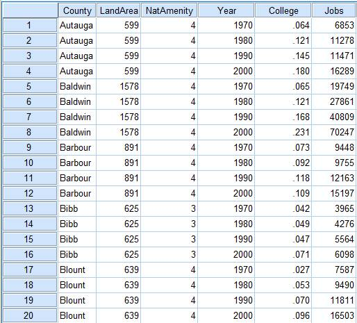

## Panel Data Manipulation
- In the applications we are studying, the dataset is typically required to be
    - in _long_ format: for each individual, we have one row per period;
    - _balanced_: the sample size is $N \times T$, with $N$ individuals and $T$ periods; and
    - properly ordered by individual and then by time.

<center></center>

- In many empirical applications, the information is released as a collection of cross-sectional datasets, so we first need to build the panel structure.
- In R, there are at least two ways to do this:
    - stack the datasets and keep only the individuals who appear in every period; or
    - perform an inner join by individual and then convert the data from _wide_ to _long_.
- As an example, we will use PNAD Contínua, which is released quarterly and can be handled with the `PNADcIBGE` package.
- The data can be imported with `read_pnadc(microdata, input_txt)`, which requires downloading both the **microdata files** and the **text file containing the variable metadata (`input_txt`)** from the [IBGE FTP](https://ftp.ibge.gov.br/Trabalho_e_Rendimento/Pesquisa_Nacional_por_Amostra_de_Domicilios_continua/Trimestral/Microdados/2021):

```r
# install.packages("PNADcIBGE")
# install.packages("dplyr")
library(PNADcIBGE)
library(dplyr)
```
- The compressed `.zip` file is about 12\% of the size of the uncompressed `.txt` file (133 MB $\times$ 1.08 GB). To avoid keeping the `.txt` file permanently on the computer, we can use `unz()` to extract it temporarily:


```r
# Unzipping the PNADc files and loading them into R
pnad_012021 = read_pnadc(unz("PNADC_012021_20220224.zip", "PNADC_012021.txt"),
                         input_txt = "input_PNADC_trimestral.txt")

pnad_022021 = read_pnadc(unz("PNADC_022021_20220224.zip", "PNADC_022021.txt"),
                         input_txt = "input_PNADC_trimestral.txt")
```

- To identify an individual in the PNAD data, IBGE uses the following [key variables](https://www.ibge.gov.br/estatisticas/downloads-estatisticas.html?caminho=Trabalho_e_Rendimento/Pesquisa_Nacional_por_Amostra_de_Domicilios_continua/Trimestral/Microdados/Documentacao):
    - _UPA_: Primary Sampling Unit / State code (2) + Sequential Number (6) + Check Digit (1)
    - _V1008_: Household number (01 to 14)
    - _V1014_: Panel/sample group (01 to 99)
    - _V2003_: Within-household order number (01 to 30)
- Researchers at Ipea ([Teixeira Júnior et al., 2020](http://repositorio.ipea.gov.br/bitstream/11058/9951/1/bmt_67_nt_pesos_longitudinais.pdf)) add a few time-invariant key variables to make this identifier more robust:
    - _V2007_: Sex
    - _V2008_/_V20081_/_V20082_: Date of birth (day/month/year)
- In addition, we will keep a few more variables:
    - _time-invariant_:
        - _UF_: State
    - _time-varying_:
        - _V2009_: Age (in years)
        - _VD4020_: Effective monthly labor income for people aged 14 or older


```r
# List of variables used in the example
lista_var = c("Trimestre", "UPA", "V1008", "V1014", "V2003", "V2007", "V2008",
              "V20081", "V20082", "UF", "V2009", "VD4020")

# Selecting and renaming variables, and keeping only people aged 14 or older
pnad_1 = pnad_012021 %>% select(all_of(lista_var)) %>%
    rename(DOMIC = V1008, PAINEL = V1014, ORDEM = V2003, SEXO = V2007, 
           DIA_NASC = V2008, MES_NASC = V20081, ANO_NASC = V20082, 
           IDADE = V2009, RENDA = VD4020) %>%
    filter(IDADE >= 14)

pnad_2 = pnad_022021 %>% select(all_of(lista_var)) %>%
    rename(DOMIC = V1008, PAINEL = V1014, ORDEM = V2003, SEXO = V2007, 
           DIA_NASC = V2008, MES_NASC = V20081, ANO_NASC = V20082, 
           IDADE = V2009, RENDA = VD4020) %>%
    filter(IDADE >= 14)
```


### Stacking datasets and keeping individuals observed in every period
- First, we stack the two datasets with `rbind()`. They must have the same number of columns, and the corresponding columns must share the same class (_character_, _numeric_, etc.):

```r
pnad_bind = rbind(pnad_1, pnad_2)
head(pnad_bind)
```

```
## # A tibble: 6 × 12
##   Trimestre UPA     DOMIC PAINEL ORDEM SEXO  DIA_N…¹ MES_N…² ANO_N…³ UF    IDADE
##   <chr>     <chr>   <chr> <chr>  <chr> <chr> <chr>   <chr>   <chr>   <chr> <dbl>
## 1 1         110000… 01    08     01    2     16      05      1981    11       39
## 2 1         110000… 01    08     02    2     12      06      2000    11       20
## 3 1         110000… 01    08     03    2     15      05      2004    11       16
## 4 1         110000… 01    08     04    1     26      07      1947    11       73
## 5 1         110000… 01    08     05    2     15      08      1961    11       59
## 6 1         110000… 02    08     01    2     11      07      1983    11       37
## # … with 1 more variable: RENDA <dbl>, and abbreviated variable names
## #   ¹​DIA_NASC, ²​MES_NASC, ³​ANO_NASC
```
- Note that the 2nd observation does not correspond to the same person as the 1st row. We therefore create an `ID` variable by concatenating all key variables and then reorder the data by that identifier and by quarter:

```r
pnad_bind = pnad_bind %>% mutate(
    ID = paste0(UPA, DOMIC, PAINEL, ORDEM, SEXO, DIA_NASC, MES_NASC, ANO_NASC)
    ) %>% select(ID, everything()) %>% # reorder variables so ID comes first
    arrange(ID, Trimestre)
head(pnad_bind, 10)
```

```
## # A tibble: 10 × 13
##    ID       Trime…¹ UPA   DOMIC PAINEL ORDEM SEXO  DIA_N…² MES_N…³ ANO_N…⁴ UF   
##    <chr>    <chr>   <chr> <chr> <chr>  <chr> <chr> <chr>   <chr>   <chr>   <chr>
##  1 1100000… 1       1100… 01    08     01    2     16      05      1981    11   
##  2 1100000… 1       1100… 01    08     02    2     12      06      2000    11   
##  3 1100000… 1       1100… 01    08     03    2     15      05      2004    11   
##  4 1100000… 1       1100… 01    08     04    1     26      07      1947    11   
##  5 1100000… 1       1100… 01    08     05    2     15      08      1961    11   
##  6 1100000… 1       1100… 02    08     01    2     11      07      1983    11   
##  7 1100000… 2       1100… 02    08     01    2     11      07      1983    11   
##  8 1100000… 1       1100… 02    08     02    1     99      99      9999    11   
##  9 1100000… 2       1100… 02    08     02    1     99      99      9999    11   
## 10 1100000… 1       1100… 03    08     01    2     09      03      1976    11   
## # … with 2 more variables: IDADE <dbl>, RENDA <dbl>, and abbreviated variable
## #   names ¹​Trimestre, ²​DIA_NASC, ³​MES_NASC, ⁴​ANO_NASC
```
- Observe that the panel is not balanced: not every individual appears in both quarters. So we first create an auxiliary object that counts how many times each `ID` appears in `pnad_bind`:

```r
cont_ID = pnad_bind %>% group_by(ID) %>% summarise(cont = n())
head(cont_ID, 10)
```

```
## # A tibble: 10 × 2
##    ID                        cont
##    <chr>                    <int>
##  1 110000016010801216051981     1
##  2 110000016010802212062000     1
##  3 110000016010803215052004     1
##  4 110000016010804126071947     1
##  5 110000016010805215081961     1
##  6 110000016020801211071983     2
##  7 110000016020802199999999     2
##  8 110000016030801209031976     2
##  9 110000016030802103092000     2
## 10 110000016030804118091954     2
```
- In `cont_ID`, we keep only the cases that appear exactly twice:

```r
cont_ID = cont_ID %>% filter(cont == 2)
head(cont_ID, 10)
```

```
## # A tibble: 10 × 2
##    ID                        cont
##    <chr>                    <int>
##  1 110000016020801211071983     2
##  2 110000016020802199999999     2
##  3 110000016030801209031976     2
##  4 110000016030802103092000     2
##  5 110000016030804118091954     2
##  6 110000016040801105081969     2
##  7 110000016040802215011976     2
##  8 110000016040803110071994     2
##  9 110000016040804217051997     2
## 10 110000016050801105071965     2
```
- Back in `pnad_bind`, we filter the sample to keep only IDs that are present in `cont_ID$ID`:

```r
pnad_bind = pnad_bind %>% filter(ID %in% cont_ID$ID)
head(pnad_bind)
```

```
## # A tibble: 6 × 13
##   ID        Trime…¹ UPA   DOMIC PAINEL ORDEM SEXO  DIA_N…² MES_N…³ ANO_N…⁴ UF   
##   <chr>     <chr>   <chr> <chr> <chr>  <chr> <chr> <chr>   <chr>   <chr>   <chr>
## 1 11000001… 1       1100… 02    08     01    2     11      07      1983    11   
## 2 11000001… 2       1100… 02    08     01    2     11      07      1983    11   
## 3 11000001… 1       1100… 02    08     02    1     99      99      9999    11   
## 4 11000001… 2       1100… 02    08     02    1     99      99      9999    11   
## 5 11000001… 1       1100… 03    08     01    2     09      03      1976    11   
## 6 11000001… 2       1100… 03    08     01    2     09      03      1976    11   
## # … with 2 more variables: IDADE <dbl>, RENDA <dbl>, and abbreviated variable
## #   names ¹​Trimestre, ²​DIA_NASC, ³​MES_NASC, ⁴​ANO_NASC
```

```r
N = pnad_bind$ID %>% unique() %>% length() # number of unique individuals
T = pnad_bind$Trimestre %>% unique() %>% length() # number of unique quarters
paste0("N = ", N, ", T = ", T, ", NT = ", N*T)
```

```
## [1] "N = 174468, T = 2, NT = 348936"
```


### Joining the datasets and converting from _wide_ to _long_
- Now we join the datasets with `inner_join()`, which keeps only the individuals who appear in both files:

```r
pnad_joined = inner_join(pnad_1, pnad_2, 
                         by=c("UPA", "DOMIC", "PAINEL", "ORDEM", "SEXO",
                              "DIA_NASC", "MES_NASC", "ANO_NASC"),
                         suffix=c("_1", "_2")) # avoid using . as a separator
colnames(pnad_joined) # column names
```

```
##  [1] "Trimestre_1" "UPA"         "DOMIC"       "PAINEL"      "ORDEM"      
##  [6] "SEXO"        "DIA_NASC"    "MES_NASC"    "ANO_NASC"    "UF_1"       
## [11] "IDADE_1"     "RENDA_1"     "Trimestre_2" "UF_2"        "IDADE_2"    
## [16] "RENDA_2"
```

```r
dim(pnad_joined) # dataset dimensions
```

```
## [1] 174468     16
```
- The joined data are now in _wide_ format (one row per individual), and the information for the 2 periods (the first and second quarters of 2021) appears in separate columns:
    - The suffixes were added to duplicate columns present in both datasets but not listed in `by`.
    - The time-invariant variable _UF_ was duplicated as well, so it makes sense to include it among the key variables.

```r
pnad_joined = inner_join(pnad_1, pnad_2, 
                         by=c("UPA", "DOMIC", "PAINEL", "ORDEM", "SEXO",
                              "DIA_NASC", "MES_NASC", "ANO_NASC", "UF"),
                         suffix=c("_1", "_2")) # avoid using . as a separator
colnames(pnad_joined) # column names
```

```
##  [1] "Trimestre_1" "UPA"         "DOMIC"       "PAINEL"      "ORDEM"      
##  [6] "SEXO"        "DIA_NASC"    "MES_NASC"    "ANO_NASC"    "UF"         
## [11] "IDADE_1"     "RENDA_1"     "Trimestre_2" "IDADE_2"     "RENDA_2"
```

```r
dim(pnad_joined) # dataset dimensions
```

```
## [1] 174468     15
```
- We now have a single _UF_ column, and the number of observations remains unchanged because sampled households did not actually switch states between these quarters.
    - If the number of rows had changed, that would indicate that some supposedly time-invariant observations differed across periods and were therefore dropped.
- We can also remove the columns `Trimestre_1` and `Trimestre_2`:

```r
pnad_joined = pnad_joined %>% select(-Trimestre_1, -Trimestre_2)
```
- Since the dataset is still in _wide_ format, we now convert it to _long_ format.


#### Converting from _wide_ to _long_ with `tidyr`
- [Pivoting (_tidyr_)](https://tidyr.tidyverse.org/articles/pivot.html)

- To reshape data between _wide_ and _long_ formats, we will use `tidyr` and the functions `pivot_longer()`, `pivot_wider()`, and `separate()`.

```r
library(tidyr)
```
- `pivot_longer()`: converts several columns into two columns, one for names and one for values (it increases the number of rows and decreases the number of columns)
```yaml
pivot_longer(
  data,
  cols,
  names_to = "name",
  values_to = "value"
  ...
)
```
- `pivot_wider()`: converts unique values of a variable into separate columns (it increases the number of columns and decreases the number of rows)
```yaml
pivot_wider(
  data,
  names_from = name,
  values_from = value,
  values_fill = NULL
  ...
)
```
- `separate()`: splits one column into multiple columns using a separator character
```yaml
separate(
  data,
  col,
  into,
  sep = "[^[:alnum:]]+"
  ...
)
```

- First, we reshape the time-varying columns (with suffixes `_1` or `_2`) into two columns:

```r
library(tidyr)
pnad_joined2 = pnad_joined %>%
    pivot_longer(
        cols = c(ends_with("_1"), ends_with("_2") ),
        names_to = "VAR_TRI", # new column that stores former column names
        values_to = "VALUE" # new column that stores the reshaped values
    )
head(pnad_joined2)
```

```
## # A tibble: 6 × 11
##   UPA       DOMIC PAINEL ORDEM SEXO  DIA_N…¹ MES_N…² ANO_N…³ UF    VAR_TRI VALUE
##   <chr>     <chr> <chr>  <chr> <chr> <chr>   <chr>   <chr>   <chr> <chr>   <dbl>
## 1 110000016 02    08     01    2     11      07      1983    11    IDADE_1    37
## 2 110000016 02    08     01    2     11      07      1983    11    RENDA_1    NA
## 3 110000016 02    08     01    2     11      07      1983    11    IDADE_2    37
## 4 110000016 02    08     01    2     11      07      1983    11    RENDA_2    NA
## 5 110000016 02    08     02    1     99      99      9999    11    IDADE_1    31
## 6 110000016 02    08     02    1     99      99      9999    11    RENDA_1    NA
## # … with abbreviated variable names ¹​DIA_NASC, ²​MES_NASC, ³​ANO_NASC
```
- Instead of having 2 rows per individual, we now have 4 because there are 2 time-varying variables.
- We therefore need to move half of those rows back into columns. We use `separate()` to split _VAR_TRI_ (with 4 unique values: _IDADE_1_, _IDADE_2_, _RENDA_1_, and _RENDA_2_) into 2 columns: _VAR_ (with 2 unique values: _IDADE_ and _RENDA_) and _TRI_ (with 2 unique values: _1_ and _2_).

```r
pnad_joined3 = pnad_joined2[1:100,] %>%
    separate(
        col = "VAR_TRI",
        into = c("VAR", "TRI"), # names of the new columns
        sep = "_" # separator used in VAR_TRI
    )
head(pnad_joined3)
```

```
## # A tibble: 6 × 12
##   UPA   DOMIC PAINEL ORDEM SEXO  DIA_N…¹ MES_N…² ANO_N…³ UF    VAR   TRI   VALUE
##   <chr> <chr> <chr>  <chr> <chr> <chr>   <chr>   <chr>   <chr> <chr> <chr> <dbl>
## 1 1100… 02    08     01    2     11      07      1983    11    IDADE 1        37
## 2 1100… 02    08     01    2     11      07      1983    11    RENDA 1        NA
## 3 1100… 02    08     01    2     11      07      1983    11    IDADE 2        37
## 4 1100… 02    08     01    2     11      07      1983    11    RENDA 2        NA
## 5 1100… 02    08     02    1     99      99      9999    11    IDADE 1        31
## 6 1100… 02    08     02    1     99      99      9999    11    RENDA 1        NA
## # … with abbreviated variable names ¹​DIA_NASC, ²​MES_NASC, ³​ANO_NASC
```

- Finally, we convert the _VAR_ column (with the 2 unique values _IDADE_ and _RENDA_) into 2 separate columns:

```r
pnad_joined4 = pnad_joined3 %>%
    pivot_wider(
        names_from = "VAR",
        values_from = "VALUE"
    )
pnad_joined4 %>% select(TRI, everything()) %>% head(20)
```

```
## # A tibble: 20 × 12
##    TRI   UPA       DOMIC PAINEL ORDEM SEXO  DIA_NASC MES_N…¹ ANO_N…² UF    IDADE
##    <chr> <chr>     <chr> <chr>  <chr> <chr> <chr>    <chr>   <chr>   <chr> <dbl>
##  1 1     110000016 02    08     01    2     11       07      1983    11       37
##  2 2     110000016 02    08     01    2     11       07      1983    11       37
##  3 1     110000016 02    08     02    1     99       99      9999    11       31
##  4 2     110000016 02    08     02    1     99       99      9999    11       31
##  5 1     110000016 03    08     01    2     09       03      1976    11       44
##  6 2     110000016 03    08     01    2     09       03      1976    11       45
##  7 1     110000016 03    08     02    1     03       09      2000    11       20
##  8 2     110000016 03    08     02    1     03       09      2000    11       20
##  9 1     110000016 03    08     04    1     18       09      1954    11       66
## 10 2     110000016 03    08     04    1     18       09      1954    11       66
## 11 1     110000016 04    08     01    1     05       08      1969    11       51
## 12 2     110000016 04    08     01    1     05       08      1969    11       51
## 13 1     110000016 04    08     02    2     15       01      1976    11       44
## 14 2     110000016 04    08     02    2     15       01      1976    11       45
## 15 1     110000016 04    08     03    1     10       07      1994    11       26
## 16 2     110000016 04    08     03    1     10       07      1994    11       26
## 17 1     110000016 04    08     04    2     17       05      1997    11       23
## 18 2     110000016 04    08     04    2     17       05      1997    11       23
## 19 1     110000016 05    08     01    1     05       07      1965    11       55
## 20 2     110000016 05    08     01    1     05       07      1965    11       55
## # … with 1 more variable: RENDA <dbl>, and abbreviated variable names
## #   ¹​MES_NASC, ²​ANO_NASC
```


#### Extra: Creating dummies with `pivot_wider()`
- First, create a column of 1s.
- Then use `pivot_wider()`, specifying the categorical variable and the column of 1s, while replacing missing values with zero (`fill = 0`):

```r
dummies_sexo = pnad_1 %>% mutate(const = 1) %>% # creating a column of 1s
    pivot_wider(names_from = SEXO,
                values_from = const,
                values_fill = 0)
head(dummies_sexo)
```

```
## # A tibble: 6 × 13
##   Trimestre UPA     DOMIC PAINEL ORDEM DIA_N…¹ MES_N…² ANO_N…³ UF    IDADE RENDA
##   <chr>     <chr>   <chr> <chr>  <chr> <chr>   <chr>   <chr>   <chr> <dbl> <dbl>
## 1 1         110000… 01    08     01    16      05      1981    11       39  1045
## 2 1         110000… 01    08     02    12      06      2000    11       20  1045
## 3 1         110000… 01    08     03    15      05      2004    11       16    NA
## 4 1         110000… 01    08     04    26      07      1947    11       73    NA
## 5 1         110000… 01    08     05    15      08      1961    11       59    NA
## 6 1         110000… 02    08     01    11      07      1983    11       37    NA
## # … with 2 more variables: `2` <dbl>, `1` <dbl>, and abbreviated variable names
## #   ¹​DIA_NASC, ²​MES_NASC, ³​ANO_NASC
```


#### Another example 1: _wide_ to _long_
- The dataset below contains information for 5 counties, including land area, the share of adults with college education, and the number of jobs in 4 different years:

```r
bd_counties = data.frame(
    county = c("Autauga", "Baldwin", "Barbour", "Bibb", "Blount"),
    area = c(599, 1578, 891, 625, 639),
    college_1970 = c(.064, .065, .073, .042, .027),
    college_1980 = c(.121, .121, .092, .049, .053),
    college_1990 = c(.145, .168, .118, .047, .070),
    college_2000 = c(.180, .231, .109, .071, .096),
    jobs_1970 = c(6853, 19749, 9448, 3965, 7587),
    jobs_1980 = c(11278, 27861, 9755, 4276, 9490),
    jobs_1990 = c(11471, 40809, 12163, 5564, 11811),
    jobs_2000 = c(16289, 70247, 15197, 6098, 16503)
)
bd_counties
```

```
##    county area college_1970 college_1980 college_1990 college_2000 jobs_1970
## 1 Autauga  599        0.064        0.121        0.145        0.180      6853
## 2 Baldwin 1578        0.065        0.121        0.168        0.231     19749
## 3 Barbour  891        0.073        0.092        0.118        0.109      9448
## 4    Bibb  625        0.042        0.049        0.047        0.071      3965
## 5  Blount  639        0.027        0.053        0.070        0.096      7587
##   jobs_1980 jobs_1990 jobs_2000
## 1     11278     11471     16289
## 2     27861     40809     70247
## 3      9755     12163     15197
## 4      4276      5564      6098
## 5      9490     11811     16503
```
- We want to reshape the dataset so that each county has 4 rows, one for each year: 1970, 1980, 1990, or 2000. The final structure should therefore have 5 columns: _county_, _year_, _area_, _college_, and _jobs_. We begin by stacking the columns whose names start with `college_` and `jobs_` using `pivot_longer()`:

```r
bd_counties2 = bd_counties %>%
    pivot_longer(
        cols = c( starts_with("college_"), starts_with("jobs_") ),
        names_to = "var_year", # new column that stores the former column names
        values_to = "value" # new column that stores the reshaped values
    )
head(bd_counties2, 10)
```

```
## # A tibble: 10 × 4
##    county   area var_year         value
##    <chr>   <dbl> <chr>            <dbl>
##  1 Autauga   599 college_1970     0.064
##  2 Autauga   599 college_1980     0.121
##  3 Autauga   599 college_1990     0.145
##  4 Autauga   599 college_2000     0.18 
##  5 Autauga   599 jobs_1970     6853    
##  6 Autauga   599 jobs_1980    11278    
##  7 Autauga   599 jobs_1990    11471    
##  8 Autauga   599 jobs_2000    16289    
##  9 Baldwin  1578 college_1970     0.065
## 10 Baldwin  1578 college_1980     0.121
```
- For each county, there are now two rows per year because there are 2 time-varying variables (_college_ and _jobs_). We remove this duplication by using `separate()` to split `var_year` into two columns, which we call `var` and `year`:

```r
bd_counties3 = bd_counties2 %>%
    separate(
        col = "var_year",
        into = c("var", "year"), # names of the new columns
        sep = "_" # separator used in the original column "var_year"
    )
head(bd_counties3, 10)
```

```
## # A tibble: 10 × 5
##    county   area var     year      value
##    <chr>   <dbl> <chr>   <chr>     <dbl>
##  1 Autauga   599 college 1970      0.064
##  2 Autauga   599 college 1980      0.121
##  3 Autauga   599 college 1990      0.145
##  4 Autauga   599 college 2000      0.18 
##  5 Autauga   599 jobs    1970   6853    
##  6 Autauga   599 jobs    1980  11278    
##  7 Autauga   599 jobs    1990  11471    
##  8 Autauga   599 jobs    2000  16289    
##  9 Baldwin  1578 college 1970      0.065
## 10 Baldwin  1578 college 1980      0.121
```
- Next, we transform the `var` column into 2 columns (`college` and `jobs`) with `pivot_wider()`:

```r
bd_counties4 = bd_counties3 %>%
    pivot_wider(
        names_from = "var",
        values_from = "value"
    )
bd_counties4 %>% select(county, year, everything()) %>% head(10)
```

```
## # A tibble: 10 × 5
##    county  year   area college  jobs
##    <chr>   <chr> <dbl>   <dbl> <dbl>
##  1 Autauga 1970    599   0.064  6853
##  2 Autauga 1980    599   0.121 11278
##  3 Autauga 1990    599   0.145 11471
##  4 Autauga 2000    599   0.18  16289
##  5 Baldwin 1970   1578   0.065 19749
##  6 Baldwin 1980   1578   0.121 27861
##  7 Baldwin 1990   1578   0.168 40809
##  8 Baldwin 2000   1578   0.231 70247
##  9 Barbour 1970    891   0.073  9448
## 10 Barbour 1980    891   0.092  9755
```
- If there were only one time-varying variable, `pivot_wider()` would not be necessary because there would already be one row per county-year observation.


#### Another example 2: _long_ to _wide_
- We now use the `TravelMode` dataset from the `AER` package, which contains 840 observations in which 210 individuals choose among 4 travel modes: car, air, train, or bus.
- Each of the 210 individuals appears in 4 rows, one for each travel mode.
- The dataset contains variables specific to
    - the individual (_individual_, _income_, and _size_), which are repeated across the 4 rows where that person appears; and
    - the choice occasion (_choice_, _wait_, _vcost_, _travel_, and _gcost_), which vary with the travel mode.

```r
data("TravelMode", package = "AER")
head(TravelMode, 8)
```

```
##   individual  mode choice wait vcost travel gcost income size
## 1          1   air     no   69    59    100    70     35    1
## 2          1 train     no   34    31    372    71     35    1
## 3          1   bus     no   35    25    417    70     35    1
## 4          1   car    yes    0    10    180    30     35    1
## 5          2   air     no   64    58     68    68     30    2
## 6          2 train     no   44    31    354    84     30    2
## 7          2   bus     no   53    25    399    85     30    2
## 8          2   car    yes    0    11    255    50     30    2
```
- We now reshape the dataset so that each individual appears in only one row, dropping the _mode_ column and generating several columns for each possible travel mode.

```r
TravelMode2 = TravelMode %>% 
    pivot_wider(
        names_from = "mode",
        values_from = c("choice":"gcost") # mode-specific variables
    )
head(TravelMode2)
```

```
## # A tibble: 6 × 23
##   individ…¹ income  size choic…² choic…³ choic…⁴ choic…⁵ wait_…⁶ wait_…⁷ wait_…⁸
##   <fct>      <int> <int> <fct>   <fct>   <fct>   <fct>     <int>   <int>   <int>
## 1 1             35     1 no      no      no      yes          69      34      35
## 2 2             30     2 no      no      no      yes          64      44      53
## 3 3             40     1 no      no      no      yes          69      34      35
## 4 4             70     3 no      no      no      yes          64      44      53
## 5 5             45     2 no      no      no      yes          64      44      53
## 6 6             20     1 no      yes     no      no           69      40      35
## # … with 13 more variables: wait_car <int>, vcost_air <int>, vcost_train <int>,
## #   vcost_bus <int>, vcost_car <int>, travel_air <int>, travel_train <int>,
## #   travel_bus <int>, travel_car <int>, gcost_air <int>, gcost_train <int>,
## #   gcost_bus <int>, gcost_car <int>, and abbreviated variable names
## #   ¹​individual, ²​choice_air, ³​choice_train, ⁴​choice_bus, ⁵​choice_car,
## #   ⁶​wait_air, ⁷​wait_train, ⁸​wait_bus
```
- For each travel mode, 5 columns were created, corresponding to the 5 mode-specific variables. In total, 6 columns were removed (_mode_ plus the 5 mode-specific variables) and 20 columns were created instead (4 modes $\times$ 5 mode-specific variables).
- In some econometric applications, such as multinomial logit, we want a single column indicating the chosen alternative. We therefore create a `choice` column that records the selected option (_air_, _train_, _bus_, or _car_) and then drop the 4 columns whose names start with `choice_`:

```r
TravelMode3 = TravelMode2 %>% 
    mutate(
        choice = case_when(
            choice_air == "yes" ~ "air",
            choice_train == "yes" ~ "train",
            choice_bus == "yes" ~ "bus",
            choice_car == "yes" ~ "car"
        )
    ) %>% select(individual, choice, 
                 starts_with("wait_"), starts_with("vcost_"),
                 starts_with("travel_"), starts_with("gcost_")
                 )

TravelMode3 %>% head(10)
```

```
## # A tibble: 10 × 18
##    individual choice wait_air wait_train wait_…¹ wait_…² vcost…³ vcost…⁴ vcost…⁵
##    <fct>      <chr>     <int>      <int>   <int>   <int>   <int>   <int>   <int>
##  1 1          car          69         34      35       0      59      31      25
##  2 2          car          64         44      53       0      58      31      25
##  3 3          car          69         34      35       0     115      98      53
##  4 4          car          64         44      53       0      49      26      21
##  5 5          car          64         44      53       0      60      32      26
##  6 6          train        69         40      35       0      59      20      13
##  7 7          air          45         34      35       0     148     111      66
##  8 8          car          69         34      35       0     121      52      50
##  9 9          car          69         34      35       0      59      31      25
## 10 10         car          69         34      35       0      58      31      25
## # … with 9 more variables: vcost_car <int>, travel_air <int>,
## #   travel_train <int>, travel_bus <int>, travel_car <int>, gcost_air <int>,
## #   gcost_train <int>, gcost_bus <int>, gcost_car <int>, and abbreviated
## #   variable names ¹​wait_bus, ²​wait_car, ³​vcost_air, ⁴​vcost_train, ⁵​vcost_bus
```



