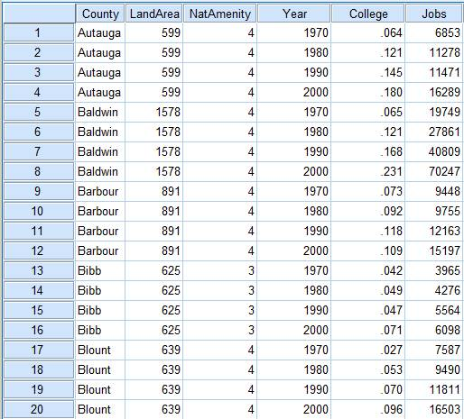

## Manipulação de dados em painel
- Para o que estamos estudando, é normalmente exigido que os dados estejam
    - no formato _long_: para cada indivíduo, temos uma linha para cada período;
    - _balanceados_: o tamanho da amostra é $N \times T$, com $N$ indivíduos e $T$ períodos; e
    - devidamente ordenados por indivíduos e, depois, por tempo.

<center></center>

- Em muitos casos, as informações são disponibilizadas em várias bases de dados de cortes transversais (_cross sections_), então é necessário estruturar a base de dados em painel.
- Isso por ser feito no R de, pelo menos, duas formas:
    - empilhando as bases de dados e filtrando apenas indivíduos que aparecem em todos períodos; ou
    - fazendo a junção interna (_inner join_) das bases por indivíduo e transformando do formato _wide_ para o _long_.
- Como exemplo, usaremos a PNAD Contínua que é publicada trimestralmente e possui o pacote `PNADcIBGE` que auxilia na sua utilização.
- Os dados podem ser obtidos via`read_pnadc(microdata, input_txt)` que necessita que você faça download das **bases de dados** e do **txt com informações das variáveis (_input_txt_)** no [FTP do IBGE](https://ftp.ibge.gov.br/Trabalho_e_Rendimento/Pesquisa_Nacional_por_Amostra_de_Domicilios_continua/Trimestral/Microdados/2021):

```r
# install.packages("PNADcIBGE")
library(PNADcIBGE)
```

```
## Warning: package 'PNADcIBGE' was built under R version 4.2.2
```

```r
library(dplyr)
```

```
## Warning: package 'dplyr' was built under R version 4.2.2
```

```
## 
## Attaching package: 'dplyr'
```

```
## The following objects are masked from 'package:stats':
## 
##     filter, lag
```

```
## The following objects are masked from 'package:base':
## 
##     intersect, setdiff, setequal, union
```
- O arquivo compactado .zip é cerca de 12\% do arquivo descompactado .txt (133mb $\times$ 1,08gb). Para não precisar manter o arquivo .txt no computador, podemos usar a função `unz()` para descompactar arquivos temporariamente:


```r
# Descompactando as bases da PNADc e carregando no R
pnad_012021 = read_pnadc(unz("PNADC_012021_20220224.zip", "PNADC_012021.txt"),
                         input_txt = "input_PNADC_trimestral.txt")

pnad_022021 = read_pnadc(unz("PNADC_022021_20220224.zip", "PNADC_022021.txt"),
                         input_txt = "input_PNADC_trimestral.txt")
```
- Ou também via `get_pnadc(year, quarter = NULL, design = TRUE)`, que faz o download diretamente do R e atribui para um objeto. É necessário informar a data da pesquisa (ano e trimestre) e, para retornar um data frame, altere o argumento para `design = FALSE` (caso contrário, irá retornar um objeto do tipo `survey.design`). Além disso, constrói automaticamente colunas com deflatores:
```r
# OU Carregando as bases da PNADc via get_pnadc()
pnad_012021 = get_pnadc(year=2021, quarter=1, design=FALSE)
pnad_022021 = get_pnadc(year=2021, quarter=2, design=FALSE)

```

- Para identificar um indivíduo na base do PNAD, o IBGE usa as seguintes [variáveis-chave](https://www.ibge.gov.br/estatisticas/downloads-estatisticas.html?caminho=Trabalho_e_Rendimento/Pesquisa_Nacional_por_Amostra_de_Domicilios_continua/Trimestral/Microdados/Documentacao):
    - _UPA_: Unidade Primária de Amostragem / UF (2) + Nº Sequencial (6) + DV (1)
    - _V1008_: Número do domicílio (01 a 14)
    - _V1014_: Painel/Grupo de amostra (01 a 99)
    - _V2003_: Número de ordem (01 a 30)
- Pesquisadores do Ipea ([Teixeira Júnior et al., 2020](http://repositorio.ipea.gov.br/bitstream/11058/9951/1/bmt_67_nt_pesos_longitudinais.pdf)) usam mais algumas variáveis-chave invariantes no tempo para tornar esse 
    - _V2007_: Sexo
    - _V2008_/_V20081_/_V20082_: Data de nascimento (dia/mês/ano)
- Além disso, vamos adicionar mais algumas variáveis:
    - _invariante no tempo_:
        - _UF_: Unidade da Federação
    - _variantes no tempo_:
        - _V2009_: Idade (em anos)
        - _VD4020_: Rendimento mensal efetivo de todos os trabalhos para pessoas de 14 anos ou mais de idade


```r
# Boas práticas (pricipalmente usando base de dados grandes):
# - Não manipular o objeto em que você carregou a base de dados -> crie um novo
# - Selecione apenas as variáveis que for utilizar

lista_var = c("Trimestre", "UPA", "V1008", "V1014", "V2003", "V2007", "V2008",
              "V20081", "V20082", "UF", "V2009", "VD4020")

# Selecionando e renomeando variáveis, e filtrando apenas maiores de 14 anos 
pnad_1 = pnad_012021 %>% select(all_of(lista_var)) %>%
    rename(DOMIC = V1008, PAINEL = V1014, ORDEM = V2003, SEXO = V2007, 
           DIA_NASC = V2008, MES_NASC = V20081, ANO_NASC = V20082, 
           IDADE = V2009, RENDA = VD4020) %>%
    filter(IDADE >= 14)

pnad_2 = pnad_022021 %>% select(all_of(lista_var)) %>%
    rename(DOMIC = V1008, PAINEL = V1014, ORDEM = V2003, SEXO = V2007, 
           DIA_NASC = V2008, MES_NASC = V20081, ANO_NASC = V20082, 
           IDADE = V2009, RENDA = VD4020) %>%
    filter(IDADE >= 14)
```


### Empilhando bases de dados e filtrando indivíduos que aparecem em todos os períodos
- Primeiro, empilharemos as bases de dados usando `rbind()`. É necessário garantir que tenham o mesmo número de colunas e estas sejam da mesma classe (_character_, _numeric_, etc.):

```r
pnad_bind = rbind(pnad_1, pnad_2)
head(pnad_bind)
```

```
## # A tibble: 6 × 12
##   Trimestre UPA     DOMIC PAINEL ORDEM SEXO  DIA_N…¹ MES_N…² ANO_N…³ UF    IDADE
##   <chr>     <chr>   <chr> <chr>  <chr> <chr> <chr>   <chr>   <chr>   <chr> <dbl>
## 1 1         110000… 01    08     01    2     16      05      1981    11       39
## 2 1         110000… 01    08     02    2     12      06      2000    11       20
## 3 1         110000… 01    08     03    2     15      05      2004    11       16
## 4 1         110000… 01    08     04    1     26      07      1947    11       73
## 5 1         110000… 01    08     05    2     15      08      1961    11       59
## 6 1         110000… 02    08     01    2     11      07      1983    11       37
## # … with 1 more variable: RENDA <dbl>, and abbreviated variable names
## #   ¹​DIA_NASC, ²​MES_NASC, ³​ANO_NASC
```
- Note que a 2ª observação não corresponde à mesma pessoa da 1º linha. Vamos criar uma variável `ID`, juntando informações de todas variáveis-chave, e rearranjar a base de dados de acordo com ela e o trimestre:

```r
pnad_bind = pnad_bind %>% mutate(
    ID = paste0(UPA, DOMIC, PAINEL, ORDEM, SEXO, DIA_NASC, MES_NASC, ANO_NASC)
    ) %>% select(ID, everything()) %>% # reordenando variáveis, começando com ID
    arrange(ID, Trimestre)
head(pnad_bind, 10)
```

```
## # A tibble: 10 × 13
##    ID       Trime…¹ UPA   DOMIC PAINEL ORDEM SEXO  DIA_N…² MES_N…³ ANO_N…⁴ UF   
##    <chr>    <chr>   <chr> <chr> <chr>  <chr> <chr> <chr>   <chr>   <chr>   <chr>
##  1 1100000… 1       1100… 01    08     01    2     16      05      1981    11   
##  2 1100000… 1       1100… 01    08     02    2     12      06      2000    11   
##  3 1100000… 1       1100… 01    08     03    2     15      05      2004    11   
##  4 1100000… 1       1100… 01    08     04    1     26      07      1947    11   
##  5 1100000… 1       1100… 01    08     05    2     15      08      1961    11   
##  6 1100000… 1       1100… 02    08     01    2     11      07      1983    11   
##  7 1100000… 2       1100… 02    08     01    2     11      07      1983    11   
##  8 1100000… 1       1100… 02    08     02    1     99      99      9999    11   
##  9 1100000… 2       1100… 02    08     02    1     99      99      9999    11   
## 10 1100000… 1       1100… 03    08     01    2     09      03      1976    11   
## # … with 2 more variables: IDADE <dbl>, RENDA <dbl>, and abbreviated variable
## #   names ¹​Trimestre, ²​DIA_NASC, ³​MES_NASC, ⁴​ANO_NASC
```
- Observe que o base de dados em painel não está balanceada, ou seja, nem todos os indivíduos aparecem nos 2 trimestres. Portanto, vamos criar um objeto auxiliar com a contagem de vezes que o `ID` aparece em `pnad_bind`

```r
cont_ID = pnad_bind %>% group_by(ID) %>% summarise(cont = n())
head(cont_ID, 10)
```

```
## # A tibble: 10 × 2
##    ID                        cont
##    <chr>                    <int>
##  1 110000016010801216051981     1
##  2 110000016010802212062000     1
##  3 110000016010803215052004     1
##  4 110000016010804126071947     1
##  5 110000016010805215081961     1
##  6 110000016020801211071983     2
##  7 110000016020802199999999     2
##  8 110000016030801209031976     2
##  9 110000016030802103092000     2
## 10 110000016030804118091954     2
```
- Em `cont_ID`, vamos filtrar apenas os caso que aparecem 2 vezes

```r
cont_ID = cont_ID %>% filter(cont == 2)
head(cont_ID, 10)
```

```
## # A tibble: 10 × 2
##    ID                        cont
##    <chr>                    <int>
##  1 110000016020801211071983     2
##  2 110000016020802199999999     2
##  3 110000016030801209031976     2
##  4 110000016030802103092000     2
##  5 110000016030804118091954     2
##  6 110000016040801105081969     2
##  7 110000016040802215011976     2
##  8 110000016040803110071994     2
##  9 110000016040804217051997     2
## 10 110000016050801105071965     2
```
- Voltando para a base `pnad_bind`, vamos filtrar apenas ID's que aparecem no vetor `cont_ID$ID`:

```r
pnad_bind = pnad_bind %>% filter(ID %in% cont_ID$ID)
head(pnad_bind)
```

```
## # A tibble: 6 × 13
##   ID        Trime…¹ UPA   DOMIC PAINEL ORDEM SEXO  DIA_N…² MES_N…³ ANO_N…⁴ UF   
##   <chr>     <chr>   <chr> <chr> <chr>  <chr> <chr> <chr>   <chr>   <chr>   <chr>
## 1 11000001… 1       1100… 02    08     01    2     11      07      1983    11   
## 2 11000001… 2       1100… 02    08     01    2     11      07      1983    11   
## 3 11000001… 1       1100… 02    08     02    1     99      99      9999    11   
## 4 11000001… 2       1100… 02    08     02    1     99      99      9999    11   
## 5 11000001… 1       1100… 03    08     01    2     09      03      1976    11   
## 6 11000001… 2       1100… 03    08     01    2     09      03      1976    11   
## # … with 2 more variables: IDADE <dbl>, RENDA <dbl>, and abbreviated variable
## #   names ¹​Trimestre, ²​DIA_NASC, ³​MES_NASC, ⁴​ANO_NASC
```

```r
N = pnad_bind$ID %>% unique() %>% length() # Nº de indivíduos únicos
T = pnad_bind$Trimestre %>% unique() %>% length() # Nº de trimestre únicos
paste0("N = ", N, ", T = ", T, ", NT = ", N*T)
```

```
## [1] "N = 174468, T = 2, NT = 348936"
```


### Juntado as bases e transformando de _wide_ para _long_
- Agora, juntaremos a base usando a função `inner_join()` que apenas mantém indivíduos que aparecem em ambas bases de dados:

```r
pnad_joined = inner_join(pnad_1, pnad_2, 
                         by=c("UPA", "DOMIC", "PAINEL", "ORDEM", "SEXO",
                              "DIA_NASC", "MES_NASC", "ANO_NASC"),
                         suffix=c("_1", "_2")) # evite usar . como separador
colnames(pnad_joined) # nomes das colunas
```

```
##  [1] "Trimestre_1" "UPA"         "DOMIC"       "PAINEL"      "ORDEM"      
##  [6] "SEXO"        "DIA_NASC"    "MES_NASC"    "ANO_NASC"    "UF_1"       
## [11] "IDADE_1"     "RENDA_1"     "Trimestre_2" "UF_2"        "IDADE_2"    
## [16] "RENDA_2"
```

```r
dim(pnad_joined) # dimensões da base de dados
```

```
## [1] 174468     16
```
- Note que obtivemos a base no formato _wide_ (1 linha para cada indivíduo) e as informações relativas aos 2 períodos (1º e 2º trimestres de 2021) estão em colunas:
    - Os sufixos foram utilizamos para duplicar colunas de informações contidas em ambas bases (e que não foram inseridas no argumento `by`).
    - A variável invariante no tempo _UF_ foi duplicada, então seria interessante incluí-la também como uma ``variável-chave''

```r
pnad_joined = inner_join(pnad_1, pnad_2, 
                         by=c("UPA", "DOMIC", "PAINEL", "ORDEM", "SEXO",
                              "DIA_NASC", "MES_NASC", "ANO_NASC", "UF"),
                         suffix=c("_1", "_2")) # evite usar . como separador
colnames(pnad_joined) # nomes das colunas
```

```
##  [1] "Trimestre_1" "UPA"         "DOMIC"       "PAINEL"      "ORDEM"      
##  [6] "SEXO"        "DIA_NASC"    "MES_NASC"    "ANO_NASC"    "UF"         
## [11] "IDADE_1"     "RENDA_1"     "Trimestre_2" "IDADE_2"     "RENDA_2"
```

```r
dim(pnad_joined) # dimensões da base de dados
```

```
## [1] 174468     15
```
- Observe que temos uma única coluna _UF_ agora e o número de observações manteve-se inalterado, pois os domicílios da amostra de fato não alteraram suas UFs entre estes trimestres.
    - Caso alterasse o número de linhas, a variável invariante no tempo possui algumas observações que alteraram entre os períodos e estas foram excluídas da amostra.
- Também podemos retirar as colunas "Trimestre.1" e "Trimestre.2":

```r
pnad_joined = pnad_joined %>% select(-Trimestre_1, -Trimestre_2)
```
- Estando no formato _wide_, precisamos transformar para o formato _long_


#### Transformando a base de _wide_ para _long_ via `tidyr`
- [Pivoting (_tidyr_)](https://tidyr.tidyverse.org/articles/pivot.html)

- Para fazer transformações em _wide_ ou _long_ usaremos o pacote `tidyr` e suas funções `pivot_longer()`, `pivot_wider()` e `separate()`

```r
library(tidyr)
```

```
## Warning: package 'tidyr' was built under R version 4.2.2
```
- `pivot_longer()`: transforma várias colunas em duas: de nomes e de valores (aumenta o nº de linhas e diminui o de colunas)
```yaml
pivot_longer(
  data,
  cols,
  names_to = "name",
  values_to = "value"
  ...
)
```
- `pivot_wider()`: transforma nomes (valores únicos) de uma variável em várias colunas (aumenta o nº de colunas e diminui o de linhas)
```yaml
pivot_wider(
  data,
  names_from = name,
  values_from = value,
  values_fill = NULL
  ...
)
```
- `separate()`: divide uma coluna em outras a partir de um caracter ``separador''
```yaml
separate(
  data,
  col,
  into,
  sep = "[^[:alnum:]]+"
  ...
)
```

- Primeiro, vamos transformar as colunas variantes no tempo (com sufixos `_1` ou `_2`) em duas colunas

```r
library(tidyr)
pnad_joined2 = pnad_joined %>%
    pivot_longer(
        cols = c(ends_with("_1"), ends_with("_2") ),
        names_to = "VAR_TRI", # nome da coluna que vão os nomes das colunas antigas
        values_to = "VALUE" # nome da coluna com os valores das colunas transformadas
    )
head(pnad_joined2)
```

```
## # A tibble: 6 × 11
##   UPA       DOMIC PAINEL ORDEM SEXO  DIA_N…¹ MES_N…² ANO_N…³ UF    VAR_TRI VALUE
##   <chr>     <chr> <chr>  <chr> <chr> <chr>   <chr>   <chr>   <chr> <chr>   <dbl>
## 1 110000016 02    08     01    2     11      07      1983    11    IDADE_1    37
## 2 110000016 02    08     01    2     11      07      1983    11    RENDA_1    NA
## 3 110000016 02    08     01    2     11      07      1983    11    IDADE_2    37
## 4 110000016 02    08     01    2     11      07      1983    11    RENDA_2    NA
## 5 110000016 02    08     02    1     99      99      9999    11    IDADE_1    31
## 6 110000016 02    08     02    1     99      99      9999    11    RENDA_1    NA
## # … with abbreviated variable names ¹​DIA_NASC, ²​MES_NASC, ³​ANO_NASC
```
- Note que, ao invés de ter 2 linhas por indivíduo, temos 4 (pois temos 2 variáveis variantes no tempo).
- Precisamos jogar metade das linhas de volta para colunas. Vamos usar a função `separate()` para separar _VAR.TRI_ (com 4 valores únicos: _IDADE_1_, _IDADE_2_, _RENDA_1_ e _RENDA_2_) em 2 colunas: _VAR_ (2 valores únicos: _IDADE_ e _RENDA_) e _TRI_ (2 valores únicos: _1_ e _2_).

```r
pnad_joined3 = pnad_joined2[1:100,] %>%
    separate(
        col = "VAR_TRI",
        into = c("VAR", "TRI"), # nomes das colunas separadas
        sep = "_" # caracter que separa as valores da coluna VAR_TRI
    )
head(pnad_joined3)
```

```
## # A tibble: 6 × 12
##   UPA   DOMIC PAINEL ORDEM SEXO  DIA_N…¹ MES_N…² ANO_N…³ UF    VAR   TRI   VALUE
##   <chr> <chr> <chr>  <chr> <chr> <chr>   <chr>   <chr>   <chr> <chr> <chr> <dbl>
## 1 1100… 02    08     01    2     11      07      1983    11    IDADE 1        37
## 2 1100… 02    08     01    2     11      07      1983    11    RENDA 1        NA
## 3 1100… 02    08     01    2     11      07      1983    11    IDADE 2        37
## 4 1100… 02    08     01    2     11      07      1983    11    RENDA 2        NA
## 5 1100… 02    08     02    1     99      99      9999    11    IDADE 1        31
## 6 1100… 02    08     02    1     99      99      9999    11    RENDA 1        NA
## # … with abbreviated variable names ¹​DIA_NASC, ²​MES_NASC, ³​ANO_NASC
```

- Para finalizar, vamos transformar a coluna _VAR_ (com 2 valores únicos: _IDADE_ e _RENDA_) em 2 colunas (_IDADE_ e _RENDA_):

```r
pnad_joined4 = pnad_joined3 %>%
    pivot_wider(
        names_from = "VAR",
        values_from = "VALUE"
    )
pnad_joined4 %>% select(TRI, everything()) %>% head(20)
```

```
## # A tibble: 20 × 12
##    TRI   UPA       DOMIC PAINEL ORDEM SEXO  DIA_NASC MES_N…¹ ANO_N…² UF    IDADE
##    <chr> <chr>     <chr> <chr>  <chr> <chr> <chr>    <chr>   <chr>   <chr> <dbl>
##  1 1     110000016 02    08     01    2     11       07      1983    11       37
##  2 2     110000016 02    08     01    2     11       07      1983    11       37
##  3 1     110000016 02    08     02    1     99       99      9999    11       31
##  4 2     110000016 02    08     02    1     99       99      9999    11       31
##  5 1     110000016 03    08     01    2     09       03      1976    11       44
##  6 2     110000016 03    08     01    2     09       03      1976    11       45
##  7 1     110000016 03    08     02    1     03       09      2000    11       20
##  8 2     110000016 03    08     02    1     03       09      2000    11       20
##  9 1     110000016 03    08     04    1     18       09      1954    11       66
## 10 2     110000016 03    08     04    1     18       09      1954    11       66
## 11 1     110000016 04    08     01    1     05       08      1969    11       51
## 12 2     110000016 04    08     01    1     05       08      1969    11       51
## 13 1     110000016 04    08     02    2     15       01      1976    11       44
## 14 2     110000016 04    08     02    2     15       01      1976    11       45
## 15 1     110000016 04    08     03    1     10       07      1994    11       26
## 16 2     110000016 04    08     03    1     10       07      1994    11       26
## 17 1     110000016 04    08     04    2     17       05      1997    11       23
## 18 2     110000016 04    08     04    2     17       05      1997    11       23
## 19 1     110000016 05    08     01    1     05       07      1965    11       55
## 20 2     110000016 05    08     01    1     05       07      1965    11       55
## # … with 1 more variable: RENDA <dbl>, and abbreviated variable names
## #   ¹​MES_NASC, ²​ANO_NASC
```


#### Extra: Criação de dummies via `pivot_wider()`
- Primeiro, é necessário criar uma coluna de 1's
- Depois usar a função `pivot_wider()`, indicando a variável categórica e a coluna de 1's, preenchendo os NA's com zero (`fill = 0`) :

```r
dummies_sexo = pnad_1 %>% mutate(const = 1) %>% # criando coluna de 1's
    pivot_wider(names_from = SEXO,
                values_from = const,
                values_fill = 0)
head(dummies_sexo)
```

```
## # A tibble: 6 × 13
##   Trimestre UPA     DOMIC PAINEL ORDEM DIA_N…¹ MES_N…² ANO_N…³ UF    IDADE RENDA
##   <chr>     <chr>   <chr> <chr>  <chr> <chr>   <chr>   <chr>   <chr> <dbl> <dbl>
## 1 1         110000… 01    08     01    16      05      1981    11       39  1045
## 2 1         110000… 01    08     02    12      06      2000    11       20  1045
## 3 1         110000… 01    08     03    15      05      2004    11       16    NA
## 4 1         110000… 01    08     04    26      07      1947    11       73    NA
## 5 1         110000… 01    08     05    15      08      1961    11       59    NA
## 6 1         110000… 02    08     01    11      07      1983    11       37    NA
## # … with 2 more variables: `2` <dbl>, `1` <dbl>, and abbreviated variable names
## #   ¹​DIA_NASC, ²​MES_NASC, ³​ANO_NASC
```


#### Outro exemplo 1: _wide_ para _long_
- A base de dados abaixo possui informações de 5 condados com suas repectivas áreas territoriais, proporções de adultos com ensino superior e nº de vagas de emprego em 4 anos distintos:

```r
bd_counties = data.frame(
    county = c("Autauga", "Baldwin", "Barbour", "Bibb", "Blount"),
    area = c(599, 1578, 891, 625, 639),
    college_1970 = c(.064, .065, .073, .042, .027),
    college_1980 = c(.121, .121, .092, .049, .053),
    college_1990 = c(.145, .168, .118, .047, .070),
    college_2000 = c(.180, .231, .109, .071, .096),
    jobs_1970 = c(6853, 19749, 9448, 3965, 7587),
    jobs_1980 = c(11278, 27861, 9755, 4276, 9490),
    jobs_1990 = c(11471, 40809, 12163, 5564, 11811),
    jobs_2000 = c(16289, 70247, 15197, 6098, 16503)
)
bd_counties
```

```
##    county area college_1970 college_1980 college_1990 college_2000 jobs_1970
## 1 Autauga  599        0.064        0.121        0.145        0.180      6853
## 2 Baldwin 1578        0.065        0.121        0.168        0.231     19749
## 3 Barbour  891        0.073        0.092        0.118        0.109      9448
## 4    Bibb  625        0.042        0.049        0.047        0.071      3965
## 5  Blount  639        0.027        0.053        0.070        0.096      7587
##   jobs_1980 jobs_1990 jobs_2000
## 1     11278     11471     16289
## 2     27861     40809     70247
## 3      9755     12163     15197
## 4      4276      5564      6098
## 5      9490     11811     16503
```
- Queremos estruturar a base de dados de modo que, para cada condado, tenhamos 4 linhas (cada uma corresponde a um dos anos: 1970, 1980, 1990 ou 2020). Portanto, teremos 5 colunas: _county_, _year_, _area_, _college_ e _jobs_. Começamos transformando as colunas cujos nomes iniciam com `college_` e com `jobs_` em linhas via `pivot_longer()`:

```r
bd_counties2 = bd_counties %>%
    pivot_longer(
        cols = c( starts_with("college_"), starts_with("jobs_") ),
        names_to = "var_year", # nome da coluna que vão os nomes das colunas antigas
        values_to = "value" # nome da coluna com os valores das colunas transformadas
    )
head(bd_counties2, 10)
```

```
## # A tibble: 10 × 4
##    county   area var_year         value
##    <chr>   <dbl> <chr>            <dbl>
##  1 Autauga   599 college_1970     0.064
##  2 Autauga   599 college_1980     0.121
##  3 Autauga   599 college_1990     0.145
##  4 Autauga   599 college_2000     0.18 
##  5 Autauga   599 jobs_1970     6853    
##  6 Autauga   599 jobs_1980    11278    
##  7 Autauga   599 jobs_1990    11471    
##  8 Autauga   599 jobs_2000    16289    
##  9 Baldwin  1578 college_1970     0.065
## 10 Baldwin  1578 college_1980     0.121
```
- Note que, para cada condado, há duas linhas para cada ano, já que há 2 que variam no tempo (_college_ e _jobs_). Precisamos tirar essa duplicidade de anos. Começamos usando a função `separate()` para separar a variável `var_year` em duas colunas (que chamaremos de `var` e `year`):

```r
bd_counties3 = bd_counties2 %>%
    separate(
        col = "var_year",
        into = c("var", "year"), # nomes das colunas separadas
        sep = "_" # caracter que separa as valores na coluna antiga "var_year" 
    )
head(bd_counties3, 10)
```

```
## # A tibble: 10 × 5
##    county   area var     year      value
##    <chr>   <dbl> <chr>   <chr>     <dbl>
##  1 Autauga   599 college 1970      0.064
##  2 Autauga   599 college 1980      0.121
##  3 Autauga   599 college 1990      0.145
##  4 Autauga   599 college 2000      0.18 
##  5 Autauga   599 jobs    1970   6853    
##  6 Autauga   599 jobs    1980  11278    
##  7 Autauga   599 jobs    1990  11471    
##  8 Autauga   599 jobs    2000  16289    
##  9 Baldwin  1578 college 1970      0.065
## 10 Baldwin  1578 college 1980      0.121
```
- Agora, transformaremos a coluna `var` em 2 colunas (`college`, `jobs`), usando a função `pivot_wider()`:

```r
bd_counties4 = bd_counties3 %>%
    pivot_wider(
        names_from = "var",
        values_from = "value"
    )
bd_counties4 %>% select(county, year, everything()) %>% head(10)
```

```
## # A tibble: 10 × 5
##    county  year   area college  jobs
##    <chr>   <chr> <dbl>   <dbl> <dbl>
##  1 Autauga 1970    599   0.064  6853
##  2 Autauga 1980    599   0.121 11278
##  3 Autauga 1990    599   0.145 11471
##  4 Autauga 2000    599   0.18  16289
##  5 Baldwin 1970   1578   0.065 19749
##  6 Baldwin 1980   1578   0.121 27861
##  7 Baldwin 1990   1578   0.168 40809
##  8 Baldwin 2000   1578   0.231 70247
##  9 Barbour 1970    891   0.073  9448
## 10 Barbour 1980    891   0.092  9755
```
- Observe que, se só houvesse uma variável variante no tempo, não seria necessário usar o `pivot_wider()`, pois haveria 1 linha para cada ano para cada condado.


#### Outro exemplo 2: _long_ para _wide_
- Usaremos agora a base de dados `TravelMode` do pacote `AER` que possui 840 observações em que 210 indivíduos escolhem um modo de viagem entre 4 opções: carro, aéreo, trem ou ônibus.
- Note que cada um dos 210 indivíduos aparecem em 4 linhas, em que cada um corresponde a um dos modos de viagem.
- Há variáveis específicas de
    - indivíduo (_individual_, _income_ e _size_) que são repetidas nas 4 linhas em que aparece, e
    - escolha (_choice_, _wait_, _vcost_, _travel_ e _gcost_) que variam de acordo com os modos de viagem.

```r
data("TravelMode", package = "AER")
head(TravelMode, 8)
```

```
##   individual  mode choice wait vcost travel gcost income size
## 1          1   air     no   69    59    100    70     35    1
## 2          1 train     no   34    31    372    71     35    1
## 3          1   bus     no   35    25    417    70     35    1
## 4          1   car    yes    0    10    180    30     35    1
## 5          2   air     no   64    58     68    68     30    2
## 6          2 train     no   44    31    354    84     30    2
## 7          2   bus     no   53    25    399    85     30    2
## 8          2   car    yes    0    11    255    50     30    2
```
- Agora, vamos fazer com que haja apenas uma linha por indivíduo, retirando a coluna _mode_ e gerando diversas colunas para cada possível modo de viagem.

```r
TravelMode2 = TravelMode %>% 
    pivot_wider(
        names_from = "mode",
        values_from = c("choice":"gcost") # variáveis específicas do modo
    )
head(TravelMode2)
```

```
## # A tibble: 6 × 23
##   individ…¹ income  size choic…² choic…³ choic…⁴ choic…⁵ wait_…⁶ wait_…⁷ wait_…⁸
##   <fct>      <int> <int> <fct>   <fct>   <fct>   <fct>     <int>   <int>   <int>
## 1 1             35     1 no      no      no      yes          69      34      35
## 2 2             30     2 no      no      no      yes          64      44      53
## 3 3             40     1 no      no      no      yes          69      34      35
## 4 4             70     3 no      no      no      yes          64      44      53
## 5 5             45     2 no      no      no      yes          64      44      53
## 6 6             20     1 no      yes     no      no           69      40      35
## # … with 13 more variables: wait_car <int>, vcost_air <int>, vcost_train <int>,
## #   vcost_bus <int>, vcost_car <int>, travel_air <int>, travel_train <int>,
## #   travel_bus <int>, travel_car <int>, gcost_air <int>, gcost_train <int>,
## #   gcost_bus <int>, gcost_car <int>, and abbreviated variable names
## #   ¹​individual, ²​choice_air, ³​choice_train, ⁴​choice_bus, ⁵​choice_car,
## #   ⁶​wait_air, ⁷​wait_train, ⁸​wait_bus
```
- Note que, para cada modo de viagem, foram criadas 5 colunas, que correspondem às 5 variáveis específicas de escolha. No total, foram retiradas 6 colunas (_mode_ + 5 variáveis específicas de escolha) e foram criadas 20 (4 modos $\times$ 5 variáveis específicas de escolha) colunas.
- Em algumas aplicações econométricas (e.g. logit multinomial) é necessário que haja apenas uma coluna indicando a escolha da opção. Então, criaremos a coluna `choice` indicando qual opção escolheu (_air_, _train_, _bus_ ou _car_) e vamos retirar as 4 colunas que começam com "choice_":

```r
TravelMode3 = TravelMode2 %>% 
    mutate(
        choice = case_when(
            choice_air == "yes" ~ "air",
            choice_train == "yes" ~ "train",
            choice_bus == "yes" ~ "bus",
            choice_car == "yes" ~ "car"
        )
    ) %>% select(individual, choice, 
                 starts_with("wait_"), starts_with("vcost_"),
                 starts_with("travel_"), starts_with("gcost_")
                 )

TravelMode3 %>% head(10)
```

```
## # A tibble: 10 × 18
##    individual choice wait_air wait_train wait_…¹ wait_…² vcost…³ vcost…⁴ vcost…⁵
##    <fct>      <chr>     <int>      <int>   <int>   <int>   <int>   <int>   <int>
##  1 1          car          69         34      35       0      59      31      25
##  2 2          car          64         44      53       0      58      31      25
##  3 3          car          69         34      35       0     115      98      53
##  4 4          car          64         44      53       0      49      26      21
##  5 5          car          64         44      53       0      60      32      26
##  6 6          train        69         40      35       0      59      20      13
##  7 7          air          45         34      35       0     148     111      66
##  8 8          car          69         34      35       0     121      52      50
##  9 9          car          69         34      35       0      59      31      25
## 10 10         car          69         34      35       0      58      31      25
## # … with 9 more variables: vcost_car <int>, travel_air <int>,
## #   travel_train <int>, travel_bus <int>, travel_car <int>, gcost_air <int>,
## #   gcost_train <int>, gcost_bus <int>, gcost_car <int>, and abbreviated
## #   variable names ¹​wait_bus, ²​wait_car, ³​vcost_air, ⁴​vcost_train, ⁵​vcost_bus
```



