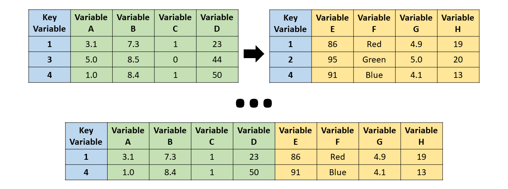

```{r setup, include=FALSE}
knitr::opts_chunk$set(echo = TRUE)
```


> “Between 30% to 80% of the data analysis task is spent on cleaning and understanding the data.” (Dasu \& Johnson, 2003)

Para esta seção, usaremos a base de dados `starwars` do pacote de manipulação de dados `dplyr`:

```{r message=FALSE, warning=FALSE}
library(dplyr)

# Vamos chamar a base de dados starwars de sw
sw = starwars

# vamos retirar as últimas 3 colunas para facilitar a manipulação.
# São colunas da classe list
sw[,c("films", "vehicles", "starships")] = NULL
```


</br>

## Pacote `base`
- Nesta seção, vamos manipular bases de dados usando as funções pré-carregadas no R (pacote `base`)


### Resumo dos dados

#### Funções básicas
- [Summarizing data (John Hopkins/Coursera)](https://www.coursera.org/learn/data-cleaning/lecture/e5qVi/summarizing-data)
- Verificaremos:
  - as **dimensões** da base via `dim()`
  - as 6 **primeiras** linhas da base via `head()`
  - as 6 **últimas** linhas da base via `tail()`
```{r}
dim(sw) # Verificar tamanho da base (linhas x colunas)
head(sw) # Visualizando as 6 primeiras linhas
tail(sw) # Visualizando as 6 últimas linhas
```
- Usando `str()`, podemos visualizar a **estrutura** (_structure_) da base:
    - todas a variáveis (colunas),
    - a classe de cada uma delas e
    - algumas de suas observações.
```{r}
str(sw)
```


- Para fazer um **resumo** de todas as variáveis da base, podemos usar a função `summary()` que, para variáveis numéricas, calcula a média e os quartis, e mostra a quantidade de `NA`.
```{r}
summary(sw)
```

- Note que, para variáveis lógicas, de texto (character) ou categóricas (factor), aparecem poucas informações.
- Logo, pode ser interessante fazer uma **tabela com a contagem** de com as categorias de uma variável. Isto é possível por meio da função `table()` e aplicaremos `prop.table(table())` para visualizar em **percentuais**.
```{r}
table(sw$hair_color) # contagem
prop.table(table(sw$hair_color)) # percentual
```
- Também podemos fazer uma "contagem cruzada" incluindo mais uma variável em `table()`:
```{r}
table(sw$hair_color, sw$gender)
```


#### Família de funções _apply_
Veremos uma família de funções _apply_ que permitem executar comandos em loop de maneira compacta:
- `apply`: aplica uma função sobre as margens (linha ou coluna) de uma matrix/array
- `lapply`: loop sobre uma lista e avalia uma função em cada elemento
    - função auxiliar `split` é útil ao ser utilizada em conjunto da `lapply`
- `sapply`: mesmo que o `lapply`, mas simplifica o resultado


##### Função `apply()`
- [Loop functions - apply (John Hopkins/Coursera)](https://www.coursera.org/learn/r-programming/lecture/IUUhK/loop-functions-apply)
- Usado para avaliar, por meio de uma função, margens de uma matriz/array
- Frequentemente é utilizado para aplicar uma função a linhas ou a colunas de uma matriz
- Não é mais rápido do que escrever um loop, mas funciona em uma única linha
```yaml
apply(X, MARGIN, FUN, ...)

- X: an array, including a matrix.MARGIN: a vector giving the subscripts which the function will be applied over. E.g., for a matrix 1 indicates rows, 2 indicates columns, c(1, 2) indicates rows and columns.
- FUN: the function to be applied
```
```{r}
x = matrix(1:20, 5, 4)
x

apply(x, 1, mean) # médias das linhas
apply(x, 2, mean) # médias das colunas
```
- Há funções pré-definidas que aplicam `apply` com soma e com média:
    - `rowSums = apply(x, 1, sum)`
    - `rowMeans = apply(x, 1, mean)`
    - `colSums = apply(x, 2, sum)`
    - `colMeans = apply(x, 2, mean)`


##### Função `lapply()`
- [Loop functions - lapply (John Hopkins/Coursera)](https://www.coursera.org/learn/r-programming/lecture/t5iuo/loop-functions-lapply)
- `lapply` usa três argumentos: uma **lista**, o nome de uma função e outros argumentos (incluindo os argumentos da função inserida)
```yaml
lapply(X, FUN, ...)

- X: a vector (atomic or list) or an expression object.
- FUN: the function to be applied to each element of X.
```


<!-- ```{r} -->
<!-- # Criando uma lista com vetor de dimensões distintas -->
<!-- x = list(a=1:5, b=45:38, c=c(1, 4, 65, 6, 78)) -->
<!-- x -->

<!-- lapply(x, mean) # retorna médias de cada vetor dentro da lista -->
<!-- lapply(x, summary) # retorna 6 estatísticas de cada vetor dentro da lista -->

<!-- class(lapply(x, mean)) # classe do objeto retornado pelo lapply -->
<!-- ``` -->

- A função `lapply()` aplica uma função em cada um de seus elementos.
- Um tipo especial de lista é o data frame, cujos elementos são suas colunas (variáveis).

```{r warning=FALSE}
lapply(sw, mean, na.rm=TRUE) # valores únicos
``` 

- Note que as variáveis não numérica retornaram `NA` e o 3º argumento é um arguemento da própria função `mean()`


- Podemos verificar quais são os valores únicos de cada variável (um item da lista) usando `unique()`
```{r}
lapply(sw, unique) # valores únicos
``` 

- Um uso interessante é para a verificação do **número de NA's de um data frame**. No entanto, ao transformar uma variável com `is.na()`, ela se torna uma matriz e, portanto, é necessário usar função `apply()`:
```{r}
head( is.na(sw) ) # 6 primeiras linhas aplicando is.na()
class( is.na(sw) ) # tipo de objeto
apply(is.na(sw), 2, sum) # somando cada coluna de TRUE/FALSE
```


##### Função `sapply()`
Similar ao `lapply`, mas `sapply` tenta simplificar o output:

- Se o resultado for uma lista em seus elementos têm o mesmo comprimento, retorna um vetor (ou matriz)
```{r warning=FALSE}
sapply(sw, mean, na.rm=TRUE) # retorna um vetor
```


### Filtro de linhas
- [Subsetting and sorting (John Hopkins/Coursera)](https://www.coursera.org/learn/data-cleaning/lecture/aqd2Y/subsetting-and-sorting)

```{r}
# vetor lógico de cabelo loiro
sw$hair_color == "blond"

# Extraindo linhas com cabelo loiro
sw[sw$hair_color == "blond", ]
```

- Podemos usar expressões lógicas (vetor com `TRUE` e `FALSE`) para extrair/filtrar uma parte do data frame. Por exemplo, queremos filtrar "Droid" **E** (`&`) que não seja `NA`:
```{r}
sw[sw$hair_color == "blond" & !is.na(sw$hair_color), ]
```

- Para não ter que ficar escrevendo `sw` antes de cada variáveis, podemos usar função `with()`
```{r}
with(sw,
     sw[hair_color == "blond" & !is.na(hair_color),]
     )
```

- Poderíamos também obter cabelo loiro **OU** (`|`) branco:
```{r}
# Extraindo linhas em que cabelo é loiro ou branco
sw[sw$hair_color == "blond" | sw$hair_color == "white", ]
```
- Também podemos verificar se determinados valores estão contidos em um vetor específico (equivale a `==` com mais de um valor)
```{r}
sw$hair_color %in% c("blond", "white") # T/F cabelo loiro ou branco
sw = sw[sw$hair_color %in% c("blond", "white"), ]
head(sw)
```


### Ordenação de linhas
- [Subsetting and sorting (John Hopkins/Coursera)](https://www.coursera.org/learn/data-cleaning/lecture/aqd2Y/subsetting-and-sorting)

- Podemos usar a função `sort()` para ordenar um vetor de maneira crescente (padrão) ou decrescente:
```{r}
sort(sw$height) # ordenando de maneira crescente
sort(sw$height, decreasing=TRUE) # ordenando de maneira decrescente
```

- Note que não podemos usar a função `sort()` para ordenar um data frame, pois a função retorna um vetor com os valores da base de dados.
- Para **ordenar data frames**, precisamos utilizar a função `order()` que, retorna os índices dos menores valores aos maiores (ou decrescente com `decreasing = TRUE`):
```{r}
order(sw$height) # índices na forma crescente de altura
sw = sw[order(sw$height), ] # reordenando data frame
head(sw)
```


### Seleção de colunas
- Podemos selecionar colunas usando `[,]` e incluindo um vetor de nomes/índices das colunas que quer manter (ou retirar usando `!`)
```{r}
# Selecionando 3 primeiras colunas
head( sw[,c("name","height", "mass")] )

# Selecionando 6 primeiras colunas
sw = sw[,1:6]
head(sw)
```


### Renomeação de colunas
- Podemos alterar os nomes das variáveis usando `names()` ou `colnames()` e atribuindo um vetor de nomes

```{r}
names(sw) # nomes da base de dados

# Retirando os underlines
names(sw)[4] = "haircolor" # alterando um único
names(sw)[5:6] = c("skincolor", "eyecolor") # alterando 2 nomes
names(sw) # vetor de nomes com alteração
```


### Modificação de colunas

- Para modificar variáveis, podemos usar `$<novo_nome_var>` e atribuir um vetor de mesmo tamanho (mesma quantidade de linhas):
```{r}
sw$height = sw$height / 100 # de cm para metro
```

- Se incluir um escalar, vai repetir o valor para todas as linhas
```{r}
sw$const = 1
```

- Também é possível criar uma nova variável:
```{r}
sw$BMI = sw$mass / sw$height^2 # índice de massa corpórea
head(sw)
```


- [Algumas transformações comuns de variáveis (John Hopkins/Coursera)](https://www.coursera.org/learn/data-cleaning/lecture/r6VHJ/creating-new-variables)
```{r}
abs(sw$BMI[1:4]) # valor absoluto
sqrt(sw$BMI[1:4]) # raiz quadrada
ceiling(sw$BMI[1:4]) # valor inteiro acima
floor(sw$BMI[1:4]) # valor inteiro abaixo
round(sw$BMI[1:4], digits=1) # arred com 1 dígito
cos(sw$BMI[1:4]) # cosseno
sin(sw$BMI[1:4]) # seno
log(sw$BMI[1:4]) # logaritmo natural
log10(sw$BMI[1:4]) # logaritmo base 10
exp(sw$BMI[1:4]) # exponencial
```


### Junção de bases

- [Merging data (John Hopkins/Coursera)](https://www.coursera.org/learn/data-cleaning/lecture/pVV6K/merging-data)
- [Joining (Merging) Data (David E. Caughlin)](https://rforhr.com/join.html)

- Uma junção é o processo de correspondência de casos (ou seja, linhas ou observações) entre dois bases de dados usando uma oou mais variáveis-chave:

<center></center>

- Para isto, vamos usar a função `merge()`:

```yaml
merge(x, y, by = intersect(names(x), names(y)),
      by.x = by, by.y = by, all = FALSE, all.x = all, all.y = all,
      suffixes = c(".x",".y"), ...)

- x, y: data frames, or objects to be coerced to one.
- by, by.x, by.y: specifications of the columns used for merging.
- all: logical; all = L is shorthand for all.x = L and all.y = L, where L is either TRUE or FALSE.
- all.x: logical; if TRUE, then extra rows will be added to the output, one for each row in x that has no matching row in y. These rows will have NAs in those columns that are usually filled with values from y.
- all.y: logical; analogous to all.x.
- sort: logical. Should the result be sorted on the by columns?
- suffixes: a character vector of length 2 specifying the suffixes to be used for making unique the names of columns.
```

- Vamos criar duas bases de dados, sendo que existem indivíduos presentes em uma base que não está na outra:

```{r}
# Extraindo data frames menores de 'starwars' (original)
bd1 = starwars[1:6, c(1, 3, 11)]
bd1
bd2 = starwars[c(2, 4, 7:10), c(1:2, 6)]
bd2
```

- Note que há 12 personagens únicos em ambas bases, mas apenas “C-3PO” e “Darth Vader” são observações comuns.
- Para verificar as colunas com mesmos nomes em duas bases, podemos usar a função `intersect()` em conjunto com a função `names()` ou `colnames()`:
```{r}
intersect( names(bd1), names(bd2) )
```
- Caso não especifiquemos nenhuma variável-chave, a função `merge()` utiliza como variável-chave todas as colunas com nomes iguais.

##### Inner-join

<center></center>
```{r}
merge(bd1, bd2, all = FALSE)
```


##### Full-join

<center></center>
```{r}
merge(bd1, bd2, all = TRUE)
```


##### Left-join

<center></center>
```{r}
merge(bd1, bd2, all.x = TRUE)
```


##### Right-join

<center></center>
```{r}
merge(bd1, bd2, all.y = TRUE)
```

</br>


## Pacote `dplyr`
- [Vignette - Introduction to _dplyr_](https://cran.r-project.org/web/packages/dplyr/vignettes/dplyr.html)
- O pacote `dplyr` facilita a manipulação dos dados por meio de funções simples e computacionalmente eficientes
- As funções pode, ser organizadas em três categorias:
    - Colunas:
        - `select()`: seleciona (ou retira) as colunas do data frame
        - `rename()`: muda os nomes das colunas
        - `mutate()`: cria ou muda os valores nas colunas
    - Linhas:
        - `filter()`: seleciona linhas de acordo com valores das colunas
        - `arrange()`: organiza a ordem das linhas
    - Grupo de linhas:
        - `summarise()`: colapsa um grupo em uma única linha
        - `group_by()`: agrupa base de dados a partir de uma variável categórica
- Nesta subseção, continuaremos utilizando a base de dados de Star Wars (`starwars`), utilizada na subseção anterior.
- Você irá notar que, ao usar essas funções, o data frame é transformado em um _tibble_ que é um formato mais eficiente para tratar dados tabulares, mas que funciona de forma igual a um data frame.

```{r}
sw = starwars # "limpando" sw com a base original
```


### Filtro via `filter()`
- Permite selecionar um subconjunto de linhas de um data frame
```yaml
filter(.data, ...)

- .data: A data frame, data frame extension (e.g. a tibble).
- ...	: Expressions that return a logical value, and are defined in terms of the variables in .data. If multiple expressions are included, they are combined with the & operator. Only rows for which all conditions evaluate to TRUE are kept.
```

```{r}
sw1 = filter(sw, species == "Human", height >= 100)
sw1 # já filtra os NA's
```


### Ordenação via `arrange()`
- Reordena as linhas a partir de um conjunto de nomes de coluna
```yaml
arrange(.data, ..., .by_group = FALSE)

- .data: A data frame, data frame extension (e.g. a tibble).
- ... : Variables, or functions of variables. Use desc() to sort a variable in descending order.
```
- Se for inserido mais de um nome de variável, organiza de acordo com a 1ª variável e, em caso de ter linhas com o mesmo valor na 1ª variável, ordena estas linhas de mesmo valor de acordo com a 2ª variável
- Para usar a ordem decrescente, temos a função `desc()`
```{r}
sw2 = arrange(sw1, height, desc(mass))
sw2
```


### Seleção via `select()`
- Seleciona colunas que são de interesse.
```yaml
select(.data, ...)

- ... : variables in a data frame
  - : for selecting a range of consecutive variables.
  - ! for taking the complement of a set of variables.
  - c() for combining selections.
```
- Coloca-se os nomes das colunas desejadas para selecioná-las.
- Também é possível selecionar um intervalo de variáveis usando `var1:var2`
- Caso queira tirar apenas algumas colunas, basta informar o nome delas precedidas pelo sinal de subtração (`-var`)
```{r}
sw3 = select(sw2, name:eye_color, sex:species)
sw3
```
- Note que o `select()` pode não funcionar corretamente se o pacote `MASS` estiver ativo. Caso esteja, retire a seleção do pacote `MASS` no quadrante inferior/direito em 'Packages' (ou digite `detach("package:MASS", unload = TRUE)`)
- Uma outra forma de fazer a seleção de coluna é combinando com `starts_with()` e `ends_with()`, que resulta na seleção de colunas que se iniciam e terminam com um texto dado
```{r}
head( select(sw, ends_with("color")) ) # colunas que terminam com color
head( select(sw, starts_with("s")) ) # colunas que iniciam com a letra "s"
```


### Renomeação via `rename()`
- Renomeia colunas usando `novo_nome = velho_nome`
```yaml
rename(.data, ...)

- .data: A data frame, data frame extension (e.g. a tibble).
- ...	: Use new_name = old_name to rename selected variables.
```

```{r}
sw4 = rename(sw3,
             haircolor = hair_color,
             skincolor = skin_color, 
             eyecolor = eye_color)
sw4
```


### Modificação via `mutate()`
- Modifica uma coluna se ela já existir
- Cria uma coluna se ela não existir
```yaml
mutate(.data, ...)

- .data: A data frame, data frame extension (e.g. a tibble).
- ...	: Name-value pairs. The name gives the name of the column in the output.
 - A vector of length 1, which will be recycled to the correct length.
 - A vector the same length as the current group (or the whole data frame if ungrouped).
 - NULL, to remove the column.
```
```{r}
sw5 = mutate(sw4,
             height = height/100, # transf cm p/ metro
             BMI = mass / height^2,
             dummy = 1 # se não for vetor, tudo fica igual
             )
sw5 = select(sw5, BMI, dummy, everything()) # reordenação colunas
sw5
```


### Operador Pipe `%>%`
- Note que todas as funções do pacote `dyplr` anteriores têm como 1º argumento a base de dados (`.data`), e isto não é por acaso.
- O operador pipe `%>%` joga um data frame (escrito à sua esquerda) no 1º argumento da função seguinte (à sua direita).
```{r}
filter(sw, species=="Droid") # sem operador pipe
sw %>% filter(species=="Droid") # com operador pipe
```
- Observe que, ao usar o operador pipe, o 1º argumento com a base de dados não deve ser preenchida (já está sendo aplicada automaticamente via `%>%`).
- Note que, desde a subseção com a função `filter()` até `mutate()` fomos "acumulando" as alterações em novos data frames, ou seja, o último data frame `starwars5` é a base original `starwars` que foi alterada por `filter()`, `arrange()`, `select()`, `rename()` e `mutate()`.
```{r}
sw1 = filter(sw, species == "Human", height >= 100)
sw2 = arrange(sw1, height, desc(mass))
sw3 = select(sw2, name:eye_color, sex:species)
sw4 = rename(sw3,
             haircolor = hair_color,
             skincolor = skin_color, 
             eyecolor = eye_color)
sw5 = mutate(sw4,
             height = height/100,
             BMI = mass / height^2,
             dummy = 1
             )
sw5 = select(sw5, BMI, dummy, everything())
sw5
```
- Usando o operador pipe `%>%` várias vezes, podemos ir pegando o output resultante da aplicação de uma função e jogar como input da função seguinte. Reescreveremos o código acima "em única linha" com `%>%`, chegando ao mesmo data frame de `starwars5`
```{r}
sw_pipe = sw %>% 
    filter(species == "Human", height >= 100) %>%
    arrange(height, desc(mass)) %>%
    select(name:eye_color, sex:species) %>%
    rename(haircolor = hair_color,
           skincolor = skin_color, 
           eyecolor = eye_color) %>%
    mutate(height = height/100,
           BMI = mass / height^2,
           dummy = 1
           ) %>%
    select(BMI, dummy, everything())
sw_pipe

all(sw_pipe == sw5, na.rm=TRUE) # verificando se todos elementos são iguais
```


### Resumo via `summarise()`

- Podemos usar a função `summarise()` para gerar alguma estatística acerca de uma ou mais variáveis:
```{r}
starwars %>% summarise(
    n_obs = n(),
    height_mean = mean(height, na.rm=TRUE),
    mass_mean = mean(mass, na.rm=TRUE)
    )
```
- No caso acima, gerou simplesmente o tamanho da amostra e as médias de altura e de massa considerando a amostra inteira de `starwars` (o que não foi muito útil).


#### Agrupamento via `group_by()`
- Diferente das outras funções do `dplyr` mostradas até agora, o output do `group_by` não altera conteúdo do data frame, apenas **transforma em uma base de dados agrupada** em categorias de uma dada variável
```{r}
grouped_sw = starwars %>% group_by(sex)
class(grouped_sw)

head(starwars)
head(grouped_sw) # agrupado por sexo
```
- O `group_by()` prepara o data frame para operações que consideram várias linhas. Como exemplo, vamos criar uma coluna com a soma de `mass` de todas observações
```{r}
starwars %>%
    mutate(mass_mean = mean(mass, na.rm=TRUE)) %>% 
    select(mass_mean, sex, everything()) %>%
    head(10)
```
- Note que todos os valores de `mass_mean` são iguais. Agora, agruparemos por `sex` antes de fazer a soma:
```{r}
starwars %>%
    group_by(sex) %>%
    mutate(mass_mean = mean(mass, na.rm=TRUE)) %>% 
    ungroup() %>% # Lembre-se sempre de desagrupar depois!
    select(mass_mean, sex, everything()) %>%
    head(10)
```
- Note que, agora, a coluna `mass_mean` tem valores diferentes de acordo com o sexo da observação.
- Isso é útil em algumas aplicações econômicas em que consideramos variáveis a nível de grupo (e.g. domicílio) a qual uma observação (e.g. morador) pertence.

> **Evite potenciais erros**: Sempre que usar `group_by()`, não se esqueça de desagrupar o data frame via função `ungroup()` após realizar a operações desejadas.

#### Resumo por grupo via `group_by()` e `summarise()`
- A função `summarise()` é de fato útil quando combinada com a função `group_by()`, pois conseguimos obter as estatísticas de grupos:
```{r}
summary_sw = starwars %>% group_by(sex) %>%
    summarise(
        n_obs = n(),
        height_mean = mean(height, na.rm = TRUE),
        mass_mean = mean(mass, na.rm = TRUE)
    )
summary_sw
class(summary_sw) # ao usar summary, deixa de ser agrupada
```
- Note que, ao usar `summarise()`, o data frame resultante não é agrupado e, portanto, não é necessário usar `ungroup()` neste caso.
- Também é possível adicionar mais de uma variável para agrupar:
```{r}
starwars %>% group_by(sex, hair_color) %>%
    summarise(
        n_obs = n(),
        height_mean = mean(height, na.rm = TRUE),
        mass_mean = mean(mass, na.rm = TRUE)
    )
```
- Para agrupar variáveis **contínuas**, precisamos definir intervalos usando a função `cut()`
```yaml
cut(x, ...)

x: a numeric vector which is to be converted to a factor by cutting.

breaks: either a numeric vector of two or more unique cut points or a single number (greater than or equal to 2) giving the number of intervals into which x is to be cut.
```
```{r}
# breaks com um integer = qtd desejada de grupos
starwars %>% group_by(cut(birth_year, breaks=5)) %>%
    summarise(
        n_obs = n(),
        height_mean = mean(height, na.rm = TRUE)
    )

# breaks com um vetor = quebras dos intervalos dos grupos
starwars %>% group_by(birth_year=cut(birth_year, 
                          breaks=c(0, 40, 90, 200, 900))) %>%
    summarise(
        n_obs = n(),
        height_mean = mean(height, na.rm = TRUE)
    )
```
- Note que inserimos `birth_year=cut(birth_year, ...)` para que o nome da coluna ficasse `birth_year`, caso contrário a coluna ficaria com o nome `cut(birth_year, ...)`.


### Junção via _\*\_join()_
- Vimos anteriormente que, para agrupar bases de dados a partir de variáveis-chave, podemos usar a função `merge()`.
- O pacote `dplyr` fornece uma família de funções _join_ que executam o mesmo comando que `merge()`, porém, ao invés de alterar o valor de um argumento, você precisa escolher uma das funções _join_ que podem ser resumidas na seguinte figura:

<center></center>

- Todas as funções possuem a mesma sintaxe:
    - `x`: base 1
    - `y`: base 2
    - `by`: vetor de variáveis-chave
    - `suffix`: vetor de 2 sufixos para incluir em colunas de mesmos nomes
- Como exemplo, usaremos subconjuntos da base de dados `starwars`:
```{r}
bd1 = starwars[1:6, c(1, 3, 11)]
bd1
bd2 = starwars[c(2, 4, 7:10), c(1:2, 6)]
bd2
```
- Note que há 12 personagens únicos em ambas bases, mas apenas "C-3PO" e "Darth Vader" são observações comuns.
- `inner_join()`: mantém apenas ID's presentes simultaneamente em ambas bases
```{r}
inner_join(bd1, bd2, by="name")
```

- `full_join()`: mantém todas ID's, mesmo que estejam em apenas em um das bases
```{r}
full_join(bd1, bd2, by="name")
```
- `left_join()`: mantém apenas ID's presentes na base 1 (informada como `x`)
```{r}
left_join(bd1, bd2, by="name")
```
- `right_join()`: mantém apenas ID's presentes na base 2 (informada como `y`)
```{r}
right_join(bd1, bd2, by="name")
```


</br>


