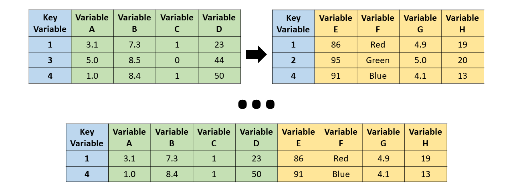
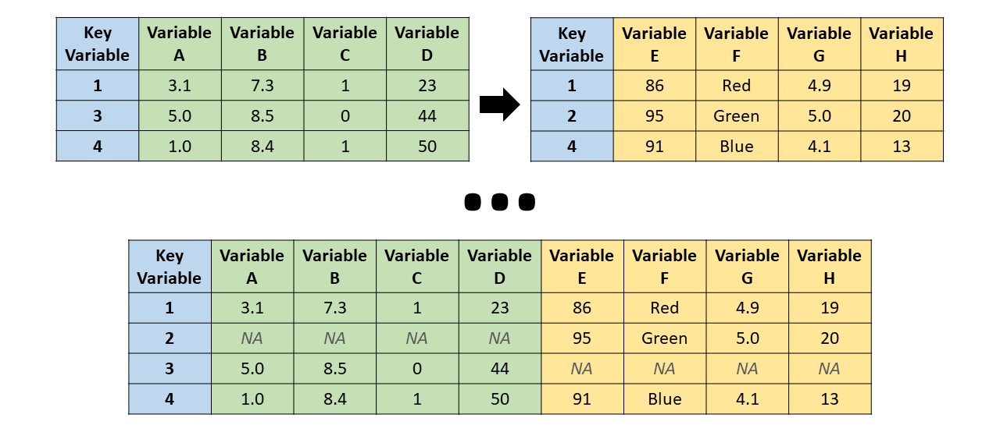
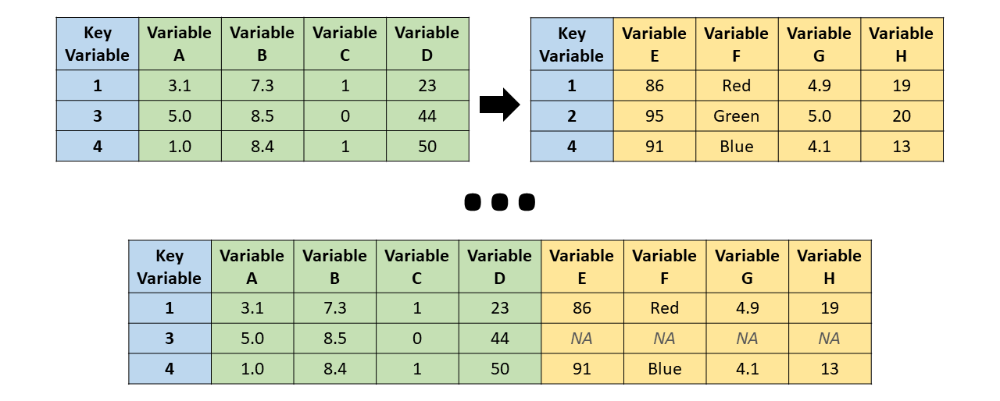
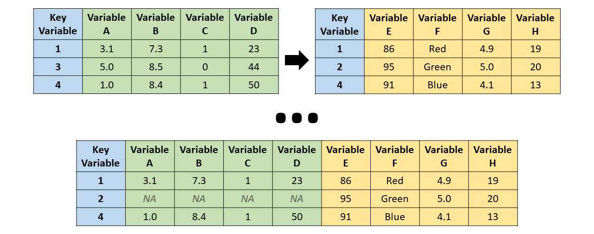

---
date: "2018-09-09T00:00:00Z"
# icon: book
# icon_pack: fas
linktitle: "Manipulation"
summary: "Data manipulation notes in R using base R and dplyr, with examples on summaries, apply functions, filtering, sorting, joins, and grouped calculations."
title: "Data Manipulation in R"
weight: 3
output: md_document
type: book
---

> "Between 30% to 80% of the data analysis task is spent on cleaning and understanding the data." (Dasu & Johnson, 2003)

In this section, we use the `starwars` dataset from the `dplyr` package to review the main tools for data manipulation in R.

```r
library(dplyr)

# We will refer to the starwars dataset as sw
sw = starwars

# Drop the last three columns to simplify the examples.
# These columns are lists.
sw[, c("films", "vehicles", "starships")] = NULL
```

</br>

## The `base` package
- In this section, we manipulate datasets using the functions that are loaded by default in R.

### Summarizing data

#### Basic functions
- [Summarizing data (John Hopkins/Coursera)](https://www.coursera.org/learn/data-cleaning/lecture/e5qVi/summarizing-data)
- We will inspect:
  - the dataset **dimensions** with `dim()`
  - the first six rows with `head()`
  - the last six rows with `tail()`

```r
dim(sw) # dataset size (rows x columns)

head(sw) # first six rows

tail(sw) # last six rows
```

- With `str()`, we can inspect the **structure** of the dataset:
  - all variables (columns)
  - the class of each variable
  - a sample of the observations

```r
str(sw)
```

- To generate a **summary** for all variables, we can use `summary()`. For numeric variables, the function reports quantiles, the mean, and the number of missing values.

```r
summary(sw)
```

- For logical, text, or categorical variables, `summary()` is usually less informative. In those cases, it is often useful to build a **frequency table** with `table()` and then turn it into **percentages** with `prop.table(table())`.

```r
table(sw$hair_color) # counts

prop.table(table(sw$hair_color)) # percentages
```

- We can also build a cross-tabulation by including more than one variable inside `table()`:

```r
table(sw$hair_color, sw$gender)
```

#### The `apply` family
The `apply` family provides compact ways to repeat operations:
- `apply()`: applies a function to the rows or columns of a matrix or array
- `lapply()`: applies a function to each element of a list
- `sapply()`: similar to `lapply()`, but tries to simplify the output

##### The `apply()` function
- [Loop functions - apply (John Hopkins/Coursera)](https://www.coursera.org/learn/r-programming/lecture/IUUhK/loop-functions-apply)
- `apply()` is commonly used to evaluate a function over the rows or columns of a matrix.
- It is not necessarily faster than writing an explicit loop, but it is concise and readable.

```yaml
apply(X, MARGIN, FUN, ...)

X: an array, including a matrix.
MARGIN: a vector giving the dimensions over which the function will be applied.
FUN: the function to be applied.
...: optional arguments passed to FUN.
```

```r
x = matrix(1:20, 5, 4)
x

apply(x, 1, mean) # row means

apply(x, 2, mean) # column means
```

- There are built-in functions that reproduce these operations directly:
  - `rowSums = apply(x, 1, sum)`
  - `rowMeans = apply(x, 1, mean)`
  - `colSums = apply(x, 2, sum)`
  - `colMeans = apply(x, 2, mean)`

##### The `lapply()` function
- [Loop functions - lapply (John Hopkins/Coursera)](https://www.coursera.org/learn/r-programming/lecture/t5iuo/loop-functions-lapply)
- `lapply()` takes three main inputs: a **list**, a function, and optional additional arguments.

```yaml
lapply(X, FUN, ...)

X: a vector (atomic or list) or an expression object.
FUN: the function to be applied to each element of X.
...: optional arguments passed to FUN.
```

- `lapply()` applies a function to each element of the list.
- A data frame is a special kind of list whose elements are its columns.

```r
lapply(sw, mean, na.rm = TRUE)
```

- Notice that non-numeric variables return `NA`, and the third argument above is an argument of `mean()`.

- We can also inspect the unique values of each variable by combining `lapply()` with `unique()`:

```r
lapply(sw, unique)
```

- A particularly useful application is counting the number of missing values in each column. Because `is.na(sw)` returns a matrix, we can combine it with `apply()`:

```r
head(is.na(sw)) # first rows after applying is.na()

class(is.na(sw)) # object type

apply(is.na(sw), 2, sum) # sum TRUE/FALSE by column
```

##### The `sapply()` function
- `sapply()` is similar to `lapply()`, but it tries to simplify the result whenever possible.
- If each list element returns an object of the same length, `sapply()` often returns a vector or matrix instead of a list.

```r
sapply(sw, mean, na.rm = TRUE)
```

### Filtering rows
- [Subsetting and sorting (John Hopkins/Coursera)](https://www.coursera.org/learn/data-cleaning/lecture/aqd2Y/subsetting-and-sorting)

```r
# logical vector for blond hair
sw$hair_color == "blond"

# extract rows with blond hair
sw[sw$hair_color == "blond", ]
```

- We can use logical expressions to filter observations. For example, suppose we want characters with blond hair and non-missing `hair_color`:

```r
sw[sw$hair_color == "blond" & !is.na(sw$hair_color), ]
```

- To avoid repeating the dataset name before each variable, we can use `with()`:

```r
with(sw,
     sw[hair_color == "blond" & !is.na(hair_color), ]
)
```

- We could also extract observations with blond **or** white hair:

```r
# extract rows where hair is blond or white
sw[sw$hair_color == "blond" | sw$hair_color == "white", ]
```

- We can also check whether values belong to a given vector with `%in%`, which is equivalent to applying `==` to several values at once:

```r
sw$hair_color %in% c("blond", "white") # TRUE/FALSE for blond or white hair

sw = sw[sw$hair_color %in% c("blond", "white"), ]
head(sw)
```

### Reordering rows
- [Subsetting and sorting (John Hopkins/Coursera)](https://www.coursera.org/learn/data-cleaning/lecture/aqd2Y/subsetting-and-sorting)
- We can use `sort()` to order a vector in ascending order (default) or descending order.

```r
sort(sw$height) # ascending order

sort(sw$height, decreasing = TRUE) # descending order
```

- `sort()` is not appropriate for reordering a full data frame, because it returns only a vector.
- To **reorder data frames**, we use `order()`, which returns the row indices from the smallest values to the largest.

```r
order(sw$height) # row indices in ascending order of height

sw = sw[order(sw$height), ] # reorder the data frame
head(sw)
```

### Selecting columns
- We can select columns with `[,]` by passing a vector of names or indices to keep.

```r
# Select the first three columns
head(sw[, c("name", "height", "mass")])

# Select the first six columns
sw = sw[, 1:6]
head(sw)
```

### Renaming columns
- We can rename variables with `names()` or `colnames()` by assigning a new vector of names.

```r
names(sw) # current variable names

# Remove underscores
names(sw)[4] = "haircolor" # change one name
names(sw)[5:6] = c("skincolor", "eyecolor") # change two names
names(sw)
```

### Modifying columns
- To modify a variable, we can assign a vector of the same length using `$`.

```r
sw$height = sw$height / 100 # convert cm to meters
```

- If we assign a scalar, R repeats it for all observations:

```r
sw$const = 1
```

- We can also create new variables:

```r
sw$BMI = sw$mass / sw$height^2 # body mass index
head(sw)
```

- [Common variable transformations (John Hopkins/Coursera)](https://www.coursera.org/learn/data-cleaning/lecture/r6VHJ/creating-new-variables)

```r
abs(sw$BMI[1:4]) # absolute value

sqrt(sw$BMI[1:4]) # square root

ceiling(sw$BMI[1:4]) # round up

floor(sw$BMI[1:4]) # round down

round(sw$BMI[1:4], digits = 1) # one decimal place

cos(sw$BMI[1:4]) # cosine

sin(sw$BMI[1:4]) # sine

log(sw$BMI[1:4]) # natural logarithm

log10(sw$BMI[1:4]) # base-10 logarithm

exp(sw$BMI[1:4]) # exponential
```

### Merging datasets
- [Merging data (John Hopkins/Coursera)](https://www.coursera.org/learn/data-cleaning/lecture/pVV6K/merging-data)
- [Joining (Merging) Data (David E. Caughlin)](https://rforhr.com/join.html)

- A merge matches cases, that is, rows or observations, across two datasets using one or more key variables:

<center></center>

- We use the `merge()` function for that purpose:

```yaml
merge(x, y, by = intersect(names(x), names(y)),
      by.x = by, by.y = by, all = FALSE, all.x = all, all.y = all,
      suffixes = c(".x", ".y"), ...)

x, y: data frames, or objects that can be coerced into data frames.
by, by.x, by.y: columns used for merging.
all: shorthand for setting both all.x and all.y.
all.x: keep all rows from x.
all.y: keep all rows from y.
suffixes: suffixes used when non-key variables share the same name.
```

- Let us create two datasets where some individuals appear in one dataset but not in the other:

```r
# Extract smaller data frames from the original starwars dataset
bd1 = starwars[1:6, c(1, 3, 11)]
bd1

bd2 = starwars[c(2, 4, 7:10), c(1:2, 6)]
bd2
```

- There are 12 unique characters across the two datasets, but only `"C-3PO"` and `"Darth Vader"` appear in both.
- To check which columns share the same name, we can combine `intersect()` with `names()` or `colnames()`:

```r
intersect(names(bd1), names(bd2))
```

- If we do not specify the key variable, `merge()` uses all columns with matching names.

##### Inner join

<center></center>

```r
merge(bd1, bd2, all = FALSE)
```

##### Full join

<center></center>

```r
merge(bd1, bd2, all = TRUE)
```

##### Left join

<center></center>

```r
merge(bd1, bd2, all.x = TRUE)
```

##### Right join

<center></center>

```r
merge(bd1, bd2, all.y = TRUE)
```

</br>

## The `dplyr` package
- [Vignette - Introduction to _dplyr_](https://cran.r-project.org/web/packages/dplyr/vignettes/dplyr.html)
- The `dplyr` package makes data manipulation easier through simple and computationally efficient functions.
- These functions can be grouped into three categories:
  - Columns:
    - `select()`: selects or drops data-frame columns
    - `rename()`: changes column names
    - `mutate()`: creates or modifies column values
  - Rows:
    - `filter()`: selects rows according to column values
    - `arrange()`: reorders the rows
  - Groups of rows:
    - `summarise()`: collapses each group into a single row
    - `group_by()`: creates grouped data
- In this subsection, we continue using the Star Wars dataset.
- You will notice that, when these functions are applied, the data frame is turned into a _tibble_, which is a more efficient format for tabular data but works very similarly to a standard data frame.

```r
library("dplyr") # load package

head(starwars) # inspect the first rows of the dataset included in the package
```

## Filter rows with `filter()`
- Selects a subset of rows from a data frame.

```yaml
filter(.data, ...)

.data: a data frame or tibble.
...: logical expressions defined in terms of the variables in .data.
```

```r
starwars1 = filter(starwars, species == "Human", height >= 100)
starwars1

# Equivalent to:
starwars[starwars$species == "Human" & starwars$height >= 100, ]
```

## Reorder rows with `arrange()`
- Reorders the rows according to one or more column names.

```yaml
arrange(.data, ..., .by_group = FALSE)

.data: a data frame or tibble.
...: variables, or functions of variables. Use desc() for descending order.
```

- If more than one variable is provided, the data are first ordered by the first variable and ties are broken using the second.

```r
starwars2 = arrange(starwars1, height, desc(mass))
starwars2
```

## Select columns with `select()`
- Selects the columns of interest.

```yaml
select(.data, ...)

...: variables in a data frame.
```

- We can list the variables we want to keep, select ranges with `var1:var2`, or drop variables with `-var`.

```r
starwars3 = select(starwars2, name:eye_color, sex:species)
# equivalent: select(starwars2, -birth_year, -c(films:starships))
starwars3

head(select(starwars, ends_with("color")))

head(select(starwars, starts_with("s")))
```

- Notice that `select()` may not work properly if the `MASS` package is attached. If that happens, detach `MASS` in the Packages pane or run `detach("package:MASS", unload = TRUE)`.

## Rename columns with `rename()`
- Renames columns using `new_name = old_name`.

```yaml
rename(.data, ...)

.data: a data frame or tibble.
...: use new_name = old_name to rename selected variables.
```

```r
starwars4 = rename(
  starwars3,
  haircolor = hair_color,
  skincolor = skin_color,
  eyecolor = eye_color
)
starwars4
```

## Modify/Add columns with `mutate()`
- Modifies an existing column.
- Creates a new column if it does not exist.

```yaml
mutate(.data, ...)

.data: a data frame or tibble.
...: name-value pairs defining the output columns.
```

```r
starwars5 = mutate(
  starwars4,
  height = height / 100, # convert cm to meters
  BMI = mass / height^2,
  dummy = 1 # a scalar is recycled to all rows
)
starwars5 = select(starwars5, BMI, dummy, everything())
starwars5
```

## The pipe operator `%>%`
- Notice that all previous `dplyr` functions take the dataset as their first argument.
- The pipe operator `%>%` passes the object on the left-hand side into the first argument of the function on the right-hand side.

```r
filter(starwars, species == "Droid") # without the pipe

starwars %>% filter(species == "Droid") # with the pipe
```

- When we use the pipe operator, the dataset should not be written again as the first argument because `%>%` passes it automatically.
- Also note that, from `filter()` through `mutate()`, we have been accumulating transformations in new data frames. The last object, `starwars5`, is the result of applying the full sequence of changes to the original `starwars` dataset.

```r
starwars1 = filter(starwars, species == "Human", height >= 100)
starwars2 = arrange(starwars1, height, desc(mass))
starwars3 = select(starwars2, name:eye_color, sex:species)
starwars4 = rename(
  starwars3,
  haircolor = hair_color,
  skincolor = skin_color,
  eyecolor = eye_color
)
starwars5 = mutate(
  starwars4,
  height = height / 100,
  BMI = mass / height^2,
  dummy = 1
)
starwars5 = select(starwars5, BMI, dummy, everything())
starwars5
```

- By chaining the same commands with `%>%`, we can write the full workflow as a single pipeline:

```r
starwars_pipe = starwars %>%
  filter(species == "Human", height >= 100) %>%
  arrange(height, desc(mass)) %>%
  select(name:eye_color, sex:species) %>%
  rename(
    haircolor = hair_color,
    skincolor = skin_color,
    eyecolor = eye_color
  ) %>%
  mutate(
    height = height / 100,
    BMI = mass / height^2,
    dummy = 1
  ) %>%
  select(BMI, dummy, everything())
starwars_pipe

all(starwars_pipe == starwars5, na.rm = TRUE)
```

## Summarize with `summarise()`
- We can use `summarise()` to compute statistics for one or more variables:

```r
starwars %>% summarise(
  n_obs = n(),
  mean_height = mean(height, na.rm = TRUE),
  mean_mass = mean(mass, na.rm = TRUE)
)
```

- In the example above, we simply computed the sample size and the mean height and mass for the full sample.

## Group data with `group_by()`
- Unlike the other `dplyr` functions shown so far, `group_by()` does not change the contents of the data frame. It only turns the data into a **grouped dataset** according to the categories of one or more variables.

```r
grouped_sw = starwars %>% group_by(sex)
class(grouped_sw)

head(starwars)

head(grouped_sw)
```

- `group_by()` is useful whenever the next operation depends on multiple rows. As an illustration, let us create a column with the mean value of `mass` across all observations:

```r
starwars %>%
  mutate(mean_mass = mean(mass, na.rm = TRUE)) %>%
  select(mean_mass, sex, everything()) %>%
  head(10)
```

- Notice that all values of `mean_mass` are identical. We now group by `sex` before computing the mean:

```r
starwars %>%
  group_by(sex) %>%
  mutate(mean_mass = mean(mass, na.rm = TRUE)) %>%
  ungroup() %>%
  select(mean_mass, sex, everything()) %>%
  head(10)
```

- This is useful in many economics applications in which we work with group-level variables, for example household-level statistics attached to individual observations.

> **Avoid mistakes**: whenever you use `group_by()`, remember to run `ungroup()` after the grouped operation if the next commands should not remain grouped.

## Grouped summaries with `group_by()` and `summarise()`
- `summarise()` becomes especially useful when combined with `group_by()`, because it lets us compute statistics at the group level:

```r
summary_sw = starwars %>%
  group_by(sex) %>%
  summarise(
    n_obs = n(),
    mean_height = mean(height, na.rm = TRUE),
    mean_mass = mean(mass, na.rm = TRUE)
  )
summary_sw

class(summary_sw)
```

- After `summarise()`, the resulting data frame is no longer grouped, so `ungroup()` is not needed in this case.
- We can also group by more than one variable:

```r
starwars %>%
  group_by(sex, hair_color) %>%
  summarise(
    n_obs = n(),
    mean_height = mean(height, na.rm = TRUE),
    mean_mass = mean(mass, na.rm = TRUE)
  )
```

- To group **continuous** variables, we first need to define intervals with `cut()`:

```yaml
cut(x, ...)

x: a numeric vector that will be turned into a factor by cutting it into intervals.
breaks: either a vector of cut points or a single integer giving the number of intervals.
```

```r
# breaks supplied as an integer = desired number of groups
starwars %>%
  group_by(cut(birth_year, breaks = 5)) %>%
  summarise(
    n_obs = n(),
    mean_height = mean(height, na.rm = TRUE)
  )

# breaks supplied as a vector = explicit cut points
starwars %>%
  group_by(birth_year = cut(birth_year, breaks = c(0, 40, 90, 200, 900))) %>%
  summarise(
    n_obs = n(),
    mean_height = mean(height, na.rm = TRUE)
  )
```

- Notice that we wrote `birth_year = cut(birth_year, ...)` so the grouped column keeps the name `birth_year`.

## Join datasets with `_join_` functions
- Earlier we saw that `merge()` combines datasets through key variables.
- The `dplyr` package provides a family of `_join_` functions that accomplish the same task with a cleaner interface:

<center></center>

- The common ingredients are:
  - `x`: dataset 1
  - `y`: dataset 2
  - `by`: vector of key variables
  - `suffix`: suffixes used when non-key variables share the same name

- As an example, we use subsets of the `starwars` dataset:

```r
bd1 = starwars[1:6, c(1, 3, 11)]
bd2 = starwars[c(2, 4, 7:10), c(1:2, 6)]
bd1
bd2
```

- There are 12 unique characters across the two datasets, but only `"C-3PO"` and `"Darth Vader"` appear in both.

- `inner_join()`: keeps only IDs present in both datasets

```r
inner_join(bd1, bd2, by = "name")
```

- `full_join()`: keeps all IDs, even if they appear in only one dataset

```r
full_join(bd1, bd2, by = "name")
```

- `left_join()`: keeps the IDs present in dataset 1, supplied as `x`

```r
left_join(bd1, bd2, by = "name")
```

- `right_join()`: keeps the IDs present in dataset 2, supplied as `y`

```r
right_join(bd1, bd2, by = "name")
```

</br>


