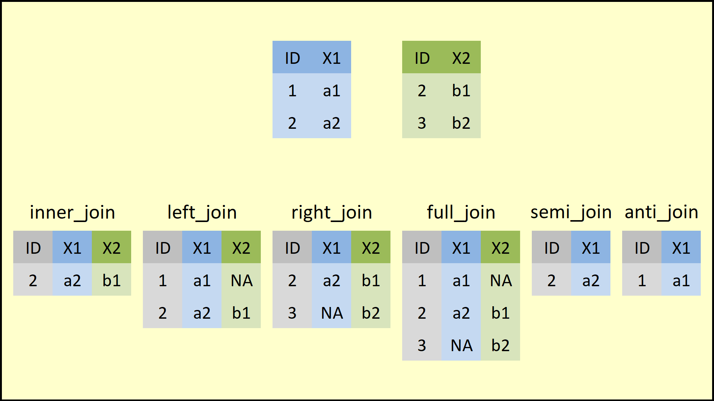

</br>

## Resumindo dados

### Funções básicas
- [Summarizing data (John Hopkins/Coursera)](https://www.coursera.org/learn/data-cleaning/lecture/e5qVi/summarizing-data)
- Para esta seção, usaremos a base de dados `airquality`, já presente no R.
- Verificaremos o **dimensões** da base com `dim()` e visualizaremos as 6 **primeiras** e **últimas** linhas da base via `head()` e `tail()`, respectivamente.

```r
# data() # lista de base de dados presentes no R

dim(airquality) # Verificar tamanho da base (linhas x colunas)
```

```
## [1] 153   6
```

```r
head(airquality) # Visualizando as 6 primeiras linhas
```

```
##   Ozone Solar.R Wind Temp Month Day
## 1    41     190  7.4   67     5   1
## 2    36     118  8.0   72     5   2
## 3    12     149 12.6   74     5   3
## 4    18     313 11.5   62     5   4
## 5    NA      NA 14.3   56     5   5
## 6    28      NA 14.9   66     5   6
```

```r
tail(airquality) # Visualizando as 6 últimas linhas
```

```
##     Ozone Solar.R Wind Temp Month Day
## 148    14      20 16.6   63     9  25
## 149    30     193  6.9   70     9  26
## 150    NA     145 13.2   77     9  27
## 151    14     191 14.3   75     9  28
## 152    18     131  8.0   76     9  29
## 153    20     223 11.5   68     9  30
```
- Usando `str()`, podemos visualizar a **estrutura** da base:
    - todas a variáveis (colunas),
    - a classe de cada uma delas e
    - algumas de suas observações.

```r
str(airquality)
```

```
## 'data.frame':	153 obs. of  6 variables:
##  $ Ozone  : int  41 36 12 18 NA 28 23 19 8 NA ...
##  $ Solar.R: int  190 118 149 313 NA NA 299 99 19 194 ...
##  $ Wind   : num  7.4 8 12.6 11.5 14.3 14.9 8.6 13.8 20.1 8.6 ...
##  $ Temp   : int  67 72 74 62 56 66 65 59 61 69 ...
##  $ Month  : int  5 5 5 5 5 5 5 5 5 5 ...
##  $ Day    : int  1 2 3 4 5 6 7 8 9 10 ...
```


- Para fazer um **resumo** de todas as variáveis da base, podemos usar a função `summary()` que, para variáveis numéricas, calcula a média e os quartis, e mostra a quantidade de `NA`.

```r
summary(airquality)
```

```
##      Ozone           Solar.R           Wind             Temp      
##  Min.   :  1.00   Min.   :  7.0   Min.   : 1.700   Min.   :56.00  
##  1st Qu.: 18.00   1st Qu.:115.8   1st Qu.: 7.400   1st Qu.:72.00  
##  Median : 31.50   Median :205.0   Median : 9.700   Median :79.00  
##  Mean   : 42.13   Mean   :185.9   Mean   : 9.958   Mean   :77.88  
##  3rd Qu.: 63.25   3rd Qu.:258.8   3rd Qu.:11.500   3rd Qu.:85.00  
##  Max.   :168.00   Max.   :334.0   Max.   :20.700   Max.   :97.00  
##  NA's   :37       NA's   :7                                       
##      Month            Day      
##  Min.   :5.000   Min.   : 1.0  
##  1st Qu.:6.000   1st Qu.: 8.0  
##  Median :7.000   Median :16.0  
##  Mean   :6.993   Mean   :15.8  
##  3rd Qu.:8.000   3rd Qu.:23.0  
##  Max.   :9.000   Max.   :31.0  
## 
```
- Também podemos calcular os **quantis** via `quantile()`

```r
quantile(airquality$Ozone, probs=c(0, .25, .5 , .75, 1), na.rm=TRUE)
```

```
##     0%    25%    50%    75%   100% 
##   1.00  18.00  31.50  63.25 168.00
```

- Note que, para variáveis lógicas, de texto ou categóricas (factor), aparecem a contagem de cada categoria/possível valor:

```r
summary(CO2) # base de dados 'Carbon Dioxide Uptake in Grass Plants'
```

```
##      Plant             Type         Treatment       conc          uptake     
##  Qn1    : 7   Quebec     :42   nonchilled:42   Min.   :  95   Min.   : 7.70  
##  Qn2    : 7   Mississippi:42   chilled   :42   1st Qu.: 175   1st Qu.:17.90  
##  Qn3    : 7                                    Median : 350   Median :28.30  
##  Qc1    : 7                                    Mean   : 435   Mean   :27.21  
##  Qc3    : 7                                    3rd Qu.: 675   3rd Qu.:37.12  
##  Qc2    : 7                                    Max.   :1000   Max.   :45.50  
##  (Other):42
```
- Para variáveis de texto, pode ser interessante fazer uma **tabela com a contagem** de cada possível categoria de uma variável. Isto é possível por meio da função `table()` e aplicaremos `prop.table(table())` para visualizar em **percentuais**.

```r
table(CO2$Type) # contagem
```

```
## 
##      Quebec Mississippi 
##          42          42
```

```r
prop.table(table(CO2$Type)) # percentual
```

```
## 
##      Quebec Mississippi 
##         0.5         0.5
```
- Também podemos incluir mais uma variável em `table()` para visualizar a contagem considerando 2 variáveis:

```r
table(CO2$Type, CO2$Treatment)
```

```
##              
##               nonchilled chilled
##   Quebec              21      21
##   Mississippi         21      21
```


### Família de funções _apply_
Veremos uma família de funções _apply_ que permitem executar comandos em loop de maneira compacta:
- `apply`: aplica uma função sobre as margens (linha ou coluna) de uma matrix/array
- `lapply`: loop sobre uma lista e avalia uma função em cada elemento
    - função auxiliar `split` é útil ao ser utilizada em conjunto da `lapply`
- `sapply`: mesmo que o `lapply`, mas simplifica o resultado


#### Função `apply()`
- [Loop functions - apply (John Hopkins/Coursera)](https://www.coursera.org/learn/r-programming/lecture/IUUhK/loop-functions-apply)
- Usado para avaliar, por meio de uma função, margens de um array
- Frequentemente é utilizado para aplicar uma função a linhas ou a colunas de uma matriz
- Não é mais rápido do que escrever um loop, mas funciona em uma única linha
```yaml
apply(X, MARGIN, FUN, ...)

X: an array, including a matrix.MARGIN: a vector giving the subscripts which the function will be applied over. E.g., for a matrix 1 indicates rows, 2 indicates columns, c(1, 2) indicates rows and columns. Where X has named dimnames, it can be a character vector selecting dimension names.
FUN: the function to be applied: see ‘Details’. In the case of functions like +, %*%, etc., the function name must be backquoted or quoted.
... : optional arguments to FUN.
```

```r
x = matrix(1:20, 5, 4)
x
```

```
##      [,1] [,2] [,3] [,4]
## [1,]    1    6   11   16
## [2,]    2    7   12   17
## [3,]    3    8   13   18
## [4,]    4    9   14   19
## [5,]    5   10   15   20
```

```r
apply(x, 1, mean) # médias das linhas
```

```
## [1]  8.5  9.5 10.5 11.5 12.5
```

```r
apply(x, 2, mean) # médias das colunas
```

```
## [1]  3  8 13 18
```
- Há funções pré-definidas que aplicam `apply` com soma e com média:
    - `rowSums = apply(x, 1, sum)`
    - `rowMeans = apply(x, 1, mean)`
    - `colSums = apply(x, 2, sum)`
    - `colMeans = apply(x, 2, mean)`
- Podemos, por exemplo, também calcular os quantis de uma matriz usando a função `quantile()`

```r
x = matrix(1:50, 10, 5) # matriz 20x10 - 200 números ~ N(0, 1)
x
```

```
##       [,1] [,2] [,3] [,4] [,5]
##  [1,]    1   11   21   31   41
##  [2,]    2   12   22   32   42
##  [3,]    3   13   23   33   43
##  [4,]    4   14   24   34   44
##  [5,]    5   15   25   35   45
##  [6,]    6   16   26   36   46
##  [7,]    7   17   27   37   47
##  [8,]    8   18   28   38   48
##  [9,]    9   19   29   39   49
## [10,]   10   20   30   40   50
```

```r
apply(x, 2, quantile) # obtendo os quantis de cada coluna
```

```
##       [,1]  [,2]  [,3]  [,4]  [,5]
## 0%    1.00 11.00 21.00 31.00 41.00
## 25%   3.25 13.25 23.25 33.25 43.25
## 50%   5.50 15.50 25.50 35.50 45.50
## 75%   7.75 17.75 27.75 37.75 47.75
## 100% 10.00 20.00 30.00 40.00 50.00
```
- Com também podemos verificar quais são os valores únicos de cada variável em um data frame combinando `apply()` e `unique()`

```r
apply(mtcars, 2, unique)
```

```
## $mpg
##  [1] 21.0 22.8 21.4 18.7 18.1 14.3 24.4 19.2 17.8 16.4 17.3 15.2 10.4 14.7 32.4
## [16] 30.4 33.9 21.5 15.5 13.3 27.3 26.0 15.8 19.7 15.0
## 
## $cyl
## [1] 6 4 8
## 
## $disp
##  [1] 160.0 108.0 258.0 360.0 225.0 146.7 140.8 167.6 275.8 472.0 460.0 440.0
## [13]  78.7  75.7  71.1 120.1 318.0 304.0 350.0 400.0  79.0 120.3  95.1 351.0
## [25] 145.0 301.0 121.0
## 
## $hp
##  [1] 110  93 175 105 245  62  95 123 180 205 215 230  66  52  65  97 150  91 113
## [20] 264 335 109
## 
## $drat
##  [1] 3.90 3.85 3.08 3.15 2.76 3.21 3.69 3.92 3.07 2.93 3.00 3.23 4.08 4.93 4.22
## [16] 3.70 3.73 4.43 3.77 3.62 3.54 4.11
## 
## $wt
##  [1] 2.620 2.875 2.320 3.215 3.440 3.460 3.570 3.190 3.150 4.070 3.730 3.780
## [13] 5.250 5.424 5.345 2.200 1.615 1.835 2.465 3.520 3.435 3.840 3.845 1.935
## [25] 2.140 1.513 3.170 2.770 2.780
## 
## $qsec
##  [1] 16.46 17.02 18.61 19.44 20.22 15.84 20.00 22.90 18.30 18.90 17.40 17.60
## [13] 18.00 17.98 17.82 17.42 19.47 18.52 19.90 20.01 16.87 17.30 15.41 17.05
## [25] 16.70 16.90 14.50 15.50 14.60 18.60
## 
## $vs
## [1] 0 1
## 
## $am
## [1] 1 0
## 
## $gear
## [1] 4 3 5
## 
## $carb
## [1] 4 1 2 3 6 8
```


- Podemos verificar o **número de NA's** em cada coluna usando `apply()` com `sum` (ou também `colSums()`) na base de dados com `is.na()` (transforma a base de dados em TRUE/FALSE se for ou não `NA`)

```r
head( is.na(airquality) ) # 6 primeiras linhas aplicando is.na()
```

```
##      Ozone Solar.R  Wind  Temp Month   Day
## [1,] FALSE   FALSE FALSE FALSE FALSE FALSE
## [2,] FALSE   FALSE FALSE FALSE FALSE FALSE
## [3,] FALSE   FALSE FALSE FALSE FALSE FALSE
## [4,] FALSE   FALSE FALSE FALSE FALSE FALSE
## [5,]  TRUE    TRUE FALSE FALSE FALSE FALSE
## [6,] FALSE    TRUE FALSE FALSE FALSE FALSE
```

```r
apply(is.na(airquality), 2, sum) # somando cada coluna de TRUE/FALSE
```

```
##   Ozone Solar.R    Wind    Temp   Month     Day 
##      37       7       0       0       0       0
```


#### Função `lapply()`
- [Loop functions - lapply (John Hopkins/Coursera)](https://www.coursera.org/learn/r-programming/lecture/t5iuo/loop-functions-lapply)
- `lapply` usa três argumentos: uma **lista**, o nome de uma função e outros argumentos (incluindo os da função inserida)
```yaml
lapply(X, FUN, ...)

X: a vector (atomic or list) or an expression object. Other objects (including classed objects) will be coerced by base::as.list.
FUN: the function to be applied to each element of X: see ‘Details’. In the case of functions like +, %*%, the function name must be backquoted or quoted.
... : optional arguments to FUN.
```

```r
# Criando uma lista com vetor de dimensões distintas
x = list(a=1:5, b=rnorm(10), c=c(1, 4, 65, 6))
x
```

```
## $a
## [1] 1 2 3 4 5
## 
## $b
##  [1]  0.44757714 -0.68045584 -0.12179980  0.98109903  0.58946783 -0.97974708
##  [7] -2.20900619  1.97535518 -0.44879781  0.02281245
## 
## $c
## [1]  1  4 65  6
```

```r
lapply(x, mean) # retorna médias de cada vetor dentro da lista
```

```
## $a
## [1] 3
## 
## $b
## [1] -0.04234951
## 
## $c
## [1] 19
```

```r
lapply(x, summary) # retorna 6 estatísticas de cada vetor dentro da lista
```

```
## $a
##    Min. 1st Qu.  Median    Mean 3rd Qu.    Max. 
##       1       2       3       3       4       5 
## 
## $b
##     Min.  1st Qu.   Median     Mean  3rd Qu.     Max. 
## -2.20901 -0.62254 -0.04949 -0.04235  0.55400  1.97536 
## 
## $c
##    Min. 1st Qu.  Median    Mean 3rd Qu.    Max. 
##    1.00    3.25    5.00   19.00   20.75   65.00
```

```r
class(lapply(x, mean)) # classe do objeto retornado pelo lapply
```

```
## [1] "list"
```


#### Função `sapply()`
Similar ao `lapply`, mas `sapply` tenta simplificar o output:

- Se o resultado for uma lista em que todo elemento tem comprimento 1 (tem apenas um elemento também), retorna um vetor

```r
sapply(x, mean) # retorna um vetor
```

```
##           a           b           c 
##  3.00000000 -0.04234951 19.00000000
```
- Se o resultado for uma lista em que cada elemento tem mesmo comprimento, retorna uma matriz

```r
sapply(x, summary) # retorna uma matriz
```

```
##         a           b     c
## Min.    1 -2.20900619  1.00
## 1st Qu. 2 -0.62254133  3.25
## Median  3 -0.04949367  5.00
## Mean    3 -0.04234951 19.00
## 3rd Qu. 4  0.55399516 20.75
## Max.    5  1.97535518 65.00
```


</br>

## Manipulando dados

> “Between 30% to 80% of the data analysis task is spent on cleaning and understanding the data.” (Dasu \& Johnson, 2003)

### Extração de subconjuntos
- [Subsetting and sorting (John Hopkins/Coursera)](https://www.coursera.org/learn/data-cleaning/lecture/aqd2Y/subsetting-and-sorting)
- Como exemplo, criaremos um _data frame_ com três variáveis, em que, para misturar a ordem dos números, usaremos a função `sample()` num vetor de números e também incluiremos alguns valores ausentes `NA`.

```r
x = data.frame(var1=sample(1:5), var2=sample(6:10), var3=sample(11:15))
x
```

```
##   var1 var2 var3
## 1    3    6   14
## 2    1    7   12
## 3    5   10   13
## 4    4    8   11
## 5    2    9   15
```

```r
x$var2[c(1, 3)] = NA
x
```

```
##   var1 var2 var3
## 1    3   NA   14
## 2    1    7   12
## 3    5   NA   13
## 4    4    8   11
## 5    2    9   15
```
- Lembre-se que, para extrair um subconjunto de um data frame, usamos as chaves `[]` indicando vetores de linhas e de colunas (ou também os nomes das colunas).

```r
x[, 1] # Todas linhas e 1ª coluna
```

```
## [1] 3 1 5 4 2
```

```r
x[, "var1"] # Todas linhas e 1ª coluna (usando seu nome)
```

```
## [1] 3 1 5 4 2
```

```r
x[1:2, "var2"] # Linhas 1 e 2, e 2ª coluna (usando seu nome)
```

```
## [1] NA  7
```
- Note que, podemos usar expressões lógicas (vetor com `TRUE` e `FALSE`) para extrair uma parte do data frame. Por exemplo, queremos obter apenas as observações em que a variável 1 seja menor ou igual a 3 **E** (`&`) que a variável 3 seja estritamente maior do que 11:

```r
x$var1 <= 3 & x$var3 > 11
```

```
## [1]  TRUE  TRUE FALSE FALSE  TRUE
```

```r
# Extraindo as linhas de x
x[x$var1 <= 3 & x$var3 > 11, ]
```

```
##   var1 var2 var3
## 1    3   NA   14
## 2    1    7   12
## 5    2    9   15
```
- Poderíamos também obter apenas as observações em que a variável 1 seja menor ou igual a 3 **OU** (`|`) que a variável 3 seja estritamente maior do que 11:

```r
x[x$var1 <= 3 | x$var3 > 11, ]
```

```
##   var1 var2 var3
## 1    3   NA   14
## 2    1    7   12
## 3    5   NA   13
## 5    2    9   15
```
- Também podemos verificar se determinados valores estão contidos em um vetor específico (equivale `==` com mais de um valor)

```r
x$var1 %in% c(1, 5) # obs em que var1 é igual a 1 ou 5
```

```
## [1] FALSE  TRUE  TRUE FALSE FALSE
```

```r
x[x$var1 %in% c(1, 5), ]
```

```
##   var1 var2 var3
## 2    1    7   12
## 3    5   NA   13
```

- Note que, ao escrevermos uma expressão lógica para um vetor que contém valores ausentes, gerará um vetor com `TRUE`, `FALSE` e `NA`

```r
x$var2 > 8
```

```
## [1]    NA FALSE    NA FALSE  TRUE
```

```r
x[x$var2 > 8, ]
```

```
##      var1 var2 var3
## NA     NA   NA   NA
## NA.1   NA   NA   NA
## 5       2    9   15
```
- Para contornar este problema, podemos usar a função `which()` que, ao invés de gerar um vetor de `TRUE`/`FALSE`, retorna um vetor com as posições dos elementos que tornam a expressão lógica verdadeira

```r
which(x$var2 > 8)
```

```
## [1] 5
```

```r
x[which(x$var2 > 8), ]
```

```
##   var1 var2 var3
## 5    2    9   15
```
- Outra forma de contornar os valores ausentes é incluir a condição 
de não incluir valores ausentes `!is.na()`:

```r
x$var2 > 8 & !is.na(x$var2)
```

```
## [1] FALSE FALSE FALSE FALSE  TRUE
```

```r
x[x$var2 > 8 & !is.na(x$var2), ]
```

```
##   var1 var2 var3
## 5    2    9   15
```


### Ordenação
- Podemos usar a função `sort()` para ordenar um vetor de maneira crescente (padrão) ou decrescente:

```r
sort(x$var1) # ordenando de maneira crescente
```

```
## [1] 1 2 3 4 5
```

```r
sort(x$var1, decreasing=TRUE) # ordenando de maneira decrescente
```

```
## [1] 5 4 3 2 1
```
- Por padrão, o `sort()` retira os valores ausentes. Para mantê-los e deixá-los no final, precisamos usar o argumento `na.last=TRUE`

```r
sort(x$var2) # ordenando e retirando NA
```

```
## [1] 7 8 9
```

```r
sort(x$var2, na.last=TRUE) # ordenando e mantendo NA no final
```

```
## [1]  7  8  9 NA NA
```
- Note que não podemos usar a função `sort()` para ordenar um data frame, pois a função retorna valores e, portanto, não retorna suas posições.

```r
sort(x$var3)
```

```
## [1] 11 12 13 14 15
```

```r
x[sort(x$var3), ] # Retorna erro, pois não há nº de linhas > 5
```

```
##      var1 var2 var3
## NA     NA   NA   NA
## NA.1   NA   NA   NA
## NA.2   NA   NA   NA
## NA.3   NA   NA   NA
## NA.4   NA   NA   NA
```
- Para ordenar data frames, precisamos utilizar a função `order()` que, ao invés de retorar os valores em algum ordem, retorna as suas posições

```r
order(x$var3)
```

```
## [1] 4 2 3 1 5
```

```r
x[order(x$var3), ] # Retorna erro, pois não há nº de linhas > 5
```

```
##   var1 var2 var3
## 4    4    8   11
## 2    1    7   12
## 3    5   NA   13
## 1    3   NA   14
## 5    2    9   15
```

### Inclusão de novas colunas/variáveis
- Para incluir novas variáveis, podemos usar `$<novo_nome_var>` e atribuir um vetor de mesmo tamanho (mesma quantidade de linhas):

```r
x$var4 = 5:1
x
```

```
##   var1 var2 var3 var4
## 1    3   NA   14    5
## 2    1    7   12    4
## 3    5   NA   13    3
## 4    4    8   11    2
## 5    2    9   15    1
```

- [Algumas transformações comuns de variáveis (John Hopkins/Coursera)](https://www.coursera.org/learn/data-cleaning/lecture/r6VHJ/creating-new-variables)

```r
abs(x$var4) # valor absoluto
```

```
## [1] 5 4 3 2 1
```

```r
sqrt(x$var4) # raiz quadrada
```

```
## [1] 2.236068 2.000000 1.732051 1.414214 1.000000
```

```r
ceiling(x$var4) # valor inteiro acima
```

```
## [1] 5 4 3 2 1
```

```r
floor(x$var4) # valor inteiro abaixo
```

```
## [1] 5 4 3 2 1
```

```r
round(x$var4, digits=1) # arredondamento com 1 dígito
```

```
## [1] 5 4 3 2 1
```

```r
cos(x$var4) # cosseno
```

```
## [1]  0.2836622 -0.6536436 -0.9899925 -0.4161468  0.5403023
```

```r
sin(x$var4) # seno
```

```
## [1] -0.9589243 -0.7568025  0.1411200  0.9092974  0.8414710
```

```r
log(x$var4) # logaritmo natural
```

```
## [1] 1.6094379 1.3862944 1.0986123 0.6931472 0.0000000
```

```r
log10(x$var4) # logaritmo base 10
```

```
## [1] 0.6989700 0.6020600 0.4771213 0.3010300 0.0000000
```

```r
exp(x$var4) # exponencial
```

```
## [1] 148.413159  54.598150  20.085537   7.389056   2.718282
```


### Juntando bases de dados

#### Acrescentando colunas e linhas via `cbind()` e `rbind()`

- Uma maneira de juntar o data frame com um vetor de mesmo tamanho é usando `cbind()`

```r
y = rnorm(5)
x = cbind(x, y)
x
```

```
##   var1 var2 var3 var4          y
## 1    3   NA   14    5  0.1065169
## 2    1    7   12    4  0.6179181
## 3    5   NA   13    3 -1.9922358
## 4    4    8   11    2  1.2170688
## 5    2    9   15    1 -0.2848278
```
- Também podemos acrescentar linhas usando `rbind()`, desde que o vetor tenha a quantidade de elementos igual ao número de colunas (ou data frame a ser incluído tenha o mesmo número de colunas)

```r
z = rnorm(5)
x = rbind(x, z)
x
```

```
##        var1      var2        var3      var4          y
## 1 3.0000000        NA 14.00000000 5.0000000  0.1065169
## 2 1.0000000 7.0000000 12.00000000 4.0000000  0.6179181
## 3 5.0000000        NA 13.00000000 3.0000000 -1.9922358
## 4 4.0000000 8.0000000 11.00000000 2.0000000  1.2170688
## 5 2.0000000 9.0000000 15.00000000 1.0000000 -0.2848278
## 6 0.9005502 0.8601366 -0.02622439 0.7533998 -0.5528262
```


#### Mesclando base de dados com `merge()`
- [Merging data (John Hopkins/Coursera)](https://www.coursera.org/learn/data-cleaning/lecture/pVV6K/merging-data)
- Podemos juntar base de dados a partir de uma variável-chave que aparece em ambas bases.
- Como exemplo, utilizaremos duas bases de dados de respostas a perguntas ([`solutions.csv`](https://fhnishida-rec5004.netlify.app/docs/solutions.csv)) e de correções feitas por seus pares ([`reviews.csv`](https://fhnishida-rec5004.netlify.app/docs/reviews.csv)).

```r
solutions = read.csv("https://fhnishida.netlify.app/project/rec5004/solutions.csv")
head(solutions)
```

```
##   id problem_id subject_id      start       stop time_left answer
## 1  1        156         29 1304095119 1304095169      2343      B
## 2  2        269         25 1304095119 1304095183      2329      C
## 3  3         34         22 1304095127 1304095146      2366      C
## 4  4         19         23 1304095127 1304095150      2362      D
## 5  5        605         26 1304095127 1304095167      2345      A
## 6  6        384         27 1304095131 1304095270      2242      C
```

```r
reviews = read.csv("https://fhnishida.netlify.app/project/rec5004/reviews.csv")
head(reviews)
```

```
##   id solution_id reviewer_id      start       stop time_left accept
## 1  1           3          27 1304095698 1304095758      1754      1
## 2  2           4          22 1304095188 1304095206      2306      1
## 3  3           5          28 1304095276 1304095320      2192      1
## 4  4           1          26 1304095267 1304095423      2089      1
## 5  5          10          29 1304095456 1304095469      2043      1
## 6  6           2          29 1304095471 1304095513      1999      1
```
- Note que:
    - as primeiras colunas das bases `solutions` e `reviews`` são os identificadores únicos das soluções e dos reviews, respectivamente.
    - na base `reviews` há a coluna _problem_id_ que faz a ligação entre esta base com a coluna _id_ da base `solutions`.
- Usaremos a função `merge()` para juntar ambas bases em uma só, a partir do id da solução.

```yaml
merge(x, y, by = intersect(names(x), names(y)),
      by.x = by, by.y = by, all = FALSE, all.x = all, all.y = all,
      sort = TRUE, suffixes = c(".x",".y"), ...)

x, y: data frames, or objects to be coerced to one.
by, by.x, by.y: specifications of the columns used for merging. See ‘Details’.
all: logical; all = L is shorthand for all.x = L and all.y = L, where L is either TRUE or FALSE.
all.x: logical; if TRUE, then extra rows will be added to the output, one for each row in x that has no matching row in y. These rows will have NAs in those columns that are usually filled with values from y. The default is FALSE, so that only rows with data from both x and y are included in the output.
all.y: logical; analogous to all.x.
sort: logical. Should the result be sorted on the by columns?
suffixes: a character vector of length 2 specifying the suffixes to be used for making unique the names of columns in the result which are not used for merging (appearing in by etc).
```

<center></center>


```r
mergedData = merge(reviews, solutions,
                   by.x="solution_id",
                   by.y="id",
                   all=TRUE)
head(mergedData)
```

```
##   solution_id id reviewer_id    start.x     stop.x time_left.x accept
## 1           1  4          26 1304095267 1304095423        2089      1
## 2           2  6          29 1304095471 1304095513        1999      1
## 3           3  1          27 1304095698 1304095758        1754      1
## 4           4  2          22 1304095188 1304095206        2306      1
## 5           5  3          28 1304095276 1304095320        2192      1
## 6           6 16          22 1304095303 1304095471        2041      1
##   problem_id subject_id    start.y     stop.y time_left.y answer
## 1        156         29 1304095119 1304095169        2343      B
## 2        269         25 1304095119 1304095183        2329      C
## 3         34         22 1304095127 1304095146        2366      C
## 4         19         23 1304095127 1304095150        2362      D
## 5        605         26 1304095127 1304095167        2345      A
## 6        384         27 1304095131 1304095270        2242      C
```

- Note que, como há colunas de mesmos nomes, e especificamos que a variável chave era somente o id de solução, então as colunas de nomes iguais foram renomeadas com sufixos `.x` e `.y`, correspondendo às 1ª e 2ª bases inseridas na função `merge()`
- Para verificar as colunas com mesmos nomes em duas bases, podemos usar a função `intersect()` em conjunto com a função `names()`:

```r
intersect( names(solutions), names(reviews) )
```

```
## [1] "id"        "start"     "stop"      "time_left"
```
- Se não especificássemos nenhuma variável-chave, a função `merge()` utilizaria como variável-chave todas as colunas com nomes iguais em ambas bases de dados 

```r
wrong = merge(reviews, solutions,
                   all=TRUE)
head(wrong)
```

```
##   id      start       stop time_left solution_id reviewer_id accept problem_id
## 1  1 1304095119 1304095169      2343          NA          NA     NA        156
## 2  1 1304095698 1304095758      1754           3          27      1         NA
## 3  2 1304095119 1304095183      2329          NA          NA     NA        269
## 4  2 1304095188 1304095206      2306           4          22      1         NA
## 5  3 1304095127 1304095146      2366          NA          NA     NA         34
## 6  3 1304095276 1304095320      2192           5          28      1         NA
##   subject_id answer
## 1         29      B
## 2         NA   <NA>
## 3         25      C
## 4         NA   <NA>
## 5         22      C
## 6         NA   <NA>
```


</br>

## Pacote `dplyr`
- [Vignette - Introduction to _dplyr_](https://cran.r-project.org/web/packages/dplyr/vignettes/dplyr.html)
- O pacote `dplyr` facilita a manipulação dos dados por meio de funções simples e computacionalmente eficientes
- As funções pode, ser organizadas em três categorias:
    - Colunas:
        - `select()`: seleciona (ou retira) as colunas do data frame
        - `rename()`: muda os nomes das colunas
        - `mutate()`: cria ou muda os valores nas colunas
    - Linhas:
        - `filter()`: seleciona linhas de acordo com valores das colunas
        - `arrange()`: organiza a ordem das linhas
    - Grupo de linhas:
        - `summarise()`: colapsa um grupo em uma única linha
- Nesta subseção, continuaremos utilizando a base de dados de Star Wars (`starwars`), utilizada na subseção anterior.
- Você irá notar que, ao usar essas funções, o data frame é transformado em um _tibble_ que é um formato mais eficiente para tratar dados tabulares, mas que funciona de forma igual a um data frame.


```r
library("dplyr") # Carregando pacote
```

```
## Warning: package 'dplyr' was built under R version 4.2.3
```

```
## 
## Attaching package: 'dplyr'
```

```
## The following objects are masked from 'package:stats':
## 
##     filter, lag
```

```
## The following objects are masked from 'package:base':
## 
##     intersect, setdiff, setequal, union
```

```r
head(starwars) # olhando primeiras linhas da base contida no pacote
```

```
## # A tibble: 6 × 14
##   name      height  mass hair_color skin_color eye_color birth_year sex   gender
##   <chr>      <int> <dbl> <chr>      <chr>      <chr>          <dbl> <chr> <chr> 
## 1 Luke Sky…    172    77 blond      fair       blue            19   male  mascu…
## 2 C-3PO        167    75 <NA>       gold       yellow         112   none  mascu…
## 3 R2-D2         96    32 <NA>       white, bl… red             33   none  mascu…
## 4 Darth Va…    202   136 none       white      yellow          41.9 male  mascu…
## 5 Leia Org…    150    49 brown      light      brown           19   fema… femin…
## 6 Owen Lars    178   120 brown, gr… light      blue            52   male  mascu…
## # ℹ 5 more variables: homeworld <chr>, species <chr>, films <list>,
## #   vehicles <list>, starships <list>
```


### Filtre linhas com `filter()`
- Permite selecionar um subconjunto de linhas de um data frame
```yaml
filter(.data, ...)

.data: A data frame, data frame extension (e.g. a tibble), or a lazy data frame (e.g. from dbplyr or dtplyr).
...	: <data-masking> Expressions that return a logical value, and are defined in terms of the variables in .data. If multiple expressions are included, they are combined with the & operator. Only rows for which all conditions evaluate to TRUE are kept.
```
- 

```r
starwars1 = filter(starwars, species == "Human", height >= 100)
starwars1
```

```
## # A tibble: 31 × 14
##    name     height  mass hair_color skin_color eye_color birth_year sex   gender
##    <chr>     <int> <dbl> <chr>      <chr>      <chr>          <dbl> <chr> <chr> 
##  1 Luke Sk…    172    77 blond      fair       blue            19   male  mascu…
##  2 Darth V…    202   136 none       white      yellow          41.9 male  mascu…
##  3 Leia Or…    150    49 brown      light      brown           19   fema… femin…
##  4 Owen La…    178   120 brown, gr… light      blue            52   male  mascu…
##  5 Beru Wh…    165    75 brown      light      blue            47   fema… femin…
##  6 Biggs D…    183    84 black      light      brown           24   male  mascu…
##  7 Obi-Wan…    182    77 auburn, w… fair       blue-gray       57   male  mascu…
##  8 Anakin …    188    84 blond      fair       blue            41.9 male  mascu…
##  9 Wilhuff…    180    NA auburn, g… fair       blue            64   male  mascu…
## 10 Han Solo    180    80 brown      fair       brown           29   male  mascu…
## # ℹ 21 more rows
## # ℹ 5 more variables: homeworld <chr>, species <chr>, films <list>,
## #   vehicles <list>, starships <list>
```

```r
# Equivalente a:
starwars[starwars$species == "Human" & starwars$height >= 100, ]
```

```
## # A tibble: 39 × 14
##    name     height  mass hair_color skin_color eye_color birth_year sex   gender
##    <chr>     <int> <dbl> <chr>      <chr>      <chr>          <dbl> <chr> <chr> 
##  1 Luke Sk…    172    77 blond      fair       blue            19   male  mascu…
##  2 Darth V…    202   136 none       white      yellow          41.9 male  mascu…
##  3 Leia Or…    150    49 brown      light      brown           19   fema… femin…
##  4 Owen La…    178   120 brown, gr… light      blue            52   male  mascu…
##  5 Beru Wh…    165    75 brown      light      blue            47   fema… femin…
##  6 Biggs D…    183    84 black      light      brown           24   male  mascu…
##  7 Obi-Wan…    182    77 auburn, w… fair       blue-gray       57   male  mascu…
##  8 Anakin …    188    84 blond      fair       blue            41.9 male  mascu…
##  9 Wilhuff…    180    NA auburn, g… fair       blue            64   male  mascu…
## 10 Han Solo    180    80 brown      fair       brown           29   male  mascu…
## # ℹ 29 more rows
## # ℹ 5 more variables: homeworld <chr>, species <chr>, films <list>,
## #   vehicles <list>, starships <list>
```


### Organize linhas com `arrange()`
- Reordena as linhas a partir de um conjunto de nomes de coluna
```yaml
arrange(.data, ..., .by_group = FALSE)

.data: A data frame, data frame extension (e.g. a tibble), or a lazy data frame (e.g. from dbplyr or dtplyr).
... : <data-masking> Variables, or functions of variables. Use desc() to sort a variable in descending order.
```
- Se for inserido mais de um nome de variável, organiza de acordo com a 1ª variável e, em caso de ter linhas com o mesmo valor na 1ª variável, ordena estas linhas de mesmo valor de acordo com a 2ª variável
- Para usar a ordem decrescente, temos a função `desc()`

```r
starwars2 = arrange(starwars1, height, desc(mass))
starwars2
```

```
## # A tibble: 31 × 14
##    name     height  mass hair_color skin_color eye_color birth_year sex   gender
##    <chr>     <int> <dbl> <chr>      <chr>      <chr>          <dbl> <chr> <chr> 
##  1 Leia Or…    150    49 brown      light      brown             19 fema… femin…
##  2 Mon Mot…    150    NA auburn     fair       blue              48 fema… femin…
##  3 Cordé       157    NA brown      light      brown             NA fema… femin…
##  4 Shmi Sk…    163    NA black      fair       brown             72 fema… femin…
##  5 Beru Wh…    165    75 brown      light      blue              47 fema… femin…
##  6 Padmé A…    165    45 brown      light      brown             46 fema… femin…
##  7 Dormé       165    NA brown      light      brown             NA fema… femin…
##  8 Jocasta…    167    NA white      fair       blue              NA fema… femin…
##  9 Wedge A…    170    77 brown      fair       hazel             21 male  mascu…
## 10 Palpati…    170    75 grey       pale       yellow            82 male  mascu…
## # ℹ 21 more rows
## # ℹ 5 more variables: homeworld <chr>, species <chr>, films <list>,
## #   vehicles <list>, starships <list>
```


### Selecione colunas com `select()`
- Seleciona colunas que são de interesse.
```yaml
select(.data, ...)

... : variables in a data frame
: for selecting a range of consecutive variables.
! for taking the complement of a set of variables.
c() for combining selections.
```
- Coloca-se os nomes das colunas desejadas para selecioná-las.
- Também é possível selecionar um intervalo de variáveis usando `var1:var2`
- Caso queira tirar apenas algumas colunas, basta informar o nome delas precedidas pelo sinal de subtração (`-var`)

```r
starwars3 = select(starwars2, name:eye_color, sex:species)
# equivalente: select(starwars2, -birth_year, -c(films:starships))
starwars3
```

```
## # A tibble: 31 × 10
##    name      height  mass hair_color skin_color eye_color sex   gender homeworld
##    <chr>      <int> <dbl> <chr>      <chr>      <chr>     <chr> <chr>  <chr>    
##  1 Leia Org…    150    49 brown      light      brown     fema… femin… Alderaan 
##  2 Mon Moth…    150    NA auburn     fair       blue      fema… femin… Chandrila
##  3 Cordé        157    NA brown      light      brown     fema… femin… Naboo    
##  4 Shmi Sky…    163    NA black      fair       brown     fema… femin… Tatooine 
##  5 Beru Whi…    165    75 brown      light      blue      fema… femin… Tatooine 
##  6 Padmé Am…    165    45 brown      light      brown     fema… femin… Naboo    
##  7 Dormé        165    NA brown      light      brown     fema… femin… Naboo    
##  8 Jocasta …    167    NA white      fair       blue      fema… femin… Coruscant
##  9 Wedge An…    170    77 brown      fair       hazel     male  mascu… Corellia 
## 10 Palpatine    170    75 grey       pale       yellow    male  mascu… Naboo    
## # ℹ 21 more rows
## # ℹ 1 more variable: species <chr>
```
- Note que o `select()` pode não funcionar corretamente se o pacote `MASS` estiver ativo. Caso esteja, retire a seleção do pacote `MASS` no quadrante inferior/direito em 'Packages' (ou digite `detach("package:MASS", unload = TRUE)`)
- Uma outra forma de fazer a seleção de coluna é combinando com `starts_with()` e `ends_with()`, que resulta na seleção de colunas que se iniciam e terminam com um texto dado

```r
head( select(starwars, ends_with("color")) ) # colunas que terminam com color
```

```
## # A tibble: 6 × 3
##   hair_color  skin_color  eye_color
##   <chr>       <chr>       <chr>    
## 1 blond       fair        blue     
## 2 <NA>        gold        yellow   
## 3 <NA>        white, blue red      
## 4 none        white       yellow   
## 5 brown       light       brown    
## 6 brown, grey light       blue
```

```r
head( select(starwars, starts_with("s")) ) # colunas que iniciam com a letra "s"
```

```
## # A tibble: 6 × 4
##   skin_color  sex    species starships
##   <chr>       <chr>  <chr>   <list>   
## 1 fair        male   Human   <chr [2]>
## 2 gold        none   Droid   <chr [0]>
## 3 white, blue none   Droid   <chr [0]>
## 4 white       male   Human   <chr [1]>
## 5 light       female Human   <chr [0]>
## 6 light       male   Human   <chr [0]>
```


### Renomeie colunas com `rename()`
- Renomeia colunas usando `novo_nome = velho_nome`
```yaml
rename(.data, ...)

.data: A data frame, data frame extension (e.g. a tibble), or a lazy data frame (e.g. from dbplyr or dtplyr).
...	: For rename(): <tidy-select> Use new_name = old_name to rename selected variables.
```


```r
starwars4 = rename(starwars3,
                haircolor = hair_color,
                skincolor = skin_color, 
                eyecolor = eye_color)
starwars4
```

```
## # A tibble: 31 × 10
##    name         height  mass haircolor skincolor eyecolor sex   gender homeworld
##    <chr>         <int> <dbl> <chr>     <chr>     <chr>    <chr> <chr>  <chr>    
##  1 Leia Organa     150    49 brown     light     brown    fema… femin… Alderaan 
##  2 Mon Mothma      150    NA auburn    fair      blue     fema… femin… Chandrila
##  3 Cordé           157    NA brown     light     brown    fema… femin… Naboo    
##  4 Shmi Skywal…    163    NA black     fair      brown    fema… femin… Tatooine 
##  5 Beru Whites…    165    75 brown     light     blue     fema… femin… Tatooine 
##  6 Padmé Amida…    165    45 brown     light     brown    fema… femin… Naboo    
##  7 Dormé           165    NA brown     light     brown    fema… femin… Naboo    
##  8 Jocasta Nu      167    NA white     fair      blue     fema… femin… Coruscant
##  9 Wedge Antil…    170    77 brown     fair      hazel    male  mascu… Corellia 
## 10 Palpatine       170    75 grey      pale      yellow   male  mascu… Naboo    
## # ℹ 21 more rows
## # ℹ 1 more variable: species <chr>
```


### Modifique/Adicione colunas com `mutate()`
- Modifica uma coluna se ela já existir
- Cria uma coluna se ela não existir
```yaml
mutate(.data, ...)

.data: A data frame, data frame extension (e.g. a tibble), or a lazy data frame (e.g. from dbplyr or dtplyr).
...	: <data-masking> Name-value pairs. The name gives the name of the column in the output. The value can be:
 - A vector of length 1, which will be recycled to the correct length.
 - A vector the same length as the current group (or the whole data frame if ungrouped).
 - NULL, to remove the column.
```

```r
starwars5 = mutate(starwars4,
                height = height/100, # transf cm p/ metro
                BMI = mass / height^2,
                dummy = 1 # se não for vetor, tudo fica igual
                )
starwars5 = select(starwars5, BMI, dummy, everything()) # facilitar
starwars5
```

```
## # A tibble: 31 × 12
##      BMI dummy name       height  mass haircolor skincolor eyecolor sex   gender
##    <dbl> <dbl> <chr>       <dbl> <dbl> <chr>     <chr>     <chr>    <chr> <chr> 
##  1  21.8     1 Leia Orga…   1.5     49 brown     light     brown    fema… femin…
##  2  NA       1 Mon Mothma   1.5     NA auburn    fair      blue     fema… femin…
##  3  NA       1 Cordé        1.57    NA brown     light     brown    fema… femin…
##  4  NA       1 Shmi Skyw…   1.63    NA black     fair      brown    fema… femin…
##  5  27.5     1 Beru Whit…   1.65    75 brown     light     blue     fema… femin…
##  6  16.5     1 Padmé Ami…   1.65    45 brown     light     brown    fema… femin…
##  7  NA       1 Dormé        1.65    NA brown     light     brown    fema… femin…
##  8  NA       1 Jocasta Nu   1.67    NA white     fair      blue     fema… femin…
##  9  26.6     1 Wedge Ant…   1.7     77 brown     fair      hazel    male  mascu…
## 10  26.0     1 Palpatine    1.7     75 grey      pale      yellow   male  mascu…
## # ℹ 21 more rows
## # ℹ 2 more variables: homeworld <chr>, species <chr>
```


### Operador Pipe `%>%`
- Note que todas as funções do pacote `dyplr` anteriores têm como 1º argumento a base de dados (`.data`), e isto não é por acaso.
- O operador pipe `%>%` joga um data frame (escrito à sua esquerda) no 1º argumento da função seguinte (à sua direita).

```r
filter(starwars, species=="Droid") # sem operador pipe
```

```
## # A tibble: 6 × 14
##   name   height  mass hair_color skin_color  eye_color birth_year sex   gender  
##   <chr>   <int> <dbl> <chr>      <chr>       <chr>          <dbl> <chr> <chr>   
## 1 C-3PO     167    75 <NA>       gold        yellow           112 none  masculi…
## 2 R2-D2      96    32 <NA>       white, blue red               33 none  masculi…
## 3 R5-D4      97    32 <NA>       white, red  red               NA none  masculi…
## 4 IG-88     200   140 none       metal       red               15 none  masculi…
## 5 R4-P17     96    NA none       silver, red red, blue         NA none  feminine
## 6 BB8        NA    NA none       none        black             NA none  masculi…
## # ℹ 5 more variables: homeworld <chr>, species <chr>, films <list>,
## #   vehicles <list>, starships <list>
```

```r
starwars %>% filter(species=="Droid") # com operador pipe
```

```
## # A tibble: 6 × 14
##   name   height  mass hair_color skin_color  eye_color birth_year sex   gender  
##   <chr>   <int> <dbl> <chr>      <chr>       <chr>          <dbl> <chr> <chr>   
## 1 C-3PO     167    75 <NA>       gold        yellow           112 none  masculi…
## 2 R2-D2      96    32 <NA>       white, blue red               33 none  masculi…
## 3 R5-D4      97    32 <NA>       white, red  red               NA none  masculi…
## 4 IG-88     200   140 none       metal       red               15 none  masculi…
## 5 R4-P17     96    NA none       silver, red red, blue         NA none  feminine
## 6 BB8        NA    NA none       none        black             NA none  masculi…
## # ℹ 5 more variables: homeworld <chr>, species <chr>, films <list>,
## #   vehicles <list>, starships <list>
```
- Observe que, ao usar o operador pipe, o 1º argumento com a base de dados não deve ser preenchida (já está sendo aplicada automaticamente via `%>%`).
- Note que, desde a subseção com a função `filter()` até `mutate()` fomos "acumulando" as alterações em novos data frames, ou seja, o último data frame `starwars5` é a base original `starwars` que foi alterada por `filter()`, `arrange()`, `select()`, `rename()` e `mutate()`.

```r
starwars1 = filter(starwars, species == "Human", height >= 100)
starwars2 = arrange(starwars1, height, desc(mass))
starwars3 = select(starwars2, name:eye_color, sex:species)
starwars4 = rename(starwars3,
                haircolor = hair_color,
                skincolor = skin_color, 
                eyecolor = eye_color)
starwars5 = mutate(starwars4,
                height = height/100,
                BMI = mass / height^2,
                dummy = 1
                )
starwars5 = select(starwars5, BMI, dummy, everything())
starwars5
```

```
## # A tibble: 31 × 12
##      BMI dummy name       height  mass haircolor skincolor eyecolor sex   gender
##    <dbl> <dbl> <chr>       <dbl> <dbl> <chr>     <chr>     <chr>    <chr> <chr> 
##  1  21.8     1 Leia Orga…   1.5     49 brown     light     brown    fema… femin…
##  2  NA       1 Mon Mothma   1.5     NA auburn    fair      blue     fema… femin…
##  3  NA       1 Cordé        1.57    NA brown     light     brown    fema… femin…
##  4  NA       1 Shmi Skyw…   1.63    NA black     fair      brown    fema… femin…
##  5  27.5     1 Beru Whit…   1.65    75 brown     light     blue     fema… femin…
##  6  16.5     1 Padmé Ami…   1.65    45 brown     light     brown    fema… femin…
##  7  NA       1 Dormé        1.65    NA brown     light     brown    fema… femin…
##  8  NA       1 Jocasta Nu   1.67    NA white     fair      blue     fema… femin…
##  9  26.6     1 Wedge Ant…   1.7     77 brown     fair      hazel    male  mascu…
## 10  26.0     1 Palpatine    1.7     75 grey      pale      yellow   male  mascu…
## # ℹ 21 more rows
## # ℹ 2 more variables: homeworld <chr>, species <chr>
```
- Usando o operador pipe `%>%` várias vezes, podemos ir pegando o output resultante da aplicação de uma função e jogar como input da função seguinte. Reescreveremos o código acima "em única linha" com `%>%`, chegando ao mesmo data frame de `starwars5`

```r
starwars_pipe = starwars %>% 
    filter(species == "Human", height >= 100) %>%
    arrange(height, desc(mass)) %>%
    select(name:eye_color, sex:species) %>%
    rename(haircolor = hair_color,
           skincolor = skin_color, 
           eyecolor = eye_color) %>%
    mutate(height = height/100,
           BMI = mass / height^2,
           dummy = 1
           ) %>%
    select(BMI, dummy, everything())
starwars_pipe
```

```
## # A tibble: 31 × 12
##      BMI dummy name       height  mass haircolor skincolor eyecolor sex   gender
##    <dbl> <dbl> <chr>       <dbl> <dbl> <chr>     <chr>     <chr>    <chr> <chr> 
##  1  21.8     1 Leia Orga…   1.5     49 brown     light     brown    fema… femin…
##  2  NA       1 Mon Mothma   1.5     NA auburn    fair      blue     fema… femin…
##  3  NA       1 Cordé        1.57    NA brown     light     brown    fema… femin…
##  4  NA       1 Shmi Skyw…   1.63    NA black     fair      brown    fema… femin…
##  5  27.5     1 Beru Whit…   1.65    75 brown     light     blue     fema… femin…
##  6  16.5     1 Padmé Ami…   1.65    45 brown     light     brown    fema… femin…
##  7  NA       1 Dormé        1.65    NA brown     light     brown    fema… femin…
##  8  NA       1 Jocasta Nu   1.67    NA white     fair      blue     fema… femin…
##  9  26.6     1 Wedge Ant…   1.7     77 brown     fair      hazel    male  mascu…
## 10  26.0     1 Palpatine    1.7     75 grey      pale      yellow   male  mascu…
## # ℹ 21 more rows
## # ℹ 2 more variables: homeworld <chr>, species <chr>
```

```r
all(starwars_pipe == starwars5, na.rm=TRUE) # verificando se todos elementos são iguais
```

```
## [1] TRUE
```


### Resuma com `summarise()`

- Podemos usar a função `summarise()` para gerar alguma estatística acerca de uma ou mais variáveis:

```r
starwars %>% summarise(
    n_obs = n(),
    mean_height = mean(height, na.rm=TRUE),
    mean_mass = mean(mass, na.rm=TRUE)
    )
```

```
## # A tibble: 1 × 3
##   n_obs mean_height mean_mass
##   <int>       <dbl>     <dbl>
## 1    87        174.      97.3
```
- No caso acima, gerou simplesmente o tamanho da amostra e as médias de altura e de massa considerando a amostra inteira de `starwars` (o que não foi muito útil).


### Agrupe com `group_by()`
- Diferente das outras funções do `dplyr` mostradas até agora, o output do `group_by` não altera conteúdo do data frame, apenas **transforma em uma base de dados agrupada** em categorias de uma dada variável

```r
grouped_sw = starwars %>% group_by(sex)
class(grouped_sw)
```

```
## [1] "grouped_df" "tbl_df"     "tbl"        "data.frame"
```

```r
head(starwars)
```

```
## # A tibble: 6 × 14
##   name      height  mass hair_color skin_color eye_color birth_year sex   gender
##   <chr>      <int> <dbl> <chr>      <chr>      <chr>          <dbl> <chr> <chr> 
## 1 Luke Sky…    172    77 blond      fair       blue            19   male  mascu…
## 2 C-3PO        167    75 <NA>       gold       yellow         112   none  mascu…
## 3 R2-D2         96    32 <NA>       white, bl… red             33   none  mascu…
## 4 Darth Va…    202   136 none       white      yellow          41.9 male  mascu…
## 5 Leia Org…    150    49 brown      light      brown           19   fema… femin…
## 6 Owen Lars    178   120 brown, gr… light      blue            52   male  mascu…
## # ℹ 5 more variables: homeworld <chr>, species <chr>, films <list>,
## #   vehicles <list>, starships <list>
```

```r
head(grouped_sw) # agrupado por sexo
```

```
## # A tibble: 6 × 14
## # Groups:   sex [3]
##   name      height  mass hair_color skin_color eye_color birth_year sex   gender
##   <chr>      <int> <dbl> <chr>      <chr>      <chr>          <dbl> <chr> <chr> 
## 1 Luke Sky…    172    77 blond      fair       blue            19   male  mascu…
## 2 C-3PO        167    75 <NA>       gold       yellow         112   none  mascu…
## 3 R2-D2         96    32 <NA>       white, bl… red             33   none  mascu…
## 4 Darth Va…    202   136 none       white      yellow          41.9 male  mascu…
## 5 Leia Org…    150    49 brown      light      brown           19   fema… femin…
## 6 Owen Lars    178   120 brown, gr… light      blue            52   male  mascu…
## # ℹ 5 more variables: homeworld <chr>, species <chr>, films <list>,
## #   vehicles <list>, starships <list>
```
- O `group_by()` prepara o data frame para operações que consideram várias linhas. Como exemplo, vamos criar uma coluna com a soma de `mass` de todas observações

```r
starwars %>%
    mutate(mean_mass = mean(mass, na.rm=TRUE)) %>% 
    select(mean_mass, sex, everything()) %>%
    head(10)
```

```
## # A tibble: 10 × 15
##    mean_mass sex   name  height  mass hair_color skin_color eye_color birth_year
##        <dbl> <chr> <chr>  <int> <dbl> <chr>      <chr>      <chr>          <dbl>
##  1      97.3 male  Luke…    172    77 blond      fair       blue            19  
##  2      97.3 none  C-3PO    167    75 <NA>       gold       yellow         112  
##  3      97.3 none  R2-D2     96    32 <NA>       white, bl… red             33  
##  4      97.3 male  Dart…    202   136 none       white      yellow          41.9
##  5      97.3 fema… Leia…    150    49 brown      light      brown           19  
##  6      97.3 male  Owen…    178   120 brown, gr… light      blue            52  
##  7      97.3 fema… Beru…    165    75 brown      light      blue            47  
##  8      97.3 none  R5-D4     97    32 <NA>       white, red red             NA  
##  9      97.3 male  Bigg…    183    84 black      light      brown           24  
## 10      97.3 male  Obi-…    182    77 auburn, w… fair       blue-gray       57  
## # ℹ 6 more variables: gender <chr>, homeworld <chr>, species <chr>,
## #   films <list>, vehicles <list>, starships <list>
```
- Note que todos os valores de `mean_mass` são iguais. Agora, agruparemos por `sex` antes de fazer a soma:

```r
starwars %>%
    group_by(sex) %>%
    mutate(mean_mass = mean(mass, na.rm=TRUE)) %>% 
    ungroup() %>% # Lembre-se sempre de desagrupar depois!
    select(mean_mass, sex, everything()) %>%
    head(10)
```

```
## # A tibble: 10 × 15
##    mean_mass sex   name  height  mass hair_color skin_color eye_color birth_year
##        <dbl> <chr> <chr>  <int> <dbl> <chr>      <chr>      <chr>          <dbl>
##  1      81.0 male  Luke…    172    77 blond      fair       blue            19  
##  2      69.8 none  C-3PO    167    75 <NA>       gold       yellow         112  
##  3      69.8 none  R2-D2     96    32 <NA>       white, bl… red             33  
##  4      81.0 male  Dart…    202   136 none       white      yellow          41.9
##  5      54.7 fema… Leia…    150    49 brown      light      brown           19  
##  6      81.0 male  Owen…    178   120 brown, gr… light      blue            52  
##  7      54.7 fema… Beru…    165    75 brown      light      blue            47  
##  8      69.8 none  R5-D4     97    32 <NA>       white, red red             NA  
##  9      81.0 male  Bigg…    183    84 black      light      brown           24  
## 10      81.0 male  Obi-…    182    77 auburn, w… fair       blue-gray       57  
## # ℹ 6 more variables: gender <chr>, homeworld <chr>, species <chr>,
## #   films <list>, vehicles <list>, starships <list>
```
- Note que, agora, a coluna `mean_mass` tem valores diferentes de acordo com o sexo da observação.
- Isso é útil em algumas aplicações econômicas em que consideramos variáveis a nível de grupo (e.g. domicílio) a qual uma observação (e.g. morador) pertence.

> **Evite potenciais erros**: Sempre que usar `group_by()`, não se esqueça de desagrupar o data frame via função `ungroup()` após realizar a operações desejadas.


### Resuma em grupos com `group_by()` e `summarise()`
- A função `summarise()` é de fato útil quando combinada com a função `group_by()`, pois conseguimos obter as estatísticas de grupos:

```r
summary_sw = starwars %>% group_by(sex) %>%
    summarise(
        n_obs = n(),
        mean_height = mean(height, na.rm = TRUE),
        mean_mass = mean(mass, na.rm = TRUE)
    )
summary_sw
```

```
## # A tibble: 5 × 4
##   sex            n_obs mean_height mean_mass
##   <chr>          <int>       <dbl>     <dbl>
## 1 female            16        169.      54.7
## 2 hermaphroditic     1        175     1358  
## 3 male              60        179.      81.0
## 4 none               6        131.      69.8
## 5 <NA>               4        181.      48
```

```r
class(summary_sw) # ao usar summary, deixa de ser agrupada
```

```
## [1] "tbl_df"     "tbl"        "data.frame"
```
- Note que, ao usar `summarise()`, o data frame resultante não é agrupado e, portanto, não é necessário usar `ungroup()` neste caso.
- Também é possível adicionar mais de uma variável para agrupar:

```r
starwars %>% group_by(sex, hair_color) %>%
    summarise(
        n_obs = n(),
        mean_height = mean(height, na.rm = TRUE),
        mean_mass = mean(mass, na.rm = TRUE)
    )
```

```
## `summarise()` has grouped output by 'sex'. You can override using the `.groups`
## argument.
```

```
## # A tibble: 23 × 5
## # Groups:   sex [5]
##    sex            hair_color    n_obs mean_height mean_mass
##    <chr>          <chr>         <int>       <dbl>     <dbl>
##  1 female         auburn            1        150      NaN  
##  2 female         black             3        166.      53.1
##  3 female         blonde            1        168       55  
##  4 female         brown             6        160.      56.3
##  5 female         none              4        188.      54  
##  6 female         white             1        167      NaN  
##  7 hermaphroditic <NA>              1        175     1358  
##  8 male           auburn, grey      1        180      NaN  
##  9 male           auburn, white     1        182       77  
## 10 male           black             9        176.      81.0
## # ℹ 13 more rows
```
- Para agrupar variáveis **contínuas**, precisamos definir intervalos usando a função `cut()`
```yaml
cut(x, ...)

x: a numeric vector which is to be converted to a factor by cutting.

breaks: either a numeric vector of two or more unique cut points or a single number (greater than or equal to 2) giving the number of intervals into which x is to be cut.
```

```r
# breaks com um integer = qtd desejada de grupos
starwars %>% group_by(cut(birth_year, breaks=5)) %>%
    summarise(
        n_obs = n(),
        mean_height = mean(height, na.rm = TRUE)
    )
```

```
## # A tibble: 5 × 3
##   `cut(birth_year, breaks = 5)` n_obs mean_height
##   <fct>                         <int>       <dbl>
## 1 (7.11,186]                       40        175.
## 2 (186,363]                         1        228 
## 3 (541,718]                         1        175 
## 4 (718,897]                         1         66 
## 5 <NA>                             44        176.
```

```r
# breaks com um vetor = quebras dos intervalos dos grupos
starwars %>% group_by(birth_year=cut(birth_year, 
                          breaks=c(0, 40, 90, 200, 900))) %>%
    summarise(
        n_obs = n(),
        mean_height = mean(height, na.rm = TRUE)
    )
```

```
## # A tibble: 5 × 3
##   birth_year n_obs mean_height
##   <fct>      <int>       <dbl>
## 1 (0,40]        13        164.
## 2 (40,90]       22        179.
## 3 (90,200]       6        192.
## 4 (200,900]      2        120.
## 5 <NA>          44        176.
```
- Note que inserimos `birth_year=cut(birth_year, ...)` para que o nome da coluna ficasse `birth_year`, caso contrário a coluna ficaria com o nome `cut(birth_year, ...)`.


### Junte bases com funções _join_
- Vimos anteriormente que podemos usar o `cbind()` juntar um data frame com outro data frame (ou vetor), caso tenham o mesmo número de linhas
- Para juntar linhas (considerando que as colunas possuem as mesmas classes de variáveis), podemos usar o `rbind`
- Para agrupar bases de dados a partir de variáveis-chave, usamos a função `merge()`.
- O pacote `dplyr` fornece uma família de funções _join_ que executam o mesmo comando que `merge()`, porém, ao invés de alterar o valor de um argumento, você precisa escolher uma das funções _join_ que podem ser resumidas na seguinte figura:

<center></center>

- Todas as funções possuem a mesma sintaxe:
    - `x`: base 1
    - `y`: base 2
    - `by`: vetor de variáveis-chave
    - `suffix`: vetor de 2 sufixos para incluir em colunas de mesmos nomes
- Como exemplo, usaremos subconjuntos da base de dados `starwars`:

```r
bd1 = starwars[1:6, c(1, 3, 11)]
bd2 = starwars[c(2, 4, 7:10), c(1:2, 6)]
bd1
```

```
## # A tibble: 6 × 3
##   name            mass species
##   <chr>          <dbl> <chr>  
## 1 Luke Skywalker    77 Human  
## 2 C-3PO             75 Droid  
## 3 R2-D2             32 Droid  
## 4 Darth Vader      136 Human  
## 5 Leia Organa       49 Human  
## 6 Owen Lars        120 Human
```

```r
bd2
```

```
## # A tibble: 6 × 3
##   name               height eye_color
##   <chr>               <int> <chr>    
## 1 C-3PO                 167 yellow   
## 2 Darth Vader           202 yellow   
## 3 Beru Whitesun lars    165 blue     
## 4 R5-D4                  97 red      
## 5 Biggs Darklighter     183 brown    
## 6 Obi-Wan Kenobi        182 blue-gray
```
- Note que há 12 personagens únicos em ambas bases, mas apenas "C-3PO" e "Darth Vader" são observações comuns.
- `inner_join()`: mantém apenas ID's presentes simultaneamente em ambas bases

```r
inner_join(bd1, bd2, by="name")
```

```
## # A tibble: 2 × 5
##   name         mass species height eye_color
##   <chr>       <dbl> <chr>    <int> <chr>    
## 1 C-3PO          75 Droid      167 yellow   
## 2 Darth Vader   136 Human      202 yellow
```

- `full_join()`: mantém todas ID's, mesmo que estejam em apenas em um das bases

```r
full_join(bd1, bd2, by="name")
```

```
## # A tibble: 10 × 5
##    name                mass species height eye_color
##    <chr>              <dbl> <chr>    <int> <chr>    
##  1 Luke Skywalker        77 Human       NA <NA>     
##  2 C-3PO                 75 Droid      167 yellow   
##  3 R2-D2                 32 Droid       NA <NA>     
##  4 Darth Vader          136 Human      202 yellow   
##  5 Leia Organa           49 Human       NA <NA>     
##  6 Owen Lars            120 Human       NA <NA>     
##  7 Beru Whitesun lars    NA <NA>       165 blue     
##  8 R5-D4                 NA <NA>        97 red      
##  9 Biggs Darklighter     NA <NA>       183 brown    
## 10 Obi-Wan Kenobi        NA <NA>       182 blue-gray
```
- `left_join()`: mantém apenas ID's presentes na base 1 (informada como `x`)

```r
left_join(bd1, bd2, by="name")
```

```
## # A tibble: 6 × 5
##   name            mass species height eye_color
##   <chr>          <dbl> <chr>    <int> <chr>    
## 1 Luke Skywalker    77 Human       NA <NA>     
## 2 C-3PO             75 Droid      167 yellow   
## 3 R2-D2             32 Droid       NA <NA>     
## 4 Darth Vader      136 Human      202 yellow   
## 5 Leia Organa       49 Human       NA <NA>     
## 6 Owen Lars        120 Human       NA <NA>
```
- `right_join()`: mantém apenas ID's presentes na base 2 (informada como `y`)

```r
right_join(bd1, bd2, by="name")
```

```
## # A tibble: 6 × 5
##   name                mass species height eye_color
##   <chr>              <dbl> <chr>    <int> <chr>    
## 1 C-3PO                 75 Droid      167 yellow   
## 2 Darth Vader          136 Human      202 yellow   
## 3 Beru Whitesun lars    NA <NA>       165 blue     
## 4 R5-D4                 NA <NA>        97 red      
## 5 Biggs Darklighter     NA <NA>       183 brown    
## 6 Obi-Wan Kenobi        NA <NA>       182 blue-gray
```

- Note que podemos incluir mais de uma variável-chave para correspondência entre ID's de ambas bases. Primeiro, vamos construir as bases como paineis

```r
bd1 = starwars[1:5, c(1, 3)]
bd1 = rbind(bd1, bd1) %>%
    mutate(year = c(rep(2021, 5), rep(2022, 5)),
           # Se não for ano 2021, multiplica por um número aleatório ~ N(1, 0.025)
           mass = ifelse(year == 2021, mass, mass*rnorm(10, 1, 0.025))) %>%
    select(name, year, mass) %>%
    arrange(name, year)
bd1
```

```
## # A tibble: 10 × 3
##    name            year  mass
##    <chr>          <dbl> <dbl>
##  1 C-3PO           2021  75  
##  2 C-3PO           2022  73.1
##  3 Darth Vader     2021 136  
##  4 Darth Vader     2022 127. 
##  5 Leia Organa     2021  49  
##  6 Leia Organa     2022  48.7
##  7 Luke Skywalker  2021  77  
##  8 Luke Skywalker  2022  78.0
##  9 R2-D2           2021  32  
## 10 R2-D2           2022  31.9
```

```r
bd2 = starwars[c(2, 4, 7:9), 1:2]
bd2 = rbind(bd2, bd2) %>%
    mutate(year = c(rep(2021, 5), rep(2022, 5)),
           # Se não for ano 2021, altura cresce 2%
           height = ifelse(year == 2021, height, height*1.02)) %>%
    select(name, year, height) %>%
    arrange(name, year)
bd2
```

```
## # A tibble: 10 × 3
##    name                year height
##    <chr>              <dbl>  <dbl>
##  1 Beru Whitesun lars  2021  165  
##  2 Beru Whitesun lars  2022  168. 
##  3 Biggs Darklighter   2021  183  
##  4 Biggs Darklighter   2022  187. 
##  5 C-3PO               2021  167  
##  6 C-3PO               2022  170. 
##  7 Darth Vader         2021  202  
##  8 Darth Vader         2022  206. 
##  9 R5-D4               2021   97  
## 10 R5-D4               2022   98.9
```
- Note agora que, para cada personagem, temos 2 linhas que correspondem aos dois anos (2021 e 2022). Faremos um `full_join()` considerando como variáveis-chave ambos `name` e `year`.

```r
# Juntando as bases
full_join(bd1, bd2, by=c("name", "year"))
```

```
## # A tibble: 16 × 4
##    name                year  mass height
##    <chr>              <dbl> <dbl>  <dbl>
##  1 C-3PO               2021  75    167  
##  2 C-3PO               2022  73.1  170. 
##  3 Darth Vader         2021 136    202  
##  4 Darth Vader         2022 127.   206. 
##  5 Leia Organa         2021  49     NA  
##  6 Leia Organa         2022  48.7   NA  
##  7 Luke Skywalker      2021  77     NA  
##  8 Luke Skywalker      2022  78.0   NA  
##  9 R2-D2               2021  32     NA  
## 10 R2-D2               2022  31.9   NA  
## 11 Beru Whitesun lars  2021  NA    165  
## 12 Beru Whitesun lars  2022  NA    168. 
## 13 Biggs Darklighter   2021  NA    183  
## 14 Biggs Darklighter   2022  NA    187. 
## 15 R5-D4               2021  NA     97  
## 16 R5-D4               2022  NA     98.9
```
- Atente-se também aos nomes das variáveis, pois ao juntar bases com variáveis de mesmos nomes (que não são usadas como chave), a função acaba incluindo ambas variáveis renomeadas, por padrão, com sufixos `.x` e `.y` (sufixos podem ser alterados pelo argumento `suffix`)

```r
bd2 = bd2 %>% mutate(mass = rnorm(10)) # Criando uma variável mass

full_join(bd1, bd2, by=c("name", "year"))
```

```
## # A tibble: 16 × 5
##    name                year mass.x height mass.y
##    <chr>              <dbl>  <dbl>  <dbl>  <dbl>
##  1 C-3PO               2021   75    167   -1.94 
##  2 C-3PO               2022   73.1  170.   1.12 
##  3 Darth Vader         2021  136    202   -1.07 
##  4 Darth Vader         2022  127.   206.   2.16 
##  5 Leia Organa         2021   49     NA   NA    
##  6 Leia Organa         2022   48.7   NA   NA    
##  7 Luke Skywalker      2021   77     NA   NA    
##  8 Luke Skywalker      2022   78.0   NA   NA    
##  9 R2-D2               2021   32     NA   NA    
## 10 R2-D2               2022   31.9   NA   NA    
## 11 Beru Whitesun lars  2021   NA    165    1.15 
## 12 Beru Whitesun lars  2022   NA    168.   1.01 
## 13 Biggs Darklighter   2021   NA    183    0.292
## 14 Biggs Darklighter   2022   NA    187.  -2.28 
## 15 R5-D4               2021   NA     97    1.55 
## 16 R5-D4               2022   NA     98.9 -1.06
```


</br>


