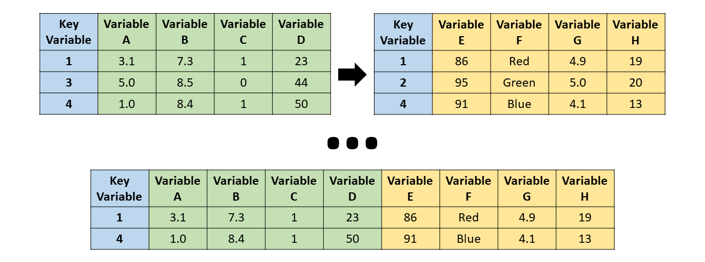

> “Between 30% to 80% of the data analysis task is spent on cleaning and understanding the data.” (Dasu \& Johnson, 2003)

Para esta seção, usaremos a base de dados `starwars` do pacote de manipulação de dados `dplyr`:


```r
library(dplyr)

# Vamos chamar a base de dados starwars de sw
sw = starwars

# vamos retirar as últimas 3 colunas para facilitar a manipulação.
# São colunas da classe list
sw[,c("films", "vehicles", "starships")] = NULL
```


</br>

## Pacote `base`
- Nesta seção, vamos manipular bases de dados usando as funções pré-carregadas no R (pacote `base`)


### Resumo dos dados

#### Funções básicas
- [Summarizing data (John Hopkins/Coursera)](https://www.coursera.org/learn/data-cleaning/lecture/e5qVi/summarizing-data)
- Verificaremos:
  - as **dimensões** da base via `dim()`
  - as 6 **primeiras** linhas da base via `head()`
  - as 6 **últimas** linhas da base via `tail()`

```r
dim(sw) # Verificar tamanho da base (linhas x colunas)
```

```
## [1] 87 11
```

```r
head(sw) # Visualizando as 6 primeiras linhas
```

```
## # A tibble: 6 × 11
##   name      height  mass hair_color skin_color eye_color birth_year sex   gender
##   <chr>      <int> <dbl> <chr>      <chr>      <chr>          <dbl> <chr> <chr> 
## 1 Luke Sky…    172    77 blond      fair       blue            19   male  mascu…
## 2 C-3PO        167    75 <NA>       gold       yellow         112   none  mascu…
## 3 R2-D2         96    32 <NA>       white, bl… red             33   none  mascu…
## 4 Darth Va…    202   136 none       white      yellow          41.9 male  mascu…
## 5 Leia Org…    150    49 brown      light      brown           19   fema… femin…
## 6 Owen Lars    178   120 brown, gr… light      blue            52   male  mascu…
## # ℹ 2 more variables: homeworld <chr>, species <chr>
```

```r
tail(sw) # Visualizando as 6 últimas linhas
```

```
## # A tibble: 6 × 11
##   name      height  mass hair_color skin_color eye_color birth_year sex   gender
##   <chr>      <int> <dbl> <chr>      <chr>      <chr>          <dbl> <chr> <chr> 
## 1 Finn          NA    NA black      dark       dark              NA male  mascu…
## 2 Rey           NA    NA brown      light      hazel             NA fema… femin…
## 3 Poe Dame…     NA    NA brown      light      brown             NA male  mascu…
## 4 BB8           NA    NA none       none       black             NA none  mascu…
## 5 Captain …     NA    NA unknown    unknown    unknown           NA <NA>  <NA>  
## 6 Padmé Am…    165    45 brown      light      brown             46 fema… femin…
## # ℹ 2 more variables: homeworld <chr>, species <chr>
```
- Usando `str()`, podemos visualizar a **estrutura** (_structure_) da base:
    - todas a variáveis (colunas),
    - a classe de cada uma delas e
    - algumas de suas observações.

```r
str(sw)
```

```
## tibble [87 × 11] (S3: tbl_df/tbl/data.frame)
##  $ name      : chr [1:87] "Luke Skywalker" "C-3PO" "R2-D2" "Darth Vader" ...
##  $ height    : int [1:87] 172 167 96 202 150 178 165 97 183 182 ...
##  $ mass      : num [1:87] 77 75 32 136 49 120 75 32 84 77 ...
##  $ hair_color: chr [1:87] "blond" NA NA "none" ...
##  $ skin_color: chr [1:87] "fair" "gold" "white, blue" "white" ...
##  $ eye_color : chr [1:87] "blue" "yellow" "red" "yellow" ...
##  $ birth_year: num [1:87] 19 112 33 41.9 19 52 47 NA 24 57 ...
##  $ sex       : chr [1:87] "male" "none" "none" "male" ...
##  $ gender    : chr [1:87] "masculine" "masculine" "masculine" "masculine" ...
##  $ homeworld : chr [1:87] "Tatooine" "Tatooine" "Naboo" "Tatooine" ...
##  $ species   : chr [1:87] "Human" "Droid" "Droid" "Human" ...
```


- Para fazer um **resumo** de todas as variáveis da base, podemos usar a função `summary()` que, para variáveis numéricas, calcula a média e os quartis, e mostra a quantidade de `NA`.

```r
summary(sw)
```

```
##      name               height           mass          hair_color       
##  Length:87          Min.   : 66.0   Min.   :  15.00   Length:87         
##  Class :character   1st Qu.:167.0   1st Qu.:  55.60   Class :character  
##  Mode  :character   Median :180.0   Median :  79.00   Mode  :character  
##                     Mean   :174.4   Mean   :  97.31                     
##                     3rd Qu.:191.0   3rd Qu.:  84.50                     
##                     Max.   :264.0   Max.   :1358.00                     
##                     NA's   :6       NA's   :28                          
##   skin_color         eye_color           birth_year         sex           
##  Length:87          Length:87          Min.   :  8.00   Length:87         
##  Class :character   Class :character   1st Qu.: 35.00   Class :character  
##  Mode  :character   Mode  :character   Median : 52.00   Mode  :character  
##                                        Mean   : 87.57                     
##                                        3rd Qu.: 72.00                     
##                                        Max.   :896.00                     
##                                        NA's   :44                         
##     gender           homeworld           species         
##  Length:87          Length:87          Length:87         
##  Class :character   Class :character   Class :character  
##  Mode  :character   Mode  :character   Mode  :character  
##                                                          
##                                                          
##                                                          
## 
```

- Note que, para variáveis lógicas, de texto (character) ou categóricas (factor), aparecem poucas informações.
- Logo, pode ser interessante fazer uma **tabela com a contagem** de com as categorias de uma variável. Isto é possível por meio da função `table()` e aplicaremos `prop.table(table())` para visualizar em **percentuais**.

```r
table(sw$hair_color) # contagem
```

```
## 
##        auburn  auburn, grey auburn, white         black         blond 
##             1             1             1            13             3 
##        blonde         brown   brown, grey          grey          none 
##             1            18             1             1            37 
##       unknown         white 
##             1             4
```

```r
prop.table(table(sw$hair_color)) # percentual
```

```
## 
##        auburn  auburn, grey auburn, white         black         blond 
##    0.01219512    0.01219512    0.01219512    0.15853659    0.03658537 
##        blonde         brown   brown, grey          grey          none 
##    0.01219512    0.21951220    0.01219512    0.01219512    0.45121951 
##       unknown         white 
##    0.01219512    0.04878049
```
- Também podemos fazer uma "contagem cruzada" incluindo mais uma variável em `table()`:

```r
table(sw$hair_color, sw$gender)
```

```
##                
##                 feminine masculine
##   auburn               1         0
##   auburn, grey         0         1
##   auburn, white        0         1
##   black                3         9
##   blond                0         3
##   blonde               1         0
##   brown                6        11
##   brown, grey          0         1
##   grey                 0         1
##   none                 5        31
##   unknown              0         0
##   white                1         3
```


#### Família de funções _apply_
Veremos uma família de funções _apply_ que permitem executar comandos em loop de maneira compacta:
- `apply`: aplica uma função sobre as margens (linha ou coluna) de uma matrix/array
- `lapply`: loop sobre uma lista e avalia uma função em cada elemento
    - função auxiliar `split` é útil ao ser utilizada em conjunto da `lapply`
- `sapply`: mesmo que o `lapply`, mas simplifica o resultado


##### Função `apply()`
- [Loop functions - apply (John Hopkins/Coursera)](https://www.coursera.org/learn/r-programming/lecture/IUUhK/loop-functions-apply)
- Usado para avaliar, por meio de uma função, margens de uma matriz/array
- Frequentemente é utilizado para aplicar uma função a linhas ou a colunas de uma matriz
- Não é mais rápido do que escrever um loop, mas funciona em uma única linha
```yaml
apply(X, MARGIN, FUN, ...)

- X: an array, including a matrix.MARGIN: a vector giving the subscripts which the function will be applied over. E.g., for a matrix 1 indicates rows, 2 indicates columns, c(1, 2) indicates rows and columns.
- FUN: the function to be applied
```

```r
x = matrix(1:20, 5, 4)
x
```

```
##      [,1] [,2] [,3] [,4]
## [1,]    1    6   11   16
## [2,]    2    7   12   17
## [3,]    3    8   13   18
## [4,]    4    9   14   19
## [5,]    5   10   15   20
```

```r
apply(x, 1, mean) # médias das linhas
```

```
## [1]  8.5  9.5 10.5 11.5 12.5
```

```r
apply(x, 2, mean) # médias das colunas
```

```
## [1]  3  8 13 18
```
- Há funções pré-definidas que aplicam `apply` com soma e com média:
    - `rowSums = apply(x, 1, sum)`
    - `rowMeans = apply(x, 1, mean)`
    - `colSums = apply(x, 2, sum)`
    - `colMeans = apply(x, 2, mean)`


##### Função `lapply()`
- [Loop functions - lapply (John Hopkins/Coursera)](https://www.coursera.org/learn/r-programming/lecture/t5iuo/loop-functions-lapply)
- `lapply` usa três argumentos: uma **lista**, o nome de uma função e outros argumentos (incluindo os argumentos da função inserida)
```yaml
lapply(X, FUN, ...)

- X: a vector (atomic or list) or an expression object.
- FUN: the function to be applied to each element of X.
```


<!-- ```{r} -->
<!-- # Criando uma lista com vetor de dimensões distintas -->
<!-- x = list(a=1:5, b=45:38, c=c(1, 4, 65, 6, 78)) -->
<!-- x -->

<!-- lapply(x, mean) # retorna médias de cada vetor dentro da lista -->
<!-- lapply(x, summary) # retorna 6 estatísticas de cada vetor dentro da lista -->

<!-- class(lapply(x, mean)) # classe do objeto retornado pelo lapply -->
<!-- ``` -->

- A função `lapply()` aplica uma função em cada um de seus elementos.
- Um tipo especial de lista é o data frame, cujos elementos são suas colunas (variáveis).


```r
lapply(sw, mean, na.rm=TRUE) # valores únicos
```

```
## $name
## [1] NA
## 
## $height
## [1] 174.358
## 
## $mass
## [1] 97.31186
## 
## $hair_color
## [1] NA
## 
## $skin_color
## [1] NA
## 
## $eye_color
## [1] NA
## 
## $birth_year
## [1] 87.56512
## 
## $sex
## [1] NA
## 
## $gender
## [1] NA
## 
## $homeworld
## [1] NA
## 
## $species
## [1] NA
```

- Note que as variáveis não numérica retornaram `NA` e o 3º argumento é um arguemento da própria função `mean()`


- Podemos verificar quais são os valores únicos de cada variável (um item da lista) usando `unique()`

```r
lapply(sw, unique) # valores únicos
```

```
## $name
##  [1] "Luke Skywalker"        "C-3PO"                 "R2-D2"                
##  [4] "Darth Vader"           "Leia Organa"           "Owen Lars"            
##  [7] "Beru Whitesun lars"    "R5-D4"                 "Biggs Darklighter"    
## [10] "Obi-Wan Kenobi"        "Anakin Skywalker"      "Wilhuff Tarkin"       
## [13] "Chewbacca"             "Han Solo"              "Greedo"               
## [16] "Jabba Desilijic Tiure" "Wedge Antilles"        "Jek Tono Porkins"     
## [19] "Yoda"                  "Palpatine"             "Boba Fett"            
## [22] "IG-88"                 "Bossk"                 "Lando Calrissian"     
## [25] "Lobot"                 "Ackbar"                "Mon Mothma"           
## [28] "Arvel Crynyd"          "Wicket Systri Warrick" "Nien Nunb"            
## [31] "Qui-Gon Jinn"          "Nute Gunray"           "Finis Valorum"        
## [34] "Jar Jar Binks"         "Roos Tarpals"          "Rugor Nass"           
## [37] "Ric Olié"              "Watto"                 "Sebulba"              
## [40] "Quarsh Panaka"         "Shmi Skywalker"        "Darth Maul"           
## [43] "Bib Fortuna"           "Ayla Secura"           "Dud Bolt"             
## [46] "Gasgano"               "Ben Quadinaros"        "Mace Windu"           
## [49] "Ki-Adi-Mundi"          "Kit Fisto"             "Eeth Koth"            
## [52] "Adi Gallia"            "Saesee Tiin"           "Yarael Poof"          
## [55] "Plo Koon"              "Mas Amedda"            "Gregar Typho"         
## [58] "Cordé"                 "Cliegg Lars"           "Poggle the Lesser"    
## [61] "Luminara Unduli"       "Barriss Offee"         "Dormé"                
## [64] "Dooku"                 "Bail Prestor Organa"   "Jango Fett"           
## [67] "Zam Wesell"            "Dexter Jettster"       "Lama Su"              
## [70] "Taun We"               "Jocasta Nu"            "Ratts Tyerell"        
## [73] "R4-P17"                "Wat Tambor"            "San Hill"             
## [76] "Shaak Ti"              "Grievous"              "Tarfful"              
## [79] "Raymus Antilles"       "Sly Moore"             "Tion Medon"           
## [82] "Finn"                  "Rey"                   "Poe Dameron"          
## [85] "BB8"                   "Captain Phasma"        "Padmé Amidala"        
## 
## $height
##  [1] 172 167  96 202 150 178 165  97 183 182 188 180 228 173 175 170  66 200 190
## [20] 177  NA  88 160 193 191 196 224 206 137 112 163  94 122 198 171 184 264 185
## [39] 157 166 168 229 213  79 216 234
## 
## $mass
##  [1]   77.0   75.0   32.0  136.0   49.0  120.0   84.0     NA  112.0   80.0
## [11]   74.0 1358.0  110.0   17.0   78.2  140.0  113.0   79.0   83.0   20.0
## [21]   68.0   89.0   90.0   66.0   82.0   40.0   55.0   45.0   65.0   87.0
## [31]   50.0   85.0   56.2  102.0   88.0   15.0   48.0   57.0  159.0
## 
## $hair_color
##  [1] "blond"         NA              "none"          "brown"        
##  [5] "brown, grey"   "black"         "auburn, white" "auburn, grey" 
##  [9] "white"         "grey"          "auburn"        "blonde"       
## [13] "unknown"      
## 
## $skin_color
##  [1] "fair"                "gold"                "white, blue"        
##  [4] "white"               "light"               "white, red"         
##  [7] "unknown"             "green"               "green-tan, brown"   
## [10] "pale"                "metal"               "dark"               
## [13] "brown mottle"        "brown"               "grey"               
## [16] "mottled green"       "orange"              "blue, grey"         
## [19] "grey, red"           "red"                 "blue"               
## [22] "grey, green, yellow" "yellow"              "tan"                
## [25] "fair, green, yellow" "grey, blue"          "silver, red"        
## [28] "green, grey"         "red, blue, white"    "brown, white"       
## [31] "none"               
## 
## $eye_color
##  [1] "blue"          "yellow"        "red"           "brown"        
##  [5] "blue-gray"     "black"         "orange"        "hazel"        
##  [9] "pink"          "unknown"       "red, blue"     "gold"         
## [13] "green, yellow" "white"         "dark"         
## 
## $birth_year
##  [1]  19.0 112.0  33.0  41.9  52.0  47.0    NA  24.0  57.0  64.0 200.0  29.0
## [13]  44.0 600.0  21.0 896.0  82.0  31.5  15.0  53.0  31.0  37.0  41.0  48.0
## [25]   8.0  92.0  91.0  62.0  72.0  54.0  22.0  58.0  40.0 102.0  67.0  66.0
## [37]  46.0
## 
## $sex
## [1] "male"           "none"           "female"         "hermaphroditic"
## [5] NA              
## 
## $gender
## [1] "masculine" "feminine"  NA         
## 
## $homeworld
##  [1] "Tatooine"       "Naboo"          "Alderaan"       "Stewjon"       
##  [5] "Eriadu"         "Kashyyyk"       "Corellia"       "Rodia"         
##  [9] "Nal Hutta"      "Bestine IV"     NA               "Kamino"        
## [13] "Trandosha"      "Socorro"        "Bespin"         "Mon Cala"      
## [17] "Chandrila"      "Endor"          "Sullust"        "Cato Neimoidia"
## [21] "Coruscant"      "Toydaria"       "Malastare"      "Dathomir"      
## [25] "Ryloth"         "Vulpter"        "Troiken"        "Tund"          
## [29] "Haruun Kal"     "Cerea"          "Glee Anselm"    "Iridonia"      
## [33] "Iktotch"        "Quermia"        "Dorin"          "Champala"      
## [37] "Geonosis"       "Mirial"         "Serenno"        "Concord Dawn"  
## [41] "Zolan"          "Ojom"           "Aleen Minor"    "Skako"         
## [45] "Muunilinst"     "Shili"          "Kalee"          "Umbara"        
## [49] "Utapau"        
## 
## $species
##  [1] "Human"          "Droid"          "Wookiee"        "Rodian"        
##  [5] "Hutt"           "Yoda's species" "Trandoshan"     "Mon Calamari"  
##  [9] "Ewok"           "Sullustan"      "Neimodian"      "Gungan"        
## [13] NA               "Toydarian"      "Dug"            "Zabrak"        
## [17] "Twi'lek"        "Vulptereen"     "Xexto"          "Toong"         
## [21] "Cerean"         "Nautolan"       "Tholothian"     "Iktotchi"      
## [25] "Quermian"       "Kel Dor"        "Chagrian"       "Geonosian"     
## [29] "Mirialan"       "Clawdite"       "Besalisk"       "Kaminoan"      
## [33] "Aleena"         "Skakoan"        "Muun"           "Togruta"       
## [37] "Kaleesh"        "Pau'an"
```

- Um uso interessante é para a verificação do **número de NA's de um data frame**. No entanto, ao transformar uma variável com `is.na()`, ela se torna uma matriz e, portanto, é necessário usar função `apply()`:

```r
head( is.na(sw) ) # 6 primeiras linhas aplicando is.na()
```

```
##       name height  mass hair_color skin_color eye_color birth_year   sex gender
## [1,] FALSE  FALSE FALSE      FALSE      FALSE     FALSE      FALSE FALSE  FALSE
## [2,] FALSE  FALSE FALSE       TRUE      FALSE     FALSE      FALSE FALSE  FALSE
## [3,] FALSE  FALSE FALSE       TRUE      FALSE     FALSE      FALSE FALSE  FALSE
## [4,] FALSE  FALSE FALSE      FALSE      FALSE     FALSE      FALSE FALSE  FALSE
## [5,] FALSE  FALSE FALSE      FALSE      FALSE     FALSE      FALSE FALSE  FALSE
## [6,] FALSE  FALSE FALSE      FALSE      FALSE     FALSE      FALSE FALSE  FALSE
##      homeworld species
## [1,]     FALSE   FALSE
## [2,]     FALSE   FALSE
## [3,]     FALSE   FALSE
## [4,]     FALSE   FALSE
## [5,]     FALSE   FALSE
## [6,]     FALSE   FALSE
```

```r
class( is.na(sw) ) # tipo de objeto
```

```
## [1] "matrix" "array"
```

```r
apply(is.na(sw), 2, sum) # somando cada coluna de TRUE/FALSE
```

```
##       name     height       mass hair_color skin_color  eye_color birth_year 
##          0          6         28          5          0          0         44 
##        sex     gender  homeworld    species 
##          4          4         10          4
```


##### Função `sapply()`
Similar ao `lapply`, mas `sapply` tenta simplificar o output:

- Se o resultado for uma lista em seus elementos têm o mesmo comprimento, retorna um vetor (ou matriz)

```r
sapply(sw, mean, na.rm=TRUE) # retorna um vetor
```

```
##       name     height       mass hair_color skin_color  eye_color birth_year 
##         NA  174.35802   97.31186         NA         NA         NA   87.56512 
##        sex     gender  homeworld    species 
##         NA         NA         NA         NA
```


### Filtro de linhas
- [Subsetting and sorting (John Hopkins/Coursera)](https://www.coursera.org/learn/data-cleaning/lecture/aqd2Y/subsetting-and-sorting)


```r
# vetor lógico de cabelo loiro
sw$hair_color == "blond"
```

```
##  [1]  TRUE    NA    NA FALSE FALSE FALSE FALSE    NA FALSE FALSE  TRUE FALSE
## [13] FALSE FALSE    NA    NA FALSE FALSE FALSE FALSE FALSE FALSE FALSE FALSE
## [25] FALSE FALSE FALSE FALSE FALSE FALSE FALSE FALSE  TRUE FALSE FALSE FALSE
## [37] FALSE FALSE FALSE FALSE FALSE FALSE FALSE FALSE FALSE FALSE FALSE FALSE
## [49] FALSE FALSE FALSE FALSE FALSE FALSE FALSE FALSE FALSE FALSE FALSE FALSE
## [61] FALSE FALSE FALSE FALSE FALSE FALSE FALSE FALSE FALSE FALSE FALSE FALSE
## [73] FALSE FALSE FALSE FALSE FALSE FALSE FALSE FALSE FALSE FALSE FALSE FALSE
## [85] FALSE FALSE FALSE
```

```r
# Extraindo linhas com cabelo loiro
sw[sw$hair_color == "blond", ]
```

```
## # A tibble: 8 × 11
##   name      height  mass hair_color skin_color eye_color birth_year sex   gender
##   <chr>      <int> <dbl> <chr>      <chr>      <chr>          <dbl> <chr> <chr> 
## 1 Luke Sky…    172    77 blond      fair       blue            19   male  mascu…
## 2 <NA>          NA    NA <NA>       <NA>       <NA>            NA   <NA>  <NA>  
## 3 <NA>          NA    NA <NA>       <NA>       <NA>            NA   <NA>  <NA>  
## 4 <NA>          NA    NA <NA>       <NA>       <NA>            NA   <NA>  <NA>  
## 5 Anakin S…    188    84 blond      fair       blue            41.9 male  mascu…
## 6 <NA>          NA    NA <NA>       <NA>       <NA>            NA   <NA>  <NA>  
## 7 <NA>          NA    NA <NA>       <NA>       <NA>            NA   <NA>  <NA>  
## 8 Finis Va…    170    NA blond      fair       blue            91   male  mascu…
## # ℹ 2 more variables: homeworld <chr>, species <chr>
```

- Podemos usar expressões lógicas (vetor com `TRUE` e `FALSE`) para extrair/filtrar uma parte do data frame. Por exemplo, queremos filtrar "Droid" **E** (`&`) que não seja `NA`:

```r
sw[sw$hair_color == "blond" & !is.na(sw$hair_color), ]
```

```
## # A tibble: 3 × 11
##   name      height  mass hair_color skin_color eye_color birth_year sex   gender
##   <chr>      <int> <dbl> <chr>      <chr>      <chr>          <dbl> <chr> <chr> 
## 1 Luke Sky…    172    77 blond      fair       blue            19   male  mascu…
## 2 Anakin S…    188    84 blond      fair       blue            41.9 male  mascu…
## 3 Finis Va…    170    NA blond      fair       blue            91   male  mascu…
## # ℹ 2 more variables: homeworld <chr>, species <chr>
```

- Para não ter que ficar escrevendo `sw` antes de cada variáveis, podemos usar função `with()`

```r
with(sw,
     sw[hair_color == "blond" & !is.na(hair_color),]
     )
```

```
## # A tibble: 3 × 11
##   name      height  mass hair_color skin_color eye_color birth_year sex   gender
##   <chr>      <int> <dbl> <chr>      <chr>      <chr>          <dbl> <chr> <chr> 
## 1 Luke Sky…    172    77 blond      fair       blue            19   male  mascu…
## 2 Anakin S…    188    84 blond      fair       blue            41.9 male  mascu…
## 3 Finis Va…    170    NA blond      fair       blue            91   male  mascu…
## # ℹ 2 more variables: homeworld <chr>, species <chr>
```

- Poderíamos também obter cabelo loiro **OU** (`|`) branco:

```r
# Extraindo linhas em que cabelo é loiro ou branco
sw[sw$hair_color == "blond" | sw$hair_color == "white", ]
```

```
## # A tibble: 12 × 11
##    name     height  mass hair_color skin_color eye_color birth_year sex   gender
##    <chr>     <int> <dbl> <chr>      <chr>      <chr>          <dbl> <chr> <chr> 
##  1 Luke Sk…    172    77 blond      fair       blue            19   male  mascu…
##  2 <NA>         NA    NA <NA>       <NA>       <NA>            NA   <NA>  <NA>  
##  3 <NA>         NA    NA <NA>       <NA>       <NA>            NA   <NA>  <NA>  
##  4 <NA>         NA    NA <NA>       <NA>       <NA>            NA   <NA>  <NA>  
##  5 Anakin …    188    84 blond      fair       blue            41.9 male  mascu…
##  6 <NA>         NA    NA <NA>       <NA>       <NA>            NA   <NA>  <NA>  
##  7 <NA>         NA    NA <NA>       <NA>       <NA>            NA   <NA>  <NA>  
##  8 Yoda         66    17 white      green      brown          896   male  mascu…
##  9 Finis V…    170    NA blond      fair       blue            91   male  mascu…
## 10 Ki-Adi-…    198    82 white      pale       yellow          92   male  mascu…
## 11 Dooku       193    80 white      fair       brown          102   male  mascu…
## 12 Jocasta…    167    NA white      fair       blue            NA   fema… femin…
## # ℹ 2 more variables: homeworld <chr>, species <chr>
```
- Também podemos verificar se determinados valores estão contidos em um vetor específico (equivale a `==` com mais de um valor)

```r
sw$hair_color %in% c("blond", "white") # T/F cabelo loiro ou branco
```

```
##  [1]  TRUE FALSE FALSE FALSE FALSE FALSE FALSE FALSE FALSE FALSE  TRUE FALSE
## [13] FALSE FALSE FALSE FALSE FALSE FALSE  TRUE FALSE FALSE FALSE FALSE FALSE
## [25] FALSE FALSE FALSE FALSE FALSE FALSE FALSE FALSE  TRUE FALSE FALSE FALSE
## [37] FALSE FALSE FALSE FALSE FALSE FALSE FALSE FALSE FALSE FALSE FALSE FALSE
## [49]  TRUE FALSE FALSE FALSE FALSE FALSE FALSE FALSE FALSE FALSE FALSE FALSE
## [61] FALSE FALSE FALSE  TRUE FALSE FALSE FALSE FALSE FALSE FALSE  TRUE FALSE
## [73] FALSE FALSE FALSE FALSE FALSE FALSE FALSE FALSE FALSE FALSE FALSE FALSE
## [85] FALSE FALSE FALSE
```

```r
sw = sw[sw$hair_color %in% c("blond", "white"), ]
head(sw)
```

```
## # A tibble: 6 × 11
##   name      height  mass hair_color skin_color eye_color birth_year sex   gender
##   <chr>      <int> <dbl> <chr>      <chr>      <chr>          <dbl> <chr> <chr> 
## 1 Luke Sky…    172    77 blond      fair       blue            19   male  mascu…
## 2 Anakin S…    188    84 blond      fair       blue            41.9 male  mascu…
## 3 Yoda          66    17 white      green      brown          896   male  mascu…
## 4 Finis Va…    170    NA blond      fair       blue            91   male  mascu…
## 5 Ki-Adi-M…    198    82 white      pale       yellow          92   male  mascu…
## 6 Dooku        193    80 white      fair       brown          102   male  mascu…
## # ℹ 2 more variables: homeworld <chr>, species <chr>
```


### Ordenação de linhas
- [Subsetting and sorting (John Hopkins/Coursera)](https://www.coursera.org/learn/data-cleaning/lecture/aqd2Y/subsetting-and-sorting)

- Podemos usar a função `sort()` para ordenar um vetor de maneira crescente (padrão) ou decrescente:

```r
sort(sw$height) # ordenando de maneira crescente
```

```
## [1]  66 167 170 172 188 193 198
```

```r
sort(sw$height, decreasing=TRUE) # ordenando de maneira decrescente
```

```
## [1] 198 193 188 172 170 167  66
```

- Note que não podemos usar a função `sort()` para ordenar um data frame, pois a função retorna um vetor com os valores da base de dados.
- Para **ordenar data frames**, precisamos utilizar a função `order()` que, retorna os índices dos menores valores aos maiores (ou decrescente com `decreasing = TRUE`):

```r
order(sw$height) # índices na forma crescente de altura
```

```
## [1] 3 7 4 1 2 6 5
```

```r
sw = sw[order(sw$height), ] # reordenando data frame
head(sw)
```

```
## # A tibble: 6 × 11
##   name      height  mass hair_color skin_color eye_color birth_year sex   gender
##   <chr>      <int> <dbl> <chr>      <chr>      <chr>          <dbl> <chr> <chr> 
## 1 Yoda          66    17 white      green      brown          896   male  mascu…
## 2 Jocasta …    167    NA white      fair       blue            NA   fema… femin…
## 3 Finis Va…    170    NA blond      fair       blue            91   male  mascu…
## 4 Luke Sky…    172    77 blond      fair       blue            19   male  mascu…
## 5 Anakin S…    188    84 blond      fair       blue            41.9 male  mascu…
## 6 Dooku        193    80 white      fair       brown          102   male  mascu…
## # ℹ 2 more variables: homeworld <chr>, species <chr>
```


### Seleção de colunas
- Podemos selecionar colunas usando `[,]` e incluindo um vetor de nomes/índices das colunas que quer manter (ou retirar usando `!`)

```r
# Selecionando 3 primeiras colunas
head( sw[,c("name","height", "mass")] )
```

```
## # A tibble: 6 × 3
##   name             height  mass
##   <chr>             <int> <dbl>
## 1 Yoda                 66    17
## 2 Jocasta Nu          167    NA
## 3 Finis Valorum       170    NA
## 4 Luke Skywalker      172    77
## 5 Anakin Skywalker    188    84
## 6 Dooku               193    80
```

```r
# Selecionando 6 primeiras colunas
sw = sw[,1:6]
head(sw)
```

```
## # A tibble: 6 × 6
##   name             height  mass hair_color skin_color eye_color
##   <chr>             <int> <dbl> <chr>      <chr>      <chr>    
## 1 Yoda                 66    17 white      green      brown    
## 2 Jocasta Nu          167    NA white      fair       blue     
## 3 Finis Valorum       170    NA blond      fair       blue     
## 4 Luke Skywalker      172    77 blond      fair       blue     
## 5 Anakin Skywalker    188    84 blond      fair       blue     
## 6 Dooku               193    80 white      fair       brown
```


### Renomeação de colunas
- Podemos alterar os nomes das variáveis usando `names()` ou `colnames()` e atribuindo um vetor de nomes


```r
names(sw) # nomes da base de dados
```

```
## [1] "name"       "height"     "mass"       "hair_color" "skin_color"
## [6] "eye_color"
```

```r
# Retirando os underlines
names(sw)[4] = "haircolor" # alterando um único
names(sw)[5:6] = c("skincolor", "eyecolor") # alterando 2 nomes
names(sw) # vetor de nomes com alteração
```

```
## [1] "name"      "height"    "mass"      "haircolor" "skincolor" "eyecolor"
```


### Modificação de colunas

- Para modificar variáveis, podemos usar `$<novo_nome_var>` e atribuir um vetor de mesmo tamanho (mesma quantidade de linhas):

```r
sw$height = sw$height / 100 # de cm para metro
```

- Se incluir um escalar, vai repetir o valor para todas as linhas

```r
sw$const = 1
```

- Também é possível criar uma nova variável:

```r
sw$BMI = sw$mass / sw$height^2 # índice de massa corpórea
head(sw)
```

```
## # A tibble: 6 × 8
##   name             height  mass haircolor skincolor eyecolor const   BMI
##   <chr>             <dbl> <dbl> <chr>     <chr>     <chr>    <dbl> <dbl>
## 1 Yoda               0.66    17 white     green     brown        1  39.0
## 2 Jocasta Nu         1.67    NA white     fair      blue         1  NA  
## 3 Finis Valorum      1.7     NA blond     fair      blue         1  NA  
## 4 Luke Skywalker     1.72    77 blond     fair      blue         1  26.0
## 5 Anakin Skywalker   1.88    84 blond     fair      blue         1  23.8
## 6 Dooku              1.93    80 white     fair      brown        1  21.5
```


- [Algumas transformações comuns de variáveis (John Hopkins/Coursera)](https://www.coursera.org/learn/data-cleaning/lecture/r6VHJ/creating-new-variables)

```r
abs(sw$BMI[1:4]) # valor absoluto
```

```
## [1] 39.02663       NA       NA 26.02758
```

```r
sqrt(sw$BMI[1:4]) # raiz quadrada
```

```
## [1] 6.247130       NA       NA 5.101723
```

```r
ceiling(sw$BMI[1:4]) # valor inteiro acima
```

```
## [1] 40 NA NA 27
```

```r
floor(sw$BMI[1:4]) # valor inteiro abaixo
```

```
## [1] 39 NA NA 26
```

```r
round(sw$BMI[1:4], digits=1) # arred com 1 dígito
```

```
## [1] 39 NA NA 26
```

```r
cos(sw$BMI[1:4]) # cosseno
```

```
## [1] 0.2408856        NA        NA 0.6256427
```

```r
sin(sw$BMI[1:4]) # seno
```

```
## [1] 0.9705535        NA        NA 0.7801098
```

```r
log(sw$BMI[1:4]) # logaritmo natural
```

```
## [1] 3.664244       NA       NA 3.259157
```

```r
log10(sw$BMI[1:4]) # logaritmo base 10
```

```
## [1] 1.591361       NA       NA 1.415434
```

```r
exp(sw$BMI[1:4]) # exponencial
```

```
## [1] 8.893036e+16           NA           NA 2.012035e+11
```


### Junção de bases

- [Merging data (John Hopkins/Coursera)](https://www.coursera.org/learn/data-cleaning/lecture/pVV6K/merging-data)
- [Joining (Merging) Data (David E. Caughlin)](https://rforhr.com/join.html)

- Uma junção é o processo de correspondência de casos (ou seja, linhas ou observações) entre dois bases de dados usando uma oou mais variáveis-chave:

<center></center>

- Para isto, vamos usar a função `merge()`:

```yaml
merge(x, y, by = intersect(names(x), names(y)),
      by.x = by, by.y = by, all = FALSE, all.x = all, all.y = all,
      suffixes = c(".x",".y"), ...)

- x, y: data frames, or objects to be coerced to one.
- by, by.x, by.y: specifications of the columns used for merging.
- all: logical; all = L is shorthand for all.x = L and all.y = L, where L is either TRUE or FALSE.
- all.x: logical; if TRUE, then extra rows will be added to the output, one for each row in x that has no matching row in y. These rows will have NAs in those columns that are usually filled with values from y.
- all.y: logical; analogous to all.x.
- sort: logical. Should the result be sorted on the by columns?
- suffixes: a character vector of length 2 specifying the suffixes to be used for making unique the names of columns.
```

- Vamos criar duas bases de dados, sendo que existem indivíduos presentes em uma base que não está na outra:


```r
# Extraindo data frames menores de 'starwars' (original)
bd1 = starwars[1:6, c(1, 3, 11)]
bd1
```

```
## # A tibble: 6 × 3
##   name            mass species
##   <chr>          <dbl> <chr>  
## 1 Luke Skywalker    77 Human  
## 2 C-3PO             75 Droid  
## 3 R2-D2             32 Droid  
## 4 Darth Vader      136 Human  
## 5 Leia Organa       49 Human  
## 6 Owen Lars        120 Human
```

```r
bd2 = starwars[c(2, 4, 7:10), c(1:2, 6)]
bd2
```

```
## # A tibble: 6 × 3
##   name               height eye_color
##   <chr>               <int> <chr>    
## 1 C-3PO                 167 yellow   
## 2 Darth Vader           202 yellow   
## 3 Beru Whitesun lars    165 blue     
## 4 R5-D4                  97 red      
## 5 Biggs Darklighter     183 brown    
## 6 Obi-Wan Kenobi        182 blue-gray
```

- Note que há 12 personagens únicos em ambas bases, mas apenas “C-3PO” e “Darth Vader” são observações comuns.
- Para verificar as colunas com mesmos nomes em duas bases, podemos usar a função `intersect()` em conjunto com a função `names()` ou `colnames()`:

```r
intersect( names(bd1), names(bd2) )
```

```
## [1] "name"
```
- Caso não especifiquemos nenhuma variável-chave, a função `merge()` utiliza como variável-chave todas as colunas com nomes iguais.

##### Inner-join

<center></center>

```r
merge(bd1, bd2, all = FALSE)
```

```
##          name mass species height eye_color
## 1       C-3PO   75   Droid    167    yellow
## 2 Darth Vader  136   Human    202    yellow
```


##### Full-join

<center></center>

```r
merge(bd1, bd2, all = TRUE)
```

```
##                  name mass species height eye_color
## 1  Beru Whitesun lars   NA    <NA>    165      blue
## 2   Biggs Darklighter   NA    <NA>    183     brown
## 3               C-3PO   75   Droid    167    yellow
## 4         Darth Vader  136   Human    202    yellow
## 5         Leia Organa   49   Human     NA      <NA>
## 6      Luke Skywalker   77   Human     NA      <NA>
## 7      Obi-Wan Kenobi   NA    <NA>    182 blue-gray
## 8           Owen Lars  120   Human     NA      <NA>
## 9               R2-D2   32   Droid     NA      <NA>
## 10              R5-D4   NA    <NA>     97       red
```


##### Left-join

<center></center>

```r
merge(bd1, bd2, all.x = TRUE)
```

```
##             name mass species height eye_color
## 1          C-3PO   75   Droid    167    yellow
## 2    Darth Vader  136   Human    202    yellow
## 3    Leia Organa   49   Human     NA      <NA>
## 4 Luke Skywalker   77   Human     NA      <NA>
## 5      Owen Lars  120   Human     NA      <NA>
## 6          R2-D2   32   Droid     NA      <NA>
```


##### Right-join

<center></center>

```r
merge(bd1, bd2, all.y = TRUE)
```

```
##                 name mass species height eye_color
## 1 Beru Whitesun lars   NA    <NA>    165      blue
## 2  Biggs Darklighter   NA    <NA>    183     brown
## 3              C-3PO   75   Droid    167    yellow
## 4        Darth Vader  136   Human    202    yellow
## 5     Obi-Wan Kenobi   NA    <NA>    182 blue-gray
## 6              R5-D4   NA    <NA>     97       red
```

</br>


## Pacote `dplyr`
- [Vignette - Introduction to _dplyr_](https://cran.r-project.org/web/packages/dplyr/vignettes/dplyr.html)
- O pacote `dplyr` facilita a manipulação dos dados por meio de funções simples e computacionalmente eficientes
- As funções pode, ser organizadas em três categorias:
    - Colunas:
        - `select()`: seleciona (ou retira) as colunas do data frame
        - `rename()`: muda os nomes das colunas
        - `mutate()`: cria ou muda os valores nas colunas
    - Linhas:
        - `filter()`: seleciona linhas de acordo com valores das colunas
        - `arrange()`: organiza a ordem das linhas
    - Grupo de linhas:
        - `summarise()`: colapsa um grupo em uma única linha
        - `group_by()`: agrupa base de dados a partir de uma variável categórica
- Nesta subseção, continuaremos utilizando a base de dados de Star Wars (`starwars`), utilizada na subseção anterior.
- Você irá notar que, ao usar essas funções, o data frame é transformado em um _tibble_ que é um formato mais eficiente para tratar dados tabulares, mas que funciona de forma igual a um data frame.


```r
sw = starwars # "limpando" sw com a base original
```


### Filtro via `filter()`
- Permite selecionar um subconjunto de linhas de um data frame
```yaml
filter(.data, ...)

- .data: A data frame, data frame extension (e.g. a tibble).
- ...	: Expressions that return a logical value, and are defined in terms of the variables in .data. If multiple expressions are included, they are combined with the & operator. Only rows for which all conditions evaluate to TRUE are kept.
```


```r
sw1 = filter(sw, species == "Human", height >= 100)
sw1 # já filtra os NA's
```

```
## # A tibble: 31 × 14
##    name     height  mass hair_color skin_color eye_color birth_year sex   gender
##    <chr>     <int> <dbl> <chr>      <chr>      <chr>          <dbl> <chr> <chr> 
##  1 Luke Sk…    172    77 blond      fair       blue            19   male  mascu…
##  2 Darth V…    202   136 none       white      yellow          41.9 male  mascu…
##  3 Leia Or…    150    49 brown      light      brown           19   fema… femin…
##  4 Owen La…    178   120 brown, gr… light      blue            52   male  mascu…
##  5 Beru Wh…    165    75 brown      light      blue            47   fema… femin…
##  6 Biggs D…    183    84 black      light      brown           24   male  mascu…
##  7 Obi-Wan…    182    77 auburn, w… fair       blue-gray       57   male  mascu…
##  8 Anakin …    188    84 blond      fair       blue            41.9 male  mascu…
##  9 Wilhuff…    180    NA auburn, g… fair       blue            64   male  mascu…
## 10 Han Solo    180    80 brown      fair       brown           29   male  mascu…
## # ℹ 21 more rows
## # ℹ 5 more variables: homeworld <chr>, species <chr>, films <list>,
## #   vehicles <list>, starships <list>
```


### Ordenação via `arrange()`
- Reordena as linhas a partir de um conjunto de nomes de coluna
```yaml
arrange(.data, ..., .by_group = FALSE)

- .data: A data frame, data frame extension (e.g. a tibble).
- ... : Variables, or functions of variables. Use desc() to sort a variable in descending order.
```
- Se for inserido mais de um nome de variável, organiza de acordo com a 1ª variável e, em caso de ter linhas com o mesmo valor na 1ª variável, ordena estas linhas de mesmo valor de acordo com a 2ª variável
- Para usar a ordem decrescente, temos a função `desc()`

```r
sw2 = arrange(sw1, height, desc(mass))
sw2
```

```
## # A tibble: 31 × 14
##    name     height  mass hair_color skin_color eye_color birth_year sex   gender
##    <chr>     <int> <dbl> <chr>      <chr>      <chr>          <dbl> <chr> <chr> 
##  1 Leia Or…    150    49 brown      light      brown             19 fema… femin…
##  2 Mon Mot…    150    NA auburn     fair       blue              48 fema… femin…
##  3 Cordé       157    NA brown      light      brown             NA fema… femin…
##  4 Shmi Sk…    163    NA black      fair       brown             72 fema… femin…
##  5 Beru Wh…    165    75 brown      light      blue              47 fema… femin…
##  6 Padmé A…    165    45 brown      light      brown             46 fema… femin…
##  7 Dormé       165    NA brown      light      brown             NA fema… femin…
##  8 Jocasta…    167    NA white      fair       blue              NA fema… femin…
##  9 Wedge A…    170    77 brown      fair       hazel             21 male  mascu…
## 10 Palpati…    170    75 grey       pale       yellow            82 male  mascu…
## # ℹ 21 more rows
## # ℹ 5 more variables: homeworld <chr>, species <chr>, films <list>,
## #   vehicles <list>, starships <list>
```


### Seleção via `select()`
- Seleciona colunas que são de interesse.
```yaml
select(.data, ...)

- ... : variables in a data frame
  - : for selecting a range of consecutive variables.
  - ! for taking the complement of a set of variables.
  - c() for combining selections.
```
- Coloca-se os nomes das colunas desejadas para selecioná-las.
- Também é possível selecionar um intervalo de variáveis usando `var1:var2`
- Caso queira tirar apenas algumas colunas, basta informar o nome delas precedidas pelo sinal de subtração (`-var`)

```r
sw3 = select(sw2, name:eye_color, sex:species)
sw3
```

```
## # A tibble: 31 × 10
##    name      height  mass hair_color skin_color eye_color sex   gender homeworld
##    <chr>      <int> <dbl> <chr>      <chr>      <chr>     <chr> <chr>  <chr>    
##  1 Leia Org…    150    49 brown      light      brown     fema… femin… Alderaan 
##  2 Mon Moth…    150    NA auburn     fair       blue      fema… femin… Chandrila
##  3 Cordé        157    NA brown      light      brown     fema… femin… Naboo    
##  4 Shmi Sky…    163    NA black      fair       brown     fema… femin… Tatooine 
##  5 Beru Whi…    165    75 brown      light      blue      fema… femin… Tatooine 
##  6 Padmé Am…    165    45 brown      light      brown     fema… femin… Naboo    
##  7 Dormé        165    NA brown      light      brown     fema… femin… Naboo    
##  8 Jocasta …    167    NA white      fair       blue      fema… femin… Coruscant
##  9 Wedge An…    170    77 brown      fair       hazel     male  mascu… Corellia 
## 10 Palpatine    170    75 grey       pale       yellow    male  mascu… Naboo    
## # ℹ 21 more rows
## # ℹ 1 more variable: species <chr>
```
- Note que o `select()` pode não funcionar corretamente se o pacote `MASS` estiver ativo. Caso esteja, retire a seleção do pacote `MASS` no quadrante inferior/direito em 'Packages' (ou digite `detach("package:MASS", unload = TRUE)`)
- Uma outra forma de fazer a seleção de coluna é combinando com `starts_with()` e `ends_with()`, que resulta na seleção de colunas que se iniciam e terminam com um texto dado

```r
head( select(sw, ends_with("color")) ) # colunas que terminam com color
```

```
## # A tibble: 6 × 3
##   hair_color  skin_color  eye_color
##   <chr>       <chr>       <chr>    
## 1 blond       fair        blue     
## 2 <NA>        gold        yellow   
## 3 <NA>        white, blue red      
## 4 none        white       yellow   
## 5 brown       light       brown    
## 6 brown, grey light       blue
```

```r
head( select(sw, starts_with("s")) ) # colunas que iniciam com a letra "s"
```

```
## # A tibble: 6 × 4
##   skin_color  sex    species starships
##   <chr>       <chr>  <chr>   <list>   
## 1 fair        male   Human   <chr [2]>
## 2 gold        none   Droid   <chr [0]>
## 3 white, blue none   Droid   <chr [0]>
## 4 white       male   Human   <chr [1]>
## 5 light       female Human   <chr [0]>
## 6 light       male   Human   <chr [0]>
```


### Renomeação via `rename()`
- Renomeia colunas usando `novo_nome = velho_nome`
```yaml
rename(.data, ...)

- .data: A data frame, data frame extension (e.g. a tibble).
- ...	: Use new_name = old_name to rename selected variables.
```


```r
sw4 = rename(sw3,
             haircolor = hair_color,
             skincolor = skin_color, 
             eyecolor = eye_color)
sw4
```

```
## # A tibble: 31 × 10
##    name         height  mass haircolor skincolor eyecolor sex   gender homeworld
##    <chr>         <int> <dbl> <chr>     <chr>     <chr>    <chr> <chr>  <chr>    
##  1 Leia Organa     150    49 brown     light     brown    fema… femin… Alderaan 
##  2 Mon Mothma      150    NA auburn    fair      blue     fema… femin… Chandrila
##  3 Cordé           157    NA brown     light     brown    fema… femin… Naboo    
##  4 Shmi Skywal…    163    NA black     fair      brown    fema… femin… Tatooine 
##  5 Beru Whites…    165    75 brown     light     blue     fema… femin… Tatooine 
##  6 Padmé Amida…    165    45 brown     light     brown    fema… femin… Naboo    
##  7 Dormé           165    NA brown     light     brown    fema… femin… Naboo    
##  8 Jocasta Nu      167    NA white     fair      blue     fema… femin… Coruscant
##  9 Wedge Antil…    170    77 brown     fair      hazel    male  mascu… Corellia 
## 10 Palpatine       170    75 grey      pale      yellow   male  mascu… Naboo    
## # ℹ 21 more rows
## # ℹ 1 more variable: species <chr>
```


### Modificação via `mutate()`
- Modifica uma coluna se ela já existir
- Cria uma coluna se ela não existir
```yaml
mutate(.data, ...)

- .data: A data frame, data frame extension (e.g. a tibble).
- ...	: Name-value pairs. The name gives the name of the column in the output.
 - A vector of length 1, which will be recycled to the correct length.
 - A vector the same length as the current group (or the whole data frame if ungrouped).
 - NULL, to remove the column.
```

```r
sw5 = mutate(sw4,
             height = height/100, # transf cm p/ metro
             BMI = mass / height^2,
             dummy = 1 # se não for vetor, tudo fica igual
             )
sw5 = select(sw5, BMI, dummy, everything()) # reordenação colunas
sw5
```

```
## # A tibble: 31 × 12
##      BMI dummy name       height  mass haircolor skincolor eyecolor sex   gender
##    <dbl> <dbl> <chr>       <dbl> <dbl> <chr>     <chr>     <chr>    <chr> <chr> 
##  1  21.8     1 Leia Orga…   1.5     49 brown     light     brown    fema… femin…
##  2  NA       1 Mon Mothma   1.5     NA auburn    fair      blue     fema… femin…
##  3  NA       1 Cordé        1.57    NA brown     light     brown    fema… femin…
##  4  NA       1 Shmi Skyw…   1.63    NA black     fair      brown    fema… femin…
##  5  27.5     1 Beru Whit…   1.65    75 brown     light     blue     fema… femin…
##  6  16.5     1 Padmé Ami…   1.65    45 brown     light     brown    fema… femin…
##  7  NA       1 Dormé        1.65    NA brown     light     brown    fema… femin…
##  8  NA       1 Jocasta Nu   1.67    NA white     fair      blue     fema… femin…
##  9  26.6     1 Wedge Ant…   1.7     77 brown     fair      hazel    male  mascu…
## 10  26.0     1 Palpatine    1.7     75 grey      pale      yellow   male  mascu…
## # ℹ 21 more rows
## # ℹ 2 more variables: homeworld <chr>, species <chr>
```


### Operador Pipe `%>%`
- Note que todas as funções do pacote `dyplr` anteriores têm como 1º argumento a base de dados (`.data`), e isto não é por acaso.
- O operador pipe `%>%` joga um data frame (escrito à sua esquerda) no 1º argumento da função seguinte (à sua direita).

```r
filter(sw, species=="Droid") # sem operador pipe
```

```
## # A tibble: 6 × 14
##   name   height  mass hair_color skin_color  eye_color birth_year sex   gender  
##   <chr>   <int> <dbl> <chr>      <chr>       <chr>          <dbl> <chr> <chr>   
## 1 C-3PO     167    75 <NA>       gold        yellow           112 none  masculi…
## 2 R2-D2      96    32 <NA>       white, blue red               33 none  masculi…
## 3 R5-D4      97    32 <NA>       white, red  red               NA none  masculi…
## 4 IG-88     200   140 none       metal       red               15 none  masculi…
## 5 R4-P17     96    NA none       silver, red red, blue         NA none  feminine
## 6 BB8        NA    NA none       none        black             NA none  masculi…
## # ℹ 5 more variables: homeworld <chr>, species <chr>, films <list>,
## #   vehicles <list>, starships <list>
```

```r
sw %>% filter(species=="Droid") # com operador pipe
```

```
## # A tibble: 6 × 14
##   name   height  mass hair_color skin_color  eye_color birth_year sex   gender  
##   <chr>   <int> <dbl> <chr>      <chr>       <chr>          <dbl> <chr> <chr>   
## 1 C-3PO     167    75 <NA>       gold        yellow           112 none  masculi…
## 2 R2-D2      96    32 <NA>       white, blue red               33 none  masculi…
## 3 R5-D4      97    32 <NA>       white, red  red               NA none  masculi…
## 4 IG-88     200   140 none       metal       red               15 none  masculi…
## 5 R4-P17     96    NA none       silver, red red, blue         NA none  feminine
## 6 BB8        NA    NA none       none        black             NA none  masculi…
## # ℹ 5 more variables: homeworld <chr>, species <chr>, films <list>,
## #   vehicles <list>, starships <list>
```
- Observe que, ao usar o operador pipe, o 1º argumento com a base de dados não deve ser preenchida (já está sendo aplicada automaticamente via `%>%`).
- Note que, desde a subseção com a função `filter()` até `mutate()` fomos "acumulando" as alterações em novos data frames, ou seja, o último data frame `starwars5` é a base original `starwars` que foi alterada por `filter()`, `arrange()`, `select()`, `rename()` e `mutate()`.

```r
sw1 = filter(sw, species == "Human", height >= 100)
sw2 = arrange(sw1, height, desc(mass))
sw3 = select(sw2, name:eye_color, sex:species)
sw4 = rename(sw3,
             haircolor = hair_color,
             skincolor = skin_color, 
             eyecolor = eye_color)
sw5 = mutate(sw4,
             height = height/100,
             BMI = mass / height^2,
             dummy = 1
             )
sw5 = select(sw5, BMI, dummy, everything())
sw5
```

```
## # A tibble: 31 × 12
##      BMI dummy name       height  mass haircolor skincolor eyecolor sex   gender
##    <dbl> <dbl> <chr>       <dbl> <dbl> <chr>     <chr>     <chr>    <chr> <chr> 
##  1  21.8     1 Leia Orga…   1.5     49 brown     light     brown    fema… femin…
##  2  NA       1 Mon Mothma   1.5     NA auburn    fair      blue     fema… femin…
##  3  NA       1 Cordé        1.57    NA brown     light     brown    fema… femin…
##  4  NA       1 Shmi Skyw…   1.63    NA black     fair      brown    fema… femin…
##  5  27.5     1 Beru Whit…   1.65    75 brown     light     blue     fema… femin…
##  6  16.5     1 Padmé Ami…   1.65    45 brown     light     brown    fema… femin…
##  7  NA       1 Dormé        1.65    NA brown     light     brown    fema… femin…
##  8  NA       1 Jocasta Nu   1.67    NA white     fair      blue     fema… femin…
##  9  26.6     1 Wedge Ant…   1.7     77 brown     fair      hazel    male  mascu…
## 10  26.0     1 Palpatine    1.7     75 grey      pale      yellow   male  mascu…
## # ℹ 21 more rows
## # ℹ 2 more variables: homeworld <chr>, species <chr>
```
- Usando o operador pipe `%>%` várias vezes, podemos ir pegando o output resultante da aplicação de uma função e jogar como input da função seguinte. Reescreveremos o código acima "em única linha" com `%>%`, chegando ao mesmo data frame de `starwars5`

```r
sw_pipe = sw %>% 
    filter(species == "Human", height >= 100) %>%
    arrange(height, desc(mass)) %>%
    select(name:eye_color, sex:species) %>%
    rename(haircolor = hair_color,
           skincolor = skin_color, 
           eyecolor = eye_color) %>%
    mutate(height = height/100,
           BMI = mass / height^2,
           dummy = 1
           ) %>%
    select(BMI, dummy, everything())
sw_pipe
```

```
## # A tibble: 31 × 12
##      BMI dummy name       height  mass haircolor skincolor eyecolor sex   gender
##    <dbl> <dbl> <chr>       <dbl> <dbl> <chr>     <chr>     <chr>    <chr> <chr> 
##  1  21.8     1 Leia Orga…   1.5     49 brown     light     brown    fema… femin…
##  2  NA       1 Mon Mothma   1.5     NA auburn    fair      blue     fema… femin…
##  3  NA       1 Cordé        1.57    NA brown     light     brown    fema… femin…
##  4  NA       1 Shmi Skyw…   1.63    NA black     fair      brown    fema… femin…
##  5  27.5     1 Beru Whit…   1.65    75 brown     light     blue     fema… femin…
##  6  16.5     1 Padmé Ami…   1.65    45 brown     light     brown    fema… femin…
##  7  NA       1 Dormé        1.65    NA brown     light     brown    fema… femin…
##  8  NA       1 Jocasta Nu   1.67    NA white     fair      blue     fema… femin…
##  9  26.6     1 Wedge Ant…   1.7     77 brown     fair      hazel    male  mascu…
## 10  26.0     1 Palpatine    1.7     75 grey      pale      yellow   male  mascu…
## # ℹ 21 more rows
## # ℹ 2 more variables: homeworld <chr>, species <chr>
```

```r
all(sw_pipe == sw5, na.rm=TRUE) # verificando se todos elementos são iguais
```

```
## [1] TRUE
```


### Resumo via `summarise()`

- Podemos usar a função `summarise()` para gerar alguma estatística acerca de uma ou mais variáveis:

```r
starwars %>% summarise(
    n_obs = n(),
    height_mean = mean(height, na.rm=TRUE),
    mass_mean = mean(mass, na.rm=TRUE)
    )
```

```
## # A tibble: 1 × 3
##   n_obs height_mean mass_mean
##   <int>       <dbl>     <dbl>
## 1    87        174.      97.3
```
- No caso acima, gerou simplesmente o tamanho da amostra e as médias de altura e de massa considerando a amostra inteira de `starwars` (o que não foi muito útil).


#### Agrupamento via `group_by()`
- Diferente das outras funções do `dplyr` mostradas até agora, o output do `group_by` não altera conteúdo do data frame, apenas **transforma em uma base de dados agrupada** em categorias de uma dada variável

```r
grouped_sw = starwars %>% group_by(sex)
class(grouped_sw)
```

```
## [1] "grouped_df" "tbl_df"     "tbl"        "data.frame"
```

```r
head(starwars)
```

```
## # A tibble: 6 × 14
##   name      height  mass hair_color skin_color eye_color birth_year sex   gender
##   <chr>      <int> <dbl> <chr>      <chr>      <chr>          <dbl> <chr> <chr> 
## 1 Luke Sky…    172    77 blond      fair       blue            19   male  mascu…
## 2 C-3PO        167    75 <NA>       gold       yellow         112   none  mascu…
## 3 R2-D2         96    32 <NA>       white, bl… red             33   none  mascu…
## 4 Darth Va…    202   136 none       white      yellow          41.9 male  mascu…
## 5 Leia Org…    150    49 brown      light      brown           19   fema… femin…
## 6 Owen Lars    178   120 brown, gr… light      blue            52   male  mascu…
## # ℹ 5 more variables: homeworld <chr>, species <chr>, films <list>,
## #   vehicles <list>, starships <list>
```

```r
head(grouped_sw) # agrupado por sexo
```

```
## # A tibble: 6 × 14
## # Groups:   sex [3]
##   name      height  mass hair_color skin_color eye_color birth_year sex   gender
##   <chr>      <int> <dbl> <chr>      <chr>      <chr>          <dbl> <chr> <chr> 
## 1 Luke Sky…    172    77 blond      fair       blue            19   male  mascu…
## 2 C-3PO        167    75 <NA>       gold       yellow         112   none  mascu…
## 3 R2-D2         96    32 <NA>       white, bl… red             33   none  mascu…
## 4 Darth Va…    202   136 none       white      yellow          41.9 male  mascu…
## 5 Leia Org…    150    49 brown      light      brown           19   fema… femin…
## 6 Owen Lars    178   120 brown, gr… light      blue            52   male  mascu…
## # ℹ 5 more variables: homeworld <chr>, species <chr>, films <list>,
## #   vehicles <list>, starships <list>
```
- O `group_by()` prepara o data frame para operações que consideram várias linhas. Como exemplo, vamos criar uma coluna com a soma de `mass` de todas observações

```r
starwars %>%
    mutate(mass_mean = mean(mass, na.rm=TRUE)) %>% 
    select(mass_mean, sex, everything()) %>%
    head(10)
```

```
## # A tibble: 10 × 15
##    mass_mean sex   name  height  mass hair_color skin_color eye_color birth_year
##        <dbl> <chr> <chr>  <int> <dbl> <chr>      <chr>      <chr>          <dbl>
##  1      97.3 male  Luke…    172    77 blond      fair       blue            19  
##  2      97.3 none  C-3PO    167    75 <NA>       gold       yellow         112  
##  3      97.3 none  R2-D2     96    32 <NA>       white, bl… red             33  
##  4      97.3 male  Dart…    202   136 none       white      yellow          41.9
##  5      97.3 fema… Leia…    150    49 brown      light      brown           19  
##  6      97.3 male  Owen…    178   120 brown, gr… light      blue            52  
##  7      97.3 fema… Beru…    165    75 brown      light      blue            47  
##  8      97.3 none  R5-D4     97    32 <NA>       white, red red             NA  
##  9      97.3 male  Bigg…    183    84 black      light      brown           24  
## 10      97.3 male  Obi-…    182    77 auburn, w… fair       blue-gray       57  
## # ℹ 6 more variables: gender <chr>, homeworld <chr>, species <chr>,
## #   films <list>, vehicles <list>, starships <list>
```
- Note que todos os valores de `mass_mean` são iguais. Agora, agruparemos por `sex` antes de fazer a soma:

```r
starwars %>%
    group_by(sex) %>%
    mutate(mass_mean = mean(mass, na.rm=TRUE)) %>% 
    ungroup() %>% # Lembre-se sempre de desagrupar depois!
    select(mass_mean, sex, everything()) %>%
    head(10)
```

```
## # A tibble: 10 × 15
##    mass_mean sex   name  height  mass hair_color skin_color eye_color birth_year
##        <dbl> <chr> <chr>  <int> <dbl> <chr>      <chr>      <chr>          <dbl>
##  1      81.0 male  Luke…    172    77 blond      fair       blue            19  
##  2      69.8 none  C-3PO    167    75 <NA>       gold       yellow         112  
##  3      69.8 none  R2-D2     96    32 <NA>       white, bl… red             33  
##  4      81.0 male  Dart…    202   136 none       white      yellow          41.9
##  5      54.7 fema… Leia…    150    49 brown      light      brown           19  
##  6      81.0 male  Owen…    178   120 brown, gr… light      blue            52  
##  7      54.7 fema… Beru…    165    75 brown      light      blue            47  
##  8      69.8 none  R5-D4     97    32 <NA>       white, red red             NA  
##  9      81.0 male  Bigg…    183    84 black      light      brown           24  
## 10      81.0 male  Obi-…    182    77 auburn, w… fair       blue-gray       57  
## # ℹ 6 more variables: gender <chr>, homeworld <chr>, species <chr>,
## #   films <list>, vehicles <list>, starships <list>
```
- Note que, agora, a coluna `mass_mean` tem valores diferentes de acordo com o sexo da observação.
- Isso é útil em algumas aplicações econômicas em que consideramos variáveis a nível de grupo (e.g. domicílio) a qual uma observação (e.g. morador) pertence.

> **Evite potenciais erros**: Sempre que usar `group_by()`, não se esqueça de desagrupar o data frame via função `ungroup()` após realizar a operações desejadas.

#### Resumo por grupo via `group_by()` e `summarise()`
- A função `summarise()` é de fato útil quando combinada com a função `group_by()`, pois conseguimos obter as estatísticas de grupos:

```r
summary_sw = starwars %>% group_by(sex) %>%
    summarise(
        n_obs = n(),
        height_mean = mean(height, na.rm = TRUE),
        mass_mean = mean(mass, na.rm = TRUE)
    )
summary_sw
```

```
## # A tibble: 5 × 4
##   sex            n_obs height_mean mass_mean
##   <chr>          <int>       <dbl>     <dbl>
## 1 female            16        169.      54.7
## 2 hermaphroditic     1        175     1358  
## 3 male              60        179.      81.0
## 4 none               6        131.      69.8
## 5 <NA>               4        181.      48
```

```r
class(summary_sw) # ao usar summary, deixa de ser agrupada
```

```
## [1] "tbl_df"     "tbl"        "data.frame"
```
- Note que, ao usar `summarise()`, o data frame resultante não é agrupado e, portanto, não é necessário usar `ungroup()` neste caso.
- Também é possível adicionar mais de uma variável para agrupar:

```r
starwars %>% group_by(sex, hair_color) %>%
    summarise(
        n_obs = n(),
        height_mean = mean(height, na.rm = TRUE),
        mass_mean = mean(mass, na.rm = TRUE)
    )
```

```
## `summarise()` has grouped output by 'sex'. You can override using the `.groups`
## argument.
```

```
## # A tibble: 23 × 5
## # Groups:   sex [5]
##    sex            hair_color    n_obs height_mean mass_mean
##    <chr>          <chr>         <int>       <dbl>     <dbl>
##  1 female         auburn            1        150      NaN  
##  2 female         black             3        166.      53.1
##  3 female         blonde            1        168       55  
##  4 female         brown             6        160.      56.3
##  5 female         none              4        188.      54  
##  6 female         white             1        167      NaN  
##  7 hermaphroditic <NA>              1        175     1358  
##  8 male           auburn, grey      1        180      NaN  
##  9 male           auburn, white     1        182       77  
## 10 male           black             9        176.      81.0
## # ℹ 13 more rows
```
- Para agrupar variáveis **contínuas**, precisamos definir intervalos usando a função `cut()`
```yaml
cut(x, ...)

x: a numeric vector which is to be converted to a factor by cutting.

breaks: either a numeric vector of two or more unique cut points or a single number (greater than or equal to 2) giving the number of intervals into which x is to be cut.
```

```r
# breaks com um integer = qtd desejada de grupos
starwars %>% group_by(cut(birth_year, breaks=5)) %>%
    summarise(
        n_obs = n(),
        height_mean = mean(height, na.rm = TRUE)
    )
```

```
## # A tibble: 5 × 3
##   `cut(birth_year, breaks = 5)` n_obs height_mean
##   <fct>                         <int>       <dbl>
## 1 (7.11,186]                       40        175.
## 2 (186,363]                         1        228 
## 3 (541,718]                         1        175 
## 4 (718,897]                         1         66 
## 5 <NA>                             44        176.
```

```r
# breaks com um vetor = quebras dos intervalos dos grupos
starwars %>% group_by(birth_year=cut(birth_year, 
                          breaks=c(0, 40, 90, 200, 900))) %>%
    summarise(
        n_obs = n(),
        height_mean = mean(height, na.rm = TRUE)
    )
```

```
## # A tibble: 5 × 3
##   birth_year n_obs height_mean
##   <fct>      <int>       <dbl>
## 1 (0,40]        13        164.
## 2 (40,90]       22        179.
## 3 (90,200]       6        192.
## 4 (200,900]      2        120.
## 5 <NA>          44        176.
```
- Note que inserimos `birth_year=cut(birth_year, ...)` para que o nome da coluna ficasse `birth_year`, caso contrário a coluna ficaria com o nome `cut(birth_year, ...)`.


### Junção via _\*\_join()_
- Vimos anteriormente que, para agrupar bases de dados a partir de variáveis-chave, podemos usar a função `merge()`.
- O pacote `dplyr` fornece uma família de funções _join_ que executam o mesmo comando que `merge()`, porém, ao invés de alterar o valor de um argumento, você precisa escolher uma das funções _join_ que podem ser resumidas na seguinte figura:

<center></center>

- Todas as funções possuem a mesma sintaxe:
    - `x`: base 1
    - `y`: base 2
    - `by`: vetor de variáveis-chave
    - `suffix`: vetor de 2 sufixos para incluir em colunas de mesmos nomes
- Como exemplo, usaremos subconjuntos da base de dados `starwars`:

```r
bd1 = starwars[1:6, c(1, 3, 11)]
bd1
```

```
## # A tibble: 6 × 3
##   name            mass species
##   <chr>          <dbl> <chr>  
## 1 Luke Skywalker    77 Human  
## 2 C-3PO             75 Droid  
## 3 R2-D2             32 Droid  
## 4 Darth Vader      136 Human  
## 5 Leia Organa       49 Human  
## 6 Owen Lars        120 Human
```

```r
bd2 = starwars[c(2, 4, 7:10), c(1:2, 6)]
bd2
```

```
## # A tibble: 6 × 3
##   name               height eye_color
##   <chr>               <int> <chr>    
## 1 C-3PO                 167 yellow   
## 2 Darth Vader           202 yellow   
## 3 Beru Whitesun lars    165 blue     
## 4 R5-D4                  97 red      
## 5 Biggs Darklighter     183 brown    
## 6 Obi-Wan Kenobi        182 blue-gray
```
- Note que há 12 personagens únicos em ambas bases, mas apenas "C-3PO" e "Darth Vader" são observações comuns.
- `inner_join()`: mantém apenas ID's presentes simultaneamente em ambas bases

```r
inner_join(bd1, bd2, by="name")
```

```
## # A tibble: 2 × 5
##   name         mass species height eye_color
##   <chr>       <dbl> <chr>    <int> <chr>    
## 1 C-3PO          75 Droid      167 yellow   
## 2 Darth Vader   136 Human      202 yellow
```

- `full_join()`: mantém todas ID's, mesmo que estejam em apenas em um das bases

```r
full_join(bd1, bd2, by="name")
```

```
## # A tibble: 10 × 5
##    name                mass species height eye_color
##    <chr>              <dbl> <chr>    <int> <chr>    
##  1 Luke Skywalker        77 Human       NA <NA>     
##  2 C-3PO                 75 Droid      167 yellow   
##  3 R2-D2                 32 Droid       NA <NA>     
##  4 Darth Vader          136 Human      202 yellow   
##  5 Leia Organa           49 Human       NA <NA>     
##  6 Owen Lars            120 Human       NA <NA>     
##  7 Beru Whitesun lars    NA <NA>       165 blue     
##  8 R5-D4                 NA <NA>        97 red      
##  9 Biggs Darklighter     NA <NA>       183 brown    
## 10 Obi-Wan Kenobi        NA <NA>       182 blue-gray
```
- `left_join()`: mantém apenas ID's presentes na base 1 (informada como `x`)

```r
left_join(bd1, bd2, by="name")
```

```
## # A tibble: 6 × 5
##   name            mass species height eye_color
##   <chr>          <dbl> <chr>    <int> <chr>    
## 1 Luke Skywalker    77 Human       NA <NA>     
## 2 C-3PO             75 Droid      167 yellow   
## 3 R2-D2             32 Droid       NA <NA>     
## 4 Darth Vader      136 Human      202 yellow   
## 5 Leia Organa       49 Human       NA <NA>     
## 6 Owen Lars        120 Human       NA <NA>
```
- `right_join()`: mantém apenas ID's presentes na base 2 (informada como `y`)

```r
right_join(bd1, bd2, by="name")
```

```
## # A tibble: 6 × 5
##   name                mass species height eye_color
##   <chr>              <dbl> <chr>    <int> <chr>    
## 1 C-3PO                 75 Droid      167 yellow   
## 2 Darth Vader          136 Human      202 yellow   
## 3 Beru Whitesun lars    NA <NA>       165 blue     
## 4 R5-D4                 NA <NA>        97 red      
## 5 Biggs Darklighter     NA <NA>       183 brown    
## 6 Obi-Wan Kenobi        NA <NA>       182 blue-gray
```


</br>


