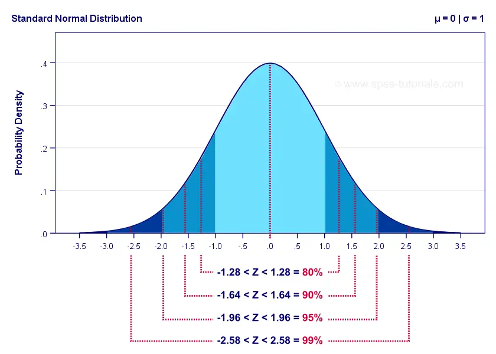

```{r setup, include=FALSE}
knitr::opts_chunk$set(echo = TRUE)
```


- A parte de Econometria no R é baseada no livro de Florian Heiss "Using R for Introductory Econometrics" (2ª edição, 2020)
    - Aplica no R o conteúdo e os exemplos do livro do Wooldridge de 2019 (versão em inglês)
    - É possível ler gratuitamente a versão online em: <http://www.urfie.net>
    - Há também uma versão de Python do livro em: <http://www.upfie.net>
- A base de dados dos exemplos contidos no livro do Wooldridge podem ser obtidos por meio da instalação e do carregamento do pacote `wooldridge`:
```r
install.packages("wooldridge")
```

</br>

## Distribuições
- [Seção 1.7 de Heiss (2020)](http://www.urfie.net/read/index.html#page/65)
- [Probability Distributions in R (Examples): PDF, CDF & Quantile Function (Statistics Globe)](https://statisticsglobe.com/probability-distributions-in-r)
- [Basic Probability Distributions in R (Greg Graham)](https://rstudio-pubs-static.s3.amazonaws.com/100906_8e3a32dd11c14b839468db756cee7400.html)


- As funções relacionadas a distribuições são dadas por `<prefixo><nome da distribuição>`
- Existem 4 prefixos que indicam qual ação será realizada:
    - `d`: retorna uma probabilidade a partir de uma função de densidade de probabilidade (pdf)
    - `p`: retorna uma probabilidade acumulada a partir de uma função de distribuição acumulada (cdf)
    - `q`: retorna uma estatística da distribuição (quantil) dada uma probabilidade acumulada
    - `r`: gera números aleatórios dada a distribuição
- Existem diversas distribuições disponíveis no R:
    - `norm`: Normal
    - `bern`: Bernoulli (pacote `Rlab`)
    - `binom`: Binomial
    - `pois`: Poisson
    - `chisq`: Qui-Quadrado ($\chi^2$)
    - `t`: t-Student
    - `f`: F
    - `unif`: Uniforme
    - `weibull`: Weibull
    - `gamma`: Gamma
    - `logis`: Logística
    - `exp`: Exponencial
- Seguem as principais distribuições e suas respectivas funções:

| **Distribuição**   | **Densidade de Probabilidade** | **Distribuição Acumulada** | **Quantil**             |
|--------------------|--------------------------------|----------------------------|-------------------------|
| Normal             | `dnorm(x, mean, sd)`           | `pnorm(q, mean, sd)`       | `qnorm(p, mean, sd)`    |
| Qui-Quadrado       | `dchisq(x, df)`                | `pchisq(q, df)`            | `qchisq(p, df)`         |
| t-Student          | `dt(x, df)`                    | `pt(q, df)`                | `qt(p, df)`             |
| F                  | `df(x, df1, df2)`              | `pf(q, df1, df2)`          | `qf(p, df1, df2)`       |
| Binomial           | `dbinom(x, size, prob)`        | `pbinom(q, size, prob)`    | `qbinom(p, size, prob)` |

em que `x` e `q` são estatísticas de cada distribuição (quantis), e `p` é probabilidade.


### Distribuição Normal
- Considere uma normal padrão, $N(\mu=0, \sigma=1)$, e escores padrão $Z=-1,96 \text{ e } 1,96$ (para intervalo de confiança de $\approx 5\%$):

<center></center>

- [`d`]: Densidade a partir de uma pdf, dada estatística (escore padrão):
```{r}
dnorm(1.96, mean=0, sd=1) # probabilidade para escore padrão de 1,96
dnorm(-1.96, mean=0, sd=1) # probabilidade para escore padrão de -1,96
```

- [`p`]: Probabilidade acumulada a partir de uma cdf, dada estatística (escore padrão):
```{r}
pnorm(1.96, mean=0, sd=1) # probabilidade acumulada para escore padrão de 1,96
pnorm(-1.96, mean=0, sd=1) # probabilidade acumulada para escore padrão de -1,96
```

Logo, a probabilidade de que uma variável aleatória com distribuição normal padrão esteja com valor entre -1,96 e 1,96 é de 95\%
```{r}
pnorm(1.96, mean=0, sd=1) - pnorm(-1.96, mean=0, sd=1)
```


- [`q`]: Estatística (escore padrão) a partir de um quantil:
```{r}
qnorm(0.975, mean=0, sd=1) # quantil dada o quantil de 97,5%
qnorm(0.025, mean=0, sd=1) # quantil dada o quantil de 2,5%
```

Podemos criar gráficos usando a função `curve( function(x), from, to )`, na qual inserimos uma função com um `x` arbitrário e seus limites mínimo e máximo (`from` e `to`):
```{r}
# pdf de normal padrão com estatística (escore padrão) no intervalo -3 e 3
curve(dnorm(x, mean=0, sd=1), from=-3, to=3)

# cdf de normal padrão com estatística (escore padrão) no intervalo -3 e 3
curve(pnorm(x, mean=0, sd=1), from=-3, to=3)

# quantil de normal padrão com probabilidade acumulada no intervalo 0 e 1
curve(qnorm(x, mean=0, sd=1), from=0, to=1)
```


### Distribuição t-Student
- Criaremos gráficos com diversos graus de liberdade
- Quanto maior os graus de liberdade, mais se aproxima de uma normal padrão

```{r}
curve(dnorm(x, mean=0, sd=1), from=-3, to=3, pch=".") # pdf normal padrão

for (n in c(1, 2, 4, 6, 10)) {
    curve(dt(x, df=n), from=-3, to=3, col=n, add=T) # pdf t-student
}
```


### Distribuição Qui-Quadrado
- Criaremos gráficos com diversos graus de liberdade

```{r}
curve(dchisq(x, df=1), from=0, to=6, col=n) # pdf qui-quadrado

for (n in c(2:5)) {
    curve(dchisq(x, df=n), from=0, to=6, col=n, add=T) # pdf qui-quadrado
}
```


### Distribuição F
- Criaremos gráficos com diversos graus de liberdade

```{r}
curve(df(x, df1=1, df2=1), from=0, to=6, col=n) # pdf F

for (n in c(2:5)) {
    curve(df(x, df1=n, df2=n), from=0, to=6, col=n, add=T) # pdf F
}
```


</br>

## Simulação

### Geração de números aleatórios
- [Simulation - Random sampling (John Hopkins/Coursera)](https://www.coursera.org/learn/r-programming/lecture/ykXUb/simulation-random-sampling)
- Para gerar números aleatórios, usaremos o prefixo `r` junto de uma distribuição.
```{r}
rnorm(5) # gerando 5 números aleatórios
```

- Para reproduzir resultados que usem números aleatórios, podemos definir "sementes" usando a função `set.seed()` e informando um número inteiro. Isso também é válido para a função `sample()`.
```{r}
# definindo seed
set.seed(2022)
rnorm(5)

# sem definir seed
rnorm(5)

# definindo seed
set.seed(2022)
rnorm(5)
```


#### Exemplo: Criação de observações x e y

Vamos criar observações da variável $x$ a partir de uma distribuição uniforme no intervalo [0, 10]:
```{r}
N = 100 # número de observações
x = runif(N, 0, 10) # nº aleatórios a partir de U[0,10]
head(x)
```

Agora, vamos criar a variável $y = 10 - 2x + \varepsilon, \ \varepsilon \sim N(0, 3^2)$ e plotar ambas variáveis em um scatterplot:
```{r}
e = rnorm(N, mean=0, sd=3)
y = 10 - 2*x + e
plot(x, y) ## scatterplot entre x e y
abline(a=10, b=-2, col="red")
```

</br>

### Amostragem aleatória
- Para fazer uma amostragem a partir de um dado vetor, usamos a função `sample()`
```yaml
sample(x, size, replace = FALSE, prob = NULL)

x: either a vector of one or more elements from which to choose, or a positive integer. See ‘Details.’
n: a positive number, the number of items to choose from.
size: a non-negative integer giving the number of items to choose.
replace: should sampling be with replacement?
prob: a vector of probability weights for obtaining the elements of the vector being sampled.
```
```{r}
sample(letters, 5) # Amostragem de 5 letras

sample(1:10, 4) # Amostragem de 4 números de 1 a 10

sample(1:10) # Permutação (amostra mesma qtd de elementos do vetor)

sample(1:10, replace = TRUE) # Amostragem com reposição
```
- Note que, por padrão, a função `sample()` faz a amostragem sem reposição.


#### Exemplo: Lei dos Grandes Números (LGN)
- Podemos usar a amostragem para simular jogadas de dado não-viesado.
- Vamos jogar uma vez o dado:
```{r}
sample(1:6, 1) # amostra um número dentro do vetor 1:6
```
- Vamos jogar 1000 vezes o dado (usando função `replicate()`) e verificar sua distribuição:
```{r}
amostra = replicate(1000, expr=sample(1:6, 1))
table(amostra) # tabela com contagem das jogadas

# Gráfico
plot(table(amostra), type="h")
```
- Note que não podemos usar a função `rep()` com simulação, pois ele sortearia um número e replicaria esse mesmo número 1000 vezes.
- Agora, vamos jogar 2 vezes o dado e fazer a média entre eles
```{r}
mean(sample(1:6, 2))
```
- Fazendo isso 1000 vezes, temos:
```{r}
amostra = replicate(1000, mean(sample(1:6, 2, replace=T)))
table(amostra) # tabela com contagem das médias de 2 jogadas

# Gráfico
plot(table(amostra), type="h")
```

- Note que, ao repetir 1000 vezes, o cálculo da média de 2 jogadas de dado, começou a dar mais peso para médias próximas à média populacional (3,5), mas ainda tem densidade nos valores mais extremos (1 e 6)
- Foi necessário usar o argumento `replace=TRUE` para ter "reposição" dos números do dado
- Calculando 1000 vezes a média de $N=100$ jogadas de dado, temos:
```{r}
N = 100 # nº de observações
amostra = replicate(1000, mean(sample(1:6, N, replace=T)))

# Gráfico
plot(table(amostra), type="h", xlim=c(1,6))
```

- Note que, quanto maior $N$, a distribuição das médias vai se degenerando, tendo maior concentração na proximidade da média populacional (3,5), e sendo praticamente nula em médias mais distantes.


<!-- </br> -->

<!-- ## Intervalos de Confiança -->
<!-- - [Subseção 1.8.1 de Heiss (2020)](http://www.urfie.net/read/index.html#page/71) -->
<!-- - No Apêndice C.5 de Wooldridge (2006, em português), são construídos intervalos de confiança de 95\%. -->
<!-- - Para uma população normalmente distribuída com média $\mu$ e variância $\sigma^2$, o intervalo de confiança com significância de $\alpha$ é dado por: -->

<!-- $$ \text{IC}_\alpha = \left[\bar{y} - C_{\alpha/2}.se(\bar{y}),\quad \bar{y} + C_{\alpha/2}.se(\bar{y})\right] \tag{1.2} $$ -->
<!-- em que: -->

<!-- - $\bar{y}$: média amostral -->
<!-- - $se(\bar{y}) = \frac{s}{\sqrt{n}}$: erro padrão de $\bar{y}$ -->
<!-- - $s$: desvio padrão de $\bar{y}$ -->
<!-- - $n$: tamanho da amostra -->
<!-- - $C_{\alpha/2}$: é o valor crítico do quantil de $(1-\alpha/2)$ da distribuição $t_{n-1}$. -->
<!--     - Por exemplo, para $\alpha = 5\%$, usa-se o quantil 97,5\% ($= 1 - 5\%/2$). -->
<!--     - Quando o número de graus de liberdade é grande, a distribuição _t_ se aproxima ao de uma normal padrão. Logo, para um intervalo de confiança de 95\%, o valor crítico é $C_{2,5\%} \approx 1,96$ -->


<!-- #### Exemplo C.2: Efeito de subsídios de treinamento corporativo sobre a produtividade do trabalhador  (Wooldridge, 2006) -->

<!-- - Holzer, Block, Cheatham e Knott (1993) estudaram os efeitos de subsídios de treinamentos corporativos sobre a produtividade dos trabalhadores -->
<!-- - Para isto, avaliou-se a "taxa de refugo", isto é, a quantidade de itens descartados a cada 100 itens produzidos. -->
<!-- - Entre 1987 e 1988, houve treinamento corporativo em 20 empresas e queremos saber se ele teve efeito sobre a taxa de refugo, ou seja, a diferença entre as médias dos anos foi estatisticamente significante (diferente de 0). -->
<!-- - Comecemos criando vetores de taxa de refugos das 20 empresas para os anos de 1987 (_SR87_) e de 1988 (_SR88_): -->
<!-- ```{r} -->
<!-- SR87 = c(10, 1, 6, .45, 1.25, 1.3, 1.06, 3, 8.18, 1.67, .98, -->
<!--          1, .45, 5.03, 8, 9, 18, .28, 7, 3.97) -->
<!-- SR88 = c(3, 1, 5, .5, 1.54, 1.5, .8, 2, .67, 1.17, .51, .5,  -->
<!--          .61, 6.7, 4, 7, 19, .2, 5, 3.83) -->
<!-- ``` -->
<!-- - Criando o vetor das variações das taxas de refugo e extraindo estatísticas: -->
<!-- ```{r} -->
<!-- Change = SR88 - SR87 # vetor de variações -->
<!-- n = length(Change) # quantidade de empresas/tamanho do vetor Variacao -->
<!-- avgChange = mean(Change) # média do vetor Variacao -->
<!-- sdChange = sd(Change) # desvio padrão do vetor Variacao -->
<!-- ``` -->
<!-- - Calculando o erro padrão e o valor crítico para intervalo de confiança de 95\%: -->
<!-- ```{r} -->
<!-- se = sdChange / sqrt(n) # erro padrão -->
<!-- CV = qt(.975, n-1) # valor crítico para intervalo de confiança de 95% -->
<!-- ``` -->
<!-- - Finalmente, calcula-se o intervalo de confiança usando (1.2) -->
<!-- ```{r} -->
<!-- c(avgChange - CV*se, avgChange + CV*se) # limites inferior e superior do intervalo -->

<!-- # também poderíamos escrever o intervalo mais sucintamente: -->
<!-- avgChange + CV * c(-se, se) -->
<!-- ``` -->
<!-- - Note que o valor 0 está fora do intervalo de confiança de 95\% e, portanto, conclui-se que houve alteração na taxa de refugo (houve efeito negativo estatisticamente significante). -->


<!-- </br> -->

<!-- ## Teste _t_ e p-valores -->
<!-- - [Subseções 1.8.2 e 1.8.3 de Heiss (2020)](http://www.urfie.net/read/index.html#page/74) -->

<!-- - A estatística _t_ para testar uma hipótese sobre uma variável aleatória $y$ normalmente distribuída com média $\bar{y}$ é dado pela equação C.35 (Wooldridge, 2006). Dada a hipótese nula $H_0: \bar{y} = \mu_0$, -->
<!-- $$ t = \frac{\bar{y} - \mu_0}{se(\bar{y})}. \tag{1.3} $$ -->

<!-- - Para rejeitarmos a hipótese nula, o módulo da estatística _t_ precisa ser maior do que o valor crítico, dado um nível de significância $\alpha$. -->
<!-- - Por exemplo, ao nível de significância $\alpha = 5\%$ e com uma grande amostra (e, portanto, a distribuição _t_ se aproxima a de uma normal padrão), rejeitamos a hipótese nula se -->
<!-- $$ |t| \ge 1,96 \approx \text{valor crítico ao nível de significância de 5%} $$ -->

<!-- - A vantagem de utilizar o p-valor é a sua conveniência, pois pode-se compará-lo diretamente com o nível de significância. -->
<!-- - Para testes _t_ bicaudais, a fórmula do p-valor é dado por (Wooldridge, 2006, equação C.42): -->
<!-- $$ p = 2.Pr(T_{n-1} > |t|) = 2.[1 - F_{t_{n-1}}(|t|)] $$ -->
<!-- em que $F_{t_{n-1}}(\cdot)$ é a cdf da distribuição $t_{n-1}$. -->

<!-- <center></center> -->

<!-- - Rejeitamos a hipótese nula se o p-valor for menor do que o nível de significância $\alpha$. -->


<!-- #### Exemplo C.6: Efeito de subsídios de treinamento corporativo sobre a produtividade do trabalhador  (Wooldridge, 2006) -->
<!-- - Continuação do exemplo C.2 -->
<!-- - Considerando teste bicaudal (diferente dos livros), podemos calcular a estatística _t_ -->
<!-- ```{r} -->
<!-- # Estatística t para H0: mu = 0 -->
<!-- t = (avgChange - 0) / se -->
<!-- print(paste0("estatística t = ", abs(t), " > ", CV, " = valor crítico")) -->
<!-- ``` -->
<!-- - Como estatística _t_ é maior do que o valor crítico, rejeitamos $H_0$ a nível de significância de 5\%. -->
<!-- - De forma equivalente, podemos calcular o p-valor: -->
<!-- ```{r} -->
<!-- p = 2 * (1 - pt(abs(t), n-1)) -->
<!-- print(paste0("p-valor = ", p, " < 0.05 = nível de significância")) -->
<!-- ``` -->
<!-- - Como o p-valor é maior do que $\alpha = 5\%$, rejeitamos $H_0$. -->


<!-- ### Cálculos via `t.test()` -->
<!-- ```yaml -->
<!-- t.test(x, y = NULL, -->
<!--        alternative = c("two.sided", "less", "greater"), -->
<!--        mu = 0, paired = FALSE, var.equal = FALSE, -->
<!--        conf.level = 0.95, ...) -->

<!-- - x: (non-empty) numeric vector of data values. -->
<!-- - alternative: a character string specifying the alternative hypothesis, must be one of "two.sided" (default), "greater" or "less". You can specify just the initial letter. -->
<!-- - mu: a number indicating the true value of the mean (or difference in means if you are performing a two sample test). -->
<!-- - conf.level: confidence level of the interval. -->
<!-- ``` -->
<!-- - Note que incluiremos um vetor de valor no argmento `x` e, por padrão, a função considera um teste bicaudal, testando a $H_0$ se média verdadeira é igual a zero e com intervalo de confiança de 95\%. -->
<!-- - Retornando aos exemplos C.2 e C.6 ("Efeito de subsídios de treinamento corporativo sobre a produtividade"), temos: -->
<!-- ```{r} -->
<!-- testresults = t.test(Change, mu = 0) -->
<!-- testresults -->
<!-- ``` -->
<!-- - Dentro do objeto de resultado do teste, temos as seguintes informações: -->
<!-- ```{r} -->
<!-- names(testresults) -->
<!-- ``` -->
<!-- - Podemos, por exemplo, acessar o p-valor usando: -->
<!-- ```{r} -->
<!-- testresults$p.value -->
<!-- ``` -->

</br>


