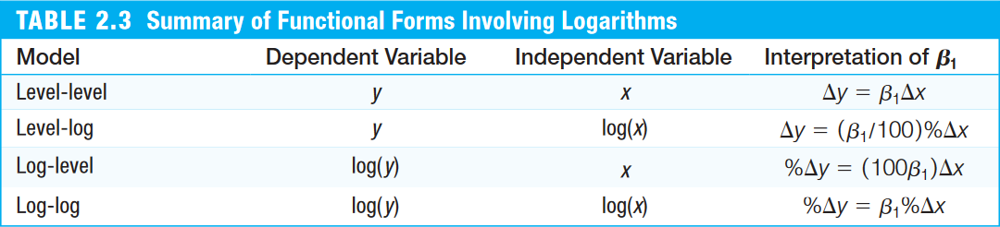

```{r setup, include=FALSE}
knitr::opts_chunk$set(echo = TRUE)
```


## Regressão simples por OLS
- [Seção 2.1 de Heiss (2020)](http://www.urfie.net/read/index.html#page/93)
- Considere o seguinte modelo empírico
$$ y = \beta_0 + \beta_1 x + \varepsilon \tag{2.1} $$
- Os estimadores de mínimos quadrados ordinários (OLS), segundo Wooldridge (2006, Seção 2.2) é dado por

\begin{align}
    \hat{\beta}_0 &= \bar{y} - \hat{\beta}_1 \bar{x} \tag{2.2}\\
    \hat{\beta}_1 &= \frac{cov(x,y)}{var(x)} \tag{2.3}
\end{align}

- E os valores ajustados/preditos, $\hat{y}$ é dado por
$$ \hat{y} = \hat{\beta}_0 + \hat{\beta}_1 x \tag{2.4} $$
tal que 
$$ y = \hat{y} + \hat{\varepsilon} $$

### Exemplo 2.3: Salário de Diretores Executivos e Retornos de Ações

- Considere o seguinte modelo de regressão simples
$$ \text{salary} = \beta_0 + \beta_1 \text{roe} + \varepsilon $$
em que `salary` é a remuneração de um diretor executivo em milhares de dólares e `roe` é o retorno sobre o investimento em percentual.


#### Estimando regressão simples "na mão"

```{r message=FALSE, warning=FALSE}
# Carregando a base de dados do pacote 'wooldridge'
data(ceosal1, package="wooldridge")

attach(ceosal1) # para não precisar escrever 'ceosal1$' antes de toda variável

cov(salary, roe) # covariância entre variável dependente e independente
var(roe) # variância do retorno sobre o investimento
mean(roe) # média do retorno sobre o investimento
mean(salary) # média do salário

# Cálculo "na mão" das estimativas de OLS
b1hat = cov(salary, roe) / var(roe) # por (2.3)
b1hat
b0hat = mean(salary) - var(roe)*mean(salary) # por (2.2)
b0hat

detach(ceosal1) # para parar de procurar variável dentro do objeto 'ceosal1'
```

- Vemos que um incremento de uma unidade (porcento) no retorno sobre o investimento (_roe_), aumentar 18 unidades (milhares de dólares) nos salários dos diretores executivos.


#### Estimando regressão simples via `lm()`
- Uma maneira mais conveniente de fazer a estimação por OLS é usando a função `lm()`
- Em um modelo univariado, inserimos dois vetores (variáveis dependente e independente) separados por um til (`~`):
```{r}
lm(ceosal1$salary ~ ceosal1$roe)
```

- Também podemos deixar de usar o prefixo `ceosal1$` antes dos nomes do vetores preenchermos o argumento `data = ceosal1`
```{r}
lm(salary ~ roe, data=ceosal1)
```

- Podemos usar a função `lm()` para incluir uma reta de regressão no gráfico
```{r message=FALSE}
# Gráfico de dispersão (scatter)
plot(ceosal1$roe, ceosal1$salary)

# Adicionando a reta de regressão
abline(lm(salary ~ roe, data=ceosal1), col="red")
```


</br>

## Coeficientes, Valores Ajustados e Resíduos
- [Seção 2.2 de Heiss (2020)](http://www.urfie.net/read/index.html#page/98)
- Podemos "guardar" os resultados da estimação em um objeto (da classe `list`) e, depois, extrair informações dele.
```{r}
# atribuindo o resultado da regressão em um objeto
CEOregres = lm(salary ~ roe, data=ceosal1)

# verificando os "nomes" das informações contidas no objeto
names(CEOregres)
```

- Podemos usar a função `coef()` para extrairmos um data frame com os coeficientes da regressão
```{r}
# Extraindo vetor de coeficientes da regressão
bhat = coef(CEOregres)
bhat

b0hat = bhat["(Intercept)"] # ou bhat[1]
b1hat =  bhat["roe"] # ou bhat[2]
```

- Dados estes parâmetros estimados, podemos calcular os valores ajustados/preditos, $\hat{y}$, e os desvios, $\hat{\varepsilon}$, para cada observação $i=1, ..., n$:

\begin{align}
    \hat{y}_i &= \hat{\beta}_0 + \hat{\beta}_1 . x_i \tag{2.5} \\
    \hat{\varepsilon}_i &= y_i - \hat{y}_i \tag{2.6}
\end{align}

```{r}
# Extraindo colunas de ceosal1 em vetores
sal = ceosal1$salary
roe = ceosal1$roe

# Calculando os valores ajustados/preditos
sal_hat = b0hat + (b1hat * roe)

# Calculando os desvios
ehat = sal - sal_hat

# Visualizando as 6 primerias linhas de sal, roe, sal_hat e ehat
head( cbind(sal, roe, sal_hat, ehat) )
```

- Com as funções `fitted()` e `resid()` podemos extrair os valores ajustados e os resíduos do objeto com resultado da regressão:
```{r}
head( cbind(fitted(CEOregres), resid(CEOregres)) )

# Ou também
head( cbind(CEOregres$fitted.values, CEOregres$residuals) )
```


- Na seção 2.3 de Wooldridge (2006), vemos que a estimação por OLS usa as seguintes hipóteses:
\begin{align}
    &\sum^n_{i=1}{\hat{\varepsilon}_i} = 0 \quad \implies \quad \bar{\hat{\varepsilon}} = 0 \tag{2.7} \\
    &\sum^n_{i=1}{x_i \hat{\varepsilon}_i} = 0 \quad \implies \quad cov(x,\hat{\varepsilon}) = 0 \tag{2.8} \\
    &\bar{y}=\hat{\beta}_0 + \hat{\beta}_1.\bar{x} \tag{2.9}
\end{align}

- Podemos verificá-los em nosso exemplo:
```{r}
# Verificando (2.7)
mean(ehat) # bem próximo de 0

# Verificando (2.8)
cor(ceosal1$roe, ehat) # bem próximo de 0

# Verificando (2.9)
mean(ceosal1$salary)
mean(sal_hat)
```

- **IMPORTANTE**: Isso só quer dizer que o OLS escolhe $\hat{\beta}_0$ e $\hat{\beta}_1$ tais que 2.7, 2.8 e 2.9 sejam verdadeiros.
- Isto **NÃO** quer dizer que, para o modelo real as seguintes hipóteses sejam verdadeiras:
\begin{align}
    &E(\varepsilon) = 0 \tag{2.7'} \\
    &E(x\varepsilon) = 0 \quad \Longrightarrow \quad cov(x, \varepsilon) = 0 \tag{2.8'}
\end{align}
- De fato, se 2.7' e 2.8' não forem válidos, a estimação por OLS (que assume 2.7 e 2.8) será viesada.


</br>

## Transformações log
- [Seção 2.4 de Heiss (2020)](http://www.urfie.net/read/index.html#page/103)
- Também podemos fazer estimações transformando variáveis em nível para logaritmo.
- É especialmente importante para transformar modelos não-lineares em lineares - quando o parâmetro está no expoente ao invés estar multiplicando:
  
$$ y = A K^\alpha L^\beta\quad \overset{\text{log}}{\rightarrow}\quad \log(y) = \log(A) + \alpha \log(K) + \beta \log(L) $$

- Também é frequentemente utilizada em variáveis dependentes $y \ge 0$


<center></center>

- Há duas maneiras de fazer a transformação log:
    - Criar um novo vetor/coluna com a variável em log, ou
    - Usar a função `log()` diretamente no vetor dentro da função `lm()`


### Exemplo 2.11: Salário de Diretores Executivos e Vendas das Empresas
- Considere as variáveis:
    - `wage`: salário anual em milhares de dólares
    - `sales`: vendas em milhões de dólares


- _Modelo nível-nível_:
```{r}
# Carregando a base de dados
data(ceosal1, package="wooldridge")

# Estimando modelo nível-nível
lm(salary ~ sales, data=ceosal1)$coef
```

- _Modelo log-nível_:
```{r}
# Estimando modelo log-nível
lm(log(salary) ~ sales, data=ceosal1)$coef
```

- _Modelo log-log_:
```{r}
# Estimando modelo log-log
lm(log(salary) ~ log(sales), data=ceosal1)$coef
```


</br>

## Regressão a partir da origem ou sobre uma constante
- [Seção 2.5 de Heiss (2020)](http://www.urfie.net/read/index.html#page/103)
- Para esstimar o modelo sem o intercepto (constante), precisamos adicionar um `0` ou `-1` nos regressores na função `lm()`:
```{r}
data(ceosal1, package="wooldridge")
lm(salary ~ 0 + roe, data=ceosal1)
```

- Ao regredirmos uma variável dependente sobre uma constante (1), obtemos a média desta variável.
```{r}
lm(salary ~ 1, data=ceosal1)
mean(ceosal1$salary, na.rm=TRUE)
```


</br>


## Qualidade do ajuste
- [Seção 2.3 de Heiss (2020)](http://www.urfie.net/read/index.html#page/101)
- A soma de quadrados total (SST), a soma de quadrados explicada (SSE) e a soma de quadrados dos resíduos (SSR) podem ser escritos como:

\begin{align}
    SST &= \sum^n_{i=1}{(y_i - \bar{y})^2} = (n-1) . var(y) \tag{2.10}\\
    SSE &= \sum^n_{i=1}{(\hat{y}_i - \bar{y})^2} = (n-1) . var(\hat{y}) \tag{2.11}\\
    SSR &= \sum^n_{i=1}{(\hat{\varepsilon}_i - 0)^2} = (n-1) . var(\hat{\varepsilon}) \tag{2.12}
\end{align}
em que $var(x) = \frac{1}{n-1} \sum^n_{i=1}{(x_i - \bar{x})^2}$.

- Wooldridge (2006) define o coeficiente de determinação como:
\begin{align}
    R^2 &= \frac{SSE}{SST} = 1 - \frac{SSR}{SST}\\
        &= \frac{var(\hat{y})}{var(y)} = 1 - \frac{var(\hat{\varepsilon})}{var(y)} \tag{2.13}
\end{align}
pois $SST = SSE + SSR$.

```{r}
# Calculando SST, SSE e SSR
SST = t(sal - mean(sal)) %*% (sal - mean(sal)) # produto interno y'y
SSE = t(sal_hat - mean(sal)) %*% (sal_hat - mean(sal)) # produto interno yhat'yhat
SSR = t(ehat) %*% ehat # produto interno ehat'ehat

# Calculando R^2
SSE/SST
var(sal_hat)/var(sal) # "SSE/SST"
1 - SSR/SST
1 - var(ehat)/var(sal) # 1 - "SSR/SST"
```

- Para obter o $R^2$ de forma mais conveniente, pode-se usar a função `summary()` sobre o objeto de resultado da regressão. Esta função fornece uma visualização dos resultados mais detalhada, incluindo o $R^2$:
```{r}
summary(CEOregres)
```


</br>

## Diferença de médias
- Baseado no Exemplo C.6: Efeito de subsídios de treinamento corporativo sobre a produtividade do trabalhador 
- Poderíamos ter calculado a diferença de médias por meio de uma regressão sobre uma variável _dummy_, cujos valores são 0 ou 1.
- Primeiro vamos criar um vetor único de taxas de refugo (vamos empilhar `SR87` e `SR88`)
```{r}
SR87 = c(10, 1, 6, .45, 1.25, 1.3, 1.06, 3, 8.18, 1.67, .98,
         1, .45, 5.03, 8, 9, 18, .28, 7, 3.97)
SR88 = c(3, 1, 5, .5, 1.54, 1.5, .8, 2, .67, 1.17, .51, .5, 
         .61, 6.7, 4, 7, 19, .2, 5, 3.83)

SR = c(SR87, SR88) # empilhando SR87 e SR88 em único vetor
SR
```

- Note que os 20 primeiros valores são relativos às taxas de refugo no ano de 1987 e os 20 últimos valores são de 1988.
- Vamos criar uma variável _dummy_ chamada de _group88_ que atribui valor 1 as observações do ano de 1988 e o valor 0 para as de 1987:
```{r}
group88 = c(rep(0, 20), rep(1, 20)) # 0/1 para 20 primeiras/últimas observ
group88
```

- Ao regredirmos a taxa de refugo em relação à _dummy_ obtemos a diferença das médias
```{r}
lm(SR ~ group88)
```


</br>


## Violações de hipótese
- [Subseção 2.7.3 de Heiss (2020)](http://www.urfie.net/read/index.html#page/113), mas usando exemplo distinto.
- [Simulating a linear model (John Hopkins/Coursera)](https://www.coursera.org/learn/r-programming/lecture/u7in9/simulation-simulating-a-linear-model)
- Na prática, fazemos regressões a partir de observações contidas em bases de dados e não sabemos qual é o _modelo real_ que gerou essas observações.
- No R, podemos supor esse _modelo real_ e simular suas observações no R para analisar o que ocorre quando há violação de uma premissa de um modelo econométrico.
- Usaremos como exemplo a relação das horas de prática em culinária com o número de queimaduras na cozinha.


### Sem violação de hipótese: Exemplo 1
- Sejam $y$ o número de queimaduras na cozinha e $x$ o número de horas gastas aprendendo a cozinhar.
- Suponha o _modelo real_:
$$ y = \tilde{\beta}_0 + \tilde{\beta}_1 x + \tilde{\varepsilon}, \qquad \tilde{\varepsilon} \sim N(0, 2^2) \tag{1}$$
em que $\tilde{\beta}_0=50$ e $\tilde{\beta}_1=-5$.

1. Iremos definir $\tilde{\beta}_0$ e $\tilde{\beta}_1$, e gerar, por simulação, as observações de $x$ e $y$:
    - Geraremos valores aleatórios $x \sim U(1, 9)$. Isso é apenas para facilitar, não importa a distribuição de $x$. 
```{r}
b0til = 50
b1til = -5
N = 500 # Número de observações

set.seed(1)
e_til = rnorm(N, 0, 2) # Desvios: 500 obs. de média 0 e desv pad 2
x = runif(N, 1, 9) # Gerando 500 obs. de x
y = b0til + b1til*x + e_til # calculando observações y

plot(x, y)
```
    
  - Simulamos as observações $x$ e $y$ que são, na prática, as informações que observamos nas bases de dados.

2. Estimaremos, por OLS, os parâmetros $\hat{\beta}_0$ e $\hat{\beta}_1$ a partir das observações simuladas de $y$ e $x$:
    - Um pesquisador supôs a relação entre as variáveis pelo seguinte _modelo empírico_:
    $$ y = \beta_0 + \beta_1 x + \varepsilon, \tag{1a}$$
    assumindo que $E[\varepsilon] = 0$ e $cov(\varepsilon, x)= 0=0$.
    - Para estimar o modelo por OLS, usamos a função `lm()`
    
```{r}
lm(y ~ x) # regredindo por OLS a var. dependente y pela var. x
```

- Note que foi possível recuperar os parâmetros reais:
  - $\hat{\beta}_0 = 50,268 \approx 50 = \tilde{\beta}_0$ e
  - $\hat{\beta}_1 = -5,039 \approx -5 = \tilde{\beta}_1$.

```{r}
plot(x, y) # Figura de x contra y
abline(a=50, b=-5, col="red") # reta do modelo real
abline(lm(y ~ x), col="blue") # reta estimada a partir das observações
```

### Sem violação de hipótese: Exemplo 2
- Agora, no _modelo real_, suponha que o número de queimaduras $y$ é determinado tanto pela quantidade de horas de aprendizado $x$ e pela quantidade de horas gastas cozinhando $z$:

$$ y = \tilde{\beta}_0 + \tilde{\beta}_1 x + \tilde{\beta}_2 z + \tilde{\varepsilon}, \qquad \tilde{\varepsilon} \sim N(0, 2^2) \tag{2} $$
em que $\beta_0=50$, $\beta_1=-5$ e $\beta_2=3$. Apenas para facilitar, usaremos geraremos valores aleatórios de $x \sim U(1, 9)$ e $z \sim N(11, 15)$. Note que $z$, por construção, **não** é correlacionada com $x$ no _modelo real_.

- Primeiro, vamos simular as observações:
```{r}
b0til = 50
b1til = -5
b2til = 3
N = 500 # Número de observações

set.seed(1)
e_til = rnorm(N, 0, 2) # Desvios: 500 obs. de média 0 e desv pad 2
x = runif(N, 1, 9) # Gerando 500 obs. de x
z = runif(N, 11, 15) # Gerando 500 obs. de y
y = b0til + b1til*x + b2til*z + e_til # calculando observações y
```

- Considere que um pesquisador suponha a relação entre as variáveis pelo seguinte _modelo empírico_:
    $$ y = \beta_0 + \beta_1 x + \varepsilon, \tag{2a}$$
    assumindo que $E[\varepsilon] = 0$ e $cov(\varepsilon, x)= 0$.

- Note que o pesquisador deixou a variável de horas cozinhando $z$ fora do modelo, então ela acaba ``entrando'' no erro da estimação.
- No entanto, como $z$ não tem relação com $x$, então isso não afeta a estimativa de $\hat{\beta}_1$:
```{r}
cor(x, z) # correlação de x e z -> próxima de 0
lm(y ~ x) # estimação por OLS
```
- Note que $\hat{\beta}_1 = -5,12 \approx -5 = \tilde{\beta}_1$, portanto a estimação por OLS conseguiu recuperar o parâmetro real, apesar do pesquisador não ter incluído $z$ no modelo.
- Grande parte dos estudos econômicos tentam estabelecer a relação/causalidade entre $y$ e alguma variável de interesse $x$, então não é necessário incluir todas possíveis variáveis que impactam $y$, desde que $cov(\varepsilon, x) = 0$. Ou seja, que nenhuma variável explicativa correlacionada com $x$ tenha ``ficado de fora'' e, portanto, compondo o termo de erro.


### Violação de cov(e,x) = 0
- Agora, suponha que, no _modelo real_, quanto mais horas a pessoa pratica culinária, mais ele cozinha (ou seja, $x$ está relacionada com $z$).
    - Considere que $z = 2,5x + \varepsilon, \quad \varepsilon \sim N(0; (0,25)^2)$:
    
```{r}
set.seed(1)
e_til = rnorm(N, 0, 2) # Desvios: 500 obs. de média 0 e desv pad 2
x = runif(N, 1, 9) # Gerando 500 obs. de x
z = 2.5*x + rnorm(N, 0, 0.25) # Gerando 500 obs. de z
y = b0til + b1til*x + b2til*z + e_til # calculando observações y
cor(x, z) # correlação de x e z
```

- Note que, agora, $x$ e $z$ são consideravalmente correlacionados
- Vamos estimar o _modelo empírico_:
    $$ y = \beta_0 + \beta_1 x + \varepsilon,$$
    assumindo que $E[\varepsilon] = 0$ e $cov(\varepsilon, x)= 0$.
    
```{r}
lm(y ~ x) # estimação por OLS
```

- Observe que $\hat{\beta}_1 = 0,5 \neq -5 = \tilde{\beta}_1$. Isto se dá porque $z$ não foi incluído no modelo e, portanto, ele acaba compondo o resíduo $\hat{\varepsilon}$. Como $z$ é correlacionado com $x$, então $cov(\varepsilon, x)\neq 0$ (violando a hipótese do OLS).
- Observe que, se incluíssemos a variável $z$ na estimação, conseguiríamos recuperar $\hat{\beta}_1 \approx \tilde{\beta}_1$:

```{r}
lm(y ~ x + z)
```

### Violação de E(e) = 0, porém constante
- Agora, consideraremos que $E[\varepsilon] = k$, sendo $k \neq 0$ uma constante.
- Assuma que $k = 10$:
```{r}
b0til = 50
b1til = -5
k = 10

set.seed(1)
e_til = rnorm(N, k, 2) # Desvios: 500 obs. de média k e desv pad 2
x = runif(N, 1, 9) # Gerando 500 obs. de x
y = b0til + b1til*x + e_til # calculando observações y
```
- Caso um pesquisador assuma $E[\varepsilon] = 0$, segue que:
```{r}
lm(y ~ x) # estimação por OLS
```
- Note que o fato de $E[\varepsilon] \neq 0$ afeta apenas a estimação de $\hat{\beta}_0 \neq \tilde{\beta}_0$, porém não afeta a de $\hat{\beta}_1 \approx \tilde{\beta}_1$, que é normalmente o parâmetro de interesse em estudos econômicos.


### Violação de var(e|x) = constante (homocedasticidade)
- Agora, consideraremos que $\varepsilon \sim N(0, (5x)^2)$, ou seja, a variância cresce com $x$ -- $var(\varepsilon|x) \neq $ constante (não vale homocedasticidade).

```{r}
b0til = 50
b1til = -5
N = 500

x = runif(N, 1, 9) # Gerando 500 obs. de x
e_til = rnorm(N, 0, 5*x) # Desvios: 500 obs. de média 0 e desv pad 5x
y = b0til + b1til*x + e_til # calculando observações y

plot(x, y) # visualizando heteroscedasticidade

lm(y ~ x) # estimação por OLS
```
- Note que, mesmo com heterocesdasticidade, é possível recuperar $\hat{\beta}_1 \approx \tilde{\beta}_1$ quando $N$ for grande (ainda é consistente). Mas, observe também que, se a amostra for pequena, mais provável é que $\hat{\beta}_1 \neq \tilde{\beta}_1$. Teste alguns $N$ menores.


</br>



