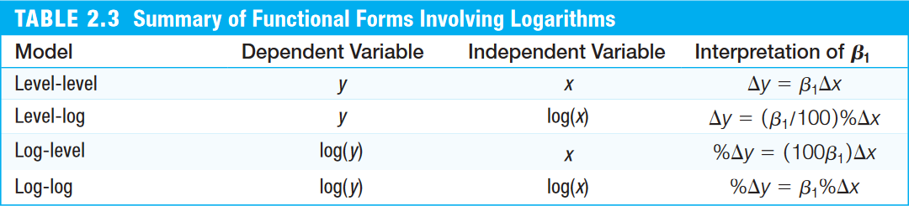

## Regressão simples por MQO
- [Seção 2.1 de Heiss (2020)](http://www.urfie.net/read/index.html#page/93)
- Considere o seguinte modelo empírico
$$ y = \beta_0 + \beta_1 x + \varepsilon \tag{2.1} $$
- Os estimadores de mínimos quadrados ordinários (MQO), segundo Wooldridge (2006, Seção 2.2) é dado por

\begin{align}
    \hat{\beta}_0 &= \bar{y} - \hat{\beta}_1 \bar{x} \tag{2.2}\\
    \hat{\beta}_1 &= \frac{cov(x,y)}{var(x)} \tag{2.3}
\end{align}

- E os valores ajustados/preditos, $\hat{y}$ é dado por
$$ \hat{y} = \hat{\beta}_0 + \hat{\beta}_1 x \tag{2.4} $$
e os resíduos podem ser obtidos por 
$$ \hat{\varepsilon} = y - \hat{y} $$

### Exemplo 2.3: Salário de CEO e Retorno sobre Equity

- Considere o seguinte modelo de regressão simples
$$ \text{salary} = \beta_0 + \beta_1 \text{roe} + \varepsilon $$
em que `salary` é a remuneração de um CEO em milhares de dólares e `roe` é o retorno sobre o patrimônio líquido em percentual.


#### Estimação Analítica ("na mão")


```r
# Carregando a base de dados do pacote 'wooldridge'
data(ceosal1, package="wooldridge")

cov(ceosal1$salary, ceosal1$roe) # covariância entre salary e roe
```

```
## [1] 1342.538
```

```r
var(ceosal1$roe) # variância do retorno sobre o patrimônio líquido
```

```
## [1] 72.56499
```

```r
mean(ceosal1$roe) # média do retorno sobre o patrimônio líquido
```

```
## [1] 17.18421
```

```r
mean(ceosal1$salary) # média do salário
```

```
## [1] 1281.12
```

```r
# Cálculo "na mão" das estimativas de MQO
b1hat = cov(ceosal1$salary, ceosal1$roe) / var(ceosal1$roe) # por (2.3)
b1hat
```

```
## [1] 18.50119
```

```r
b0hat = mean(ceosal1$salary) - b1hat*mean(ceosal1$roe) # por (2.2)
b0hat
```

```
## [1] 963.1913
```

- Vemos que um incremento de uma unidade (porcento) no retorno sobre o patrimônio líquido (_roe_), aumentar 18 unidades (milhares de dólares) nos salários dos CEOs.


#### Estimação via `lm()`
- Uma maneira mais conveniente de fazer a estimação por MQO é usando a função `lm()`
- Em um modelo univariado, inserimos dois vetores (variáveis dependente e independente) separados por um til (`~`):

```r
lm(ceosal1$salary ~ ceosal1$roe)
```

```
## 
## Call:
## lm(formula = ceosal1$salary ~ ceosal1$roe)
## 
## Coefficients:
## (Intercept)  ceosal1$roe  
##       963.2         18.5
```

- Também podemos deixar de usar o prefixo `ceosal1$` antes dos nomes do vetores ao preenchermos o argumento `data = ceosal1`

```r
lm(salary ~ roe, data=ceosal1)
```

```
## 
## Call:
## lm(formula = salary ~ roe, data = ceosal1)
## 
## Coefficients:
## (Intercept)          roe  
##       963.2         18.5
```

- Podemos usar a função `lm()` para incluir uma reta de regressão no gráfico

```r
# Gráfico de dispersão (scatter)
plot(ceosal1$roe, ceosal1$salary)

# Adicionando a reta de regressão
abline(lm(salary ~ roe, data=ceosal1), col="red")
```


</br>

## Coeficientes, Valores Ajustados e Resíduos
- [Seção 2.2 de Heiss (2020)](http://www.urfie.net/read/index.html#page/98)
- Podemos "guardar" os resultados da estimação em um objeto (da classe `list`) e, depois, extrair informações dele.

```r
# atribuindo o resultado da regressão em um objeto
reg = lm(salary ~ roe, data=ceosal1)

# verificando os "nomes" das informações contidas no objeto
names(reg)
```

```
##  [1] "coefficients"  "residuals"     "effects"       "rank"         
##  [5] "fitted.values" "assign"        "qr"            "df.residual"  
##  [9] "xlevels"       "call"          "terms"         "model"
```

- Podemos usar a função `coef()` para extrairmos um data frame com os coeficientes da regressão

```r
# Extraindo vetor de coeficientes da regressão
bhat = coef(reg)
bhat
```

```
## (Intercept)         roe 
##   963.19134    18.50119
```

```r
b0hat = bhat["(Intercept)"] # ou bhat[1]
b1hat =  bhat["roe"] # ou bhat[2]
```

- Dados estes parâmetros estimados, podemos calcular os valores ajustados/preditos, $\hat{y}$, e os desvios, $\hat{\varepsilon}$, para cada observação $i=1, ..., n$:

\begin{align}
    \hat{y}_i &= \hat{\beta}_0 + \hat{\beta}_1 . x_i \tag{2.5} \\
    \hat{\varepsilon}_i &= y_i - \hat{y}_i \tag{2.6}
\end{align}


```r
# Extraindo variáveis de ceosal1 em vetores
sal = ceosal1$salary
roe = ceosal1$roe

# Calculando os valores ajustados/preditos
sal_hat = b0hat + (b1hat * roe)

# Calculando os desvios
ehat = sal - sal_hat

# Visualizando as 6 primerias linhas de sal, roe, sal_hat e ehat
head( cbind(sal, roe, sal_hat, ehat) )
```

```
##       sal  roe  sal_hat      ehat
## [1,] 1095 14.1 1224.058 -129.0581
## [2,] 1001 10.9 1164.854 -163.8543
## [3,] 1122 23.5 1397.969 -275.9692
## [4,]  578  5.9 1072.348 -494.3483
## [5,] 1368 13.8 1218.508  149.4923
## [6,] 1145 20.0 1333.215 -188.2151
```

- Com as funções `fitted()` e `resid()` podemos extrair os valores ajustados e os resíduos do objeto com resultado da regressão:

```r
head( cbind(fitted(reg), resid(reg)) )
```

```
##       [,1]      [,2]
## 1 1224.058 -129.0581
## 2 1164.854 -163.8543
## 3 1397.969 -275.9692
## 4 1072.348 -494.3483
## 5 1218.508  149.4923
## 6 1333.215 -188.2151
```

```r
# Ou também
head( cbind(reg$fitted, reg$residuals) )
```

```
##       [,1]      [,2]
## 1 1224.058 -129.0581
## 2 1164.854 -163.8543
## 3 1397.969 -275.9692
## 4 1072.348 -494.3483
## 5 1218.508  149.4923
## 6 1333.215 -188.2151
```


- Na seção 2.3 de Wooldridge (2006), vemos que a estimação por MQO usa as seguintes hipóteses:
\begin{align}
    &\sum^n_{i=1}{\hat{\varepsilon}_i} = 0 \quad \implies \quad \bar{\hat{\varepsilon}} = 0 \tag{2.7} \\
    &\sum^n_{i=1}{x_i \hat{\varepsilon}_i} = 0 \quad \implies \quad cov(x,\hat{\varepsilon}) = 0 \tag{2.8}
\end{align}

- Podemos verificá-los em nosso exemplo:

```r
# Verificando (2.7)
mean(ehat) # bem próximo de 0
```

```
## [1] -2.666235e-14
```

```r
# Verificando (2.8)
cov(ceosal1$roe, ehat) # bem próximo de 0
```

```
## [1] -7.012777e-13
```


<!-- - **IMPORTANTE**: Isso só quer dizer que o MQO escolhe $\hat{\beta}_0$ e $\hat{\beta}_1$ tais que 2.7 e 2.8 sejam verdadeiros. -->
<!-- - Isto **NÃO** quer dizer que, para o modelo real as seguintes hipóteses sejam verdadeiras: -->
<!-- \begin{align} -->
<!--     &E(\varepsilon) = 0 \tag{2.7'} \\ -->
<!--     &E(x\varepsilon) = 0 \quad \Longrightarrow \quad cov(x, \varepsilon) = 0 \tag{2.8'} -->
<!-- \end{align} -->
<!-- - De fato, se 2.7' e 2.8' não forem válidos, a estimação por MQO (que assume 2.7 e 2.8) será viesada. -->


</br>

## Transformações log
- [Seção 2.4 de Heiss (2020)](http://www.urfie.net/read/index.html#page/103)
- Também podemos fazer estimações transformando variáveis em nível para logaritmo.
- É especialmente importante para transformar modelos não-lineares em lineares - quando o parâmetro está no expoente ao invés estar multiplicando:
  
$$ y = A K^\alpha L^\beta\quad \overset{\text{log}}{\rightarrow}\quad \log(y) = \log(A) + \alpha \log(K) + \beta \log(L) $$

- Também é frequentemente utilizada em variáveis dependentes $y \ge 0$


<center></center>

- Há duas maneiras de fazer a transformação log:
    - Criar um novo vetor/coluna com a variável em log, ou
    - Usar a função `log()` diretamente no vetor dentro da função `lm()`


### Exemplo 2.11: Salário de CEO e Retorno sobre Equity

- _Modelo nível-log_:

```r
# Estimando modelo nível-log
lm(salary ~ log(roe), data=ceosal1)$coef
```

```
## (Intercept)    log(roe) 
##    586.5961    255.3113
```

- _Modelo log-nível_:

```r
# Estimando modelo log-nível
lm(log(salary) ~ roe, data=ceosal1)$coef
```

```
## (Intercept)         roe 
##  6.71216858  0.01386258
```

- _Modelo log-log_:

```r
# Estimando modelo log-log (elasticidade)
lm(log(salary) ~ log(roe), data=ceosal1)$coef
```

```
## (Intercept)    log(roe) 
##   6.4886473   0.1697382
```


</br>

## Regressão a partir da origem ou sobre uma constante
- [Seção 2.5 de Heiss (2020)](http://www.urfie.net/read/index.html#page/103)
- Para esstimar o modelo sem o intercepto (constante), precisamos adicionar um `0` ou `-1` nos regressores na função `lm()`:

```r
data(ceosal1, package="wooldridge")
lm(salary ~ 0 + roe, data=ceosal1)
```

```
## 
## Call:
## lm(formula = salary ~ 0 + roe, data = ceosal1)
## 
## Coefficients:
##   roe  
## 63.54
```

- Ao regredirmos uma variável dependente sobre uma constante (1), obtemos a média desta variável.

```r
lm(salary ~ 1, data=ceosal1)
```

```
## 
## Call:
## lm(formula = salary ~ 1, data = ceosal1)
## 
## Coefficients:
## (Intercept)  
##        1281
```

```r
mean(ceosal1$roe, na.rm=TRUE)
```

```
## [1] 17.18421
```


</br>


<!-- ## Qualidade do ajuste -->
<!-- - [Seção 2.3 de Heiss (2020)](http://www.urfie.net/read/index.html#page/101) -->
<!-- - A soma de quadrados total (SST), a soma de quadrados explicada (SSE) e a soma de quadrados dos resíduos (SSR) podem ser escritos como: -->

<!-- \begin{align} -->
<!--     SST &= \sum^n_{i=1}{(y_i - \bar{y})^2} = (n-1) . var(y) \tag{2.10}\\ -->
<!--     SSE &= \sum^n_{i=1}{(\hat{y}_i - \bar{y})^2} = (n-1) . var(\hat{y}) \tag{2.11}\\ -->
<!--     SSR &= \sum^n_{i=1}{(\hat{\varepsilon}_i - 0)^2} = (n-1) . var(\hat{\varepsilon}) \tag{2.12} -->
<!-- \end{align} -->
<!-- em que $var(x) = \frac{1}{n-1} \sum^n_{i=1}{(x_i - \bar{x})^2}$. -->

<!-- - Wooldridge (2006) define o coeficiente de determinação como: -->
<!-- \begin{align} -->
<!--     R^2 &= \frac{SSE}{SST} = 1 - \frac{SSR}{SST}\\ -->
<!--         &= \frac{var(\hat{y})}{var(y)} = 1 - \frac{var(\hat{\varepsilon})}{var(y)} \tag{2.13} -->
<!-- \end{align} -->
<!-- pois $SST = SSE + SSR$. -->

<!-- ```{r} -->
<!-- # Calculando SST, SSE e SSR -->
<!-- SST = t(sal - mean(sal)) %*% (sal - mean(sal)) # produto interno y'y -->
<!-- SSE = t(sal_hat - mean(sal)) %*% (sal_hat - mean(sal)) # produto interno yhat'yhat -->
<!-- SSR = t(ehat) %*% ehat # produto interno ehat'ehat -->

<!-- # Calculando R^2 -->
<!-- SSE/SST -->
<!-- var(sal_hat)/var(sal) # "SSE/SST" -->
<!-- 1 - SSR/SST -->
<!-- 1 - var(ehat)/var(sal) # 1 - "SSR/SST" -->
<!-- ``` -->

<!-- - Para obter o $R^2$ de forma mais conveniente, pode-se usar a função `summary()` sobre o objeto de resultado da regressão. Esta função fornece uma visualização dos resultados mais detalhada, incluindo o $R^2$: -->
<!-- ```{r} -->
<!-- summary(reg) -->
<!-- ``` -->


</br>


## Violações de hipótese
- [Subseção 2.7.3 de Heiss (2020)](http://www.urfie.net/read/index.html#page/113), mas usando exemplo distinto.
- [Simulating a linear model (John Hopkins/Coursera)](https://www.coursera.org/learn/r-programming/lecture/u7in9/simulation-simulating-a-linear-model)
- Na prática, fazemos regressões a partir de observações contidas em bases de dados e não sabemos qual é o _modelo real_ que gerou essas observações.
- No R, podemos supor esse _modelo real_ e simular suas observações no R para analisar o que ocorre quando há violação de uma premissa de um modelo econométrico.
- Usaremos como exemplo a relação das horas de treinamento em culinária com o número de queimaduras na cozinha.


### Sem violação de hipótese: Exemplo 1
- Sejam $y$ o número de queimaduras na cozinha e $x$ o número de horas de treinamento em culinária
- Suponha o _modelo real_:
$$ y = \tilde{\beta}_0 + \tilde{\beta}_1 x + \tilde{\varepsilon}, \qquad \tilde{\varepsilon} \sim N(0, 4^2) \tag{1}$$
em que $\tilde{\beta}_0=50$ e $\tilde{\beta}_1=-5$.

1. Iremos definir $\tilde{\beta}_0$ e $\tilde{\beta}_1$, e gerar, por simulação, as observações de $x$ e $y$:
    - Geraremos valores aleatórios de $x \sim U(1, 9)$ e de $\tilde{\varepsilon} \sim N(0, 4^2)$

```r
b0til = 50
b1til = -5
N = 1000 # Número de observações

set.seed(123)
e_til = rnorm(N, 0, 4) # Erros: 1000 obs. de média 0 e desv pad 2
x = runif(N, 1, 9) # Gerando 1000 obs. de x
y = b0til + b1til*x + e_til # calculando observações y

plot(x, y)
```


    
  - Simulamos as observações $x$ e $y$ que são, na prática, as informações que observamos nas bases de dados.

2. Estimaremos, por MQO, os parâmetros $\hat{\beta}_0$ e $\hat{\beta}_1$ a partir das observações simuladas de $y$ e $x$:
    - Um pesquisador supôs a relação entre as variáveis pelo seguinte _modelo empírico_:
    $$ y = \beta_0 + \beta_1 x + \varepsilon, \tag{1a}$$
    assumindo que $E[\varepsilon] = 0$ e $cov(\varepsilon, x) = 0$.
    - Para estimar o modelo por MQO, usamos a função `lm()`
    

```r
lm(y ~ x) # regredindo por MQO a var. dependente y pela var. x
```

```
## 
## Call:
## lm(formula = y ~ x)
## 
## Coefficients:
## (Intercept)            x  
##       49.86        -4.96
```

- Note que foi possível recuperar os parâmetros reais:
  - $\hat{\beta}_0 \approx 50 = \tilde{\beta}_0$ e
  - $\hat{\beta}_1 \approx -5 = \tilde{\beta}_1$.


```r
plot(x, y) # Figura de x contra y
abline(a=50, b=-5, col="red") # reta do modelo real
abline(lm(y ~ x), col="blue") # reta estimada a partir das observações
```


### Sem violação de hipótese: Exemplo 2
- Agora, no _modelo real_, suponha uma nova variável de quantidade de horas cozinhando $z$ que, a princípio, não tem relação com a quantidade de horas de treinamento em culinária:

$$ y = \tilde{\beta}_0 + \tilde{\beta}_1 x + \tilde{\beta}_2 z + \tilde{\varepsilon}, \qquad \tilde{\varepsilon} \sim N(0, 4^2) \tag{2} $$
em que $\beta_0=50$, $\beta_1=-5$ e $\beta_2=3$. Apenas para facilitar, geraremos também valores aleatórios de $z \sim U(11, 15)$ que, por construção, **não** é correlacionada com $x$.

- Primeiro, vamos simular as observações:

```r
b0til = 50
b1til = -5
b2til = 3
N = 1000 # Número de observações

set.seed(123)
e_til = rnorm(N, 0, 4) # Erros: 1000 obs. de média 0 e desv pad 2
x = runif(N, 1, 9) # Gerando 1000 obs. de x
z = runif(N, 11, 15) # Gerando 1000 obs. de y
y = b0til + b1til*x + b2til*z + e_til # calculando observações y
```

- Considere que um pesquisador suponha a relação entre as variáveis pelo seguinte _modelo empírico_:
    $$ y = \beta_0 + \beta_1 x + \varepsilon, \tag{2a}$$
    assumindo que $E[\varepsilon] = 0$ e $cov(\varepsilon, x)= 0$.

- Note que deixando a variável de horas cozinhando $z$ fora do modelo, ela entra no erro do modelo ($\varepsilon = \tilde{\beta}_2 z + \tilde{\varepsilon}$).
- No entanto, como $z$ não tem relação com $x$ ($cov(\varepsilon, x) = 0$), então isso não afeta a estimativa de $\hat{\beta}_1$:

```r
cor(x, z) # correlação de x e z -> próxima de 0
```

```
## [1] -0.05722716
```

```r
lm(y ~ x) # estimação por MQO
```

```
## 
## Call:
## lm(formula = y ~ x)
## 
## Coefficients:
## (Intercept)            x  
##      89.342       -5.046
```
- Note que $\hat{\beta}_1 = \approx -5 = \tilde{\beta}_1$, portanto a estimação por MQO conseguiu recuperar o parâmetro real, apesar da não-inclusão de $z$ no modelo.
- Grande parte dos estudos econômicos tentam estabelecer a relação/causalidade entre $y$ e alguma variável de interesse $x$, então não é necessário incluir todas possíveis variáveis que impactam $y$, desde que $cov(\varepsilon, x) = 0$.


### Violação de cov(e,x) = 0
- Agora, suponha que, no _modelo real_, quanto mais horas a pessoa pratica culinária, mais ele cozinha (ou seja, $x$ está relacionado com $z$).
    - Suponha $z = 2,5x + \tilde{u}, \quad \tilde{u} \sim N(0, 2^2)$:
    

```r
set.seed(123)
e_til = rnorm(N, 0, 4) # Erros: 1000 obs. de média 0 e desv pad 2
x = runif(N, 1, 9) # Gerando 1000 obs. de x
z = 2.5*x + rnorm(N, 0, 2) # Gerando 1000 obs. de z
y = b0til + b1til*x + b2til*z + e_til # calculando observações y
cor(x, z) # correlação de x e z
```

```
## [1] 0.9484694
```

- Note que, agora, $x$ e $z$ são consideravalmente correlacionados
- Vamos estimar o _modelo empírico_:
    $$ y = \beta_0 + \beta_1 x + \varepsilon,$$
    assumindo que $E[\varepsilon] = 0$ e $cov(\varepsilon, x)= 0$.
    

```r
lm(y ~ x) # estimação por MQO
```

```
## 
## Call:
## lm(formula = y ~ x)
## 
## Coefficients:
## (Intercept)            x  
##      49.529        2.604
```

- Observe que $\hat{\beta}_1 \neq -5 = \tilde{\beta}_1$. Isto se dá porque $z$ não foi incluído no modelo e, portanto, ele acaba compondo o erro $\varepsilon = \tilde{\beta}_2 z + \tilde{\varepsilon}$.
- Como $z$ é correlacionado com $x$, então $cov(\varepsilon, x)\neq 0$ (violando a hipótese do MQO).
- Observe que, se incluíssemos a variável $z$ na estimação, conseguiríamos recuperar $\hat{\beta}_1 \approx \tilde{\beta}_1$:


```r
lm(y ~ x + z)
```

```
## 
## Call:
## lm(formula = y ~ x + z)
## 
## Coefficients:
## (Intercept)            x            z  
##      49.850       -4.663        2.882
```

### Violação de E(e) = 0, porém constante
- Agora, consideraremos que $E[\varepsilon] = k$, sendo $k \neq 0$ uma constante.
- Assuma que $k = 100$:

```r
b0til = 50
b1til = -5
k = 100

set.seed(123)
e_til = rnorm(N, k, 2) # Erros: 1000 obs. de média k e desv pad 2
x = runif(N, 1, 9) # Gerando 1000 obs. de x
y = b0til + b1til*x + e_til # calculando observações y
```
- Caso um pesquisador assuma $E[\varepsilon] = 0$, segue que:

```r
lm(y ~ x) # estimação por MQO
```

```
## 
## Call:
## lm(formula = y ~ x)
## 
## Coefficients:
## (Intercept)            x  
##      149.93        -4.98
```
- Note que o fato de $E[\varepsilon] \neq 0$ afeta apenas a estimação de $\hat{\beta}_0 \neq \tilde{\beta}_0$, porém não afeta a de $\hat{\beta}_1 \approx \tilde{\beta}_1$, que é normalmente o parâmetro de interesse em estudos econômicos.


### Violação de var(e|x) = constante (homocedasticidade)
- Agora, consideraremos que $\varepsilon \sim N(0, (5x)^2)$, ou seja, a variância cresce com $x\ \implies \ var(\varepsilon|x) \neq $ constante (heterocedasticidade).


```r
b0til = 50
b1til = -5
N = 1000

set.seed(123)
x = runif(N, 1, 9) # Gerando 1000 obs. de x
e_til = rnorm(N, 0, 5*x) # Erros: 1000 obs. de média 0 e desv pad 5x
y = b0til + b1til*x + e_til # calculando observações y
lm(y ~ x) # estimação por MQO
```

```
## 
## Call:
## lm(formula = y ~ x)
## 
## Coefficients:
## (Intercept)            x  
##      51.243       -5.229
```

```r
plot(x, y) # visualizando heteroscedasticidade
abline(a=b0til, b=b1til, col="red") # modelo real
abline(lm(y ~ x), col="blue") # modelo estimado
```


- Mesmo com heterocesdasticidade, é possível recuperar $\hat{\beta}_1 \approx \tilde{\beta}_1$, pois o estimador de MQO permanece não-viesado.
- Heterocedasticidade compromete apenas a inferência (cálculo dos erros padrão, estatísticas t, e p-valor), tornando o estimador não-eficiente.


</br>



