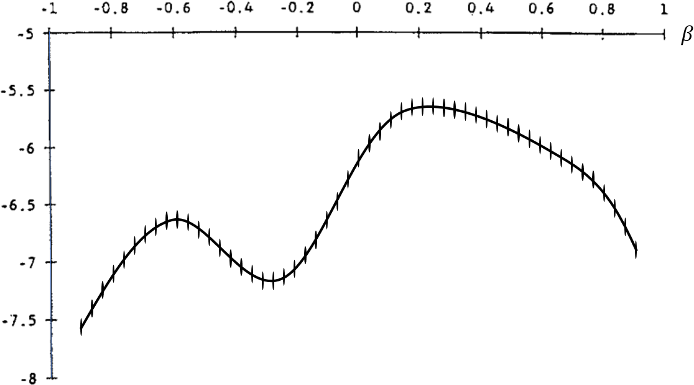
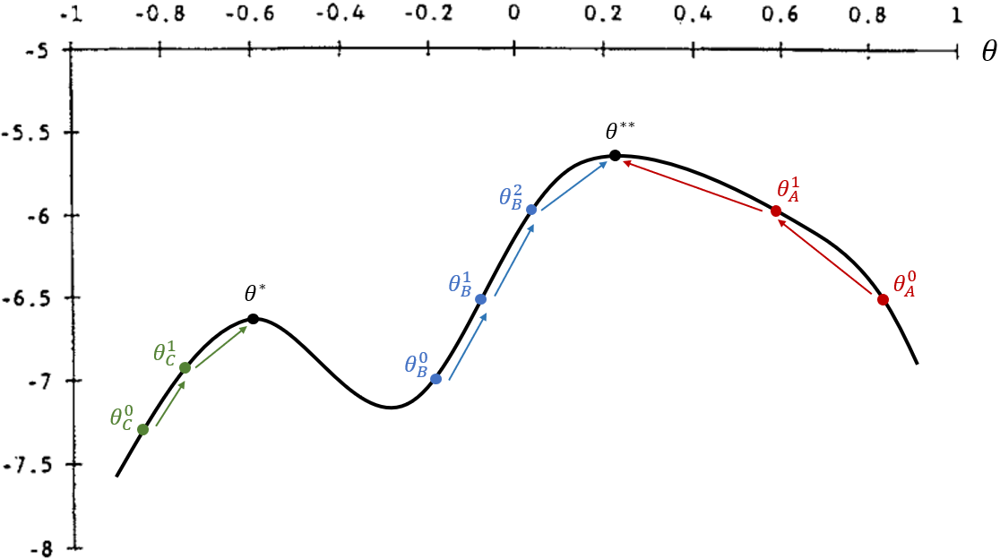
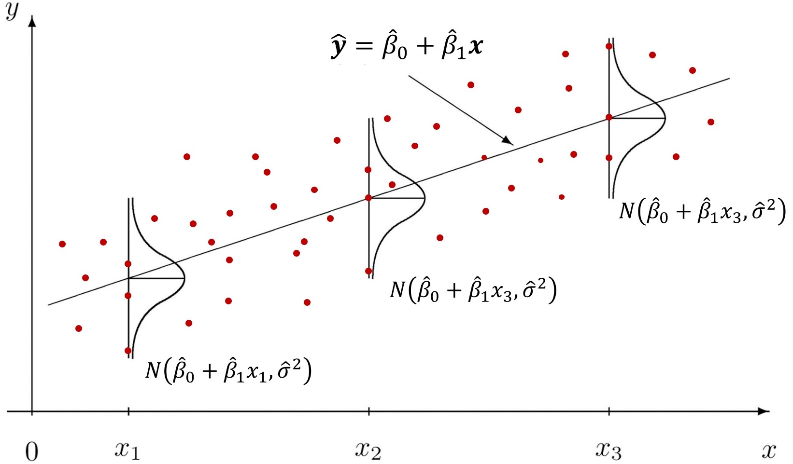

---
date: "2018-09-09T00:00:00Z"
# icon: book
# icon_pack: fas
linktitle: "Optimization"
summary: "Numerical optimization notes for econometrics, including grid search, steepest ascent, and optimization intuition linked to OLS estimation."
title: "Numerical Optimization for Econometrics"
weight: 7
output: md_document
type: book
---


## Numerical Optimization
- This section is meant to build intuition for numerical optimization methods.
- We will look at _grid search_ and _gradient ascent_ (_descent_), which represent two broad families of optimization methods.


### _Grid Search_

- The simplest numerical-optimization method is _grid search_ (discretization).
- Since R cannot handle optimization over an infinite continuum directly, one approach is to discretize the set of possible parameter values within chosen intervals.
- For each candidate parameter combination, we evaluate the objective function. We then choose the combination that maximizes or minimizes that objective.
- The example below considers only one choice parameter, $\theta$. For each point in the interval $[-1, 1]$, we evaluate the objective function:

<center></center>


- This method is robust to objective functions with discontinuities and kinks (nondifferentiable points), and it is less sensitive to initial guesses.
- However, it becomes accurate only when many grid points are used, and because the objective function must be evaluated at every point, _grid search_ tends to be computationally expensive.


### _Gradient Ascent (Descent)_


- As the number of model parameters grows, the number of possible parameter combinations rises rapidly, making grid-based search increasingly slow.
- A more efficient way to find the parameter vector that optimizes the objective is to use _gradient ascent_ (_descent_).
- The goal is to find ${\theta}^{**}$, the parameter value that globally maximizes the objective function.
- Steps to find a maximum:
  1. Start from an initial parameter value, ${\theta}^0$.
  2. Compute the derivative and check whether moving "uphill" increases the objective.
  3. If so, move in the appropriate direction to ${\theta}^1$.
  4. Repeat steps (2) and (3), moving to ${\theta}^2, {\theta}^3, ...$, until reaching a point where the derivative is zero.

<center></center>


- Notice that this optimization method is sensitive to the initial value and to discontinuities in the objective function.
    - In the figure, if the initial guess is ${\theta}^0_A$ or ${\theta}^0_B$, the algorithm reaches the global maximum.
    - If the initial guess is ${\theta}^0_C$, it converges to a local maximum at ${\theta}^*$, which is smaller than the global maximum at ${\theta}^{**}$.


<video width="500px" height="500px" controls="controls"/>
    <source src="../local-maxima.mp4" type="video/mp4">
</video>

- On the other hand, it is more efficient because the objective is evaluated only once per step, and it often yields more precise numerical solutions.


</br>

## Recovering OLS Through Different Strategies
- In this section, we recover OLS estimates using three strategies: (a) loss-function minimization, (b) maximum likelihood, and (c) the method of moments.
- In each case, we use a different objective to find the two-parameter vector $ \boldsymbol{\theta} = \{ \beta_0, \beta_1 \} $ that optimizes it. In R, we will call this vector `params`.


### The `mtcars` Dataset
We load the `dplyr` package to manipulate the dataset below.

```r
library(dplyr)
```

We use data from the 1974 _Motor Trend_ US magazine, which reports fuel consumption and 10 technical characteristics for 32 cars.

In R, this dataset is built in and can be accessed with the code `mtcars`. The relevant variables here are:

> - _mpg_: miles per gallon
> - _hp_: gross horsepower

We want to estimate the following model:
 $$ \text{mpg} = \beta_0 + \beta_1 \text{hp} + \varepsilon $$ 


```r
## OLS regression
reg = lm(formula = mpg ~ hp, data = mtcars)
summary(reg)$coef
```

```
##                Estimate Std. Error   t value     Pr(>|t|)
## (Intercept) 30.09886054  1.6339210 18.421246 6.642736e-18
## hp          -0.06822828  0.0101193 -6.742389 1.787835e-07
```


### (a) Loss-Function Minimization
- The loss function used in decision theory here is the **sum of squared residuals**.
- Under this approach, we look for the estimates $\boldsymbol{\theta} = \{ \hat{\beta}_0,\ \hat{\beta}_1 \}$ that **minimize** this function.


#### 1. Create a Loss Function That Computes the Sum of Squared Residuals
- The function that computes the sum of squared residuals takes as inputs:
  - a **vector** of possible values for $\boldsymbol{\theta} = \{ \hat{\beta}_0,\ \hat{\beta}_1 \}$;
  - a **string** with the name of the dependent variable;
  - a **character vector** with the names of the regressors;
  - a dataset.

```r
resid_quad = function(params, yname, xname, data) {
  # Extract variables from the dataset as vectors
  y = as.matrix(data[yname])
  x = as.matrix(data[xname])
  
  # Extract parameters from params
  b0 = params[1]
  b1 = params[2]
  sig2 = params[3]
  
  yhat = b0 + b1 * x # fitted values
  e_hat = y - yhat # residuals = observed - fitted
  sum(e_hat^2)
}
```


#### 2. Optimization
- We now search for the parameters that minimize the loss function:

$$ \underset{\hat{\beta}_0, \hat{\beta}_1}{\text{argmin}} \sum_{i=1}^{N}\hat{u}^2 \quad = \quad \underset{\hat{\beta}_0, \hat{\beta}_1}{\text{argmin}} \sum_{i=1}^{N}\left( \text{mpg}_i - \widehat{\text{mpg}}_i \right)^2 $$

- To do so, we use `optim()`, which returns the parameters that minimize a function, the numerical equivalent of _argmin_:
```yaml
optim(par, fn, gr = NULL, ...,
      method = c("Nelder-Mead", "BFGS", "CG", "L-BFGS-B", "SANN", "Brent"),
      lower = -Inf, upper = Inf,
      control = list(), hessian = FALSE)

par: Initial values for the parameters to be optimized over.
fn: A function to be minimized (or maximized), with first argument the vector of parameters over which minimization is to take place. It should return a scalar result.
method: The method to be used. See ‘Details’. Can be abbreviated.
hessian: Logical. Should a numerically differentiated Hessian matrix be returned?
```
- We provide as inputs:
  - the loss function `resid_quad()`;
  - an initial parameter guess;
    - note that optimization can be more or less sensitive to initial values depending on the method used;
    - a common neutral starting point is a zero vector such as `c(0, 0, 0)`;
    - in Econometrics III, Prof. Laurini recommended starting with the default `"Nelder-Mead"` method from zeros and then using those estimates as starting values for `"BFGS"`.
  - by default, `hessian = FALSE`; set it to `TRUE` if you want to recover standard errors, t statistics, and p-values from the Hessian.


```r
# Estimate by BFGS
theta_ini = c(0, 0) # initial guess for b0 and b1

fit_ols2 = optim(par=theta_ini, fn=resid_quad, 
                 yname="mpg", xname="hp", data=mtcars,
                 method="BFGS", hessian=TRUE)
fit_ols2
```

```
## $par
## [1] 30.09886054 -0.06822828
## 
## $value
## [1] 447.6743
## 
## $counts
## function gradient 
##       31        5 
## 
## $convergence
## [1] 0
## 
## $message
## NULL
## 
## $hessian
##      [,1]    [,2]
## [1,]   64    9388
## [2,] 9388 1668556
```


### (b) Maximum Likelihood
- [ResEcon 703](https://github.com/woerman/ResEcon703) - Week 6 (University of Massachusetts Amherst)
- Here the objective function is the likelihood function. Unlike the sum of squared residuals, we want to maximize it.
- In this example, we estimate 3 parameters:

$$ \boldsymbol{\theta} = \left\{ \beta_0, \beta_1, \sigma^2 \right\}. $$


#### Numerical Optimization for Maximum Likelihood
We use `optim()` again to perform the numerical optimization. The required inputs are:

- initial values for the parameters, $\boldsymbol{\theta}^0 = \{ \beta_0, \beta_1, \sigma^2 \}$;
- a function that takes those parameters as an argument and computes the log-likelihood, $\ln{L(\boldsymbol{\theta})}$.

> Since `optim()` minimizes the objective function, we need to adapt the log-likelihood output and minimize the negative log-likelihood instead.

The log-likelihood function is given by
$$ \ln{L(\beta_0, \beta_1, \sigma^2 | y, x)} = \sum^n_{i=1}{\ln{f(y_i | x_i, \beta_0, \beta_1, \sigma^2)}}, $$

where the conditional distribution of each $y_i$ is

$$ y_i | x_i \sim \mathcal{N}(\beta_0 + \beta_1 x_i, \sigma^2) $$

which implies that

$$\varepsilon_i | x_i \sim N(0, \sigma^2)$$

<center></center>

- The figure above shows that for each $x$, we have a fitted value $\hat{y} = \beta_0 + \beta_1 x$, and the disturbances $\varepsilon$ are normally distributed with common variance $\sigma^2$.


Steps to estimate a regression by maximum likelihood:

1. Choose initial values for the parameters.
2. Compute the fitted values, $\hat{y}$.
3. Compute the density for each observation $y_i$, namely $f(y_i | x_i, \beta_0, \beta_1, \sigma^2)$.
4. Compute the log-likelihood, $\ln{L(\beta_0, \beta_1, \sigma^2 | y, x)} = \sum^n_{i=1}{\ln{f(y_i | x_i, \beta_0, \beta_1, \sigma^2)}}$.


##### 1. Initial Values for $\beta_0, \beta_1$, and $\sigma^2$
- Unlike OLS, MLE also estimates the variance parameter ($\sigma^2$).

```r
params = c(30, -0.06, 1)
# (b0, b1 , sig2)
```

##### 2. Choose the Dataset and Variables

```r
## Initialize objects
yname = "mpg"
xname = "hp"
data = mtcars

# Extract dataset variables as vectors
y = as.matrix(data[yname])
x = as.matrix(data[xname])

# Extract parameter values from params
b0 = params[1]
b1 = params[2]
sig2 = params[3]
```

##### 3. Compute Fitted Values and Densities

```r
## Compute fitted values of y
yhat = b0 + b1 * x
head(yhat)
```

```
##                      hp
## Mazda RX4         23.40
## Mazda RX4 Wag     23.40
## Datsun 710        24.42
## Hornet 4 Drive    23.40
## Hornet Sportabout 19.50
## Valiant           23.70
```

##### 4. Compute the Densities
$$ f(y_i | x_i, \beta_0, \beta_1, \sigma^2) $$

```r
## Compute the pdf for each row
ypdf = dnorm(y, mean = yhat, sd = sqrt(sig2))

head(round(ypdf, 4)) # first density values
```

```
##                      mpg
## Mazda RX4         0.0224
## Mazda RX4 Wag     0.0224
## Datsun 710        0.1074
## Hornet 4 Drive    0.0540
## Hornet Sportabout 0.2897
## Valiant           0.0000
```

```r
sum(ypdf) # likelihood
```

```
## [1] 2.447628
```

```r
prod(ypdf) # likelihood product
```

```
## [1] 2.201994e-121
```
- Now let us combine the objects and inspect their first six rows:

```r
# Combine objects and inspect the first values
tab = cbind(y, x, yhat, round(ypdf, 4)) # round ypdf to 4 digits
colnames(tab) = c("y", "x", "yhat", "ypdf") # rename columns
head(tab)
```

```
##                      y   x  yhat   ypdf
## Mazda RX4         21.0 110 23.40 0.0224
## Mazda RX4 Wag     21.0 110 23.40 0.0224
## Datsun 710        22.8  93 24.42 0.1074
## Hornet 4 Drive    21.4 110 23.40 0.0540
## Hornet Sportabout 18.7 175 19.50 0.2897
## Valiant           18.1 105 23.70 0.0000
```
- As we can see from the combined table and the graphs below, the closer the fitted value is to the observed value for each observation, the higher the associated density/probability.

- Therefore, the likelihood, the product of all probabilities, increases when fitted values lie closer to their corresponding observed values.


##### 5. Compute the Log-Likelihood

The log-likelihood is the sum of the log of all probabilities:

$$ \mathcal{l}(\beta_0, \beta_1, \sigma^2) = \sum^{N}_{i=1}{\ln\left[ f(y_i | x_i, \beta_0, \beta_1, \sigma^2) \right]} $$

```r
## Compute the log-likelihood
loglik = sum(log(ypdf))
loglik
```

```
## [1] -277.8234
```


##### 6. Create the Log-Likelihood Function

Collecting the previous steps, we can create an R function that evaluates the log-likelihood.


```r
## Create a function to compute the OLS log-likelihood
loglik_lm = function(params, yname, xname, data) {
  # Extract variables from the dataset as vectors
  y = as.matrix(data[yname])
  x = as.matrix(data[xname])
  
  # Extract parameter values from params
  b0 = params[1]
  b1 = params[2]
  sig2 = params[3]
  
  ## Compute fitted values of y
  yhat = b0 + b1 * x
  
  ## Compute the pdf for each row
  ypdf = dnorm(y, mean = yhat, sd = sqrt(sig2))
  
  ## Compute the log-likelihood
  loglik = sum(log(ypdf))
  
  ## Return the negative log-likelihood
  -loglik # negative because optim() minimizes and we want to maximize
}
```


##### 7. Optimization

Now that we have the objective function, we use `optim()` to *minimize*

$$ -\ln{L(\beta_0, \beta_1, \sigma^2 | y, X)} = -\sum^n_{i=1}{\ln{f(y_i | x_i, \beta_0, \beta_1, \sigma^2)}}. $$

Here we **minimize the negative** log-likelihood in order to **maximize** the likelihood itself, since `optim()` only minimizes.


```r
## Maximize the OLS log-likelihood
mle = optim(par = c(0, 0, 1), fn = loglik_lm,
            yname = "mpg", xname = "hp", data = mtcars,
              method = "BFGS", hessian = TRUE)

## Show optimization results
mle
```

```
## $par
## [1] 30.09908613 -0.06822967 13.99015277
## 
## $value
## [1] 87.61931
## 
## $counts
## function gradient 
##       84       28 
## 
## $convergence
## [1] 0
## 
## $message
## NULL
## 
## $hessian
##               [,1]         [,2]          [,3]
## [1,]  2.287323e+00 3.355217e+02 -3.520739e-06
## [2,]  3.355217e+02 5.963323e+04  5.199112e-04
## [3,] -3.520739e-06 5.199112e-04  8.174375e-02
```

```r
## Compute standard errors
# Hessian -> inverse -> diagonal -> square root
mle_se = sqrt( diag( solve(mle$hessian) ) )

# Display estimates and standard errors
cbind(mle$par, mle_se)
```

```
##                      mle_se
## [1,] 30.09908613 1.58205585
## [2,] -0.06822967 0.00979809
## [3,] 13.99015277 3.49762080
```


### (c) Method of Moments
- [Computing Generalized Method of Moments and Generalized Empirical Likelihood with R (Pierre Chausse)](https://cran.r-project.org/web/packages/gmm/vignettes/gmm_with_R.pdf)
- [Generalized Method of Moments (GMM) in R - Part 1 (Alfred F. SAM)](https://medium.com/codex/generalized-method-of-moments-gmm-in-r-part-1-of-3-c65f41b6199)


- To estimate the model by GMM, we need to construct objects related to the following moments:

$$ E(\boldsymbol{\varepsilon}) = 0 \qquad \text{ e } \qquad E(\boldsymbol{\varepsilon}' \boldsymbol{x}) = 0 $$

Notice that these are precisely the moments underlying OLS, since OLS is a special case of GMM. The sample analogs are

$$ \frac{1}{N} \sum^N_{i=1}{\hat{\varepsilon}_i} = 0 \qquad \text{ e } \qquad \frac{1}{N} \sum^N_{i=1}{\hat{\varepsilon}_i.x_i} = 0 $$

We can compute both sample moments through a single matrix operation. Consider:

$$ \hat{\boldsymbol{\varepsilon}} = \begin{bmatrix} \varepsilon_1 \\ \varepsilon_2 \\ \vdots \\ \varepsilon_N \end{bmatrix} \qquad \text{e} \qquad \boldsymbol{x} = \begin{bmatrix} x_1 \\ x_2 \\ \vdots \\ x_N \end{bmatrix} $$

Join a column of 1s with $\boldsymbol{x}$ and define the matrix:
$$ \boldsymbol{X} = \begin{bmatrix} 1 & \varepsilon_1 \\ 1 & \varepsilon_2 \\ \vdots & \vdots \\ 1 & \varepsilon_N \end{bmatrix} $$

Then the matrix multiplication between $\hat{\boldsymbol{\varepsilon}}$ and $\boldsymbol{X}$ gives:

$$ \hat{\boldsymbol{\varepsilon}}' \boldsymbol{X}\ =\ \begin{bmatrix} \varepsilon_1 & \varepsilon_2 & \cdots & \varepsilon_N \end{bmatrix} \begin{bmatrix} 1 & x_1 \\ 1 & x_2 \\ \vdots & \vdots \\ 1 & x_N \end{bmatrix}\ =\ \begin{bmatrix}  \frac{1}{N} \sum^N_{i=1}{\hat{\varepsilon}} & \frac{1}{N} \sum^N_{i=1}{\hat{\varepsilon}.x_i} \end{bmatrix} $$

The resulting vector contains exactly the sample moments.


#### Numerical Optimization for GMM

##### 1. Initial Values for $\beta_0$ and $\beta_1$
- Let us create a vector with candidate values for $\beta_0, \beta_1$:

```r
params = c(30, -0.06)
yname = "mpg"
xname = "hp"
data = mtcars
```

##### 2. Choose the Dataset and Variables

```r
# Extract variables from the dataset as vectors
y = as.matrix(data[yname])
x = as.matrix(data[xname])
X = cbind(1, x)

# Extract parameter values from params
b0 = params[1]
b1 = params[2]
sig2 = params[3]
```

##### 3. Compute Fitted Values and Residuals

```r
## Fitted values of y
yhat = b0 + b1 * x

## Residuals
e_hat = y - yhat
```


##### 4. Create the Moment Matrix
- Notice that $\hat{\boldsymbol{\varepsilon}}' X$ is a vector of sample moments, but the `gmm()` function expects a matrix built from the **element-by-element multiplication** of the residual $\hat{\boldsymbol{\varepsilon}}$ and the covariates $\boldsymbol{X}$ (here: a constant and `hp`), in the form:

$$ \hat{\boldsymbol{\varepsilon}} \times \boldsymbol{X}\ =\ \begin{bmatrix} \varepsilon_1 \\ \varepsilon_2 \\ \vdots \\ \varepsilon_N \end{bmatrix} \times \begin{bmatrix} 1 & x_1 \\ 1 & x_2 \\ \vdots & \vdots \\ 1 & x_N \end{bmatrix}\ =\ \begin{bmatrix} \varepsilon_1 & \varepsilon_1.x_1  \\ \varepsilon_2 & \varepsilon_2.x_2 \\ \vdots & \vdots \\ \varepsilon_N & \varepsilon_N.x_N \end{bmatrix} $$
For GMM in R, we should not average each column ourselves; the `gmm()` function will do that internally.


```r
# Moment matrix
m = as.numeric(e_hat) * X 
head(m) # first 6 rows
```

```
##                              hp
## Mazda RX4         -2.40 -264.00
## Mazda RX4 Wag     -2.40 -264.00
## Datsun 710        -1.62 -150.66
## Hornet 4 Drive    -2.00 -220.00
## Hornet Sportabout -0.80 -140.00
## Valiant           -5.60 -588.00
```

```r
apply(m, 2, sum) # sum of each column
```

```
##                hp 
##   -35.46 -6400.62
```
- Because we multiply the constant term, equal to 1, by the residuals $\varepsilon$, the first column corresponds to the moment $E(\varepsilon)=0$ before taking expectations.
- The remaining columns correspond to moments of the form $E(\varepsilon'X)=0$ for the covariates.
- In GMM, we choose the parameters $\theta = \{ \beta_0, \beta_1 \}$ so that the sample moments are as close to zero as possible. The `gmm()` function handles this numerically, much like `optim()`.


##### 5. Create a Function That Returns the Moments
- We now create a function that takes a parameter vector (`params`) and data (`data`) as input, and returns a matrix in which each column represents one moment.
- This function bundles together the steps above, which were separated only for exposition.

```r
mom_ols = function(params, list) {
  # In GMM, only one argument besides the parameters is allowed
  # so we pass a list with 3 elements
  yname = list[[1]]
  xname = list[[2]]
  data = list[[3]]
  
  # Extract variables from the dataset as vectors
  y = as.matrix(data[yname])
  x = as.matrix(data[xname])
  X = cbind(1, x)
  
  # Extract parameter values from params
  b0 = params[1]
  b1 = params[2]
  sig2 = params[3]
  
  ## Fitted values of y
  yhat = b0 + b1 * x
  
  ## Residuals
  e_hat = y - yhat
  
  ## Moment matrix
  m = as.numeric(e_hat) * X
  m # function output
}
```


##### 6. Optimization via the `gmm()` Function
- Like `optim()`, the `gmm()` function takes another function as an argument.
- The key difference is that the function supplied to `gmm()` returns a matrix rather than a scalar, and `gmm()` chooses the parameters so that the column means are as close to zero as possible.

```r
library(gmm)
```

```
## Loading required package: sandwich
```

```r
gmm_lm = gmm(g=mom_ols, 
             x=list(yname="mpg", xname="hp", data=mtcars), # function arguments
             t0=c(0,0), # initial parameter guess
             wmatrix = "optimal", # weighting matrix
             optfct = "nlminb" # optimization routine
             )

summary(gmm_lm)$coefficients
```

```
##             Estimate Std. Error   t value     Pr(>|t|)
## Theta[1] 30.09886038 2.53115147 11.891371 1.312350e-32
## Theta[2] -0.06822828 0.01540378 -4.429319 9.453096e-06
```


