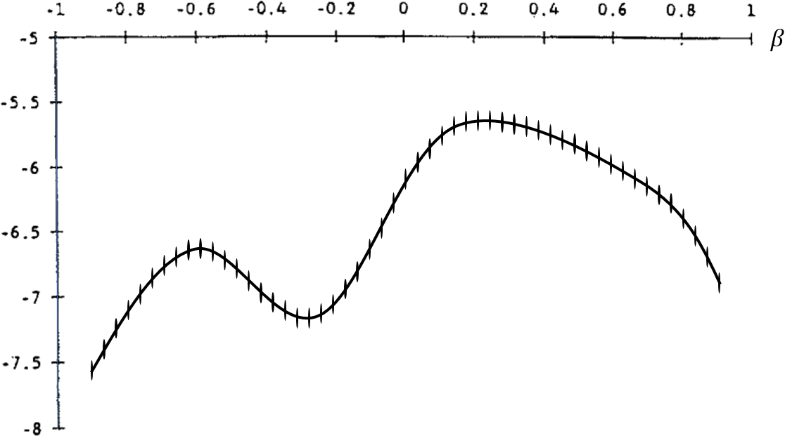
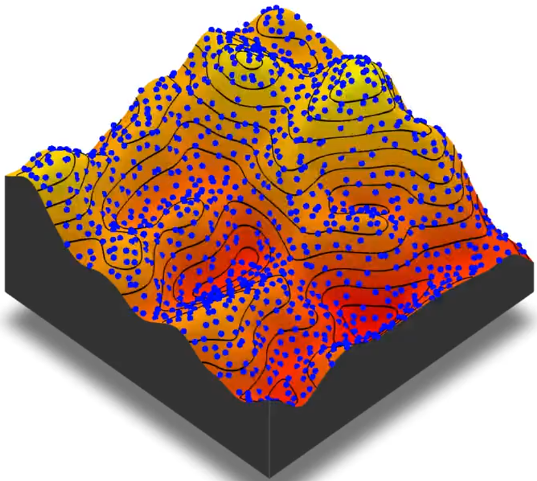
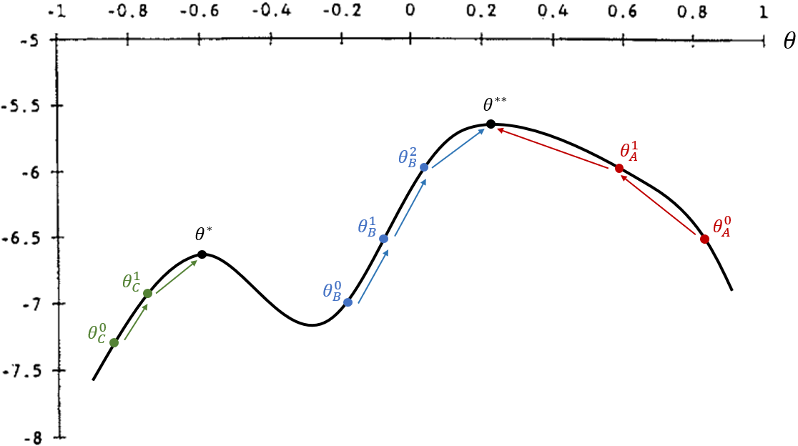
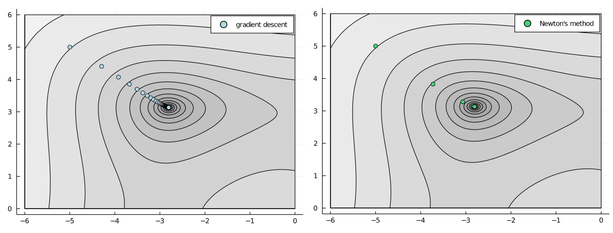
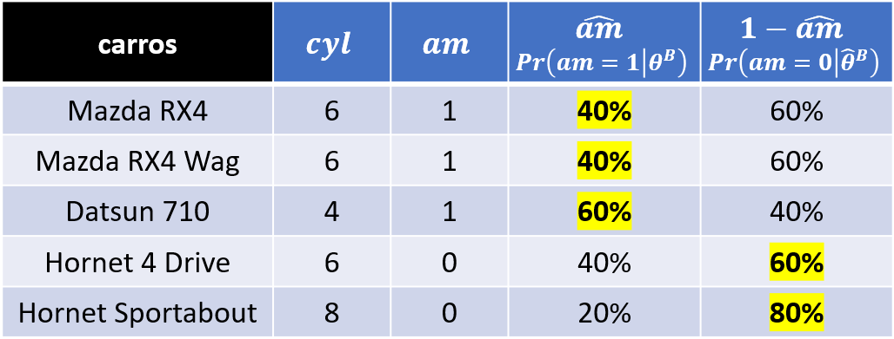
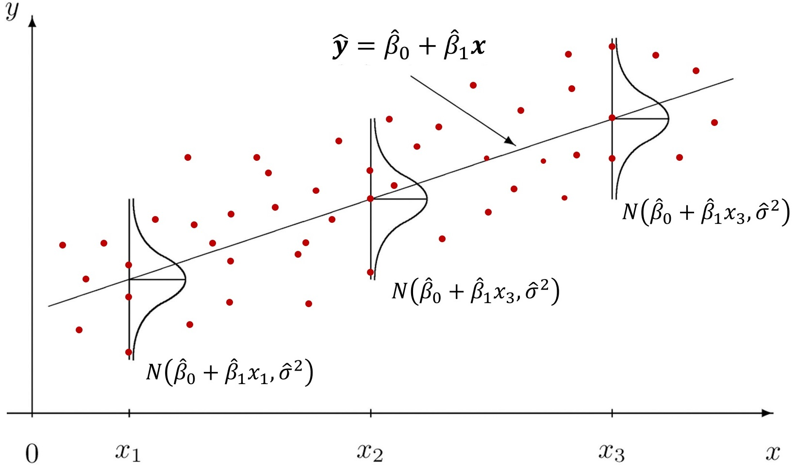

## Otimização numérica
- Essa seção tem o objetivo para dar uma intuição sobre alguns algoritmos de otimização.
- Veremos os métodos de _grid search_ e _gradient descent_ (_ascent_) que representam famílias de métodos de otimização.


### Métodos livres de derivadas

#### _Grid Search_

- O método mais simples de otimização numérica é o _grid search_.
- Como o computador não lida com problemas com infinitos valores, discretizamos diversos possíveis valores dos parâmetros de escolha dentro de intervalos.
- Para cada possível combinação de parâmetros, calcula-se a função objetivo e escolhe-se a combinação de parâmetros que maximizam (ou minimizam) a função objetivo.
- O exemplo abaixo considera apenas um parâmetro de escolha $\theta$ e, para cada ponto escolhido dentro do intervalo $[-1, 1]$, calcula-se a função objetivo:

<center></center>

- Este é um método robusto a funções com descontinuidades e quinas (não diferenciáveis).
- Porém, este método depende da definição de intervalo para busca do valor ótimo e fica mais preciso com maiores quantidades de pontos.
- Então, como é necessário fazer o cálculo da função objetivo para cada ponto, o _grid search_ tende a ser menos eficiente computacionalmente, sobretudo com o aumento de dimensões:

<center></center>


#### Nelder-Mead
- [Stats 102A Lesson 8-2 Nelder Mead Method / Algorithm](https://www.youtube.com/watch?v=vOYlVvT3W80)
- Nelder-Mead também conhecido como método simplex downhill, é um método de busca direta que é frequentemente aplicado a problemas de otimização não linear para os quais as derivadas podem não ser conhecidas.
- Ele opera em um simplex de _n + 1_ pontos em um espaço _n_-dimensional e move e transforma iterativamente o simplex para encontrar o mínimo ou máximo de uma função objetivo.

<center></center>
<center></center>


<!-- #### _Simulated Annealing_ (SANN) -->
<!-- - O _simulated annealing_ é um algoritmo de otimização probabilístico que busca aproximar o ótimo global de uma função dada. -->
<!-- - O nome do algoritmo vem do recozimento (_annealing_) em metalurgia, uma técnica que envolve o aquecimento e resfriamento controlado de um material para alterar suas propriedades físicas. -->
<!-- - O algoritmo começa com uma solução inicial e, em seguida, melhora iterativamente a solução atual perturbando-a aleatoriamente e aceitando a perturbação com uma certa probabilidade. A probabilidade de aceitar uma solução pior é inicialmente alta e diminui gradualmente à medida que o número de iterações aumenta. -->

<!-- <center></center> -->


### Métodos baseados em gradiente
- [BFGS in a Nutshell: An Introduction to Quasi-Newton Methods](https://towardsdatascience.com/bfgs-in-a-nutshell-an-introduction-to-quasi-newton-methods-21b0e13ee504)
- Há uma outra família de algoritmos de otimização que utilizam o gradiente


#### _Gradient Ascent (Descent)_
- O algoritmo desta família mais simples é o _gradient ascent_ (_descent_).
- Queremos encontrar o ${\theta}^{**}$ que é o parâmetro que maximiza globalmente a função objetivo
- Passos para encontrar um máximo:
  1. Comece com algum valor inicial de parâmetro, ${\theta}^0$
  2. Calcula-se o gradiente (vetor de derivadas parciais) e a hessiana (matriz de segundas derivadas parciais) e avalia-se a possibilidade de "andar para cima" a um valor mais alto
  3. Caso possa, anda para ${\theta}^1$
  $$\theta^1 = \theta^0 + \alpha f'(\theta^0)$$
  ou, no caso multivariado:
  $$\boldsymbol{\theta}^1 = \boldsymbol{\theta}^0 + \alpha \nabla f(\boldsymbol{\theta}^0),$$
  em que $\nabla f(\cdot)$ é o gradiente (vetor de derivadas parciais).
  4. Repita os passos (2) e (3), andando para um novo ${\theta}^2, {\theta}^3, ...$ até atingir um ponto máximo

<center></center>

- Note que esse método de otimização é sensível ao parâmetro inicial e às descontinuidades da função objetivo.
    - No exemplo, se os chutes iniciais forem ${\theta}^0_A$ ou ${\theta}^0_B$, então consegue atingir o máximo global.
    - Já se o chute inicial for ${\theta}^0_C$, então ele acaba atingindo um máximo local com ${\theta}^*$ (menor do que o máximo global em ${\theta}^{**}$).

<video width="500px" height="500px" controls="controls"/>
    <source src="../local-maxima.mp4" type="video/mp4">
</video>

- Por outro lado, é um método mais eficiente, pois calcula-se a função objetivo uma vez a cada passo, além de ser mais preciso nas estimações.


#### Método de Newton
- O método de Newton é um algoritmo de segunda ordem que usa tanto o gradiente quanto a matriz Hessiana da função objetivo para iterativamente atualizar a solução.
- Agora, a segunda derivada permite dar "passos" mais otimizados, acelerando a convergência:
$$\theta^{n+1} = \theta^n + \frac{1}{f''(\theta^n)} f'(\theta^n)$$
  ou, no caso multivariado:
  $$\boldsymbol{\theta}^{n+1} = \boldsymbol{\theta}^n + \mathcal{H}^{-1}(\theta^n) \nabla f(\boldsymbol{\theta}^n),$$
  em que $\mathcal{H}(\cdot)$ é a Hessiana (matriz de segundas derivadas parciais).

<center></center>


#### Métodos de quasi-Newton
- Como o cálculo da Hessiana (e a sua inversão) é computacionalmente demandante, diversos métodos propõem cálculos para aproximações da Hessiana a partir do gradiente para agilizar o algoritmo.
- A qualidade da aproximação da matriz Hessiana pode afetar a eficácia destes métodos e suas taxas de convergência.
- Alguns exemplos são:
  - `BFGS` (Boryden-Fletcher-Goldfarb-Shanno): um dos métodos quasi-newtonianos mais populares
  - `nlminb` (Nonlinear Minimization subject to Box Constraints): otimização sem restrições ou com restrições de caixa usando rotinas PORT do FORTRAN. 


</br>

## Encontrando MQO por diferentes estratégias
- Nesta seção, encontraremos as estimativas de MQO usando as estratégias da (a) minimização da função perda, de (b) método dos momentos e de (c) máxima verossimilhança.
- Em cada uma delas, temos uma função objetivo distinta, que será avaliada a partir de um vetor com dois parâmetros, $ \hat{\boldsymbol{\theta}} = \{ \hat{\beta}_0, \hat{\beta}_1 \}. $ No R, vamos chamar esse vetor de `theta`.


### Base `mtcars`

Usaremos dados extraídos da _Motor Trend_ US magazine de 1974, que analisa o
consumo de combustível e 10 aspectos técnicos de 32 automóveis.

No _R_, a base de dados `mtcars` já está pré-carregada no programa e queremos estimar o seguinte modelo:
 $$ \text{mpg} = \beta_0 + \beta_1 \text{hp} + \varepsilon, $$ 
em que:

- _mpg_: consumo de combustível (milhas por galão)
- _hp_: potência (cavalos-vapor)


```r
## Regressao MQO
reg = lm(formula = mpg ~ hp, data = mtcars)
reg$coef
```

```
## (Intercept)          hp 
## 30.09886054 -0.06822828
```


### (a) Minimização da função perda
- A função perda adotada pela Teoria da Decisão é a **função de soma dos quadrados dos resíduos**
- Por essa estratégia, queremos encontrar as estimativas que **minimizam** essa função.


#### 1. Criar função perda que calcula a soma dos resíduos quadráticos
- A função para calcular a soma dos resíduos quadráticos recebe como inputs:
  - um **vetor** de possíveis valores $\hat{\boldsymbol{\theta}} = \left\{ \hat{\beta}_0,\ \hat{\beta}_1 \right\}$
  - uma **lista** com
    - um *texto* com o nome da variável dependente
    - um *vetor de texto* com os nomes das variáveis explicativas
    - uma *base de dados*

```r
resid_quad = function(theta, fn_args) {
  # Extraindo argumentos da lista fn_args
  yname = fn_args[[1]]
  xname = fn_args[[2]]
  dta = fn_args[[3]]
  
  # Extraindo as variáveis da base em vetores
  y = dta[,yname]
  x = dta[,xname]
  
  # Extraindo os parâmetros de theta
  b0hat = theta[1]
  b1hat = theta[2]
  
  yhat = b0hat + b1hat * x # valores ajustados
  ehat = y - yhat # desvios = observados - ajustados
  sum(ehat^2)
}
```


#### 2. Otimização
- Agora encontraremos os parâmetros que minimizam a função perda

$$ \underset{\hat{\boldsymbol{\theta}}}{\text{argmin}} \sum_{i=1}^{N}\hat{\varepsilon}^2_i \quad = \quad \underset{\hat{\boldsymbol{\theta}}}{\text{argmin}} \sum_{i=1}^{N}\left( \text{mpg}_i - \widehat{\text{mpg}}_i \right)^2 $$

- Para isto usaremos a função `opm()` do pacote `optimx` que retorna os parâmetros que minimizam uma função (equivalente ao _argmin_):
```yaml
opm(par, fn, gr=NULL, hess=NULL, lower=-Inf, upper=Inf, 
            method=c("Nelder-Mead","BFGS"), hessian=FALSE,
            control=list(),
             ...)

- par: a vector of initial values for the parameters.
- fn: A function to be minimized (or maximized), with a first argument the vector of parameters over which minimization is to take place. It should return a scalar result.
- gr: A function to return (as a vector) the gradient for those methods that can use this information.
- hess: A function to return (as a symmetric matrix) the Hessian of the objective function for those methods that can use this information.
- lower, upper: Bounds on the variables for methods such as "L-BFGS-B" that can handle box (or bounds) constraints. These are vectors.
- method: A vector of the methods to be used, each as a character string. Possible method codes are "Nelder-Mead", "BFGS", "CG", "L-BFGS-B", "nlm", "nlminb", "spg", "ucminf", "newuoa", "bobyqa", "nmkb", "hjkb", "Rcgmin", and/or "Rvmmin". It may be needed to install some optimization packages to perform them.
- hessian: A logical control that if TRUE forces the computation of an approximation to the Hessian at the final set of parameters.
- control: A list of control parameters. See ‘Details’.
```
- Colocaremos como input:
  - a função perda criada `resid_quad()`
  - um chute inicial dos parâmetros
    - Note que a estimação pode ser mais ou menos sensível ao valores iniciais, dependendo do método de otimização utilizado
    - O mais comum é encontrar como chute inicial um vetor de zeros `c(0, 0)`, por ser mais neutro em relação ao sinal das estimativas
  - Por padrão, temos o argumento `hessian = FALSE`, coloque `TRUE` se quiser calcular o erro padrão, estatística t e p-valor das estimativas.


```r
# Estimação por BFGS
theta_ini = c(0, 0) # Chute inicial de b0, b1

min_loss = optimx::opm(par=theta_ini, fn=resid_quad,
                      fn_args=list("mpg", "hp", mtcars),
                      method=c("Nelder-Mead", "BFGS", "nlminb"))
round(min_loss, 4)
```

```
##                  p1      p2    value fevals gevals convergence kkt1 kkt2 xtime
## Nelder-Mead 30.0964 -0.0682 447.6744     93     NA           0    0    1  0.03
## BFGS        30.0989 -0.0682 447.6743     31      5           0    1    1  0.00
## nlminb      30.0989 -0.0682 447.6743     11     16           0    1    1  0.00
```


</br>

### (b) Método dos Momentos
- [Computing Generalized Method of Moments and Generalized Empirical Likelihood with R (Pierre Chaussé)](https://cran.r-project.org/web/packages/gmm/vignettes/gmm_with_R.pdf)
- [Generalized Method of Moments (GMM) in R - Part 1 (Alfred F. SAM)](https://medium.com/codex/generalized-method-of-moments-gmm-in-r-part-1-of-3-c65f41b6199)


- Para estimar via GMM com **dois momentos** precisamos construir vetores relacionados aos seguintes momentos:

$$ E(\boldsymbol{\varepsilon}) = 0 \qquad \text{ e } \qquad E(\boldsymbol{x \varepsilon}) = 0 $$

- Note que estes são os momentos relacionados ao MQO, dado que este é um caso particular do GMM.
- Os análogos amostrais são:

$$ \frac{1}{N} \sum^N_{i=1}{\hat{\varepsilon}_i} = 0 \qquad \text{ e } \qquad \frac{1}{N} \sum^N_{i=1}{x_i.\hat{\varepsilon}_i} = 0 $$

- Podemos calcular estes dois momentos amostrais em uma única multiplicação matricial.
- Primeiro, considere:

$$ \hat{\boldsymbol{\varepsilon}} = \begin{bmatrix} \varepsilon_1 \\ \varepsilon_2 \\ \vdots \\ \varepsilon_N \end{bmatrix} \qquad \text{e} \qquad \boldsymbol{x} = \begin{bmatrix} x_1 \\ x_2 \\ \vdots \\ x_N \end{bmatrix} $$

- Vamos juntar uma coluna de 1's com $\boldsymbol{x}$ e definir a matriz
$$ \boldsymbol{X} = \begin{bmatrix} 1 & x_1 \\ 1 & x_2 \\ \vdots & \vdots \\ 1 & x_N \end{bmatrix} $$

- Fazendo a multiplicação matricial entre $\hat{\boldsymbol{\varepsilon}}$ e $\boldsymbol{X}$, temos o vetor dos momentos amostrais:

\begin{align} \boldsymbol{m} \equiv \boldsymbol{X}' \hat{\boldsymbol{\varepsilon}} &= \begin{bmatrix} 1 & 1 & \cdots & 1 \\ x_1 & x_2 & \cdots & x_N  \end{bmatrix} \begin{bmatrix} \hat{\varepsilon}_1 \\ \hat{\varepsilon}_2 \\ \vdots \\ \hat{\varepsilon}_N \end{bmatrix} \\\
&= \begin{bmatrix}  \sum^N_{i=1}{\hat{\varepsilon}_i} \\ \sum^N_{i=1}{x_i.\hat{\varepsilon}_i} \end{bmatrix}  \propto \begin{bmatrix} \frac{1}{N} \sum^N_{i=1}{\hat{\varepsilon}_i} \\ \frac{1}{N} \sum^N_{i=1}{x_i.\hat{\varepsilon}_i} \end{bmatrix} \end{align}

- Agora, suponha a matriz de pesos (cuja soma não precisa ser igual a 1)
$$ W = \begin{bmatrix} \alpha & 0 \\ 0 & \beta \end{bmatrix} $$
em que $\alpha$ e $\beta$ são dois escalares.

- No GMM, queremos fazer com que esses momentos sejam o mais próximos de zero. Um forma de fazer isso é minimizar a soma (ponderada) dos quadrados dos momentos:

\begin{align} m' W m &= \begin{bmatrix} \sum^N_{i=1}{\hat{\varepsilon}_i} & \sum^N_{i=1}{x_i.\hat{\varepsilon}_i} \end{bmatrix} \begin{bmatrix} \alpha & 0 \\ 0 & \beta \end{bmatrix} \begin{bmatrix} \sum^N_{i=1}{\hat{\varepsilon}_i} \\ \sum^N_{i=1}{x_i.\hat{\varepsilon}_i} \end{bmatrix} \\
&= \begin{bmatrix} \alpha \sum^N_{i=1}{\hat{\varepsilon}_i} & \beta \sum^N_{i=1}{x_i.\hat{\varepsilon}_i} \end{bmatrix} \begin{bmatrix} \sum^N_{i=1}{\hat{\varepsilon}_i} \\ \sum^N_{i=1}{x_i.\hat{\varepsilon}_i} \end{bmatrix} \\
&= \alpha \left(\sum^N_{i=1}{\hat{\varepsilon}_i}\right)^2 + \beta \left(\sum^N_{i=1}{x_i.\hat{\varepsilon}_i}\right)^2
\end{align}

- Note que, usamos o quadrado dos momentos amostrais, pois minimizar o valor absoluto tende a formar "quinas" (ponto não diferenciáveis) na função objetivo.


#### Otimização Numérica para GMM

##### 1. Chute de valores iniciais para $\hat{\beta}_0$ e $\hat{\beta}_1$


```r
theta = c(30, -0.05)
yname = "mpg"
xname = "hp"
dta = mtcars
```

##### 2. Seleção da base de dados e variáveis

```r
# Extraindo as variáveis da base em vetores
y = dta[,yname]
x = dta[,xname]

# Extraindo os parâmetros de theta
b0hat = theta[1]
b1hat = theta[2]
```

##### 3. Cálculo dos valores ajustados e dos resíduos

```r
## Valores ajustados de y
yhat = b0hat + b1hat * x

## Resíduos
ehat = y - yhat
```


##### 4. Soma dos quadrados dos momentos amostrais

```r
m1 = ehat # momento 1
m2 = ehat * x # momento 2

sum(m1)^2 + sum(m2)^2 # soma dos quadrados com mesmos pesos (1 e 1)
```

```
## [1] 217374633
```
- Note que, como multiplicamos a constante igual a 1 com os resíduos $\hat{\varepsilon}$, a 1ª coluna corresponde ao momento amostral $\sum^N_{i=1}{\hat{\varepsilon}_i}$ (mas sem dividir por _N_).
- Já a coluna 2 correspode ao momento amostral $\sum^N_{i=1}{x_i.\hat{\varepsilon}_i}$ para a variável _hp_ (mas sem dividir por _N_).
- Logicamente, para estimar por GMM, precisamos escolher os parâmetros $\hat{\boldsymbol{\theta}} = \{ \hat{\beta}_0, \hat{\beta}_1 \}$ que, ao calcular a soma/média das colunas, se aproximem ao máximo de zero. Isso será feito via `gmm()` (semelhante à função `opm()`)


##### 5a. Criação de função com os momentos
- Vamos criar uma função que tem como input um vetor de parâmetros (`theta`) e uma base de dados (`dta`), e que retorna uma matriz em que cada coluna representa um momento.
- Essa função incluirá todos os comandos descritos nos itens 1 a 4 (que, na verdade, apenas foram feitos por didática).

```r
mom_ols1 = function(theta, fn_args) {
  # No gmm(), só pode ter 1 input dos argumentos dessa função
  # Extraindo argumentos da lista fn_args
  yname = fn_args[[1]]
  xname = fn_args[[2]]
  dta = fn_args[[3]]
  
  # Extraindo as variáveis da base em vetores
  y = dta[,yname]
  x = dta[,xname]
  
  # Extraindo os parâmetros de theta
  b0hat = theta[1]
  b1hat = theta[2]
  
  ## Valores ajustados de y
  yhat = b0hat + b1hat * x
  
  ## Resíduos
  ehat = y - yhat
  
  ## Momentos
  m1 = ehat # momento 1
  m2 = ehat * x # momento 2
  sum(m1)^2 + sum(m2)^2 # soma dos quadrados com mesmos pesos (1 e 1)
}
```

##### 6a. Otimização via `opm()`
- Assim como na minimização da função perda, vamos usar a função `opm()` do pacote `optimx`

```r
theta_ini = c(0,0)
gmm1 = optimx::opm(theta_ini, fn=mom_ols1,
                   fn_args = list("mpg", "hp", mtcars),
                   method = c("Nelder-Mead", "BFGS", "nlminb"))
round(gmm1, 4)
```

```
##                  p1      p2    value fevals gevals convergence kkt1 kkt2 xtime
## Nelder-Mead  0.0320  0.1009 28256.45     39     NA           0    0    0  0.02
## BFGS        30.0989 -0.0682     0.00     66     11           0    0    0  0.01
## nlminb      30.0989 -0.0682     0.00     54     42           0    0    0  0.00
```


##### 5b. Criação de função com os momentos para `gmm()`

- Note que $X' \hat{\boldsymbol{\varepsilon}}$ um vetor dos momentos amostrais, mas a função `gmm()` exige uma matriz de dimensão $g \times N$, sendo $g$ o número de momentos e $N$ o tamanho da amostra.
- No R, precisamos fazer **multiplicação elemento a elemento por linha** do vetor de resíduos $\hat{\boldsymbol{\varepsilon}}$ com a matriz de covariadas $\boldsymbol{X}$ (neste caso: constante _1_ e _hp_), na forma:

\begin{align} \hat{\boldsymbol{\varepsilon}} \odot \boldsymbol{X}\ =\ \begin{bmatrix} \hat{\varepsilon}_1 \\ \hat{\varepsilon}_2 \\ \vdots \\ \hat{\varepsilon}_N \end{bmatrix} \odot \begin{bmatrix} 1 & x_1 \\ 1 & x_2 \\ \vdots & \vdots \\ 1 & x_N \end{bmatrix}  \ =\ &\begin{bmatrix} \hat{\varepsilon}_1 & x_1.\hat{\varepsilon}_1  \\ \hat{\varepsilon}_2 & x_2.\hat{\varepsilon}_2 \\ \vdots & \vdots \\ \hat{\varepsilon}_N & x_N.\hat{\varepsilon}_N \end{bmatrix}\\
\\ &\quad \Big\Downarrow \text{(Soma por coluna)} \\
&\begin{bmatrix}  \sum^N_{i=1}{\hat{\varepsilon}_i} & \sum^N_{i=1}{x_i.\hat{\varepsilon}_i} \end{bmatrix}, \end{align}
em que $\odot$ denota a multiplicação elemento a elemento por linha. Note que se fizermos as somas de cada coluna, obtemos os dois momentos amostrais.

Note que, para fazer o GMM no R, não devemos fazer a soma/média de cada coluna (a própria função `gmm()` fará isso).


```r
mom_ols2 = function(theta, fn_args) {
  # No gmm(), só pode ter 1 input dos argumentos dessa função
  # Extraindo argumentos da lista fn_args
  yname = fn_args[[1]]
  xname = fn_args[[2]]
  dta = fn_args[[3]]
  
  # Extraindo as variáveis da base em vetores
  y = dta[,yname]
  x = dta[,xname]
  
  # Extraindo os parâmetros de theta
  b0hat = theta[1]
  b1hat = theta[2]
  
  ## Valores ajustados de y
  yhat = b0hat + b1hat * x
  
  ## Resíduos
  ehat = y - yhat
  
  ## Matriz de momentos
  m = as.numeric(ehat) * cbind(1,x)
  m # output da função
}
```


##### 6b. Otimização via `gmm()`
- A função `gmm()` do pacote `gmm`, assim como a `opm()`, recebe uma função como argumento.
- No entanto, a função que entra no `gmm()` deve gerar uma matriz como output, cujas somas/médias das colunas queremos aproximar de zero.
- O argumento de função de otimização deve ser `fctopt = "nlminb"`, pois `fctopt = "optim"` é mais instável
- Note que, além do vetor de parâmetros, a função que entra como argumento (`gmm_ols()` neste caso) deve ter, no máximo, mais um argumento.

```r
gmm2 = gmm::gmm(
  g=mom_ols2, 
  x=list("mpg", "hp", mtcars), # joga no 2o arg de ols_mom (fn_args)
  t0=c(0,0), # chute inicial de theta
  optfct = "nlminb" # função de otimização
  )
gmm2$coef
```

```
##    Theta[1]    Theta[2] 
## 30.09886038 -0.06822828
```

```r
# Comparando com estimativas via lm()
reg$coef
```

```
## (Intercept)          hp 
## 30.09886054 -0.06822828
```


</br>

### (c) Máxima Verossimilhança
- [ResEcon 703](https://github.com/woerman/ResEcon703) - Week 6 (University of Massachusetts Amherst)
- A função objetivo é a função de verossimilhança que, ao contrário da função de soma de quadrado dos resíduos, queremos maximizá-la


#### Intuição do cálculo da função de verossimilhança
- Apenas para ilustrar a construção da função de verossimilhança, $\mathcal{L}$, considere um modelo de probabilidade linear:
$$ \text{am} = \beta_0 + \beta_1 \text{cyl} + \varepsilon, $$
em que _cyl_ é a quantidade de cilindros do carro, e _am_ é uma variável _dummy_ que é igual a 1 se o carro for automático e 0 caso contrário.

- Queremos encontrar $\hat{\boldsymbol{\theta}} = \left\{ \hat{\beta}_0, \hat{\beta}_1 \right\}$ que maximizam a função de verossimilhança.
- Considere um chute de parâmetros $\hat{\boldsymbol{\theta}}_A = \left\{ \hat{\beta}^A_0 = 1.3, \hat{\beta}^A_1 = -0.14 \right\}$ que gerem os seguintes valores preditos/ajustados (probabilidades):

<center></center>


- Logo, a verossimilhança, dado os parâmetros $\hat{\boldsymbol{\theta}}_A$ é
$$ \mathcal{L}(\hat{\boldsymbol{\theta}}_A) = 46\% \times 46\% \times 74\% \times 54\% \times 82\% = 6,9\% $$

- Agora, considere um segundo chute de parâmetros $\hat{\boldsymbol{\theta}}_B = \left\{ \hat{\beta}^B_0=1.0, \hat{\beta}^B_1=-0.10 \right\}$ que gerem as seguintes probabilidades:

<center></center>

- Então, a verossimilhança, dado $\hat{\boldsymbol{\theta}}_B$, é
$$ \mathcal{L}(\hat{\boldsymbol{\theta}}_B) = 40\% \times 40\% \times 60\% \times 60\% \times 80\% = 4,6\% $$
- Como $\mathcal{L}\left(\hat{\boldsymbol{\theta}}_A\right) = 6,9\% > 4,6\% = \mathcal{L}\left(\hat{\boldsymbol{\theta}}_B\right)$, então os parâmetros $\hat{\boldsymbol{\theta}}_A$ se mostram mais adequados em relação a $\hat{\boldsymbol{\theta}}_B$
- Na estratégia de máxima verossimilhança (ML), escolhe-se o conjunto de parâmetros $\hat{\boldsymbol{\theta}}^*$ que maximiza a função de verossimilhança (ou log-verossimilhança).


#### Otimização Numérica para Máxima Verossimilhança

- Em nosso modelo
 $$ \text{mpg} = \beta_0 + \beta_1 \text{hp} + \varepsilon, $$ 
queremos estimar 3 parâmetros
$$ \hat{\boldsymbol{\theta}} = \left\{ \hat{\beta}_0, \hat{\beta}_1, \hat{\sigma} \right\}, $$
em que $\hat{\sigma}$ é desvio padrão do resíduo.

- No modelo de probabilidade linear, as probabilidades usadas para calcular a verossimilhança são os próprios valores ajustados (probabilidades) dos carros serem automáticos (manuais), dado que são automáticos (manuais).
- Já no modelo linear "comum", usamos a função de densidade de probabilidade, a partir de uma distribuição normal com uma variância $\hat{\sigma}^2$, para avaliar a "probabilidade" de cada observação, $y_i$, ser o valor ajustado $\hat{y}_i$.

A função log-verossimilhança é dada por
$$ \mathcal{l}(\hat{\boldsymbol{\theta}}) = \ln{L(y_i | x_i, \hat{\beta}_0, \hat{\beta}_1, \hat{\sigma})} = \sum^n_{i=1}{\ln{f(y_i | x_i, \hat{\beta}_0, \hat{\beta}_1, \hat{\sigma})}}, $$
em que a distribuição condicional de cada $y_i$ é

$$ y_i | x_i \sim N(\hat{\beta}_0 + \hat{\beta}_1 x_i, \hat{\sigma}^2) $$
o que implica que 

$$\varepsilon_i | x_i \sim N(0, \sigma^2)$$


<center></center> 

- Como demonstra a figura acima, assumimos que o erro $\varepsilon$ é normalmente distribuído para todo $x$, com a mesma variância $\sigma^2$ (homocedasticidade)


#### Otimização Numérica via `mle2()`

- Nosso objetivo é
$$ \underset{\hat{\boldsymbol{\theta}}}{\text{argmax}} \ \mathcal{l}(\hat{\boldsymbol{\theta}}) = \underset{\hat{\boldsymbol{\theta}}}{\text{argmax}} \sum^n_{i=1}{\ln{f(y_i | x_i, \hat{\beta}_0, \hat{\beta}_1, \hat{\sigma})}}, $$

- A função `mle2()` do pacote `bbmle`, que será usada para desempenhar a otimização numérica, assim como `opm()`. Precisamos usar como input:
  - Alguns valores inicias dos parâmetros, $\hat{\boldsymbol{\theta}}^0 = \left\{ \hat{\beta}^0_0, \hat{\beta}^0_1, \hat{\sigma}^0 \right\}$
  - Uma função que tome esses parâmetros como argumento e calcule a 
log-verossimilhança, $\ln{L(\boldsymbol{\hat{\boldsymbol{\theta}}})}$.

> Como as funções de otimização costumam encontrar o mínimo de uma função objetivo, precisamos adaptar o output para o negativo função de log-verossimilhança. Ao minimizar o negativo de log-lik, estamos maximizando log-lik.

<!-- <center></center> -->

Passos para estimar uma regressão por máxima verossimilhança:

1. Chutar valores iniciais de 
2. Calcular os valores ajustados, $\hat{y}$
3. Calcular a densidade para cada $y_i$, usando $f(y_i | x_i, \hat{\beta}_0, \hat{\beta}_1, \hat{\sigma})$
4. Calcular a log-verossimilhança, $\sum^n_{i=1}{\ln{f(y_i | x_i, \hat{\beta}_0, \hat{\beta}_1, \hat{\sigma})}}$


##### 1. Chute de valores iniciais para $\hat{\beta}_0, \hat{\beta}_1$ e $\hat{\sigma}^2$
- Note que, diferente da estimação por MQO, um dos parâmetros a ser estimado via MLE é a variância ($\hat{\sigma}^2$).

```r
theta = c(30, -.05, 2)
# (b0hat, b1hat , sighat)
```


##### 2. Seleção da base de dados e variáveis

```r
## Inicializando
yname = "mpg"
xname = "hp"
dta = mtcars

# Extraindo as variáveis da base em vetores
y = dta[,yname]
x = dta[,xname]

# Extraindo os parâmetros de theta
b0hat = theta[1]
b1hat = theta[2]
sighat = theta[3]
```

##### 3. Cálculo dos valores ajustados e das densidades

```r
## Calculando valores ajustados de y
yhat = b0hat + b1hat * x
head(yhat)
```

```
## [1] 24.50 24.50 25.35 24.50 21.25 24.75
```

##### 4. Cálculo das densidades
$$ f(y_i | x_i, \hat{\beta}_0, \hat{\beta}_1, \hat{\sigma}) $$

```r
## Calculando as densidades de probabilidade de cada linha
ypdf = dnorm(y, mean = yhat, sd = sighat)

head(round(ypdf, 4)) # Primeiros valores da densidade
```

```
## [1] 0.0431 0.0431 0.0885 0.0600 0.0885 0.0008
```

```r
prod(ypdf) # Verossimilhança
```

```
## [1] 1.400141e-61
```

```r
sum(log(ypdf)) # Log-Verossimilhança
```

```
## [1] -140.1211
```

- Agora, vamos juntar visualizar os 6 primeiros elementos dos objetos trabalhados:

```r
# Juntando os vetores e visualizando os primeiros valores
tab = data.frame(y, x, yhat, ypdf=round(ypdf, 4))
head(tab)
```

```
##      y   x  yhat   ypdf
## 1 21.0 110 24.50 0.0431
## 2 21.0 110 24.50 0.0431
## 3 22.8  93 25.35 0.0885
## 4 21.4 110 24.50 0.0600
## 5 18.7 175 21.25 0.0885
## 6 18.1 105 24.75 0.0008
```
- Como pode ser visto na base de dados juntada e nos gráficos abaixo, quanto mais próximo o valor ajustado for do valor observado de cada observação, maior será a densidade/probabilidade.

- Logo, a verossimilhança (produto de todas densidades de probabilidade) será maior quanto mais próximos forem os valores ajustados dos seus respectivos valores observados.


##### 5. Calculando a Log-Verossimilhança

A log-verossimilhança é a soma do log de todas probabilidades:

$$ \mathcal{l}(\hat{\beta}_0, \hat{\beta}_1, \hat{\sigma}) = \sum^{N}_{i=1}{\ln\left[ f(y_i | x_i, \hat{\beta}_0, \hat{\beta}_1, \hat{\sigma}) \right]} $$

```r
## Calculando a log-verossimilhanca
loglik = sum(log(ypdf))
loglik
```

```
## [1] -140.1211
```


##### 6a. Criando a Função de Log-Verossimilhança para `opm()`

- Aqui, vamos *minimizar o negativo* da função de log-verossimilhança
$$ \min_{(\hat{\beta}_0, \hat{\beta}_1, \hat{\sigma})} -\sum^n_{i=1}{\ln{f(y_i | x_i, \hat{\beta}_0, \hat{\beta}_1, \hat{\sigma})}} = \max_{(\hat{\beta}_0, \hat{\beta}_1, \hat{\sigma})} \sum^n_{i=1}{\ln{f(y_i | x_i, \hat{\beta}_0, \hat{\beta}_1, \hat{\sigma})}} $$
- Juntando tudo que fizemos anteriormente, podemos criar uma função no R que calcular a função de log-verossimilhança.
- **IMPORTANTE**: Prefira já calcular a log-densidade de probabilidade direto do `dnorm()`, pois otimização fica mais estável.
- Isso não foi feito anteriormente por questão didática, mas será feito abaixo:


```r
## Criando função para calcular log-verossimilhanca de OLS
loglik1 = function(theta, fn_args) {
  yname = fn_args[[1]]
  xname = fn_args[[2]]
  dta = fn_args[[3]]
  
  # Extraindo as variáveis da base em vetores
  y = dta[,yname]
  x = dta[,xname]
  
  # Extraindo os parâmetros de theta
  b0hat = theta[1]
  b1hat = theta[2]
  sighat = theta[3]

  ## Calculando valores ajustados de y
  yhat = b0hat + b1hat * x
  
  ## Calculando as densidades de probabilidade de cada linha
  log_ypdf = dnorm(y, mean = yhat, sd = sighat, log = TRUE)
  
  ## Calculando a log-verossimilhanca
  loglik = sum(log_ypdf)
  
  ## Retornando o negativo da log-verossimilanca
  -loglik # Negativo, pois mle2() minimiza e queremos maximizar
}
```


##### 7a. Otimização via `opm()`
- **IMPORTANTE**: o chute inicial do erro padrão dos erros (_sighat_) deve ser um valor alto, pois o R tem um certo limite de casas decimais e acaba aproximando para zero (0) as probabilidades muito baixas (e o produtório da fórmula da Verossimilhança acaba ficando igual a zero).
- Similar aos anteriores:


```r
theta_ini = c(0, 0, 10)
mle1 = optimx::opm(par=theta_ini, fn=loglik1,
                   fn_args = list("mpg", "hp", mtcars),
                   method = c("Nelder-Mead", "BFGS", "nlminb"))
round(mle1, 4)
```

```
##                  p1      p2     p3   value fevals gevals convergence kkt1 kkt2
## Nelder-Mead 30.1003 -0.0682 3.7400 87.6193    196     NA           0    0    1
## BFGS        30.0989 -0.0682 3.7403 87.6193     52     20           0    1    1
## nlminb      30.0989 -0.0682 3.7403 87.6193     33     67           0    1    1
##             xtime
## Nelder-Mead  0.02
## BFGS         0.01
## nlminb       0.00
```

##### 6b. Criando a Função de Log-Verossimilhança para `mle2()`
- A função `mle2()` do pacote `bbmle`, assim como a `opm()`, recebe uma função como argumento.
- A função que entra como argumento (`loglik()` neste caso) deve ter apenas como argumentos apenas os parâmetros que queremos otimizar. Além disso, caso seja necessário incluir algum outro argumento, deve ser inserido no argumento `data` da função `mle2()` como um objeto _list_.


```r
## Criando função para calcular log-verossimilhanca de OLS
loglik = function(b0hat, b1hat, sighat) {
  # Extraindo as variáveis da base em vetores
  y = dta[,yname]
  x = dta[,xname]

  ## Calculando valores ajustados de y
  yhat = b0hat + b1hat * x
  
  ## Calculando as densidades de probabilidade de cada linha
  log_ypdf = dnorm(y, mean = yhat, sd = sighat, log = TRUE)
  
  ## Calculando a log-verossimilhanca
  loglik = sum(log_ypdf)
  
  ## Retornando o negativo da log-verossimilanca
  -loglik # Negativo, pois mle2() minimiza e queremos maximizar
}
```


##### 7b. Otimização via `mle2()`


```r
## Maximizando a função log-verossimilhança de OLS
mle2 = bbmle::mle2(
  minuslogl=loglik,
  start=list(b0hat=0, b1hat=0, sighat=1),
  data=list(yname = "mpg", xname = "hp", dta = mtcars),
  hessian=T
  )
mle2
```

```
## 
## Call:
## bbmle::mle2(minuslogl = loglik, start = list(b0hat = 0, b1hat = 0, 
##     sighat = 1), data = list(yname = "mpg", xname = "hp", dta = mtcars), 
##     hessian.opts = T)
## 
## Coefficients:
##       b0hat       b1hat      sighat 
## 30.09536167 -0.06820922  3.74137621 
## 
## Log-likelihood: -87.62
```


</br>


