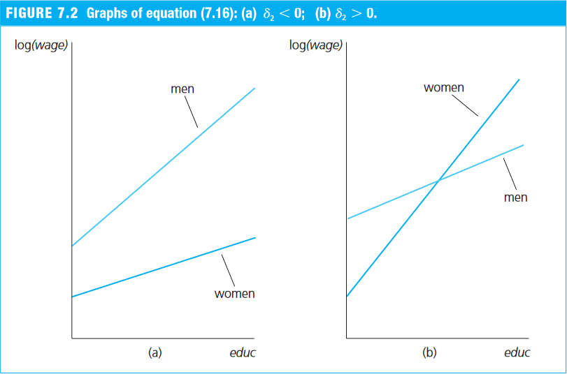

---
date: "2018-09-09T00:00:00Z"
# icon: book
# icon_pack: fas
linktitle: "Multiple Regression"
summary: "Multiple regression notes covering OLS with several regressors, qualitative variables, interaction terms, and applied R examples."
title: "Multiple OLS Regression"
weight: 8
output: md_document
type: book
---


## Multiple OLS Estimation

### Multiple Regression via `lm()`

- [Section 3.1 of Heiss (2020)](http://www.urfie.net/read/index.html#page/115)

- To estimate a multivariate model in R, we can use the `lm()` function:
  - the tilde (`~`) separates the dependent variable from the independent variables;
  - independent variables must be separated by `+`;
  - the constant term ($\beta_0$) is included automatically by `lm()`. To remove it, include `0` in the formula.


#### Example 3.1: Determinants of College GPA in the United States (Wooldridge, 2006)
- Consider the variables:
    - `colGPA` (_college GPA_): average college grade point average;
    - `hsGPA` (_high school GPA_): average high-school GPA;
    - `ACT` (_achievement test score_): the score on the college entrance achievement test.
- Using the `gpa1` dataset from the `wooldridge` package, we estimate the following model:

$$ \text{colGPA} = \beta_0 + \beta_1 \text{hsGPA} + \beta_2 \text{ACT} + u $$


```r
# Load the gpa1 dataset
data(gpa1, package = "wooldridge")

# Estimate the model
GPAres = lm(colGPA ~ hsGPA + ACT, data = gpa1)
GPAres
```

```
## 
## Call:
## lm(formula = colGPA ~ hsGPA + ACT, data = gpa1)
## 
## Coefficients:
## (Intercept)        hsGPA          ACT  
##    1.286328     0.453456     0.009426
```

- We can inspect the estimation in more detail by applying `summary()` to the object returned by `lm()`:

```r
summary(GPAres)
```

```
## 
## Call:
## lm(formula = colGPA ~ hsGPA + ACT, data = gpa1)
## 
## Residuals:
##      Min       1Q   Median       3Q      Max 
## -0.85442 -0.24666 -0.02614  0.28127  0.85357 
## 
## Coefficients:
##             Estimate Std. Error t value Pr(>|t|)    
## (Intercept) 1.286328   0.340822   3.774 0.000238 ***
## hsGPA       0.453456   0.095813   4.733 5.42e-06 ***
## ACT         0.009426   0.010777   0.875 0.383297    
## ---
## Signif. codes:  0 '***' 0.001 '**' 0.01 '*' 0.05 '.' 0.1 ' ' 1
## 
## Residual standard error: 0.3403 on 138 degrees of freedom
## Multiple R-squared:  0.1764,	Adjusted R-squared:  0.1645 
## F-statistic: 14.78 on 2 and 138 DF,  p-value: 1.526e-06
```


### OLS in Matrix Form

- [Section 3.2 of Heiss (2020)](http://www.urfie.net/read/index.html#page/119)


#### Notation

- For more details on matrix-form OLS, see Appendix E of Wooldridge (2006).
- Consider the multivariate model with $K$ regressors for observation $i$:
$$ y_i = \beta_0 + \beta_1 x_{i1} + \beta_2 x_{i2} + ... + \beta_K x_{iK} + u_i, \qquad i=1, 2, ..., N \tag{E.1} $$
where $N$ is the number of observations.

- Define the parameter column vector, $\boldsymbol{\beta}$, and the row vector of explanatory variables for observation $i$, $\boldsymbol{x}_i$:
$$ \underset{1 \times K}{\boldsymbol{x}_i} = \left[ \begin{matrix} 1 & x_{i1} & x_{i2} & \cdots & x_{iK}  \end{matrix} \right]  \qquad \text{e} \qquad  \underset{(K+1) \times 1}{\boldsymbol{\beta}} = \left[ \begin{matrix} \beta_0 \\ \beta_1 \\ \beta_2 \\ \vdots \\ \beta_K \end{matrix} \right],$$

- Notice that the inner product $\boldsymbol{x}_i \boldsymbol{\beta}$ is:

\begin{align} \underset{1 \times 1}{\boldsymbol{x}_i \boldsymbol{\beta}} &= \left[ \begin{matrix} 1 & x_{i1} & x_{i2} & \cdots & x_{iK}  \end{matrix} \right]  \left[ \begin{matrix} \beta_0 \\ \beta_1 \\ \beta_2 \\ \vdots \\ \beta_K \end{matrix} \right]\\
&= 1.\beta_0 + x_{i1} \beta_1  + x_{i2} \beta_2 + \cdots + x_{iK} \beta_K, \end{align}

- Therefore, equation (3.1) can be rewritten, for $i=1, 2, ..., N$, as

$$ y_i = \underbrace{\beta_0 + \beta_1 x_{i1} + \beta_2 x_{i2} + ... + \beta_K x_{iK}}_{\boldsymbol{x}_i \boldsymbol{\beta}} + u_i = \boldsymbol{x}_i \boldsymbol{\beta} + u_i, \tag{E.2} $$

- Let $\boldsymbol{X}$ denote the matrix containing all $N$ observations for the $K+1$ explanatory variables:

$$ \underset{N \times (K+1)}{\boldsymbol{X}} = \left[ \begin{matrix} \boldsymbol{x}_1 \\ \boldsymbol{x}_2 \\ \vdots \\ \boldsymbol{x}_N \end{matrix} \right] = \left[ \begin{matrix} 1 & x_{11} & x_{12} & \cdots & x_{1K}   \\ 1 & x_{21} & x_{22} & \cdots & x_{2K} \\ \vdots & \vdots & \vdots & \ddots & \vdots \\ 1 & x_{N1} & x_{N2} & \cdots & x_{NK} \end{matrix} \right] , $$

- We can then stack the equations for all $i=1, 2, ..., N$ and obtain:

\begin{align} \boldsymbol{y} &= \boldsymbol{X} \boldsymbol{\beta} + \boldsymbol{u} \tag{E.3} \\
&= \left[ \begin{matrix} 1 & x_{11} & x_{12} & \cdots & x_{1K}   \\ 1 & x_{21} & x_{22} & \cdots & x_{2K} \\ \vdots & \vdots & \vdots & \ddots & \vdots \\ 1 & x_{N1} & x_{N2} & \cdots & x_{NK} \end{matrix} \right] \left[ \begin{matrix} \beta_0 \\ \beta_1 \\ \beta_2 \\ \vdots \\ \beta_K \end{matrix} \right] + \left[ \begin{matrix}u_1 \\ u_2 \\ \vdots \\ u_N \end{matrix} \right]   \\
&= \left[ \begin{matrix} \beta_0. 1 + \beta_1 x_{11} + \beta_2 x_{12} + ... + \beta_K x_{1K} \\ \beta_0 .1 + \beta_1 x_{21} + \beta_2 x_{22} + ... + \beta_K x_{2K} \\ \vdots \\ \beta_0. 1 + \beta_1 x_{N1} + \beta_2 x_{N2} + ... + \beta_K x_{NK} \end{matrix} \right] + \left[ \begin{matrix}u_1 \\ u_2 \\ \vdots \\ u_N \end{matrix} \right]\\
&= \left[ \begin{matrix} \beta_0. 1 + \beta_1 x_{11} + \beta_2 x_{12} + ... + \beta_K x_{1K} + u_1 \\ \beta_0 .1 + \beta_1 x_{21} + \beta_2 x_{22} + ... + \beta_K x_{2K} + u_2 \\ \vdots \\ \beta_0. 1 + \beta_1 x_{N1} + \beta_2 x_{N2} + ... + \beta_K x_{NK} + u_N \end{matrix} \right]\\
&= \left[ \begin{matrix}y_1 \\ y_2 \\ \vdots \\ y_N \end{matrix} \right] = \boldsymbol{y} \end{align}


#### Analytical Estimation in R

##### Matrix/Vector Operations in R
- First, let us review the matrix and vector operations used in R:
  - **Transpose of a matrix or vector**: `t()`
  - **Matrix or vector multiplication (inner product)**: `%*%`
  - **Inverse of a square matrix**: `solve()`


```r
# As an example, create a 4x2 matrix A
A = matrix(1:8, nrow=4, ncol=2)
A
```

```
##      [,1] [,2]
## [1,]    1    5
## [2,]    2    6
## [3,]    3    7
## [4,]    4    8
```

```r
# Transpose of A (2x4)
t(A)
```

```
##      [,1] [,2] [,3] [,4]
## [1,]    1    2    3    4
## [2,]    5    6    7    8
```

```r
# Matrix product A'A (2x2)
t(A) %*% A
```

```
##      [,1] [,2]
## [1,]   30   70
## [2,]   70  174
```

```r
# Inverse of A'A (2x2)
solve( t(A) %*% A )
```

```
##          [,1]     [,2]
## [1,]  0.54375 -0.21875
## [2,] -0.21875  0.09375
```

#### Example: Determinants of College GPA in the United States (Wooldridge, 2006)
- We want to estimate the model
$$ \text{colGPA} = \beta_0 + \beta_1 \text{hsGPA} + \beta_2 \text{ACT} + u $$

- Using the `gpa1` dataset, we create the dependent-variable vector `y` and the matrix of independent variables `X`:


```r
# Load the gpa1 dataset
data(gpa1, package = "wooldridge")

# Create vector y
y = as.matrix(gpa1[,"colGPA"]) # convert the data-frame column into a matrix
head(y)
```

```
##      [,1]
## [1,]  3.0
## [2,]  3.4
## [3,]  3.0
## [4,]  3.5
## [5,]  3.6
## [6,]  3.0
```

```r
# Create the covariate matrix X with a leading column of 1s
X = cbind( const=1, gpa1[, c("hsGPA", "ACT")] ) # bind 1s to the covariates
X = as.matrix(X) # convert to matrix
head(X)
```

```
##   const hsGPA ACT
## 1     1   3.0  21
## 2     1   3.2  24
## 3     1   3.6  26
## 4     1   3.5  27
## 5     1   3.9  28
## 6     1   3.4  25
```

```r
# Retrieve N and K
N = nrow(gpa1)
N
```

```
## [1] 141
```

```r
K = ncol(X) - 1
K
```

```
## [1] 2
```

##### 1. OLS Estimates $\hat{\boldsymbol{\beta}}$

$$ \hat{\boldsymbol{\beta}} = \left[ \begin{matrix} \hat{\beta}_0 \\ \hat{\beta}_1 \\ \hat{\beta}_2 \\ \vdots \\ \hat{\beta}_K \end{matrix} \right] = (\boldsymbol{X}'\boldsymbol{X})^{-1} \boldsymbol{X}' \boldsymbol{y} \tag{3.2} $$

In R:

```r
bhat = solve( t(X) %*% X ) %*% t(X) %*% y
bhat
```

```
##              [,1]
## const 1.286327767
## hsGPA 0.453455885
## ACT   0.009426012
```


##### 2. Fitted Values $\hat{\boldsymbol{y}}$

$$ \hat{\boldsymbol{y}} = \boldsymbol{X} \hat{\boldsymbol{\beta}}  $$

In R:

```r
yhat = X %*% bhat
head(yhat)
```

```
##       [,1]
## 1 2.844642
## 2 2.963611
## 3 3.163845
## 4 3.127926
## 5 3.318734
## 6 3.063728
```


##### 3. Residuals $\hat{\boldsymbol{u}}$

$$ \hat{\boldsymbol{u}} = \boldsymbol{y} - \hat{\boldsymbol{y}} \tag{3.3}  $$

In R:

```r
uhat = y - yhat
head(uhat)
```

```
##          [,1]
## 1  0.15535832
## 2  0.43638918
## 3 -0.16384523
## 4  0.37207430
## 5  0.28126580
## 6 -0.06372813
```


##### 4. Error-Term Variance $S^2$

$$ S^2 = \frac{\hat{\boldsymbol{u}}'\hat{\boldsymbol{u}}}{N-K-1} \tag{3.4}  $$

In R, since $S^2$ is a scalar, it is convenient to convert the resulting 1x1 matrix into a number using `as.numeric()`:

```r
S2 = as.numeric( t(uhat) %*% uhat / (N-K-1) )
S2
```

```
## [1] 0.1158148
```


##### 5. Variance-Covariance Matrix of the Estimator $\widehat{\text{Var}}(\hat{\boldsymbol{\beta}})$

$$ \widehat{\text{Var}}(\hat{\boldsymbol{\beta}}) = S^2 (\boldsymbol{X}'\boldsymbol{X})^{-1} \tag{3.5}  $$

In R, since $S^2$ is a scalar, it is convenient to convert the resulting 1x1 matrix into a number using `as.numeric()`:

```r
V_bhat = S2 * solve( t(X) %*% X )
V_bhat
```

```
##              const         hsGPA           ACT
## const  0.116159717 -0.0226063687 -0.0015908486
## hsGPA -0.022606369  0.0091801149 -0.0003570767
## ACT   -0.001590849 -0.0003570767  0.0001161478
```

##### 6. Standard Errors of the Estimator $\text{se}(\hat{\boldsymbol{\beta}})$
These are the square roots of the main diagonal of the estimator's variance-covariance matrix.

```r
se_bhat = sqrt( diag(V_bhat) )
se_bhat
```

```
##      const      hsGPA        ACT 
## 0.34082212 0.09581292 0.01077719
```


##### Comparing `lm()` and Analytical Estimates
- Up to this point, we have obtained the estimates $\hat{\boldsymbol{\beta}}$ and their standard errors $\text{se}(\hat{\boldsymbol{\beta}})$:

```r
cbind(bhat, se_bhat)
```

```
##                      se_bhat
## const 1.286327767 0.34082212
## hsGPA 0.453455885 0.09581292
## ACT   0.009426012 0.01077719
```

- To complete inference, we still need to compute the _t_ statistics and p-values:

```r
summary(GPAres)$coef
```

```
##                Estimate Std. Error   t value     Pr(>|t|)
## (Intercept) 1.286327767 0.34082212 3.7741910 2.375872e-04
## hsGPA       0.453455885 0.09581292 4.7327219 5.421580e-06
## ACT         0.009426012 0.01077719 0.8746263 3.832969e-01
```


</br>

## Multivariate OLS Inference

### The _t_ Test

- [Section 4.1 of Heiss (2020)](http://www.urfie.net/read/index.html#page/127)

- After estimation, it is important to test hypotheses of the form
$$ H_0: \ \beta_j = a_j \tag{4.1} $$
where $a_j$ is a constant and $j$ indexes one of the $K+1$ estimated parameters.

- The alternative hypothesis for a two-sided test is
$$ H_1: \ \beta_j \neq a_j \tag{4.2} $$
whereas, for a one-sided test, it is
$$ H_1: \ \beta_j > a_j \qquad \text{ou} \qquad H_1: \ \beta_j < a_j \tag{4.3} $$

- These hypotheses can be tested conveniently with the _t_ test:
$$ t = \frac{\hat{\beta}_j - a_j}{\text{se}(\hat{\beta}_j)} \tag{4.4} $$

- Frequently, we conduct a two-sided test with $a_j=0$ to determine whether $\hat{\beta}_j$ is statistically significant; that is, whether the explanatory variable has a statistically nonzero effect on the dependent variable:

\begin{align} 
H_0: \ \beta_j=0, \qquad H_1: \ \beta_j\neq 0 \tag{4.5}\\
t_{\hat{\beta}_j} = \frac{\hat{\beta}_j}{\text{se}(\hat{\beta}_j)} \tag{4.6}
\end{align}

- There are three common ways to evaluate this hypothesis.
- **(i)** The first is to compare the _t_ statistic with the critical value _c_ for a significance level $\alpha$:
$$ \text{Reject } H_0 \text{ if:} \qquad | t_{\hat{\beta}_j} | > c. $$


- Usually, we set $\alpha = 5\%$, in which case the critical value $c$ is close to 2 for a reasonable number of degrees of freedom, approaching the normal critical value of 1.96.

</br>

- **(ii)** Another way to evaluate the null is through the p-value, which indicates how plausible it is that $\hat{\beta}_j$ is not an extreme draw under the null hypothesis (that is, how plausible it is that the true value equals $a_j = 0$).

$$ p_{\hat{\beta}_j} = 2.F_{t_{(N-K-1)}}(-|t_{\hat{\beta}_j}|), \tag{4.7} $$
where $F_{t_{(N-K-1)}}(\cdot)$ is the CDF of a _t_ distribution with $(N-K-1)$ degrees of freedom.

- Therefore, we reject $H_0$ when the p-value is smaller than the chosen significance level $\alpha$:

$$ \text{Reject } H_0 \text{ if:} \qquad p_{\hat{\beta}_j} \le \alpha $$


</br>

- **(iii)** The third way to evaluate the null is through the confidence interval:
$$ \hat{\beta}_j\ \pm\ c . \text{se}(\hat{\beta}_j) \tag{4.8} $$
- In this case, we reject the null when $a_j$ lies outside the confidence interval.

</br>

#### (Continued) Example: Determinants of College GPA in the United States (Wooldridge, 2006)
- Assume $\alpha = 5\%$ and a two-sided test with $a_j = 0$.


##### 7. _t_ Statistic

$$ t_{\hat{\beta}_j} = \frac{\hat{\beta}_j}{\text{se}(\hat{\beta}_j)} \tag{4.6}
$$ 

In R:

```r
# Compute the t statistics
t_bhat = bhat / se_bhat
t_bhat
```

```
##            [,1]
## const 3.7741910
## hsGPA 4.7327219
## ACT   0.8746263
```

##### 8. Evaluating the Null Hypotheses

```r
# define the significance level
alpha = 0.05
c = qt(1 - alpha/2, N-K-1) # critical value for a two-sided test
c
```

```
## [1] 1.977304
```

```r
# (A) Compare the t statistic with the critical value
abs(t_bhat) > c # evaluate H0
```

```
##        [,1]
## const  TRUE
## hsGPA  TRUE
## ACT   FALSE
```

```r
# (B) Compare the p-value with the 5% significance level
p_bhat = 2 * pt(-abs(t_bhat), N-K-1)
round(p_bhat, 5) # rounded for easier reading
```

```
##          [,1]
## const 0.00024
## hsGPA 0.00001
## ACT   0.38330
```

```r
p_bhat < 0.05 # evaluate H0
```

```
##        [,1]
## const  TRUE
## hsGPA  TRUE
## ACT   FALSE
```

```r
# (C) Check whether zero lies outside the confidence interval
ci = cbind(bhat - c*se_bhat, bhat + c*se_bhat) # evaluate H0
ci
```

```
##              [,1]       [,2]
## const  0.61241898 1.96023655
## hsGPA  0.26400467 0.64290710
## ACT   -0.01188376 0.03073578
```


##### Comparing `lm()` and Analytical Estimates

- Results computed analytically ("by hand")

```r
cbind(bhat, se_bhat, t_bhat, p_bhat) # coefficients
```

```
##                      se_bhat                       
## const 1.286327767 0.34082212 3.7741910 2.375872e-04
## hsGPA 0.453455885 0.09581292 4.7327219 5.421580e-06
## ACT   0.009426012 0.01077719 0.8746263 3.832969e-01
```

```r
ci # confidence intervals
```

```
##              [,1]       [,2]
## const  0.61241898 1.96023655
## hsGPA  0.26400467 0.64290710
## ACT   -0.01188376 0.03073578
```

- Results obtained with `lm()`

```r
summary(GPAres)$coef
```

```
##                Estimate Std. Error   t value     Pr(>|t|)
## (Intercept) 1.286327767 0.34082212 3.7741910 2.375872e-04
## hsGPA       0.453455885 0.09581292 4.7327219 5.421580e-06
## ACT         0.009426012 0.01077719 0.8746263 3.832969e-01
```

```r
confint(GPAres)
```

```
##                   2.5 %     97.5 %
## (Intercept)  0.61241898 1.96023655
## hsGPA        0.26400467 0.64290710
## ACT         -0.01188376 0.03073578
```

</br>

## Reporting Regression Results

- [Section 4.4 of Heiss (2020)](http://www.urfie.net/read/index.html#page/137)
- Here we use an example to show how to report the results of several regressions using the `stargazer` package.


#### Example 4.10: The Salary-Benefits Tradeoff for Teachers (Wooldridge, 2006)
- We use the `meap93` dataset from the `wooldridge` package and estimate the model

$$ \log{\text{salary}} = \beta_0 + \beta_1. (\text{benefits/salary}) + \text{outros_fatores} + u $$

- First, load the dataset and create the benefits-to-salary ratio (`b_s`):

```r
data(meap93, package="wooldridge") # load dataset

# Define new variable
meap93$b_s = meap93$benefits / meap93$salary
```

- Now estimate several models:
  - Model 1: `b_s` only
  - Model 2: adds `log(enroll)` and `log(staff)` to Model 1
  - Model 3: adds `droprate` and `gradrate` to Model 2
- Then summarize the results in a single table using `stargazer()` from the `stargazer` package:
  - `type="text"` prints the output directly in the console; otherwise, it returns LaTeX code
  - `keep.stat=c("n", "rsq")` keeps only the number of observations and the R$^2$
  - `star.cutoffs=c(.05, .01, .001)` sets significance cutoffs at 5%, 1%, and 0.1%

```r
# Estimate the three models
model1 = lm(log(salary) ~ b_s, meap93)
model2 = lm(log(salary) ~ b_s + log(enroll) + log(staff), meap93)
model3 = lm(log(salary) ~ b_s + log(enroll) + log(staff) + droprate + gradrate, meap93)

# Summarize them in a single table
library(stargazer)
```

```
## 
## Please cite as:
```

```
##  Hlavac, Marek (2022). stargazer: Well-Formatted Regression and Summary Statistics Tables.
```

```
##  R package version 5.2.3. https://CRAN.R-project.org/package=stargazer
```

```r
stargazer(list(model1, model2, model3), type="text", keep.stat=c("n", "rsq"),
          star.cutoffs=c(.05, .01, .001))
```

```
## 
## ============================================
##                    Dependent variable:      
##              -------------------------------
##                        log(salary)          
##                 (1)        (2)        (3)   
## --------------------------------------------
## b_s          -0.825***  -0.605***  -0.589***
##               (0.200)    (0.165)    (0.165) 
##                                             
## log(enroll)              0.087***  0.088*** 
##                          (0.007)    (0.007) 
##                                             
## log(staff)              -0.222***  -0.218***
##                          (0.050)    (0.050) 
##                                             
## droprate                            -0.0003 
##                                     (0.002) 
##                                             
## gradrate                             0.001  
##                                     (0.001) 
##                                             
## Constant     10.523***  10.844***  10.738***
##               (0.042)    (0.252)    (0.258) 
##                                             
## --------------------------------------------
## Observations    408        408        408   
## R2             0.040      0.353      0.361  
## ============================================
## Note:          *p<0.05; **p<0.01; ***p<0.001
```

- It is common for econometric results to be reported with asterisks (`*`), which indicate the significance level of the estimates.
- More asterisks indicate stronger statistical significance and make it easier to identify coefficients that are statistically different from zero.


</br>

## Qualitative Regressors

- Many variables of interest are qualitative rather than quantitative.
- Examples include _sex_, _race_, _employment status_, _marital status_, and _brand choice_.


### Dummy Variables

- [Section 7.1 of Heiss (2020)](http://www.urfie.net/read/index.html#page/161)
- If a qualitative variable is already stored in the data as a binary indicator (that is, with values 0 and 1), it can be included directly in a linear regression.
- When a dummy variable is used in a model, its coefficient captures the difference in the intercept between groups (Wooldridge, 2006, Section 7.2).


##### Example 7.5: The Log Wage Equation (Wooldridge, 2006)

- We use the `wage1` dataset from the `wooldridge` package.
- Estimate the model:

\begin{align}
\text{wage} = &\beta_0 + \beta_1 \text{female} + \beta_2 \text{educ} + \beta_3 \text{exper} + \beta_4 \text{exper}^2 +\\
&\beta_5 \text{tenure} + \beta_6 \text{tenure}^2 + u \tag{7.6} \end{align}
where:

- `wage`: average hourly wage
- `female`: dummy equal to 1 for women and 0 for men
- `educ`: years of education
- `exper`: years of labor-market experience (`expersq` = years squared)
- `tenure`: years with the current employer (`tenursq` = years squared)


```r
# Load the required dataset
data(wage1, package="wooldridge")

# Estimate the model
reg_7.1 = lm(wage ~ female + educ + exper + expersq + tenure + tenursq, data=wage1)
round( summary(reg_7.1)$coef, 4 )
```

```
##             Estimate Std. Error t value Pr(>|t|)
## (Intercept)  -2.1097     0.7107 -2.9687   0.0031
## female       -1.7832     0.2572 -6.9327   0.0000
## educ          0.5263     0.0485 10.8412   0.0000
## exper         0.1878     0.0357  5.2557   0.0000
## expersq      -0.0038     0.0008 -4.9267   0.0000
## tenure        0.2117     0.0492  4.3050   0.0000
## tenursq      -0.0029     0.0017 -1.7473   0.0812
```

- Women (`female = 1`) earn about \$1.78 less per hour on average than men (`female = 0`).
- This difference is statistically significant because the p-value for `female` is below 5\%.


### Variables with Multiple Categories

- [Section 7.3 of Heiss (2020)](http://www.urfie.net/read/index.html#page/164)
- When a categorical variable has more than two categories, we cannot simply treat it as if it were a binary dummy.
- Instead, we must create one dummy variable for each category.
- When estimating the model, one of these categories must be omitted to avoid perfect multicollinearity:
  - once all but one dummies are known, the omitted one is determined automatically;
  - if all other dummies are zero, the omitted dummy must be one;
  - if another dummy equals one, the omitted dummy must equal zero.
- The omitted category becomes the **reference group** for interpreting the estimated coefficients.


##### Example: The Effect of a Minimum-Wage Increase on Employment (Card and Krueger, 1994)

- In 1992, the state of New Jersey (NJ) raised the minimum wage.
- To evaluate whether the policy affected employment, the neighboring state of Pennsylvania (PA) was used as a comparison group because it was considered similar to NJ.
- We estimate the following model:

$$`
\text{diff_fte} = \beta_0 + \beta_1 \text{nj} + \beta_2 \text{chain} + \beta_3 \text{hrsopen} + u $$
where:

- `diff_emptot`: difference in the number of employees between Feb/1992 and Nov/1992
- `nj`: dummy equal to 1 for New Jersey and 0 for Pennsylvania
- `chain`: fast-food chain: (1) Burger King (`bk`), (2) KFC (`kfc`), (3) Roy's (`roys`), and (4) Wendy's (`wendys`)
- `hrsopen`: hours open per day


```r
card1994 = read.csv("https://fhnishida.netlify.app/project/rec2301/card1994.csv")
head(card1994) # inspect the first 6 rows
```

```
##   sheet nj chain hrsopen diff_fte
## 1    46  0     1    16.5   -16.50
## 2    49  0     2    13.0    -2.25
## 3    56  0     4    12.0   -14.00
## 4    61  0     4    12.0    11.50
## 5   445  0     1    18.0   -41.50
## 6   451  0     1    24.0    13.00
```

- Notice that the categorical variable `chain` is coded with numbers rather than restaurant names.
- This is common in datasets because numeric coding uses less storage.
- If we estimate the regression using `chain` in this form, the model incorrectly treats it as a continuous variable:


```r
lm(diff_fte ~ nj + hrsopen + chain, data=card1994)
```

```
## 
## Call:
## lm(formula = diff_fte ~ nj + hrsopen + chain, data = card1994)
## 
## Coefficients:
## (Intercept)           nj      hrsopen        chain  
##     0.40284      4.61869     -0.28458     -0.06462
```

- This specification implies that moving from `bk` (1) to `kfc` (2), or from `kfc` (2) to `roys` (3), or from `roys` (3) to `wendys` (4), has a linear effect on employment changes, which **does not make sense**.
- Therefore, we need to create dummy variables for each category:


```r
# Create one dummy for each category
card1994$bk = ifelse(card1994$chain==1, 1, 0)
card1994$kfc = ifelse(card1994$chain==2, 1, 0)
card1994$roys = ifelse(card1994$chain==3, 1, 0)
card1994$wendys = ifelse(card1994$chain==4, 1, 0)

# View the first rows
head(card1994)
```

```
##   sheet nj chain hrsopen diff_fte bk kfc roys wendys
## 1    46  0     1    16.5   -16.50  1   0    0      0
## 2    49  0     2    13.0    -2.25  0   1    0      0
## 3    56  0     4    12.0   -14.00  0   0    0      1
## 4    61  0     4    12.0    11.50  0   0    0      1
## 5   445  0     1    18.0   -41.50  1   0    0      0
## 6   451  0     1    24.0    13.00  1   0    0      0
```

- It is also possible to create dummies more easily with the `fastDummies` package.
- Notice that if we know three of the chain dummies, we automatically know the fourth, because each store belongs to exactly one chain and there can be only one `1` in each row.
- Therefore, including all four dummies in the regression creates perfect multicollinearity:


```r
lm(diff_fte ~ nj + hrsopen + bk + kfc + roys + wendys, data=card1994)
```

```
## 
## Call:
## lm(formula = diff_fte ~ nj + hrsopen + bk + kfc + roys + wendys, 
##     data = card1994)
## 
## Coefficients:
## (Intercept)           nj      hrsopen           bk          kfc         roys  
##    2.097621     4.859363    -0.388792    -0.005512    -1.997213    -1.010903  
##      wendys  
##          NA
```

- By default, R drops one category to serve as the reference group.
- Here, `wendys` is the reference category for the other chain dummies:
  - relative to `wendys`, employment changes are
    - very similar for `bk` (only 0.005 lower),
    - lower for `roys` (about 1 employee less),
    - even lower for `kfc` (about 2 employees less).
- We could choose a different reference chain by omitting a different dummy from the regression.
- Let us leave out the dummy for `roys`:


```r
lm(diff_fte ~ nj + hrsopen + bk + kfc + wendys, data=card1994)
```

```
## 
## Call:
## lm(formula = diff_fte ~ nj + hrsopen + bk + kfc + wendys, data = card1994)
## 
## Coefficients:
## (Intercept)           nj      hrsopen           bk          kfc       wendys  
##      1.0867       4.8594      -0.3888       1.0054      -0.9863       1.0109
```

- Now the coefficients are interpreted relative to `roys`:
  - the estimate for `kfc`, which was about -2 before, is now less negative (around -1);
  - the estimates for `bk` and `wendys` are now positive because `roys` was estimated to be lower relative to `wendys` in the previous regression.

</br>

- In R, it is not necessary to create dummies manually if the categorical variable is stored as text or as a factor.

- Creating a text variable:

```r
card1994$chain_txt = as.character(card1994$chain) # create text variable
head(card1994$chain_txt) # inspect the first values
```

```
## [1] "1" "2" "4" "4" "1" "1"
```

```r
# Estimate the model
lm(diff_fte ~ nj + hrsopen + chain_txt, data=card1994)
```

```
## 
## Call:
## lm(formula = diff_fte ~ nj + hrsopen + chain_txt, data = card1994)
## 
## Coefficients:
## (Intercept)           nj      hrsopen   chain_txt2   chain_txt3   chain_txt4  
##    2.092109     4.859363    -0.388792    -1.991701    -1.005391     0.005512
```

- Notice that `lm()` drops the category that appears first in the text vector (`"1"`).
- When the variable is stored as text, it is not easy to choose which category will be omitted.
- For that purpose, we can use a `factor` object:


```r
card1994$chain_fct = factor(card1994$chain) # create factor variable
levels(card1994$chain_fct) # inspect the factor levels
```

```
## [1] "1" "2" "3" "4"
```

```r
# Estimate the model
lm(diff_fte ~ nj + hrsopen + chain_fct, data=card1994)
```

```
## 
## Call:
## lm(formula = diff_fte ~ nj + hrsopen + chain_fct, data = card1994)
## 
## Coefficients:
## (Intercept)           nj      hrsopen   chain_fct2   chain_fct3   chain_fct4  
##    2.092109     4.859363    -0.388792    -1.991701    -1.005391     0.005512
```

- Notice that `lm()` drops the first factor level in the regression, not necessarily the category that appears first in the raw dataset.
- We can change the reference group using `relevel()` on a factor variable:

```r
card1994$chain_fct = relevel(card1994$chain_fct, ref="3") # set Roy's as the reference
levels(card1994$chain_fct) # inspect factor levels
```

```
## [1] "3" "1" "2" "4"
```

```r
# Estimate the model
lm(diff_fte ~ nj + hrsopen + chain_fct, data=card1994)
```

```
## 
## Call:
## lm(formula = diff_fte ~ nj + hrsopen + chain_fct, data = card1994)
## 
## Coefficients:
## (Intercept)           nj      hrsopen   chain_fct1   chain_fct2   chain_fct4  
##      1.0867       4.8594      -0.3888       1.0054      -0.9863       1.0109
```

- Because the first level was changed to `"3"`, that category is now omitted from the regression and becomes the reference group.


### Turning Continuous Variables into Categories
- [Section 7.4 of Heiss (2020)](http://www.urfie.net/read/index.html#page/166) 
- Using the `cut()` function, we can split a numeric vector into intervals based on chosen cut points:


```r
# Define cut points
cutpts = c(0, 3, 6, 10)

# Classify the vector 1:10 according to the cut points
cut(1:10, cutpts)
```

```
##  [1] (0,3]  (0,3]  (0,3]  (3,6]  (3,6]  (3,6]  (6,10] (6,10] (6,10] (6,10]
## Levels: (0,3] (3,6] (6,10]
```


##### Example 7.8: Effects of Law School Ranking on Starting Salaries (Wooldridge, 2006)

- We want to measure how graduating from a top-10 law school (`top10`), a school ranked 11-25 (`r11_25`), 26-40 (`r26_40`), 41-60 (`r41_60`), or 61-100 (`r61_100`) affects log salary relative to schools ranked 101-175 (`r101_175`).
- We control for `LSAT`, `GPA`, `llibvol`, and `lcost`.


```r
data(lawsch85, package="wooldridge") # load required dataset

# Define cut points
cutpts = c(0, 10, 25, 40, 60, 100, 175)

# Create ranking category
lawsch85$rankcat = cut(lawsch85$rank, cutpts)

# Display the first 6 values of rankcat
head(lawsch85$rankcat)
```

```
## [1] (100,175] (100,175] (25,40]   (40,60]   (60,100]  (60,100] 
## Levels: (0,10] (10,25] (25,40] (40,60] (60,100] (100,175]
```

```r
# Set the reference category (ranked above 100 up to 175)
lawsch85$rankcat = relevel(lawsch85$rankcat, '(100,175]')

# Estimate the model
res = lm(log(salary) ~ rankcat + LSAT + GPA + llibvol + lcost, data=lawsch85)
round( summary(res)$coef, 5 )
```

```
##                 Estimate Std. Error  t value Pr(>|t|)
## (Intercept)      9.16530    0.41142 22.27699  0.00000
## rankcat(0,10]    0.69957    0.05349 13.07797  0.00000
## rankcat(10,25]   0.59354    0.03944 15.04926  0.00000
## rankcat(25,40]   0.37508    0.03408 11.00536  0.00000
## rankcat(40,60]   0.26282    0.02796  9.39913  0.00000
## rankcat(60,100]  0.13159    0.02104  6.25396  0.00000
## LSAT             0.00569    0.00306  1.85793  0.06551
## GPA              0.01373    0.07419  0.18500  0.85353
## llibvol          0.03636    0.02602  1.39765  0.16467
## lcost            0.00084    0.02514  0.03347  0.97336
```

- Relative to the lowest-ranked schools (`(100,175]`), higher-ranked schools are associated with starting salaries that are about 13.16\% to 69.96\% higher.


### Interactions Involving Dummy Variables

#### Interactions Between Dummy Variables
- [Subsection 6.1.6 of Heiss (2020)](http://www.urfie.net/read/index.html#page/154)
- Section 7 of Wooldridge (2006)
- By adding an interaction term between two dummy variables, we can allow the effect of one dummy, interpreted as a change in the **intercept**, to differ across the two categories of the other dummy (0 and 1).


##### (Continued) Example 7.5: The Log Wage Equation (Wooldridge, 2006)

- Return to the `wage1` dataset from the `wooldridge` package.
- Now include the dummy variable `married`.

- The model to be estimated is:

\begin{align}
\log(\text{wage}) = &\beta_0 + \beta_1 \text{female} + \beta_2 \text{married} + \beta_3 \text{educ} +\\
&\beta_4 \text{exper} + \beta_5 \text{exper}^2 + \beta_6 \text{tenure} + \beta_7 \text{tenure}^2 + u \end{align}
where:

- `wage`: average hourly wage
- `female`: dummy equal to 1 for women and 0 for men
- `married`: dummy equal to 1 for married individuals and 0 for unmarried individuals
- `educ`: years of education
- `exper`: years of experience (`expersq` = years squared)
- `tenure`: years with the current employer (`tenursq` = years squared)


```r
# Load the required dataset
data(wage1, package="wooldridge")

# Estimate the model
reg_7.11 = lm(lwage ~ female + married + educ + exper + expersq + tenure + tenursq, data=wage1)
round( summary(reg_7.11)$coef, 4 )
```

```
##             Estimate Std. Error t value Pr(>|t|)
## (Intercept)   0.4178     0.0989  4.2257   0.0000
## female       -0.2902     0.0361 -8.0356   0.0000
## married       0.0529     0.0408  1.2985   0.1947
## educ          0.0792     0.0068 11.6399   0.0000
## exper         0.0270     0.0053  5.0609   0.0000
## expersq      -0.0005     0.0001 -4.8135   0.0000
## tenure        0.0313     0.0068  4.5700   0.0000
## tenursq      -0.0006     0.0002 -2.4475   0.0147
```

- In this regression, marriage has a positive but statistically insignificant effect of about 5.29\% on wages.
- One possible reason is that marriage may affect men and women differently: it may raise men's wages while lowering women's wages.
- To allow the marriage effect to differ by sex, we can interact `married` and `female` using either:
  - `lwage ~ female + married + married:female` (the `:` operator adds only the interaction), or
  - `lwage ~ female * married` (the `*` operator adds both main effects and the interaction).

- The model to be estimated now is:
\begin{align}
\log(\text{wage}) = &\beta_0 + \beta_1 \text{female} + \beta_2 \text{married} + \delta_2 \text{female*married} + \beta_3 \text{educ} + \\
&\beta_4 \text{exper} + \beta_5 \text{exper}^2 + \beta_6 \text{tenure} + \beta_7 \text{tenure}^2 + u \end{align}


```r
# Estimate the model - form (a)
reg_7.14a = lm(lwage ~ female + married + female:married + educ + exper + expersq + tenure + tenursq,
               data=wage1)
round( summary(reg_7.14a)$coef, 4 )
```

```
##                Estimate Std. Error t value Pr(>|t|)
## (Intercept)      0.3214     0.1000  3.2135   0.0014
## female          -0.1104     0.0557 -1.9797   0.0483
## married          0.2127     0.0554  3.8419   0.0001
## educ             0.0789     0.0067 11.7873   0.0000
## exper            0.0268     0.0052  5.1118   0.0000
## expersq         -0.0005     0.0001 -4.8471   0.0000
## tenure           0.0291     0.0068  4.3016   0.0000
## tenursq         -0.0005     0.0002 -2.3056   0.0215
## female:married  -0.3006     0.0718 -4.1885   0.0000
```

```r
# Estimate the model - form (b)
reg_7.14b = lm(lwage ~ female * married + educ + exper + expersq + tenure + tenursq,
               data=wage1)
round( summary(reg_7.14b)$coef, 4 )
```

```
##                Estimate Std. Error t value Pr(>|t|)
## (Intercept)      0.3214     0.1000  3.2135   0.0014
## female          -0.1104     0.0557 -1.9797   0.0483
## married          0.2127     0.0554  3.8419   0.0001
## educ             0.0789     0.0067 11.7873   0.0000
## exper            0.0268     0.0052  5.1118   0.0000
## expersq         -0.0005     0.0001 -4.8471   0.0000
## tenure           0.0291     0.0068  4.3016   0.0000
## tenursq         -0.0005     0.0002 -2.3056   0.0215
## female:married  -0.3006     0.0718 -4.1885   0.0000
```

- Notice that the coefficient on `married` now refers only to men, and it is positive and significant at about 21.27\%.
- For women, the effect of marriage is $\beta_2 + \delta_2$, which equals about -8.79\% (= 0.2127 - 0.3006).
- An important hypothesis is H$_0:\ \delta_2 = 0$, which tests whether the intercept shift associated with marriage differs between women and men.
- In the regression output, the interaction term (`female:married`) is significant, so the effect of marriage on women is statistically different from the effect on men.


#### Allowing for Different Slopes
- Section 7.4 of Wooldridge (2006)
- [Section 7.5 of Heiss (2020)](http://www.urfie.net/read/index.html#page/168)
- By interacting a continuous variable with a dummy, we allow the slope on the continuous variable to differ across the two categories of the dummy (0 and 1).


##### Example 7.10: The Log Wage Equation (Wooldridge, 2006)

- Return again to the `wage1` dataset from the `wooldridge` package.
- Suppose that, in addition to a different intercept, women may also receive a lower return to each additional year of education.
- We therefore include an interaction between the dummy `female` and years of education (`educ`):

\begin{align}
\log(\text{wage}) = &\beta_0 + \beta_1 \text{female} + \beta_2 \text{educ} + \delta_2 \text{female*educ} \\
&\beta_3 \text{exper} + \beta_4 \text{exper}^2 + \beta_5 \text{tenure} + \beta_6 \text{tenure}^2 + u \end{align}
where:

- `wage`: average hourly wage
- `female`: dummy equal to 1 for women and 0 for men
- `educ`: years of education
- `female*educ`: interaction between the dummy `female` and years of education (`educ`)
- `exper`: years of experience (`expersq` = years squared)
- `tenure`: years with the current employer (`tenursq` = years squared)


```r
# Load the required dataset
data(wage1, package="wooldridge")

# Estimate the model
reg_7.17 = lm(lwage ~ female + educ + female:educ + exper + expersq + tenure + tenursq,
              data=wage1)
round( summary(reg_7.17)$coef, 4 )
```

```
##             Estimate Std. Error t value Pr(>|t|)
## (Intercept)   0.3888     0.1187  3.2759   0.0011
## female       -0.2268     0.1675 -1.3536   0.1764
## educ          0.0824     0.0085  9.7249   0.0000
## exper         0.0293     0.0050  5.8860   0.0000
## expersq      -0.0006     0.0001 -5.3978   0.0000
## tenure        0.0319     0.0069  4.6470   0.0000
## tenursq      -0.0006     0.0002 -2.5089   0.0124
## female:educ  -0.0056     0.0131 -0.4260   0.6703
```

- An important hypothesis is H$_0:\ \delta_2 = 0$, which tests whether the return to an additional year of education, that is, the **slope**, differs between women and men.
- The estimates suggest that women's wages rise about 0.56\% less per additional year of education than men's:
  - men's wages increase by about 8.24\% (`educ`) for each additional year of schooling;
  - women's wages increase by about 7.58\% (= 0.0824 - 0.0056) per additional year of schooling.
- However, this difference is not statistically significant at the 5\% level.




</br>



