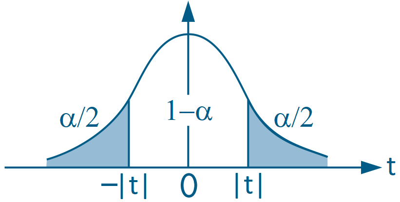

## Operações matriciais no R
- [Vectorized operations (John Hopkins/Coursera)](https://www.coursera.org/learn/r-programming/lecture/nobfZ/vectorized-operations)
- Ao utilizar as operações matemáticas convencionais em vetores, cada elemento é operacionalizado com o elemento na mesma posição do outro vetor

```r
x = 1:4

x + x # soma de cada elemento na mesma posição
```

```
## [1] 2 4 6 8
```

```r
x + 2 # soma de de cada elemento com um mesmo escalar
```

```
## [1] 3 4 5 6
```

```r
x * x # multiplicação de cada elemento na mesma posição
```

```
## [1]  1  4  9 16
```

```r
x / x # divisão de cada elemento na mesma posição
```

```
## [1] 1 1 1 1
```


- Além disso, podemos fazer
  - **Transposta de uma matriz ou vetor**: função `t()`
  - **Multiplicação matricial ou vetorial (produto interno)**: operador `%*%`
  - **Inversa de uma matriz (quadrada)**: função `solve()`


```r
# Operações vetoriais
x %*% x # x vetor-linha / x vetor-coluna
```

```
##      [,1]
## [1,]   30
```

```r
x %*% t(x) # x vetor-coluna / x vetor-linha (altera ambos, mas t() só no 2o)
```

```
##      [,1] [,2] [,3] [,4]
## [1,]    1    2    3    4
## [2,]    2    4    6    8
## [3,]    3    6    9   12
## [4,]    4    8   12   16
```

- Por padrão, o R considera que o 1º vetor é um vetor-linha e o 2º é um vetor-coluna quando fazemos uma multiplicação vetorial.
- Dado que adotamos vetores-coluna como padrão, sugiro "forçar" um vetor em linha ou em coluna via função `matrix()`.


```r
# Transformando em vetor-coluna
x_col = matrix(x, ncol=1)
x_col
```

```
##      [,1]
## [1,]    1
## [2,]    2
## [3,]    3
## [4,]    4
```

```r
# Operações vetoriais
t(x_col) %*% x_col # produto interno
```

```
##      [,1]
## [1,]   30
```

```r
x_col %*% t(x_col) # produto externo
```

```
##      [,1] [,2] [,3] [,4]
## [1,]    1    2    3    4
## [2,]    2    4    6    8
## [3,]    3    6    9   12
## [4,]    4    8   12   16
```

</br>

- O mesmo é válido para matrizes:

```r
# Como exemplo, criaremos matriz X de dimensão 4x2
X = matrix(1:8, nrow=4, ncol=2)
X
```

```
##      [,1] [,2]
## [1,]    1    5
## [2,]    2    6
## [3,]    3    7
## [4,]    4    8
```

```r
# Transposta de X (2x4)
t(X)
```

```
##      [,1] [,2] [,3] [,4]
## [1,]    1    2    3    4
## [2,]    5    6    7    8
```

```r
# Produto matricial X'X (2x2)
t(X) %*% X
```

```
##      [,1] [,2]
## [1,]   30   70
## [2,]   70  174
```

```r
# Inversa de X'X (2x2)
solve( t(X) %*% X )
```

```
##          [,1]     [,2]
## [1,]  0.54375 -0.21875
## [2,] -0.21875  0.09375
```

- Também podemos criar uma matrix identidade usando a função `diag()` e informando um número inteiro

```r
# Matriz identidade de dimensão 4
I = diag(4)
I
```

```
##      [,1] [,2] [,3] [,4]
## [1,]    1    0    0    0
## [2,]    0    1    0    0
## [3,]    0    0    1    0
## [4,]    0    0    0    1
```

```r
# diag() pode alterar valores da diagonal de uma matriz existente
diag(I) = 1:4
I
```

```
##      [,1] [,2] [,3] [,4]
## [1,]    1    0    0    0
## [2,]    0    2    0    0
## [3,]    0    0    3    0
## [4,]    0    0    0    4
```

</br>

## MQO na forma matricial

- [Seção 3.2 de Heiss (2020)](http://www.urfie.net/read/index.html#page/119)


### Notações

- Para mais detalhes sobre a forma matricial do MQO, ver Apêndice E de Wooldridge (2006)
- Considere o modelo multivariado com $K$ regressores para a observação $i$:
$$ y_i = \beta_0 + \beta_1 x_{i1} + \beta_2 x_{i2} + ... + \beta_K x_{iK} + \varepsilon_i, \qquad i=1, 2, ..., N \tag{E.1} $$
em que $N$ é o número de observações.

- Defina o vetor-coluna de parâmetros, $\boldsymbol{\beta}$, e o vetor-linha de variáveis independentes da observação $i$, $\boldsymbol{x}'_i$ (minúsculo):
$$ \underset{1 \times K}{\boldsymbol{x}'_i} = \left[ \begin{matrix} 1 & x_{i1} & x_{i2} & \cdots & x_{iK}  \end{matrix} \right]  \qquad \text{e} \qquad  \underset{(K+1) \times 1}{\boldsymbol{\beta}} = \left[ \begin{matrix} \beta_0 \\ \beta_1 \\ \beta_2 \\ \vdots \\ \beta_K \end{matrix} \right],$$

- Note que o produto interno $\boldsymbol{x}'_i \boldsymbol{\beta}$ é:

\begin{align} \underset{1 \times 1}{\boldsymbol{x}'_i \boldsymbol{\beta}} &= \left[ \begin{matrix} 1 & x_{i1} & x_{i2} & \cdots & x_{iK}  \end{matrix} \right]  \left[ \begin{matrix} \beta_0 \\ \beta_1 \\ \beta_2 \\ \vdots \\ \beta_K \end{matrix} \right]\\
&= 1.\beta_0 + x_{i1} \beta_1  + x_{i2} \beta_2 + \cdots + x_{iK} \beta_K, \end{align}

- Logo, a equação (3.1) pode ser reescrita, para $i=1, 2, ..., N$, como

$$ y_i = \underbrace{\beta_0 + \beta_1 x_{i1} + \beta_2 x_{i2} + ... + \beta_K x_{iK}}_{\boldsymbol{x}'_i \boldsymbol{\beta}} + \varepsilon_i = \boldsymbol{x}'_i \boldsymbol{\beta} + \varepsilon_i, \tag{E.2} $$

- Considere $\boldsymbol{X}$ a matriz de todas $N$ observações para as $K+1$ variáveis explicativas:

$$ \underset{N \times (K+1)}{\boldsymbol{X}} = \left[ \begin{matrix} \boldsymbol{x}_1 \\ \boldsymbol{x}_2 \\ \vdots \\ \boldsymbol{x}_N \end{matrix} \right] = \left[ \begin{matrix} 1 & x_{11} & x_{12} & \cdots & x_{1K}   \\ 1 & x_{21} & x_{22} & \cdots & x_{2K} \\ \vdots & \vdots & \vdots & \ddots & \vdots \\ 1 & x_{N1} & x_{N2} & \cdots & x_{NK} \end{matrix} \right] , $$

- Agora, podemos "empilhar" as equações (3.2) para todo $i=1, 2, ..., N$ e obtemos:

\begin{align} \boldsymbol{y} &= \boldsymbol{X} \boldsymbol{\beta} + \boldsymbol{\varepsilon} \tag{E.3} \\
&= \left[ \begin{matrix} 1 & x_{11} & x_{12} & \cdots & x_{1K}   \\ 1 & x_{21} & x_{22} & \cdots & x_{2K} \\ \vdots & \vdots & \vdots & \ddots & \vdots \\ 1 & x_{N1} & x_{N2} & \cdots & x_{NK} \end{matrix} \right] \left[ \begin{matrix} \beta_0 \\ \beta_1 \\ \beta_2 \\ \vdots \\ \beta_K \end{matrix} \right] + \left[ \begin{matrix}\varepsilon_1 \\ \varepsilon_2 \\ \vdots \\ \varepsilon_N \end{matrix} \right]   \\
&= \left[ \begin{matrix} \beta_0. 1 + \beta_1 x_{11} + \beta_2 x_{12} + ... + \beta_K x_{1K} \\ \beta_0 .1 + \beta_1 x_{21} + \beta_2 x_{22} + ... + \beta_K x_{2K} \\ \vdots \\ \beta_0. 1 + \beta_1 x_{N1} + \beta_2 x_{N2} + ... + \beta_K x_{NK} \end{matrix} \right] + \left[ \begin{matrix}\varepsilon_1 \\ \varepsilon_2 \\ \vdots \\ \varepsilon_N \end{matrix} \right]\\
&= \left[ \begin{matrix} \beta_0. 1 + \beta_1 x_{11} + \beta_2 x_{12} + ... + \beta_K x_{1K} + \varepsilon_1 \\ \beta_0 .1 + \beta_1 x_{21} + \beta_2 x_{22} + ... + \beta_K x_{2K} + \varepsilon_2 \\ \vdots \\ \beta_0. 1 + \beta_1 x_{N1} + \beta_2 x_{N2} + ... + \beta_K x_{NK} + \varepsilon_N \end{matrix} \right]\\
&= \left[ \begin{matrix}y_1 \\ y_2 \\ \vdots \\ y_N \end{matrix} \right] = \boldsymbol{y} \end{align}

### Estimativas de MQO

$$ \hat{\boldsymbol{\beta}} = \left[ \begin{matrix} \hat{\beta}_0 \\ \hat{\beta}_1 \\ \hat{\beta}_2 \\ \vdots \\ \hat{\beta}_K \end{matrix} \right] = (\boldsymbol{X}'\boldsymbol{X})^{-1} \boldsymbol{X}' \boldsymbol{y} \tag{3.2} $$


### Valores preditos
$$ \hat{\boldsymbol{y}} = \boldsymbol{X} \hat{\boldsymbol{\beta}}  $$


### Resíduos
$$ \hat{\boldsymbol{\varepsilon}} = \boldsymbol{y} - \hat{\boldsymbol{y}} \tag{3.3}  $$


### Matriz de variâncias-covariâncias dos erros
A Matriz de variâncias-covariâncias dos erros relaciona um termo de erro, $\varepsilon_{i}$, com todos os demais termos de erro $\varepsilon_{j}$, para todo $j = 1, ..., N$.

Na matriz de covariância de erro, cada linha representa um $\varepsilon_{i}$ e cada coluna representa um $\varepsilon_{j}$. Seus elementos representam a covariância entre 
$\varepsilon_{i}$ e $\varepsilon_{j}$, sendo que pode haver $\varepsilon_{i} = \varepsilon_{j}$ (que, neste caso, torna-se variância):

$$ cov(\boldsymbol{\varepsilon}) = \underset{N \times N}{\boldsymbol{\Sigma}} = 
\left[ \begin{array}{cccc}
var(\varepsilon_{1}) & cov(\varepsilon_{1}, \varepsilon_{2}) & \cdots & cov(\varepsilon_{1}, \varepsilon_{N}) \\
cov(\varepsilon_{2}, \varepsilon_{1}) & var(\varepsilon_{2}) & \cdots & cov(\varepsilon_{2}, \varepsilon_{N}) \\
\vdots & \vdots & \ddots & \vdots \\
cov(\varepsilon_{N}, \varepsilon_{1}) & cov(\varepsilon_{N}, \varepsilon_{2}) & \cdots & var(\varepsilon_{N}) 
\end{array} \right]$$

Como assumimos amostragem aleatória, a covariância entre dois indivíduos distintos ($i \neq j$) é  
$$ cov(\varepsilon_{i}, \varepsilon_{j}) = 0,  \qquad \text{para todo } i \neq j.$$

Logo, 
$$ \boldsymbol{\Sigma} = 
\left[ \begin{array}{cccc}
var(\varepsilon_{1}) & 0 & \cdots & 0 \\
0 & var(\varepsilon_{2}) & \cdots & 0 \\
\vdots & \vdots & \ddots & \vdots \\
0 & 0 & \cdots & var(\varepsilon_{N}) 
\end{array} \right]$$


Como também assumimos homocedasticidade, $ var(\varepsilon_i) = \sigma^2,\ \forall i$, então:

$$ \boldsymbol{\Sigma} = 
\left[ \begin{array}{cccc}
\sigma^2 & 0 & \cdots & 0 \\
0 & \sigma^2 & \cdots & 0 \\
\vdots & \vdots & \ddots & \vdots \\
0 & 0 & \cdots & \sigma^2 
\end{array} \right] = \sigma^2 \begin{bmatrix} 1 & 0 & \cdots & 0 \\
0 & 1 & \cdots & 0 \\
\vdots & \vdots & \ddots & \vdots \\
0 & 0 & \cdots & 1  \end{bmatrix} = \sigma^2 I_N $$


### Variância do termo de erro

Como não conhecemos a variância do termo de erro $\sigma^2$, precisamos estimá-la usando:

$$ \hat{\sigma}^2 = \frac{\hat{\boldsymbol{\varepsilon}}'\hat{\boldsymbol{\varepsilon}}}{N-K-1}  $$


### Matriz de variâncias-covariâncias do estimador

- A matriz de variâncias-covariâncias do estimador tem a seguinte estrutura
$$ V(\hat{\boldsymbol{\beta}}) 
= \begin{bmatrix} var(\hat{\beta}_0) & cov(\hat{\beta}_0, \hat{\beta}_1) & \cdots &  cov(\hat{\beta}_0, \hat{\beta}_K) \\
cov(\hat{\beta}_1, \hat{\beta}_0) & var(\hat{\beta}_1) & \cdots &  cov(\hat{\beta}_1, \hat{\beta}_K) \\
\vdots & \vdots & \ddots & \vdots \\
cov(\hat{\beta}_K, \hat{\beta}_0) & cov(\hat{\beta}_K, \hat{\beta}_1) & \cdots &  var(\hat{\beta}_K) \end{bmatrix} $$

- Essa matriz pode ser obtida usando:
$$ V(\hat{\boldsymbol{\beta}}) = (\boldsymbol{X}'\boldsymbol{X})^{-1} \boldsymbol{X}' \boldsymbol{\Sigma} \boldsymbol{X} (\boldsymbol{X}'\boldsymbol{X})^{-1}, $$
mas como MQO supõe $ \boldsymbol{\Sigma} = \sigma^2 \boldsymbol{I} $, então a matriz de variâncias-covariâncias do estimador pode ser simplificada:

\begin{align} V(\hat{\boldsymbol{\beta}}) 
&= (\boldsymbol{X}'\boldsymbol{X})^{-1} \boldsymbol{X}' \boldsymbol{\Sigma} \boldsymbol{X} (\boldsymbol{X}'\boldsymbol{X})^{-1} \\ 
&= (\boldsymbol{X}'\boldsymbol{X})^{-1} \boldsymbol{X}' \left[ \sigma^2 \boldsymbol{I} \right] \boldsymbol{X} (\boldsymbol{X}'\boldsymbol{X})^{-1} \\
&= \sigma^2 (\boldsymbol{X}'\boldsymbol{X})^{-1} \boldsymbol{X}' \boldsymbol{X} (\boldsymbol{X}'\boldsymbol{X})^{-1} \\
&= \sigma^2 (\boldsymbol{X}'\boldsymbol{X})^{-1} \end{align}


### Erros-padrão do estimador
Os erros padrão do estimador podem ser obtidos tomando a raiz quadrada da diagonal principal da matriz de variância-covariância do estimador:

$$\text{se}(\hat{\boldsymbol{\beta}}) = \sqrt{\text{diag}(V(\hat{\boldsymbol{\beta}}))} = \begin{bmatrix} \sqrt{\text{var}(\hat{\beta}_0)} \\ \sqrt{\text{var}(\hat{\beta}_1)} \\ \vdots \\ \sqrt{\text{var}(\hat{\beta}_K)} \end{bmatrix} = \begin{bmatrix} \text{se}(\hat{\beta}_0) \\ \text{se}(\hat{\beta}_1) \\ \vdots \\ \text{se}(\hat{\beta}_K) \end{bmatrix} $$


### Teste _t_

- [Seção 4.1 de Heiss (2020)](http://www.urfie.net/read/index.html#page/127)

- Após a estimação, é importante testar hipóteses na forma
$$ H_0: \ \beta_k = h_k \tag{4.1} $$
tal que $h_k$ é uma constante, e $k$ é um dos $K+1$ parâmetros estimados.

- Esta hipótese pode ser testada pelo teste _t_:
$$ t_k = \frac{\hat{\beta}_k - h_k}{\text{se}(\hat{\beta}_k)} \tag{4.4} $$

- Por padrão, as rotinas de softwares estatísticos realizam o teste bicaudal com $h_k=0$ para testar se a estimativa $\hat{\beta}_k$ é estatisticamente significante (efeito estatisticamente diferente de zero sobre a variável dependente):

\begin{align} 
H_0: \ \beta_k &= 0, \tag{4.5}\\
t_{\hat{\beta}_k} &= \frac{\hat{\beta}_k}{\text{se}(\hat{\beta}_k)} \tag{4.6}
\end{align}

- Há três formas de avaliar essa hipótese.
- **(i)** A primeira é por meio da comparação da **estatística _t_** com o valor crítico (cv), dado um nível de significância $\alpha$:
$$ \text{Rejeitamos H}_0 \text{ se:} \qquad | t_{\hat{\beta}_k} | > \text{cv}_{\scriptscriptstyle{1-\alpha}}. $$


- Frequentemente, utiliza-se $\alpha = 5\%$, cujo valor crítico tende a ficar próximo de 2,0 para quantidades razoáveis de graus de liberdade (e se aproxima ao valor crítico de 1,96 da distribuição normal).

</br>

- **(ii)** Outra maneira de avaliar a hipótese nula é via **p-valor**, que indica o quão provável é que  $\hat{\beta}_k$ não seja um valor extremo (ou seja, o quão provável é que a estimativa seja igual a $h_k = 0$).
$$ p_{\hat{\beta}_k} = 2.\Phi_{t_{\small{(N-K-1)}}}(-|t_{\hat{\beta}_k}|), \tag{4.7} $$
em que $\Phi_{t_{\small{(N-K-1)}}}(\cdot)$ é a cdf de uma distribuição _t_ com $(N-K-1)$ graus de liberdade.

<center></center>

- Portanto, rejeitamos $H_0$ quando o p-valor for menor do que um nível de significância $\alpha$:
$$ \text{Rejeitamos H}_0 \text{ se:} \qquad p_{\hat{\beta}_k} \le \alpha $$


</br>

- **(iii)** A terceira maneira de avaliar a hipótese nula é via cálculo do **intervalo de confiança**:
$$ \text{CI}_\alpha = \hat{\beta}_k\ \pm\ \text{cv}_{\scriptscriptstyle{1-\alpha}} . \text{se}(\hat{\beta}_k) \tag{4.8} $$
- Rejeitamos a hipótese nula, neste caso, quando $h_k$ estiver fora do intervalo de confiança.


</br>


## Estimação MQO multivariado

### Estimação via `lm()`

- [Seção 3.1 de Heiss (2020)](http://www.urfie.net/read/index.html#page/115)

- Para estimar um modelo multivariado no R, podemos usar a função `lm()`:
  - O til (`~`) separa a a variável dependente das variáveis independentes
  - As variáveis independentes precisam ser separadas por um `+`
  - O intercepto ($\beta_0$) é incluído automaticamente pela função `lm()` -- para retirá-lo, é preciso incluir a "variável" `0` na fórmula.


#### Exemplo 3.1: Determinantes da Nota Média em Curso Superior nos EUA
- Sejam as variáveis
    - `colGPA` (_college GPA_): a nota média em um curso superior,
    - `hsGPA` (_high school GPA_): a nota médio do ensino médio, e
    - `ACT` (_achievement test score_): a nota de avaliação de conhecimentos para ingresso no ensino superior.
- Usando a base `gpa1` do pacote `wooldridge`, vamos estimar o seguinte modelo:

$$ \text{colGPA} = \beta_0 + \beta_1 \text{hsGPA} + \beta_2 \text{ACT} + \varepsilon $$


```r
# Acessando a base de dados gpa1
data(gpa1, package = "wooldridge")

# Estimando o modelo
reg = lm(colGPA ~ hsGPA + ACT, data = gpa1)
reg
```

```
## 
## Call:
## lm(formula = colGPA ~ hsGPA + ACT, data = gpa1)
## 
## Coefficients:
## (Intercept)        hsGPA          ACT  
##    1.286328     0.453456     0.009426
```

- Note que podemos ver mais detalhes da estimação usando a função `summary()` no objeto resultante da função `lm()`

```r
summary(reg)
```

```
## 
## Call:
## lm(formula = colGPA ~ hsGPA + ACT, data = gpa1)
## 
## Residuals:
##      Min       1Q   Median       3Q      Max 
## -0.85442 -0.24666 -0.02614  0.28127  0.85357 
## 
## Coefficients:
##             Estimate Std. Error t value Pr(>|t|)    
## (Intercept) 1.286328   0.340822   3.774 0.000238 ***
## hsGPA       0.453456   0.095813   4.733 5.42e-06 ***
## ACT         0.009426   0.010777   0.875 0.383297    
## ---
## Signif. codes:  0 '***' 0.001 '**' 0.01 '*' 0.05 '.' 0.1 ' ' 1
## 
## Residual standard error: 0.3403 on 138 degrees of freedom
## Multiple R-squared:  0.1764,	Adjusted R-squared:  0.1645 
## F-statistic: 14.78 on 2 and 138 DF,  p-value: 1.526e-06
```

- Podemos extrair apenas a matriz 'Coefficients' usando `coef()` ou `$coef`, e o intervalo de confiança usando `confint()`

```r
# Coefficients
coef(summary(reg))
```

```
##                Estimate Std. Error   t value     Pr(>|t|)
## (Intercept) 1.286327767 0.34082212 3.7741910 2.375872e-04
## hsGPA       0.453455885 0.09581292 4.7327219 5.421580e-06
## ACT         0.009426012 0.01077719 0.8746263 3.832969e-01
```

```r
summary(reg)$coef
```

```
##                Estimate Std. Error   t value     Pr(>|t|)
## (Intercept) 1.286327767 0.34082212 3.7741910 2.375872e-04
## hsGPA       0.453455885 0.09581292 4.7327219 5.421580e-06
## ACT         0.009426012 0.01077719 0.8746263 3.832969e-01
```

```r
# note que se não usarmos summary(), temos apenas as estimativas
coef(reg)
```

```
## (Intercept)       hsGPA         ACT 
## 1.286327767 0.453455885 0.009426012
```

```r
# Intervalo de confiança
confint(reg)
```

```
##                   2.5 %     97.5 %
## (Intercept)  0.61241898 1.96023655
## hsGPA        0.26400467 0.64290710
## ACT         -0.01188376 0.03073578
```

- Além disso, podemos extrair a matriz de variâncias-covariâncias do estimador com `vcov()`:

```r
vcov(reg) 
```

```
##              (Intercept)         hsGPA           ACT
## (Intercept)  0.116159717 -0.0226063687 -0.0015908486
## hsGPA       -0.022606369  0.0091801149 -0.0003570767
## ACT         -0.001590849 -0.0003570767  0.0001161478
```


### Estimação Analítica

#### Exemplo - Determinantes da Nota Média em Curso Superior nos EUA
- Queremos estimar o modelo:
$$ \text{colGPA} = \beta_0 + \beta_1 \text{hsGPA} + \beta_2 \text{ACT} + \varepsilon $$

- A partir da base de dados `gpa1`, vamos criar o vetor da variável dependente `y` e a matrix das variáveis independentes `X`:


```r
# Acessando a base de dados gpa1
data(gpa1, package = "wooldridge")

# Criando o vetor y
y = as.matrix(gpa1[,"colGPA"]) # transformando coluna de data frame em matriz
head(y)
```

```
##      [,1]
## [1,]  3.0
## [2,]  3.4
## [3,]  3.0
## [4,]  3.5
## [5,]  3.6
## [6,]  3.0
```

```r
# Criando a matriz de covariadas X com primeira coluna de 1's
X = cbind( 1, gpa1[, c("hsGPA", "ACT")] ) # juntando 1's com as covariadas
X = as.matrix(X) # transformando em matriz
head(X)
```

```
##   1 hsGPA ACT
## 1 1   3.0  21
## 2 1   3.2  24
## 3 1   3.6  26
## 4 1   3.5  27
## 5 1   3.9  28
## 6 1   3.4  25
```

```r
# Pegando valores N e K
N = nrow(gpa1)
K = ncol(X) - 1
N
```

```
## [1] 141
```

```r
K
```

```
## [1] 2
```

##### 1. Estimativas de MQO $\hat{\boldsymbol{\beta}}$

```r
bhat = solve( t(X) %*% X ) %*% t(X) %*% y
bhat
```

```
##              [,1]
## 1     1.286327767
## hsGPA 0.453455885
## ACT   0.009426012
```


##### 2. Valores preditos/ajustados $\hat{\boldsymbol{y}}$

```r
yhat = X %*% bhat
head(yhat)
```

```
##       [,1]
## 1 2.844642
## 2 2.963611
## 3 3.163845
## 4 3.127926
## 5 3.318734
## 6 3.063728
```


##### 3. Resíduos $\hat{\boldsymbol{\varepsilon}}$

```r
ehat = y - yhat
head(ehat)
```

```
##          [,1]
## 1  0.15535832
## 2  0.43638918
## 3 -0.16384523
## 4  0.37207430
## 5  0.28126580
## 6 -0.06372813
```


##### 4. Variância do termo de erro $\hat{\sigma}^2$
Como $\hat{\sigma}^2$ é um escalar, é conveniente transformar a "matriz 1x1" em um número usando `as.numeric()`:

```r
sig2hat = as.numeric( t(ehat) %*% ehat / (N-K-1) )
sig2hat
```

```
## [1] 0.1158148
```


##### 5. Matriz de variâncias-covariâncias do estimador $\text{V}(\hat{\boldsymbol{\beta}})$

```r
Vbhat = sig2hat * solve( t(X) %*% X )
Vbhat
```

```
##                  1         hsGPA           ACT
## 1      0.116159717 -0.0226063687 -0.0015908486
## hsGPA -0.022606369  0.0091801149 -0.0003570767
## ACT   -0.001590849 -0.0003570767  0.0001161478
```


##### 6. Erros-padrão do estimador $\text{se}(\hat{\boldsymbol{\beta}})$

```r
se_bhat = sqrt( diag(Vbhat) )
se_bhat
```

```
##          1      hsGPA        ACT 
## 0.34082212 0.09581292 0.01077719
```


##### 7. Estatística _t_

```r
# Cálculo da estatística t
t_bhat = bhat / se_bhat
t_bhat
```

```
##            [,1]
## 1     3.7741910
## hsGPA 4.7327219
## ACT   0.8746263
```


##### 8. Avaliando as hipóteses nulas

```r
# definição do nível de significância
alpha = 0.05
cv = qt(1 - alpha/2, N-K-1) # valor crítico de teste bicaudal
cv
```

```
## [1] 1.977304
```

```r
# (i) Comparando estatística t com o valor crítico
abs(t_bhat) > cv # avaliando H0
```

```
##        [,1]
## 1      TRUE
## hsGPA  TRUE
## ACT   FALSE
```

```r
# (ii) Comparando p-valor com o nível de significância de 5%
p_bhat = 2 * pt(-abs(t_bhat), N-K-1)
round(p_bhat, 5) # arredondando para facilitar visualização
```

```
##          [,1]
## 1     0.00024
## hsGPA 0.00001
## ACT   0.38330
```

```r
p_bhat < 0.05 # avaliando H0
```

```
##        [,1]
## 1      TRUE
## hsGPA  TRUE
## ACT   FALSE
```

```r
# (ii) Verificando se zero (0) está fora do intervalo de confiança
ci = cbind(bhat - cv*se_bhat, bhat + cv*se_bhat) # avaliando H0
ci
```

```
##              [,1]       [,2]
## 1      0.61241898 1.96023655
## hsGPA  0.26400467 0.64290710
## ACT   -0.01188376 0.03073578
```


##### Comparando estimações via `lm()` e analítica
- Resultados calculados analiticamente ("na mão")

```r
round( cbind(bhat, se_bhat, t_bhat, p_bhat), 4 ) # coeficientes
```

```
##              se_bhat              
## 1     1.2863  0.3408 3.7742 0.0002
## hsGPA 0.4535  0.0958 4.7327 0.0000
## ACT   0.0094  0.0108 0.8746 0.3833
```

```r
round(ci, 4) # intervalos de confiança
```

```
##          [,1]   [,2]
## 1      0.6124 1.9602
## hsGPA  0.2640 0.6429
## ACT   -0.0119 0.0307
```

- Resultado via função `lm()`

```r
round( summary(reg)$coef, 4 ) # coeficientes
```

```
##             Estimate Std. Error t value Pr(>|t|)
## (Intercept)   1.2863     0.3408  3.7742   0.0002
## hsGPA         0.4535     0.0958  4.7327   0.0000
## ACT           0.0094     0.0108  0.8746   0.3833
```

```r
round( confint(reg), 4 ) # intervalos de confiança
```

```
##               2.5 % 97.5 %
## (Intercept)  0.6124 1.9602
## hsGPA        0.2640 0.6429
## ACT         -0.0119 0.0307
```


</br>

## Transformação de Variáveis e Comparação de Regressões

- [Seção 4.4 de Heiss (2020)](http://www.urfie.net/read/index.html#page/137)
- Aqui, vamos utilizar um exemplo para mostrar como:
  - tranformar variáveis diretamente da função `lm()`, e
  - informar os resultados de diversas regressões usando a função `stargazer()` do pacote `stargazer`.


#### Exemplo 4.10 - A Relação Salário-Benefícios de Professores
- Vamos usar a base de dados `meap93` do pacote `wooldridge` e queremos estimar o modelo

$$ \log{(\text{salary})} = \beta_0 + \beta_1. \left(\frac{\text{benefits}}{\text{salary}}\right) + \text{outros_fatores} + \varepsilon $$

- Primeiro, vamos carregar a base de dados e criar a variável benefits/salary (`b_s`):

```r
data(meap93, package="wooldridge") # carregando base de dados

# Definindo nova variável
meap93$b_s = meap93$benefits / meap93$salary
```

- Agora vamos estimar diversos modelos:
  - Modelo 1: apenas *benefits/salary* como regressor
  - Modelo 2: incluir as variáveis explicativas *log(enroll)* e *log(staff)*
  - Modelo 3: incluir as variáveis explicativas *droprate* e *droprate²*

- Para fazer transformações dentro de `lm()`, é necessário usar a função `I()`

```r
# Estimando os três modelos
model1 = lm(log(salary) ~ I(benefits/salary), meap93)
model2 = lm(log(salary) ~ I(benefits/salary) + log(enroll) + log(staff), meap93)
model3 = lm(log(salary) ~ I(benefits/salary) + log(enroll) +
              log(staff) + droprate + I(droprate^2), meap93)
round(summary(model3)$coef, 4)
```

```
##                    Estimate Std. Error t value Pr(>|t|)
## (Intercept)         10.8291     0.2514 43.0674   0.0000
## I(benefits/salary)  -0.5958     0.1655 -3.6008   0.0004
## log(enroll)          0.0877     0.0073 11.9509   0.0000
## log(staff)          -0.2173     0.0501 -4.3382   0.0000
## droprate            -0.0025     0.0021 -1.2014   0.2303
## I(droprate^2)        0.0000     0.0001  0.2851   0.7757
```


- Agora, vamos resumir os resultados em uma única tabela usando a função `stargazer()` pacote `stargazer`
  - `type="text"` para retornar o resultado no próprio console (se omitir esse argumento, retorna o código em LaTeX)
  - `keep.stat=c("n", "rsq")` para manter apenas os nº de observações e os R$^2$


```r
# Resumindo em uma tabela
library(stargazer)
stargazer(list(model1, model2, model3), type="text", keep.stat=c("n", "rsq"))
```

```
## 
## ================================================
##                         Dependent variable:     
##                    -----------------------------
##                             log(salary)         
##                       (1)       (2)       (3)   
## ------------------------------------------------
## I(benefits/salary) -0.825*** -0.605*** -0.596***
##                     (0.200)   (0.165)   (0.165) 
##                                                 
## log(enroll)                  0.087***  0.088*** 
##                               (0.007)   (0.007) 
##                                                 
## log(staff)                   -0.222*** -0.217***
##                               (0.050)   (0.050) 
##                                                 
## droprate                                -0.002  
##                                         (0.002) 
##                                                 
## I(droprate2)                            0.00001 
##                                        (0.0001) 
##                                                 
## Constant           10.523*** 10.844*** 10.829***
##                     (0.042)   (0.252)   (0.251) 
##                                                 
## ------------------------------------------------
## Observations          408       408       408   
## R2                   0.040     0.353     0.358  
## ================================================
## Note:                *p<0.1; **p<0.05; ***p<0.01
```

- É comum que os resultados econométricos venham acompanhados de asteriscos (`*`), pois estes indicam o quão significantes são as estimativas.
- Quanto menor o nível de significância, mais asteriscos são inseridos e estes facilitam a interpretação das estimativas estatisticamente diferentes de zero.


</br>

## Regressores Qualitativos

- Muitas variáveis de interesse são qualitativas, ao invés de quantitativas.
- Isso inclui variáveis como _sexo_, _cor/raça_, _status de trabalho_, _estado civil_, _escolha de marca_, etc.


### Variáveis Dummy

- [Seção 7.1 de Heiss (2020)](http://www.urfie.net/read/index.html#page/161)
- Se um dado qualitativo está armazenado na base como uma variável qualitativa (ou seja, seus valores são 0's ou 1's), então ele pode ser inserido imediatamente numa regressão linear.
- Se uma variável dummy for usada num modelo, seu coeficiente representa a diferença do intercepto entre os grupos (Wooldridge, 2006, Seção 7.2)


##### Exemplo 7.5 - Equação do Log do Salário-Hora


- Podemos calcular a **diferença de médias** de uma variável dependente por meio de uma regressão sobre uma variável _dummy_, cujos valores são 0 ou 1.
- Vamos utilizar a base de dados `wage1` do pacote `wooldridge`  para estimar o seguinte modelo
$$ \text{wage} = \beta_0 + \beta_1 \text{female} + \varepsilon $$

- Observe que, se incluirmos apenas uma dummy (_female_) como covariada, a regressão calcula a **diferença de médias entre os dois grupos**:

```r
data(wage1, package="wooldridge")
reg = lm(wage ~ female, data=wage1)
round( summary(reg)$coef, 6 )
```

```
##              Estimate Std. Error   t value Pr(>|t|)
## (Intercept)  7.099489   0.210008 33.805777        0
## female      -2.511830   0.303409 -8.278688        0
```

```r
# calculando as médias de salário por sexo:
mean(wage1$wage[wage1$female==0]) # média salarial dos homens
```

```
## [1] 7.099489
```

```r
mean(wage1$wage[wage1$female==1]) # média salarial das mulheres
```

```
## [1] 4.587659
```

- Note que:
  - $\hat{\beta}_0$ é a média salarial dos homens (`female==0`)
  - $\hat{\beta}_1$ é a diferença salarial entre os homens (`female==0`) e as mulheres (`female==1`)
  - A soma $\hat{\beta}_0 + $\hat{\beta}_1$$ é igual à média das mulheres.
- A vantagem de fazer a regressão de diferença de médias é que podemos usar a estatística _t_ para avaliar se a diferença é estatisticamente significante entre os dois grupos.
- Neste caso, a diferença é bastante significante (p-valor < 0,01%)


</br>


- Agora, vamos estimar o modelo com mais variáveis explicativas:

\begin{align}
\text{wage} = &\beta_0 + \beta_1 \text{female} + \beta_2 \text{educ} + \beta_3 \text{exper} + \beta_4 \text{exper}^2 +\\
&\beta_5 \text{tenure} + \beta_6 \text{tenure}^2 + \varepsilon \tag{7.6} \end{align}
em que:


```r
# Carregando a base de dados necessária
data(wage1, package="wooldridge")

# Estimando o modelo
reg = lm(wage ~ female + educ + exper + expersq + tenure + tenursq, data=wage1)
round( summary(reg)$coef, 4 )
```

```
##             Estimate Std. Error t value Pr(>|t|)
## (Intercept)  -2.1097     0.7107 -2.9687   0.0031
## female       -1.7832     0.2572 -6.9327   0.0000
## educ          0.5263     0.0485 10.8412   0.0000
## exper         0.1878     0.0357  5.2557   0.0000
## expersq      -0.0038     0.0008 -4.9267   0.0000
## tenure        0.2117     0.0492  4.3050   0.0000
## tenursq      -0.0029     0.0017 -1.7473   0.0812
```

- Nota-se que as mulheres (`female == 1`) recebem em média $1,78/hora a menos, em relação aos homens (`female == 0`).
- Isto implica que, neste modelo, o **intercepto** das mulheres é 1,78 inferior aos dos homens.
- Essa diferença é estatisticamente significante (p-valor de `female` é menor do que 5\%)


### Variáveis com múltiplas categorias

- [Seção 7.3 de Heiss (2020)](http://www.urfie.net/read/index.html#page/164)
- Quando temos uma variável categórica com mais de 2 categorias, não é possível simplesmente usá-la na regressão como se fosse uma _dummy_.
- É necessário criar uma _dummy_ para cada categoria
- Quando for feita a estimação do modelo, é necessário deixar uma destas categorias de fora para evitar problema de multicolinearidade perfeita.
  - Conhecendo todas as _dummies_ menos uma, dá para saber o valor esta última _dummy_
  - Se todas outras dummies forem iguais a 0, a última dummy é igual a 1
  - Se houver outra dummy igual a 1, então última dummy é igual a 0
- Além disso, a categoria deixada de fora acaba sendo usada **referência** quando são estimados os parâmetros.


##### Exemplo: Efeito do aumento do salário-mínimo sobre o emprego (Card e Krueger, 1994)

- Em 1992, o estado de New Jersey (NJ) aumentou o salário mínimo
- Para avaliar se o aumento do salário mínimo teria impacto na quantidade de trabalhadores empregados, usou como comparação o estado vizinho de Pennsylvania (PA), considerado parecido com NJ.
- Vamos estimar o seguinte modelo:

$$`
\text{diff_fte} = \beta_0 + \beta_1 \text{nj} + \beta_2 \text{chain} + \beta_3 \text{hrsopen} + \varepsilon $$
em que:

- `diff_emptot`: diferença de nº de empregados entre fev/1992 e nov/1992
- `nj`: dummy em que (1) New Jersey - NJ, e (0) Pennsylvania - PA
- `chain`: rede de fast food: (1) Burger King (`bk`), (2) KFC (`kfc`), (3) Roy's (`roys`), e (4) Wendy's (`wendys`)
- `hrsopen`: horas de funcionamento por dia


```r
card1994 = read.csv("https://fhnishida.netlify.app/project/rec5004/card1994.csv")
head(card1994) # olhando as 6 primeiras linhas
```

```
##   sheet nj chain hrsopen diff_fte
## 1    46  0     1    16.5   -16.50
## 2    49  0     2    13.0    -2.25
## 3    56  0     4    12.0   -14.00
## 4    61  0     4    12.0    11.50
## 5   445  0     1    18.0   -41.50
## 6   451  0     1    24.0    13.00
```

- Note que a variável categórica `chain` foi considerada como variável numérica, pois possui números ao invés de nomes das redes de fast food.
- Isto é comum em grandes bases de dados, já que números consomem menos espaço de armazenamento do que texto. Neste caso, há um dicionário indicando o que significa cada número.
- Caso você rode a estimação com a variável `chain` desta maneira, o modelo considerará que é uma variável contínua e prejudicando a sua análise:


```r
lm(diff_fte ~ nj + hrsopen + chain, data=card1994)
```

```
## 
## Call:
## lm(formula = diff_fte ~ nj + hrsopen + chain, data = card1994)
## 
## Coefficients:
## (Intercept)           nj      hrsopen        chain  
##     0.40284      4.61869     -0.28458     -0.06462
```

- Note que a interpretação é que a mudança de uma rede para a outra [como `bk` (1) para `kfc` (2), de `kfc` (2) para `roys` (3), ou de `roys` (3) para `wendys` (4)] diminuiu a variação do nº trabalhadores -- **o que não faz sentido!**
- Portanto, precisamos criar as _dummies_ das variáveis categóricas:


```r
# Criando dummies para cada variável
card1994$bk = ifelse(card1994$chain==1, 1, 0)
card1994$kfc = ifelse(card1994$chain==2, 1, 0)
card1994$roys = ifelse(card1994$chain==3, 1, 0)
card1994$wendys = ifelse(card1994$chain==4, 1, 0)

# Visualizando as primeras linhas
head(card1994)
```

```
##   sheet nj chain hrsopen diff_fte bk kfc roys wendys
## 1    46  0     1    16.5   -16.50  1   0    0      0
## 2    49  0     2    13.0    -2.25  0   1    0      0
## 3    56  0     4    12.0   -14.00  0   0    0      1
## 4    61  0     4    12.0    11.50  0   0    0      1
## 5   445  0     1    18.0   -41.50  1   0    0      0
## 6   451  0     1    24.0    13.00  1   0    0      0
```

- Também é possível criar _dummies_ mais facilmente usando a função `dummy_cols()` do pacote `fastDummies`
- Observe que, usando apenas três colunas das redes de fast food, é possível saber o valor da 4ª coluna, pois cada observação/loja só pode ser de uma dessas 4 redes de fast food e, portanto, há apenas um `1` em cada linha.
- Portanto, caso coloquemos as 4 _dummies_ quando formos rodar a regressão, haverá um problema de multicolinearidade perfeita:


```r
lm(diff_fte ~ nj + hrsopen + bk + kfc + roys + wendys, data=card1994)
```

```
## 
## Call:
## lm(formula = diff_fte ~ nj + hrsopen + bk + kfc + roys + wendys, 
##     data = card1994)
## 
## Coefficients:
## (Intercept)           nj      hrsopen           bk          kfc         roys  
##    2.097621     4.859363    -0.388792    -0.005512    -1.997213    -1.010903  
##      wendys  
##          NA
```

- Por padrão, o R já retira uma das categorias para servir como referência.
- Aqui, a categoria `wendys` serve como referência às estimativas das demais _dummies_
  - Em relação a `wendys`, o nº de empregados de:
    - `bk` teve uma variação de empregados muito parecida (apenas 0,005 menor)
    - `roys` teve uma diminuição (menos 1 empregado)
    - `kfc` teve uma maior diminuição (menos 2 empregados)
- Note que poderíamos usar como referência outra rede de fast food, deixando sua _dummy_ de fora da regressão.
- Vamos deixar de fora a _dummy_ do `roys`:


```r
lm(diff_fte ~ nj + hrsopen + bk + kfc + wendys, data=card1994)
```

```
## 
## Call:
## lm(formula = diff_fte ~ nj + hrsopen + bk + kfc + wendys, data = card1994)
## 
## Coefficients:
## (Intercept)           nj      hrsopen           bk          kfc       wendys  
##      1.0867       4.8594      -0.3888       1.0054      -0.9863       1.0109
```

- Note agora que os parâmetros estão em relação à `roys``:
  - estimativa de `kfc` que tinha ficado -2, agora está "menos" negativo (-1)
  - estimativas de `bk` e de `wendys` possuem estimativas positivas (lembre-se que, em relação a `wendys`, a estimativa de `roys` foi negativo na regressão anterior)

</br>

- No R, na verdade, não é necessário criar _dummies_ de uma variável categórica para rodar uma regressão, caso ela esteja como _texto_ ou como _factor_

- Criando variável da classe texto:

```r
card1994$chain_txt = as.character(card1994$chain) # criando variável texto
head(card1994$chain_txt) # Visualizado os primeiros valores
```

```
## [1] "1" "2" "4" "4" "1" "1"
```

```r
# Estimando do modelo
lm(diff_fte ~ nj + hrsopen + chain_txt, data=card1994)
```

```
## 
## Call:
## lm(formula = diff_fte ~ nj + hrsopen + chain_txt, data = card1994)
## 
## Coefficients:
## (Intercept)           nj      hrsopen   chain_txt2   chain_txt3   chain_txt4  
##    2.092109     4.859363    -0.388792    -1.991701    -1.005391     0.005512
```

- Observe que a função `lm()` retira a categoria que aparece primeiro no vetor de texto (`"1"`)
- Usando como variável texto, não é possível selecionar facilmente qual categoria vai ser retirada da regressão
- Para isto, podemos usar a classe de objeto `factor`:


```r
card1994$chain_fct = factor(card1994$chain) # criando variável factor
levels(card1994$chain_fct) # verificando os níveis (categorias) da variável factor
```

```
## [1] "1" "2" "3" "4"
```

```r
# Estimando do modelo
lm(diff_fte ~ nj + hrsopen + chain_fct, data=card1994)
```

```
## 
## Call:
## lm(formula = diff_fte ~ nj + hrsopen + chain_fct, data = card1994)
## 
## Coefficients:
## (Intercept)           nj      hrsopen   chain_fct2   chain_fct3   chain_fct4  
##    2.092109     4.859363    -0.388792    -1.991701    -1.005391     0.005512
```

- Note que a função `lm()` retira o primeiro nível da regressão (não necessariamente o que aparece primeiro na base de dados)
- Podemos trocar a referência usando a função `relevel()` em uma variável _factor_

```r
card1994$chain_fct = relevel(card1994$chain_fct, ref="3") # referência roys
levels(card1994$chain_fct) # verificando os níveis da variável factor
```

```
## [1] "3" "1" "2" "4"
```

```r
# Estimando do modelo
lm(diff_fte ~ nj + hrsopen + chain_fct, data=card1994)
```

```
## 
## Call:
## lm(formula = diff_fte ~ nj + hrsopen + chain_fct, data = card1994)
## 
## Coefficients:
## (Intercept)           nj      hrsopen   chain_fct1   chain_fct2   chain_fct4  
##      1.0867       4.8594      -0.3888       1.0054      -0.9863       1.0109
```

- Observe que o primeiro nível foi alterado para `"3"` e, portanto, essa categoria foi retirada na regressão


### Transformando variáveis contínuas em categorias
- [Seção 7.4 de Heiss (2020)](http://www.urfie.net/read/index.html#page/166) 
- Usando a função `cut()`, podemos "dividir" um vetor de números em intervalos, a partir de pontos de corte


```r
# Definindo pontos de corte
cutpts = c(0, 3, 6, 10)

# Classificando o vetor 1:10 a partir dos pontos de corte
cut(1:10, cutpts)
```

```
##  [1] (0,3]  (0,3]  (0,3]  (3,6]  (3,6]  (3,6]  (6,10] (6,10] (6,10] (6,10]
## Levels: (0,3] (3,6] (6,10]
```


##### Exemplo 7.8 - Efeitos da Classificação das Faculdade de Direito sobre Salários Iniciais

- Queremos verificar o quanto as universidades top 10 (`top10`), e as ranqueadas entre 11 e 25 (`r11_25`), entre 26 e 40 (`r26_40`), entre 41 e 60 (`r41_60`), e entre 61 e 100 (`r61_100`), impactam o log do salário (`log(salary)`) em relação às demais universidades (`r101_175`).
- Utilizaremos como variáveis de controle: `LSAT`, `GPA`, `llibvol` e `lcost`


```r
data(lawsch85, package="wooldridge") # carregando base de dados necessária

# Definindo pontos de corte
cutpts = c(0, 10, 25, 40, 60, 100, 175)

# Criando variável com a classificação
lawsch85$rankcat = cut(lawsch85$rank, cutpts)

# Visualizando os 6 primeiros valores de rankcat
head(lawsch85$rankcat)
```

```
## [1] (100,175] (100,175] (25,40]   (40,60]   (60,100]  (60,100] 
## Levels: (0,10] (10,25] (25,40] (40,60] (60,100] (100,175]
```

```r
# Escolhendo a categoria de referência (acima de 100 até 175)
lawsch85$rankcat = relevel(lawsch85$rankcat, '(100,175]')

# Estimando o modelo
res = lm(log(salary) ~ rankcat + LSAT + GPA + llibvol + lcost, data=lawsch85)
round( summary(res)$coef, 5 )
```

```
##                 Estimate Std. Error  t value Pr(>|t|)
## (Intercept)      9.16530    0.41142 22.27699  0.00000
## rankcat(0,10]    0.69957    0.05349 13.07797  0.00000
## rankcat(10,25]   0.59354    0.03944 15.04926  0.00000
## rankcat(25,40]   0.37508    0.03408 11.00536  0.00000
## rankcat(40,60]   0.26282    0.02796  9.39913  0.00000
## rankcat(60,100]  0.13159    0.02104  6.25396  0.00000
## LSAT             0.00569    0.00306  1.85793  0.06551
## GPA              0.01373    0.07419  0.18500  0.85353
## llibvol          0.03636    0.02602  1.39765  0.16467
## lcost            0.00084    0.02514  0.03347  0.97336
```

- Note que, em relação às universidades em piores colocações (`(100,175]`), as melhores ranqueadas provêem salários de 13,16\% a 69,96\% superiores


### Interações Envolvendo Variáveis Dummy

#### Interações entre variáveis dummy
- [Subseção 6.1.6 de Heiss (2020)](http://www.urfie.net/read/index.html#page/154)
- Seção 7. de Wooldridge (2006)
- Adicionando um termo de interação entre duas _dummies_, é possível obter estimativas distintas de uma _dummy_ (mudança no **intercepto**) para cada um das 2 categorias da outra _dummy_ (0 e 1).


##### (Continuação) Exemplo 7.5 - Equação do Log do Salário-Hora

- Retornemos à base de dados `wage1` do pacote `wooldridge`
- Agora, vamos incluir a variável _dummy_ `married`

- O modelo a ser estimado é:

\begin{align}
\log(\text{wage}) = &\beta_0 + \beta_1 \text{female} + \beta_2 \text{married} + \beta_3 \text{educ} +\\
&\beta_4 \text{exper} + \beta_5 \text{exper}^2 + \beta_6 \text{tenure} + \beta_7 \text{tenure}^2 + \varepsilon \end{align}
em que:

- `wage`: salário médio por hora
- `female`: dummy em que (1) mulher e (0) homem
- `married`: dummy em que (1) casado e (0) solteiro
- `educ`: anos de educação
- `exper`: anos de experiência (`expersq` = anos ao quadrado)
- `tenure`: anos de trabalho no empregador atual (`tenursq` = anos ao quadrado)


```r
# Carregando a base de dados necessária
data(wage1, package="wooldridge")

# Estimando o modelo
reg = lm(lwage ~ female + married + educ + exper + expersq + tenure + tenursq, data=wage1)
round( summary(reg)$coef, 4 )
```

```
##             Estimate Std. Error t value Pr(>|t|)
## (Intercept)   0.4178     0.0989  4.2257   0.0000
## female       -0.2902     0.0361 -8.0356   0.0000
## married       0.0529     0.0408  1.2985   0.1947
## educ          0.0792     0.0068 11.6399   0.0000
## exper         0.0270     0.0053  5.0609   0.0000
## expersq      -0.0005     0.0001 -4.8135   0.0000
## tenure        0.0313     0.0068  4.5700   0.0000
## tenursq      -0.0006     0.0002 -2.4475   0.0147
```

- Por essa regressão, nota-se que casar-se tem efeito estatisticamente não significante e positivo de 5,29\% sobre o salário.
- O fato deste efeito não ser significante pode estar relacionado aos efeitos distintos dos casamentos sobre os homens, que têm seus salários elevados, e as mulheres, que têm seus salários diminuídos.
- Para avaliar diferentes efeitos distintos do casamento considerando o sexo do indivíduo, podemos interagir (multiplicar) as variáveis `married` e `female` usando:
  - `lwage ~ female + married + married:female` (o `:` cria apenas a interação), ou
  - `lwage ~ female * married` (a "multiplicação" cria as dummies e a interação)

- O modelo a ser estimado agora é:
\begin{align}
\log(\text{wage}) = &\beta_0 + \beta_1 \text{female} + \beta_2 \text{married} + \delta_2 \text{female*married} + \beta_3 \text{educ} + \\
&\beta_4 \text{exper} + \beta_5 \text{exper}^2 + \beta_6 \text{tenure} + \beta_7 \text{tenure}^2 + \varepsilon \end{align}


```r
# Estimando o modelo - forma (a)
reg = lm(lwage ~ female + married + female:married + educ + exper + expersq + tenure + tenursq,
               data=wage1)
round( summary(reg)$coef, 4 )
```

```
##                Estimate Std. Error t value Pr(>|t|)
## (Intercept)      0.3214     0.1000  3.2135   0.0014
## female          -0.1104     0.0557 -1.9797   0.0483
## married          0.2127     0.0554  3.8419   0.0001
## educ             0.0789     0.0067 11.7873   0.0000
## exper            0.0268     0.0052  5.1118   0.0000
## expersq         -0.0005     0.0001 -4.8471   0.0000
## tenure           0.0291     0.0068  4.3016   0.0000
## tenursq         -0.0005     0.0002 -2.3056   0.0215
## female:married  -0.3006     0.0718 -4.1885   0.0000
```

```r
# Estimando o modelo - forma (b)
reg = lm(lwage ~ female * married + educ + exper + expersq + tenure + tenursq,
               data=wage1)
round( summary(reg)$coef, 4 )
```

```
##                Estimate Std. Error t value Pr(>|t|)
## (Intercept)      0.3214     0.1000  3.2135   0.0014
## female          -0.1104     0.0557 -1.9797   0.0483
## married          0.2127     0.0554  3.8419   0.0001
## educ             0.0789     0.0067 11.7873   0.0000
## exper            0.0268     0.0052  5.1118   0.0000
## expersq         -0.0005     0.0001 -4.8471   0.0000
## tenure           0.0291     0.0068  4.3016   0.0000
## tenursq         -0.0005     0.0002 -2.3056   0.0215
## female:married  -0.3006     0.0718 -4.1885   0.0000
```

- Observe que, agora, o parâmetro de casado refere-se apenas aos homens (`married`) é positivo e significante de 21,27\%.
- Já, sobre as mulheres, o casamento tem o efeito de $\beta_2 + \delta_2$, ou seja, é igual a -8,79\% (= 0,2127 - 0,3006)
- Uma hipótese importante é a H$_0:\ \delta_2 = 0$ para verificar se o retorno por mudança do estado civil (**intercepto**) é diferente entre mulheres e homens.
- No output da regressão, podemos ver que o parâmetros da interação (`female:married`) é significante (p-valor bem baixo), logo, o efeito do casamento sobre a mulher é estatisticamente diferente do efeito sobre o homem.


</br>

#### Considerando inclinações diferentes
- Seção 7.4 de Wooldridge (2006)
- [Seção 7.5 de Heiss (2020)](http://www.urfie.net/read/index.html#page/168)
- Adicionando um termo de interação entre uma variável contínua e uma _dummy_, é possível obter estimativas distintas de da variável numérica (mudança na **inclinação**) para cada um das 2 categorias da _dummy_ (0 e 1).


##### Exemplo 7.10 - Equação do Log do Salário-Hora

- Retornemos à base de dados `wage1` do pacote `wooldridge`
- Suspeita-se que as mulheres, além de terem um intercepto distinto em relação aos homens, também tem menores retornos de salário para cada ano de educação a mais.
- Então, incluiremos no modelo a interação entre a dummy `female` e os anos de educação (`educ`):

\begin{align}
\log(\text{wage}) = &\beta_0 + \beta_1 \text{female} + \beta_2 \text{educ} + \delta_2 \text{female*educ} \\
&\beta_3 \text{exper} + \beta_4 \text{exper}^2 + \beta_5 \text{tenure} + \beta_6 \text{tenure}^2 + \varepsilon \end{align}
em que:

- `wage`: salário médio por hora
- `female`: dummy em que (1) mulher e (0) homem
- `educ`: anos de educação
- `female*educ`: interação entre a dummy `female` e anos de educação (`educ`)
- `exper`: anos de experiência (`expersq` = anos ao quadrado)
- `tenure`: anos de trabalho no empregador atual (`tenursq` = anos ao quadrado)


```r
# Carregando a base de dados necessária
data(wage1, package="wooldridge")

# Estimando o modelo
reg = lm(lwage ~ female + educ + female:educ + exper + expersq + tenure + tenursq,
              data=wage1)
round( summary(reg)$coef, 4 )
```

```
##             Estimate Std. Error t value Pr(>|t|)
## (Intercept)   0.3888     0.1187  3.2759   0.0011
## female       -0.2268     0.1675 -1.3536   0.1764
## educ          0.0824     0.0085  9.7249   0.0000
## exper         0.0293     0.0050  5.8860   0.0000
## expersq      -0.0006     0.0001 -5.3978   0.0000
## tenure        0.0319     0.0069  4.6470   0.0000
## tenursq      -0.0006     0.0002 -2.5089   0.0124
## female:educ  -0.0056     0.0131 -0.4260   0.6703
```

- Uma hipótese importante é a H$_0:\ \delta_2 = 0$ para verificar se o retorno a cada ano de educação (**inclinação**) é diferente entre mulheres e homens.
- Pela estimação, nota-se que o incremento no salário das mulheres para cada ano a mais de educação é 0,56\% menor em relação aos homens:
  - Homens aumentam 8,24\% (`educ`) o salário para cada ano de educação
  - Mulheres aumentam 7,58\% (= 0,0824 - 0,0056) o salário para cada ano de educação
- No entanto, essa diferença é estatisticamente não-significante a 5\% de significância.



