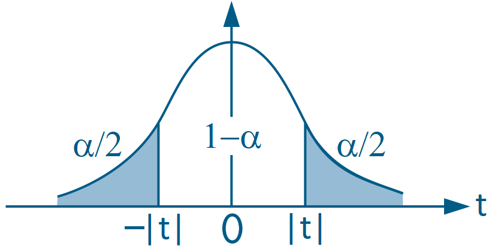

---
date: "2018-09-09T00:00:00Z"
# icon: book
# icon_pack: fas
linktitle: "Hypothesis Testing"
summary: "Hypothesis testing notes for econometrics, covering Wald tests, F-tests, linear restrictions, p-values, and matrix-based testing in R."
title: "Hypothesis Testing in Econometrics"
weight: 9
output: md_document
type: book
---


- We now turn to more general forms of hypothesis testing that are not usually reported automatically in basic regression output.


## Wald Test
- Consider:
  - $G$: the number of linear restrictions;
  - $\boldsymbol{\beta}$: the $(K+1) \times 1$ parameter vector;
  - $\boldsymbol{h}$: a $G \times 1$ vector of constants;
  - $\boldsymbol{R}$: a $G \times (K+1)$ matrix made up of row vectors $\boldsymbol{r}'_g$ of dimension $1 \times (K+1)$, for $g=1, 2, ..., G$;
  - the multivariate model:
  
  $$y = \beta_0 + \beta_1 x_1 + \beta_2 x_2 + ... + \beta_K x_K + u$$

- Using these matrices and vectors, we can write hypothesis tests of the form:
\begin{align}
\text{H}_0: &\underset{G\times (K+1)}{\boldsymbol{R}} \underset{(K+1)\times 1}{\boldsymbol{\beta}} = \underset{G \times 1}{\boldsymbol{h}} \\
\text{H}_0: &\left[ \begin{matrix} \boldsymbol{r}'_1 \\ \boldsymbol{r}'_2 \\ \vdots \\ \boldsymbol{r}'_{G} \end{matrix} \right] \boldsymbol{\beta} = \left[ \begin{matrix} h_1 \\ h_2 \\ \vdots \\ h_G \end{matrix} \right] \\
\text{H}_0: &\left\{ \begin{matrix} \boldsymbol{r}'_1 \boldsymbol{\beta} = h_1 \\ \boldsymbol{r}'_2 \boldsymbol{\beta} = h_2 \\ \vdots \\ \boldsymbol{r}'_G \boldsymbol{\beta} = h_G \end{matrix} \right.
\end{align}


### A Single Linear Restriction

- Consider the model:
  $$y = \beta_0 + \beta_1 x_1 + \beta_2 x_2 + u$$

- There are $K=2$ explanatory variables, hence 3 parameters.
- One linear restriction implies $G=1$.
- In this specific case,
$$\boldsymbol{R} = \boldsymbol{r}'_1\ \implies\ \text{H}_0:\ \boldsymbol{r}'_1 \boldsymbol{\beta} = h_1 $$


#### Example 1: H$_0: \ \beta_1 = 4$
- Here $h_1 = 4$
- The vector $r'_1$ can be written as

$$ r'_1 = \left[ \begin{matrix} 0 & 1 & 0 \end{matrix} \right] $$

- So the null hypothesis is
$$\text{H}_0:\ \left[ \begin{matrix} 0 & 1 & 0 \end{matrix} \right] \left[ \begin{matrix} \beta_0 \\ \beta_1 \\ \beta_2 \end{matrix} \right] = 4\ \iff\ \beta_1 = 4 $$


#### Example 2: H$_0: \ \beta_1 + \beta_2 = 2$
- Here $h_1 = 2$
- The vector $r'_1$ can be written as

$$ r'_1 = \left[ \begin{matrix} 0 & 1 & 1 \end{matrix} \right] $$

- So the null hypothesis is
$$\text{H}_0:\ \left[ \begin{matrix} 0 & 1 & 1 \end{matrix} \right] \left[ \begin{matrix} \beta_0 \\ \beta_1 \\ \beta_2 \end{matrix} \right] = 2\ \iff\ \beta_1 + \beta_2 = 2 $$


#### Example 3: H$_0: \ \beta_1 = \beta_2$
- Note that
$$\beta_1 = \beta_2 \iff \beta_1 - \beta_2 = 0 $$

- Therefore $h_1 = 0$
- The vector $r'_1$ can be written as

$$ r'_1 = \left[ \begin{matrix} 0 & 1 & -1 \end{matrix} \right] $$

- So the null hypothesis is
$$\text{H}_0:\ \left[ \begin{matrix} 0 & 1 & -1 \end{matrix} \right] \left[ \begin{matrix} \beta_0 \\ \beta_1 \\ \beta_2 \end{matrix} \right] = 0\ \iff\ \beta_1 - \beta_2 = 0 $$


#### Implementing It in R

#### Evaluating the Null with a Single Restriction
- In the case of a single restriction, we assume that
$$ \boldsymbol{r}'_1 \hat{\boldsymbol{\beta}} \sim N(\boldsymbol{r}'_1 \hat{\boldsymbol{\beta}};\ \boldsymbol{r}'_1 \boldsymbol{V_{\beta(x)} r_1})$$

- The corresponding _t_ statistic is
$$ t = \frac{\boldsymbol{r}'_1 \hat{\boldsymbol{\beta}} - h_1}{\sqrt{\boldsymbol{r}'_1 S^2 (\boldsymbol{X}'\boldsymbol{X})^{-1} \boldsymbol{r}_1}} = \frac{\boldsymbol{r}'_1 \hat{\boldsymbol{\beta}} - h_1}{\sqrt{\boldsymbol{r}'_1 \boldsymbol{V_{\beta(x)}} \boldsymbol{r}_1}} $$

- In small samples, we also need to assume that $ u|x \sim N(0; \sigma^2) $.
- Choose a significance level $\alpha$ and reject the null if the _t_ statistic falls outside the acceptance region.


##### (Continued) Example 7.5: The Log Wage Equation (Wooldridge, 2006)
- Earlier, we estimated the following model:

\begin{align}
\log(\text{wage}) = &\beta_0 + \beta_1 \text{female} + \beta_2 \text{married} + \delta_2 \text{female*married} + \beta_3 \text{educ} +\\
&\beta_4 \text{exper} + \beta_5 \text{exper}^2 + \beta_6 \text{tenure} + \beta_7 \text{tenure}^2 + u \end{align}
where:

- `wage`: average hourly wage
- `female`: dummy equal to 1 for women and 0 for men
- `married`: dummy equal to 1 for married individuals and 0 for unmarried individuals
- `female*married`: interaction between the `female` and `married` dummies
- `educ`: years of education
- `exper`: years of experience (`expersq` = years squared)
- `tenure`: years with the current employer (`tenursq` = years squared)


```r
# Load the required dataset
data(wage1, package="wooldridge")

# Estimate the model
res_7.14 = lm(lwage ~ female*married + educ + exper + expersq + tenure + tenursq, data=wage1)
round( summary(res_7.14)$coef, 4 )
```

```
##                Estimate Std. Error t value Pr(>|t|)
## (Intercept)      0.3214     0.1000  3.2135   0.0014
## female          -0.1104     0.0557 -1.9797   0.0483
## married          0.2127     0.0554  3.8419   0.0001
## educ             0.0789     0.0067 11.7873   0.0000
## exper            0.0268     0.0052  5.1118   0.0000
## expersq         -0.0005     0.0001 -4.8471   0.0000
## tenure           0.0291     0.0068  4.3016   0.0000
## tenursq         -0.0005     0.0002 -2.3056   0.0215
## female:married  -0.3006     0.0718 -4.1885   0.0000
```

- We already know that the effect of marriage differs between women and men because the coefficient on `female:married` ($\delta_2$) is significant.
- However, to assess whether the effect of marriage on women's wages is itself significant, we need to test whether H$_0 :\ \beta_2 + \delta_2 = 0$.
- Since there is only one restriction, the hypothesis can be evaluated with a _t_ test:




```r
# Extract regression objects
bhat = matrix(coef(res_7.14), ncol=1) # coefficients as a column vector
Vbhat = vcov(res_7.14) # variance-covariance matrix of the estimator
N = nrow(wage1) # number of observations
K = length(bhat) - 1 # number of covariates
uhat = residuals(res_7.14) # regression residuals

# Create the row vector that defines the restriction
r1prime = matrix(c(0, 0, 1, 0, 0, 0, 0, 0, 1), nrow=1) # restriction vector
h1 = 0 # constant under H0
G = 1 # number of restrictions

# Compute the t test
t = (r1prime %*% bhat - h1) / sqrt(r1prime %*% Vbhat %*% t(r1prime))
abs(t)
```

```
##          [,1]
## [1,] 1.679475
```

```r
# Compute the 5% two-sided critical value
c = qt(1 - 0.05/2, df=N-K-1)
c
```

```
## [1] 1.964563
```

```r
# Compute the p-value
p = pt(-abs(t), N-K-1) * 2
p
```

```
##            [,1]
## [1,] 0.09366368
```

- Since $|t| < 2$ (an approximate 5\% critical value), we do not reject the null hypothesis and conclude that the effect of marriage on women's wages ($\beta_2 + \delta_2$) is not statistically significant.

- We can also evaluate the same restriction using the Wald test and the $\chi^2$ distribution with 1 degree of freedom, since there is only one restriction ($G=1$).
- Remember that the chi-squared test is right-tailed.


```r
# Compute the Wald statistic
aux = r1prime %*% bhat - h1 # R beta - h
w = t(aux) %*% solve( r1prime %*% Vbhat %*% t(r1prime)) %*% aux
w
```

```
##          [,1]
## [1,] 2.820636
```

```r
# Compute the 5% chi-squared critical value
c = qchisq(1-0.05, df=G)
c
```

```
## [1] 3.841459
```

```r
# Compute the p-value of w
p = 1 - pchisq(w, df=G)
p
```

```
##            [,1]
## [1,] 0.09305951
```


</br>


### Multiple Linear Restrictions

#### Example 4: H$_0: \ \beta_1 = 0\ \text{ e }\ \beta_1 + \beta_2 = 2$
- Here $h_1 = 0 \text{ and } h_2 = 2$
- The vectors $r'_1 \text{ and } r'_2$ can be written as

$$ r'_1 = \left[ \begin{matrix} 0 & 1 & 0 \end{matrix} \right] \quad \text{e} \quad r'_2 = \left[ \begin{matrix} 0 & 1 & 1 \end{matrix} \right] $$

- Therefore, $\boldsymbol{R}$ is
$$ \boldsymbol{R} = \left[ \begin{matrix} \boldsymbol{r}'_1 \\ \boldsymbol{r}'_2 \end{matrix} \right] = \left[ \begin{matrix} 0 & 1 & 0 \\ 0 & 1 & 1 \end{matrix} \right] $$

- So the null hypothesis is
$$\text{H}_0:\ \boldsymbol{R} \boldsymbol{\beta} = \left[ \begin{matrix} 0 & 1 & 0 \\ 0 & 1 & 1 \end{matrix} \right] \left[ \begin{matrix} \beta_0 \\ \beta_1 \\ \beta_2 \end{matrix} \right] = \left[ \begin{matrix} h_1 \\ h_2 \end{matrix} \right]\ \iff\ \text{H}_0:\ \left\{  \begin{matrix} \beta_1 &= 0 \\ \beta_1 + \beta_2 &= 2 \end{matrix} \right. $$


#### Evaluating the Null with Multiple Restrictions
- In the case of _G_ restrictions, we assume that
$$ \boldsymbol{R} \hat{\boldsymbol{\beta}} \sim N(\boldsymbol{R} \hat{\boldsymbol{\beta}};\ \sigma^2 \boldsymbol{R} \boldsymbol{V_{\beta(x)} R'})$$

- The Wald statistic is
$$ w(\hat{\boldsymbol{\beta}}) = \left[ \boldsymbol{R}\hat{\boldsymbol{\beta}} - \boldsymbol{h} \right]' \left[ \boldsymbol{R V_{\hat{\beta}} R}' \right]^{-1} \left[ \boldsymbol{R}\hat{\boldsymbol{\beta}} - \boldsymbol{h} \right]\ \sim\ \chi^2_{(G)} $$

- Choose a significance level $\alpha$ and reject the null if the statistic $ w(\hat{\boldsymbol{\beta}})$ exceeds the critical value.

</br>

### Implementing It in R

- As an example, we use the `mlb1` dataset with statistics for Major League Baseball players (Wooldridge, 2006, Section 4.5).
- We want to estimate the model:
\begin{align} \log(\text{salary}) = &\beta_0 + \beta_1. \text{years} + \beta_2. \text{gameyr} + \beta_3. \text{bavg} + \\
&\beta_4 .\text{hrunsyr} + \beta_5. \text{rbisyr} + u \end{align}


where:
  - `log(salary)`: log of 1993 salary
  - `years`: years playing in Major League Baseball
  - `gamesyr`: average number of games per year
  - `bavg`: career batting average
  - `hrunsyr`: average home runs per year
  - `rbisyr`: average runs batted in per year


```r
data(mlb1, package="wooldridge")

# Estimate the full (unrestricted) model
resMLB = lm(log(salary) ~ years + gamesyr + bavg + hrunsyr + rbisyr, data=mlb1)
round(summary(resMLB)$coef, 5) # estimated coefficients
```

```
##             Estimate Std. Error  t value Pr(>|t|)
## (Intercept) 11.19242    0.28882 38.75184  0.00000
## years        0.06886    0.01211  5.68430  0.00000
## gamesyr      0.01255    0.00265  4.74244  0.00000
## bavg         0.00098    0.00110  0.88681  0.37579
## hrunsyr      0.01443    0.01606  0.89864  0.36947
## rbisyr       0.01077    0.00717  1.50046  0.13440
```

- Notice that `bavg`, `hrunsyr`, and `rbisyr` are individually statistically insignificant.
- We want to evaluate whether they are jointly significant, that is,
$$ \text{H}_0:\ \left\{ \begin{matrix} \beta_3 = 0 \\ \beta_4 = 0 \\ \beta_5 = 0\end{matrix} \right.   $$

- Therefore,
$$ \boldsymbol{R} = \left[ \begin{matrix} \boldsymbol{r}'_1 \\ \boldsymbol{r}'_2 \\ \boldsymbol{r}'_3 \end{matrix} \right] = \left[ \begin{matrix} 0 & 0 & 0 & 1 & 0 & 0 \\ 0 & 0 & 0 & 0 & 1 & 0 \\ 0 & 0 & 0 & 0 & 0 & 1 \end{matrix} \right] $$


#### Using the `Wald.test()` Function


```r
# Extract the variance-covariance matrix of the estimator
Vbhat = vcov(resMLB)
round(Vbhat, 5)
```

```
##             (Intercept)    years  gamesyr     bavg  hrunsyr   rbisyr
## (Intercept)     0.08342  0.00001 -0.00027 -0.00029 -0.00148  0.00082
## years           0.00001  0.00015 -0.00001  0.00000 -0.00002  0.00001
## gamesyr        -0.00027 -0.00001  0.00001  0.00000  0.00002 -0.00002
## bavg           -0.00029  0.00000  0.00000  0.00000  0.00000  0.00000
## hrunsyr        -0.00148 -0.00002  0.00002  0.00000  0.00026 -0.00010
## rbisyr          0.00082  0.00001 -0.00002  0.00000 -0.00010  0.00005
```

```r
# Compute the Wald statistic
# install.packages("aod") # install the required package
aod::wald.test(Sigma = Vbhat, # variance-covariance matrix
               b = coef(resMLB), # estimates
               Terms = 4:6, # positions of the parameters being tested
               H0 = c(0, 0, 0) # null hypothesis (all equal to zero)
               )
```

```
## Wald test:
## ----------
## 
## Chi-squared test:
## X2 = 28.7, df = 3, P(> X2) = 2.7e-06
```

```r
# Wald test for the effect of root
# aod::wald.test(b = coef(resMLB), Sigma = vcov(resMLB), L=R, H0=h)
```

- We reject the null hypothesis and conclude that the parameters $\beta_3, \beta_4 \text{ and } \beta_5$ are jointly significant.


#### Computing It "By Hand"

- Estimate the model

```r
# Create the variable log_salary
mlb1$log_salary = log(mlb1$salary)
name_y = "log_salary"
names_X = c("years", "gamesyr", "bavg", "hrunsyr", "rbisyr")

# Create vector y
y = as.matrix(mlb1[,name_y]) # convert data-frame column into a matrix

# Create the covariate matrix X with a leading column of 1s
X = as.matrix( cbind( const=1, mlb1[,names_X] ) ) # bind 1s to the covariates

# Retrieve N and K
N = nrow(mlb1)
K = ncol(X) - 1

# Estimate the model
bhat = solve( t(X) %*% X ) %*% t(X) %*% y
round(bhat, 5)
```

```
##             [,1]
## const   11.19242
## years    0.06886
## gamesyr  0.01255
## bavg     0.00098
## hrunsyr  0.01443
## rbisyr   0.01077
```

```r
# Compute residuals
uhat = y - X %*% bhat

# Error-term variance
S2 = as.numeric( t(uhat) %*% uhat / (N-K-1) )

# Variance-covariance matrix of the estimator
Vbhat = S2 * solve( t(X) %*% X )
round(Vbhat, 5)
```

```
##            const    years  gamesyr     bavg  hrunsyr   rbisyr
## const    0.08342  0.00001 -0.00027 -0.00029 -0.00148  0.00082
## years    0.00001  0.00015 -0.00001  0.00000 -0.00002  0.00001
## gamesyr -0.00027 -0.00001  0.00001  0.00000  0.00002 -0.00002
## bavg    -0.00029  0.00000  0.00000  0.00000  0.00000  0.00000
## hrunsyr -0.00148 -0.00002  0.00002  0.00000  0.00026 -0.00010
## rbisyr   0.00082  0.00001 -0.00002  0.00000 -0.00010  0.00005
```

- Now create the restriction matrix:

```r
# Number of restrictions
G = 3

# Restriction matrix
R = matrix(c(0, 0, 0, 1, 0, 0,
             0, 0, 0, 0, 1, 0,
             0, 0, 0, 0, 0, 1),
           nrow=G, byrow=TRUE)
R
```

```
##      [,1] [,2] [,3] [,4] [,5] [,6]
## [1,]    0    0    0    1    0    0
## [2,]    0    0    0    0    1    0
## [3,]    0    0    0    0    0    1
```

```r
# Vector of constants h
h = matrix(c(0, 0, 0),
           nrow=3, ncol=1)
h
```

```
##      [,1]
## [1,]    0
## [2,]    0
## [3,]    0
```

- Remember that `matrix()` fills by column by default.
- Here it is more intuitive to fill the restrictions by row, since each row represents one restriction. That is why we used `byrow=TRUE`.
- The Wald statistic is then
$$ w(\hat{\boldsymbol{\beta}}) = \left[ \boldsymbol{R}\hat{\boldsymbol{\beta}} - \boldsymbol{h} \right]' \left[ \boldsymbol{R V_{\hat{\beta}} R}' \right]^{-1} \left[ \boldsymbol{R}\hat{\boldsymbol{\beta}} - \boldsymbol{h} \right]\ \sim\ \chi^2_{(G)} $$


```r
# Wald statistic
w = t( R %*% bhat - h ) %*% solve( R %*% Vbhat %*% t(R) ) %*% (R %*% bhat - h)
w
```

```
##          [,1]
## [1,] 28.65076
```

```r
# Find the 5% chi-squared critical value
alpha = 0.05
c = qchisq(1-alpha, df=G)
c
```

```
## [1] 7.814728
```

```r
# Compare the Wald statistic with the critical value
w > c
```

```
##      [,1]
## [1,] TRUE
```

- Since the Wald statistic (= 28.65) is greater than the critical value (= 7.81), we reject the joint null that all tested parameters are equal to zero.
- We can also evaluate the p-value from the Wald statistic:

```r
1 - pchisq(w, df=G)
```

```
##              [,1]
## [1,] 2.651604e-06
```

- Because it is below 5%, we reject the null hypothesis.


</br>


## F Test

- [Section 4.3 of Heiss (2020)](http://www.urfie.net/read/index.html#page/133)
- Another way to evaluate multiple restrictions is with the F test.
- Here we estimate two models:
  - unrestricted: includes all explanatory variables of interest;
  - restricted: excludes some variables.
- The F test compares the residual sum of squares (RSS) or the R$^2$ of the two models.
- The intuition is straightforward: if the excluded variables are jointly significant, the unrestricted model should fit the data better.

</br>

- The _F_ statistic can be computed as

$$ F = \frac{\text{SQR}_{r} - \text{SQR}_{ur}}{\text{SQR}_{ur}}.\frac{N-K-1}{G} = \frac{R^2_{ur} - R^2_{r}}{1 - R^2_{ur}}.\frac{N-K-1}{G} \tag{4.10} $$

where `ur` denotes the unrestricted model and `r` denotes the restricted model.

- We then evaluate the statistic using a right-tailed F test:


### Implementing It in R

- We continue using the `mlb1` dataset from Section 4.5 of Wooldridge (2006).
- The unrestricted model, with all explanatory variables, is
\begin{align} \log(\text{salary}) = &\beta_0 + \beta_1. \text{years} + \beta_2. \text{gameyr} + \beta_3. \text{bavg} + \\
&\beta_4 .\text{hrunsyr} + \beta_5. \text{rbisyr} + u \end{align}

- The restricted model, which excludes the tested variables, is
\begin{align} \log(\text{salary}) = &\beta_0 + \beta_1. \text{years} + \beta_2. \text{gameyr} + u \end{align}


#### Using `linearHypothesis()`
- We can run the F test with the `linearHypothesis()` function from the `car` package.
- In addition to the estimated model object, we provide a character vector listing the restrictions:


```r
# Estimate the unrestricted model
res.ur = lm(log(salary) ~ years + gamesyr + bavg + hrunsyr + rbisyr, data=mlb1)

# Create a vector with the restrictions
myH0 = c("bavg = 0", "hrunsyr = 0", "rbisyr = 0")

# Apply the F test
# install.packages("car") # install the required package
car::linearHypothesis(res.ur, myH0)
```

```
## Linear hypothesis test
## 
## Hypothesis:
## bavg = 0
## hrunsyr = 0
## rbisyr = 0
## 
## Model 1: restricted model
## Model 2: log(salary) ~ years + gamesyr + bavg + hrunsyr + rbisyr
## 
##   Res.Df    RSS Df Sum of Sq      F    Pr(>F)    
## 1    350 198.31                                  
## 2    347 183.19  3    15.125 9.5503 4.474e-06 ***
## ---
## Signif. codes:  0 '***' 0.001 '**' 0.01 '*' 0.05 '.' 0.1 ' ' 1
```

- Notice that in the second row, which corresponds to the unrestricted model, the residual sum of squares (RSS) is smaller than in the restricted model. Hence the larger set of covariates provides more explanatory power, as expected.
- To evaluate the null hypothesis ($\beta_3 = \beta_4 = \beta_5 = 0$), we can either compare the _F_ statistic with a critical value or compare the p-value with the chosen significance level.
- From the p-value criterion above, we reject the null hypothesis.
- The 5% critical value can be obtained with:


```r
qf(1-0.05, G, N-K-1)
```

```
## [1] 2.630641
```
- Since 9.55 > 2.63, we reject the null hypothesis.


#### Computing It "By Hand"

- Here we use the unrestricted and restricted models estimated with `lm()` so that we do not need to redo the full estimation procedure twice.


```r
# Estimate the unrestricted model
res.ur = lm(log(salary) ~ years + gamesyr + bavg + hrunsyr + rbisyr, data=mlb1)

# Estimate the restricted model
res.r = lm(log(salary) ~ years + gamesyr, data=mlb1)

# Extract the R2 from each fitted model
r2.ur = summary(res.ur)$r.squared
r2.ur
```

```
## [1] 0.6278028
```

```r
r2.r = summary(res.r)$r.squared
r2.r
```

```
## [1] 0.5970716
```

```r
# Compute the F statistic
F = ( r2.ur - r2.r ) / (1 - r2.ur) * (N-K-1) /  G
F
```

```
## [1] 9.550254
```

```r
# p-value of the F test
1 - pf(F, G, N-K-1)
```

```
## [1] 4.473708e-06
```


</br>


